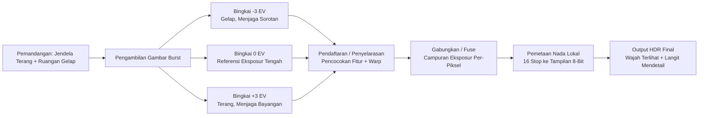
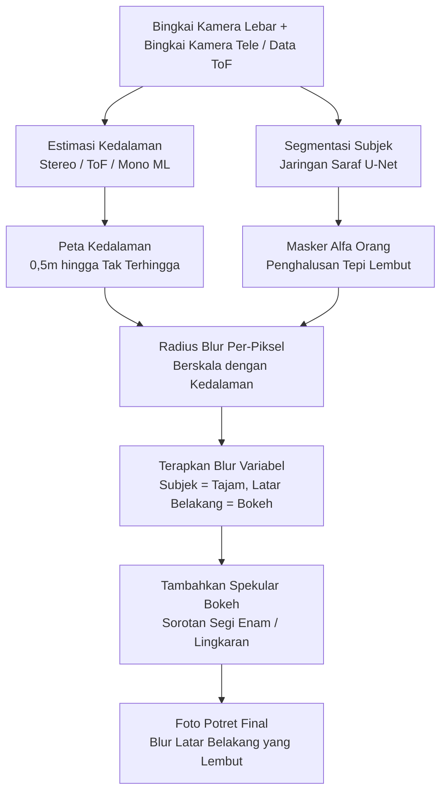
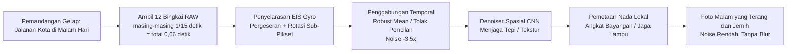
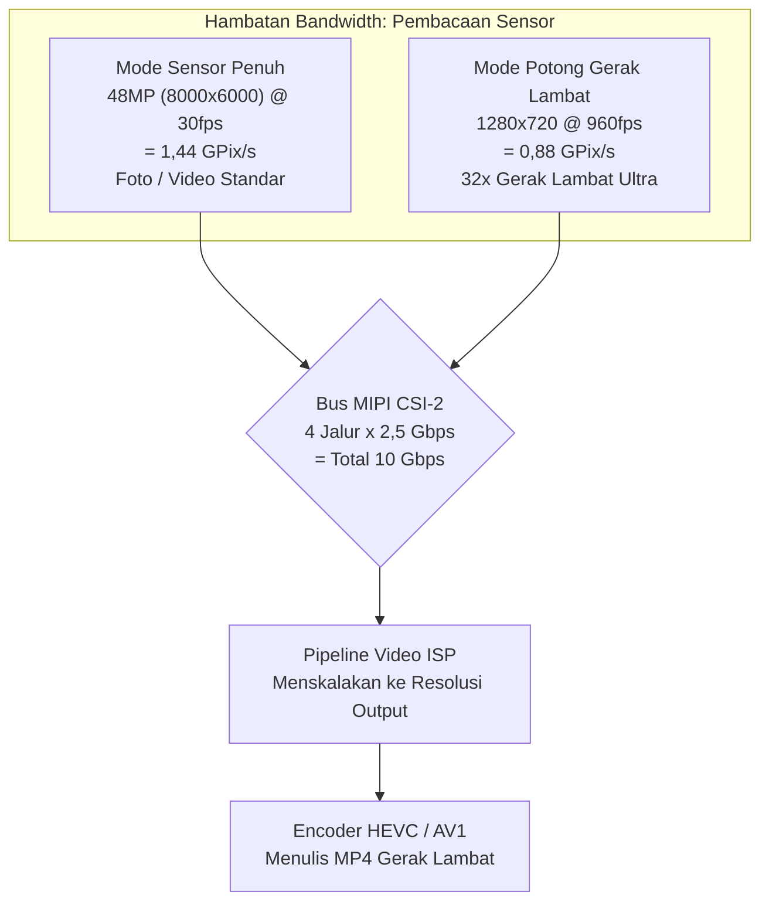
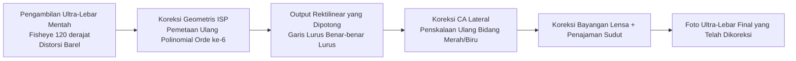
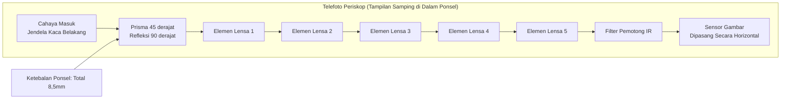
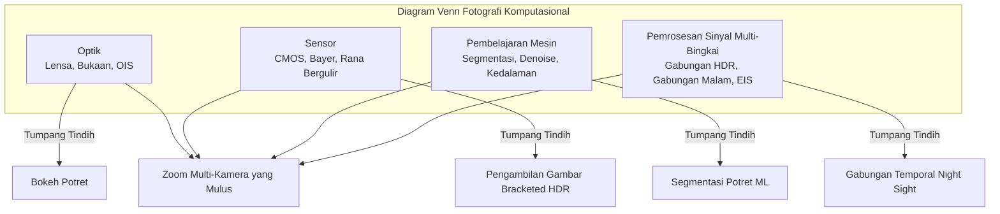

# Bab 3: Fotografi Smartphone Modern

Bab 2 memberi Anda dasar-dasar perangkat keras: lensa, sensor, pipeline ISP, dan modul multi-kamera. Bab ini menjawab pertanyaan lanjutan yang alami: **Bagaimana aplikasi kamera modern sebenarnya menggunakan perangkat keras tersebut untuk menghasilkan foto yang saya lihat di Instagram?**

Smartphone tahun 2010 mengambil satu eksposur, menjalankannya melalui ISP dasar, dan menulis JPEG. Smartphone tahun 2026 secara rutin mengambil 5 hingga 15 bingkai terpisah untuk satu foto diam, menyelaraskannya dengan presisi sub-piksel menggunakan data giroskop, menggabungkannya menggunakan pemrosesan sinyal multi-bingkai, menjalankan hasilnya melalui jaringan saraf untuk segmentasi semantik atau estimasi kedalaman, dan akhirnya memetakan nadanya ke dalam satu gambar yang dapat dibagikan — semuanya dalam rentang satu kali penekanan tombol rana.

Bab ini adalah tur fitur demi fitur dari fotografi smartphone modern. Kami akan menjelaskan bagaimana setiap fitur bekerja pada tingkat perangkat keras + perangkat lunak, tanpa kode API Camera2 apa pun. Tujuannya adalah untuk membangun kosakata tentang apa yang dapat dilakukan oleh sistem kamera modern, sehingga ketika Anda nanti menulis kode untuk mengontrol fitur-fitur ini, Anda tahu apa yang terjadi di balik layar.

## HDR: High Dynamic Range Multi-Frame Fusion

**Rentang dinamis (Dynamic range)** adalah rasio antara bagian paling terang dan paling gelap dari sebuah pemandangan yang dapat direkam oleh sistem pencitraan secara bersamaan tanpa terpotong (clipping). Mata manusia dapat merasakan kira-kira 20 stop rentang dinamis (rasio kontras 1.000.000:1) dalam satu pandangan, berkat adaptasi sakadik. Eksposur sensor smartphone tunggal dapat menangkap kira-kira 10 hingga 12 stop pada ISO dasar. Kesenjangan antara kedua angka tersebut adalah alasan mengapa HDR ada.

Bayangkan Anda sedang mengambil foto di dalam ruangan dengan jendela terang di belakang subjek Anda. Jika Anda mengatur eksposur untuk wajah orang tersebut (katakanlah 1/30 detik, ISO 400), jendela akan menjadi putih bersih yang terpotong — tidak ada langit, tidak ada awan, tidak ada detail. Jika Anda mengatur eksposur untuk jendela (1/2000 detik, ISO 50), wajah orang tersebut menjadi siluet hitam. Tidak ada satu pun eksposur tunggal yang berhasil.

### Cara Kerja HDR Smartphone

Setiap sistem HDR pada ponsel modern menggunakan **bracketing multi-bingkai** diikuti oleh penggabungan komputasional. Algoritmanya bekerja seperti ini:

1. **Pengambilan gambar bracketed**: Kamera mengambil rentetan cepat 3 hingga 10 bingkai berturut-turut pada nilai eksposur (EV) yang berbeda. Kumpulan yang umum mungkin berupa bingkai pada -3 EV (sangat pendek, menjaga sorotan), -1 EV, +1 EV, dan +3 EV (sangat panjang, menangkap bayangan). Sensor dan VCM dijaga tetap diam sempurna selama rentetan tersebut; hanya pengaturan waktu rana elektronik yang berubah.
2. **Pemilihan bingkai referensi**: Algoritma memilih bingkai eksposur tengah yang paling tajam sebagai referensi geometris.
3. **Pendaftaran / penyelarasan gambar**: Setiap bingkai non-referensi diselaraskan secara komputasional dengan referensi. Algoritma menemukan fitur titik kunci yang khas (sudut, tepi) menggunakan algoritma seperti FAST atau SIFT, menghitung transformasi affine atau homografi yang memetakan fitur setiap bingkai ke bingkai referensi, dan melengkungkan piksel sesuai kebutuhan. Setiap bingkai yang terlalu kabur (akibat getaran mikro selama rentetan) akan dibuang sepenuhnya.
4. **Penggabungan (Fusion)**: Untuk setiap lokasi piksel pada gambar final, algoritma menggabungkan informasi dari bingkai yang telah diselaraskan. Piksel yang kurang eksposur (underexposed) menyumbangkan data sorotan yang bersih dan tidak terpotong. Piksel yang kelebihan eksposur (overexposed) menyumbangkan data bayangan dengan noise rendah. Piksel nada tengah dirata-ratakan di semua bingkai untuk mengurangi noise shot.
5. **Pemetaan nada (Tone mapping)**: Gambar linear yang digabungkan — yang sekarang mungkin berisi 14 hingga 18 stop rentang dinamis yang dapat digunakan — dikompresi melalui operator pemetaan nada lokal yang canggih menjadi gambar output 8-bit atau 10-bit yang terlihat bagus pada tampilan sRGB standar.

Contoh dunia nyata: Galaxy S26 Ultra dalam mode default "Scene Optimizer HDR" secara internal menembakkan 7 bingkai bracketed dengan total waktu pengambilan gambar sekitar 0,2 detik. Deteksi gerakan tangan bawaan membuang 2 bingkai yang kabur. 5 bingkai sisanya diselaraskan, digabungkan, dan dipetakan nadanya. Outputnya ditulis sebagai **file JPEG_R Ultra HDR** pada perangkat Android 14+: gambar utama JPEG standar (SDR 8-bit) dengan peta penguatan (gain map) tertanam yang dapat digunakan oleh penampil yang mendukung HDR (Galeri Android 14, Chrome 120+, Adobe Lightroom) untuk merekonstruksi rentang luminans HDR 10-bit penuh pada layar HDR10 atau Dolby Vision.

### Kapan HDR Berhasil dan Kapan Tidak

HDR unggul pada pemandangan statis dengan sorotan terang dan bayangan dalam: pemandangan alam, potret dengan cahaya latar, ruangan dengan jendela, matahari terbenam di atas air. Ia gagal secara aktif — menghasilkan artefak ghosting — ketika objek dalam pemandangan bergerak selama rentetan bracketed: burung yang terbang, bendera yang melambai, orang yang berkedip, anak yang berlari. Algoritma HDR bertenaga AI modern mendeteksi dan melakukan segmentasi pada objek yang bergerak, hanya mencampurkan bingkai referensi untuk piksel-piksel tersebut untuk menghindari "hantu" HDR klasik.

## Mode Potret: Bokeh melalui Estimasi Kedalaman

Mode potret menghasilkan estetika di mana wajah subjek tampak tajam sempurna dan latar belakang meluruh menjadi blur yang lembut dan kental yang disebut **bokeh**. Kamera tradisional mencapai hal ini secara optik dengan sensor besar, bukaan lebar, dan panjang fokus yang panjang. Smartphone mencapainya secara komputasional, karena sensor 1/1,3 inci pada f/1.6 tidak secara alami menghasilkan kedalaman bidang dangkal yang cukup untuk efek tersebut.

### Tiga Metode Estimasi Kedalaman Smartphone

Ada tiga teknik independen yang digunakan oleh sistem potret modern; banyak ponsel menggunakan kombinasi dari ketiganya.

**Metode 1: Disparitas Stereo dari Kamera Ganda.** Ini adalah metode yang paling tua dan secara geometris paling solid. Ponsel menembakkan kamera lebar dan kamera telefoto secara bersamaan pada subjek yang sama. Karena kedua kamera dipisahkan secara fisik sejauh 10 hingga 15 milimeter ("garis dasar"), mereka melihat subjek dari posisi horizontal yang sedikit berbeda. Posisi objek di latar depan bergeser lebih banyak di antara dua sudut pandang tersebut daripada posisi objek di latar belakang yang jauh. Pergeseran ini disebut **disparitas**. Algoritma menjalankan pencocokan blok atau algoritma pencocokan semi-global (SGM) pada dua gambar yang telah diperbaiki (rectified) untuk menghitung nilai disparitas bagi setiap piksel. Disparitas berbanding terbalik dengan kedalaman, sehingga peta disparitas diubah langsung menjadi peta kedalaman per-piksel.

**Metode 2: Penginderaan Kedalaman Aktif ToF / LiDAR.** Sensor kedalaman ToF (Time-of-Flight) atau LiDAR memproyeksikan pola terstruktur berisi 30.000+ titik laser inframerah dekat ke pemandangan, lalu mengukur waktu pulang-pergi (untuk ToF langsung) atau pergeseran fase (untuk ToF tidak langsung) dari cahaya yang dipantulkan untuk menghitung kedalaman metrik yang sebenarnya dalam meter untuk setiap piksel. ToF menghasilkan peta kedalaman yang akurat dan padat bahkan dalam kegelapan total dan pada permukaan tanpa tekstur (dinding polos, langit) di mana pencocokan stereo gagal. Sistem potret modern biasanya menggunakan ToF sebagai petunjuk kedalaman kebenaran dasar (ground-truth) dan disparitas stereo sebagai sinyal penyempurnaan.

**Metode 3: Estimasi Kedalaman ML Monokular.** Untuk ponsel kamera tunggal (atau untuk kamera selfie menghadap ke depan, yang tidak memiliki pasangan stereo), jaringan saraf memperkirakan kedalaman dari satu gambar RGB. Model tersebut, yang dilatih pada jutaan gambar dengan label kedalaman ground-truth, mempelajari petunjuk statistik yang digunakan manusia untuk menilai kedalaman: ukuran relatif, oklusi, perspektif linear, gradien tekstur, blur defokus, dan perspektif atmosfer. Arsitektur PortraitNet dari Google dan DeepLabV3+ dari Meta adalah arsitektur yang mewakili. Kedalaman monokular kurang akurat secara metrik dibandingkan stereo atau ToF, tetapi cukup untuk bokeh potret yang terlihat masuk akal.

### Pipeline Perenderingan Potret

Setelah peta kedalaman diperoleh, langkah-langkah sisanya sama terlepas dari metode estimasi kedalaman mana yang digunakan:

1. **Segmentasi Subjek**: Jaringan saraf segmentasi semantik terpisah (biasanya varian U-Net) berjalan pada gambar kamera RGB utama dan menghasilkan masker alfa lembut yang mengidentifikasi piksel mana yang termasuk dalam "orang" vs "latar belakang". Masker tersebut dihaluskan (feathered) di bagian tepi — terutama di sekitar rambut, kacamata, dan detail halus latar depan — untuk menghindari tampilan potongan "boneka kertas" seperti pada mode potret awal tahun 2010-an.
2. **Penyempurnaan Kedalaman**: Peta kedalaman mentah dari Metode 1/2/3 dikalikan dengan masker segmentasi. Piksel latar belakang mempertahankan nilai kedalamannya; piksel subjek dikunci pada satu kedalaman bidang fokus.
3. **Blur Variabel Per-Piksel**: Setiap piksel latar belakang dikaburkan oleh Gaussian (atau, untuk mode "simulasi optik" premium, konvolusi kernel-lensa yang dirender secara fisik) yang radiusnya berskala secara linear dengan jarak piksel dari bidang fokus. Objek latar belakang pada jarak 5 meter mendapatkan blur yang berat; objek latar belakang pada jarak 1,5 meter mendapatkan blur yang ringan. Piksel subjek disalin tanpa perubahan.
4. **Silau Optik Buatan**: Sentuhan premium: sorotan spekular yang terang di latar belakang yang kabur (lampu jalan, pantulan, matahari) dirender sebagai bentuk segi enam atau lingkaran bokeh karakteristik lensa, bukan sekadar gumpalan Gaussian sederhana. Ini memberikan ilusi bahwa blur tersebut berasal dari diafragma lensa sungguhan.

## Mode Malam: Penggabungan Temporal Multi-Bingkai

Sebelum 2018, fotografi smartphone cahaya rendah pada dasarnya tidak dapat digunakan tanpa lampu kilat. Bar yang remang-remang atau jalanan kota di malam hari menghasilkan kekacauan yang ber-noise, berbintik, dan kabur. Kemudian Google merilis **Night Sight** pada Pixel 3, dan segalanya berubah. Wawasan intinya berlawanan dengan intuisi: alih-alih mengambil satu eksposur panjang 1 detik (yang pasti akan kabur akibat getaran tangan), ambillah 15 eksposur sangat pendek 1/15 detik (masing-masing tajam karena OIS aktif), lalu gabungkan dan rata-ratakan secara algoritmis. Total waktu eksposur terintegrasi tetap 1 detik, tetapi eksposur per bingkai cukup pendek sehingga blur getaran tangan tidak pernah menumpuk.

### Algoritma Mode Malam Langkah demi Langkah

1. **Pengambilan Gambar Burst**: Kamera mengambil 8 hingga 15 bingkai mentah. Setiap bingkai menggunakan waktu eksposur moderat (1/15 detik hingga 1/8 detik adalah umum) dan ISO moderat (800 hingga 3200). Bingkai individu ber-noise tetapi tidak kabur. Burst tersebut totalnya memakan waktu 0,5 hingga 2 detik waktu nyata.
2. **Penyelarasan EIS Berbantuan Gyro**: Giroskop IMU utama ponsel mencatat kecepatan sudut pada 8.000 Hz sepanjang burst. Untuk setiap bingkai, rotasi dan translasi kumulatif dari bingkai referensi dihitung. Setiap bingkai mentah kemudian digeser secara digital, diputar, dan sedikit diskalakan (Electronic Image Stabilization, EIS) pada NPU ke presisi sub-piksel, mendaftarkannya secara sempurna ke bingkai referensi bahkan jika tangan pengguna bergerak sejauh beberapa piksel blur selama burst.
3. **Penggabungan Piksel Temporal**: Untuk setiap lokasi piksel di 12 bingkai yang telah diselaraskan, algoritma mengumpulkan 12 kandidat nilai piksel. Ia kemudian melakukan penggabungan statistik yang kuat (robust statistical merging) daripada rata-rata sederhana: nilai pencilan (outlier) (yang disebabkan oleh piksel panas, hantaman sinar kosmik, atau lampu mobil yang melintasi titik itu) diidentifikasi dan dibuang. Nilai-nilai konsisten yang tersisa dirata-ratakan, mengurangi noise shot Gaussian sebesar faktor yang sama dengan akar kuadrat dari jumlah bingkai yang disimpan. Penggabungan 12 bingkai mengurangi noise sebesar 3,5×.
4. **Denoising Spasial**: Denoiser berbasis CNN (dilatih khusus pada citra malam mentah) menghilangkan noise frekuensi tinggi yang tersisa sambil tetap mempertahankan tepi dan tekstur asli.
5. **Pemetaan Nada Lokal**: Gambar mentah yang digabungkan memiliki rentang dinamis yang sangat tinggi. Operator pemetaan nada yang bervariasi secara spasial (berdasarkan penyaringan bilateral atau peta nada CNN yang dipelajari) mengangkat bayangan tanpa membuat lampu kota tampak terpotong, meningkatkan saturasi warna di wilayah gelap (yang jika tidak akan terlihat pucat), dan menghasilkan gambar 8-bit final yang terasa terang dan bersih, bukan redup dan suram.

"Nightography" dari Samsung, "Night Mode" dari Apple, "Night Mode 2.0" dari Xiaomi, dan "Ultra Dark Mode" dari OPPO semuanya menggunakan arsitektur algoritma yang secara substansial sama. Variasi ada pada jumlah bingkai yang tepat, pilihan statistik penggabungan yang kuat, arsitektur denoiser, dan tampilan peta nada, tetapi rata-rata temporal multi-bingkai yang selaras dengan gyro adalah universal di seluruh industri.

## Gerak Lambat (Slow Motion): Pengambilan Gambar Terpotong Kecepatan Tinggi

Video gerak lambat meregangkan waktu dengan mengambil bingkai video lebih cepat daripada laju pemutaran standar 30 fps, lalu memutarnya kembali pada kecepatan normal 30 fps. Pengganda yang umum:

- **Pengambilan 120 fps → Pemutaran 30 fps = 4× gerak lambat.** Peristiwa dunia nyata berdurasi 1 detik menjadi video berdurasi 4 detik.
- **240 fps → 30 fps = 8× gerak lambat.**
- **960 fps → 30 fps = 32× gerak lambat ultra.** Percikan tetesan air, balon yang meletus, atau kepakan sayap burung kolibri menjadi terlihat.

### Mengapa 960 fps Memerlukan Pemotongan (Crop) Sensor

Hambatan untuk pengambilan gambar dengan frame rate tinggi adalah **bandwidth pembacaan sensor**. Sensor gambar memiliki jumlah jalur MIPI CSI-2 yang terbatas yang berjalan pada laju data maksimum tetap (biasanya 2,5 Gbps per jalur, 4 jalur = total 10 Gbps). Sensor hanya dapat mengeluarkan sejumlah piksel tertentu per detik.

- Pembacaan bingkai penuh 48MP (8000×6000) pada 960 fps akan memerlukan 48.000.000 × 960 = 46,08 miliar piksel per detik. Itu adalah 30× bandwidth pembacaan aktual dari sensor smartphone tahun 2026 mana pun.
- Oleh karena itu, untuk mencapai 960 fps, sensor hanya boleh membaca potongan pusat kecil dari array pikselnya. Mode 960 fps biasanya berupa potongan 1280×720 (720p HD) atau terkadang 1920×1080 (1080p FHD). Bandwidth piksel total menjadi dapat dikelola: 1280×720×960 fps = 884 megapiksel per detik, yang pas dengan nyaman dalam 10 Gbps bahkan dengan pengkodean 10-bit per piksel.

Angka-angka dalam praktiknya: pengambilan 960 fps × 0,3 detik waktu nyata = 288 bingkai individu. Diputar kembali pada 30 fps = 9,6 detik video gerak lambat yang sangat halus. Beberapa ponsel unggulan Sony Xperia dan Samsung Galaxy mendukung burst singkat 960 fps pada resolusi 1080p dengan membaca sensor melalui bank konverter analog-ke-digital (ADC) yang terbatas hanya di wilayah potongan pusat.

Mode gerak lambat juga sering menggunakan teknik HDR bertingkat (staggered) di mana baris sensor yang bergantian diekspos untuk durasi yang berbeda untuk mempertahankan rentang dinamis yang tinggi bahkan pada 240 fps atau 960 fps.

## Ultra-Lebar: Koreksi Distorsi dan Kualitas Tepi

Kamera ultra-lebar pada ponsel unggulan modern menawarkan panjang fokus ekivalen full-frame 10–18mm dan bidang pandang diagonal 100° hingga 130°. Ini membuka kemungkinan komposisi yang tidak bisa dilakukan oleh kamera lebar standar: pemandangan alam yang luas, bidikan arsitektur yang menjulang di mana seluruh bangunan muat tanpa harus melangkah ke jalanan yang ramai, foto grup selfie yang benar-benar mencakup semua orang, dan efek "distorsi kedekatan jarak dekat" yang menyenangkan di mana objek yang dipegang dekat lensa tampak sangat besar dibandingkan dengan latar belakang.

Namun, panjang fokus ultra-lebar disertai dengan tiga cacat optik karakteristik yang harus diperbaiki oleh ISP sebelum foto dapat digunakan:

1. **Distorsi Geometris (Barel)**: Garis lurus melengkung ke luar seperti tepi lensa fisheye. Foto kusen pintu persegi panjang akan terlihat seperti bantal atau tong. Tahap Koreksi Distorsi Geometris ISP (lihat Bab 2) menerapkan pemetaan ulang koordinat per piksel menggunakan model lensa polinomial orde ke-4 atau ke-6 yang dikalibrasi untuk modul tertentu tersebut. Koreksi ini mau tidak mau memotong 5–10% bagian luar dari array sensor karena pemetaan ulang tersebut mendorong piksel terluar keluar dari kanvas.
2. **Aberasi Kromatik Lateral (LCA)**: Lensa membelokkan panjang gelombang cahaya yang berbeda dengan jumlah yang sedikit berbeda, sehingga gambar merah, hijau, dan biru dari titik di luar sumbu yang sama mendarat di koordinat piksel yang sedikit berbeda. Hasilnya adalah fringing warna yang terlihat (tepian ungu/hijau) pada objek kontras tinggi di dekat sudut. ISP memperbaiki LCA dengan menerapkan faktor pembesaran yang sedikit berbeda pada bidang warna merah dan biru relatif terhadap hijau.
3. **Vinyet / Kelembutan Sudut**: Piksel sudut menerima cahaya yang jauh lebih sedikit daripada piksel tengah (karena falloff alami cos⁴θ lensa ditambah vinyet mekanis dari barel lensa), dan MTF (Modulation Transfer Function) optik lensa lebih rendah pada sudut yang ekstrem sehingga sudut terlihat lembut. Tahap Koreksi Bayangan Lensa menerapkan penguatan (gain) yang simetris secara radial untuk meratakan pencahayaan, dan filter penajaman sadar tepi diterapkan lebih agresif di sudut daripada di tengah.

## Telefoto: Standar vs Periskop

Kamera telefoto menangkap subjek jauh yang tidak dapat diselesaikan oleh kamera lebar. Ponsel modern mengusung dua desain telefoto yang berbeda.

**Telefoto Standar (optik 2× hingga 3×):** Ini adalah modul kamera konvensional: barel lensa diletakkan tegak lurus dengan penutup belakang ponsel, tepat di atas sensor gambar, persis seperti kamera lebar tetapi dengan lensa panjang fokus yang lebih panjang. Telefoto 3× memiliki panjang fokus ekivalen full-frame ~72mm. Tumpukan fisik dibatasi oleh ketebalan ponsel (7–9mm), sehingga lensa tidak boleh lebih panjang dari itu. Oleh karena itu, batas praktis 3× untuk modul telefoto konvensional.

**Telefoto Periskop (optik 5× hingga 10×):** Untuk mendapatkan panjang fokus yang lebih panjang tanpa membuat ponsel lebih tebal, para insinyur melipat jalur optik 90° menggunakan prisma. Cahaya masuk melalui jendela di tepi ponsel atau kaca belakang, mengenai prisma siku-siku 45°, memantul 90° ke samping, dan kemudian merambat secara horizontal melalui barel lensa multi-elemen sepanjang 10–14mm yang berjalan sejajar dengan papan utama ponsel, akhirnya mendarat di sensor gambar yang dipasang miring di PCB. Prisma itu sendiri dipasang pada gimbal OIS 2-sumbu, dan sensornya terkadang dipasang pada OIS pergeseran sensor terpisah, memberikan total stabilisasi 4-sumbu atau 5-sumbu — cukup untuk mendapatkan foto genggam 10× yang tajam dari teks pada papan nama bangunan yang jauh.

Pada batas zoom antar kamera fisik (misalnya, 2,9× masih dipotong secara digital dari kamera lebar vs 3,1× menggunakan kamera telefoto periskop 3×), HAL melakukan trik penggabungan multi-kamera: untuk sekitar ±0,2× di sekitar titik pengalihan, ia menangkap kedua kamera secara bersamaan dan melakukan cross-fade yang dibobot oleh rasio zoom, sehingga pengguna tidak pernah melihat "lompatan" yang terlihat saat kamera fisik yang aktif berubah.

## Makro: Fotografi Jarak Dekat Ekstrem

Fotografi makro menangkap bidikan jarak dekat ekstrem dari subjek kecil: tekstur kelopak bunga, mata majemuk serangga, serat-serat kain, kristal gula individu pada kue.

Ada dua strategi makro pada ponsel modern:

**Kamera Makro Khusus:** Ponsel anggaran dan kelas menengah sering kali mengusung modul makro khusus beresolusi rendah (2MP hingga 5MP) dengan lensa panjang fokus pendek fokus-tetap. Modul ini disetel untuk jarak fokus minimum tertentu (biasanya 2–4 cm) dan menghasilkan gambar makro yang mengejutkan tajam meskipun resolusinya rendah. Kekurangan utamanya adalah sensornya kecil, sehingga kualitas gambar menurun tajam dalam kondisi selain cahaya siang hari yang terang.

**Ultra-Lebar yang Dialih-fungsikan sebagai Makro:** Ponsel unggulan (Google Pixel, Samsung S-series Ultra, iPhone Pro) tidak mengusung kamera makro khusus. Sebaliknya, mereka memberikan tugas tambahan pada kamera ultra-lebar. Panjang fokus ultra-lebar yang pendek (ekivalen 13mm) memberikannya jarak fokus minimum yang sangat pendek — sering kali 1 hingga 2 sentimeter dari subjek. Saat pengguna mengetuk mode "Makro" atau aplikasi kamera mendeteksi subjek yang dekat melalui sensor ToF atau pengukur jarak AF deteksi fase, aplikasi akan beralih ke ultra-lebar, menggerakkan VCM-nya ke posisi fokus minimum, menerapkan koreksi distorsi geometris tambahan (karena subjek sekarang berada pada ekstremitas kelengkungan bidang di mana pemetaan ulang polinomial berbeda secara signifikan dari kalibrasi tak terhingga), dan memotong bagian pusat dari sensor ultra-lebar untuk menghasilkan bingkai makro final. Sensor ultra-lebar 12MP–50MP yang besar memberikan kualitas gambar makro yang jauh lebih baik daripada modul khusus 5MP.

## Fotografi Komputasional: Filosofi yang Menyatukan

Fitur-fitur di atas — HDR, Potret, Mode Malam, Gerak Lambat, koreksi Ultra-Lebar, penggabungan zoom Periskop, Makro — berbagi satu ide pemersatu yang sama. **Fotografi komputasional** adalah filosofi bahwa sensor kamera, ISP, giroskop/IMU, NPU (Neural Processing Unit), dan algoritma pemrosesan sinyal multi-bingkai dapat bekerja sama untuk menghasilkan citra yang tidak dapat dihasilkan oleh kombinasi lensa/sensor tunggal mana pun, tidak peduli seberapa mahal lensanya, jika dilakukan secara mandiri.

Model DSLR klasik adalah: cahaya → lensa → sensor → penyimpanan. Model smartphone adalah: cahaya → beberapa lensa → beberapa sensor → gyro/IMU → pengambilan gambar burst multi-bingkai → inferensi saraf NPU → penggabungan keputusan per-piksel → pemetaan nada yang canggih → penyimpanan. Keduanya dimulai dan berakhir di tempat yang sama, tetapi smartphone menyisipkan lusinan langkah komputasi tambahan di tengahnya, yang masing-masing meningkatkan hasil akhir dengan cara yang tidak bisa dilakukan oleh optik saja.

Melakukan zoom secara mulus di rentang 0,5× hingga 10× pada Galaxy S26 Ultra adalah hal komputasional: HAL menggabungkan tiga kamera berbeda dengan tiga panjang fokus berbeda di lima titik pengalihan zoom. Menyelamatkan potret dengan cahaya latar di mana jendela di belakang subjek tidak lagi tampak putih terpotong adalah hal komputasional: penggabungan HDR 7-bingkai. Foto malam genggam Bima Sakti yang memerlukan tripod dan eksposur 30 detik pada DSLR adalah hal komputasional: penggabungan temporal 12-bingkai yang selaras dengan gyro. Setiap fitur yang dijelaskan dalam bab ini adalah fotografi komputasional.

Ini adalah ide terpenting yang harus dibawa ke dalam bab-bab API Camera2 yang menyusul. API Camera2 bukan sekadar alat untuk "mengambil gambar." Ini adalah antarmuka kontrol tingkat rendah yang memungkinkan aplikasi Anda menembakkan rentetan multi-bingkai yang tepat, membaca metadata gyro per bingkai, memilih kamera fisik mana yang menembak pada rasio zoom mana, dan mengalirkan bingkai melalui jaringan saraf pada perangkat — blok bangunan untuk mengimplementasikan fitur fotografi komputasional Anda sendiri.

## Ringkasan

Dalam bab ini Anda mempelajari algoritma dunia nyata di balik fitur fotografi smartphone modern. HDR menggunakan bracketing eksposur 3–10 bingkai, penyelarasan berbasis fitur per bingkai, dan pemetaan nada untuk menangkap rentang dinamis yang tidak dapat dilihat sensor dalam satu eksposur. Mode potret menghitung peta kedalaman per piksel melalui disparitas kamera stereo, pengukuran jarak laser ToF, atau estimasi kedalaman ML monokular, lalu menjalankan segmentasi subjek U-Net dan menerapkan blur Gaussian per piksel variabel yang diskalakan berdasarkan kedalaman. Mode malam mengambil 8–15 eksposur pendek, menyelaraskannya menggunakan EIS berbantuan gyro, menerapkan penggabungan piksel temporal yang kuat untuk mengurangi noise sebesar 3,5×, dan memetakan nada hasilnya secara lokal. Video gerak lambat pada 960 fps harus memotong sensor karena bandwidth pembacaan MIPI adalah hambatan utamanya. Foto ultra-lebar menjalani koreksi distorsi geometris, koreksi aberasi kromatik, dan koreksi bayangan sudut di ISP sebelum menjadi dapat dilihat. Kamera telefoto periskop menggunakan prisma 45° untuk melipat jalur cahaya 90° dan menempatkan lensa optik 10× di dalam ponsel setebal 8,5mm. Anda mempelajari definisi fotografi komputasional: penggabungan Optik, Sensor, Pembelajaran Mesin, dan Pemrosesan Sinyal Multi-Bingkai untuk menciptakan gambar yang melampaui jangkauan sistem lensa/sensor tunggal mana pun.

## Apa Selanjutnya

Bab 4 adalah bab praktis yang melibatkan tindakan langsung. Anda akan menginstal aplikasi pendamping **Android Camera Parameters** dari sumber atau Google Play, menjalankannya di ponsel Anda sendiri, dan memeriksa secara tepat apa yang mampu dilakukan oleh perangkat keras Anda. Anda akan belajar membaca ID Kamera dan arah hadapnya, memeriksa Level Perangkat Keras dari setiap kamera (LEGACY / LIMITED / FULL / LEVEL_3), menghitung format output yang didukung (JPEG, YUV_420_888, PRIVATE, RAW_SENSOR, JPEG_R Ultra HDR), menemukan rentang FPS gerak lambat maksimum, menjelajahi rasio zoom dan titik pengalihan antar kamera fisik ponsel Anda, dan memeriksa apakah sensor utama Anda mendukung pengambilan RAW — menuliskan jawaban untuk perangkat spesifik Anda, karena jawaban tersebut menentukan apa yang mungkin dan tidak mungkin dilakukan oleh aplikasi API Camera2 Anda sendiri pada ponsel tersebut.
