# Bab 16: Keseimbangan Putih & Warna

Anda telah menguasai kecerahan (eksposur) dan ketajaman (fokus). Sekarang saatnya untuk mengontrol **tampilan** — *nada warna* dari gambar.

Saat Anda memotret selembar kertas putih di bawah lampu pijar yang hangat, cahaya kuning/oranye dari lampu mengenai kertas tersebut, dan sensor melihatnya sebagai oranye. *Otak Anda* langsung mengoreksi hal ini dan tetap melihat "kertas putih" — tetapi data sensor mentah merekam kebenarannya: warnanya oranye.

**Keseimbangan Putih atau White Balance (WB)** adalah proses kamera untuk mengompensasi warna dari sumber cahaya sehingga warna putih netral terlihat netral. Jika salah melakukannya, seluruh foto Anda akan memiliki bias warna yang tidak diinginkan (terlalu oranye, terlalu biru, terlalu hijau).

[Aplikasi Android Camera Parameters](https://github.com/zoozooll/AndroidCameraParameters) menampilkan setiap preset AWB dalam tampilan grid langsung dan menyediakan slider gain manual — buka aplikasinya, beralih ke panel White Balance, dan Anda dapat melihat persis apa yang akan kita implementasikan dalam bab ini.

---

## Suhu Warna: Spektrum Hangat-ke-Dingin

Sumber cahaya digambarkan oleh **suhu warna**-nya dalam Kelvin (K). Skala ini menggambarkan suhu dari "radiator benda hitam" teoretis yang memancarkan warna yang sama.

```mermaid
graph LR
    A["1800K<br/>Cahaya Lilin"] --> B["2800K<br/>Lampu Pijar"]
    B --> C[3500K<br/>Fluoresen Hangat]
    C --> D[4500K<br/>Fluoresen Dingin]
    D --> E[5500K<br/>Cahaya Siang / Lampu Kilat]
    E --> F[6500K<br/>Hari Mendung]
    F --> G[8000K<br/>Teduh Terbuka]
    G --> H[10000K+<br/>Langit Biru / Teduh Dalam]
    style A fill:#e67e22,color:#fff
    style B fill:#f39c12,color:#fff
    style C fill:#f1c40f,color:#333
    style D fill:#f9e79f,color:#333
    style E fill:#ffffff,color:#333,stroke:#333
    style F fill:#d4e6f1,color:#333
    style G fill:#85c1e9,color:#333
    style H fill:#3498db,color:#fff
```



**Aturan yang berlawanan dengan intuisi:** Cahaya hangat = angka Kelvin *rendah* (lilin 1800K = sangat oranye). Cahaya dingin = angka Kelvin *tinggi* (langit 10000K = sangat biru). Mata Anda mempelajari ini sejak kecil; kode Anda harus mengingatnya secara eksplisit.

| Adegan | Suhu Warna Tipikal | Bias jika WB "Siang Hari" Digunakan |
|-------|-------------------|----------------------------|
| Makan malam dengan lilin | 1800–2200K | Sangat oranye / ambar |
| Lampu tungsten rumah | 2700–3000K | Oranye / kuning |
| Matahari terbit / terbenam | 3000–4000K | Nada hangat keemasan (seringkali diinginkan!) |
| Fluoresen "putih dingin" | 4000–5000K | Bias kehijauan |
| Cahaya matahari tengah hari | 5200–5800K | Netral yang benar |
| Lampu kilat elektronik | 5500–6000K | Netral (cocok dengan siang hari) |
| Mendung / awan tebal | 6000–7500K | Sedikit biru |
| Teduh terbuka (tanpa matahari langsung) | 7000–9000K | Bias biru |
| Langit biru berkabut | 9000–12000K | Sangat biru |

Tugas Auto White Balance: mendeteksi iluminan yang kemungkinan besar ada dari statistik adegan, lalu *mengurangi* bias warna tersebut sehingga objek netral tampak netral.

---

## Mode Auto White Balance (AWB) di Camera2

Diatur via `CaptureRequest.CONTROL_AWB_MODE`:

| Mode (CONTROL_AWB_MODE_*) | Efek | Kasus Penggunaan |
|---------------------------|--------|----------|
| `OFF` | Hanya keseimbangan putih manual. Gunakan `COLOR_CORRECTION_GAINS` atau `_TRANSFORM` secara eksplisit. | Mode pro, grading warna kustom, RAW + pasca |
| `AUTO` | Default. ISP menjalankan deteksi iluminan secara terus-menerus. | Fotografi umum |
| `INCANDESCENT` (TUNGSTEN) | ~2800K. Gain biru kuat untuk membatalkan cahaya tungsten hangat. | Lampu rumah dalam ruangan, pencahayaan panggung |
| `FLUORESCENT` | ~4500K. Gain untuk fluoresen kantor tipikal (cenderung ke bias hijau). | Kantor / ruang kelas |
| `WARM_FLUORESCENT` | ~3200K. Mengompensasi tabung fluoresen putih-hangat. | Lampu CFL "putih hangat" rumah |
| `DAYLIGHT` | ~5500K. Profil iluminan matahari siang standar. | Hari cerah di luar ruangan, cocok dengan lampu kilat |
| `CLOUDY_DAYLIGHT` | ~6500K. Sedikit penghangatan untuk membatalkan mendung yang dingin. | Hari mendung / berkabut |
| `TWILIGHT` | Profil senja keemasan hangat (~4500K). | Matahari terbenam, senja, lanskap hangat |
| `SHADE` | ~7500K. Gain merah kuat terhadap cahaya teduh biru tua. | Potret di bayangan, teduh kota |

**Kueri mode yang didukung terlebih dahulu:** Tidak setiap perangkat menyertakan ke-9 preset tersebut. Ponsel unggulan biasanya menyertakannya; perangkat anggaran mungkin hanya menawarkan `AUTO` + `OFF`.

```kotlin
val availableAwbModes = characteristics.get(
    CameraCharacteristics.CONTROL_AWB_AVAILABLE_MODES
) ?: intArrayOf()
Log.d("AWB", "Mode yang tersedia: ${availableAwbModes.toList()}")
```

### Status AWB (Seperti AF, Tetapi Lebih Pendiam)

Mesin status AWB secara konseptual mirip dengan AF tetapi lebih sederhana — ia memiliki lebih sedikit status:

| Status AWB | Arti |
|-----------|---------|
| `CONTROL_AWB_STATE_INACTIVE` | AWB dinonaktifkan (`AWB_MODE = OFF`) |
| `CONTROL_AWB_STATE_SEARCHING` | Mencari iluminan yang benar (bias mungkin bergeser) |
| `CONTROL_AWB_STATE_CONVERGED` | Menemukan iluminan yang stabil — warna sudah stabil |
| `CONTROL_AWB_STATE_LOCKED` | Dikunci secara eksplisit melalui `CONTROL_AWB_LOCK = true` |

Gunakan pola "tunggu hingga converged / locked sebelum pengambilan" yang sama dengan yang Anda terapkan pada AF untuk fotografi yang kritis warna (foto produk, katalog).

---

## Cara Kerja Koreksi Keseimbangan Putih: Di Balik Layar

AWB menerapkan dua transformasi warna untuk beralih dari RGB sensor → sRGB yang dapat ditampilkan. Memahami keduanya memungkinkan Anda melewati AWB sepenuhnya dengan nilai manual.

### Langkah 1: Channel Gains (Koreksi Titik Putih)

Pertama, kalikan setiap saluran warna dengan sebuah gain (penguatan) sehingga permukaan netral menghasilkan nilai R, G, B yang sama:

> Jika sebuah adegan dengan lampu tungsten 3200K menghasilkan `[R=200, G=150, B=100]` dari sensor untuk target abu-abu, AWB menerapkan gain saluran sekitar `R: 1.0, G: 1.33, B: 2.0` untuk menormalkannya menjadi `[200, 200, 200]`.

Di Camera2, ini diekspos sebagai **`CaptureRequest.COLOR_CORRECTION_GAINS`**: array float 4 elemen dalam urutan **[R, Geven, B, Godd]**.

Dua saluran hijau (`Geven`, `Godd`) ada karena banyak sensor smartphone menggunakan grid Bayer 2×2: baris **GR / BG** yang berselang-seling. Baris yang dimulai dengan Green-R vs Green-B memiliki sensitivitas spektral yang sedikit berbeda dan membutuhkan gain digital independen. Untuk pekerjaan sehari-hari, mengatur kedua saluran hijau ke nilai yang sama sudah cukup.

```kotlin
// COLOR_CORRECTION_GAINS = [ gain R, gain G-genap, gain B, gain G-ganjil ]
val warmGains = floatArrayOf(1.0f, 1.2f, 0.8f, 1.2f)  // Nada hangat: naikkan R, kurangi B
val coolGains = floatArrayOf(0.85f, 1.0f, 1.25f, 1.0f) // Nada dingin: naikkan B, kurangi R
val neutralGains = floatArrayOf(1.0f, 1.0f, 1.0f, 1.0f) // Gain kesatuan (warna sensor mentah)
```

**Rentang valid:** Gain biasanya dibatasi pada [0.0, 4.0] oleh HAL. Gunakan faktor multiplikatif antara 0,5× dan 3× untuk hasil yang masuk akal.

### Langkah 2: Matriks Transformasi Warna 3×3 (Pemetaan Gamut)

Gain saluran hanya mengoreksi *titik putih*. Tetapi sensor yang berbeda memiliki respons spektral filter warna asli yang berbeda, dan perangkat output yang berbeda memiliki gamut tampilan yang berbeda (sRGB/Rec.709 vs DCI-P3 vs Display P3). Sebuah **matriks koreksi warna (CCM) 3×3** memetakan ruang warna RGB asli sensor → ruang output standar.

Secara matematis:

```
[ R' ]   [ m11  m12  m13 ] [ R ]
[ G' ] = [ m21  m22  m23 ] [ G ]
[ B' ]   [ m31  m32  m33 ] [ B ]
```

Atau dalam kode: `output = M × input` di mana M adalah matriks 3×3.

Camera2 mengekspos ini via **`COLOR_CORRECTION_TRANSFORM`**, yang diatur menggunakan array `Rational[9]` (urutan baris: `m11, m12, m13, m21, m22, m23, m31, m32, m33`). Matriks identitas = input disalin langsung:

```kotlin
// Matriks identitas 3x3 dalam Rational: 1/1 untuk diagonal, 0/1 untuk non-diagonal
val identityMatrix = arrayOf(
    Rational(1,1), Rational(0,1), Rational(0,1),
    Rational(0,1), Rational(1,1), Rational(0,1),
    Rational(0,1), Rational(0,1), Rational(1,1)
)
```

**Gamut Rec.709 vs DCI-P3:**

| Ruang Warna | Cakupan | Kasus Penggunaan |
|-------------|----------|----------|
| **Rec.709 (sRGB)** | ~35% cahaya tampak | HDTV, web, default JPEG, ~100% layar ponsel hingga ~2020 |
| **DCI-P3** | ~45% cahaya tampak | Sinema digital, 4K UHD, layar wide-gamut iPhone/Android modern |

Layar P3 dapat menampilkan warna merah dan hijau yang lebih kaya daripada Rec.709. CCM output Anda harus memilih gamut target yang cocok dengan apa yang diharapkan layar penampil. Di Android, periksa `Display.isWideColorGamut()` dan gunakan matriks yang sesuai.

**Saran praktis:** Kecuali Anda sedang menulis pengembang RAW profesional atau aplikasi sinema dengan manajemen warna, setel `COLOR_CORRECTION_MODE = TRANSFORM_MATRIX` dan biarkan matriks default OEM menangani pemetaan gamut. Sebagian besar aplikasi mode pro hanya mengubah `COLOR_CORRECTION_GAINS` (ke-4 gain) dan membiarkan matriksnya apa adanya.

---

## Contoh Lengkap 1: Kunci AWB ke Preset Siang Hari (Kunci Nada Hangat)

Mari kita mulai dari yang sederhana. Terkadang Anda tidak menginginkan manual penuh — Anda hanya ingin **mencegah AWB bergeser** antar bingkai (misalnya, timelapse, video dengan perubahan adegan). Menyetel preset tetap seperti `DAYLIGHT` menjamin warna yang konsisten di seluruh bidikan.

Ini adalah kontrol warna manual yang paling sederhana.

```kotlin
class AwbPresetController(
    private val characteristics: CameraCharacteristics,
    private val captureSession: CameraCaptureSession,
    private val previewSurface: Surface
) {
    // Kembalikan true jika HAL benar-benar mendukung mode ini
    fun isModeSupported(mode: Int): Boolean {
        val available = characteristics.get(
            CameraCharacteristics.CONTROL_AWB_AVAILABLE_MODES
        ) ?: intArrayOf()
        return mode in available
    }

    fun setPresetDaylightForWarmTintLock(): Boolean {
        if (!isModeSupported(CameraMetadata.CONTROL_AWB_MODE_DAYLIGHT)) {
            Log.w("AWB", "Preset DAYLIGHT tidak didukung pada perangkat ini")
            return false
        }

        val request = captureSession.device.createCaptureRequest(
            CameraDevice.TEMPLATE_PREVIEW
        ).apply {
            addTarget(previewSurface)

            // Kunci white balance ke mode DAYLIGHT (~5500K).
            // Ini akan merender adegan tungsten dalam ruangan sebagai hangat/oranye secara sengaja,
            // yang merupakan tampilan "sinematik" yang disukai dalam sinematografi.
            set(CaptureRequest.CONTROL_AWB_MODE,
                CameraMetadata.CONTROL_AWB_MODE_DAYLIGHT)

            // Biarkan AE dan AF pada default-nya (otomatis) untuk contoh ini
            set(CaptureRequest.CONTROL_MODE,
                CameraMetadata.CONTROL_MODE_AUTO)
        }

        captureSession.setRepeatingRequest(request.build(),
            object : CameraCaptureSession.CaptureCallback() {
                override fun onCaptureCompleted(
                    session: CameraCaptureSession,
                    request: CaptureRequest,
                    result: TotalCaptureResult
                ) {
                    val awbState = result.get(CaptureResult.CONTROL_AWB_STATE)
                    Log.d("AWB", "Preset DAYLIGHT diterapkan, status AWB=$awbState")
                }
            }, null
        )
        return true
    }
}
```

**Aplikasi artistik:** Jika Anda memotret matahari terbenam dengan `AWB_MODE = DAYLIGHT`, cahaya matahari terbenam 3000K akan terdaftar sebagai *hangat* terhadap keseimbangan tetap 5500K — menghasilkan nada emas-oranye yang kaya dan jenuh. Menggunakan `AWB_MODE = AUTO` di sini akan *menetralkan matahari terbenam* (yang merupakan poin utamanya!) dengan memompa lebih banyak warna biru untuk membatalkan cahaya keemasan tersebut. Preset menjaga suasana (mood).

---

## Contoh Lengkap 2: AWB Manual Penuh — Gain Matahari Terbenam Hangat Kustom

Untuk kontrol kreatif tingkat tinggi, nonaktifkan AWB sepenuhnya dan tulis gain Anda sendiri. Mari kita bangun "tampilan matahari terbenam yang hangat" — meningkatkan merah sedikit, menekan biru, dengan peningkatan hijau halus untuk menghindari pergeseran ungu.

```kotlin
class ManualColorGradingController(
    private val characteristics: CameraCharacteristics,
    private val captureSession: CameraCaptureSession,
    private val previewSurface: Surface,
    private val jpegReaderSurface: Surface
) {
    // Preset grading warna kanonik (R, G-genap, B, G-ganjil)
    object Presets {
        val NEUTRAL = floatArrayOf(1.00f, 1.00f, 1.00f, 1.00f)
        val WARM_SUNSET = floatArrayOf(1.00f, 1.20f, 0.80f, 1.20f)  // Ambar hangat
        val COOL_MORNING = floatArrayOf(0.85f, 1.00f, 1.25f, 1.00f)  // Biru dingin
        val VINTAGE_KODAK = floatArrayOf(1.15f, 1.00f, 0.85f, 1.00f) // Seperti film klasik
        val GREEN_SHIFT_FLUO = floatArrayOf(1.00f, 1.25f, 1.00f, 1.25f) // Perbaikan fluoresen
    }

    fun applyManualGains(gains: FloatArray, includeMatrix: Boolean = true) {
        // Validasi: AWB_MODE = OFF harus didukung (selalu didukung pada kemampuan MANUAL)
        val hwLevel = characteristics.get(CameraCharacteristics.INFO_SUPPORTED_HARDWARE_LEVEL)
        val supportsManualColor = (hwLevel == CameraMetadata.INFO_SUPPORTED_HARDWARE_LEVEL_3 ||
                                   hwLevel == CameraMetadata.INFO_SUPPORTED_HARDWARE_LEVEL_FULL ||
                                   isModeSupported(CameraMetadata.CONTROL_AWB_MODE_OFF))
        if (!supportsManualColor) {
            Log.e("AWB", "Perangkat tingkat LEGACY ini tidak dapat melakukan gain AWB manual")
            return
        }

        val request = captureSession.device.createCaptureRequest(
            CameraDevice.TEMPLATE_PREVIEW
        ).apply {
            addTarget(previewSurface)

            // 1) NONAKTIFKAN AWB sepenuhnya
            set(CaptureRequest.CONTROL_AWB_MODE, CameraMetadata.CONTROL_AWB_MODE_OFF)

            // 2) Terapkan 4 gain saluran (R, G-genap, B, G-ganjil)
            set(CaptureRequest.COLOR_CORRECTION_GAINS, gains)

            // 3) Pilih strategi koreksi warna
            if (includeMatrix) {
                // FAST: biarkan HAL menghitung matriks yang baik untuk iluminan ini
                // (matriks diturunkan secara otomatis; hanya gain yang dikontrol pengguna)
                set(CaptureRequest.COLOR_CORRECTION_MODE,
                    CameraMetadata.COLOR_CORRECTION_MODE_FAST)
            } else {
                // EXPERT: setel matriks transformasi 3x3 kita sendiri + gain bersama-sama
                set(CaptureRequest.COLOR_CORRECTION_MODE,
                    CameraMetadata.COLOR_CORRECTION_MODE_TRANSFORM_MATRIX)
                set(CaptureRequest.COLOR_CORRECTION_TRANSFORM, identityMatrix())
            }
        }

        captureSession.setRepeatingRequest(request.build(), null, null)
        Log.d("AWB", "Gain manual diterapkan: [${gains.joinToString()}]")
    }

    // ------- Pengambilan foto diam dengan warna manual terkunci -------
    fun captureStillWithColorGrading(gains: FloatArray) {
        applyManualGains(gains)

        val stillRequest = captureSession.device.createCaptureRequest(
            CameraDevice.TEMPLATE_STILL_CAPTURE
        ).apply {
            addTarget(previewSurface)
            addTarget(jpegReaderSurface)

            set(CaptureRequest.CONTROL_AWB_MODE, CameraMetadata.CONTROL_AWB_MODE_OFF)
            set(CaptureRequest.COLOR_CORRECTION_GAINS, gains)
            set(CaptureRequest.COLOR_CORRECTION_MODE,
                CameraMetadata.COLOR_CORRECTION_MODE_FAST)

            set(CaptureRequest.JPEG_QUALITY, 95)
        }

        captureSession.capture(stillRequest.build(), null, null)
    }

    // ------- Pembantu -------
    private fun identityMatrix(): Array<Rational> = arrayOf(
        Rational(1,1), Rational(0,1), Rational(0,1),
        Rational(0,1), Rational(1,1), Rational(0,1),
        Rational(0,1), Rational(0,1), Rational(1,1)
    )

    private fun isModeSupported(mode: Int): Boolean {
        val available = characteristics.get(
            CameraCharacteristics.CONTROL_AWB_AVAILABLE_MODES
        ) ?: intArrayOf()
        return mode in available
    }
}
```

### Menggunakan Preset

```kotlin
// Pengguna mengetuk tombol "Matahari Terbenam Hangat"
controller.applyManualGains(ManualColorGradingController.Presets.WARM_SUNSET)

// Pengguna mengetuk "Ambil Foto" — gain yang sama mengalir ke JPEG
controller.captureStillWithColorGrading(ManualColorGradingController.Presets.WARM_SUNSET)
```

### COLOR_CORRECTION_MODE: FAST vs TRANSFORM_MATRIX

Gunakan tabel keputusan ini:

| Skenario | Pilih `COLOR_CORRECTION_MODE =` |
|----------|----------------------------------|
| Saya hanya ingin gain manual; biarkan OEM memilih matriks (kebanyakan aplikasi) | `FAST` |
| Saya menerapkan LUT / matriks color-grading lengkap secara eksternal, butuh ruang warna mentah yang tidak tersentuh | `TRANSFORM_MATRIX` + matriks identitas |
| Saya memiliki profil warna kustom (ICC / DCP) yang diturunkan untuk sensor ini | `TRANSFORM_MATRIX` + matriks 3x3 kustom |

**Peringatan:** `TRANSFORM_MATRIX` dengan matriks identitas memberi Anda **warna sensor mentah** tanpa pemetaan gamut OEM. Pada banyak sensor, ini terlihat sangat desaturasi dan sedikit berwarna hijau tanpa pemrosesan tambahan. Ini adalah perilaku yang benar — ini adalah output sensor mentah yang siap untuk pipeline pemrosesan kustom Anda.

---

## Konverter Manual Kelvin-ke-Gain (Slider Suhu Warna)

Aplikasi kamera pro (termasuk [Android Camera Parameters](https://play.google.com/store/apps/details?id=com.minininja.cameraparams)) menyediakan **slider suhu Kelvin**. Karena Camera2 tidak menerima Kelvin secara langsung, kita memperkirakan kurva gain R/B.

Perkiraan sederhana yang berfungsi untuk sebagian besar sensor smartphone (kalibrasi kurva gain Anda secara empiris pada perangkat keras target Anda):

```kotlin
class KelvinGainsConverter {
    // Konversi Kelvin [2000..10000] → perkiraan gain [R, G-genap, B, G-ganjil]
    // Perkiraan lokus Planckian sederhana (cukup baik untuk slider UI)
    fun kelvinToRgbGains(kelvin: Int): FloatArray {
        val k = kelvin.coerceIn(2000, 10000)
        val temp = k / 100.0

        // Merah (hangat pada K rendah)
        val r = when {
            temp <= 66 -> 255.0
            else -> {
                var x = temp - 60.0
                x = 329.698727446 * Math.pow(x, -0.1332047592)
                x.coerceIn(0.0, 255.0)
            }
        }

        // Hijau
        val g = when {
            temp <= 66 -> {
                var x = temp
                x = 99.4708025861 * Math.log(x) - 161.1195681661
                x.coerceIn(0.0, 255.0)
            }
            else -> {
                var x = temp - 60.0
                x = 288.1221695283 * Math.pow(x, -0.0755148492)
                x.coerceIn(0.0, 255.0)
            }
        }

        // Biru (dingin pada K tinggi)
        val b = when {
            temp >= 66 -> 255.0
            temp <= 19 -> 0.0
            else -> {
                var x = temp - 10.0
                x = 138.5177312231 * Math.log(x) - 305.0447927307
                x.coerceIn(0.0, 255.0)
            }
        }

        // Normalkan sehingga HIJAU = 1.0, lalu balikkan: kita ingin GAIN untuk mengompensasi suhu.
        // Jika pengguna memilih 2800K (hangat), kita butuh LEBIH BANYAK gain biru untuk membatalkan bias hangat tersebut.
        // Fungsi ini mengembalikan RGB *sumber*; gain adalah 1/R : 1/G : 1/B, dinormalkan pada G=1
        val rGain = (g / r).toFloat().coerceIn(0.3f, 3.0f)
        val bGain = (g / b).toFloat().coerceIn(0.3f, 3.0f)
        return floatArrayOf(rGain, 1.0f, bGain, 1.0f)  // [R, G-genap, B, G-ganjil]
    }
}
```

Gunakan dengan SeekBar (rentang 2000–10000 K):

```kotlin
val converter = KelvinGainsConverter()
seekKelvin.setOnSeekBarChangeListener(object : SeekBar.OnSeekBarChangeListener {
    override fun onProgressChanged(sb: SeekBar, progress: Int, fromUser: Boolean) {
        val kelvin = 2000 + progress * 8   // 0→2000K, 1000→10000K
        val gains = converter.kelvinToRgbGains(kelvin)
        textKelvinLabel.text = "$kelvin K"
        controller.applyManualGains(gains)
    }
    override fun onStartTrackingTouch(sb: SeekBar) = Unit
    override fun onStopTrackingTouch(sb: SeekBar) = Unit
})
```

**Catatan kalibrasi:** Ini adalah perkiraan Planckian generik. Untuk hasil yang sempurna, jalankan Macbeth ColorChecker atau kalibrasi titik putih pada perangkat target Anda, lalu sesuaikan kurva dengan rasio gain R/B yang diukur vs Kelvin sebenarnya. [Aplikasi Android Camera Parameters](https://github.com/zoozooll/AndroidCameraParameters) menggunakan data kalibrasi per perangkat yang dimuat dari HAL via `SENSOR_CALIBRATION_TRANSFORM1` jika tersedia.

---

## Pemecahan Masalah Masalah Warna

| Gejala | Penyebab | Perbaikan |
|---------|-------|-----|
| Gain manual diatur tetapi warna tidak berubah | Lupa `CONTROL_AWB_MODE = OFF` → AWB masih mengesampingkan gain | Setel AWB_MODE = OFF *sebelum* menyetel GAINS/TRANSFORM |
| COLOR_CORRECTION_TRANSFORM diabaikan | Mode masih `FAST`; hanya dipatuhi dalam mode `TRANSFORM_MATRIX` | Setel `COLOR_CORRECTION_MODE = TRANSFORM_MATRIX` terlebih dahulu |
| AWB bergeser antar bingkai timelapse (kilatan bias hijau/ungu) | AWB masih dalam AUTO dan mengevaluasi ulang setiap bingkai | Setel preset AWB_MODE tetap atau gain manual penuh untuk timelapse |
| Warna JPEG berbeda dari pratinjau | JPEG menerapkan mode/gain yang berbeda dari permintaan berulang terakhir | Terapkan gain yang SAMA ke builder TEMPLATE_PREVIEW dan TEMPLATE_STILL_CAPTURE |
| Perangkat tingkat LEGACY: gain manual macet | INFO_SUPPORTED_HARDWARE_LEVEL = LEGACY (tidak ada warna manual) | Cadangan halus; hanya ekspos UI AUTO + preset |

---

## Ringkasan

White balance & koreksi warna di Camera2 memberikan Anda bagian terakhir dari trilogi kontrol manual:

- **Suhu Warna (K):** K rendah (lilin 1800K) = hangat/oranye; K tinggi (teduh 10000K) = dingin/biru. AWB mengompensasi untuk menetralkan iluminan.
- **Mode AWB:** 9 preset (`INCANDESCENT` → `SHADE`) + `AUTO` + `OFF`. Kueri `CONTROL_AWB_AVAILABLE_MODES` sebelum digunakan.
- **Status AWB:** `SEARCHING → CONVERGED → LOCKED`. Tunggu CONVERGED/LOCKED dalam urutan yang kritis warna.
- **Kontrol manual memiliki dua lapisan:**
  1. `COLOR_CORRECTION_GAINS` = array float 4-elemen `[R, G-genap, B, G-ganjil]` — koreksi titik putih. Gunakan `COLOR_CORRECTION_MODE = FAST` (matriks OEM, gain kustom).
  2. `COLOR_CORRECTION_TRANSFORM` = matriks `Rational[9]` 3×3 — pemetaan gamut penuh. Gunakan mode `TRANSFORM_MATRIX` untuk matriks identitas atau CCM kustom.
- **Rec.709 vs DCI-P3:** Matriks 3×3 memetakan ruang warna sensor → gamut target tampilan.
- **Slider Kelvin:** Perkiraan Kelvin→gain melalui matematika lokus Planckian, terapkan dengan AWB OFF.

## Apa Selanjutnya

Anda sekarang memahami **eksposur, fokus, dan white balance secara individual**. Di **Bab 17: Pipeline 3A**, kita akhirnya mengorkestrasikan ketiganya bersama sebagai satu urutan pengambilan foto diam yang kohesif:

- Alur lengkap `pemicu AF → AF terkunci → pra-pengambilan AE → AE memusat dengan lampu kilat → ambil foto`
- Mode lampu kilat AE (`ON_AUTO_FLASH`, `ON_ALWAYS_FLASH`, `ON_AUTO_FLASH_REDEYE`)
- Status AE dan urutan pemicu pra-pengambilan
- Status AWB yang dikoordinasikan dengan AE+AF
- Kelas Kotlin kualitas produksi lengkap yang mengimplementasikan seluruh orkestrasi 3A dengan diagram urutan Mermaid
- Referensi ke penelitian Pipeline Kontrol 3A

Inilah bab yang menghubungkan segalanya menjadi aplikasi kamera pro yang berfungsi. Jangan lewatkan.
