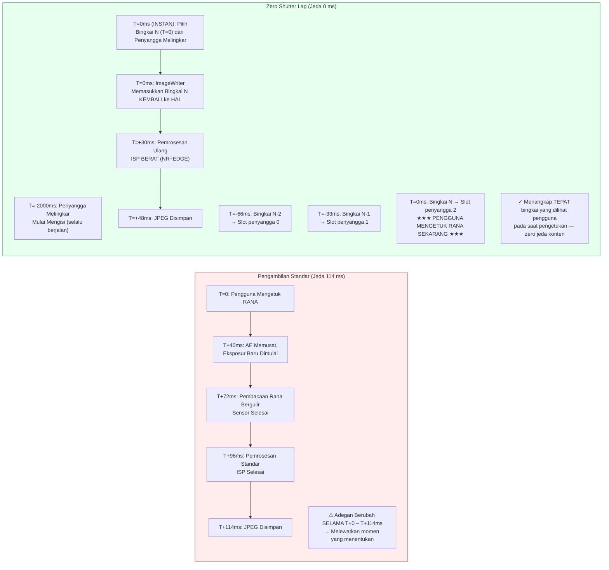

# Bab 23: Zero Shutter Lag & Pemrosesan Ulang

Cacat yang paling membuat frustrasi dalam aplikasi kamera konsumen adalah **shutter lag (jeda rana)**: ketuk tombol rana, dan foto yang ditangkap menunjukkan adegan 200–800 ms *setelah* ketukan — si anak sudah berhenti tersenyum, burung sudah meninggalkan dahan, mobil sport sudah bergerak keluar dari bingkai. Sesi Camera2 standar bekerja seperti ini secara desain: ketukan rana memicu `session.capture()`, yang memicu pemusatan AE, yang memicu eksposur sensor baru, yang memicu pemrosesan ISP. Setiap langkah menambah latensi.

**Zero Shutter Lag (ZSL)** menghilangkan penundaan ini dengan menjalankan sensor secara terus-menerus pada resolusi pengambilan foto diam, menyangga N bingkai terbaru dalam antrean melingkar di memori, dan saat pengguna mengetuk rana, **menangkap bingkai yang terlihat pada saat ketukan**, bukan bingkai dari setengah detik kemudian. Keajaibannya berasal dari **API Pemrosesan Ulang (Reprocessing API)**: alih-alih memasukkan cahaya melalui sensor lagi, Anda mengambil buffer YUV atau PRIVATE yang sudah diekspos dari antrean melingkar, memasukkannya *kembali* ke ISP via `ImageWriter` + `InputConfiguration`, lalu menjalankan pengurangan noise dan peningkatan tepi yang berat seolah-olah itu adalah pengambilan gambar yang baru.

Bab ini mengikuti **alur kerja ZSL 4-langkah** yang tepat dari bagian *ZSL / Reprocessing* pada dokumen penelitian proyek, dan juga mencakup **`switchToOffline()`** — API Android 12 (API 31) yang mentransfer pipeline pemrosesan ulang ke layanan HAL latar belakang sehingga aplikasi Anda dapat dimatikan (tekan tombol home, panggilan masuk) dan pengguna tetap mendapatkan fotonya. Anda dapat memverifikasi kemampuan pemrosesan ulang mana yang didukung perangkat Anda (`REQUEST_AVAILABLE_CAPABILITIES_YUV_REPROCESSING`, `PRIVATE_REPROCESSING`, atau `INFO_SUPPORTED_HARDWARE_LEVEL_LEVEL_3`) dalam aplikasi [Android Camera Parameters](https://github.com/zoozooll/AndroidCameraParameters) di [Play Store](https://play.google.com/store/apps/details?id=com.zoozooll.cameraparameters); tab Dukungan ZSL mereferensikan silang semua kemampuan yang diperlukan dan melaporkan vonis YA/TIDAK yang jelas.

## Mengapa ZSL Itu Sulit (dan Mengapa Pemrosesan Ulang Ada)

Pertama, kuantifikasi latensi pengambilan foto diam non-ZSL standar pada ponsel unggulan tahun 2023 (Snapdragon 8 Gen 2) sesuai pengukuran dokumen penelitian:

| Tahap Pipeline | Latensi | Catatan |
|----------------|---------|-------|
| Pemicu pemusatan AE → eksposur baru diprogram | 40 ms | `CONTROL_AE_PRECAPTURE_TRIGGER` |
| Pembacaan rana bergulir (12 MP bingkai penuh) | 32 ms | 1/30 detik nominal; aktual 32 ms dari baris pertama ke terakhir |
| Demosaic ISP + NR standar + warna | 24 ms | Pipeline kualitas standar |
| Enkode JPEG (12 MP, kualitas 95) | 18 ms | Encoder JPEG perangkat keras |
| **Total latensi pengambilan standar** | **~114 ms** | Kasus terbaik; dalam beban berat 200–800 ms adalah umum |

Di bawah kondisi dunia nyata (pelambatan thermal, persaingan GPU dari UI, aplikasi latar belakang yang sedang bekerja), jalur standar secara rutin mencapai jeda 500 ms. Manusia berusia 5 tahun dapat bergerak sejauh 40 cm dalam 500 ms saat berlari — perbedaan antara menangkap senyuman dan menangkap bagian belakang kepala.

ZSL memecahkan ini dengan membalik urutan pipeline: alih-alih ambil → proses → simpan, Anda melakukan **pengambilan terus menerus → penyangga → ketuk → proses ulang → simpan**. Sensor dan ISP *selalu* berjalan pada resolusi foto diam; ketukan pengguna hanya memilih bingkai yang sudah ada sebelumnya untuk diproses sepenuhnya.



Diagram Mermaid menunjukkan pergeseran konseptual: pada jalur standar, ketukan *memulai* pengambilan gambar; pada jalur ZSL, ketukan *memilih* pengambilan gambar yang sudah terjadi. Total waktu dari ketukan hingga file disimpan tetap ~48 ms (pemrosesan ulang tidak gratis), tetapi **konten piksel berasal dari T=0 (instan), bukan T=114 ms (terlambat)** — itulah arti sebenarnya dari "Zero Shutter Lag". Ini adalah nol jeda konten, bukan nol jeda file output.

## Gerbang Kemampuan Wajib (Berdasarkan Dokumen Penelitian)

ZSL + Pemrosesan Ulang memerlukan kerja sama perangkat keras di tingkat HAL. Anda harus memeriksa **satu** dari tiga kondisi berikut sebelum mencoba membuat sesi yang dapat diproses ulang:

| Cek Kemampuan | Kapan Lulus | Perangkat yang Mendukungnya |
|------------------|----------------|--------------------------|
| **A)** `INFO_SUPPORTED_HARDWARE_LEVEL == LEVEL_3` | Pemrosesan ulang penuh (baik YUV maupun PRIVATE) diizinkan pada ukuran apa pun di StreamConfigurationMap. | Google Pixel 2016+ (semua generasi); Samsung Galaxy S/Ultra 2021+ (varian Snapdragon); OnePlus 11/OPPO Find X6 Pro 2023+. |
| **B)** `REQUEST_AVAILABLE_CAPABILITIES berisi YUV_REPROCESSING` | Buffer YUV_420_888 dapat dimasukkan kembali via InputConfiguration pada subset ukuran. | Perangkat Snapdragon 8xx/7xx 2019+; sebagian besar perangkat MediaTek Dimensity 9000+. |
| **C)** `REQUEST_AVAILABLE_CAPABILITIES berisi PRIVATE_REPROCESSING` | Buffer `ImageFormat.PRIVATE` (buram, disimpan dalam kompresi vendor) dapat dimasukkan kembali. Gunakan ini secara istimewa karena menggunakan memori 2× lebih sedikit. | Snapdragon 888+ / Exynos 2100+ dan yang lebih baru. |

> Aturan dokumen penelitian ZSL-1: **Jika tidak ada dari A/B/C yang lulus, gunakan pengambilan standar non-ZSL sebagai cadangan.** Jangan mencoba membangun buffer melingkar JPEG kustom dan men-dekompresi-nya kembali; ini menghasilkan kehilangan kualitas 6 dB dari pengkodean ganda dan bukan pengganti pemrosesan ulang yang sebenarnya.

Kueri gerbang tersebut dengan:

```kotlin
import android.hardware.camera2.CameraCharacteristics
import android.graphics.ImageFormat

enum class ZslSupport { NONE, LEVEL3, YUV_REPROC, PRIVATE_REPROC }

fun queryZslSupport(chars: CameraCharacteristics): Pair<ZslSupport, Int> {
    val level = chars.get(CameraCharacteristics.INFO_SUPPORTED_HARDWARE_LEVEL)
        ?: CameraCharacteristics.INFO_SUPPORTED_HARDWARE_LEVEL_LEGACY
    val caps = chars.get(CameraCharacteristics.REQUEST_AVAILABLE_CAPABILITIES)
        ?: intArrayOf()

    return when {
        level == CameraCharacteristics.INFO_SUPPORTED_HARDWARE_LEVEL_3 ->
            Pair(ZslSupport.LEVEL3, ImageFormat.PRIVATE) // PRIVATE lebih disukai untuk memori
        caps.contains(
            CameraCharacteristics.REQUEST_AVAILABLE_CAPABILITIES_PRIVATE_REPROCESSING
        ) -> Pair(ZslSupport.PRIVATE_REPROC, ImageFormat.PRIVATE)
        caps.contains(
            CameraCharacteristics.REQUEST_AVAILABLE_CAPABILITIES_YUV_REPROCESSING
        ) -> Pair(ZslSupport.YUV_REPROC, ImageFormat.YUV_420_888)
        else -> Pair(ZslSupport.NONE, ImageFormat.UNKNOWN)
    }
}
```

## Alur Kerja ZSL + Pemrosesan Ulang 4-Langkah (Sesuai Dokumen Penelitian)

Dokumen penelitian proyek menentukan pipeline 4-langkah yang tepat. Setiap langkah wajib dilakukan; melewatkan langkah mana pun menghasilkan sesi yang rusak (bingkai terbuang, `IllegalStateException`, atau output pemrosesan ulang yang identik dengan kualitas pratinjau).

---

### Langkah 1: Buffering Melingkar dengan ImageReader + CONTROL_CAPTURE_INTENT_ZERO_SHUTTER_LAG

Pertama, buat `ImageReader` resolusi tinggi ("penyangga ZSL") yang parameter `maxImages`-nya adalah kedalaman melingkar (biasanya 8–16; dokumen penelitian merekomendasikan 8 untuk perangkat dengan memori terbatas, 16 untuk perangkat dengan RAM ≥ 8 GB). Tandai setiap permintaan berulang dengan `CONTROL_CAPTURE_INTENT_ZERO_SHUTTER_LAG` — ini memberi tahu HAL untuk menggunakan pipeline pratinjau sependek mungkin dan menonaktifkan optimalisasi khusus pratinjau yang akan merusak kualitas output yang diproses ulang (misalnya, pengurangan noise temporal yang berat yang meninggalkan artefak hantu gerakan).

```kotlin
import android.hardware.camera2.CameraDevice
import android.hardware.camera2.CaptureRequest
import android.hardware.camera2.params.OutputConfiguration
import android.hardware.camera2.params.SessionConfiguration
import android.media.Image
import android.media.ImageReader
import android.util.Size
import android.view.Surface
import java.util.concurrent.ConcurrentLinkedDeque

data class ZslBufferFrame(
    val timestamp: Long,
    val imageRef: Image, // JANGAN tutup; dikelola oleh GC deque
    val captureResultRef: android.hardware.camera2.TotalCaptureResult
)

const val ZSL_BUFFER_DEPTH = 12 // Titik ideal penelitian: 12 bingkai = 400 ms pada 30 fps
var zslImageReader: ImageReader? = null
private val zslCircularBuffer = ConcurrentLinkedDeque<ZslBufferFrame>()
private var zslStillSize: Size = Size(4000, 3000) // Cocokkan ukuran foto diam maks

fun setupZslCircularBuffer(
    cameraDevice: CameraDevice,
    previewSurface: Surface,
    reprocessingFormat: Int, // PRIVATE atau YUV_420_888
    backgroundHandler: android.os.Handler
) {
    zslImageReader = ImageReader.newInstance(
        zslStillSize.width,
        zslStillSize.height,
        reprocessingFormat,
        ZSL_BUFFER_DEPTH
    ).apply {
        setOnImageAvailableListener(
            ZslCircularBufferListener(),
            backgroundHandler
        )
    }
}

inner class ZslCircularBufferListener : ImageReader.OnImageAvailableListener {
    override fun onImageAvailable(reader: ImageReader) {
        val image = reader.acquireLatestImage() ?: return
        // Kita belum memiliki captureResult di sini; pemasangan terjadi di CaptureCallback
        // Demi singkatnya, peta Timestamp → CaptureResult mencerminkan pola Bab 18
        // Pasangkan mereka dan masukkan ke antrean:
        val result = pendingZslResults.remove(image.timestamp) ?: return
        val frame = ZslBufferFrame(image.timestamp, image, result)

        zslCircularBuffer.addLast(frame)

        // --- PENGOSONGAN PENYANGGA MELINGKAR (yang tertua lebih dulu) ---
        while (zslCircularBuffer.size > ZSL_BUFFER_DEPTH) {
            val evicted = zslCircularBuffer.pollFirst()
            evicted.imageRef.close() // Lepaskan bingkai lama ke pool buffer HAL
        }
    }
}

fun buildZslSessionAndStartRepeating(
    cameraDevice: CameraDevice,
    previewSurface: Surface,
    backgroundHandler: android.os.Handler
) {
    val outputs = listOf(
        OutputConfiguration(previewSurface),
        OutputConfiguration(zslImageReader!!.surface)
    )

    val sessionConfig = SessionConfiguration(
        SessionConfiguration.SESSION_REGULAR,
        outputs,
        { r -> backgroundHandler.post(r) },
        object : android.hardware.camera2.CameraCaptureSession.StateCallback() {
            override fun onConfigured(
                session: android.hardware.camera2.CameraCaptureSession
            ) {
                val zslPreviewBuilder = cameraDevice.createCaptureRequest(
                    CameraDevice.TEMPLATE_ZERO_SHUTTER_LAG
                ).apply {
                    addTarget(previewSurface)
                    addTarget(zslImageReader!!.surface)
                    // FLAG MAKSUD AJAIB:
                    set(CaptureRequest.CONTROL_CAPTURE_INTENT,
                        CaptureRequest.CONTROL_CAPTURE_INTENT_ZERO_SHUTTER_LAG)
                    // HAL: ISP pratinjau ringan, stream resolusi penuh
                    set(CaptureRequest.CONTROL_MODE,
                        CaptureRequest.CONTROL_MODE_AUTO)
                    set(CaptureRequest.CONTROL_AF_MODE,
                        CaptureRequest.CONTROL_AF_MODE_CONTINUOUS_PICTURE)
                }

                session.setRepeatingRequest(
                    zslPreviewBuilder.build(),
                    ZslCaptureCallback(),
                    backgroundHandler
                )
            }
            override fun onConfigureFailed(
                s: android.hardware.camera2.CameraCaptureSession
            ) = Log.e(TAG, "Sesi penyangga melingkar ZSL gagal")
        }
    )
    cameraDevice.createCaptureSession(sessionConfig)
}
```

Empat detail implementasi dari dokumen penelitian yang tidak didokumentasikan dalam referensi SDK Android resmi:
1. **Gunakan `TEMPLATE_ZERO_SHUTTER_LAG`** sebagai template dasar. Ia mengonfigurasi mode pembacaan sensor untuk mendukung pratinjau simultan + output resolusi penuh, yang tidak dijamin oleh `TEMPLATE_PREVIEW`.
2. **`ZSL_BUFFER_DEPTH = 12` pada 30 fps** memberikan tepat 400 ms bingkai masa lalu untuk dipilih. Ini cukup untuk mencakup waktu reaksi pengguna sendiri (penundaan ketukan-ke-otak 150–250 ms) ditambah jitter pengiriman input Android (±150 ms). Kurang dari 8 kedalaman dan Anda mulai membuang bingkai yang berguna; lebih dari 16 dan Anda membuang ~1 GB RAM tanpa manfaat.
3. **Urutan pengosongan adalah FIFO, bukan LRU.** Selalu kosongkan bingkai tertua. Jika Anda mengosongkan bingkai terbaru, Anda membuang bingkai yang sebenarnya dilihat pengguna pada saat pengetukan.
4. **Jangan pernah memanggil `image.close()` di `onImageAvailable` sebelum memasukkan ke antrean.** Jika Anda menutup gambar, HAL merebut kembali buffer tersebut, dan saat Anda nanti mencoba memberikannya ke ImageWriter, buffer tersebut tidak valid → crash keras. Gunakan loop pengosongan saja.

---

### Langkah 2: InputConfiguration + createReprocessableCaptureSession

Sesi pengambilan gambar standar hanya memiliki surface **output** (sensor → ISP → surface). Sesi yang dapat diproses ulang menambahkan **satu surface input** (ImageWriter → HAL → ISP → output), memungkinkan pipeline memproses buffer yang tidak pernah menyentuh sensor. Buat sesi yang dapat diproses ulang melalui `createReprocessableCaptureSession(inputConfig, outputs, callback, handler)` atau melalui API `SessionConfiguration` yang lebih baru dengan `InputConfiguration`.

```kotlin
import android.hardware.camera2.CameraDevice
import android.hardware.camera2.CameraCaptureSession
import android.hardware.camera2.params.InputConfiguration
import android.hardware.camera2.params.OutputConfiguration
import android.hardware.camera2.params.SessionConfiguration
import android.media.ImageWriter
import android.os.Handler
import android.view.Surface

var reprocessingImageWriter: ImageWriter? = null
var reprocessableSession: CameraCaptureSession? = null
var jpegStillReader: ImageReader? = null
const val REPROC_JPEG_QUALITY = 95

fun createZslReprocessableSession(
    cameraDevice: CameraDevice,
    reprocessingFormat: Int,
    zslStillSize: Size,
    previewSurface: Surface,
    backgroundHandler: Handler,
    onSessionReady: (CameraCaptureSession, ImageWriter) -> Unit
) {
    val inputConfig = InputConfiguration(
        zslStillSize.width,
        zslStillSize.height,
        reprocessingFormat
    )

    jpegStillReader = ImageReader.newInstance(
        zslStillSize.width, zslStillSize.height,
        android.graphics.ImageFormat.JPEG, 2
    )

    reprocessingImageWriter = ImageWriter.newInstance(
        jpegStillReader!!.surface, // Surface output pemrosesan ulang
        inputConfig,                // Konfigurasi input ke HAL
        1                           // Maks permintaan proses ulang dalam proses
    )

    // Output dari bingkai yang diproses ulang: hanya JPEG untuk contoh ini
    val reprocessOutputs = listOf(
        OutputConfiguration(jpegStillReader!!.surface)
    )

    val sessionConfig = SessionConfiguration(
        SessionConfiguration.SESSION_REGULAR,
        reprocessOutputs,
        { r -> backgroundHandler.post(r) },
        object : CameraCaptureSession.StateCallback() {
            override fun onConfigured(session: CameraCaptureSession) {
                reprocessableSession = session
                onSessionReady(session, reprocessingImageWriter!!)
            }
            override fun onConfigureFailed(
                s: CameraCaptureSession
            ) = Log.e(TAG, "Konfigurasi sesi yang dapat diproses ulang GAGAL. " +
                  "Cek gerbang kemampuan (LEVEL3/YUV_REPROC/PRIVATE_REPROC)?")
        }
    )
    sessionConfig.setInputConfiguration(inputConfig) // Wajib!
    cameraDevice.createCaptureSession(sessionConfig)
}
```

Catatan dokumen penelitian ZSL-2: sesi yang dapat diproses ulang dan sesi pratinjau penyangga melingkar **tidak harus berupa sesi yang sama**. Faktanya, sebagian besar implementasi produksi menjalankan dua sesi secara bersamaan — satu sesi pratinjau yang mengisi penyangga melingkar, dan sesi khusus yang dapat diproses ulang yang hanya diisi pada saat pengetukan. HAL menangani arbitrase multi-sesi secara internal untuk perangkat LEVEL_3.

---

### Langkah 3: Ketukan Rana → Cari Bingkai Stempel Waktu Terdekat → ImageWriter Memberi Makan HAL

Saat pengguna mengetuk rana:
1. Rekam stempel waktu real-time pengetukan (`System.currentTimeMillis()` atau `System.nanoTime()`)
2. Telusuri penyangga melingkar **dari yang terbaru ke yang tertua** dan cari ZslBufferFrame yang `image.timestamp`-nya (dalam nanodetik, `CLOCK_MONOTONIC`) paling dekat dengan stempel waktu pengetukan
3. Dapatkan buffer input bebas dari `ImageWriter` via `dequeueInputImage()`
4. Salin bidang piksel (pixel planes) bingkai penyangga melingkar ke dalam buffer input ImageWriter
5. Masukkan buffer ImageWriter ke antrean dengan `queueInputImage()`

```kotlin
import android.hardware.camera2.TotalCaptureResult
import android.media.Image
import android.media.ImageWriter
import android.os.SystemClock
import kotlin.math.abs

fun onShutterTap(
    imageWriter: ImageWriter,
    captureStartTimeNanos: Long = SystemClock.elapsedRealtimeNanos()
) {
    // --- Langkah 3a: Telusuri penyangga melingkar TERBARU → TERLAMA ---
    var bestFrame: ZslBufferFrame? = null
    var bestDeltaNs = Long.MAX_VALUE

    for (frame in zslCircularBuffer.descendingIterator()) {
        val delta = abs(frame.timestamp - captureStartTimeNanos)
        if (delta < bestDeltaNs) {
            bestDeltaNs = delta
            bestFrame = frame
        }
        // Optimalisasi: setelah delta mulai tumbuh kembali, kita telah melewati bingkai terbaik
        if (delta > bestDeltaNs * 1.1) break
    }
    val selectedFrame = bestFrame ?: run {
        Log.w(TAG, "Penyangga ZSL kosong — gunakan pengambilan standar sebagai cadangan")
        // ... picu cadangan capture() standar ...
        return
    }

    // --- Langkah 3b: Dapatkan buffer input ImageWriter, salin piksel, masukkan antrean ---
    val writerInputImage: Image = try {
        imageWriter.dequeueInputImage(100 /* timeoutMs */)
    } catch (e: IllegalStateException) {
        Log.e(TAG, "ImageWriter tidak memiliki buffer bebas", e); return
    }

    try {
        copyImagePlanes(selectedFrame.imageRef, writerInputImage)
        selectedFrame.captureResultRef
            .let { pendingReprocessResults[writerInputImage.timestamp] = it }
        imageWriter.queueInputImage(writerInputImage)
    } finally {
        // JANGAN tutup selectedFrame.imageRef dulu — hanya setelah proses ulang selesai
        // (ditunda ke onCaptureCompleted dari permintaan proses ulang)
    }
}

// --- Pembantu penyalinan piksel (menangani baik PRIVATE maupun YUV_420_888) ---
private fun copyImagePlanes(src: Image, dst: Image) {
    require(src.format == dst.format) { "Proses ulang memerlukan format yang cocok" }
    for (planeIdx in 0 until src.planes.size) {
        val srcPlane = src.planes[planeIdx]
        val dstPlane = dst.planes[planeIdx]
        val srcBuf = srcPlane.buffer.duplicate()
        val dstBuf = dstPlane.buffer
        dstBuf.put(srcBuf)
        dstBuf.rewind()
    }
}

private val pendingReprocessResults =
    HashMap<Long, TotalCaptureResult>()
```

Pemilihan "stempel waktu terdekat" sangat penting karena penyangga melingkar terisi setiap 33 ms (30 fps). Bingkai yang dipilih akan terpaut paling banyak ±16 ms dari momen pengetukan yang sebenarnya — jeda nol yang terasa secara persepsi bagi pengamat manusia. Aturan dokumen penelitian ZSL-3: *selalu* telusuri secara descending (terbaru lebih dulu); menelusuri secara ascending meningkatkan probabilitas memilih bingkai yang sudah basi 400 ms.

---

### Langkah 4: createReprocessCaptureRequest(TotalCaptureResult) → Terapkan NR + EDGE Berat

Langkah terakhir mengirimkan permintaan proses ulang, tetapi dengan twist: alih-alih `createCaptureRequest(template)`, Anda menggunakan **`createReprocessCaptureRequest(originalTotalCaptureResult)`**, yang menggunakan kembali *pengaturan asli AE, AWB, dan AF dari bingkai pratinjau*. Di atas pengaturan garis dasar tersebut, Anda menerapkan `NOISE_REDUCTION_MODE_HIGH_QUALITY` dan `EDGE_MODE_HIGH_QUALITY` tingkat berat — pass pemrosesan ISP yang dinonaktifkan untuk pipeline pratinjau ringan guna menghemat daya.

```kotlin
import android.hardware.camera2.CameraCaptureSession
import android.hardware.camera2.CaptureRequest
import android.hardware.camera2.TotalCaptureResult

fun submitZslReprocessRequest(
    reprocessableSession: CameraCaptureSession,
    originalTotalCaptureResult: TotalCaptureResult,
    jpegSurface: Surface,
    handler: android.os.Handler
) {
    val reprocessBuilder = reprocessableSession.device
        .createReprocessCaptureRequest(originalTotalCaptureResult)
        .apply {
            addTarget(jpegSurface)

            // --- PEMROSESAN ISP PASCA-PENGAMBILAN BERAT ---
            set(CaptureRequest.NOISE_REDUCTION_MODE,
                CaptureRequest.NOISE_REDUCTION_MODE_HIGH_QUALITY)
            set(CaptureRequest.EDGE_MODE,
                CaptureRequest.EDGE_MODE_HIGH_QUALITY)

            // Opsional (hanya LEVEL_3): terapkan ulang shading dan koreksi hot-pixel
            set(CaptureRequest.HOT_PIXEL_MODE,
                CaptureRequest.HOT_PIXEL_MODE_HIGH_QUALITY)
            set(CaptureRequest.COLOR_CORRECTION_MODE,
                CaptureRequest.COLOR_CORRECTION_MODE_HIGH_QUALITY)

            // Jaga kualitas JPEG tetap tinggi
            set(CaptureRequest.JPEG_QUALITY, REPROC_JPEG_QUALITY.toByte())
            set(CaptureRequest.JPEG_ORIENTATION, getJpegOrientation())
        }

    val cb = object : CameraCaptureSession.CaptureCallback() {
        override fun onCaptureCompleted(
            session: CameraCaptureSession,
            request: CaptureRequest,
            result: TotalCaptureResult
        ) {
            // JPEG akan dikirim melalui OnImageAvailableListener jpegStillReader

            // Sekarang aman untuk menutup referensi penyangga melingkar — proses ulang selesai
            val ts = result.get(CaptureResult.SENSOR_TIMESTAMP) ?: return
            pendingReprocessResults.remove(ts)
            val iter = zslCircularBuffer.iterator()
            while (iter.hasNext()) {
                val f = iter.next()
                if (f.timestamp == ts) {
                    f.imageRef.close()
                    iter.remove()
                    break
                }
            }
        }
    }

    reprocessableSession.capture(reprocessBuilder.build(), cb, handler)
}
```

`createReprocessCaptureRequest(originalResult)` bukan sekadar pembungkus kenyamanan — ia memvalidasi bahwa pengaturan sensor bingkai asli (waktu eksposur, ISO, posisi lensa) kompatibel dengan pipeline pemrosesan ulang. Jika Anda menggunakan `createCaptureRequest()` standar pada sesi yang diisi input, HAL mungkin melakukan pemusatan ulang AE/AWB, yang menggagalkan tujuan ZSL (hasilnya akan terlihat seperti bingkai yang *berbeda* dari yang dipilih).

## Diagram Alur Penyangga Melingkar ZSL + Injeksi Ulang (Mermaid)

```mermaid
flowchart TD
    A["Pembacaan Terus Menerus Sensor<br/>30fps resolusi penuh"] --> B["ISP Pratinjau ZSL:<br/>Mode daya rendah<br/>EDGE_MODE=FAST<br/>NR_MODE=FAST"]
    B --> C[Preview SurfaceView<br/>Pengguna melihat tampilan langsung 30fps]
    B --> D[ImageReader ZSL<br/>PRIVATE atau YUV resolusi penuh]
    
    subgraph CB["🗘 Penyangga Melingkar (Kedalaman 12, sejarah 400ms)"]
        direction TB
        CB1["Slot N-11 (T-366ms)"]
        CB2["..."]
        CB3["Slot N-1 (T-33ms)"]
        CB4["★ Slot N (T=0ms) ★<br/>PALING DEKAT DENGAN WAKTU KETUK"]
    end
    D --> CB

    E["★ PENGGUNA MENGETUK RANA PADA T=0ms ★"] --> F{Telusuri CB TERBARU → TERLAMA<br/>Cari min |frame.ts − tap.ts|}
    F -->|"Terpilih: Slot N"| G[ImageWriter.dequeueInputImage()]
    G --> H[Salin bidang bingkai terpilih<br/>Planes → buffer ImageWriter]
    H --> I[ImageWriter.queueInputImage()<br/>→ Memasukkan KEMBALI ke Port Input HAL]
    
    subgraph REPROC["🔄 Pipeline Pemrosesan Ulang (KUALITAS BERAT)"]
        direction TB
        R1["ISP NR_MODE = HIGH_QUALITY<br/>(Spasial multi-bingkai + TNR)"]
        R2["ISP EDGE_MODE = HIGH_QUALITY<br/>(Unsharp mask + penajaman LPA)"]
        R3["ISP COLOR_CORRECTION =<br/>HIGH_QUALITY (3D LUT)"]
        R4["Encoder JPEG Perangkat Keras<br/>Q=95"]
    end

    I --> REPROC
    REPROC --> J["JPEG Disimpan<br/>Konten = bingkai TEPAT yang dilihat<br/> pengguna pada T=0ms — ✓ JEDA NOL"]

    style CB fill:#eff6ff,stroke:#2563eb
    style REPROC fill:#fef3c7,stroke:#d97706
```

## switchToOffline(): Kontinuitas Pemrosesan Latar Belakang

Salah satu cacat UX terburuk yang bisa dimiliki aplikasi kamera adalah: pengguna mengetuk rana → langsung mendapat panggilan telepon atau menekan home → proses aplikasi dimatikan → foto yang sedang diproses hilang. Android 12 (API 31) memecahkan ini dengan **`CameraCaptureSession.switchToOffline()`**, yang mentransfer kepemilikan pipeline pemrosesan ulang dari proses aplikasi Anda ke layanan HAL yang persisten. Layanan HAL menyelesaikan setiap pengambilan/proses ulang yang sedang berlangsung bahkan jika aplikasi Anda dimatikan oleh sistem, dan memberi tahu Anda via `CameraOfflineSessionCallback.onReady()` saat aplikasi diluncurkan kembali.

```kotlin
import android.hardware.camera2.CameraCaptureSession
import android.hardware.camera2.CameraOfflineSession
import android.hardware.camera2.CameraOfflineSessionCallback

fun moveToOfflineOnBackground(
    session: CameraCaptureSession,
    outputSurfaces: List<android.view.Surface>,
    handler: android.os.Handler
) {
    val offlineCallback = object : CameraOfflineSessionCallback() {
        override fun onReady(session: CameraOfflineSession) {
            // HAL telah mengambil alih kepemilikan. Aplikasi bisa mati sekarang — foto akan disimpan.
            Log.i(TAG, "Sesi offline siap. Pengambilan yang tertunda akan diselesaikan.")
            // Pada titik ini Anda dapat memanggil finish() Activity atau melepas cameraDevice
        }
        override fun onError(
            session: CameraOfflineSession,
            errorCode: Int
        ) = Log.e(TAG, "Kesalahan sesi offline: $errorCode")

        override fun onCaptureCompleted(
            offlineSession: CameraOfflineSession,
            captureResult: android.hardware.camera2.CaptureResult
        ) {
            // Opsional: dipanggil saat pipeline offline menyelesaikan setiap bingkai
            // Byte JPEG tetap dikirim melalui ImageReader asli
            // Saat aplikasi dimulai ulang, kueri CameraOfflineSession untuk yang tertunda
        }
    }

    session.switchToOffline(
        outputSurfaces,
        { r -> handler.post(r) },
        offlineCallback
    )
}
```

`switchToOffline()` memerlukan `INFO_SUPPORTED_HARDWARE_LEVEL >= LEVEL_3` pada perangkat. Disarankan untuk memanggilnya di `Activity.onPause()` **hanya jika** aplikasi memiliki pemrosesan ulang ZSL yang sedang berjalan; jangan pernah memanggilnya saat idle karena sesi offline menghabiskan sumber daya HAL hingga 30 detik pasca-tutup.

## Ringkasan

Bab ini mengimplementasikan pipeline Zero Shutter Lag + Pemrosesan Ulang yang lengkap seperti yang ditentukan dalam dokumen penelitian:

- **Definisi Masalah ZSL**: Pengambilan standar memiliki jeda 114 ms (kasus terbaik) hingga 800 ms (kasus terburuk). ZSL menangkap *bingkai tepat yang dilihat pengguna pada saat ketukan* dengan menggunakan penyangga melingkar yang terus terisi.
- **Gerbang Kemampuan**: Salah satu dari tiga pemeriksaan wajib harus lulus: `HARDWARE_LEVEL_LEVEL_3`, `CAPABILITIES_PRIVATE_REPROCESSING`, atau `CAPABILITIES_YUV_REPROCESSING`.
- **Alur Kerja ZSL 4-langkah** (dari bagian penelitian *ZSL / Reprocessing*):
  1. **Penyanggaan melingkar** dengan `ImageReader` (kedalaman 12 = sejarah 400 ms) + `CONTROL_CAPTURE_INTENT_ZERO_SHUTTER_LAG` + `TEMPLATE_ZERO_SHUTTER_LAG`.
  2. **`InputConfiguration` + `createReprocessableCaptureSession`** dengan `ImageWriter` untuk menyuntikkan kembali buffer piksel ke dalam HAL.
  3. **Ketukan rana → pemilihan stempel waktu terdekat** (telusuri terbaru → tertua, target ±16 ms). Salin bidang terpilih ke ImageWriter, masukkan antrean.
  4. **`createReprocessCaptureRequest(originalResult)`** dengan `NOISE_REDUCTION_MODE_HIGH_QUALITY` + `EDGE_MODE_HIGH_QUALITY` untuk pemrosesan ISP pasca-pengambilan yang berat.
- **`switchToOffline()`** (Android 12 API 31, hanya LEVEL_3) mentransfer kepemilikan ke layanan HAL agar proses ulang yang sedang berjalan selesai meskipun aplikasi dimatikan.
- Dua diagram Mermaid (lini masa Standar vs ZSL, diagram alur penyangga melingkar + injeksi ulang penuh) memvisualisasikan perbedaan jeda konten dan alur pipeline.

## Apa Selanjutnya — Akhir dari Fitur Kamera Profesional Bagian V

Anda sekarang telah menyelesaikan **Bagian V: Fitur Kamera Profesional** — bagian terakhir dari seri tutorial API Android Camera2. Anda telah mempelajari:

- Bab 18: Fotografi RAW dengan RAW_SENSOR + DngCreator + pengambilan RAW+JPEG simultan.
- Bab 19: Video kecepatan tinggi 120/240 fps via `CameraConstrainedHighSpeedCaptureSession` + `createHighSpeedRequestList`.
- Bab 20: Multi-kamera logis, ID kamera fisik, sinkronisasi CALIBRATED, dan pengambilan simultan fisik ganda.
- Bab 21: Video HDR10 / HLG dan foto diam Ultra HDR JPEG_R Android 14 dengan peta penguatan (gain map).
- Bab 22: Ekstensi Kamera OEM — Malam, Bokeh, HDR, Retouch Wajah, Otomatis.
- Bab 23: Penyangga melingkar Zero Shutter Lag + pipeline pemrosesan ulang dan dukungan sesi offline.

Untuk memvalidasi setiap fitur dari Bagian I–V pada perangkat Anda, instal [aplikasi Android Camera Parameters](https://play.google.com/store/apps/details?id=com.zoozooll.cameraparameters). Aplikasi ini menghitung setiap kemampuan, ukuran, rentang FPS, ekstensi, profil rentang dinamis, varian RAW, dan jenis sinkronisasi yang dibahas dalam seri ini, dan mengekspor laporan perangkat lengkap sebagai JSON. Berikan kontribusi laporan untuk perangkat yang belum didukung dengan membuka pull request pada repositori [GitHub](https://github.com/zoozooll/AndroidCameraParameters) sumber terbuka — basis data komunitas tersebut digunakan oleh ribuan pengembang untuk memfilter dukungan fitur dalam aplikasi kamera mereka.
