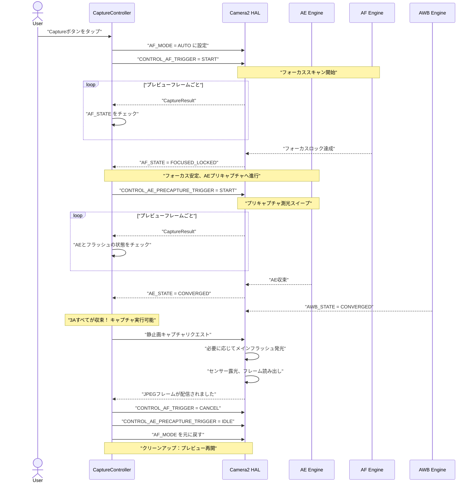
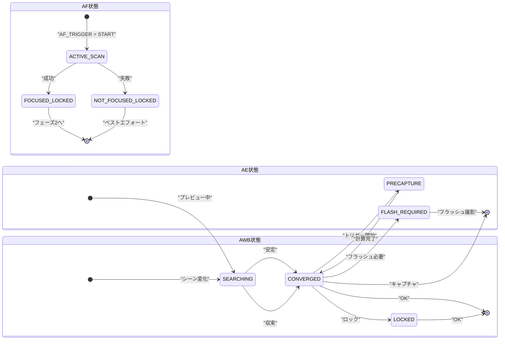

# 第17章：3A パイプライン

これまで、**AE** (自動露出、第13〜14章)、**AF** (オートフォーカス、第15章)、**AWB** (オートホワイトバランス、第16章) を独立したシステムとして学習してきました。実際のカメラアプリでは、シャッターを押す前にこれら 3 つすべてを調整する必要があります。そして、その *順序とタイミング* が非常に重要です。

ユーザーがシャッターボタンをタップした瞬間に即座に `capture()` を実行するナイーブな実装では、結果が一貫しません。フォーカスが合っていたり合っていなかったり、フラッシュが光ったり光らなかったり、AWB の調整中で写真が緑色になったりします。信頼性の高い 3A パイプラインは、これらすべての問題を解決します。

本章での 3A パイプラインの実装は、[Android Camera Parameters アプリ](https://github.com/zoozooll/AndroidCameraParameters) で内部的に使用されているフロー、および Android カメラアーキテクチャの研究ドキュメントやプロフェッショナルな Camera2 開発に関する記事で説明されているシーケンスと同一です。

---

## 3A オーケストレーションシーケンス（概要）

各サブシステムの詳細に入る前に、完全な状態フローを視覚化してみましょう。これは実際のプロダクション環境でのシーケンスであり、簡略化されたものではありません。



**各ステップはブロッキング（待機が必要）です。** HAL がステップ N で要求された状態を確認するまで、ステップ N+1 に進んではいけません。ステップをスキップしないでください。スキップすると、フォーカスが甘かったり、露出が不適切だったり、色が不自然な写真が断続的に発生する原因になります。

---

## AE (自動露出) ディープダイブ

AE は 3 つの A の中で最も複雑です。シャッター速度と ISO だけでなく、**フラッシュ測光** と **プリキャプチャトリガー** も含まれるためです。

### AE モード：CONTROL_AE_MODE

| モード | 動作 | フラッシュサポート |
|------|----------|--------------|
| `OFF` | 完全マニュアル (第14章で解説) | なし |
| `ON` | 自動露出、**フラッシュ無効** | なし |
| `ON_AUTO_FLASH` | 自動露出、**自動フラッシュ判断** — HAL が暗い場合のみ発光 | 自動 |
| `ON_ALWAYS_FLASH` | 自動露出、**常にフラッシュ発光** (逆光ポートレート用) | 常に |
| `ON_AUTO_FLASH_REDEYE` | 自動露出 + 赤目軽減フラッシュ | 自動 + 赤目軽減 |
| `ON_EXTERNAL_FLASH` | 外部フラッシュアクセサリー用 | 外部のみ |

**通常のカメラアプリのデフォルト** は `ON_AUTO_FLASH` です。ユーザーはスマホが「光らせるべき時」を知っていることを期待します。

### AE 状態とプリキャプチャトリガー

AF と同様に、AE も `CaptureResult.CONTROL_AE_STATE` を介して状態を報告します。

| 状態 | 意味 |
|-------|---------|
| `INACTIVE` (0) | AE が無効または未開始 |
| `SEARCHING` (1) | 適正露出をアクティブに探索中 |
| `CONVERGED` (2) | 露出が安定。フラッシュモードでは、環境光の露出が収束したが、プリフラッシュ測光は未完了。 |
| `LOCKED` (3) | `CONTROL_AE_LOCK = true` により露出が明示的にロックされている |
| `FLASH_REQUIRED` (4) | 環境光で収束したが、適正な撮影には **フラッシュが必要** と HAL が判断 |
| `PRECAPTURE` (5) | **重要な状態。** プリキャプチャスイープが実行中。HAL が最終的な露出とフラッシュ出力を計算するために測光（必要ならプリフラッシュ発光）を行っている。 |

### なぜプリキャプチャトリガーが重要なのか

プレビューフレームで実行されている AE エンジンは *近似的* です。プレビューパイプラインは小さなバッファと低ビット深度の処理を使用しており、キャプチャ時に発光するメインフラッシュの膨大な光量を考慮していません。

`CONTROL_AE_PRECAPTURE_TRIGGER = START` は HAL に次のように伝えます：

> 「これから本番の静止画を撮影します。近似はやめて、フル精度の測光パイプラインを実行してください。自動フラッシュモードの場合は、低出力のプリフラッシュを数回発光させて反射を測定し、キャプチャのための正確なシャッター、ISO、フラッシュ出力を計算してください。」

**プリキャプチャをスキップすると、フラッシュ写真がランダムに露出過多または露出不足になります。** HAL がリアルタイムでフラッシュの測光を行う機会がなかったためです。

### AE 領域 (スポット測光)

フォーカスの `CONTROL_AF_REGIONS` と同様に、`CONTROL_AE_REGIONS` は *画面のどこで* 測光するかを指定します。ポートレートでのタップフォーカスでは、同時に AE にも同じ領域を適用すべきです。これにより、明るい空の背景ではなく、顔がフォーカスと露出の両方で優先されます。

```kotlin
// AF と AE の両方の領域に同じ MeteringRectangle 配列を使用する
val focusWeightedRegions = arrayOf(userTapRegion)
builder.set(CaptureRequest.CONTROL_AF_REGIONS, focusWeightedRegions)
builder.set(CaptureRequest.CONTROL_AE_REGIONS, focusWeightedRegions)
```

**重み付け：** 各 `MeteringRectangle` には `weight` (0〜1000) があります。重みが大きい領域ほど、測光に強く影響します。

---

## AWB：3A の静かなパートナー

AWB は通常、早期に収束し、ほとんどのシーンで収束したままです。そのため、軽視されがちですが、色の正確性には不可欠であり、撮影準備が整ったときでもまだ探索中である可能性があります。

### AWB 状態のまとめ

| AWB 状態 | キャプチャ判断 |
|-----------|------------------|
| `INACTIVE` (AWB_MODE = OFF) | 進行 OK (マニュアルゲイン) |
| `SEARCHING` | **待機。** 色が変化する可能性がある。通常、大きなシーン変化から 500ms 以内。 |
| `CONVERGED` | ✅ 完璧 — 進行 |
| `LOCKED` | ✅ これも完璧 — `CONTROL_AWB_LOCK = true` で明示的にロック済み |

### AWB ロックと AE/AF ロックの併用

スタジオ撮影や商品撮影などでは、キャプチャ前に 3 つすべてをロックします：

```kotlin
// 静止画キャプチャリクエスト内（最終的な収束値をロックするため）
builder.set(CaptureRequest.CONTROL_AWB_LOCK, true)
builder.set(CaptureRequest.CONTROL_AE_LOCK, true)
// AF は以前にトリガーされており、キャンセルしていないためロックされたまま
```

これにより、メインキャプチャが最終プリキャプチャ測光フレームと *全く同じ* カラー/ホワイトバランスプロファイルを使用することが保証されます。

---

## プロダクション品質の 3A キャプチャコントローラー (Kotlin)

これらすべてを再利用可能なクラスにまとめましょう。この実装は、Android カメラアーキテクチャの 3A 制御パイプラインに関するセクションと、推奨されるパターンに準拠しています。

```kotlin
class ThreeACaptureController(
    private val characteristics: CameraCharacteristics,
    private val captureSession: CameraCaptureSession,
    private val previewSurface: Surface,
    private val jpegReaderSurface: Surface,
    private val mainHandler: Handler
) {
    // ----------- 公開 API -----------
    interface CaptureListener {
        fun onCaptureStarted() {}
        fun onCaptureSuccess(jpegBytes: ByteArray)
        fun onCaptureError(reason: String)
    }

    /**
     * フル 3A キャプチャシーケンスのオーケストレーション：
     *   AFトリガー → AFロック → AEプリキャプチャ → AE収束 → 静止画キャプチャ → クリーンアップ
     */
    fun captureStillPhoto(
        aeMode: Int = CameraMetadata.CONTROL_AE_MODE_ON_AUTO_FLASH,
        listener: CaptureListener
    ) {
        this.listener = listener
        listener.onCaptureStarted()
        beginPhase1_AfTrigger(aeMode)
    }

    // ----------- 内部状態 -----------
    private var listener: CaptureListener? = null
    private var timeoutRunnable: Runnable? = null
    private var phase: Int = 0
    private lateinit var currentAeMode: Int

    private val SESSION_TIMEOUT_MS = 3500L  // 低スペック端末では最大約3秒必要

    // ---- フェーズ 1: AF トリガー、FOCUSED_LOCKED を待機 ----
    private fun beginPhase1_AfTrigger(aeMode: Int) {
        currentAeMode = aeMode
        phase = 1

        val request = captureSession.device.createCaptureRequest(
            CameraDevice.TEMPLATE_PREVIEW
        ).apply {
            addTarget(previewSurface)

            set(CaptureRequest.CONTROL_AF_MODE,
                CameraMetadata.CONTROL_AF_MODE_AUTO)
            set(CaptureRequest.CONTROL_AE_MODE, aeMode)
            set(CaptureRequest.CONTROL_AWB_MODE,
                CameraMetadata.CONTROL_AWB_MODE_AUTO)

            // ワンショット AF スキャンを開始
            set(CaptureRequest.CONTROL_AF_TRIGGER,
                CameraMetadata.CONTROL_AF_TRIGGER_START)
        }

        startTimeout("AFスキャン")
        captureSession.setRepeatingRequest(request.build(), captureCallback, mainHandler)
    }

    // ---- フェーズ 2: AF ロック完了。AE プリキャプチャトリガー開始 ----
    private fun beginPhase2_AePrecapture() {
        phase = 2
        val request = captureSession.device.createCaptureRequest(
            CameraDevice.TEMPLATE_PREVIEW
        ).apply {
            addTarget(previewSurface)

            // AF はロックしたまま — まだ AF トリガーをキャンセルしてはいけません！
            set(CaptureRequest.CONTROL_AF_MODE,
                CameraMetadata.CONTROL_AF_MODE_AUTO)

            set(CaptureRequest.CONTROL_AE_MODE, currentAeMode)

            // ---- 重要な行：プリキャプチャ実行 ----
            set(CaptureRequest.CONTROL_AE_PRECAPTURE_TRIGGER,
                CameraMetadata.CONTROL_AE_PRECAPTURE_TRIGGER_START)

            set(CaptureRequest.CONTROL_AWB_MODE,
                CameraMetadata.CONTROL_AWB_MODE_AUTO)
        }

        restartTimeout("AEプリキャプチャ")
        captureSession.setRepeatingRequest(request.build(), captureCallback, mainHandler)
    }

    // ---- フェーズ 3: AE収束 + AWB収束。実際の静止画キャプチャを実行 ----
    private fun beginPhase3_StillCapture() {
        phase = 3
        cancelTimeout()

        val request = captureSession.device.createCaptureRequest(
            CameraDevice.TEMPLATE_STILL_CAPTURE
        ).apply {
            addTarget(previewSurface)
            addTarget(jpegReaderSurface)

            // キャプチャが完了するまで AF をロックしたままにする
            set(CaptureRequest.CONTROL_AF_MODE,
                CameraMetadata.CONTROL_AF_MODE_AUTO)

            set(CaptureRequest.CONTROL_AE_MODE, currentAeMode)

            // 静止画キャプチャのために AE と AWB の両方をロックし、直前のドリフトを防ぐ
            set(CaptureRequest.CONTROL_AE_LOCK, true)
            set(CaptureRequest.CONTROL_AWB_LOCK, true)

            set(CaptureRequest.CONTROL_AWB_MODE,
                CameraMetadata.CONTROL_AWB_MODE_AUTO)

            set(CaptureRequest.JPEG_QUALITY, 95)
            set(CaptureRequest.JPEG_ORIENTATION, computeJpegOrientation())
        }

        captureSession.capture(request.build(), object : CameraCaptureSession.CaptureCallback() {
            override fun onCaptureCompleted(
                session: CameraCaptureSession,
                request: CaptureRequest,
                result: TotalCaptureResult
            ) {
                super.onCaptureCompleted(session, request, result)
                resetToContinuousPreview()
            }
        }, mainHandler)
    }

    // ---- クリーンアップ：通常の連続プレビューに戻す ----
    private fun resetToContinuousPreview() {
        phase = 0
        val request = captureSession.device.createCaptureRequest(
            CameraDevice.TEMPLATE_PREVIEW
        ).apply {
            addTarget(previewSurface)
            set(CaptureRequest.CONTROL_AF_MODE,
                CameraMetadata.CONTROL_AF_MODE_CONTINUOUS_PICTURE)
            set(CaptureRequest.CONTROL_AE_MODE, currentAeMode)
            set(CaptureRequest.CONTROL_AWB_MODE,
                CameraMetadata.CONTROL_AWB_MODE_AUTO)

            // すべてのロックを解除し、トリガーをキャンセル
            set(CaptureRequest.CONTROL_AF_TRIGGER,
                CameraMetadata.CONTROL_AF_TRIGGER_CANCEL)
            set(CaptureRequest.CONTROL_AE_PRECAPTURE_TRIGGER,
                CameraMetadata.CONTROL_AE_PRECAPTURE_TRIGGER_IDLE)
            set(CaptureRequest.CONTROL_AE_LOCK, false)
            set(CaptureRequest.CONTROL_AWB_LOCK, false)
        }
        captureSession.setRepeatingRequest(request.build(), null, mainHandler)
    }

    // ----------- マスターコールバック：状態監視により全フェーズを駆動 -----------
    private val captureCallback = object : CameraCaptureSession.CaptureCallback() {
        override fun onCaptureCompleted(
            session: CameraCaptureSession,
            request: CaptureRequest,
            result: TotalCaptureResult
        ) {
            val afState = result.get(CaptureResult.CONTROL_AF_STATE)
            val aeState = result.get(CaptureResult.CONTROL_AE_STATE)
            val awbState = result.get(CaptureResult.CONTROL_AWB_STATE)

            when (phase) {
                1 -> {
                    when (afState) {
                        CaptureResult.CONTROL_AF_STATE_FOCUSED_LOCKED,
                        CaptureResult.CONTROL_AF_STATE_NOT_FOCUSED_LOCKED -> {
                            beginPhase2_AePrecapture()
                        }
                    }
                }
                2 -> {
                    val aeReady = (aeState == CaptureResult.CONTROL_AE_STATE_CONVERGED
                                || aeState == CaptureResult.CONTROL_AE_STATE_LOCKED
                                || aeState == CaptureResult.CONTROL_AE_STATE_FLASH_REQUIRED)
                    val awbReady = (awbState == CaptureResult.CONTROL_AWB_STATE_CONVERGED
                                 || awbState == CaptureResult.CONTROL_AWB_STATE_LOCKED
                                 || awbState == CaptureResult.CONTROL_AWB_STATE_INACTIVE)

                    if (aeReady && awbReady) {
                        beginPhase3_StillCapture()
                    }
                }
            }
        }
    }

    private fun startTimeout(phaseName: String) {
        cancelTimeout()
        timeoutRunnable = Runnable {
            when (phase) {
                1 -> beginPhase2_AePrecapture()
                2 -> beginPhase3_StillCapture()
            }
        }
        mainHandler.postDelayed(timeoutRunnable!!, SESSION_TIMEOUT_MS)
    }
    private fun restartTimeout(phaseName: String) = startTimeout(phaseName)
    private fun cancelTimeout() {
        timeoutRunnable?.let { mainHandler.removeCallbacks(it) }
        timeoutRunnable = null
    }

    private fun computeJpegOrientation(): Int {
        return characteristics.get(CameraCharacteristics.SENSOR_ORIENTATION) ?: 0
    }
}
```

---

## 3A 状態遷移マシン (サマリー図)

デバッグ時のクイックリファレンスとして、キャプチャ成功時の AE、AF、AWB の期待される遷移図を示します。



## まとめ

本章では、露出、フォーカス、ホワイトバランスを 1 つの信頼性の高い **3A キャプチャパイプライン** に統合しました。

1. **フェーズ 1 (AF)：** `AF_TRIGGER = START` を設定。ロックされるまで待機。
2. **フェーズ 2 (AE プリキャプチャ)：** `AE_PRECAPTURE_TRIGGER = START` を設定。収束するまで待機。
3. **フェーズ 3 (静止画キャプチャ)：** `AE_LOCK` と `AWB_LOCK` を true にして撮影。
4. **フェーズ 4 (クリーンアップ)：** トリガーとロックを解除。

次の章からは、キャプチャの **制御** から **品質** へと焦点を移し、RAW キャプチャ、HDR、および計算写真学の技術について学んでいきます。
