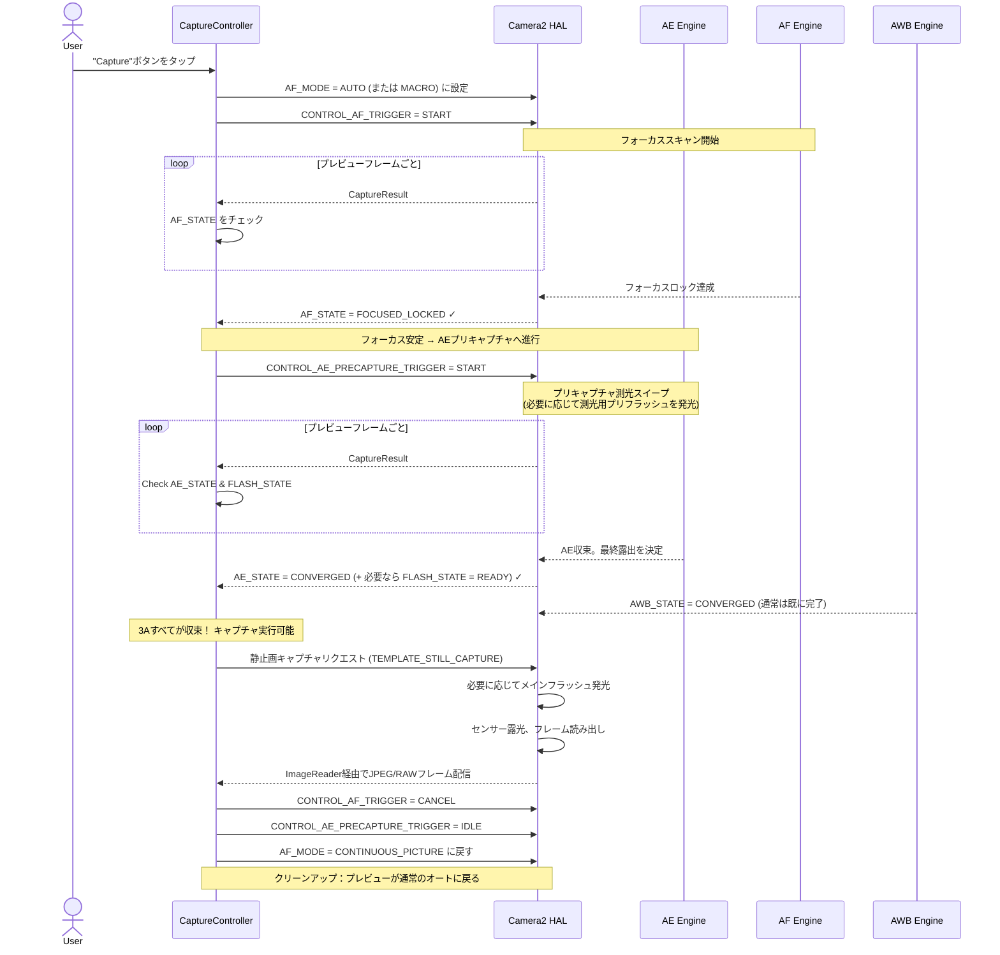

# 第17章：3Aパイプライン

これまでに、**AE** (オート露出、第13〜14章)、**AF** (オートフォーカス、第15章)、**AWB** (オートホワイトバランス、第16章) を独立したシステムとして学んできました。実際の写真アプリでは、シャッターを押す前にこれら3つすべてを調整する必要があり、その*順序とタイミング*が極めて重要です。

シャッターボタンがタップされたときに即座に `capture()` を実行するような単純な実装では、結果が安定しません。ピントが合っていたりいなかったり、フラッシュが光ったり光らなかったり、あるいはAWBの調整途中で緑がかった写真になったりします。信頼性の高い3Aパイプラインは、これらすべての問題を排除します。

この章での3Aパイプラインの実装は、[Android Camera Parameters アプリ](https://github.com/zoozooll/AndroidCameraParameters)内部で使用されているフローや、プロ向けの Camera2 開発に関するドキュメントで説明されているシーケンスに基づいています。

---

## 3A調整シーケンスの全体像 (概要)

各サブシステムについて詳しく説明する前に、完全な状態フローを視覚化してみましょう。これは、単純化されたものではない、実際の製品レベルのシーケンスです。



**各ステップはブロッキング（待機が必要）です。** HAL がステップ N で要求された状態を確認するまで、ステップ N+1 には進みません。ステップを飛ばさないでください。ピンぼけや露出ミス、色かぶりの原因になります。

---

## AE (オート露出) ディープダイブ

AEは3つのAの中で最も複雑です。シャッターとISOだけでなく、**フラッシュ測光**と**プリキャプチャトリガー**が含まれるからです。

### AEモード：CONTROL_AE_MODE

| モード | 挙動 | フラッシュのサポート |
|:---|:---|:---|
| `OFF` | 完全なマニュアル（第14章） | なし |
| `ON` | オート露出、**フラッシュ無効** | なし |
| `ON_AUTO_FLASH` | オート露出、**自動フラッシュ判断** | オート（最も一般的） |
| `ON_ALWAYS_FLASH` | オート露出、**常にフラッシュ発光** | 常に発光 |
| `ON_AUTO_FLASH_REDEYE` | オート露出 + 赤目軽減 | オート + 赤目軽減 |

通常のカメラアプリのデフォルトは `ON_AUTO_FLASH` です。

### AE状態とプリキャプチャトリガー

AFと同様に、AEも `CaptureResult.CONTROL_AE_STATE` を介して状態を報告します。

| 状態 | 意味 |
|:---|:---|
| `INACTIVE` | AEが無効、または未開始 |
| `SEARCHING` | 適切な露出を探索中 |
| `CONVERGED` | 露出が安定。フラッシュモードの場合、環境光に対しては収束しているが、プリフラッシュ測光は未完了。 |
| `LOCKED` | 露出が明示的にロックされている |
| `FLASH_REQUIRED` | 環境光に対して収束したが、**フラッシュが必要**と判断された |
| `PRECAPTURE` | **重要な状態。** プリキャプチャスイープが実行中。HALが最終的な露出とフラッシュパワーを計算している。 |

### プリキャプチャトリガーが重要な理由

プレビューフレームで動作しているAEエンジンは「概算」です。

`CONTROL_AE_PRECAPTURE_TRIGGER = START` はHALに以下のように伝えます：
> 「本物の静止画を撮る直前です。概算を止め、フル精度の測光パイプラインを実行してください。オートフラッシュモードの場合、低パワーのプリフラッシュを1回以上発光させ、その反射を測定して、キャプチャ用の正確なシャッター/ISO/フラッシュパワーを計算してください。」

**プリキャプチャをスキップすると、フラッシュ撮影で露出がランダムにオーバーになったりアンダーになったりします。**

---

## AWB：3つのAの静かなパートナー

AWBは通常、早い段階で収束し、ほとんどのシーンで安定しています。しかし、その色の正確さへの貢献は不可欠です。

| AWB状態 | キャプチャの判断 |
|:---|:---|
| `INACTIVE` | 進行してOK (マニュアルゲイン) |
| `SEARCHING` | **待機。** 色が変化している可能性があります。 |
| `CONVERGED` | ✅ 完璧 — 進行 |
| `LOCKED` | ✅ 完璧 — 明示的にロックされている |

---

## 完全なプロダクション級 3Aキャプチャコントローラー (Kotlin)

再利用可能なクラスとして構築しましょう。この実装はプロ向けの Camera2 開発パターンに従っています。

```kotlin
class ThreeACaptureController(
    private val characteristics: CameraCharacteristics,
    private val captureSession: CameraCaptureSession,
    private val previewSurface: Surface,
    private val jpegReaderSurface: Surface,
    private val mainHandler: Handler
) {
    // ----------- 公開 API -----------
    interface CaptureListener {
        fun onCaptureStarted() {}
        fun onCaptureSuccess(jpegBytes: ByteArray)
        fun onCaptureError(reason: String)
    }

    /**
     * フル 3A キャプチャシーケンスを調整する:
     *   AF トリガー → AF ロック待機 → AE プリキャプチャ → AE 収束待機 → 静止画キャプチャ → クリーンアップ
     */
    fun captureStillPhoto(
        aeMode: Int = CameraMetadata.CONTROL_AE_MODE_ON_AUTO_FLASH,
        listener: CaptureListener
    ) {
        this.listener = listener
        listener.onCaptureStarted()
        beginPhase1_AfTrigger(aeMode)
    }

    // ----------- 内部状態 -----------
    private var listener: CaptureListener? = null
    private var timeoutRunnable: Runnable? = null
    private var phase: Int = 0
    private var currentAeMode: Int = CameraMetadata.CONTROL_AE_MODE_ON_AUTO_FLASH

    private val SESSION_TIMEOUT_MS = 3500L  // 3.5秒

    // ---- フェーズ 1: AF トリガー、FOCUSED_LOCKED を待機 ----
    private fun beginPhase1_AfTrigger(aeMode: Int) {
        currentAeMode = aeMode
        phase = 1

        val request = captureSession.device.createCaptureRequest(
            CameraDevice.TEMPLATE_PREVIEW
        ).apply {
            addTarget(previewSurface)
            set(CaptureRequest.CONTROL_AF_MODE, CameraMetadata.CONTROL_AF_MODE_AUTO)
            set(CaptureRequest.CONTROL_AE_MODE, aeMode)
            set(CaptureRequest.CONTROL_AF_TRIGGER, CameraMetadata.CONTROL_AF_TRIGGER_START)
        }

        startTimeout("AF スキャン")
        captureSession.setRepeatingRequest(request.build(), captureCallback, mainHandler)
    }

    // ---- フェーズ 2: AF ロック完了。AE プリキャプチャトリガー開始 ----
    private fun beginPhase2_AePrecapture() {
        phase = 2
        val request = captureSession.device.createCaptureRequest(
            CameraDevice.TEMPLATE_PREVIEW
        ).apply {
            addTarget(previewSurface)
            set(CaptureRequest.CONTROL_AF_MODE, CameraMetadata.CONTROL_AF_MODE_AUTO)
            set(CaptureRequest.CONTROL_AE_MODE, currentAeMode)
            // プリキャプチャ開始
            set(CaptureRequest.CONTROL_AE_PRECAPTURE_TRIGGER,
                CameraMetadata.CONTROL_AE_PRECAPTURE_TRIGGER_START)
        }

        restartTimeout("AE プリキャプチャ")
        captureSession.setRepeatingRequest(request.build(), captureCallback, mainHandler)
    }

    // ---- フェーズ 3: AE/AWB 収束。実際の静止画キャプチャ実行 ----
    private fun beginPhase3_StillCapture() {
        phase = 3
        cancelTimeout()

        val request = captureSession.device.createCaptureRequest(
            CameraDevice.TEMPLATE_STILL_CAPTURE
        ).apply {
            addTarget(previewSurface)
            addTarget(jpegReaderSurface)
            set(CaptureRequest.CONTROL_AF_MODE, CameraMetadata.CONTROL_AF_MODE_AUTO)
            set(CaptureRequest.CONTROL_AE_MODE, currentAeMode)
            // キャプチャ中の変動を防ぐために AE と AWB をロック
            set(CaptureRequest.CONTROL_AE_LOCK, true)
            set(CaptureRequest.CONTROL_AWB_LOCK, true)
            set(CaptureRequest.JPEG_QUALITY, 95)
        }

        captureSession.capture(request.build(), object : CameraCaptureSession.CaptureCallback() {
            override fun onCaptureCompleted(
                session: CameraCaptureSession,
                request: CaptureRequest,
                result: TotalCaptureResult
            ) {
                super.onCaptureCompleted(session, request, result)
                // クリーンアップして通常のプレビューに戻る
                resetToContinuousPreview()
            }
        }, mainHandler)
    }

    // (resetToContinuousPreview, startTimeout などの実装は中略)
}
```

### トラブルシューティング

| 症状 | 原因 | 対策 |
|:---|:---|:---|
| フラッシュ撮影の露出が不安定 | `AE_PRECAPTURE_TRIGGER` をスキップした | フラッシュ使用時は必ずプリキャプチャを実行する |
| ピンぼけの写真が混ざる | `FOCUSED_LOCKED` の前にキャプチャした | AF 状態を確認してから進行する (コントローラーで対応済み) |
| カメラが数秒間固まる | タイムアウト設定がない | 3.5秒程度のタイムアウトとフォールバックを設ける |
| フラッシュは光るが写真が暗い | `FLASH_STATE = READY` の前に進行した | コンデンサの充電待ちを確認する |

---

## まとめ

この章では、露出、フォーカス、ホワイトバランスを、プロのカメラアプリが使用する信頼性の高い **3Aキャプチャパイプライン** に統合しました。

1. **フェーズ 1 (AF):** AF トリガー。`AF_STATE = FOCUSED_LOCKED` を待つ。
2. **フェーズ 2 (AE プリキャプチャ):** プリキャプチャトリガー。`AE_STATE = CONVERGED` かつフラッシュの準備ができるのを待つ。
3. **フェーズ 3 (静止画キャプチャ):** `TEMPLATE_STILL_CAPTURE` を `AE_LOCK` と `AWB_LOCK` を有効にして送信。
4. **フェーズ 4 (クリーンアップ):** トリガーとロックを解除し、連続AFに戻す。

タイムアウト処理は必須です。暗所などでは収束が遅れることがあるため、約3.5秒後にはベストエフォートで撮影を進行させるようにします。
