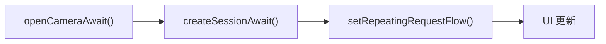

# 第26章：非同期カメラプログラミング

## まとめ

第 7 章から第 9 章で書いたコードを思い出してください。`openCamera` の中に `StateCallback` があり、その中にセッション作成のコールバックがあり、さらにその中に `CaptureCallback` がある……。これはまさに「コールバック地獄」です。エラーが発生した際のクリーンアップも、逆順ですべての階層で行う必要があり、一つでも忘れるとカメラリソースがリークしてしまいます。

この章では、このスパゲッティコードを、Kotlin の **Coroutines (コルーチン)** と **Flow** を使用して、クリーンで線形なコードにリファクタリングします。非同期な Camera2 API を、「待機可能 (suspend)」な関数や「データの流れ (Flow)」として扱う方法を学びます。

---

## コールバック地獄からの脱却

従来のネストされた構造を、コルーチンを使うと以下のようなフラットな流れに書き換えることができます：



### 1. 単発操作：`suspendCancellableCoroutine`

カメラを開く、セッションを作る、といった「1 回呼んで 1 回結果が返る」操作には `suspendCancellableCoroutine` が最適です。

```kotlin
suspend fun CameraManager.openCameraAwait(cameraId: String, handler: Handler): CameraDevice =
    suspendCancellableCoroutine { cont ->
        val callback = object : CameraDevice.StateCallback() {
            override fun onOpened(camera: CameraDevice) {
                // 成功：コルーチンを再開し、結果を返す
                cont.resume(camera) { camera.close() }
            }
            override fun onError(camera: CameraDevice, error: Int) {
                // 失敗：例外を投げてコルーチンを終了する
                cont.resumeWithException(CameraAccessException(error))
            }
            // ... (onDisconnected)
        }
        openCamera(cameraId, callback, handler)
    }
```

これを呼び出す側は、たった 1 行で済みます。`withTimeout` を使えば、HAL のフリーズによるアプリのハングも簡単に防げます。

---

## 2. 継続的なストリーム：`callbackFlow`

プレビューフレームや、継続的に送られてくるキャプチャ結果などには **`Flow`** を使用します。

### ImageReader を Flow に変換する

`acquireLatestImage()` を使用して、常に最新のフレームだけを流す Flow を作成します。

```kotlin
fun ImageReader.imagesFlow(): Flow<Image> = callbackFlow {
    val listener = ImageReader.OnImageAvailableListener { reader ->
        val image = reader.acquireLatestImage() ?: return@OnImageAvailableListener
        trySend(image)
    }
    setOnImageAvailableListener(listener, null)
    
    // コルーチンがキャンセルされたらリスナーを解除する
    awaitClose { setOnImageAvailableListener(null, null) }
}.conflate() // 最新のフレームのみを保持し、古いものは捨てる
```

---

## 3. スレッドセーフの鉄則

コルーチンを使っても、Camera2 のスレッドルールは守る必要があります。

1. **メインスレッドをブロックしない**: `openCamera` などは、たとえ `suspend` 化しても、内部の処理が重いため、必ず背景スレッド（`Dispatchers.Default` など）から呼ぶようにします。
2. **専用スレッドの使用**: 多くのデバイスの HAL は、特定の操作が同一スレッドから呼ばれることを期待しています。`HandlerThread` を `asCoroutineDispatcher()` でコルーチン用スレッドとして使うのが安全です。
3. **共有状態の保護**: コールバックとコルーチンの両方からアクセスする変数は、`Mutex` で保護するか、`@Volatile` を付与します。

---

## まとめ

Kotlin の強力な非同期プリミティブを使用することで、Camera2 開発の難易度は大幅に下がります。
- **`suspendCancellableCoroutine`**: 複雑なオープン・構成フローを 1 本の線にする。
- **`Flow` / `callbackFlow`**: フレーム解析やメタデータ監視をリアクティブにする。
- **キャンセル対応**: コルーチンのキャンセルと連動して、カメラを確実に閉じ、リークを防ぐ。

## 次のステップ

ロジックは綺麗になりました。次は、そのロジックが 2 万機種以上の Android デバイスで正しく動くか、どうやって検証するかを学びます。**第27章：カメラのテスト**では、Google 基準のテスト (ITS/CTS) の内容と、実機なしで CI を回すためのモック手法を解説します。
