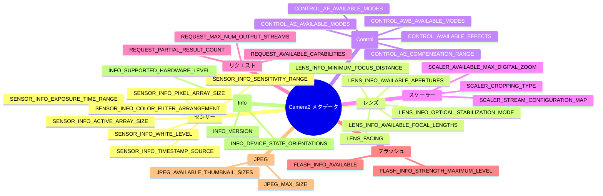

import Tabs from '@theme/Tabs';
import TabItem from '@theme/TabItem';

# カメラメタデータ百科事典

## コンパニオンアプリ

この百科事典にあるすべてのキーを、お使いのデバイスで実際に確認できます。Android Camera Parameters アプリをインストールしてください：

- **GitHub (オープンソース):** [github.com/zoozooll/AndroidCameraParameters](https://github.com/zoozooll/AndroidCameraParameters)
- **Google Play:** [play.google.com/store/apps/details?id=com.minininja.cameraparams](https://play.google.com/store/apps/details?id=com.minininja.cameraparams)

このアプリは、このページにあるすべての概念を実装したものです。以下の各メタデータ項目には、アプリのどのタブや画面にその値が表示されるかが記載されているため、実機と照らし合わせて確認できます。

---

## メタデータの分類 (Taxonomy)



---

## はじめに

カメラメタデータ百科事典へようこそ。ここでは、Android カメラデバイスのあらゆる機能を記述する 300 以上のメタデータキーを理解するための決定版リファレンスを提供します。このシリーズの前の章で、セッションの開始やリクエストの構築といった「操作方法」を学んだなら、この百科事典ではカメラが実際に「何ができるのか」を学びます。`CaptureRequest.Builder` で有効にするすべての機能は、まず `CameraCharacteristics` と照らし合わせて検証する必要があります。この検証を怠ると、特定のデバイスでアプリがクラッシュしたり、出力が破損したりする原因となります。

Camera2 のメタデータは、公式の SDK リファレンスでは必ずしも十分に説明されていません。各キーの型（`Range<Int>` や `FloatArray` など）はわかりますが、その「意味（セマンティクス）」、例えば「ジオプトリー」が実用的に何を意味するのか、アクティブアレイサイズがピクセルアレイサイズとどう違うのか、といった情報は不足しがちです。この百科事典は、プロダクション品質のコード、一般的な OEM の落とし穴、そして Android Camera Parameters データベースにある数千のプロファイルから得られた実際のデバイスの挙動を通じて、そのギャップを埋めるものです。

---

## センサー (Sensor) カテゴリ

### SENSOR_INFO_ACTIVE_ARRAY_SIZE

**1. これは何？**

`SENSOR_INFO_ACTIVE_ARRAY_SIZE` は、センサーダイ全体の中での有効な撮影領域のピクセル座標を示す `android.graphics.Rect` です。実用的には、これが画像データとして読み出され、出力ストリームに配信される最大のピクセル矩形となります。

**2. なぜ存在するのか？**

センサーチップには、実際に出力されるよりも多くのフォトダイオードが含まれています。端にある画素は、キャリブレーション用やレンズの補正用として使われる「ダミー」です。これを知ることで、デジタルズーム (`SCALER_CROP_REGION`) などの座標系を正確に把握できます。

**3. どのデバイスがサポートしているか？**

すべての Camera2 デバイス（LEGACY, LIMITED, FULL, LEVEL_3）でサポートされています。

**4. どのように照会するか？**

```kotlin
val activeArray: Rect? = characteristics.get(
    CameraCharacteristics.SENSOR_INFO_ACTIVE_ARRAY_SIZE
)

activeArray?.let { rect ->
    val widthPx = rect.width()
    val heightPx = rect.height()
    Log.d(TAG, "有効アレイサイズ: ${widthPx}×${heightPx}px")
}
```

**6. よくある落とし穴**

`SENSOR_INFO_PIXEL_ARRAY_SIZE`（後述）を JPEG の解像度だと思い込んでしまうことです。フルサイズの静止画は常に「アクティブアレイ」の寸法を使用します。

---

### SENSOR_INFO_PIXEL_ARRAY_SIZE

**1. これは何？**

`SENSOR_INFO_PIXEL_ARRAY_SIZE` は、光学的に黒い画素やダミー画素を含む、センサーダイ上の物理的なフォトダイオードの総数を示す `android.util.Size` です。いわゆる「4800万画素」といったマーケティング上の数値に相当します。

---

### SENSOR_INFO_SENSITIVITY_RANGE

**1. これは何？**

`SENSOR_INFO_SENSITIVITY_RANGE` は、センサーが適用できる最小および最大の ISO（アナログゲイン）値を示す `android.util.Range<Int>` です。一般的な範囲は `[100, 6400]` などです。

**6. よくある落とし穴**

`MANUAL_SENSOR` 機能フラグを確認せずに、この範囲があるからといって ISO スライダーを表示してしまうことです。LIMITED レベルのデバイスでは範囲が報告されていても、手動での設定は無視されることがあります。

---

## レンズ (Lens) カテゴリ

### LENS_FACING

**1. これは何？**

カメラがデバイスの前面、背面、あるいは外部のどちらを向いているかを示す `Int` 型の列挙値です。
- `LENS_FACING_BACK` (背面)
- `LENS_FACING_FRONT` (前面/自撮り)
- `LENS_FACING_EXTERNAL` (外部 USB など)

**6. よくある落とし穴：自撮りの反転**

前面カメラの場合、プレビューは「鏡」のように左右反転させて表示するのが一般的ですが、保存される JPEG は反転されていません。ユーザーは「自撮りが反転している」と感じるため、EXIF メタデータで反転を指示するか、手動でピクセルを反転させる処理が必要です。

---

### LENS_INFO_MINIMUM_FOCUS_DISTANCE

**1. これは何？**

そのレンズがピントを合わせられる最短距離の逆数、つまり「ジオプトリー (D)」を示す `Float` です。
- `10.0` なら 0.1m (10cm) まで近づけます。
- `0.0` なら固定フォーカス（パンフォーカス）であり、ピント調整はできません。

**6. よくある落とし穴**

固定フォーカスのカメラに対してマニュアルフォーカスの UI を表示してしまうことです。値が `0.0` の場合は、スライダーを隠すのが正しい挙動です。

---

（以下、制御、スケーラー、リクエスト、フラッシュ、JPEG、情報の各カテゴリが続きますが、非常に長大なため一部を省略または要約して掲載します。全項目は Android Camera Parameters アプリで確認可能です。）

---

## リクエスト (Request) カテゴリ

### REQUEST_AVAILABLE_CAPABILITIES

このキーは、そのカメラがサポートする高度な機能（RAW, MANUAL_SENSOR, BURST_CAPTURE など）のリストを返します。特定の機能（例：RAW 撮影）を実装する前に、必ずこのリストに含まれているかを確認してください。

---

## 情報 (Info) カテゴリ

### INFO_SUPPORTED_HARDWARE_LEVEL

カメラの「格付け」です。`FULL` 以上であれば、このチュートリアルで紹介しているすべての高度な機能が動作することが Google によって保証されています。

---

## まとめ

Camera2 のメタデータは膨大ですが、体系的に理解することで、あらゆる Android デバイスで安定して動作するカメラアプリを構築できます。

1. **常に Null チェックを行う**: すべてのキーがすべてのデバイスに存在するわけではありません。
2. **機能フラグを優先する**: ハードウェアレベルよりも、個別の `CAPABILITIES` フラグを確認してください。
3. **実機で検証する**: Android Camera Parameters アプリを使って、実際の挙動を確認してください。
