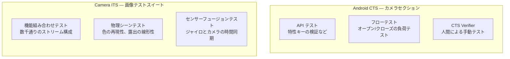

# 第27章：カメラのテスト

## まとめ

カメラアプリを作りました。Pixel や Galaxy では動きます。では、格安の Android Go デバイスや、ベンダーの実装に癖のあるデバイスでも正しく動くでしょうか？

カメラソフトウェアのテストは、2 つの側面から考える必要があります：**HAL レベルでの OEM 検証**（Google がメーカーに課す、出荷前の強制テスト）と、**アプリレベルでの CI テスト**（実機を必要とせずにコードの論理を検証するテスト）です。この章ではその両方をカバーします。

[Android Camera Parameters アプリ](https://github.com/zoozooll/AndroidCameraParameters)をリファレンスとして使用し、テストで検証すべき正確な機能を把握してください。

---

## 第 1 部：OEM による検証 — Camera ITS と CTS

Android デバイスが出荷される前に、メーカーは Google の互換性テスト (CTS) に合格する必要があります。カメラに関しては、特に物理的なテストリグを必要とする **Camera ITS (Image Test Suite)** が重要です。

### テストカテゴリ

### ITS が保証するもの：アプリ開発者への恩恵
ITS の存在は、アプリ開発者にとって「HAL が満たすべき最低限の品質基準」となります。
- **露出の線形性**: ISO を 2 倍にすれば、画像も数学的に正しく 2 倍明るくなることが保証されます。これにより、第 14 章のマニュアル露出スライダーが予測通りに動作します。
- **タイムスタンプの同期**: カメラの `SENSOR_TIMESTAMP` とジャイロスコープの時間が正確に同期していることが保証されるため、ARCore などの AR 機能が安定して動作します。

---

## 第 2 部：アプリのテスト — モックと CI

実機を CI サーバーに繋ぐのは大変です。Mockito などのライブラリを使用して Camera2 の各クラスを**モック化**することで、物理的なカメラがない環境でもパイプラインの論理をテストできます。

### テストのポイント
1. **コールバックのキャプチャ**: `ArgumentCaptor` を使用して、`openCamera` や `createCaptureSession` に渡されるコールバックを捕まえ、HAL の応答を手動でシミュレートします。
2. **ハードウェアレベル別のテスト**: `LEGACY` デバイスで特定の機能（`CONTROL_MODE_OFF` など）を呼んだ際に、アプリがフリーズしたりクラッシュしたりせず、適切に機能を制限（Graceful Degradation）できるかを検証します。
3. **実機でのサニティテスト**: OS のアップデートなどで露出制御が壊れていないか、少数の実機で定期的に実際のキャプチャを行い、結果を数値で検証します。

---

## まとめ

カメラのテストは、OEM によるハードウェアの検証と、開発者によるアプリの論理検証の組み合わせです。
- **ITS/CTS**: HAL の最低品質を保証する。
- **Mockito によるモック**: CI 上で実機なしでテストを回す。
- **パラメータ化テスト**: デバイスの性能（ハードウェアレベル）に応じた挙動の検証。

## 次のステップ

すべての API とテスト手法をマスターしました。最後に、Camera2 の真の姿を解き明かしましょう。**第28章：Camera2アーキテクチャ**では、Kotlin のコードからカーネルドライバ、そしてレンズを動かすモーターに至るまでのフルスタックを俯瞰します。
