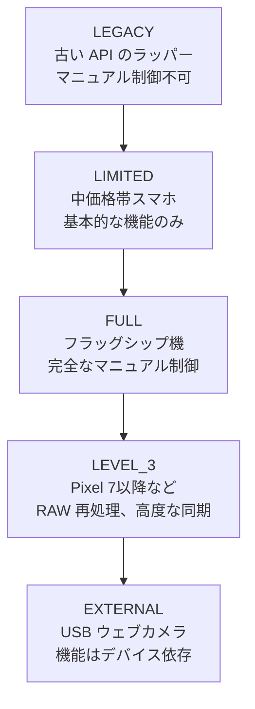

# 第4章：自分の電話を探索する

この章では、あなたのアプリが重要になります。第2章と第3章ではカメラハードウェアと計算写真機能の理論的な理解を深めました。この章は実践的でデバイス固有の内容です。**Android Camera Parameters** コンパニオンアプリを自分の電話にインストールし、ハードウェアができることとできないことを体系的に検査します。

ここで発見する情報は、単なるトリビアではありません。Camera2 API は、デバイスごと、カメラごとに機能を公開します。あなたの Pixel 10 で完璧に動作する機能が、2023年の Samsung A シリーズでは（HAL が実装されていないために）静かに失敗したり、クラッシュしたりする可能性があります。コードを書く前に、自分のテストデバイスが何に対応しているかを知る必要があります。

この章を終える頃には、あなたの電話について以下の情報を把握できているはずです：カメラ ID の完全なリスト、各カメラのハードウェアレベル、サポートされている出力形式、最大 JPEG 解像度、最高 FPS 範囲、最大ズーム倍率、そして RAW 出力の可否。

## Android Camera Parameters アプリのインストール

2 つのインストールオプションがあります。お好みの方法を選んでください。

### オプション A — ソースからビルドする

Android 開発者で、既に Android Studio がインストールされている場合は、このオプションが最適です。アプリのソースコードを確認したり、興味のある Camera2 特性を追加で検査するように改造したりできます。

1. GitHub リポジトリをクローンします：
   `https://github.com/zoozooll/AndroidCameraParameters`
2. Android Studio でプロジェクトを開きます。Gradle の同期が自動的に完了します。
3. 電話の USB デバッグを有効にします（「設定」→「デバイス情報」→「ビルド番号」を 7 回タップ）。
4. 電話をコンピュータに接続し、Android Studio の実行ボタンをクリックします。

### オプション B — Google Play からインストールする

ビルドせずにすぐに実行したい場合や、複数のエンドユーザーデバイスで挙動を確認したい場合は、Play ストア版を使用してください。

`https://play.google.com/store/apps/details?id=com.minininja.cameraparams`

インストール後、アプリを起動し、システムの許可ダイアログが表示されたら「カメラ」権限を許可してください。Android のセキュリティモデルでは、カメラの特性を「照会」するだけでも実行時の権限許可が必要です。

---

## カメラ ID (Camera IDs)

アプリのホーム画面（通常は「Cameras」または「Overview」タブ）を見てください。「All Camera IDs」という見出しがあります。

Android デバイス上の個々のカメラ（背面、前面、論理マルチカメラ、外部 USB ウェブカメラなど）には、一意の文字列識別子である **Camera ID** が割り当てられています。ID は通常、"0", "1", "2" といった単純な整数です。

各行には以下の 3 つの情報が表示されます：
1. **Camera ID**: 太字のチップで表示。
2. **LENS_FACING**: 向いている方向（`BACK`：背面、`FRONT`：前面、`EXTERNAL`：外部）。
3. **Hardware Level**: そのカメラの格付け（`LEGACY`, `LIMITED`, `FULL`, `LEVEL_3`, `EXTERNAL`）。

**自分のデバイスで確認**: ID、向き、ハードウェアレベルをメモしてください。合計で何個のカメラがありますか？

---

## ハードウェアレベル (Hardware Levels)

第 1 章で紹介したように、Camera2 には 5 つのハードウェアレベルがあります。

- **FULL / LEVEL_3**: すべての Camera2 API 機能が動作することが保証されています。このチュートリアルで紹介する高度な機能もすべて実装可能です。
- **LIMITED**: 基本的な撮影はできますが、マニュアル露出や RAW 出力などの一部の機能が制限されています。

**自分のデバイスで確認**: 背面メインカメラ（通常 ID 0）と前面カメラのレベルを確認してください。

---

## サポートされている出力形式 (Output Formats)

カメラ詳細画面の「Formats」タブを開いてください。主要な 5 つの形式が表示されます：

1. **JPEG**: 最も一般的な写真形式。
2. **YUV_420_888**: 顔検出や ML 処理、独自の画像処理に使用される未圧縮形式。
3. **PRIVATE**: ディスプレイへのプレビュー表示に使用される、最も高速なゼロコピー形式。
4. **RAW_SENSOR**: センサーからの未加工データ。DNG ファイルとして保存され、Lightroom 等で現像します（FULL 以上で利用可能）。
5. **JPEG_R**: Android 14 で導入された Ultra HDR 形式。

**自分のデバイスで確認**: 形式の有無と、最大 JPEG 解像度（例：4000x3000）をメモしてください。

---

## まとめ

この章では、Android Camera Parameters コンパニオンアプリを使用して、自分のデバイスのカメラ性能を詳しく調査しました。
- 全カメラ ID とその向き。
- 各カメラがどの「ハードウェアレベル」に属しているか。
- サポートされている出力形式と最高解像度。
- ズーム倍率と物理カメラの切り替えポイント。

## 次のステップ

第 I 部はこれで終了です。ハードウェアの基礎、機能の語彙、そして自分の電話の能力マップが手に入りました。第 II 部からは、いよいよ Camera2 API のコードを書いていきます。第 5 章では、100 行程度の Kotlin コードで画面にライブプレビューを表示することから始めます。
