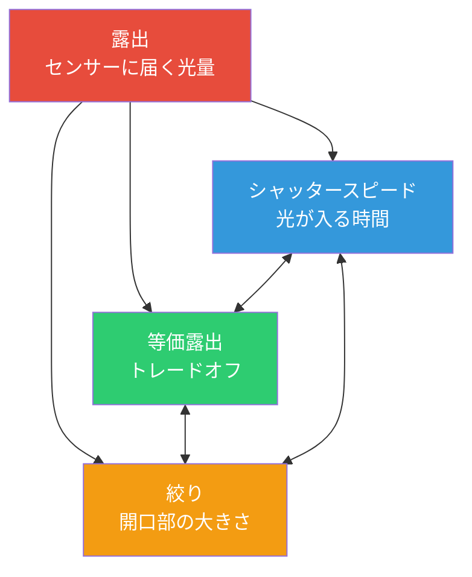

# 第13章：露出

## 露出の三角形：3つのノブ、1つの目標

スマートフォンで写真を撮る際、あなたは光を捉えています。センサーに届く光の**量**が、写真が暗すぎる（露出不足）か、明るすぎる（露出過度）か、あるいは適切（適正露出）かを決定します。これを制御するのが、**露出の三角形**と呼ばれる 3 つの基本的な要素です。

**核となる考え方：** それぞれの要素が光を制御しますが、同時に*クリエイティブなトレードオフ*も発生させます。同じ明るさの写真を撮るために異なる組み合わせを選ぶことができますが、組み合わせによって写真の「見た目」が変わります。

---

## ISO：センサー感度 (ゲイン制御)

フィルムカメラの時代、**ISO** はフィルムの光に対する感度を表していました。デジタル写真（スマートフォンカメラを含む）において、ISO は**センサーのゲイン（電子的な増幅）**を意味します。

- **ISO 100 = ベース / 最小ゲイン。** 増幅が最小限であるため、ノイズ（ざらつき）が少なく、ダイナミックレンジが最も広く、色が正確です。
- **ISO 3200 = 高ゲイン。** 信号が大幅に増幅されます。暗い場所でも撮影できますが、画像に「ノイズ」（色の斑点や輝度のざらつき）が目立つようになります。

---

## シャッタースピード (露出時間)

**シャッタースピード**は、センサーが光にさらされる**時間**です。スマートフォンでは通常、電子シャッターが使用され、センサーが光を収集する時間を精密に制御します。

| シャッタースピード | 効果 | ユースケース |
|:---|:---|:---|
| 1/2000秒 – 1/1000秒 | 非常に短い。動きを止める。 | スポーツ、鳥、高速移動する車 |
| 1/125秒 – 1/60秒 | 手ぶれ補正があれば「安全」な速度。 | 一般的なスナップ写真 |
| 1秒 – 30秒 | 長時間露光。動きをぼかす。 | 滝、星の軌跡、光の絵 |

**動画における重要性：** 30fps の動画を撮る場合、各フレームの露出は最大約 1/30秒です。映画のような自然な動きのボケを作るには、フレームレートの 2 倍（30fps なら 1/60秒）に設定する「180度シャッタールール」がよく使われます。

---

## 絞り (Aperture)

**絞り**は、光が通過するレンズの開口部の大きさです。**f値**（f/1.4, f/2.0, f/2.8 など）で測定されます。*数値が小さいほど開口部が大きくなる*という、直感とは逆のスケールです。

### スマートフォンの現実

ほとんどのスマートフォンは**固定絞りレンズ**を採用しています。つまり、f値を変更することはできません。フラッグシップ機では f/1.4〜f/1.8 程度に達するものもあります。Camera2 開発において、絞りは基本的に*固定*であるため、露出の制御は主に **ISO + シャッタースピード** の 2 つで行うことになります。

---

## EV：露出値 (対数スケール)

写真家が「1段（1ストップ）調整する」と言うとき、それは**光量を 2 倍、あるいは半分にする**ことを意味します。この「段」の考え方を正確にするために標準化されたのが **Exposure Value (EV)** です。

**EV 0** は、ISO 100, f/1.0, 1秒の露出組み合わせとして定義されています。

- **+1 EV** は光量を 2 倍（明るく）します。
- **-1 EV** は光量を半分（暗く）します。

ISO、シャッター、絞りの組み合わせが異なっても、それらの合計が同じ EV 値であれば、同じ明るさの写真になります。

---

## 適正露出の見た目

- **露出不足 (-2 EV):** 全体的に暗すぎます。シャドウ（暗い部分）のディテールが失われ、真っ黒に潰れてしまいます。
- **適正露出 (0 EV):** 中間調が適切で、テクスチャがはっきり見えます。ヒストグラムは端で極端に途切れることなく広がっています。
- **露出過度 (+2 EV):** 明るすぎてディテールが失われます。ハイライト（明るい部分）が「白飛び」し、真っ白な平坦な領域になってしまいます。**白飛びしたディテールは、後から加工しても取り戻すことができません。**

---

## まとめ

- **露出の三角形**: シャッタースピード、ISO、絞りの 3 つが光を制御します。それぞれにトレードオフがあります。
- **ISO**: 低いと綺麗、高いとノイズが増える。
- **シャッタースピード**: 速いと動きが止まり、遅いと動きがブレる。
- **絞り**: スマートフォンではほとんどが固定。
- **EV (露出値)**: 光量を 2 倍/半分にする「段」のスケール。

## 次のステップ

**第14章：Camera2 におけるマニュアル露出**では、これらの概念を具体的な Camera2 API 呼び出しに変換する方法を学びます。オート露出パイプラインを無効にし、ISO やナノ秒単位の露出時間を手動で設定する方法を解説します。
