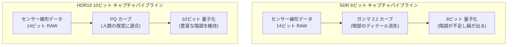

# 第21章：HDRとUltra HDR

標準ダイナミックレンジ (SDR) 写真は、1990年代のブラウン管向けに設計された規格です。現代のスマートフォンセンサーは 10〜14 ストップのダイナミックレンジを捉えますが、8ビットの SDR JPEG では約 6 ストップしか表現できず、ハイライトが白飛びするかシャドウが黒く潰れてしまいます。**ハイダイナミックレンジ (HDR)** 形式は、10ビット以上のデータ保持と広色域によってこの問題を解決します。

この章では、Android Camera2 で利用可能な 3 つの主要な HDR 技術をカバーします：
- **HDR10** (10ビット、Rec.2020) — ビデオ用
- **HLG (Hybrid Log-Gamma)** — 放送および後方互換ビデオ用
- **JPEG_R / Ultra HDR** (Android 14+) — SDR と後方互換性のある静止画用の革新的な形式

[Android Camera Parameters アプリ](https://github.com/zoozooll/AndroidCameraParameters)では、各カメラが HDR10 や `ImageFormat.JPEG_R` をサポートしているか確認できます。

---

## ダイナミックレンジの基礎：なぜ 8 ビットでは不十分なのか

SDR で使用されるガンマカーブは人間の視覚系ではなく、古いモニターの特性に合わせて作られました。対して HDR10 で使用される **PQ (Perceptual Quantizer)** カーブは、人間のコントラスト感度に数学的に適合しており、0〜10,000 nit の全範囲で滑らかな階調を実現します。



---

## HLG (Hybrid Log-Gamma)：後方互換性のある HDR

HLG は、視聴者が HDR ディスプレイを持っているか SDR ディスプレイを持っているか事前にはわからないライブ放送向けに設計されました。
- 下位 50% の範囲は標準的なガンマカーブ（SDR と一致）。
- 上位 50% は対数カーブ（HDR のハイライト情報を保持）。

これにより、HLG ビデオは SDR ディスプレイでは普通のビデオとして再生され、HDR ディスプレイでは「封印」が解かれて眩しいハイライトがレンダリングされます。SNS への投稿など、幅広いデバイスで共有される動画に最適です。

---

## JPEG_R (Ultra HDR)：SDR + 埋め込みゲインマップ

Android 14 で導入された **JPEG_R** は、モバイル HDR 写真における最大の進歩です。この形式は「後方互換性」を核として設計されています。

> JPEG_R ファイルは標準的な 8ビット SDR JPEG ですが、その内部に**「ゲインマップ」**と呼ばれる小さな画像が埋め込まれています。古いデコーダーはゲインマップを無視して普通の JPEG として表示します。HDR 対応のデコーダーは、このゲインマップを読み取ってハイライト部分を局部的にブーストし、最大 8 段分の明るさを復元します。

これにより、Instagram や Google フォトなど、既存のあらゆるプラットフォームで問題なく表示されつつ、HDR 環境では劇的な画質向上を享受できます。

### キャプチャの実装

`ImageFormat.JPEG_R` を使用したキャプチャは、通常の JPEG とほぼ同じですが、`DynamicRangeProfiles.JPEG_R` を設定する必要があります。

```kotlin
// JPEG_R のサポートを確認
val drProfiles = characteristics.get(
    CameraCharacteristics.REQUEST_AVAILABLE_DYNAMIC_RANGE_PROFILES
)
val supportsJpegR = drProfiles?.isProfileSupported(DynamicRangeProfiles.JPEG_R) == true

// ImageReader の作成
val imageReader = ImageReader.newInstance(width, height, ImageFormat.JPEG_R, 2)

// 出力構成
val outputConfig = OutputConfiguration(imageReader.surface).apply {
    setDynamicRangeProfile(DynamicRangeProfiles.JPEG_R)
}
```

---

## HDR 形式の比較まとめ

| 基準 | HDR10 (ビデオ) | HLG (ビデオ) | JPEG_R (静止画) |
|:---|:---|:---|:---|
| **ビット深度** | 10ビット | 10ビット | 8ビット + ゲインマップ |
| **後方互換性** | なし (暗く見える) | **あり** | **あり** (極めて高い) |
| **主な用途** | 映画、YouTube | ライブ放送、SNS 動画 | 次世代の標準写真形式 |

## まとめ

- **ダイナミックレンジ**: SDR の 8ビットでは現代のセンサーの性能を活かせません。
- **HLG**: SDR ディスプレイでも正しく見えるビデオ形式。
- **JPEG_R / Ultra HDR**: 標準 JPEG の中に HDR 情報を隠し持つ、革新的な静止画形式。
- **実装**: `DynamicRangeProfiles` を介して 10ビットパスを有効化します。

## 次のステップ

標準のキャプチャセッションを離れ、OEM が提供する高度な機能を活用しましょう。**第22章：カメラエクステンション**では、夜景モードやポートレートモード（ボケ）を自作アプリに統合する方法を学びます。
