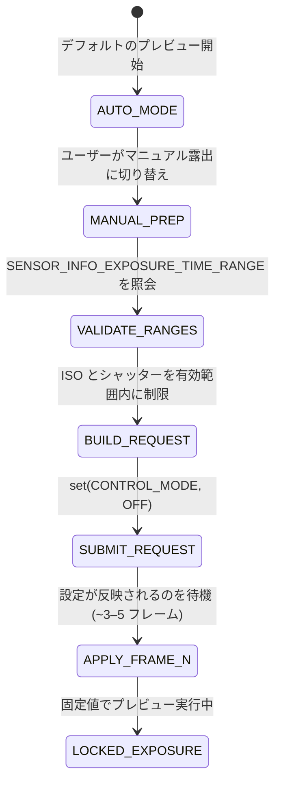

# 第14章：Camera2におけるマニュアル露出

第13章で学んだ写真の理論をコードに落とし込みます。カメラのオート露出 (AE) システムを完全に掌握し、ISOとシャッタースピードを Camera2 API で手動設定する方法を学びます。

[Android Camera Parameters アプリ](https://github.com/zoozooll/AndroidCameraParameters)では、この章で紹介するすべてのテクニックを確認できます。アプリのマニュアルモードで ISO やシャッター速度のスライダーを動かし、リアルタイムで変化する結果を観察してみてください。

---

## 大きな切り替え：AUTOからMANUALへ

デフォルトでは、すべてのキャプチャリクエストはカメラ内蔵の 3A オートパイプライン（露出、フォーカス、ホワイトバランス）の下で動作します。マニュアル操作を行うには、このパイプラインを**明示的に無効化**する必要があります。

無効化には 2 つのレベルがあります：

1. **AE のみを無効化**: `CONTROL_AE_MODE = OFF`。ISO とシャッターが手動になります。AF と AWB はオートのままです。
2. **3A 全体を無効化**: `CONTROL_MODE = OFF`。すべてのオートアルゴリズムが停止します。すべてのパラメータを手動で設定する必要があります。

信頼性の高いマニュアル露出を実現するには、**両方**を設定するのが最もクリーンで予測可能な方法です。



**反映までの遅延：** CMOS センサーの構造上、設定を変更してから実際に画面に反映されるまでには **3〜5 フレームの遅延** が発生します。

---

## Camera2 API におけるマニュアル制御

### SENSOR_SENSITIVITY (ISO)

Camera2 では ISO を `CaptureRequest.SENSOR_SENSITIVITY` という整数値で表現します。ほとんどのデバイスで写真の ISO 値と 1:1 で対応しています。

**必ず有効範囲を照会してください。** 値をハードコードしてはいけません：

```kotlin
val sensorSensitivityRange = characteristics.get(
    CameraCharacteristics.SENSOR_INFO_SENSITIVITY_RANGE
)
val minIso = sensorSensitivityRange?.lower ?: 100
val maxIso = sensorSensitivityRange?.upper ?: 6400
```

### SENSOR_EXPOSURE_TIME (ナノ秒単位のシャッター)

Camera2 開発における最大の罠：**シャッタースピードの単位は秒ではなく、ナノ秒 (ns) です。**

- 1秒 = 1,000,000,000 ナノ秒
- 1/60秒 ≈ 16,666,666 ナノ秒

**代表的な値の対応表：**

| 人間が考えるシャッター | ナノ秒 (ns) |
|:---|:---|
| 1/1000秒 | 1,000,000 |
| 1/60秒 | 16,666,666 |
| 1秒 | 1,000,000,000 |

---

## ⚠️ 重要：マニュアルモードにおける画質の劣化

**これはこの章で最も重要な警告です。**

`CONTROL_MODE = OFF`（完全なマニュアル）に設定すると、AE/AF/AWB のアルゴリズムが無効になるだけでなく、ほとんどの Android デバイスで **OEM 独自の計算処理（後処理）も無効化されます。**

これには、マルチフレームノイズ低減、適正なトーンマッピング、HDR 合成などが含まれます。そのため、マニュアルモードで撮影した写真は、オートモードで同じ ISO/シャッター値になった場合よりも**ノイズが多く、コントラストが平坦に見える**ことがあります。

**対策：**
1. **自分で後処理を行う。** RAW キャプチャ（後の章で解説）とカスタム現像を組み合わせることで、最大限の制御が可能になります。
2. **AE_LOCK を活用する。** 完全に無効化するのではなく、オートで収束した値をロックする方法もあります。

---

## 実装例：タイムラプス用の露出固定

タイムラプス撮影では、雲の動きなどで露出がフレームごとに微妙に変わると、動画にした時に激しいチラつき（フリッカー）が発生します。これを防ぐために ISO とシャッターを固定します。

```kotlin
val requestBuilder = cameraDevice.createCaptureRequest(CameraDevice.TEMPLATE_STILL_CAPTURE).apply {
    addTarget(previewSurface)
    addTarget(imageReaderSurface)

    // 重要：3A を無効にして値を固定する
    set(CaptureRequest.CONTROL_MODE, CameraMetadata.CONTROL_MODE_OFF)
    set(CaptureRequest.CONTROL_AE_MODE, CameraMetadata.CONTROL_AE_MODE_OFF)
    set(CaptureRequest.SENSOR_SENSITIVITY, 100)           // ISO 100
    set(CaptureRequest.SENSOR_EXPOSURE_TIME, 16666666L)   // 1/60s
}

captureSession.capture(requestBuilder.build(), callback, handler)
```

---

## まとめ

- **3A の無効化**: マニュアル制御には `CONTROL_MODE = OFF` と `CONTROL_AE_MODE = OFF` が必要です。
- **ISO**: `SENSOR_SENSITIVITY` を使用します。
- **シャッター速度**: `SENSOR_EXPOSURE_TIME` を**ナノ秒**単位で設定します。
- **画質の変化**: マニュアルモードではメーカー独自の強力なノイズ除去などがオフになるため、後処理の計画が必要です。

## 次のステップ

露出は明るさを制御します。**第15章：フォーカス**では、ピントの鮮明さを制御する方法、AF ステートマシンの扱い、そして「ジオプトリー」という聞き慣れない単位を使ったマニュアルフォーカスの実装方法を学びます。
