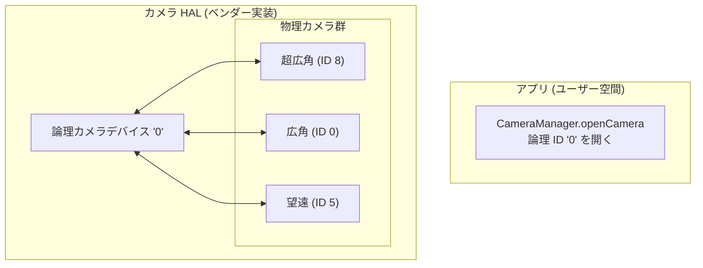

# 第20章：マルチカメラ

現代のスマートフォンには 3〜5 個の背面カメラ（超広角、広角、望遠、マクロ、深度など）が搭載されています。Android 9 (API 28) 以前は、各レンズが独立したカメラ ID として表示され、アプリはズームの境界でカメラを閉じたり開いたりする必要がありました。これは画面のチラつきやフォーカスの喪失を招いていました。Android 9 は**論理カメラ (Logical Camera)** という抽象化を導入しました。これは、同じ方向を向いた複数の物理カメラを一つの仮想 ID にまとめ、HAL（ハードウェア抽象化レイヤー）がレンズの切り替えを透過的に行えるようにしたものです。

[Android Camera Parameters アプリ](https://github.com/zoozooll/AndroidCameraParameters)では、お使いのデバイスの論理・物理カメラの構成を確認できます。

## 論理カメラ対物理カメラ

論理カメラは、2 つ以上の物理カメラを背後で管理する仮想デバイスです。論理 ID を開くと、HAL がズーム倍率に応じて適切なレンズを自動的に選択します。

### シームレスズーム
`CaptureRequest.CONTROL_ZOOM_RATIO` を設定すると、HAL は適切なレンズに切り替え、デジタルクロップを組み合わせてスムーズなズームを実現します。アプリ側でレンズの切り替えを意識する必要はありません。

---

## センサー同期：APPROXIMATE 対 CALIBRATED

2 つの物理カメラから同時にキャプチャする場合、それらの露出開始タイミングがどの程度一致しているかが重要です。

| 同期レベル | 意味 | ユースケース |
|:---|:---|:---|
| **APPROXIMATE** | 誤差が ±33ms (1フレーム) 以内。 | カジュアルなボケ（ポートレートモード） |
| **CALIBRATED** | 誤差が **±1ms** 以内。ハードウェアレベルで同期。 | AR、精密な深度測定、3Dスキャン |

精度の高い深度計測や視差（ディスパリティ）を利用した機能を開発する場合は、必ず `CALIBRATED` であることを確認してください。そうしないと、被写体が動いている場合に深度マップが破綻します。

---

## 実装：デュアル物理キャプチャ

広角レンズと望遠レンズから同時にフレームを取得する場合の手順：

1. **ID の取得**: 論理 ID から `getPhysicalCameraIds()` を呼び出し、子供たちの ID を取得します。
2. **OutputConfiguration**: 各 ImageReader の Surface に対して `setPhysicalCameraId()` を呼び出し、特定の物理カメラをターゲットに設定します。
3. **セッション作成**: これらの Surface を含めてキャプチャセッションを作成します。

**重要なルール：**
同じセッション内で複数の物理ストリームを扱う場合、それらの**サイズと形式は同じ**である必要があります（例：両方 1080p の YUV）。

---

## まとめ

- **論理カメラ**: 複数の物理レンズを一つにまとめた仮想カメラ。
- **シームレスズーム**: `CONTROL_ZOOM_RATIO` で HAL にレンズ切り替えを任せる。
- **センサー同期**: `CALIBRATED` であればミリ秒単位の精密な同時撮影が可能。
- **同時キャプチャ**: `setPhysicalCameraId()` を使って特定のレンズを狙い撃ちする。

## 次のステップ

複数のカメラを活用できるようになりました。次は画質を極めましょう。**第21章：HDRとUltra HDR** では、10ビットビデオや、Android 14 で導入された次世代形式 JPEG_R（Ultra HDR）について学びます。
