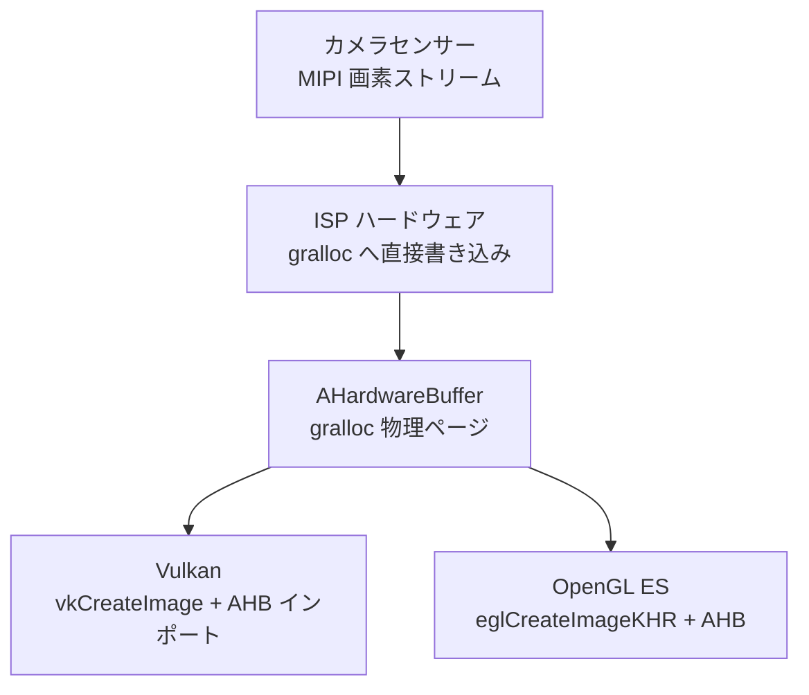

# 第25章：ネイティブカメラ開発

## まとめ

これまでの章では、ART 上で動作する Kotlin または Java を使用し、キャプチャリクエストごとに Binder IPC 境界を越え、`ByteBuffer` でフレームのコピーを作成するか、`SurfaceTexture` を介したテクスチャストリーミングのオーバーヘッドを受け入れてきました。一般的なカメラアプリならこれで十分ですが、AR エンジン、リアルタイムのコンピュータビジョンパイプライン、あるいは 1 フレーム 16ms の予算しかない 3D エンジンでは不十分です。

ネイティブカメラ開発では、NDK の `<camera/NdkCameraManager.h>` や `<android/hardware_buffer.h>` を使用して、カメラのオープン、構成、キャプチャのループ全体を C/C++ に移行します。最大の利点は、ホットパスにおける JNI オーバーヘッドを排除できること、そして極めて重要なこととして、gralloc で割り当てられた **`AHardwareBuffer`** オブジェクトを Vulkan の `VkImage` や OpenGL の `EGLImage` ターゲットとして直接ラップできることです。これにより、センサー出力から GPU テクスチャサンプリングまでの間で、1 バイトもメモリコピーを行わない「ゼロコピー」が実現します。

**Android Camera Parameters** アプリを使用して、対象のデバイスが、予測可能な低レベルネイティブ操作に不可欠な `INFO_SUPPORTED_HARDWARE_LEVEL_FULL` 以上の保証を提供しているか検証してください。

---

## なぜネイティブなのか？

C++ に飛び込む前に、ネイティブ化によって得られるメリットを整理しましょう。

### ネイティブ化のメリット

1. **JNI オーバーヘッドの排除**: 60fps のパイプラインでは 1 フレームに 16.67ms しかありません。ART と C の境界を越える JNI 呼び出しのコストはわずかですが、フレームごとに複数の呼び出し、スレッドの受け渡し、GC 圧力が積み重なると、貴重なミリ秒単位の予算を消費します。ネイティブではこれを排除できます。
2. **`AHardwareBuffer` による直接的なメモリ所有**: マネージドコードでは `Image` から取得する `ByteBuffer` は gralloc メモリの「ビュー」に過ぎず、読み出し時に CPU キャッシュの無効化や内部コピーが発生することがあります。ネイティブでは、`AHardwareBuffer` は gralloc ハンドルそのものであり、GPU はそれをテクスチャメモリとしてそのままバインドできます。
3. **AR/3D エンジンとの統合**: Unity や Unreal などのエンジンは C++ で書かれています。レンダリングループの内部でカメラを動作させることで、「ART + JNI + レンダリスレッド」という複雑な絡まりを解消できます。
4. **車載 EVS (External View System) への対応**: 2020年以降、車載リアビューカメラなどの EVS スタックは標準の Camera2 NDK API へと移行しています。車載向け開発を行う場合、ネイティブは避けて通れません。

---

## ACameraManager：Java CameraManager の NDK 版

NDK のカメラ API は、使い慣れた Java API とほぼ 1 対 1 で対応しています。

| Java | NDK ハンドル / 接頭辞 |
|:---|:---|
| `CameraManager` | `ACameraManager` · `ACameraManager_*` |
| `CameraCharacteristics` | `ACameraMetadata` · `ACameraMetadata_*` |
| `CameraDevice` | `ACameraDevice` · `ACameraDevice_*` |
| `CaptureRequest.Builder` | `ACaptureRequest` · `ACaptureRequest_setEntry_*` |
| `CameraCaptureSession` | `ACameraCaptureSession` · `ACameraCaptureSession_*` |
| `ImageReader` | `AImageReader` |

ライフサイクルも同一です：カメラを列挙 → 特性を読み取る → オープン → 出力 Surface を作成 → セッションを作成 → 繰り返しリクエストを設定 → 逆順で破棄。

### C++ でのカメラオープン例

```cpp
#include <camera/NdkCameraManager.h>
#include <camera/NdkCameraDevice.h>
// ... (includes)

ACameraManager* cameraManager = ACameraManager_create();
ACameraIdList* cameraIdList = nullptr;
// カメラ ID のリストを取得
ACameraManager_getCameraIdList(cameraManager, &cameraIdList);

// 特性の照会 (背面カメラを探す)
ACameraMetadata* chars = nullptr;
ACameraManager_getCameraCharacteristics(cameraManager, cameraIdList->cameraIds[0], &chars);

// カメラを開く
ACameraDevice* cameraDevice = nullptr;
ACameraManager_openCamera(cameraManager, chosenId, &deviceCallbacks, &cameraDevice);
```

ネイティブ API では例外（Exception）は発生しません。すべての関数が `camera_status_t` を返すため、必ず戻り値をチェックする必要があります。

---

## AHardwareBuffer：ゼロコピーのクリティカルパス

これがネイティブへ移行する真の理由です。`AHardwareBuffer` は、カメラ HAL がセンサーのピクセルを書き込む gralloc メモリへの NDK ハンドルです。これを Vulkan や OpenGL にインポートすることで、真のゼロコピーが実現します。



4K 60fps のパイプラインでは、このゼロコピーによって毎秒数ギガバイトのメモリ帯域幅を節約でき、スムーズな AR 体験を実現できます。

---

## まとめ

ネイティブカメラ開発は、マネージドコードの使いやすさを犠牲にする代わりに、最大限のパフォーマンスとハードウェアへの直接的なアクセスを提供します。`AHardwareBuffer` を介してカメラ出力を Vulkan や OpenGL のテクスチャに直接流し込むことで、メモリコピーをゼロにし、60fps の AR パイプラインなどで DRAM 帯域幅を大幅に節約できます。特に車載分野など、極めて高い起動速度とパフォーマンスが求められる環境では、この NDK カメラスタックが標準となっています。

## 次のステップ

Camera2 は本質的に非同期な API です。第26章では、これら複雑なコールバックを Kotlin の **Coroutines と Flow** でラップし、クリーンでリアクティブなパイプラインへと変換する方法を学びます。
