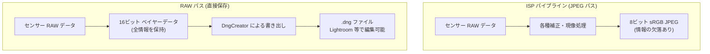

# 第18章：RAW写真撮影

プロフェッショナルなモバイル写真撮影には、Android の ISP（画像信号プロセッサ）がデフォルトで生成する加工済みの JPEG 以上のものが必要です。JPEG では、センサーの生データは既にフィルタリング、補完、色補正、ノイズ低減、トーンマッピングが施されており、写真家が重視する編集の余地（ヘッドルーム）の多くが破壊されています。Camera2 API では、ISP の干渉を全く受けていない **RAW_SENSOR** 形式（16ビット未処理ベイヤーデータ）に直接アクセスできます。Android フレームワークが提供する **DngCreator** を組み合わせることで、Lightroom や Photoshop で直接開くことができる標準規格に準拠した Adobe DNG (Digital Negative) ファイルを作成できます。

[Android Camera Parameters アプリ](https://github.com/zoozooll/AndroidCameraParameters)では、お使いのデバイスが RAW キャプチャをサポートしているか、最大 RAW サイズはいくつか、といった情報を確認できます。

## なぜ RAW なのか？ ISP 処理のコスト

ISP が JPEG を生成する際、以下のような工程を順番に適用します：
1. **ブラックレベル・クランピング** — 暗電流のベースラインを差し引く
2. **レンズシェーディング補正** — 周辺減光（周辺が暗くなる現象）を補正する
3. **デモザイク** — 1 画素 1 色のベイヤー格子をフルカラー RGB に補完する
4. **ノイズ低減** — ざらつきを消すが、同時に細かいディテールも消えてしまう
5. **トーンマッピング** — センサーが捉えた広い階調を、表示用の狭い 8ビットに押し込める

これらの工程は**不可逆**（元に戻せない）であり、一般ユーザー向けの「綺麗なプレビュー」には最適ですが、プロの後処理には向きません。RAW はセンサー出力をそのまま保存するため、シャドウを持ち上げたり、ホワイトバランスを劇的に変更したりしても画質が破綻しにくいという利点があります。



## ベイヤーカラーフィルターアレイ

センサーの各画素は、実は「色」を判別できず、光の強さ（輝度）しか記録できません。色を再現するために、画素の上に赤・緑・青のフィルターを敷き詰めたのが**ベイヤー配列**です。

一般的な配列は **RGGB** です：
- **緑 (G) が 50%**: 人間の目は緑に敏感なため、解像感を高めるために緑の画素が多く配置されています。
- **赤 (R) と 青 (B) が各 25%**

RAW データはこの「格子状の 1 色ずつのデータ」のままであり、後から高度なアルゴリズム（AI デモザイクなど）を使って現像することで、スマートフォン内蔵の ISP よりもシャープな結果を得ることができます。

---

## RAW + JPEG 同時キャプチャの設定

最も推奨されるワークフローは、**1 つのキャプチャリクエストで RAW と JPEG の両方を出力する**ことです。これにより、全く同じ瞬間のフレームを RAW（編集用）と JPEG（確認用）の両方で保存できます。

### 実装のステップ

1. **サポートの確認**: `REQUEST_AVAILABLE_CAPABILITIES_RAW` が含まれているか確認します。
2. **ImageReader の作成**: `RAW_SENSOR` 形式と `JPEG` 形式の 2 つの ImageReader を用意します。
3. **キャプチャセッション**: プレビュー、RAW、JPEG の 3 つの Surface を含むセッションを作成します。
4. **DngCreator の使用**: キャプチャ結果 (`CaptureResult`) と画像データを `DngCreator` に渡し、ファイルに書き込みます。

```kotlin
// DngCreator による書き出しの例
val dngCreator = DngCreator(characteristics, captureResult)
dngCreator.writeByteBuffer(
    fileOutputStream,
    image.width,
    image.height,
    image.planes[0].buffer,
    0
)
```

**重要な注意点：**
- RAW データはファイルサイズが非常に大きいため（12MP で約 48MB）、書き込み処理は必ずバックグラウンドスレッドで行ってください。
- キャプチャリクエスト時には、ホワイトバランスがフレームごとに変動しないよう `CONTROL_AWB_MODE_OFF` にするか、特定のプリセットに固定することをお勧めします。

---

## まとめ

- **RAW_SENSOR**: センサーからの未加工データ。最高の編集耐性を持つ。
- **DngCreator**: Android が提供する標準 DNG ファイル作成ツール。
- **ベイヤー配列**: 1 画素 1 色の情報を持つ格子状のデータ。
- **同時キャプチャ**: 1 回のリクエストで RAW と JPEG を同時に出力するのが一般的。

## 次のステップ

静止画をマスターしました。次は動画の世界へ進みましょう。**第19章：ハイスピードビデオ**では、120 fps や 240 fps のスローモーション撮影を実現する方法を学びます。
