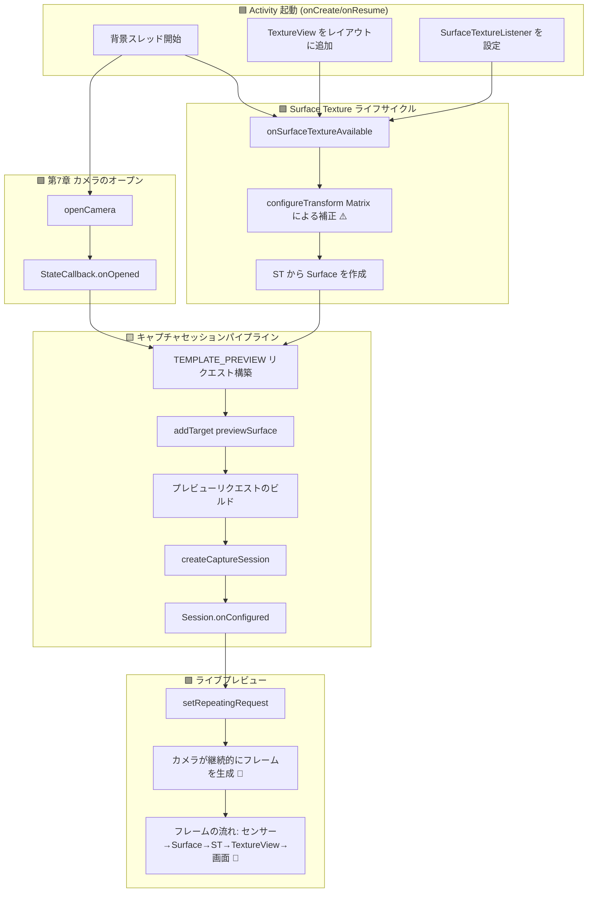

ついにこの章がやってきました。これまでの章で準備してきた足場（権限、スレッド、CameraManager、列挙、オープン/クローズのライフサイクル）をもとに、**カメラの出力を画面にライブで表示**させます。プレビューはカメラアプリの魂です。シャッターを押す前に構図を決め、ピントを確認し、露出を検証するための窓となります。これを正しく実装できるかどうかが、使いにくいアプリと、洗練されたレスポンスの良いカメラ体験の分かれ目になります。

何百ものデバイスでエッジケースを処理するリファレンス実装については、**Android Camera Parameters** アプリ（[GitHub](https://github.com/zoozooll/AndroidCameraParameters) / [Google Play](https://play.google.com/store/apps/details?id=com.minininja.cameraparams)）のプレビュー画面を参考にしてください。そのプレビューパイプラインには、向きを考慮した変換、マルチ解像度出力 Surface、スムーズなフレームレート制御など、ここで扱う基本コンポーネントに基づいた機能が組み込まれています。

## プレビューパイプライン：コンポーネントの概要

コードに入る前に、カメラセンサーからスマートフォンのディスプレイまで、単一のプレビューフレームが辿る概念的な旅をマッピングしてみましょう。すべてのフレームは 5 つのレイヤーを通過します：

```
カメラセンサー → CameraDevice パイプライン → Surface (BufferQueue) → SurfaceTexture → TextureView → ディスプレイ
```

各レイヤーは特定の、代替不可能な役割を果たします。いずれかを飛ばしたりショートカットしたりすると、画面が真っ暗になったり、アスペクト比が歪んだり、ティアリングが発生したりします。各コンポーネントを定義しましょう：

### 1. Surface — 画像データの目的地バッファ

`Surface` は、Camera2 API における**処理された画像フレームの送り先**という汎用的な概念です。内部的には、Android の `BufferQueue`（通常 3〜5 バッファの深さを持つ循環バッファ）をラップしています。Camera2 が Surface に「フレームをレンダリング」するとき、キューから空のバッファを取り出し、ピクセルデータを書き込み、コンシューマー（消費者）が使用できるようにキューに戻します。

グラフィックバッファを消費できるものであれば、何でも `Surface` を公開できます。主なコンシューマーは以下の通りです：
- **SurfaceTexture** → `TextureView` に供給（画面上のプレビュー用 — 本章の内容）
- **MediaRecorder/MediaCodec の Surface** → ビデオエンコーディング用
- **ImageReader の Surface** → JPEG/RAW キャプチャ用の CPU アクセス可能な画像オブジェクト（第9章）

### 2. SurfaceTexture — GPU 間の架け橋

`SurfaceTexture` は、カメラフレームの生のストリームを、GPU がサンプリングしてレンダリングできるテクスチャに変換する魔法のようなクラスです。Surface の BufferQueue のコンシューマー側ですが、バッファを CPU に渡す代わりに、OpenGL ES のテクスチャに変換します。これにより、`TextureView` は標準の GPU レンダリングを使用してカメラフレームをビュー階層に合成でき、CPU でのコピーが不要なため、60 FPS 以上のプレビューも容易に実現できます。

### 3. TextureView — 画面上のウィンドウ

`TextureView` は、`SurfaceTexture` の内容を表示できる `View` のサブクラスです。以前の `SurfaceView` の後継であり、Camera2 のプレビューにおいて推奨される選択肢です。その理由は 3 つあります：
- 通常の View のように振る舞う（アニメーション、変換、透過、スクロールコンテナへの配置が可能）。
- Activity に透明なウィンドウの使用を強制しない。
- `SurfaceTextureListener` により、Surface の作成、破棄、リサイズに関する正確なライフサイクルコールバックが得られる。

### 4. CameraCaptureSession — 構成されたパイプライン

`CameraDevice` がフレームを生成する前に、`CameraCaptureSession` を作成する必要があります。セッションは、**カメラパイプラインが書き込むすべての出力 Surface の構成**です。カメラの ISP（画像信号プロセッサ）の出力を 1 つ以上の「シンク（受け皿）」に導くための「配管」だと考えてください。プレビューのみの場合、セッションは 1 つの Surface（TextureView のもの）を持ちます。第9章で写真撮影を追加すると、セッションはプレビュー用と `ImageReader` 用の 2 つの Surface を持つことになります。

### 5. 繰り返しキャプチャリクエスト (TEMPLATE_PREVIEW)

セッションが構成された後、どのようにして継続的なプレビューが行われるのでしょうか？ Camera2 はリクエスト駆動型の API です。すべてのフレームは、セッションに送信される `CaptureRequest` です。プレビューでは、**1 つのリクエストを送信し、それを「繰り返し (repeating)」としてマーク**します。カメラハードウェアはそのリクエストを（同じセンサー設定、ターゲット、3A 状態で）継続的に再実行し、パイプラインが許す限り高速に（通常 30〜120 FPS）フレームを生成します。

プレビュー用のテンプレートは `CameraDevice.TEMPLATE_PREVIEW` です。これは**低レイテンシとスムーズなフレームレート**に最適化されています。

## エンドツーエンドのプレビューフローチャート

（フローチャートは維持。各ステップを日本語化）



オレンジ色のブロック (`configureTransform`) と緑色のブロック (ライブプレビュー) は、最も重要なステップです。`configureTransform` を飛ばすと、プレビューが引き伸ばされたり、回転したり、押しつぶされたりします。また、`setRepeatingRequest` を呼び忘れると、エラーは出ませんが画面は真っ暗なままになります。

## ステップ 1：レイアウト XML への TextureView の追加

（activity_main.xml の XML コードを提供）

## ステップ 2：configureTransform — アスペクト比を正しく保つ秘訣

単にフレームを全画面の TextureView に流し込むだけでは、プレビューが**引き伸ばされて**しまいます。これは、カメラセンサーのアスペクト比（通常 4:3）とスマートフォンのディスプレイのアスペクト比（多くは 20:9 前後）が異なるためです。

解決策は **`configureTransform(viewWidth, viewHeight)`** です。このメソッドは `Matrix`（回転とスケーリング）を計算し、TextureView に適用します。
1. デバイスの回転に合わせて画像を**回転**させる。
2. アスペクト比を維持したまま、画像が TextureView を完全に埋めるように**スケーリング**する（センタークロップ）。
3. スケーリング・回転された画像をビューの中央に**再配置**する。

（Matrix 計算の Kotlin コードを提供）

## ステップ 3：SCALER_STREAM_CONFIGURATION_MAP からのプレビューサイズの選択

セッションを作成する前に、カメラが出力できるプレビューサイズを知る必要があります。`SCALER_STREAM_CONFIGURATION_MAP` を照会して、アスペクト比が一致し、かつ 1080p 以下の最適なサイズを選択します。1080p で十分であり、電力を節約し、レイテンシを低く保つことができます。

## まとめ

この章では、これまでの準備を実らせて、実際に動作するカメラプレビューアプリを完成させました。

1. **5 つの構成要素**: Surface、SurfaceTexture、TextureView、CameraCaptureSession、繰り返し CaptureRequest。
2. **TextureView + SurfaceTextureListener**: GPU Surface の準備ができたことを検知し、サイズ変更に対応する。
3. **サイズの選択**: `getOutputSizes(SurfaceTexture::class.java)` から、ビューに最適なサイズを選ぶ。
4. **configureTransform**: 画像が引き伸ばされないように Matrix で補正する。
5. **setRepeatingRequest**: フレームのストリームを開始する魔法の 1 行。

## 次のステップ

ライブプレビューは素晴らしいデモですが、写真を撮って保存できなければ「カメラアプリ」とは言えません。**第9章：写真の撮影**では、`ImageReader` を導入し、静止画をキャプチャして MediaStore に保存する完全なワークフローを実装します。
