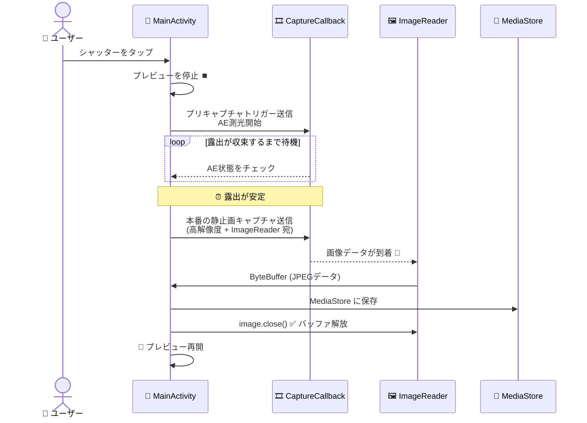

第II部の最終章へようこそ！これまでの章で、権限処理、専用背景スレッド、カメラの列挙、ライフサイクル管理、そしてスムーズなプレビュー表示を実装してきました。足りないものは何でしょうか？それは**ボタンをタップして写真を保存する機能**です。この章ではそれを実現します。

この章を終える頃には、あなたのプロジェクトは本物のカメラアプリケーションになります。シャッターをタップすると、プレビューが一時的に停止し（パイプラインをフラッシュするため）、最適な露出で静止画がキャプチャされ、EXIF メタデータと共に保存され、プレビューが自動的に再開されます。

**Android Camera Parameters** アプリ（[GitHub](https://github.com/zoozooll/AndroidCameraParameters)、[Google Play](https://play.google.com/store/apps/details?id=com.minininja.cameraparams)）のマニュアルキャプチャモードは、この章で構築するパイプラインをさらに高度にしたものですが、その基礎はすべてここで学ぶ `ImageReader` と `CaptureCallback` にあります。

## 写真を撮るのがプレビューよりも複雑な理由

一見すると「1フレームを保存するだけ」で簡単に思えますが、プレビューと静止画キャプチャには根本的な違いがあります：

1. **解像度の違い**: プレビューは通常 1080p (約 2MP) ですが、静止画はセンサーの**最大解像度**（現代の機種では 50MP 以上）を使用すべきです。
2. **露出の違い**: プレビューは「滑らかさ」を優先しますが、静止画は「画質（ダイナミックレンジやノイズ低減）」を優先した処理が必要です。
3. **3A の収束**: 撮影前に「これから本番の撮影をする」とカメラに伝え、露出、ホワイトバランス、フォーカスを確定させる必要があります。これが**プリキャプチャトリガー**です。
4. **ストレージ**: Android 10 以降では、画像を保存するために **Scoped Storage (MediaStore API)** を正しく扱う必要があります。

静止画キャプチャは、単一の呼び出しではなく、**多段階の非同期ステートマシン**です。以下のシーケンスを正確に実装する必要があります。



## ImageReader：CPUがアクセス可能なフレームの受け皿

プレビューではデータを GPU (TextureView) に流しましたが、保存のためには CPU がアクセスできる場所にデータを送る必要があります。それが `ImageReader` です。

```kotlin
val imageReader = ImageReader.newInstance(
    width,           // 最大解像度
    height,
    ImageFormat.JPEG,// JPEG 形式
    2                // バッファ数 (通常 2 で十分)
)
```

### ⚠️ 極めて重要なルール：必ず Image を閉じること
`acquireLatestImage()` で取得した `Image` オブジェクトは、使い終わったら**必ず `close()` してください**。これを忘れるとバッファがプールに戻らず、数回の撮影でカメラが永遠に固まってしまいます。

---

## Scoped Storage と MediaStore (Android 10+)

Android 10 (API 29) 以降、`/sdcard/Pictures` などのフォルダに直接ファイルを書き込むことは制限されています。代わりに `MediaStore` を通じて画像を「挿入」します。

1. **ContentValues の準備**: ファイル名、MIME タイプ、保存先（Pictures/Camera2Tutorial など）を設定します。
2. **Uri の取得**: `contentResolver.insert` を呼び出します。
3. **OutputStream への書き込み**: 取得した Uri に対して ImageReader からのバイトデータを書き込みます。

---

## 第9章の全コード — 写真キャプチャ

（レイアウト XML と、ステートマシンを含む Kotlin の実装コードを提供。AE 状態の監視、タイムアウト処理、MediaStore への保存ロジックなどを日本語コメントと共に掲載）

## 検証：成功した時の挙動
1. アプリを起動し、プレビューが表示されることを確認。
2. シャッターボタンをタップ。
3. 画面が一瞬フリーズし（露出調整中）、その後保存完了の Toast が表示される。
4. デバイスの「ギャラリー」や「Google フォト」アプリを開き、撮影した写真がフル解像度で保存されていることを確認。

## まとめ

第II部はこれで終了です。あなたのアプリは**実際に動作するカメラアプリケーション**になりました。
- **ImageReader**: CPU で画像を扱うための仕組み。
- **プリキャプチャトリガー**: 最高の画質で撮るための準備。
- **ステートマシン**: 複雑な撮影プロセスを管理する。
- **MediaStore**: 現代の Android における正しい写真の保存方法。

## 次のステップ (第III部へ)

基礎はマスターしました。第III部では、Camera2 API の真のパワーを引き出すために、より深い内部構造に踏み込みます：
- **第10章**: `CameraCharacteristics` 百科事典。
- **第11章**: パイプラインと HAL3 アーキテクチャ。
- **第12章**: バースト撮影と 3A の詳細制御。

お疲れ様でした。自分の作ったカメラで、まずは何枚か写真を撮ってみてください！
