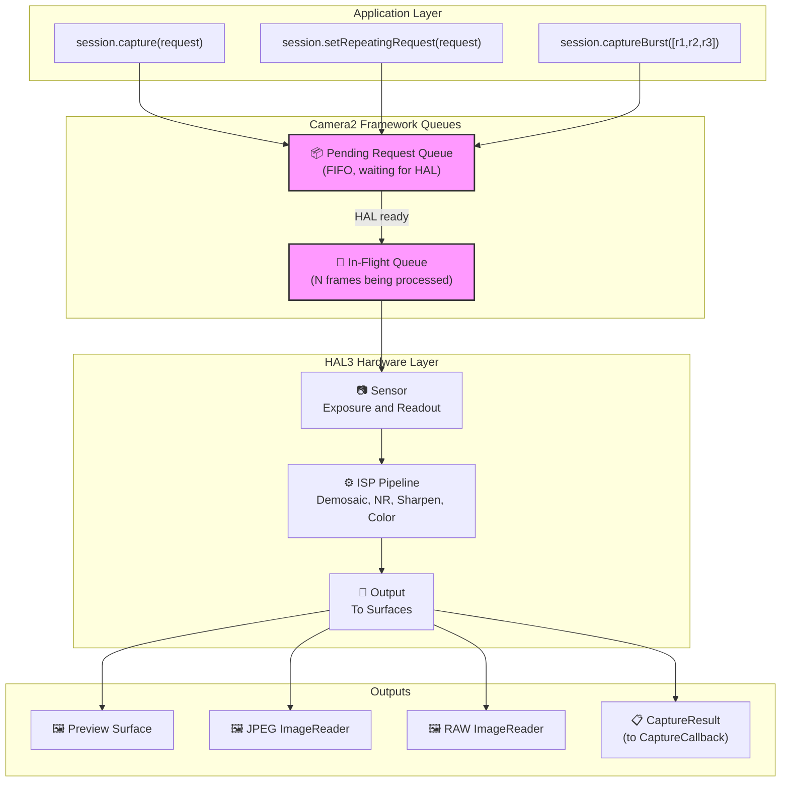
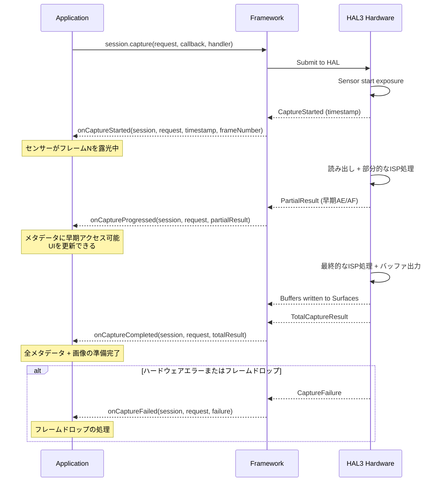
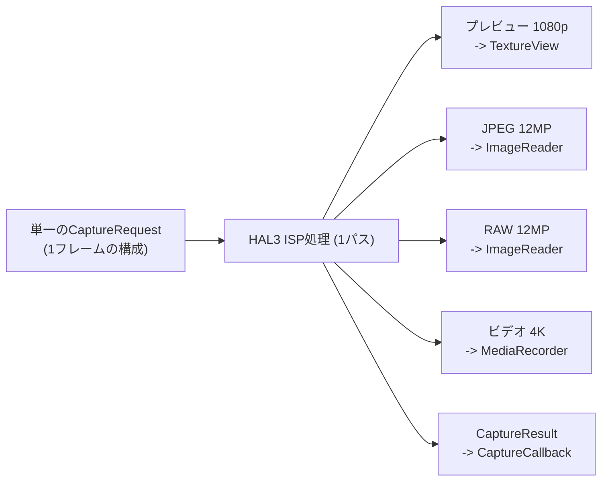

## 10.1 使用から理解へ

このシリーズの前の章では、Camera2を「使用」してきました。プレビューを表示し、写真をキャプチャし、RAWファイルを扱いました。今度はレンズを裏返して内側を見てみましょう。**Camera2は実際にどのようにしてフレームを届けているのでしょうか？**

パイプラインを理解することは単なる学問ではありません。リクエストがシステム内をどのように流れるかを知ることで、以下のことが可能になります：
- 高速キャプチャ時のフレームドロップを診断する
- 設定の変更が画面に現れるまでになぜ1〜2フレームかかるのかを説明する
- ブラックアウトなしのバーストキャプチャを最適化する
- コールバックタイミングの正しいメンタルモデルを構築する

Android Camera Parameters アプリ（[GitHub](https://github.com/zoozooll/AndroidCameraParameters)、[Play ストア](https://play.google.com/store/apps/details?id=com.minininja.cameraparams)）では、パイプラインの動作をリアルタイムで可視化できます。**Frame Timing** タブや **Raw JSON** タブを見て、この章の概念がデバイス上でどのように動作しているかを確認してください。

## 10.2 主要なデータ構造

パイプライン自体を見る前に、そこを移動する2つのオブジェクト、`CaptureRequest`（入力）と `CaptureResult`（出力）について詳しく調べましょう。

### CaptureRequest：不変のフレーム設計図

`CaptureRequest` は、**単一フレームに対する完全かつ不変の構成**です。センサーの露出時間、ISO、フォーカス距離、3Aモード、出力先、JPEG品質、クロップ領域など、1回の露光でセンサー、レンズ、ISPがすべきことのすべてが記述されています。

`CaptureRequest` の主な特性：

- **build()後は不変** — `.build()` を呼び出した後は、そのリクエストは凍結されます。設定を変更するには、新しい Builder を作成する必要があります。
- **Builderパターン** — `CameraDevice.createCaptureRequest(template)` から取得した `CaptureRequest.Builder` を介して構築されます。
- **フレームごと** — 個々のフレームがそれぞれ独自のリクエストオブジェクトを持ちます。繰り返しキャプチャ（Repeating Request）であっても、内部的にはフレームごとに新しいリクエストが生成されます。
- **Surfaceをターゲットにする** — 各リクエストは、処理された画像バッファを受け取る出力先 Surface を明示的にリストします。

```kotlin
// Builderパターンを使用して CaptureRequest を構築する
val builder = cameraDevice.createCaptureRequest(CameraDevice.TEMPLATE_STILL_CAPTURE)

// センサーレベルのパラメータ
builder.set(CaptureRequest.SENSOR_EXPOSURE_TIME, 10_000_000L)   // 10ms
builder.set(CaptureRequest.SENSOR_SENSITIVITY, 400)             // ISO 400
builder.set(CaptureRequest.SENSOR_FRAME_DURATION, 33_333_333L)  // 最大 ~30fps

// レンズパラメータ
builder.set(CaptureRequest.LENS_FOCUS_DISTANCE, 0.1f)           // 10cmにフォーカス
builder.set(CaptureRequest.LENS_APERTURE, 1.8f)                 // f/1.8

// 3A制御モード
builder.set(CaptureRequest.CONTROL_AF_MODE, CaptureRequest.CONTROL_AF_MODE_OFF)
builder.set(CaptureRequest.CONTROL_AE_MODE, CaptureRequest.CONTROL_AE_MODE_OFF)
builder.set(CaptureRequest.CONTROL_AWB_MODE, CaptureRequest.CONTROL_AWB_MODE_OFF)

// 出力先ターゲット
builder.addTarget(previewSurface)
builder.addTarget(jpegReader.surface)

// 構築 — これで不変になります！
val request: CaptureRequest = builder.build()

// request.set(...) は失敗します — 構築後のオブジェクトに set() はありません！
```

:::note
不変性はパイプラインの正確さにとって極めて重要です。HAL はリクエストを非同期で読み取るため、送信後にリクエストを変更できると、アプリスレッドとハードウェア処理スレッドの間で競合状態が発生してしまいます。
:::

### CaptureResult：メタデータレポート（画像ではありません！）

`CaptureResult` は、処理されたフレームに対する**メタデータ出力**です。極めて重要なことですが、**CaptureResult には画像ピクセルデータは含まれていません**。ピクセルはリクエストに追加した `Surface` ターゲットへ送られ、`CaptureResult` はキャプチャ中に何が起こったかという「物語」を携えて `CaptureCallback` へ送られます。

`CaptureResult` の主要なフィールド：

| リザルトキー | 型 | 説明 |
|:---|:---|:---|
| `SENSOR_EXPOSURE_TIME` | `Long` | 実際に使用された露出時間（ナノ秒）。リクエストと異なる場合があります。 |
| `SENSOR_SENSITIVITY` | `Int` | 実際に適用された ISO ゲイン。 |
| `SENSOR_TIMESTAMP` | `Long` | 露光開始時のナノ秒タイムスタンプ。 |
| `CONTROL_AE_STATE` | `Int` | 自動露出状態：INACTIVE, SEARCHING, CONVERGED, LOCKED, FLASH_REQUIRED |
| `CONTROL_AF_STATE` | `Int` | オートフォーカス状態：INACTIVE, PASSIVE_SCAN, ACTIVE_SCAN, FOCUSED_LOCKED, NOT_FOCUSED_LOCKED |
| `CONTROL_AWB_STATE` | `Int` | 自動ホワイトバランス状態 |
| `LENS_FOCUS_DISTANCE` | `Float` | レンズによって設定された実際のフォーカス距離。 |
| `SCALER_CROP_REGION` | `Rect` | デジタルズームに使用された実際のクロップ領域。 |
| `JPEG_GPS_LOCATION` | `Location` | JPEG に書き込まれた GPS タグ。 |
| `STATISTICS_FACE_DETECT_MODE` | `Int` | 実際に使用された顔検出モード。 |

リザルトフィールドはあなたの**真実の源（Ground Truth）**です。`CaptureRequest` はあなたが「求めたもの」であり、`CaptureResult` はハードウェアが「実際に行ったこと」です。LEGACY や LIMITED デバイスでは、HAL がリクエストされた値を静かに制限したり丸めたり、あるいは無視したりすることがあります。リザルトを確認することで、それを検知できます。

```kotlin
val captureCallback = object : CameraCaptureSession.CaptureCallback() {
    override fun onCaptureCompleted(
        session: CameraCaptureSession,
        request: CaptureRequest,
        result: TotalCaptureResult
    ) {
        val timestampNs = result.get(CaptureResult.SENSOR_TIMESTAMP)
        val exposureNs = result.get(CaptureResult.SENSOR_EXPOSURE_TIME)
        val iso = result.get(CaptureResult.SENSOR_SENSITIVITY)
        val aeState = result.get(CaptureResult.CONTROL_AE_STATE)
        val afState = result.get(CaptureResult.CONTROL_AF_STATE)
        val focusDistance = result.get(CaptureResult.LENS_FOCUS_DISTANCE)
        val cropRegion = result.get(CaptureResult.SCALER_CROP_REGION)

        val aeStateStr = when (aeState) {
            CaptureResult.CONTROL_AE_STATE_INACTIVE -> "INACTIVE"
            CaptureResult.CONTROL_AE_STATE_SEARCHING -> "SEARCHING"
            CaptureResult.CONTROL_AE_STATE_CONVERGED -> "CONVERGED"
            CaptureResult.CONTROL_AE_STATE_LOCKED -> "LOCKED"
            CaptureResult.CONTROL_AE_STATE_FLASH_REQUIRED -> "FLASH_REQUIRED"
            else -> "UNKNOWN($aeState)"
        }

        val afStateStr = when (afState) {
            CaptureResult.CONTROL_AF_STATE_INACTIVE -> "INACTIVE"
            CaptureResult.CONTROL_AF_STATE_PASSIVE_SCAN -> "PASSIVE_SCAN"
            CaptureResult.CONTROL_AF_STATE_ACTIVE_SCAN -> "ACTIVE_SCAN"
            CaptureResult.CONTROL_AF_STATE_FOCUSED_LOCKED -> "FOCUSED_LOCKED"
            CaptureResult.CONTROL_AF_STATE_NOT_FOCUSED_LOCKED -> "NOT_FOCUSED_LOCKED"
            else -> "UNKNOWN($afState)"
        }

        Log.d("Pipeline", buildString {
            append("Frame @${timestampNs?.let { it / 1_000_000 } ?: "?"}ms | ")
            append("Exposure: ${exposureNs?.let { "%.2fms".format(it / 1_000_000.0) } ?: "?"} | ")
            append("ISO: $iso | ")
            append("Focus: ${focusDistance?.let { "%.3f".format(it) } ?: "?"} diopters | ")
            append("AE: $aeStateStr | ")
            append("AF: $afStateStr | ")
            append("Crop: ${cropRegion?.width()}x${cropRegion?.height()}")
        })
    }
}
```

:::tip
Android Camera Parameters アプリの設定で **Live Result Logging** を有効にすると、このメタデータの流れをリアルタイムで観察できます。露出が落ち着くにつれて AE_SEARCHING から AE_CONVERGED へ、タップしてフォーカスを合わせたときに AF_SCAN から FOCUSED_LOCKED へ遷移するのがわかります。
:::

## 10.3 リクエストキュー

Camera2 はフレームワークレベルで**2つのキュー（待ち行列）を持つパイプラインモデル**を使用しています。これらのキューを理解することで、観察されるほとんどのタイミング動作を説明できます。

### 保留リクエストキュー (FIFO)

`session.capture()`、`session.captureBurst()`、あるいは `session.setRepeatingRequest()` を呼び出したとき、リクエストは即座に HAL へ送られるわけではありません。代わりに、Camera2 フレームワークが管理する **保留リクエストキュー (Pending Request Queue)** に入ります。

これを「待合室」と考えてください。リクエストは、HAL が新しい処理を受け入れられるようになるまでここに留まります。

主な特性：
- **FIFO 順序** — リクエストは送信された順に処理されます。
- **バーストのアトミック性** — `captureBurst()` 内のすべてのフレームは連続してエンキューされ、繰り返しリクエストが割り込むことなく処理されます。
- **優先順位のオーバーライド** — 単発リクエスト（capture）やバーストリクエストは、キュー内の繰り返しリクエストよりも「先に」割り込みます。
- **有限の深さ** — キューには深さの制限（通常 4〜8 リクエスト）があり、溢れるとエラーが発生します。

### 実行中キュー (In-Flight Queue)

HAL が保留キューからリクエストを取り出し、センサーの読み出しや ISP の処理を開始すると、リクエストは**実行中キュー (In-Flight Queue)** に移動します。このキューには、現在ハードウェアによって処理されているすべてのリクエストが含まれます。

実行中キューの深さ（`CameraCharacteristics.REQUEST_PIPELINE_MAX_DEPTH`）は、ハードウェアが同時に処理できるフレーム数を示します。一般的な FULL デバイスでは 3〜4 フレームであり、これはフレーム N が露光されている間に、フレーム N-1 が ISP で処理され、フレーム N-2 がメモリに書き込まれ、フレーム N-3 がアプリに返されていることを意味します。これが、各フレームに約100msかかっても、Camera2 が 30 fps 以上の速度を実現できる理由です。



## 10.4 結果コールバック：CaptureCallbackのライフサイクル

結果は `CameraCaptureSession.CaptureCallback` を通じて戻ってきます。HAL は結果を複数のステージで返すことができるため、フルフレームの準備ができる前に部分的なメタデータに早期アクセスすることが可能です。

### 4つのコールバックメソッド

| メソッド | 呼ばれるタイミング | 含まれる内容 | ユースケース |
|:---|:---|:---|:---|
| `onCaptureStarted` | センサーがこのフレームの露光を**開始**したとき | 最小限の情報：フレーム番号、タイムスタンプ | 正確なタイミング同期 |
| `onCaptureProgressed` | ISP がフレームを部分的に処理したとき | `PartialCaptureResult` — 一部のメタデータ | AE/AF 状態の早期更新 |
| `onCaptureCompleted` | 全フレームの処理が完了し、バッファが配信されたとき | `TotalCaptureResult` — すべてのフィールド | 最終的なメタデータの記録 |
| `onCaptureFailed` | フレームドロップやエラーが発生したとき | `CaptureFailure` — エラーコード、理由 | エラーからの回復 |

### 部分的結果 vs 完全な結果

`PartialCaptureResult` は、ISP が一部のメタデータフィールドを計算し終えたが、パイプライン全体はまだ完了していないときに返されます。`TotalCaptureResult` はすべてが完了したときに返されます。



```kotlin
val fullPipelineCallback = object : CameraCaptureSession.CaptureCallback() {
    override fun onCaptureStarted(
        session: CameraCaptureSession,
        request: CaptureRequest,
        timestamp: Long,
        frameNumber: Long
    ) {
        super.onCaptureStarted(session, request, timestamp, frameNumber)
        Log.d("Pipeline", "フレーム #$frameNumber 露光開始 @ ${timestamp / 1_000_000}ms")
    }

    override fun onCaptureProgressed(
        session: CameraCaptureSession,
        request: CaptureRequest,
        partialResult: CaptureResult
    ) {
        super.onCaptureProgressed(session, request, partialResult)
        val aeState = partialResult.get(CaptureResult.CONTROL_AE_STATE)
        val afState = partialResult.get(CaptureResult.CONTROL_AF_STATE)
        Log.v("Pipeline", "部分的結果: AE=$aeState AF=$afState")
    }

    override fun onCaptureCompleted(
        session: CameraCaptureSession,
        request: CaptureRequest,
        result: TotalCaptureResult
    ) {
        super.onCaptureCompleted(session, request, result)
        val totalFrames = result.frameNumber
        Log.d("Pipeline", "フレーム #$totalFrames 完了")
    }

    override fun onCaptureFailed(
        session: CameraCaptureSession,
        request: CaptureRequest,
        failure: CaptureFailure
    ) {
        super.onCaptureFailed(session, request, failure)
        val reason = when (failure.reason) {
            CaptureFailure.REASON_ERROR -> "内部エラー"
            CaptureFailure.REASON_FLUSHED -> "abortCaptures()によるフラッシュ"
            else -> "不明 (${failure.reason})"
        }
        Log.e("Pipeline", "フレーム #${failure.frameNumber} 失敗: $reason")
    }
}
```

## 10.5 パイプラインの内部：ステートレス、逐次、非同期、マルチ出力

Camera2 が公開している HAL3 パイプラインモデルには、4つの定義的な特性があります。これらを理解すれば、Camera2 の「奇妙な」動作のほとんどが腑に落ちるでしょう。

### 1. ステートレス（状態を持たない）

ハードウェアは**リクエスト間の記憶を持ちません**。すべての `CaptureRequest` は自己完結している必要があります。つまり、変更した設定だけでなく、*すべての設定* を含める必要があります。

- フレーム N で露出時間を設定し、フレーム N+1 でそれを*省略*すると、デフォルト値に戻ります。
- 繰り返しリクエスト（Repeating Request）は「差分」ではありません。フレームごとにフルセットの設定が再送信されます。

### 2. 逐次処理

リクエストは **FIFO 順に1つずつ処理されます**。順序の入れ替えや並列処理は行われません。これが、バーストキャプチャで隙間のない連続したフレームが得られる理由です。

### 3. 非同期の結果

リクエストを送信するスレッドと、結果を受け取るスレッドは**常に異なります**。結果は提供した `Handler` スレッドで配信されます。
**注意：** コールバック内から共有の可変状態にアクセスする場合は、必ず同期（Synchronization）を行ってください。

### 4. 1つのリクエストから複数の出力

1つのリクエスト → 複数の出力。単一の `CaptureRequest` で複数の `Surface` ターゲットを同時に指定できます：
- プレビュー用、JPEG 保存用、RAW 保存用、ビデオ録画用など。

HAL は単一のセンサー読み出しを複数の ISP ブランチにルーティングし、各出力フォーマットを生成します。



## 10.6 エンドツーエンド：1つのフレームの追跡

（シーケンス図は維持）

## 10.7 パイプラインの動作を見る

Android Camera Parameters アプリ（[GitHub](https://github.com/zoozooll/AndroidCameraParameters)、[Play ストア](https://play.google.com/store/apps/details?id=com.minininja.cameraparams)）には、**Pipeline Visualizer** デバッグビューが含まれています。保留キューの深さ、実行中キューの深さ、フレームごとのタイムスタンプなどをリアルタイムで確認でき、この章の概念を理解するのに最適です。

## 10.8 まとめ

| 概念 | 要点 |
|:---|:---|
| **CaptureRequest** | 不変の設計図。Builder で構築。すべての設定を含む（記憶されない）。 |
| **CaptureResult** | メタデータのみ。ハードウェアが実際に行ったことの記録。 |
| **保留キュー** | FIFO の待合室。単発リクエストが繰り返しリクエストに割り込む。 |
| **実行中キュー** | 現在処理中のリクエスト。深さはパイプラインの最大深度に依存。 |
| **CaptureCallback** | 開始 → 進行 → 完了（または失敗）のフェーズ。 |
| **ステートレス** | ハードウェアは設定を記憶しない。毎回すべてを指定する必要がある。 |
| **逐次 + 非同期** | 順序は維持されるが、結果の受け取りは非同期。 |
| **マルチ出力** | 1つのリクエストから複数の Surface へ同時出力。 |

## 次のステップ

[第11章：キャプチャの種類](capture-types.md)では、リクエストを送信する3つの方法（単発、バースト、繰り返し）と、それぞれの使いどころについて見ていきます。
