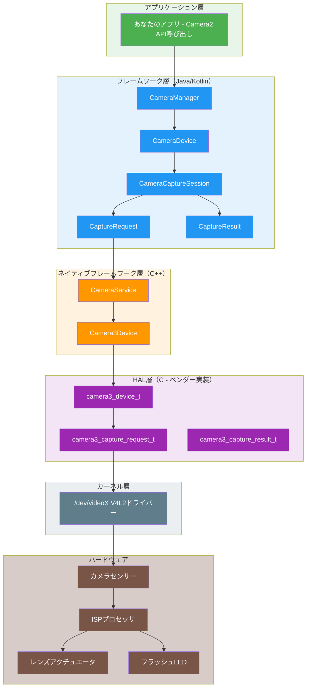
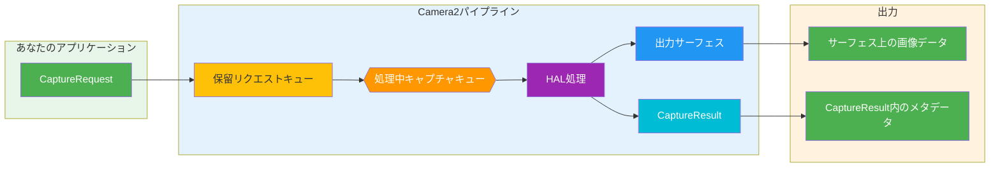
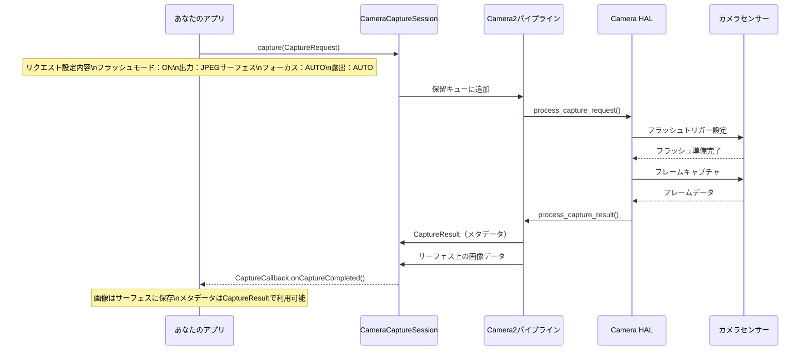
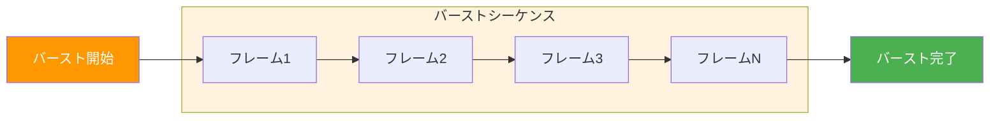
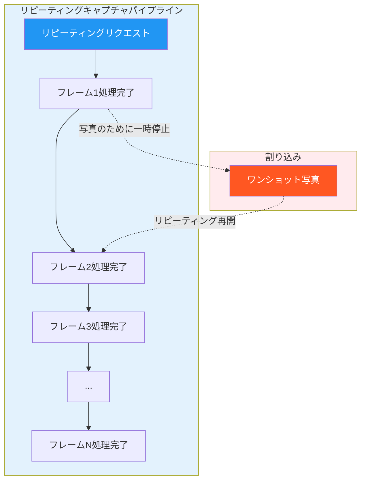
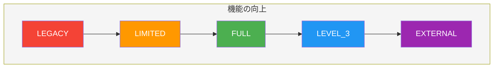
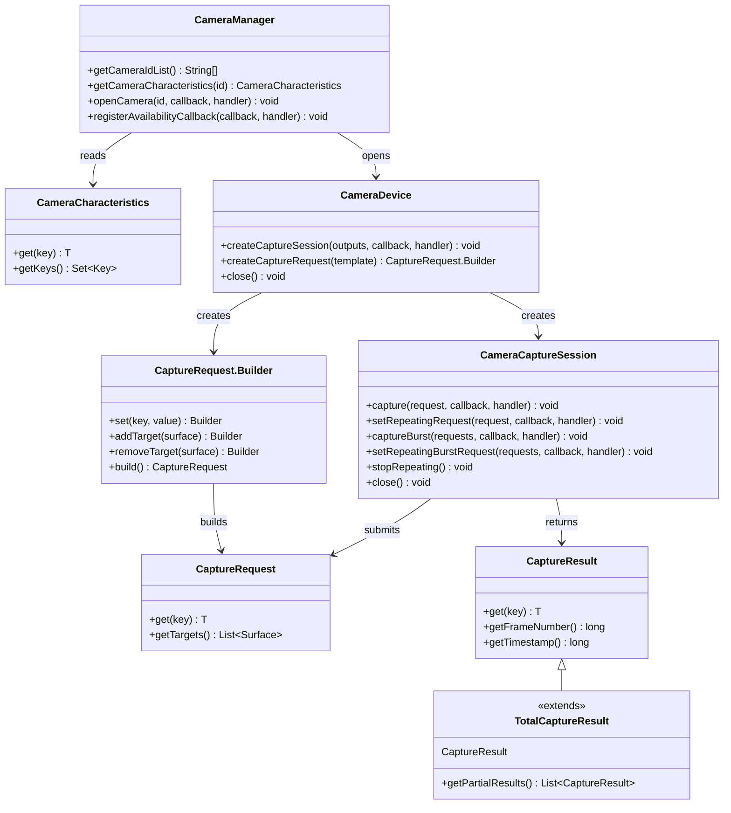
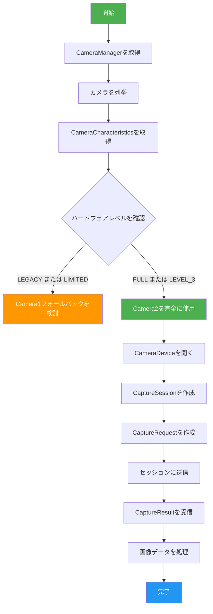
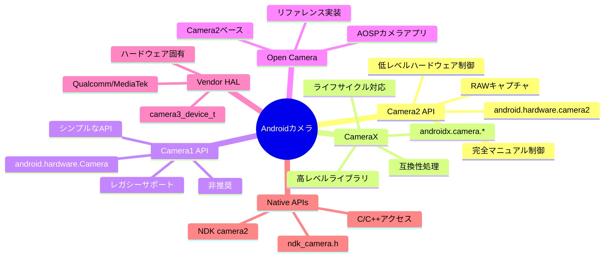

# 第1章：Android Camera2へようこそ

> **本章の概要：** この章では、Android Camera2の世界を根底から探ります。Camera2が*何であるか*だけでなく、*なぜ*作成されたのか、*どのように*動作するのか、そしてAndroidカメラエコシステムの中で*どこに位置するのか*を理解します。パイプラインモデル、キャプチャタイプ、ハードウェアレベルの分類、そしてアプリからHALまでの完全なアーキテクチャをカバーします。

---

## 1.1 なぜCamera2を学ぶのか？

今日のほぼすべてのスマートフォンには、強力なカメラシステムが搭載されています。現代の携帯電話では以下が可能です：

- 計算機写真処理によるプロ並みの写真撮影
- 高フレームレートでの4Kおよび8Kビデオ録画
- 深度センシングによるポートレート効果の作成
- ナイトモードでの極度な低照度下での撮影
- 960 fpsでのスローモーションビデオ撮影
- ARアプリケーション向けの3D深度情報の生成
- 複数のカメラをシームレスに統合

しかし、デフォルトのカメラアプリを開くと、シャッターボタン、ズームコントロール、いくつかの撮影モードといったシンプルなインターフェースしか表示されません。

このシンプルなインターフェースの背後には、驚くほど複雑なシステムがあります。カメラアプリはハードウェアコンポーネント、画像プロセッサ、Androidフレームワークと通信して、すべてのフレームを生成します。

### Camera2を学ぶべき人は？

Android開発者として、デフォルトのカメラアプリを超えるアプリケーションを構築したい場合があります：

- 露出、ISO、フォーカスを完全に制御できる**マニュアル写真アプリケーション**
- 技術者がデバイスの機能を確認するための**カメラテストツール**
- 生フレームアクセスを必要とする**コンピュータビジョンアプリケーション**
- 深度センサーを使用した**3Dスキャンアプリケーション**
- コーデック選択とビットレート制御に対応した**プロ仕様のビデオレコーダー**
- 私たち自身の[Android Camera Parameters](https://github.com/zoozooll/AndroidCameraParameters)のような**カメラ機能アナライザー**

これらのシナリオのいずれかが思い当たる場合、Camera2は習得する必要があるAPIです。

---

## 1.2 Android Camera2とは何か？

**Android Camera2**は、Googleによって**Android 5.0（APIレベル21）**で導入されたモダンなカメラフレームワークです。オリジナルの`android.hardware.Camera` API（現在では遡って**Camera1**と呼ばれます）を置き換えました。

### Camera2が解決した問題

古いCamera API（Camera1）は、よりシンプルな世界のために設計されました：1台のカメラ、基本的な写真撮影、シンプルなビデオ録画。しかしスマートフォンのカメラは劇的に進化しました：

| 時代 | 代表的なデバイス | カメラAPI |
|-----|---------------|------------|
| 2010-2014 | シングルカメラ、基本センサー | Camera1 |
| 2015-2018 | デュアルカメラ、OIS、HDR | Camera2（限定的使用） |
| 2019-2022 | トリプルカメラ、深度、望遠 | Camera2（標準） |
| 2023+ | クアッドカメラ、ペリスコープ、LiDAR、UWB | Camera2（必須） |

モダンなデバイスには、複数の背面カメラ（広角、超広角、望遠、ペリスコープ）、深度センサー、さらには外部USBカメラが含まれる場合があります。以下のような高度な機能をサポートしています：

- マニュアル露出とフォーカス
- RAW画像キャプチャ
- ハイスピードビデオ録画
- HDR処理
- 光学手ブレ補正（OIS）
- マルチカメラフュージョン

Camera2は、開発者にカメラハードウェアに対する**深く、精密かつきめ細かい制御**を提供するために作成されました。

---

## 1.3 Camera2 vs Camera1 vs CameraX

Camera2を深く掘り下げる前に、3つの主要なカメラAPIの関係を明確にしましょう。

### Camera1（`android.hardware.Camera`）

- **導入：** Android 1.0（Android 5.0で非推奨）
- **モデル：** プロシージャル、ステートフル、シングルカメラ向け
- **長所：** シンプル、理解しやすい、広範な互換性
- **短所：** 制限された制御、RAWサポートなし、マルチカメラなし、バーストモードなし

### Camera2（`android.hardware.camera2`）

- **導入：** Android 5.0（API 21）
- **モデル：** オブジェクト指向、ステートレス、リクエスト/レスポンスパイプライン
- **長所：** 深いハードウェア制御、RAWサポート、マルチカメラ、ハイスピードビデオ
- **短所：** 複雑、冗長、カメラの内部実装の理解が必要

### CameraX（`androidx.camera.*`）

- **導入：** Android 10（プレリリース）、Android 11+で安定版
- **モデル：** 宣言的、ライフサイクル対応、ユースケース主導
- **長所：** 使いやすい、自動互換性、ライフサイクル管理
- **短所：** 制限された高度な制御、すべてのハードウェア機能を公開しない場合あり

### 比較表

| 次元 | Camera1 | Camera2 | CameraX |
|-----------|---------|---------|---------|
| **レベル** | 低レベル（非推奨） | 低レベル（現行） | 高レベル（Jetpack） |
| **難易度** | 容易 | 困難 | 容易 |
| **制御** | 最小限 | 最大限 | 中程度 |
| **RAWサポート** | なし | あり | 限定的 |
| **マルチカメラ** | なし | あり | 限定的 |
| **バーストモード** | なし | あり | なし |
| **マニュアル制御** | 限定的 | 完全 | 限定的 |
| **最適な用途** | レガシーアプリ | 高度なカメラアプリ | ほとんどのカメラアプリ |
| **ステータス** | 非推奨 | アクティブ | 推奨 |

### なぜこのシリーズはCamera2に焦点を当てるのか

ほとんどのアプリケーションにはCameraXが推奨されますが、Camera2を理解することが不可欠な理由は以下の通りです：

1. **CameraXはCamera2上に構築されている** — CameraXは内部でCamera2を使用しています。Camera2を理解すると、CameraXが何をしているのかを理解できます。
2. **一部の機能はCamera2でのみ利用可能** — RAWキャプチャ、マニュアルセンサー制御、高度なマルチカメラシナリオにはCamera2が必要です。
3. **デバッグにはCamera2の知識が必要** — CameraXアプリが期待通りに動作しない場合、問題を診断するために基礎となるCamera2の動作を理解する必要があることがよくあります。
4. **Camera2の理解は基本的** — アプリでCameraXを使用する場合でも、Camera2を理解することでAndroidカメラ開発者としてのスキルが向上します。

---

## 1.4 Camera2アーキテクチャ：全体像

Camera2はAndroidカメラスタックの中間に位置し、アプリケーションコードとハードウェアドライバーを橋渡しします。このアーキテクチャを理解することは、デバッグと最適化のために重要です。

### 階層型アーキテクチャ



### アーキテクチャ層の説明

| 層 | 場所 | 言語 | 責任 |
|-------|----------|----------|----------------|
| **アプリケーション** | アプリのコード | Kotlin/Java | CaptureRequestの作成、CaptureResultの処理 |
| **フレームワーク（Java）** | `android.hardware.camera2.*` | Java | パブリックAPI、セッションの管理、データ変換 |
| **ネイティブフレームワーク** | `frameworks/av/` | C++ | Binder IPC、CameraService、Camera3Device |
| **HAL** | `hardware/libhardware/` + ベンダー | C | ハードウェア抽象化、ベンダー固有の実装 |
| **カーネル** | `/dev/videoX` | C | V4L2ドライバー、ハードウェア通信 |
| **ハードウェア** | 物理的なカメラモジュール | — | センサー、ISP、レンズ、フラッシュ |

### 重要な設計原則：Camera2はパイプラインである

Camera2について理解する最も重要な概念は、カメラ操作を**パイプライン**としてモデル化していることです。すべてのアクション（プレビュー、写真撮影、ビデオ録画）は、パイプラインを流れて**キャプチャ結果**を生成する**キャプチャリクエスト**として表現されます。

---

## 1.5 Camera2パイプラインモデル

パイプラインはCamera2の設計の中心です。Camera1のステートフルで同時処理のモデルを、ステートレスなリクエスト/レスポンスモデルに置き換えます。

### パイプラインの仕組み



### パイプラインコンポーネントの説明

| コンポーネント | 説明 |
|-----------|-------------|
| **CaptureRequest** | *1フレーム*のキャプチャを説明する設定オブジェクト。露出時間、フォーカスモード、フラッシュ、出力サーフェスなどのすべてのパラメータを含みます。 |
| **保留リクエストキュー** | 新しいCaptureRequestが処理を待つFIFOキュー |
| **処理中キャプチャキュー** | HALによって処理中のリクエスト。デバイスに応じて通常1〜4リクエストに制限されます |
| **HAL処理** | ハードウェア抽象化層がリクエストを処理：センサー、ISP、レンズなどを制御します |
| **出力サーフェス** | 画像は設定されたサーフェス（プレビューサーフェス、ImageReaderサーフェスなど）に書き込まれます |
| **CaptureResult** | キャプチャに関するメタデータ：実際の露出時間、AF状態、タイムスタンプなど。画像データは*含みません* |

### 重要なパイプラインの特性

1. **リクエストはステートレス** — 各CaptureRequestには必要なすべての情報が含まれます。パイプラインは以前のリクエストのメモリを持ちません。
2. **処理はシーケンシャル** — リクエストはHALによってFIFO順に処理されます。
3. **結果は非同期** — CaptureResultは同期的に返されるのではなく、コールバックを通じて到着します。
4. **リクエストごとに複数の出力** — 1つのCaptureRequestは複数のサーフェスに書き込むことができます（例：プレビュー + 写真を同時に）。
5. **パイプラインは設定可能** — テンプレート（プレビュー、静止画キャプチャ、録画）または完全マニュアルモードを選択できます。

### 具体例：フラッシュで写真を撮る

パイプラインを理解するために、フラッシュで写真を撮るときに何が起こるかをトレースしてみましょう：



---

## 1.6 キャプチャタイプ：ワンショット、バースト、リピーティング

Camera2は3つの基本的なキャプチャタイプを定義しており、それぞれが異なるユースケースに対応しています。これらを理解することは、カメラアプリケーションを正しく設計するために不可欠です。

### タイプ1：ワンショットキャプチャ

**ワンショット**キャプチャは正確に1回実行されます。写真撮影や1回限りの設定変更などの単一アクションに最適です。


**ユースケース：**
- 単一の写真撮影
- 一時的なフラッシュの適用
- 分析用のフレームキャプチャ
- オートフォーカスの1回トリガー

**API呼び出し：**
```kotlin
cameraCaptureSession.capture(captureRequest, callback, handler)
```

### タイプ2：バーストキャプチャ

**バースト**キャプチャは中断なしで連続して複数回実行されます。一度開始すると、バーストが完了するまで他のリクエストを挿入できません。



**主な特性：**
- バースト内のすべてのフレームは同一または段階的に異なる設定を持ちます
- バースト中に他のリクエストを処理できません
- バーストキューは保留リクエストキューとは別になっています
- リピーティングリクエストよりも優先度が高い

**ユースケース：**
- 連続写真撮影（バーストモード）
- ブラケッティング（同じシーンを異なる露出で撮影）
- モーション分析（高速で動く被写体のキャプチャ）
- 合成用の連続マルチフレームキャプチャ

**API呼び出し：**
```kotlin
cameraCaptureSession.captureBurst(burstRequests, callback, handler)
```

### タイプ3：リピーティングキャプチャ

**リピーティング**キャプチャは連続的に実行され、ライブプレビューとビデオ録画の基礎を形成します。リピーティングリクエストがアクティブな場合、他のキャプチャの間のパイプラインを占有します。



**主な特性：**
- 同時にアクティブにできるリピーティングリクエストは1つのみ（以前のものを置き換えます）
- ワンショットとバーストリクエストによって割り込まれ、その後自動的に再開されます
- プレビューとビデオ録画の基礎を形成します
- すべてのフレームに対して個別のCaptureResultを生成しません（効率化のために部分的な結果を使用します）

**ユースケース：**
- ライブカメラプレビュー
- ビデオ録画
- 連続フォーカスモニタリング
- リアルタイムフレーム分析

**API呼び出し：**
```kotlin
cameraCaptureSession.setRepeatingRequest(captureRequest, callback, handler)
// またはビデオ用：
cameraCaptureSession.setRepeatingBurstRequest(burstRequests, callback, handler)
```

### キャプチャタイプの比較

| 機能 | ワンショット | バースト | リピーティング |
|---------|----------|-------|-----------|
| **実行** | 1回 | 複数回（連続） | 連続 |
| **優先度** | 高い | 最も高い | 最も低い |
| **割り込み** | 割り込み不可 | 割り込み不可 | 割り込み可 |
| **キュー** | 保留キュー | 別個のバーストキュー | パイプライン占有 |
| **典型的な用途** | 写真、単一フレーム | バーストモード、ブラケッティング | プレビュー、ビデオ |
| **結果コールバック** | 呼び出しごとに1結果 | フレームごとに1結果 | 定期的に結果 |

### キャプチャテンプレートシステム

Camera2は一般的なキャプチャシナリオのために事前定義されたテンプレートを提供します：

| テンプレート | 説明 | ユースケース |
|----------|-------------|----------|
| `TEMPLATE_PREVIEW` | ライブプレビュー用に最適化 | カメラプレビュー |
| `TEMPLATE_STILL_CAPTURE` | 写真撮影用に最適化 | 写真撮影 |
| `TEMPLATE_RECORD` | ビデオ録画用に最適化 | ビデオキャプチャ |
| `TEMPLATE_VIDEO_SNAPSHOT` | ビデオ録画中の写真 | 録画中のスナップショット |
| `TEMPLATE_ZERO_SHUTTER_LAG` | 高品質、最小遅延 | バースト写真 |
| `TEMPLATE_MANUAL` | すべての自動制御が無効 | 完全マニュアル制御 |

テンプレートは一般的なパラメータを事前設定するショートカットです。その後、テンプレートから個々の設定を変更できます。

---

## 1.7 サポートされているハードウェアレベル

すべてのAndroidデバイスがCamera2の機能セット全体をサポートしているわけではありません。これに対応するため、Googleは**サポートされているハードウェアレベル**を定義しました。これは開発者がデバイスのカメラ実装から何を期待できるかを示す分類システムです。

### ハードウェアレベルの分類



### レベルの説明

| レベル | 説明 | Camera2サポート |
|-------|-------------|----------------|
| **LEGACY** | Camera1との後方互換性。Camera2呼び出しは内部でCamera1に変換されます。 | 基本的なCamera1機能のみ |
| **LIMITED** | 一部のCamera2機能をサポート。完全なCamera2パイプラインは保証されません。 | 一部のCamera2機能 |
| **FULL** | 完全なCamera2機能セット。フルパイプライン、マニュアル制御、マルチカメラ。 | すべてのCamera2機能 |
| **LEVEL_3** | FULLのすべてに加え、YUVリプロセシングと追加の出力ストリーム。 | FULL + 高度な機能 |
| **EXTERNAL** | LIMITEDに類似するが、外部カメラ（USBなど）向け。 | 外部カメラサポート |

### ハードウェアレベルの確認方法

`CameraCharacteristics`を使用してハードウェアレベルを照会できます：

```kotlin
val cameraManager = getSystemService(Context.CAMERA_SERVICE) as CameraManager
val cameraId = cameraManager.cameraIdList[0]
val characteristics = cameraManager.getCameraCharacteristics(cameraId)

val hardwareLevel = characteristics.get(CameraCharacteristics.INFO_SUPPORTED_HARDWARE_LEVEL)
val levelName = when (hardwareLevel) {
    CameraCharacteristics.INFO_SUPPORTED_HARDWARE_LEVEL_LEGACY -> "LEGACY"
    CameraCharacteristics.INFO_SUPPORTED_HARDWARE_LEVEL_LIMITED -> "LIMITED"
    CameraCharacteristics.INFO_SUPPORTED_HARDWARE_LEVEL_FULL -> "FULL"
    CameraCharacteristics.INFO_SUPPORTED_HARDWARE_LEVEL_3 -> "LEVEL_3"
    CameraCharacteristics.INFO_SUPPORTED_HARDWARE_LEVEL_EXTERNAL -> "EXTERNAL"
    else -> "UNKNOWN"
}
Log.d("Camera", "Hardware Level: $levelName")
```

### 実践的な影響

| レベル | アプリにとっての意味 |
|-------|---------------------------|
| **LEGACY** | Camera2は動作する場合がありますが制限があります。フォールバックとしてCamera1を検討してください。 |
| **LIMITED** | 基本的なCamera2機能は動作します。一部の高度な機能が不足している場合があります。 |
| **FULL** | 完全なCamera2サポート。すべてのCamera2機能を使用しても安全です。 |
| **LEVEL_3** | YUVリプロセシングと高度なマルチストリーム機能を使用できます。 |
| **EXTERNAL** | USBカメラやその他の外部入力をサポートできます。 |

### ランタイム機能の照会

ハードウェアレベルに加えて、実行時に特定の機能を常に確認してください：

```kotlin
val capabilities = characteristics.get(CameraCharacteristics.REQUEST_AVAILABLE_CAPABILITIES)
capabilities?.forEach { capability ->
    when (capability) {
        CameraMetadata.REQUEST_AVAILABLE_CAPABILITIES_BACKWARD_COMPATIBLE ->
            Log.d("Camera", "Supports backward compatible mode")
        CameraMetadata.REQUEST_AVAILABLE_CAPABILITIES_MANUAL_SENSOR ->
            Log.d("Camera", "Supports manual sensor control")
        CameraMetadata.REQUEST_AVAILABLE_CAPABILITIES_MANUAL_POST_PROCESSING ->
            Log.d("Camera", "Supports manual post-processing")
        CameraMetadata.REQUEST_AVAILABLE_CAPABILITIES_RAW ->
            Log.d("Camera", "Supports RAW capture")
        CameraMetadata.REQUEST_AVAILABLE_CAPABILITIES_PRIVATE_REPROCESSING ->
            Log.d("Camera", "Supports private reprocessing")
        CameraMetadata.REQUEST_AVAILABLE_CAPABILITIES_DEEP_OUTPUT ->
            Log.d("Camera", "Supports deep output")
    }
}
```

---

## 1.8 Camera2コアクラスの概要

Camera2のAPIは、少数のコアクラスを中心に構築されています。それぞれを詳しく掘り下げる前に、まずはこれらのクラスを見てみましょう。

### コアクラスの関係図



### クラスの責任

| クラス | パッケージ | 責任 |
|-------|---------|----------------|
| `CameraManager` | `android.hardware.camera2` | トップレベルのシステムサービス。カメラを列挙し、CameraDeviceへのアクセスを提供します。 |
| `CameraCharacteristics` | `android.hardware.camera2` | 読み取り専用のカメラ機能メタデータ。 |
| `CameraDevice` | `android.hardware.camera2` | 接続されたカメラを表します。セッションとキャプチャリクエストビルダーを作成します。 |
| `CameraCaptureSession` | `android.hardware.camera2` | パイプラインインスタンス。CaptureRequestを送信し、リピーティングキャプチャを管理します。 |
| `CaptureRequest` | `android.hardware.camera2` | 不変のキャプチャ設定。1フレームのすべてのパラメータ。 |
| `CaptureRequest.Builder` | `android.hardware.camera2` | CaptureRequestオブジェクトを作成するためのビルダー。 |
| `CaptureResult` | `android.hardware.camera2` | 完了したキャプチャからのメタデータ出力。 |
| `TotalCaptureResult` | `android.hardware.camera2` | すべての部分的な結果を含む完全なキャプチャ結果。 |

### Camera2のワークフロー



---

## 1.9 Camera2 vs Camera1：詳細な比較

以前にCamera1を使用したことがあれば、その違いを評価できるでしょう。使用したことがない場合、このセクションはCamera2が根本的な再設計である理由を理解するのに役立ちます。

### アーキテクチャの比較

| 側面 | Camera1 | Camera2 |
|--------|---------|---------|
| **プログラミングモデル** | プロシージャル（命令型） | オブジェクト指向（宣言型） |
| **状態管理** | ステートフル（カメラが状態を維持） | ステートレス（各リクエストが自己完結） |
| **キャプチャモデル** | コマンド（takePicture(), startPreview()） | パイプライン（CaptureRequest → CaptureResult） |
| **スレッディング** | 主にシングルスレッド | マルチスレッド使用向けに設計 |
| **エラー処理** | 例外、回復困難 | エラーコード + 例外、よりきめ細かい |
| **メタデータ** | キャプチャ後の読み取り専用 | キャプチャ中にリアルタイムで利用可能 |
| **複数出力** | サポートなし | 1リクエスト → 複数サーフェス |
| **ゼロコピー** | サポートなし | ImageReader経由でサポート |

### APIの並列比較

#### カメラを開く

```kotlin
// Camera1（古いAPI）
val camera = Camera.open()
camera.setPreviewDisplay(surfaceHolder)
camera.startPreview()

// Camera2（新しいAPI）
val cameraManager = getSystemService(Context.CAMERA_SERVICE) as CameraManager
cameraManager.openCamera(cameraId, object : CameraDevice.StateCallback() {
    override fun onOpened(camera: CameraDevice) {
        mCameraDevice = camera
        // セッションとリクエストを作成...
    }
    override fun onDisconnected(camera: CameraDevice) { camera.close() }
    override fun onError(camera: CameraDevice, error: Int) { camera.close() }
}, handler)
```

#### 写真を撮る

```kotlin
// Camera1（古いAPI）
camera.takePicture(null, null, object : Camera.PictureCallback() {
    override fun onPictureTaken(data: ByteArray, camera: Camera) {
        // 画像データを処理
    }
})

// Camera2（新しいAPI）
val requestBuilder = mCameraDevice.createCaptureRequest(CameraDevice.TEMPLATE_STILL_CAPTURE)
requestBuilder.addTarget(imageReader.surface)
val captureRequest = requestBuilder.build()
mCameraCaptureSession.capture(captureRequest, object : CameraCaptureSession.CaptureCallback() {
    override fun onCaptureCompleted(session: CameraCaptureSession, 
                                    request: CaptureRequest, 
                                    result: TotalCaptureResult) {
        // result内のメタデータ
        val exposureTime = result.get(CaptureResult.SENSOR_EXPOSURE_TIME)
    }
}, handler)
// 画像データはImageReader.OnImageAvailableListener経由で到着
```

#### 実践的な主な違い

| 操作 | Camera1 | Camera2 |
|-----------|---------|---------|
| **プレビュー + 写真** | 写真を撮るにはプレビューを停止する必要があり、その後再開 | プレビューを停止せずに写真を撮影可能 |
| **複数写真** | 同時に1枚のみ | 任意の数のバーストモード |
| **マニュアル露出** | 利用不可 | 露出時間とゲインを完全に制御 |
| **マニュアルフォーカス** | 事前定義モードのみ | レンズ位置を完全に制御 |
| **RAWキャプチャ** | 利用不可 | FULL+デバイスでサポート |
| **リアルタイムメタデータ** | 利用不可 | 部分的なCaptureResult経由で利用可能 |

### Camera1からの移行のヒント

Camera1からCamera2に移行する場合は、以下のヒントを念頭に置いてください：

1. **コマンドではなくCaptureRequestで考える** — フォーカス、フラッシュ、写真のすべてのアクションはCaptureRequestです。
2. **プレビューとキャプチャを分離する** — Camera1ではキャプチャするためにプレビューを停止する必要がありました。Camera2では、リピーティングリクエストが続行されている間に別のリクエストを送信します。
3. **コールバックにはハンドラーを使用する** — Camera2コールバックはHandlerのスレッドで実行されます。ANRを避けるために常にハンドラーを指定してください。
4. **最初にハードウェアレベルを確認する** — デバイスがLEGACYの場合、代わりにCamera1の使用を検討してください。
5. **一般的な操作にはCaptureRequestテンプレートを使用する** — ゼロから構築するよりも、テンプレートから変更してください。
6. **メインスレッドをブロックしない** — すべてのCamera2操作はバックグラウンドスレッドで実行する必要があります。

---

## 1.10 Androidエコシステム内のCamera2

Camera2は孤立して存在しているわけではありません。カメラ関連APIやライブラリのより大きなエコシステムの一部です。

### カメラAPIエコシステム



### どのAPIをいつ使用するか

| 要件 | 推奨API | 理由 |
|-------------|----------------|--------|
| シンプルな写真アプリ | CameraX | 最も簡単で最も互換性がある |
| ビデオ録画 | CameraX | ビルトインビデオサポート |
| マニュアル写真 | Camera2 | すべてのパラメータを完全に制御 |
| コンピュータビジョン | Camera2 | 直接フレームアクセス、最小遅延 |
| マルチカメラフュージョン | Camera2 | 完全なマルチカメラサポートを持つ唯一のAPI |
| RAWキャプチャ | Camera2 | RAWサポートを持つ唯一のAPI |
| 外部カメラ | Camera2 | 外部カメラサポート（EXTERNALレベル） |
| レガシーデバイスサポート | Camera1 | 古いデバイスとの互換性 |

---

## 1.11 Android Camera Parametersを使った学習

ドキュメントを読むことは有用ですが、カメラ機能は実際の電話からのリアルなデータを見ることができれば、より理解しやすくなります。このシリーズ全体を通して、[Android Camera Parameters](https://github.com/zoozooll/AndroidCameraParameters)を使用して実際のカメラ情報を探索します。

アプリを使用して以下を発見できます：

- 利用可能なカメラ（ID、向き、ハードウェアレベル）
- サポートされている解像度とフレームレート
- センサー情報（アクティブアレイサイズ、焦点距離）
- マニュアルコントロールサポート（ISO範囲、露出時間範囲）
- RAW機能とフォーマット
- ハードウェアレベルとサポートされている機能
- 完全なCameraCharacteristicsダンプ

抽象的な例から学ぶのではなく、自分のデバイスを直接調査して、この章の概念が実際のハードウェアにどのように適用されるかを確認できます。

---

## 1.12 重要なポイント

第1章を終えたことをおめでとうございます！以下が記憶しておくべきことです：

### コアコンセプト

1. **Camera2はパイプラインである** — すべてのカメラ操作はCaptureRequestとしてパイプラインを流れ、CaptureResultを生成します。
2. **キャプチャタイプ** — ワンショット（単一）、バースト（複数連続）、リピーティング（連続）
3. **ハードウェアレベル** — LEGACY → LIMITED → FULL → LEVEL_3 → EXTERNAL
4. **アーキテクチャ層** — App → Framework → Native Framework → HAL → Kernel → Hardware

### 実践的な原則

1. **常にハードウェアレベルを確認する** — すべてのデバイスが完全なCamera2機能をサポートしているわけではありません
2. **実行時に機能を確認する** — 機能が利用可能であるとは仮定しないでください
3. **一般的な操作にはテンプレートを使用する** — `TEMPLATE_PREVIEW`、`TEMPLATE_STILL_CAPTURE`など
4. **バックグラウンドスレッドで実行する** — Camera2操作はメインスレッドをブロックしてはなりません
5. **プレビューとキャプチャを分離する** — プレビューにはリピーティングリクエスト、写真にはワンショットを使用します

### 次は何か

次の章**「スマートフォンカメラを理解する」**では、Androidを一時的に離れてカメラハードウェア自体を探ります。以下について学びます：

- カメラセンサー技術（CMOS vs CCD）
- レンズ設計と焦点距離
- ISP（Image Signal Processor）処理パイプライン
- 似たような画素数の2台の電話がなぜ完全に異なる写真を生成するのか
- 光から最終写真までの完全なイメージパイプライン

ハードウェアを理解すれば、Camera2の概念ははるかに直感的になります。

---

## 1.13 まとめ

Android Camera2は、開発者にカメラハードウェアに対する前例のない制御を提供する強力な低レベルカメラフレームワークです。パイプラインベースのアーキテクチャ、3つのキャプチャタイプ、ハードウェアレベルの分類により、高度なカメラアプリケーションを構築するための堅牢な基盤を提供します。

この章では、以下をカバーしました：
- ✅ Camera2アーキテクチャとエコシステム内での位置
- ✅ リクエスト/結果フローによるパイプラインモデル
- ✅ キャプチャタイプ：ワンショット、バースト、リピーティング
- ✅ ハードウェアレベルの分類とランタイム確認
- ✅ コアクラスの概要と関係
- ✅ Camera1 vs Camera2の詳細な比較

次は第2章でカメラハードウェア自体に飛び込みましょう！🚀