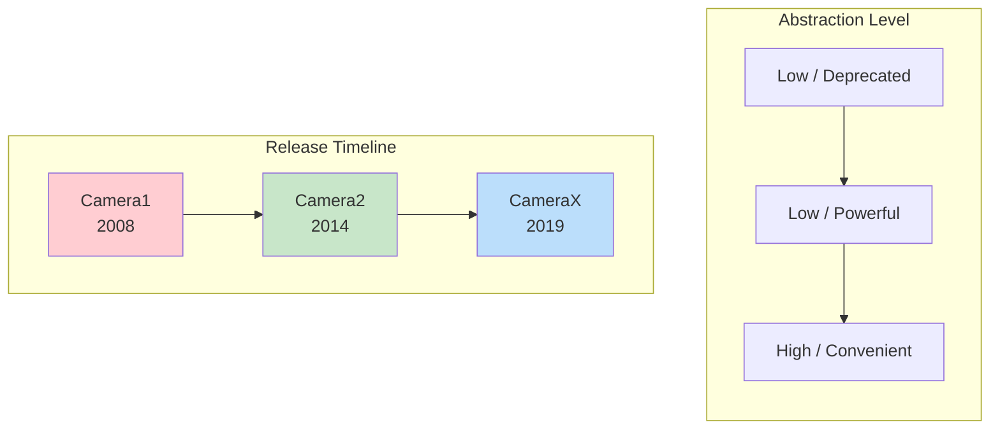
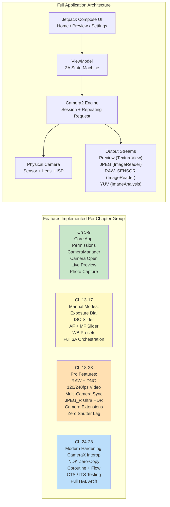

# 第1章：Android Camera2へようこそ

> **章の概要**: この最初の章では、一歩引いて全体像を眺めます。なぜCamera2が存在するのか？ 古いCamera APIや新しいCameraXライブラリと比較して、どのような問題を解決するのか？ 誰がCamera2の学習に時間を費やすべきか？ そして最も重要なこととして、このシリーズの終わりまでに実際に何を構築するのか？ 高度なアーキテクチャやHALレイヤー、パイプライン図はまだ登場しません。開発者が開発に飛び込む前に抱く疑問に対して、明確な答えを提示します。

***

## 1.1 なぜCamera2なのか？

スマートフォンを取り出してみてください。

背面を見てください。おそらく2つ、3つ、あるいはそれ以上のカメラレンズがあるはずです。その小さな長方形の突起には、2000年代半ばのプロ用デジタル一眼レフカメラ以上の光学性能とシリコンパワーが詰まっています。

次に、デフォルトのカメラアプリを開いてください。

シャッターをタップします。瞬時に、高解像度の写真がギャラリーに保存されます。写真は、鮮やかな色、シャープな被写体、滑らかな背景のボケ、そして室内光でも明るいシャドウなど、素晴らしい仕上がりになっているはずです。

しかし、今使っているカメラアプリは、ハードウェアができることのほんの一部にしか触れていません。その親しみやすいシャッターボタンの下には、信じられないほど洗練されたイメージングパイプラインが隠されています。RAW写真を撮影したり、240fpsのスローモーションビデオを記録したり、1枚の夜景写真のために10フレームを融合させたり、あるいはレンズの動きをマイクロメートル単位で独立して制御したりすることができるのです。

ほとんどのサードパーティ製Androidアプリは、このパワーにアクセスすることはありません。なぜでしょうか？ それは、**古いAndroidカメラAPI（遡及的にCamera1と呼ばれます）が極めて限定的だったから**です。Camera1は、基本的な写真とビデオのキャプチャ機能を備えたシングルカメラの携帯電話の世界向けに設計されました。以下のことはできませんでした：

- 露出時間やISOを手動で制御する
- RAWセンサーデータをキャプチャする
- 高フレームレートでスローモーションを記録する
- 複数のカメラを同時に使用する
- キャプチャ中にフレームごとのメタデータにアクセスする
- 確実に連写（バースト）撮影を行う

**Android 5.0 (APIレベル21)** 以降、Googleはこれらの壁を打ち破るために**Camera2 (android.hardware.camera2)**を導入しました。Camera2は漸進的なアップデートではなく、現代のカメラシリコンの生の機能をすべてのAndroid開発者に公開するためにゼロから構築された、**完全な再設計**です。

端的に言えば：**Camera2が存在するのは、スマートフォンのカメラがプロ級になり、古いAPIでは対応できなくなったから**です。

***

## 1.2 Camera1 対 Camera2 対 CameraX

10年以上にわたる Android カメラ開発により、**3つの世代**のカメラAPIが生まれました。コードを1行でも書く前に、どのAPIがどの問題を解決するのかを理解することが不可欠です。

### 3つの世代、3つの哲学

### Camera1 — `android.hardware.Camera`

Android 1.0で導入され、**Android 5.0で非推奨**になったオリジナルのカメラAPI。

- **モデル**: 手続き型コマンド。`startPreview()`、`takePicture()`、`setFlashMode()`といったメソッドを呼び出します。
- **設計思想**: 「カメラはあなたが命令するステートマシンである」
- **最適**: 非常に古いデバイス（Lollipop以前）を対象としたレガシーアプリ。それだけです。
- **避けるべき理由**: Googleはもう更新していません。新しいハードウェア機能（マルチカメラ、RAW、HDR）がCamera1にバックポートされることはありません。APIの表面積は極めて小さいです。現代のデバイスでは、Camera1は内部的に**Camera2ラッパーによってエミュレートされている**ため、Camera2の恩恵を受けることなくCamera2の複雑さだけを負うことになります。

### Camera2 — `android.hardware.camera2.*`

Android 5.0で導入され、それ以降のすべてのAndroidバージョンを通じて継続的に拡張されている、現代的な低レベルフレームワーク。

- **モデル**: リクエスト/レスポンスパイプライン。不変の`CaptureRequest`オブジェクトを構築し、それを`CameraCaptureSession`に送信して、非同期で`CaptureResult`メタデータと画像バッファを受け取ります。
- **設計思想**: 「カメラはプログラム可能なパイプラインである。すべてのフレームのすべてのパラメータを制御する」
- **最適**: 高度なカメラアプリ、マニュアル写真ツール、コンピュータビジョンパイプライン、RAWキャプチャ、マルチカメラの研究、高速ビデオ、およびハードウェアに近い制御が必要なあらゆるユースケース。
- **使用する理由**: OEM HALが公開しているすべての機能へのフルアクセス。直接的なフレーム制御。プロフェッショナル向け機能を実現するための唯一のAPIパス。Camera2は、CameraXが内部で呼び出しているものです。

### CameraX — `androidx.camera.*`

2019年にベータ版として導入され、Android 11あたりで安定化した**Jetpackライブラリ**（プラットフォームAPIではありません）。

- **モデル**: 宣言的なユースケース。`Preview`、`ImageCapture`、`ImageAnalysis`、または`VideoCapture`といった一連のユースケースを`bindToLifecycle()`すれば、あとはライブラリが処理します。
- **設計思想**: 「1万ものエッジケースは私たちが解決しました。どのような出力が必要か教えてくれるだけでいいです」
- **最適**: カメラを必要とするほとんどのアプリケーション。QR/バーコードスキャナー、写真のアップロード、ドキュメントスキャン、シンプルなビデオ録画など、利便性と信頼性が生の制御よりも優先されるあらゆるシナリオ。
- **使用する理由**: ライフサイクルを認識（リソースリークなし）、解像度選択は自動、OEM固有の癖（Quirks）には回避策が組み込まれており、まったく同じコードが`if`文なしで数千のデバイスモデルで動作します。

### 並列比較

| 次元 | Camera1 | Camera2 | CameraX |
|:---|:---|:---|:---|
| **導入** | Android 1.0 (2008) | Android 5.0 (2014) | Android 10 (Jetpack) |
| **ステータス** | 非推奨 | アクティブ、維持 | 推奨 (Jetpack) |
| **抽象化** | 低 (レガシー) | 低 | 高 |
| **学習曲線** | 容易 | 非常に急 | 非常に緩やか |
| **マニュアル露出 / ISO / フォーカス** | 限定的 | フルコントロール | Interopを介して限定的 |
| **RAWキャプチャ** | 不可 | 可能 | Interopの回避策で可能 |
| **マルチカメラ (物理ストリーム)** | 不可 | 可能 | 不可 |
| **高速ビデオ (120+ fps)** | 不可 | 可能 | 限定的 |
| **バースト / ブラケティング** | 不可 | フルコントロール | 不可 |
| **フレームごとのメタデータ** | 不可 | 可能、完全 + 部分的結果 | Interopコールバックを介して公開 |
| **ライフサイクルの安全性** | 手動、エラーが発生しやすい | 手動、エラーが発生しやすい | 自動、ライフサイクルに拘束 |
| **OEMの癖の処理** | なし | なし | 組み込み (1000以上のデバイスでテスト済み) |
| **動作するアプリに必要なコード量** | 中 | 非常に多い (冗長) | 非常に少ない |
| **パフォーマンス** | 普通 (間接的なラッパー) | 可能な限り最大 | 最大に近い (薄いオーバーヘッド) |

***

## 1.3 Camera2に何ができるか？

Camera2のパワーを具体的に理解するために、フラッグシップ携帯電話で見たことのある機能を想像してみてください。Camera2を使えば、これらすべてに**プログラムでアクセス可能**になります。

### プロフェッショナルグレードのキャプチャ

- **フルマニュアル露出**: シャッタースピードを1/8000秒から30秒まで、ISOを50から102,400までダイヤル操作できます。本物のプロモードUIを構築できます。
- **RAW写真**: センサーから直接、10ビット、12ビット、14ビット、または16ビットの**未処理のベイヤーデータ**（デモザイクなし、ノイズリダクションなし、色補正なし）を抽出できます。同梱の`DngCreator`を使用して、Lightroomで編集可能なAdobe DNGファイルを作成できます。
- **露出ブラケティング**: 正確にステップ分けされたEV値で、3枚、5枚、7枚、または9枚のフレームを撮影します。それらをHDR合成アルゴリズムに投入できます。
- **タイムラプスロック**: **数千フレーム**にわたって露出、フォーカス、ホワイトバランスを固定できます。太陽が動いたり雲が通過したりしても、ちらつき（フリッカー）が発生しません。

### コンピューテーショナルフォトグラフィのハードウェアアクセス

- **高速ビデオ**: 120 fps、240 fps、あるいは960 fpsのキャプチャ用に`CameraConstrainedHighSpeedCaptureSession`を構成できます。スローモーションエディタを構築できます。
- **論理マルチカメラ**: 論理マルチカメラIDの下にある**両方の**物理カメラに**同時に**アクセスできます。広角レンズと望遠レンズから同期されたYUVフレームを取得し、デバイス上で深度マップを計算できます。
- **YUV / PRIVATE再処理 (LEVEL_3デバイス)**: **ISP内にフル解像度の循環バッファ**を保持し、シャッターをタップした瞬間に過去のフレームを取得して、強力なノイズリダクションとシャープネス処理を再実行します。これがOEMによる**ゼロシャッターラグ (ZSL)**の実装方法です。
- **Ultra HDR / JPEG_R (Android 14+)**: 8ビットのSDR JPEGに加えて、二次的なHDRゲインマップを保存する`ImageFormat.JPEG_R`ファイルをリクエストして書き込みます。レガシーなビューアでは普通の写真に見えますが、HDRパネルでは1,000ニット以上のハイライトをレンダリングします。
- **カメラエクステンション (Android 12+)**: 夜景、ボケ（ポートレート）、HDR、および美顔モードを**OEM HALに委任**します。純正カメラが使用しているのとまったく同じマルチフレームAIパイプラインを使用できます。

### 高度なビデオおよびビジョンパイプライン

- **マルチストリームの同時出力**: 1つのキャプチャリクエストから、**プレビュー**用Surface、**YUV分析**用Surface（30 fpsで動作するMLオブジェクト検出用）、および**JPEG静止画**用Surfaceを、メモリをコピーすることなく駆動できます。
- **フラッシュタイミングの精度**: プリフラッシュ測光、メインフラッシュ発光、およびローリングシャッターの読み出しをフレーム単位で明示的に調整できます。
- **部分的なキャプチャ結果**: 最終的な画像バッファの準備ができる**数ミリ秒前に**、AE状態やフォーカス距離のメタデータを受け取ることができます。「どこでもタップすればUIが即座に更新される」レスポンスを実現できます。
- **オフラインセッション (API 30+)**: 夜景モードの途中でユーザーがアプリをバックグラウンドに移動させた場合、進行中のマルチフレーム合成を隔離された`CameraOfflineSession`に引き渡し、HALが非同期で処理を完了させます。処理が終わるとアプリが起動して最終的な写真を受け取ります。

### そして、これはほんの始まりに過ぎません

Androidの新しいバージョンが出るたびに、Camera2は拡張されています。Android 15 (API 35) では`CameraDeviceSetup`が追加され、**センサーに電源を入れることなく**セッション構成を調査できるようになり、機能チェックのレイテンシが10分の1に短縮されました。APIは生きており、進化し続け、常に最新のカメラハードウェアの一歩先を行っています。

***

## 1.4 誰がCamera2を学ぶべきか？

Camera2を適切に学ぶには時間がかかります。APIの表面積は膨大で、300以上のメタデータキー、数十のコールバック、複数のセッションタイプ、および何百ものOEM特有のケースが存在します。あなた自身やあなたのプロジェクトが以下のいずれかに当てはまるなら、その時間を投資する価値があります。

### 高度なカメラアプリケーションを構築している

あなたのアプリで、マニュアルISO/シャッター/フォーカス/WBダイヤルを備えた**プロモード**を提供している。あるいは、**RAW写真**をキャプチャし、デスクトップ編集用にエクスポートできるようにしている。あるいは、**スローモーションビデオ**を記録している。これらはCameraXでは不可能（あるいは著しく制限）です。

### コンピュータビジョンや研究用アプリケーションを構築している

デバイス上のMLパイプラインに投入するために、**コピーなしで最低レイテンシのYUVフレーム**が必要である。あるいは、**フレームロックされたセンサーデータ**が必要である（正確なSLAM / 視覚慣性オドメトリのために、`SENSOR_TIMESTAMP`のジャイロタイムスタンプが画像と±1ms以内で一致しなければならない）。あるいは、構造化光 / 深度センシングのために**フレームごとに正確なシャッター時間**を制御しなければならない。

### カメラ機能診断ツールを構築している

このシリーズのコンパニオンアプリである**Android Camera Parameters**（[GitHub](https://github.com/zoozooll/AndroidCameraParameters)、[Google Play](https://play.google.com/store/apps/details?id=com.minininja.cameraparams)）のように、各デバイスが何をサポートしているかを可視化するために、すべての`CameraCharacteristics`キーを網羅的にダンプする必要がある。CameraXは意図的にこれらの詳細のほとんどを隠しています。

### CameraXやOEMカメラの問題をデバッグしている

CameraXも、不明なデバイスで動作しなくなることがあります。CameraXのプレビューが引き伸ばされたり、特定のGalaxyモデルが夜景モードで緑色のフレームを返したり、Pixel 9が`VideoCapture`でクラッシュしたりする場合、バグを再現して特定するためにCamera2に降りる**必要があります**。

### モバイルイメージング、OEMカメラスタック、または車載カメラパイプラインに携わっている

ベンダーのHALコード、`frameworks/av/camera`、Camera NDK、または車載のEVS→Camera2への移行などに触れる場合、Camera2に精通していることは必須条件です。

### Camera2を学ぶ必要が**ない**のは誰か？

要件が「ユーザーにプロフィール写真を撮らせたり、QRコードをスキャンさせたりしたい」だけなら、**CameraXを使ってください**。本気です。CameraXはエンジニアリングの傑作です。デバイスの互換性に関する数ヶ月の作業を節約してくれます。Camera2は強力なツールであり、そのパワーが具体的に必要なときに手を伸ばすべきものです。

***

## 1.5 この本を通して構築するもの

理論なしのコードは抽象的です。進行なしのコードは混乱を招きます。

この本を通して、**実際に動作するフル機能のCamera2アプリケーションを段階的に構築していきます**。各章で機能を追加し、すべての機能は実際の携帯電話でコンパイルして実行できます。最終章までに、以下のような完全なアプリが組み上がります。

### マイルストーン

| 章の範囲 | 終了後にできること |
|:---|:---|
| **第1〜4章** | ハードウェアを理解できます。レンズ、センサー、ISPがどのように相互作用するかを知ることができます。あらゆる携帯電話のスペックシートを読み、どのCamera2機能をサポートしているか判断できます。コンパニオンアプリのAndroid Camera Parametersをインストールし、自分のデバイスを調査済みです。 |
| **第5〜9章** | **動作するカメラアプリ**が手に入ります。背面カメラを開き、画面にライブプレビューを表示し、シャッターボタンをタップするとJPEG写真を保存します。アスペクト比の完全な補正、正しいポートレート回転、適切なライフサイクルクリーンアップがすべて機能します。 |
| **第10〜12章** | コードがなぜそのように動作するのかという**理由**を理解できます。CaptureRequestを保留キュー、実行中キュー、HALと追跡し、CaptureResultとして戻ってくるまでを辿ることができます。実際のハードウェアレベルと報告された機能に基づいて機能を制限する方法を知ることができます。 |
| **第13〜17章** | アプリには**完全なプロモード**が備わります。マニュアルISO、シャッター、フォーカス距離、WB色温度ダイヤルを搭載します。ライブヒストグラム / EV読み出し。OEMの純正カメラが完璧な結果を得るのとまったく同じ、フル単発AF → プリキャプチャAE → キャプチャのシーケンスを模倣します。 |
| **第18〜23章** | アプリは**フラッグシップ級**になります。RAW+JPEGの同時保存、120 fpsのスローモーションビデオ記録、ポートレート深度用のデュアル物理YUVストリームキャプチャ、Ultra HDR JPEG_Rファイルの書き込み、夜景モードやボケモードのCamera Extensionsへの委任、およびLEVEL_3デバイスでのゼロシャッターラグ再処理の実装を行います。 |
| **第24〜28章** | あなたは**シニアAndroidカメラエンジニア**です。アプリの90%にはInterop経由でCameraXを組み込みつつ、必要とする10%のためにCamera2を使いこなせます。コピーなしのNDKネイティブカメラパイプラインを自作できます。すべてのコールバックをKotlin Coroutines and Flowでラップし、クリーンでテスト可能なコードを書けます。CTS ITSに合格するカメラテストの書き方を理解しています。そして、App→Framework→Binder→Native→HAL→Kernel→Hardwareのフルスタックをホワイトボードに描いて説明できます。 |
| **第29章 (百科事典)** | 最も重要な29の`CameraCharacteristics`キーの**デスクリファレンス**が手に入ります。それぞれに根拠、Kotlinでのクエリ例、Android Camera Parametersでの確認箇所、およびOEMの落とし穴の解説が付いています。プロダクションコードを出荷する際、この章を常に開いておくことになるでしょう。 |

これらは真に希少なスキルセットです。旅を始めましょう。

***

## 1.6 まとめ

- **Camera2**は、現代のマルチカメラやISPが豊富なスマートフォンの全機能を公開するためにAndroid 5.0で導入された、現代的な低レベルAndroidカメラフレームワークです。
- **Camera1**は非推奨です。**CameraX**はほとんどのユースケースで便利ですが、Camera2だけが公開しているパワーを隠しています。要件に基づいて選択してください。
- Camera2は、**マニュアルコントロール、RAW撮影、高速ビデオ、論理マルチカメラ、YUV再処理/ZSL、Ultra HDR、OEMエクステンション**、および**オフラインセッション**を解き放ちます。
- プロ仕様の写真ツール、ビジョン/研究用パイプライン、診断用アプリの構築、あるいはより深いレイヤーのデバッグを行う場合に、Camera2に投資してください。
- この本を通して、**フル機能のCamera2アプリケーションを段階的に構築**していきます。第9章のボタン1つのカメラから始まり、第23章までにフラッグシップ級のイメージングツールを作成し、第28章までに現代的なAndroidパターンで堅牢化します。

## 1.7 次のステップ

Camera2のコードを1行でも書く前に、私たちが命令するハードウェアについて理解する必要があります。**第2章：スマートフォンカメラを理解する**では、電話カメラモジュールの各部分（レンズ、イメージセンサー、ISP）が実際に何をしているのか、そして生の光がどのように圧縮されたJPEGになるのかを学びます。読み終わる頃には、箱に書かれた「48 MP」というラベルが、実際の画質についてはほとんど何も語っていない理由がわかるでしょう。
