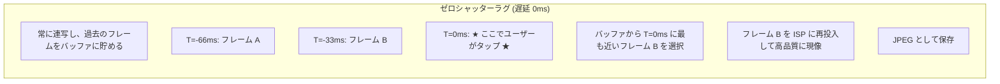

# 第23章：ゼロシャッターラグと再処理

カメラアプリで最も不満を感じるのが「シャッターラグ」です。タップした瞬間ではなく、そのコンマ数秒後の光景が保存されてしまう問題です。**ゼロシャッターラグ (ZSL)** は、センサーを常にフル解像度で動作させて過去数フレームをメモリに保持し、タップした瞬間に「既に撮り終えていた」最適なフレームを取り出すことで、この遅延をゼロにします。

魔法の鍵は **Reprocessing（再処理）API** です。単に過去の画像を保存するのではなく、既に露光済みのバッファを ISP に「再注入」し、あたかも今撮ったかのように高品質なノイズ低減や色補正をかけ直すことができます。

[Android Camera Parameters アプリ](https://github.com/zoozooll/AndroidCameraParameters)では、お使いのデバイスが再処理（`YUV_REPROCESSING` や `PRIVATE_REPROCESSING`）をサポートしているか確認できます。

---

## ZSL の仕組み：時間軸の逆転

標準のキャプチャでは、「タップ → 測光 → 露光 → 処理」という順序で進むため、どうしても 100ms 以上のラグが発生します。ZSL ではこの順序を逆転させます。

ユーザーが「今だ！」と思ったその瞬間の画を、過去の記録から救い出すのが ZSL の本質です。

---

## 再処理 (Reprocessing) の 4 ステップ

ZSL を実装するための標準的なワークフローは以下の通りです：

### 1. 循環バッファの構築
`ImageReader` を作成し、常に最新の数フレーム（例：12枚）を保持し、古いものから破棄していきます。リクエストには `CONTROL_CAPTURE_INTENT_ZERO_SHUTTER_LAG` を設定します。

### 2. 再処理可能セッションの作成
`InputConfiguration` を使用して、画像を入力として受け取れる特別なセッションを作成します。ここで `ImageWriter` を用意します。

### 3. フレームの再注入
シャッターが押されたら、バッファから最適なフレームを選び、`ImageWriter.queueInputImage()` を使って HAL に戻します。

### 4. 再処理リクエストの送信
`createReprocessCaptureRequest()` を使用して、再投入したバッファに対して「本気」の ISP 処理（高品質なノイズ除去など）を命じます。

---

## switchToOffline()：アプリが閉じても処理を続ける

Android 12 で導入された `switchToOffline()` は、ZSL のような重い再処理の途中でユーザーがホーム画面に戻っても、処理を HAL サービスに引き継いで保存を完了させるための仕組みです。これにより、「撮ったはずの写真が保存されていない」という悲劇を防げます。

---

## まとめ

- **ZSL**: 過去のフレームを利用してシャッターラグをゼロにする技術。
- **再処理**: 既存のバッファを ISP に戻して、高品質な JPEG を作り直す仕組み。
- **InputConfiguration / ImageWriter**: データの「逆流」を実現するための API。
- **LEVEL_3 デバイス**: ZSL と再処理が最も安定して動作する最高ティアのカメラ。

## 次のステップ

これで、プロフェッショナルなカメラ機能の解説はすべて終了です。
**第 24 章：CameraX** では、これまでの複雑な Camera2 の処理を、より簡単に、かつ安全に扱うための Jetpack ライブラリについて学びます。
