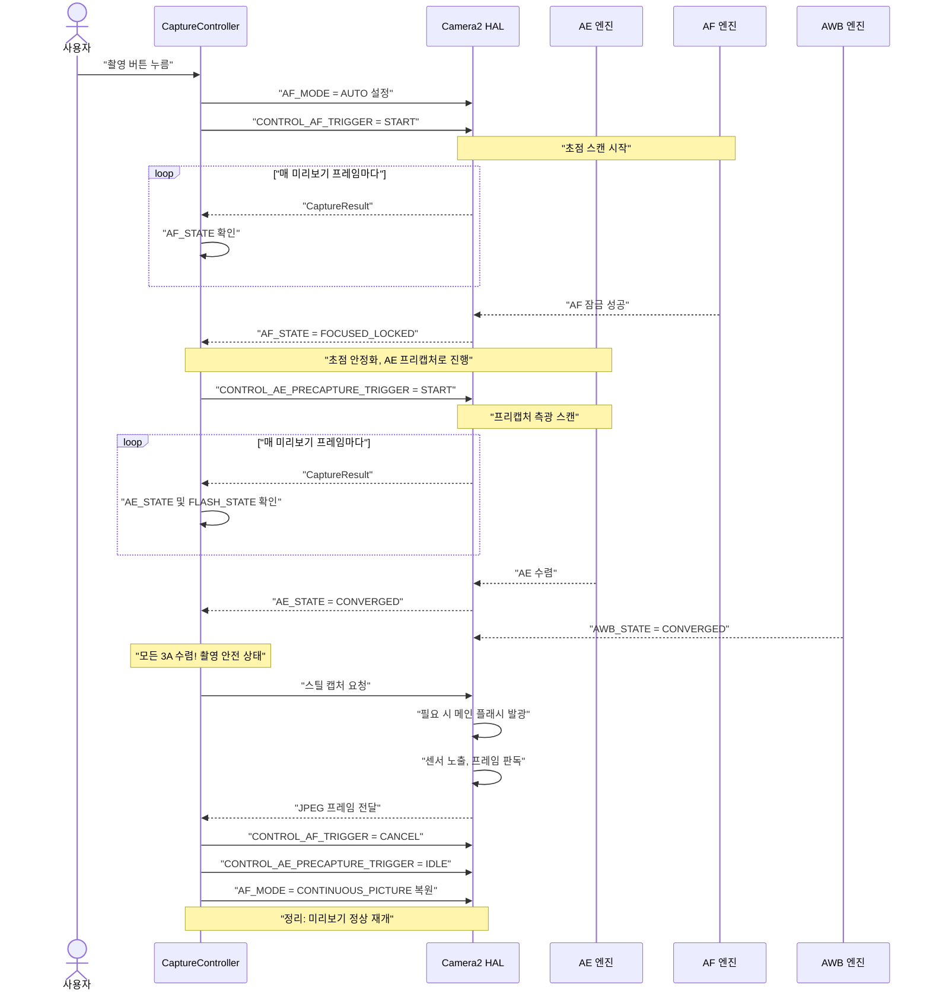
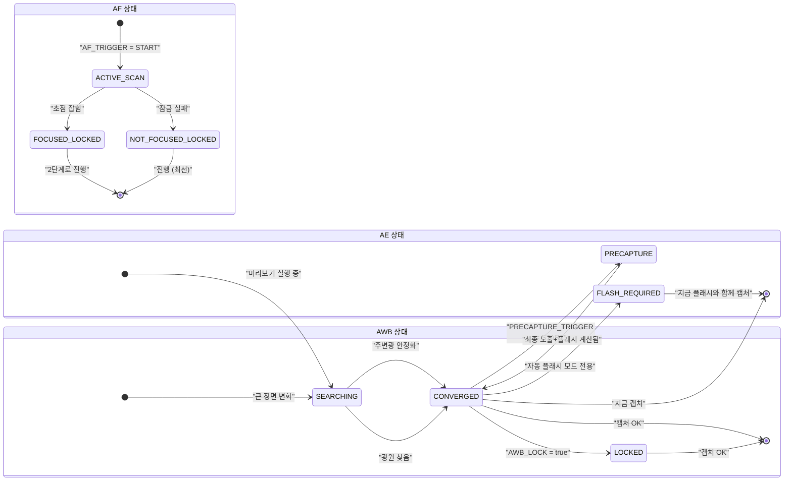

# 제17장: 3A 파이프라인

우리는 지금까지 **AE**(자동 노출, 13-14장), **AF**(자동 초점, 15장), **AWB**(자동 화이트 밸런스, 16장)를 독립적인 시스템으로 공부했습니다. 실제 사진 앱은 각 셔터를 누르기 전에 이 세 가지를 조화롭게 조정해야 하며, 그 *순서와 타이밍*이 매우 중요합니다.

사용자가 셔터 버튼을 누르자마자 즉시 `capture()`를 실행하는 단순한 구현은 일관성 없는 결과를 초래합니다. 어떤 때는 초점이 맞지 않고, 어떤 때는 플래시가 터지지 않으며, 어떤 때는 AWB 측정 중에 사진이 찍혀 초록색 색조가 도는 식입니다. 신뢰할 수 있는 3A 파이프라인은 이러한 문제를 모두 제거합니다.

이 장에서 다룰 3A 파이프라인 구현은 [Android Camera Parameters 앱](https://github.com/zoozooll/AndroidCameraParameters) 내부에서 사용되는 흐름 및 안드로이드 카메라 아키텍처 연구 문서와 전문가용 Camera2 개발에 관한 CSDN 아티클에서 설명하는 시퀀스와 동일합니다.

---

## 전체 3A 조정 시퀀스 (개요)

각 하위 시스템을 자세히 살펴보기 전에 전체 상태 흐름을 시각화해 봅시다. 이것은 단순화된 것이 아닌 실제 프로덕션 시퀀스입니다.



**각 단계는 블로킹(blocking) 방식으로 작동합니다.** HAL이 N단계에 필요한 상태를 확인할 때까지 N+1단계로 이동하지 않습니다. 단계를 건너뛰지 마세요. 단계를 건너뛰면 초점이 흐릿하거나, 플래시 노출이 잘못되거나, 파란색 색조가 도는 사진이 찍히는 앱을 만들게 됩니다.

---

## AE (자동 노출) 심층 분석

AE는 셔터+ISO뿐만 아니라 **플래시 측광**과 **프리캡처 트리거**를 포함하기 때문에 세 가지 A 중에서 가장 복잡합니다.

### AE 모드: CONTROL_AE_MODE

| 모드 | 동작 | 플래시 지원 |
|------|----------|--------------|
| `OFF` | 완전 수동 (14장에서 다룸) | 없음 |
| `ON` | 자동 노출, **플래시 비활성화** (영구 꺼짐) | 아니요 |
| `ON_AUTO_FLASH` | 자동 노출, **자동 플래시 결정** — 저조도에서만 발광 | 자동 (가장 일반적인 기본값) |
| `ON_ALWAYS_FLASH` | 자동 노출, **플래시 항상 발광** (역광 인물 사진용 채우기 플래시) | 항상 |
| `ON_AUTO_FLASH_REDEYE` | 자동 노출 + 플래시 + 적목 현상 제거 (동공 수축을 위해 프리플래시 시퀀스 발광) | 자동 + 적목 제거 |
| `ON_EXTERNAL_FLASH` | 외부 카메라 액세서리 플래시 | 외부 전용 (드묾) |

**일반적인 카메라 앱의 기본값**은 `ON_AUTO_FLASH`입니다. 사용자는 폰이 플래시를 터뜨려야 할 때를 "알아서" 결정하기를 기대합니다.

### AE 상태 및 프리캡처 트리거

AF와 마찬가지로 AE도 `CaptureResult.CONTROL_AE_STATE`를 통해 상태를 보고합니다.

| 상태 | 의미 |
|-------|---------|
| `INACTIVE` (0) | AE가 비활성화되었거나 아직 시작되지 않음 |
| `SEARCHING` (1) | 올바른 노출을 활발하게 찾는 중 |
| `CONVERGED` (2) | 노출이 안정적임. 플래시 모드에서는 *주변* 노출은 수렴했지만 아직 프리플래시 스캔이 일어나지 않은 상태임. |
| `LOCKED` (3) | `CONTROL_AE_LOCK = true`를 통해 노출이 명시적으로 잠김 |
| `FLASH_REQUIRED` (4) | 주변 노출에 수렴했으며, HAL이 정확한 촬영을 위해 **플래시가 필요하다**고 결정함 |
| `PRECAPTURE` (5) | **핵심 상태.** 프리캡처 스캔 실행 중 — HAL이 최종 캡처 노출 + 플래시 강도를 계산하기 위해 측광 중(필요 시 프리플래시 발광). |

### 프리캡처 트리거가 중요한 이유

미리보기 프레임에서 실행되는 AE 엔진은 *근사치*입니다. 미리보기 파이프라인은 더 작은 버퍼와 더 낮은 비트 깊이 처리를 사용하며, 촬영 시 발광하는 메인 플래시의 막대한 빛 기여도를 고려하지 않습니다.

`CONTROL_AE_PRECAPTURE_TRIGGER = START`는 HAL에게 다음과 같이 말하는 것과 같습니다.

> "이제 진짜 스틸 사진을 찍을 거야. 근사치는 그만두고 정밀 측광 파이프라인을 실행해. 자동 플래시 모드라면 저전력 프리플래시를 한 번 이상 터뜨려서 반사광을 측정하고, 캡처를 위한 정확한 최종 셔터/ISO/플래시 강도를 계산해."

**프리캡처를 건너뛰면 플래시 사진의 노출이 무작위로 과다하거나 부족하게 됩니다.** HAL이 실시간으로 플래시 측광을 할 기회가 없었기 때문입니다.

### AE 영역 (스팟 측광)

초점을 위한 `CONTROL_AF_REGIONS`와 마찬가지로, `CONTROL_AE_REGIONS`는 장면의 *어느 부분을* 측광할지 지정합니다. 인물 사진에서 터치로 초점을 잡을 때 동일한 영역을 AE에도 동시에 적용해야 합니다. 그래야 밝은 하늘 배경이 아닌 얼굴에 초점과 노출 우선순위가 모두 부여됩니다.

```kotlin
// AF와 AE 영역 모두에 동일한 MeteringRectangle 배열 사용
val focusWeightedRegions = arrayOf(userTapRegion)
builder.set(CaptureRequest.CONTROL_AF_REGIONS, focusWeightedRegions)
builder.set(CaptureRequest.CONTROL_AE_REGIONS, focusWeightedRegions)
```

**가중치(Weighting):** 각 `MeteringRectangle`은 가중치(0-1000)를 가집니다. 가중치가 높은 영역이 측광에 더 많은 영향을 미칩니다. "스팟 측광" 모드는 하나의 높은 가중치 사각형(1000)을 사용합니다. "평균/평가" 측광은 프레임 전체에 분산된 여러 개의 낮은 가중치 사각형을 사용합니다.

---

## AWB: 트리오의 침묵하는 파트너

AWB는 대개 일찍 수렴하고 대부분의 장면에서 수렴된 상태를 유지하기 때문에 나중에 고려되는 경우가 많습니다. 하지만 색 정확도에 대한 기여도는 매우 중요하며, 촬영 준비가 되었을 때도 여전히 최적의 값을 찾고 있을 수 있습니다.

### AWB 상태 요약

| AWB 상태 | 캡처 결정 |
|-----------|------------------|
| `INACTIVE` (AWB_MODE = OFF) | 진행 가능 (수동 게인 사용) |
| `SEARCHING` | **대기.** 색상이 여전히 변할 수 있음. 보통 장면이 크게 바뀐 후 500ms 이내에 수렴함. |
| `CONVERGED` | ✅ 완벽함 — 진행 |
| `LOCKED` | ✅ 역시 완벽함 — `CONTROL_AWB_LOCK = true`를 통해 명시적으로 잠김 |

### AWB 잠금을 AE/AF 잠금과 결합하기

중요한 스튜디오/제품 사진 촬영의 경우, 캡처 *전*에 세 가지를 모두 잠그세요.

```kotlin
// 스틸 캡처 요청에서 실행 (더 일찍 하면 안 됨 — 최종 수렴된 값을 잠그길 원함)
builder.set(CaptureRequest.CONTROL_AWB_LOCK, true)
builder.set(CaptureRequest.CONTROL_AE_LOCK, true)
// AF는 아까 트리거했고 아직 취소하지 않았으므로 잠긴 상태 유지
```

이렇게 하면 메인 캡처가 최종 프리캡처 측광 프레임에서 사용된 것과 *정확히* 동일한 색상/WB 프로필을 재사용하도록 보장합니다.

---

## 완전한 프로덕션 수준 3A 캡처 컨트롤러 (Kotlin)

이제 이 모든 것을 재사용 가능한 클래스로 조립해 보겠습니다. 이 구현은 안드로이드 카메라 아키텍처 연구 문서의 3A 제어 파이프라인 섹션에 있는 오케스트레이션 흐름 및 안드로이드 카메라 CSDN 시리즈에서 권장하는 패턴과 일치합니다.

```kotlin
class ThreeACaptureController(
    private val characteristics: CameraCharacteristics,
    private val captureSession: CameraCaptureSession,
    private val previewSurface: Surface,
    private val jpegReaderSurface: Surface,
    private val mainHandler: Handler
) {
    // ----------- 공개 API -----------
    interface CaptureListener {
        fun onCaptureStarted() {}
        fun onCaptureSuccess(jpegBytes: ByteArray)
        fun onCaptureError(reason: String)
    }

    /**
     * 전체 3A 캡처 시퀀스 조정:
     *   AF 트리거 → AF 잠김 → AE 프리캡처 → AE 수렴 → 스틸 캡처 → 정리
     */
    fun captureStillPhoto(
        aeMode: Int = CameraMetadata.CONTROL_AE_MODE_ON_AUTO_FLASH,
        listener: CaptureListener
    ) {
        this.listener = listener
        listener.onCaptureStarted()
        beginPhase1_AfTrigger(aeMode)
    }

    // ----------- 내부 상태 -----------
    private var listener: CaptureListener? = null
    private var timeoutRunnable: Runnable? = null
    private var phase: Int = 0
    private var currentAeMode: Int = CameraMetadata.CONTROL_AE_MODE_ON_AUTO_FLASH

    private val SESSION_TIMEOUT_MS = 3500L  // 저가형 폰은 최대 약 3초 필요

    // ---- 1단계: AF 트리거, FOCUSED_LOCKED 대기 ----
    private fun beginPhase1_AfTrigger(aeMode: Int) {
        currentAeMode = aeMode
        phase = 1

        val request = captureSession.device.createCaptureRequest(
            CameraDevice.TEMPLATE_PREVIEW
        ).apply {
            addTarget(previewSurface)

            set(CaptureRequest.CONTROL_AF_MODE,
                CameraMetadata.CONTROL_AF_MODE_AUTO)
            set(CaptureRequest.CONTROL_AE_MODE, aeMode)
            set(CaptureRequest.CONTROL_AWB_MODE,
                CameraMetadata.CONTROL_AWB_MODE_AUTO)

            // 원샷 AF 스캔 시작
            set(CaptureRequest.CONTROL_AF_TRIGGER,
                CameraMetadata.CONTROL_AF_TRIGGER_START)
        }

        startTimeout("AF 스캔")
        captureSession.setRepeatingRequest(request.build(), captureCallback, mainHandler)
    }

    // ---- 2단계: AF 잠김. AE 프리캡처 트리거 시작 ----
    private fun beginPhase2_AePrecapture() {
        phase = 2
        val request = captureSession.device.createCaptureRequest(
            CameraDevice.TEMPLATE_PREVIEW
        ).apply {
            addTarget(previewSurface)

            // AF 잠금 유지 — 아직 AF 트리거를 취소하지 마세요!
            set(CaptureRequest.CONTROL_AF_MODE,
                CameraMetadata.CONTROL_AF_MODE_AUTO)
            // AF_TRIGGER는 1단계의 START 상태로 유지됨

            set(CaptureRequest.CONTROL_AE_MODE, currentAeMode)

            // ---- 핵심 라인: 프리캡처 실행 ----
            set(CaptureRequest.CONTROL_AE_PRECAPTURE_TRIGGER,
                CameraMetadata.CONTROL_AE_PRECAPTURE_TRIGGER_START)

            set(CaptureRequest.CONTROL_AWB_MODE,
                CameraMetadata.CONTROL_AWB_MODE_AUTO)
        }

        restartTimeout("AE 프리캡처")
        captureSession.setRepeatingRequest(request.build(), captureCallback, mainHandler)
    }

    // ---- 3단계: AE 수렴 + AWB 수렴. 실제 스틸 캡처 실행. ----
    private fun beginPhase3_StillCapture() {
        phase = 3
        cancelTimeout()

        val request = captureSession.device.createCaptureRequest(
            CameraDevice.TEMPLATE_STILL_CAPTURE
        ).apply {
            addTarget(previewSurface)
            addTarget(jpegReaderSurface)

            // 캡처가 완료될 때까지 AF 잠금 유지
            set(CaptureRequest.CONTROL_AF_MODE,
                CameraMetadata.CONTROL_AF_MODE_AUTO)

            set(CaptureRequest.CONTROL_AE_MODE, currentAeMode)

            // 마지막 프레임의 드리프트를 방지하기 위해 스틸 캡처 시 AE와 AWB 모두 잠금
            set(CaptureRequest.CONTROL_AE_LOCK, true)
            set(CaptureRequest.CONTROL_AWB_LOCK, true)

            set(CaptureRequest.CONTROL_AWB_MODE,
                CameraMetadata.CONTROL_AWB_MODE_AUTO)

            set(CaptureRequest.JPEG_QUALITY, 95)
            // JPEG 방향: 올바른 최종 방향을 위해 디스플레이 회전 사용
            val jpegOrient = computeJpegOrientation()
            set(CaptureRequest.JPEG_ORIENTATION, jpegOrient)
        }

        captureSession.capture(request.build(), object : CameraCaptureSession.CaptureCallback() {
            override fun onCaptureCompleted(
                session: CameraCaptureSession,
                request: CaptureRequest,
                result: TotalCaptureResult
            ) {
                super.onCaptureCompleted(session, request, result)
                // ImageReader OnImageAvailableListener가 바이트를 리스너에 저장하는 것을 처리함
                // 이제 정리: 정상 미리보기 모드로 리셋
                resetToContinuousPreview()
            }
        }, mainHandler)
    }

    // ---- 정리: 정상 연속 미리보기 재개 ----
    private fun resetToContinuousPreview() {
        phase = 0
        val request = captureSession.device.createCaptureRequest(
            CameraDevice.TEMPLATE_PREVIEW
        ).apply {
            addTarget(previewSurface)
            set(CaptureRequest.CONTROL_AF_MODE,
                CameraMetadata.CONTROL_AF_MODE_CONTINUOUS_PICTURE)
            set(CaptureRequest.CONTROL_AE_MODE, currentAeMode)
            set(CaptureRequest.CONTROL_AWB_MODE,
                CameraMetadata.CONTROL_AWB_MODE_AUTO)

            // 모든 잠금 해제 및 트리거 취소
            set(CaptureRequest.CONTROL_AF_TRIGGER,
                CameraMetadata.CONTROL_AF_TRIGGER_CANCEL)
            set(CaptureRequest.CONTROL_AE_PRECAPTURE_TRIGGER,
                CameraMetadata.CONTROL_AE_PRECAPTURE_TRIGGER_IDLE)
            set(CaptureRequest.CONTROL_AE_LOCK, false)
            set(CaptureRequest.CONTROL_AWB_LOCK, false)
        }
        captureSession.setRepeatingRequest(request.build(), null, mainHandler)
    }

    // ----------- 마스터 콜백: 상태 검사를 통해 세 단계 모두 구동 -----------
    private val captureCallback = object : CameraCaptureSession.CaptureCallback() {
        override fun onCaptureCompleted(
            session: CameraCaptureSession,
            request: CaptureRequest,
            result: TotalCaptureResult
        ) {
            val afState = result.get(CaptureResult.CONTROL_AF_STATE)
            val aeState = result.get(CaptureResult.CONTROL_AE_STATE)
            val awbState = result.get(CaptureResult.CONTROL_AWB_STATE)

            when (phase) {
                1 -> {
                    // ---- 1단계: AF 잠금 대기 ----
                    when (afState) {
                        CaptureResult.CONTROL_AF_STATE_FOCUSED_LOCKED -> {
                            Log.d("3A", "✓ AF FOCUSED_LOCKED — AE 프리캡처로 이동")
                            beginPhase2_AePrecapture()
                        }
                        CaptureResult.CONTROL_AF_STATE_NOT_FOCUSED_LOCKED -> {
                            Log.w("3A", "⚠ AF NOT_FOCUSED_LOCKED — 그래도 진행 (핀트가 나갈 수 있음)")
                            beginPhase2_AePrecapture()
                        }
                        // ACTIVE_SCAN / PASSIVE_SCAN → 계속 대기
                    }
                }
                2 -> {
                    // ---- 2단계: 프리캡처 후 AE 수렴 대기 ----
                    // "AE가 프리캡처를 완료하고 촬영 준비가 됨"을 의미하는 상태들 수용
                    val aeReady = (aeState == CaptureResult.CONTROL_AE_STATE_CONVERGED
                                || aeState == CaptureResult.CONTROL_AE_STATE_LOCKED
                                || aeState == CaptureResult.CONTROL_AE_STATE_FLASH_REQUIRED)
                    val awbReady = (awbState == CaptureResult.CONTROL_AWB_STATE_CONVERGED
                                 || awbState == CaptureResult.CONTROL_AWB_STATE_LOCKED
                                 || awbState == CaptureResult.CONTROL_AWB_STATE_INACTIVE)

                    if (aeReady && awbReady) {
                        Log.d("3A", "✓ AE=$aeState, AWB=$awbState — 캡처 실행")
                        beginPhase3_StillCapture()
                    }
                }
            }
        }
    }

    // ----------- 타임아웃 보호: HAL이 수렴하지 않아도 멈춰있지 않도록 함 -----------
    private fun startTimeout(phaseName: String) {
        cancelTimeout()
        timeoutRunnable = Runnable {
            Log.w("3A", "⏱ $phaseName 대기 타임아웃 — 최선의 상태로 진행")
            when (phase) {
                1 -> beginPhase2_AePrecapture()  // 가능한 최선의 초점으로 진행
                2 -> beginPhase3_StillCapture()  // 가능한 최선의 노출로 진행
            }
        }
        mainHandler.postDelayed(timeoutRunnable!!, SESSION_TIMEOUT_MS)
    }
    private fun restartTimeout(phaseName: String) = startTimeout(phaseName)
    private fun cancelTimeout() {
        timeoutRunnable?.let { mainHandler.removeCallbacks(it) }
        timeoutRunnable = null
    }

    // ----------- 유틸리티: 디스플레이 회전에 따른 올바른 JPEG 방향 계산 -----------
    private fun computeJpegOrientation(): Int {
        val sensorOrient = characteristics.get(
            CameraCharacteristics.SENSOR_ORIENTATION
        ) ?: 0
        // Activity의 Display.rotation (0, 90, 180, 270)과 결합
        // 일반적인 구현: return (sensorOrient + displayRotationDegrees) % 360
        return sensorOrient  // 단순화됨. 실제로는 디스플레이 회전과 연결하세요.
    }
}
```

### 컨트롤러 사용 방법

```kotlin
// CameraFragment의 캡처 버튼 클릭 리스너 내부
val controller = ThreeACaptureController(
    characteristics = yourCameraCharacteristics,
    captureSession = yourActiveSession,
    previewSurface = previewView.surface,
    jpegReaderSurface = jpegImageReader.surface,
    mainHandler = yourCameraHandler
)

controller.captureStillPhoto(
    aeMode = CameraMetadata.CONTROL_AE_MODE_ON_AUTO_FLASH
) {
    override fun onCaptureSuccess(jpegBytes: ByteArray) {
        lifecycleScope.launch(Dispatchers.IO) {
            val file = File(requireContext().filesDir, "photo_${System.currentTimeMillis()}.jpg")
            file.writeBytes(jpegBytes)
            withContext(Dispatchers.Main) {
                Toast.makeText(requireContext(), "저장됨: ${file.name}", Toast.LENGTH_SHORT).show()
            }
        }
    }
    override fun onCaptureError(reason: String) {
        Toast.makeText(requireContext(), "캡처 실패: $reason", Toast.LENGTH_LONG).show()
    }
}
```

### ImageReader와 페어링하기

`jpegBytes`를 리스너에 실제로 전달하려면 JPEG `ImageReader`의 `OnImageAvailableListener`를 설정하는 것을 잊지 마세요. 위의 컨트롤러는 여러분이 이미 이 연결을 완료했다고 가정합니다.

```kotlin
// ImageReader 생성 시 이를 설정하세요 (캡처 장 참조)
jpegImageReader.setOnImageAvailableListener({ reader ->
    val image = reader.acquireLatestImage() ?: return@setOnImageAvailableListener
    image.use {
        val buffer = it.planes[0].buffer
        val bytes = ByteArray(buffer.remaining())
        buffer.get(bytes)
        // 바이트를 UI / 파일 세이버로 전달
        lastCaptureListener?.onCaptureSuccess(bytes)
    }
}, mainHandler)
```

---

## 플래시 특화 처리의 미묘한 차이

`ON_AUTO_FLASH` / `ON_ALWAYS_FLASH` / `ON_AUTO_FLASH_REDEYE` 모드의 경우, 프리캡처 트리거가 프리플래시 펄스를 실행합니다. 두 가지 중요한 고려 사항이 있습니다.

1. **프리플래시 펄스 가시성:** 프리플래시는 *실제 플래시*입니다. 사용자는 메인 플래시 전에 저휘도 플래시 펄스가 터지는 것을 보게 됩니다. 대부분의 현대적인 카메라 UI는 이를 "셔터 버튼 애니메이션"이나 미리보기 화면을 어둡게 처리하여 숨깁니다.

2. **`FLASH_STATE`가 READY여야 함:** `AE_STATE = CONVERGED` 외에도 플래시 모드에서는 캡처 전 `CaptureResult.FLASH_STATE = FLASH_STATE_READY` (또는 `FIRED`)인지 확인하세요. AE는 수렴했더라도 플래시 충전용 커패시터가 여전히 충전 중일 수 있습니다.

```kotlin
// 플래시 모드를 위한 2단계 콜백 내부의 개선된 aeReady 체크:
val aeState = result.get(CaptureResult.CONTROL_AE_STATE)
val flashState = result.get(CaptureResult.FLASH_STATE)

val flashModeWantsFlash = (currentAeMode == CameraMetadata.CONTROL_AE_MODE_ON_ALWAYS_FLASH ||
                          (currentAeMode == CameraMetadata.CONTROL_AE_MODE_ON_AUTO_FLASH &&
                           aeState == CaptureResult.CONTROL_AE_STATE_FLASH_REQUIRED))

val aeReady = when {
    flashModeWantsFlash -> {
        // HAL은 AE 수렴과 발광 준비가 된 플래시를 모두 가지고 있어야 함
        (aeState == CaptureResult.CONTROL_AE_STATE_CONVERGED
         || aeState == CaptureResult.CONTROL_AE_STATE_FLASH_REQUIRED) &&
        (flashState == CaptureResult.FLASH_STATE_READY
         || flashState == CaptureResult.FLASH_STATE_FIRED)
    }
    else -> {
        // 플래시 없는 모드: 단순 AE 수렴으로 충분함
        (aeState == CaptureResult.CONTROL_AE_STATE_CONVERGED
         || aeState == CaptureResult.CONTROL_AE_STATE_LOCKED)
    }
}
```

---

## 3A 상태 전이 머신 (요약 다이어그램)

디버깅 시 빠른 참조를 위해, 성공적인 캡처 동안 예상되는 전이를 보여주는 AE, AF, AWB의 통합 상태 차트입니다.



글로벌 컨트롤러는 세 가지 하위 상태 모두에서 최종 "캡처 OK" 상태에 동시에 도달했을 때만 스틸 캡처를 진행합니다.

---

## 3A 파이프라인 문제 해결

| 증상 | 근본 원인 | 해결 방법 |
|---------|-----------|-----|
| 플래시 사진의 노출이 무작위로 과다/부족함 | `AE_PRECAPTURE_TRIGGER = START`를 건너뜀 | 플래시 모드에서는 스틸 캡처 전 항상 프리캡처 실행 |
| 5-10장 중 한 장꼴로 초점이 약간 흐릿함 | `FOCUSED_LOCKED` 전에 캡처를 진행함 | AF 상태에서 블로킹 (우리의 컨트롤러가 이 작업을 수행함) |
| 카메라가 몇 초간 멈췄다가 충돌함 | 타임아웃 없음. HAL이 영원히 SEARCHING에 머물러 있음 | 표시된 대로 3500ms 타임아웃 + 최선의 폴백 추가 |
| 플래시는 터지지만 사진이 여전히 어두움 | `FLASH_STATE = READY` 전에 진행함 | 커패시터 충전 중. AE 준비 조건에 FLASH_STATE 확인 추가 |
| 역광인 사람의 인물 사진 노출이 부족함 | AE가 얼굴이 아닌 하늘을 측광함 | `CONTROL_AE_REGIONS`를 `CONTROL_AF_REGIONS`와 동일한 탭 영역에 연결 |
| 연속 촬영 프레임 간에 색조가 2° 정도 변함 | 촬영 시작 전 `AWB_LOCK = true`를 잊음 | 첫 번째 수렴된 프레임에서 AWB 잠금. 촬영 내내 잠금 유지 |
| 저가형 폰에서 캡처 시퀀스가 눈에 띄게 느림 | `TEMPLATE_STILL_CAPTURE`가 콜드 파이프라인으로 시작함 | 동일한 AE/AF 설정의 더미 `TEMPLATE_PREVIEW`로 파이프라인 예열 |

---

## 요약

이 장에서는 노출, 초점, 화이트 밸런스를 하나의 신뢰할 수 있는 **3A 캡처 파이프라인**으로 묶었습니다. 이는 전문가용 카메라 앱이 매번 셔터를 누를 때 사용하는 시퀀스와 정확히 일치합니다.

1. **1단계 (AF):** `AF_MODE = AUTO` + `AF_TRIGGER = START` 설정. `AF_STATE = FOCUSED_LOCKED` (또는 폴백으로 `NOT_FOCUSED_LOCKED`)가 될 때까지 대기.
2. **2단계 (AE 프리캡처):** `AE_PRECAPTURE_TRIGGER = START` 설정. `AE_STATE = CONVERGED` / `FLASH_REQUIRED` 및 (플래시 모드인 경우) `FLASH_STATE = READY`가 될 때까지 대기. 또한 `AWB_STATE = CONVERGED`여야 함.
3. **3단계 (스틸 캡처):** `AE_LOCK = true`, `AWB_LOCK = true`로 `TEMPLATE_STILL_CAPTURE` 제출.
4. **4단계 (정리):** 모든 트리거 취소, 모든 잠금 해제, `AF_MODE = CONTINUOUS_PICTURE` 복원.

핵심 지원 개념:
- **AE 모드:** `ON_AUTO_FLASH`는 일반 사용자 앱을 위한 합리적인 기본값입니다.
- **AE 영역** = 스팟 측광. 터치 초점 시 항상 AF 영역과 쌍으로 구성하세요.
- **AWB는 빠르게 수렴함** 하지만 색상이 중요한 작업의 경우 항상 `CONVERGED` 또는 `LOCKED`에서 블로킹하세요.
- **타임아웃은 협상의 여지가 없습니다.** 저가형 폰과 저조도 환경에서는 AF/AE 스캔이 영원히 지속될 수 있습니다. 약 3.5초 후에 항상 최선의 폴백으로 진행하세요.

## 다음 단계

3A 수동 사진 모듈을 완료하신 것을 축하드립니다! 이제 여러분은 다음과 같은 기능들을 전문가 수준으로 제어하는 방법을 이해하게 되었습니다.

- **노출 (13-14장):** 노출 삼각형, ISO + 셔터 속도, 나노초 변환, 수동 재정의, 장노출, 타임랩스 잠금, 브래키팅
- **초점 (15장):** AF 모드, AF 상태 머신, 원샷 트리거 및 캡처, 수동 초점 디옵터, 과초점 거리 프리셋, 터치 초점 영역
- **색상 (16장):** 색온도, AWB 프리셋, 수동 COLOR_CORRECTION_GAINS, 3×3 CCM 변환, 켈빈 슬라이더 구현
- **오케스트레이션 (17장):** 프리캡처, 플래시 안전 AE 수렴, 단계별 타임아웃, 잠금/해제 정리를 포함한 전체 3A 파이프라인

여러분은 이제 [Android Camera Parameters 앱](https://github.com/zoozooll/AndroidCameraParameters) 자체의 성능에 필적하는 완전한 프로 모드 카메라 앱을 구축할 수 있습니다!

이어지는 장에서는 캡처 **제어**에서 캡처 **품질**로 초점을 옮깁니다. RAW 캡처, DNG 저장, 멀티 프레임 처리, HDR 및 여러분이 마스터한 3A 파이프라인을 기반으로 하는 계산 사진학 기법들을 다룰 예정입니다.
