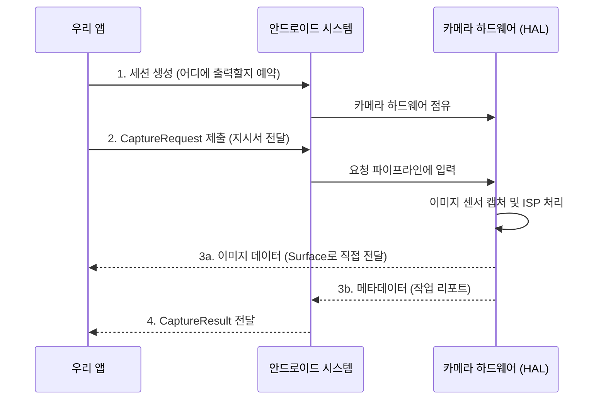

# 제4장: Camera2 아키텍처

Camera2 API는 안드로이드 개발자들이 마주하는 가장 복잡한 API 중 하나로 꼽힙니다. 하지만 그 복잡함 속에는 매우 명확하고 강력한 설계 철학이 담겨 있습니다. 코드를 작성하기 전에 이 "설계도"를 먼저 이해하면, 왜 그렇게 많은 콜백과 설정을 거쳐야 하는지 이해하게 될 것입니다.

핵심은 하나입니다: **Camera2는 거대한 컨베이어 벨트(파이프라인)입니다.**

[Android Camera Parameters 앱](https://github.com/zoozooll/AndroidCameraParameters)의 **Raw JSON** 탭을 보면 이 아키텍처가 실제로 주고받는 데이터의 실체를 눈으로 확인할 수 있습니다.

---

## 1. 파이프라인 모델 (The Pipeline Model)

이전의 Camera1 API가 "명령어 방식(명령을 내리면 카메라가 반응)"이었다면, Camera2는 **"요청 방식(일감을 던져주면 결과가 나옴)"**입니다.

1. **요청(Request):** 앱이 "이 설정(ISO 400, 셔터 1/60초 등)으로 사진 한 장 찍어줘"라고 요청을 보냅니다.
2. **수행(Execution):** 카메라 하드웨어가 그 일감을 받아서 처리합니다.
3. **결과(Result):** 작업이 끝나면 이미지 데이터(픽셀)와 결과 리포트(메타데이터)를 앱에 돌려줍니다.

이 과정이 초당 30번 이상 반복되면서 우리가 보는 "미리보기"가 만들어집니다.

---

## 2. 3대 핵심 클래스

Camera2 아키텍처를 지탱하는 세 개의 기둥이 있습니다.

### 1) CaptureRequest (일감 지시서)
카메라가 한 프레임을 찍을 때 필요한 **모든 설정**이 담긴 불변(Immutable) 객체입니다.
- 어느 카메라를 쓸지?
- 밝기는 어떻게 할지?
- 초점은 어디에 맞출지?
- 결과물을 어디(화면, 저장소, AI 분석기 등)로 보낼지?

### 2) CameraCaptureSession (컨베이어 벨트)
앱과 카메라 하드웨어 사이의 **통로**입니다.
- 세션이 한 번 만들어지면, 우리는 이 통로를 통해 `CaptureRequest`를 계속해서 밀어 넣습니다.
- 한 번에 여러 개의 요청을 묶어서 보낼 수도 있습니다(연사 촬영).

### 3) CaptureResult (결과 리포트)
작업이 끝난 후 시스템이 주는 **영수증**입니다.
- 실제로 어떤 설정으로 찍혔는지?
- 초점은 성공적으로 잡혔는지?
- 현재 카메라의 상태는 어떤지?
- *주의: 이미지 데이터 자체는 별도의 Surface로 전달되며, 이 객체에는 데이터 정보(메타데이터)만 들어있습니다.*

---

## 3. 전체 흐름도 (Mermaid)

이 복잡한 상호작용을 그림으로 그려보면 다음과 같습니다.

---

## 4. 왜 이렇게 만들었을까? (Stateless 설계)

Camera2의 가장 큰 특징은 **"상태가 없다(Stateless)"**는 점입니다. 각 요청은 독립적입니다.
- 프레임 1: 밝게 찍어줘.
- 프레임 2: 어둡게 찍어줘.
- 프레임 3: 다시 밝게 찍어줘.

이런 요청들을 하드웨어에 쉴 새 없이 밀어 넣을 수 있습니다. 덕분에 우리는 미리보기를 보면서 동시에 사진을 찍고, 동시에 AI 얼굴 인식을 하는 등 **멀티태스킹**을 아주 부드럽게 수행할 수 있습니다.

---

## 요약

- Camera2는 **요청-처리-결과**의 파이프라인 구조입니다.
- **CaptureRequest**는 지시서, **CaptureSession**은 통로, **CaptureResult**는 리포트입니다.
- 모든 과정은 **비동기(Asynchronous)**로 이루어집니다. "찍어!"라고 말한 뒤에 결과가 올 때까지 다른 일을 할 수 있다는 뜻입니다.

## 다음 단계

아키텍처라는 큰 그림을 보았으니, 이제 실제로 프로젝트를 만들어볼 차례입니다. **제5장: 첫 Camera2 프로젝트 만들기**에서는 안드로이드 스튜디오를 열고 카메라 권한 설정부터 기본 뼈대를 잡는 작업을 시작합니다.
