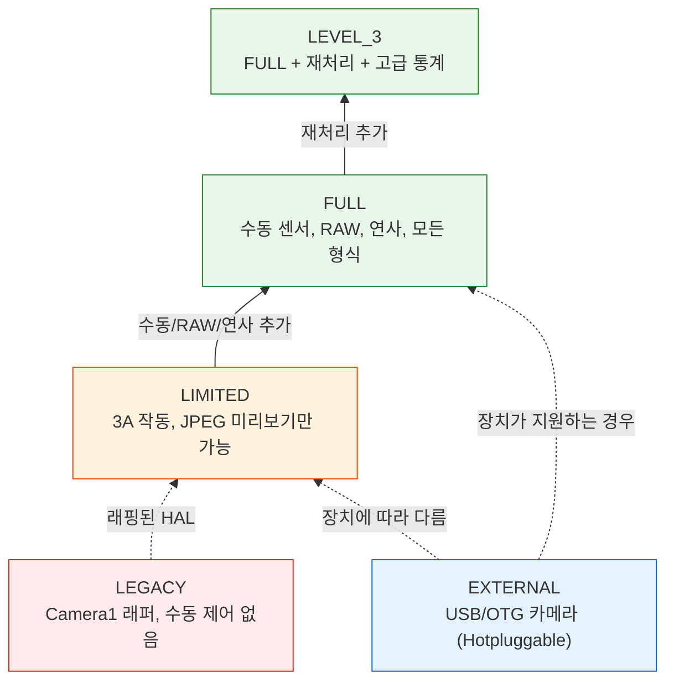
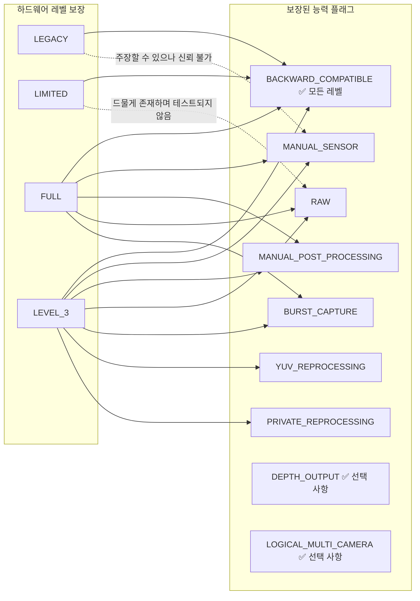
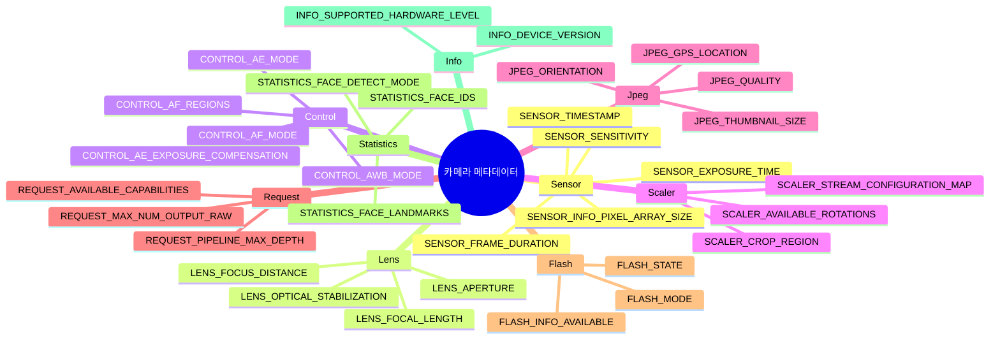

## 12.1 주머니 속의 사양서

`openCamera()`를 호출하기 전, `CaptureRequest`를 빌드하기 전, 세션을 구성하기 전 — 그곳에 `CameraCharacteristics`가 있습니다. 이는 카메라를 켜지 않고도 그 카메라가 할 수 있는 *모든 것*을 보여주는 불변의 창입니다. 구조화된 쿼리 가능 객체로 노출된 카메라의 사양서라고 생각하면 됩니다.

`CameraCharacteristics`는 10,000개 이상의 안드로이드 기기 모델에서 작동하는 앱을 작성하기 위한 가장 중요한 도구입니다. 수동 ISO가 작동할 것이라고 가정할 수 없습니다. RAW를 사용할 수 있다고 가정할 수 없습니다. 심지어 카메라가 1080p 미리보기를 지원한다고 가정할 수도 없습니다 — `CameraCharacteristics`에 물어보기 전까지는 말이죠.

[제6장](discovering-cameras.md)에서 우리는 렌즈 방향, 센서 크기, 초점 거리와 같은 기본 사항을 다루었습니다. 이번 심층 분석에서는 훨씬 더 나아갑니다.
- 5가지 **하드웨어 레벨** (LEGACY → LIMITED → FULL → LEVEL_3 → EXTERNAL)과 각 레벨이 보장하는 것
- 10개 이상의 **능력 플래그** (`MANUAL_SENSOR`, `RAW`, `DEPTH_OUTPUT` 등)와 이를 제공하는 하드웨어 레벨
- 메타데이터 키가 하위 시스템별로 **계층적으로 구성**되는 방식 (`android.sensor.*`, `android.lens.*`, `android.control.*`, ...)
- 우아한 폴백(fallback)을 포함한 **포괄적인 런타임 능력 쿼리** 작성 방법

Android Camera Parameters 앱 ([GitHub](https://github.com/zoozooll/AndroidCameraParameters), [Play Store](https://play.google.com/store/apps/details?id=com.minininja.cameraparams))은 본질적으로 기능이 강화된 `CameraCharacteristics` 브라우저입니다. 어떤 카메라든 열어보면 이 장에서 논의하는 정확한 키들이 카테고리별로 정리되어 있으며, 사람이 읽을 수 있는 레이블과 실시간 값 렌더링을 볼 수 있습니다.

## 12.2 CameraCharacteristics의 실제 정체

정식으로 말하자면, `CameraCharacteristics`는 다음과 같습니다.

- **불변(Immutable)** — `CameraManager.getCameraCharacteristics(id)`에서 일단 가져오면 객체는 절대 변하지 않습니다(API 32+의 폴더블 `SENSOR_ORIENTATION`이라는 문서화된 예외 하나 제외).
- **전력 소모 없음** — 이를 조회해도 센서나 ISP에 **전원이 켜지지 않습니다**. 배터리 영향 없이 첫 번째 Activity의 `onCreate()`에서 호출할 수 있습니다.
- **카메라별 독립** — 논리적 카메라 ID마다 고유한 `CameraCharacteristics` 객체를 가집니다.
- **타입 안전 및 키 기반** — 데이터는 `<Key<T>> get(Key<T> key)`를 통해 액세스되며, 각 키는 문서화된 타입(Int, Long, Float, Rect, Array 등)을 가집니다.

단 한 번의 호출로 가져올 수 있습니다.

```kotlin
val cameraManager = getSystemService(CAMERA_SERVICE) as CameraManager
val cameraIdList = cameraManager.cameraIdList  // 예: ["0", "1", "2", "3"]

for (id in cameraIdList) {
    val characteristics: CameraCharacteristics = cameraManager.getCameraCharacteristics(id)
    // 마음껏 쿼리하세요 — 센서 전력이 소모되지 않습니다!
}
```

안드로이드 15 (API 35)에서는 카메라를 열지 않고도 가벼운 세션 구성 쿼리를 위해 `CameraManager.getCameraDeviceSetup(id)`를 사용할 수 있습니다 (`CameraDeviceSetup` 세부 사항은 [제28장](camera2-architecture.md) 참조).

## 12.3 하드웨어 레벨: INFO_SUPPORTED_HARDWARE_LEVEL

가장 중요한 `CameraCharacteristics` 키는 단연 **`INFO_SUPPORTED_HARDWARE_LEVEL`**입니다. 이는 카메라 HAL의 전체 등급을 정의하며 어떤 기능이 작동할지 (대략적으로) 알려줍니다. 다음은 5가지 하드웨어 레벨입니다.

### 5가지 하드웨어 레벨

| 레벨 | 상수 | 전형적인 장치 | 실제 의미 |
|-------|----------|----------------|---------------------------|
| **LEGACY** | `INFO_SUPPORTED_HARDWARE_LEVEL_LEGACY` | 2015년 이전 보급형 기기, 매우 오래된 칩셋 | Camera2 API가 이전의 `android.hardware.Camera` API를 래핑한 형태입니다. 프레임당 제어, 수동 설정, RAW가 불가능하며 연사가 불안정합니다. "Camera2 문법을 쓰는 Camera1 시대 장치"로 취급하세요. |
| **LIMITED** | `INFO_SUPPORTED_HARDWARE_LEVEL_LIMITED` | 보급형 폰 (안드로이드 Go, MediaTek Helio, Snapdragon 4xx와 같은 엔트리 레벨 SoC) | 네이티브 Camera2 HAL이지만 일부 기능만 지원합니다. 3A (AF/AE/AWB)는 작동합니다. 미리보기 + JPEG도 작동합니다. 하지만 수동 센서 제어, RAW, 보장된 연사, YUV 재처리는 **불가능**합니다. 안드로이드의 "최소 기능" 카메라 레벨입니다. |
| **FULL** | `INFO_SUPPORTED_HARDWARE_LEVEL_FULL` | 중급 및 플래그십 폰 (Snapdragon 6xx/7xx/8xx, Exynos 중급 이상, Dimensity 7xxx+ 등) | "전문가용 카메라" 등급입니다. MANUAL_SENSOR, MANUAL_POST_PROCESSING, BURST_CAPTURE, 프레임당 설정, 30fps 전체 해상도, RAW, 모든 출력 형식, 예측 가능한 파이프라인 깊이를 보장합니다. 진지한 카메라 앱이라면 이 레벨을 원할 것입니다. |
| **LEVEL_3** | `INFO_SUPPORTED_HARDWARE_LEVEL_3` | 고성능 ISP를 탑재한 하이엔드 플래그십 (Snapdragon 8 Gen 1+, Pixel 6+, Exynos 2xxx+ 등) | FULL 레벨에 추가 기능 포함: YUV 재처리(입력 스트림 지원, 오프라인 재처리), 프라이빗 재처리, 고급 통계, 최대 해상도에서 하드웨어 JPEG + RAW 동시 출력. RAW 출력이 포함된 ZSL에 필수적입니다. |
| **EXTERNAL** | `INFO_SUPPORTED_HARDWARE_LEVEL_EXTERNAL` | USB 카메라, OTG로 연결된 웹캠 | 외부 카메라 HAL입니다. USB 장치에 따라 LIMITED 또는 FULL처럼 동작합니다. 핵심 주의사항: 카메라를 언제든 연결/해제(hotplug)할 수 있으므로 `ACTION_CAMERA_DEVICE_STATE_CHANGED`를 모니터링해야 합니다. |



:::important
하드웨어 레벨은 "최선을 다하겠다"는 플래그가 아니라 **보증(guarantee)**입니다. 장치가 FULL이라고 보고한다면, 구글의 CTS (Compatibility Test Suite)가 모든 FULL 레벨 기능이 작동함을 검증한 것입니다. 장치가 LIMITED라고 보고한다면 어떤 FULL 레벨 기능도 신뢰할 수 없습니다 — 특정 LIMITED 장치에서 우연히 작동하더라도 다른 장치에서는 깨질 것입니다.
:::

### 런타임에 하드웨어 레벨 확인하기

```kotlin
val hardwareLevel = characteristics.get(CameraCharacteristics.INFO_SUPPORTED_HARDWARE_LEVEL)

when (hardwareLevel) {
    CameraCharacteristics.INFO_SUPPORTED_HARDWARE_LEVEL_LEGACY -> {
        Log.w("CamCaps", "LEGACY 하드웨어 — 수동/RAW 비활성화. 기본 JPEG로 폴백.")
        disableManualControls()
        disableRawCapture()
    }
    CameraCharacteristics.INFO_SUPPORTED_HARDWARE_LEVEL_LIMITED -> {
        Log.i("CamCaps", "LIMITED 하드웨어 — 기본 사진 + 미리보기만 가능.")
        disableManualControls()
        disableRawCapture()
        disableBurstCapture()
    }
    CameraCharacteristics.INFO_SUPPORTED_HARDWARE_LEVEL_FULL -> {
        Log.i("CamCaps", "FULL 하드웨어 — 수동 제어, RAW 및 연사 활성화.")
        enableManualControls()
        enableRawCapture()
        enableBurstCapture()
    }
    CameraCharacteristics.INFO_SUPPORTED_HARDWARE_LEVEL_3 -> {
        Log.i("CamCaps", "LEVEL_3 하드웨어 — FULL + 재처리 + ZSL + 고급 통계.")
        enableManualControls()
        enableRawCapture()
        enableBurstCapture()
        enableReprocessing()
        enableZeroShutterLag()
    }
    CameraCharacteristics.INFO_SUPPORTED_HARDWARE_LEVEL_EXTERNAL -> {
        Log.i("CamCaps", "EXTERNAL 카메라 — LIMITED 또는 FULL일 수 있음. 연결 해제 리스너 등록.")
        registerHotplugListener()
        // 가정을 하는 대신 동적으로 능력을 조사하세요.
    }
    else -> {
        Log.w("CamCaps", "알 수 없는 하드웨어 레벨 $hardwareLevel — 안전을 위해 LIMITED로 가정.")
        safeDefaultFeatures()
    }
}
```

## 12.4 능력: REQUEST_AVAILABLE_CAPABILITIES

하드웨어 레벨은 *대략적인* 등급입니다. 세밀한 기능 감지를 위해 Camera2는 능력 플래그들의 `IntArray`인 `REQUEST_AVAILABLE_CAPABILITIES`를 노출합니다. 각 플래그는 카메라가 할 수 있는 구체적인 한 가지 작업을 설명합니다.

하드웨어 레벨과 능력 간의 공식적인 관계는 다음과 같습니다.



### 능력 플래그 설명

| 플래그 상수 | 의미 | 하드웨어 레벨 보장 | 실제 영향 |
|--------------|---------|--------------------------|----------------------|
| `BACKWARD_COMPATIBLE` | 카메라가 기본 Camera2 API를 구현함 | **모든 5개 레벨** (LEGACY–EXTERNAL) | 이것이 없다면 해당 카메라 장치는 여러분의 앱에서 사실상 작동하지 않는 것입니다. |
| `MANUAL_SENSOR` | 앱이 `SENSOR_EXPOSURE_TIME`, `SENSOR_SENSITIVITY`, `SENSOR_FRAME_DURATION`, `LENS_FOCUS_DISTANCE`, `LENS_APERTURE`를 수동 제어 가능함 | **FULL** 및 **LEVEL_3** 보장 | Pro 모드 및 수동 카메라 UI에 필수적입니다. 이것이 없다면 모든 수동 ISO/노출 슬라이더를 숨겨야 합니다. |
| `MANUAL_POST_PROCESSING` | 앱이 ISP 단계를 수동 제어 가능함: 노이즈 감소, 엣지 향상, 톤 커브, 색상 보정 게인, 색상 보정 변환 | **FULL** 및 **LEVEL_3** 보장 | 커스텀 "필름 룩" LUT, 게인을 통한 수동 화이트 밸런스, 선명도/흐림 제어에 필요합니다. |
| `RAW` | 센서가 `ImageFormat.RAW_SENSOR`, `RAW10` 또는 `RAW12`를 통해 RAW Bayer 데이터를 출력함 | **FULL** 및 **LEVEL_3** 보장 | DNG 캡처, RAW-to-JPEG 편집 파이프라인, 계산 사진학은 모두 여기서 시작됩니다. |
| `PRIVATE_REPROCESSING` | 카메라가 `InputSurface` + HAL 비공개 형식 이미지의 JPEG/YUV로의 오프라인 재처리를 지원함 | **LEVEL_3** 보장. FULL에서는 드묾. | 제로 셔터 랙 (ZSL) 가능: 과거 프레임을 순환 버퍼링했다가 최근 것을 고화질 스틸로 재처리합니다. |
| `YUV_REPROCESSING` | 카메라가 `InputSurface` + 앱이 제공한 YUV_420_888 이미지의 ISP 재처리를 지원함 | **LEVEL_3** 보장 | "녹화된 비디오에 시네마틱 LUT 적용" 또는 "사후 인물 사진 심도 재초점" 파이프라인을 가능하게 합니다. |
| `DEPTH_OUTPUT` | 카메라가 깊이 맵(`DEPTH16` / `DEPTH_POINT_CLOUD` 형식)을 출력할 수 있음 | **모든 레벨에서 선택 사항**. 배열을 명시적으로 확인하세요. | 인물 모드 보케, AR 측정, 3D 스캔. 종속적으로 `LOGICAL_MULTI_CAMERA`(스테레오 심도를 위한 듀얼 물리적 카메라)와 함께 쓰이는 경우가 많습니다. |
| `LOGICAL_MULTI_CAMERA` | 이 논리적 카메라가 2개 이상의 물리적 센서(예: 초광각 + 광각 + 망원)에 의해 뒷받침됨 | **모든 레벨에서 선택 사항**. 주로 플래그십에서 발견됨. | 매끄러운 광학 줌을 가능하게 합니다 ([제20장](multi-camera.md) 참조). `LOGICAL_MULTI_CAMERA_PHYSICAL_IDS`를 쿼리하여 물리적 카메라 ID들을 가져올 수 있습니다. |
| `BURST_CAPTURE` | 1개 이상의 프레임을 가진 `captureBurst()`가 프레임 드롭 없이 전체 해상도에서 작동함 | **FULL** 및 **LEVEL_3** 보장 | 이것이 없으면 연사 촬영이 버벅거리거나 프레임을 드롭하거나 조용히 실패할 수 있습니다. 노출 / 초점 브래키팅에 필수적입니다. |
| `CONSTRAINED_HIGH_SPEED_VIDEO` | `createHighSpeedRequestList()` + 고속 비디오 (120fps, 240fps) 지원 | **FULL/LEVEL_3에서 선택 사항**. LIMITED에서는 드묾. | 슬로우 모션 녹화 ([제19장](high-speed-video.md) 참조). |
| `MOTION_TRACKING` | 카메라가 낮은 지연 시간으로 높은 프레임 속도에서 객체 / 얼굴을 추적할 수 있음 | 선택 사항 (드묾). 픽셀 및 일부 플래그십에서 발견됨. | AR 모션 추적, 스포츠 자동 초점. |
| `LOGICAL_MULTI_CAMERA_SYNC` | 논리적 장치의 여러 물리적 카메라가 동기화된 프레임을 캡처할 수 있음 | 선택 사항. 진정한 동시 멀티 센서 캡처에 필요함. | 동시에 여러 렌즈를 사용하는 계산 사진학 (예: 퓨전 줌). |

### 런타임에 모든 능력 확인하기

```kotlin
val capabilities = characteristics.get(
    CameraCharacteristics.REQUEST_AVAILABLE_CAPABILITIES
) ?: intArrayOf()

fun hasCapability(cap: Int): Boolean = capabilities.contains(cap)

val supportsManualSensor = hasCapability(
    CameraCharacteristics.REQUEST_AVAILABLE_CAPABILITIES_MANUAL_SENSOR
)
val supportsRaw = hasCapability(
    CameraCharacteristics.REQUEST_AVAILABLE_CAPABILITIES_RAW
)
val supportsBurst = hasCapability(
    CameraCharacteristics.REQUEST_AVAILABLE_CAPABILITIES_BURST_CAPTURE
)
val supportsDepth = hasCapability(
    CameraCharacteristics.REQUEST_AVAILABLE_CAPABILITIES_DEPTH_OUTPUT
)
val supportsLogicalMultiCam = hasCapability(
    CameraCharacteristics.REQUEST_AVAILABLE_CAPABILITIES_LOGICAL_MULTI_CAMERA
)
val supportsHighSpeed = hasCapability(
    CameraCharacteristics.REQUEST_AVAILABLE_CAPABILITIES_CONSTRAINED_HIGH_SPEED_VIDEO
)
val supportsYuvReprocessing = hasCapability(
    CameraCharacteristics.REQUEST_AVAILABLE_CAPABILITIES_YUV_REPROCESSING
)
val supportsPrivateReprocessing = hasCapability(
    CameraCharacteristics.REQUEST_AVAILABLE_CAPABILITIES_PRIVATE_REPROCESSING
)

// 사람이 읽을 수 있는 리포트 빌드
val capabilityReport = buildString {
    appendLine("=== 카메라 능력 리포트 ===")
    appendLine("BACKWARD_COMPATIBLE:     ${hasCapability(
        CameraCharacteristics.REQUEST_AVAILABLE_CAPABILITIES_BACKWARD_COMPATIBLE
    )}")
    appendLine("MANUAL_SENSOR:           $supportsManualSensor")
    appendLine("MANUAL_POST_PROCESSING:  ${hasCapability(
        CameraCharacteristics.REQUEST_AVAILABLE_CAPABILITIES_MANUAL_POST_PROCESSING
    )}")
    appendLine("RAW:                     $supportsRaw")
    appendLine("BURST_CAPTURE:           $supportsBurst")
    appendLine("YUV_REPROCESSING:        $supportsYuvReprocessing")
    appendLine("PRIVATE_REPROCESSING:    $supportsPrivateReprocessing")
    appendLine("DEPTH_OUTPUT:            $supportsDepth")
    appendLine("LOGICAL_MULTI_CAMERA:    $supportsLogicalMultiCam")
    appendLine("CONSTRAINED_HIGH_SPEED:  $supportsHighSpeed")
}

Log.i("CamCaps", capabilityReport)

// 이제 UI 기능을 제한하세요
manualIsoSlider.isEnabled = supportsManualSensor
manualExposureSlider.isEnabled = supportsManualSensor
rawCaptureToggle.isEnabled = supportsRaw
burstCaptureButton.isEnabled = supportsBurst
depthPortraitMode.isEnabled = supportsDepth
zoomSwitcher.isEnabled = supportsLogicalMultiCam
slowMoButton.isEnabled = supportsHighSpeed
zslMode.isEnabled = supportsPrivateReprocessing  // LEVEL_3
```

:::tip
Android Camera Parameters 앱은 카메라 요약 뷰의 **Capabilities** 카드에 이 쿼리를 색상이 지정된 체크박스로 렌더링합니다. 초록색 = 지원됨, 회색 = 지원되지 않음. 여러 카메라를 나란히 비교하여 초광각 카메라의 능력이 기본 카메라와 어떻게 다른지 확인할 수 있습니다.
:::

## 12.5 메타데이터 구조: android.* 네임스페이스

`CameraCharacteristics`, `CaptureRequest`, `CaptureResult`의 모든 키는 `android.<subsystem>.<parameter>`라는 계층적 명명 규칙을 따릅니다. 점으로 구분된 구성 요소들은 관련 설정을 제어하는 하드웨어/소프트웨어 하위 시스템별로 그룹화합니다.

### 하위 시스템 클래스

| 하위 시스템 접두사 | Kotlin 메타데이터 클래스 | 다루는 내용 |
|-----------------|----------------------|---------------|
| `android.sensor.*` | `CameraCharacteristics.SensorInfo*`, `CaptureRequest.SENSOR_*`, `CaptureResult.SENSOR_*` | 센서 판독: 노출 시간, ISO 감도, 프레임 지속 시간, 타임스탬프, 픽셀 어레이, 활성 어레이, 롤링 셔터 방향, 테스트 패턴 모드 |
| `android.lens.*` | `LensInfo*`, `Lens.*` | 광학: 초점 거리, 조리개, 초점 길이, 광학식 손떨림 보정 (OIS), 필터 밀도 (ND), 초점 범위, 사용 가능한 조리개 |
| `android.control.*` | `Control*` | 3A 알고리즘: 자동 노출 (AE) 모드 / 상태 / 타겟 / 영역, 자동 초점 (AF) 모드 / 상태 / 트리거 / 영역, 자동 화이트 밸런스 (AWB) 모드 / 상태 / 영역, 안티밴딩, 장면 모드, 효과 모드, 비디오 흔들림 보정 (EIS) |
| `android.scaler.*` | `Scaler.*` | 출력 파이프라인 구성: 크롭 영역 (디지털 줌), 회전, 스트림 구성 맵 (출력 형식, 크기, 지속 시간), 사용 가능한 최소 프레임 지속 시간 |
| `android.jpeg.*` | `Jpeg*` | JPEG 인코딩: 품질, 방향, GPS 좌표, 썸네일 크기, 썸네일 품질 |
| `android.request.*` | `Request*` | 파이프라인 전역 능력: 사용 가능한 능력 배열, 파이프라인 최대 깊이, 최대 RAW/처리 출력 수, 메타데이터 객체 키, 사용 가능한 템플릿 목록 |
| `android.flash.*` | `FlashInfo*`, `Flash*` | 플래시 유닛: 가용성, 충전 상태, 색온도, 최대 밝기, 모드 (off / single / torch) |
| `android.statistics.*` | `Statistics*` | ISP 통계 출력: 얼굴 감지, 얼굴 ID, 얼굴 랜드마크, 얼굴 점수, 히스토그램, 선명도 맵, 렌즈 쉐이딩 맵, 핫 픽셀 맵 |
| `android.info.*` | `Info*` | 정적 카메라 정보: 지원되는 하드웨어 레벨, 장치 버전, 사용 가능한 얼굴 감지 모드, 사용 가능한 노이즈 감소 모드 |
| `android.black.*` | `BlackLevel*` | 블랙 레벨 잠금, 블랙 레벨 패턴 (고정 패턴 노이즈 보정) |
| `android.colorCorrection.*` | `ColorCorrection*` | 컬러 파이프라인: 변환 행렬, 색상 보정 게인 (R, G, B 채널), 수차 보정 모드 |
| `android.tonemap.*` | `Tonemap*` | 톤 매핑: 톤맵 커브 (커스텀 감마), 톤맵 모드, 대비, 채도 |
| `android.edge.*` | `Edge*` | 엣지 향상 / 샤프닝: 모드, 강도 |
| `android.noiseReduction.*` | `NoiseReduction*` | 노이즈 감소: 모드, 강도, 시간적 NR 강도 |
| `android.shading.*` | `Shading*` | 렌즈 쉐이딩 / 비네팅 보정: 모드, 강도 |
| `android.hotPixel.*` | `HotPixel*` | 핫 픽셀 보정: 모드, 핫 픽셀 맵 |
| `android.distortionCorrection.*` | `DistortionCorrection*` | 렌즈 기하학적 왜곡 보정: 모드 |
| `android.depth.*` | `Depth*` | 깊이 출력: 깊이 독점 여부, 최대 깊이 샘플, 깊이 형식 |
| `android.logicalMultiCamera.*` | `LogicalMultiCamera*` | 논리적 멀티 카메라: 물리적 카메라 ID, 물리적 센서 동기화 |



### 키 가용성에 대한 참고 사항

모든 기기에 모든 키가 존재하는 것은 아닙니다. 장치가 지원하지 않는 키에 `get(KEY)`를 호출하면 `null`이 반환됩니다 — 이것이 이 책 전체에서 `?: 0` 또는 `?.let` 패턴을 보는 이유입니다.

안전한 패턴은 다음과 같습니다. **키를 읽기 전에 키가 존재하는지 확인하거나**, Kotlin의 null 안전성을 사용하여 기본값을 제공하세요.

```kotlin
// 기본 폴백값을 사용한 안전한 액세스
val exposureTimeNs: Long = characteristics.get(
    CameraCharacteristics.SENSOR_INFO_EXPOSURE_TIME_RANGE
)?.upper ?: 1_000_000L  // 키가 없으면 기본값 1ms

// 키가 있는 경우에만 처리
characteristics.get(CameraCharacteristics.LENS_INFO_AVAILABLE_APERTURES)?.let { apertures ->
    Log.d("CamCaps", "장치가 ${apertures.size}개의 조리개를 지원함: ${apertures.contentToString()}")
    buildApertureSelector(apertures)
} ?: run {
    Log.d("CamCaps", "이 장치에는 가변 조리개가 없음")
    hideApertureControl()
}
```

## 12.6 완전한 런타임 능력 쿼리 (프로덕션 급)

모든 것을 종합하여, 어떤 Camera2 앱에든 바로 적용할 수 있는 프로덕션 수준의 능력 쿼리입니다. 하드웨어 레벨, 능력 플래그 및 개별 키 확인을 결합합니다.

```kotlin
data class CameraCapabilityProfile(
    val cameraId: String,
    val lensFacing: Int,
    val hardwareLevel: Int,
    val hardwareLevelName: String,
    val supportsManualSensor: Boolean,
    val supportsManualPostProcessing: Boolean,
    val supportsRaw: Boolean,
    val supportsBurst: Boolean,
    val supportsDepth: Boolean,
    val supportsLogicalMultiCam: Boolean,
    val supportsHighSpeedVideo: Boolean,
    val supportsYuvReprocessing: Boolean,
    val supportsPrivateReprocessing: Boolean,
    val maxBurstRaw: Int,
    val maxBurstProcessed: Int,
    val pipelineMaxDepth: Int,
    val availableFocalLengths: FloatArray?,
    val availableApertures: FloatArray?,
    val minFocusDistanceDiopters: Float?,
    val maxDigitalZoom: Float?
)

fun buildCapabilityProfile(
    cameraManager: CameraManager,
    cameraId: String
): CameraCapabilityProfile {
    val c = cameraManager.getCameraCharacteristics(cameraId)

    val hwLevel = c.get(CameraCharacteristics.INFO_SUPPORTED_HARDWARE_LEVEL)
        ?: CameraCharacteristics.INFO_SUPPORTED_HARDWARE_LEVEL_LEGACY

    val hwLevelName = when (hwLevel) {
        CameraCharacteristics.INFO_SUPPORTED_HARDWARE_LEVEL_LEGACY -> "LEGACY"
        CameraCharacteristics.INFO_SUPPORTED_HARDWARE_LEVEL_LIMITED -> "LIMITED"
        CameraCharacteristics.INFO_SUPPORTED_HARDWARE_LEVEL_FULL -> "FULL"
        CameraCharacteristics.INFO_SUPPORTED_HARDWARE_LEVEL_3 -> "LEVEL_3"
        CameraCharacteristics.INFO_SUPPORTED_HARDWARE_LEVEL_EXTERNAL -> "EXTERNAL"
        else -> "UNKNOWN($hwLevel)"
    }

    val caps = c.get(CameraCharacteristics.REQUEST_AVAILABLE_CAPABILITIES) ?: intArrayOf()
    fun has(cap: Int) = caps.contains(cap)

    // 하드웨어 레벨이 능력 보증을 제공하지만, 안전을 위해 플래그를 확인합니다.
    val atLeastFull = hwLevel == CameraCharacteristics.INFO_SUPPORTED_HARDWARE_LEVEL_FULL ||
                      hwLevel == CameraCharacteristics.INFO_SUPPORTED_HARDWARE_LEVEL_3

    return CameraCapabilityProfile(
        cameraId = cameraId,
        lensFacing = c.get(CameraCharacteristics.LENS_FACING)
            ?: CameraCharacteristics.LENS_FACING_BACK,
        hardwareLevel = hwLevel,
        hardwareLevelName = hwLevelName,

        // 플래그 확인 + 하드웨어 레벨 보증 폴백 사용
        supportsManualSensor = has(
            CameraCharacteristics.REQUEST_AVAILABLE_CAPABILITIES_MANUAL_SENSOR
        ) || atLeastFull,
        supportsManualPostProcessing = has(
            CameraCharacteristics.REQUEST_AVAILABLE_CAPABILITIES_MANUAL_POST_PROCESSING
        ) || atLeastFull,
        supportsRaw = has(
            CameraCharacteristics.REQUEST_AVAILABLE_CAPABILITIES_RAW
        ) || atLeastFull,
        supportsBurst = has(
            CameraCharacteristics.REQUEST_AVAILABLE_CAPABILITIES_BURST_CAPTURE
        ) || atLeastFull,
        supportsDepth = has(
            CameraCharacteristics.REQUEST_AVAILABLE_CAPABILITIES_DEPTH_OUTPUT
        ),
        supportsLogicalMultiCam = has(
            CameraCharacteristics.REQUEST_AVAILABLE_CAPABILITIES_LOGICAL_MULTI_CAMERA
        ),
        supportsHighSpeedVideo = has(
            CameraCharacteristics.REQUEST_AVAILABLE_CAPABILITIES_CONSTRAINED_HIGH_SPEED_VIDEO
        ),
        supportsYuvReprocessing = has(
            CameraCharacteristics.REQUEST_AVAILABLE_CAPABILITIES_YUV_REPROCESSING
        ),
        supportsPrivateReprocessing = has(
            CameraCharacteristics.REQUEST_AVAILABLE_CAPABILITIES_PRIVATE_REPROCESSING
        ),

        maxBurstRaw = c.get(CameraCharacteristics.REQUEST_MAX_NUM_OUTPUT_RAW) ?: 1,
        maxBurstProcessed = c.get(CameraCharacteristics.REQUEST_MAX_NUM_OUTPUT_PROC) ?: 1,
        pipelineMaxDepth = c.get(CameraCharacteristics.REQUEST_PIPELINE_MAX_DEPTH) ?: 1,

        availableFocalLengths = c.get(CameraCharacteristics.LENS_INFO_AVAILABLE_FOCAL_LENGTHS),
        availableApertures = c.get(CameraCharacteristics.LENS_INFO_AVAILABLE_APERTURES),
        minFocusDistanceDiopters = c.get(CameraCharacteristics.LENS_INFO_MINIMUM_FOCUS_DISTANCE),
        maxDigitalZoom = c.get(CameraCharacteristics.SCALER_AVAILABLE_MAX_DIGITAL_ZOOM)
    )
}

// 사용법:
val profile = buildCapabilityProfile(cameraManager, "0")
Log.d("CamCaps", "카메라 0 프로필: ${profile.hardwareLevelName}, " +
    "수동=${profile.supportsManualSensor}, RAW=${profile.supportsRaw}, " +
    "연사=${profile.supportsBurst}, 깊이=${profile.supportsDepth}, " +
    "줌=${profile.maxDigitalZoom}배")
```

## 12.7 Android Camera Parameters 앱으로 시각화하기

Android Camera Parameters 앱 ([GitHub](https://github.com/zoozooll/AndroidCameraParameters), [Play Store](https://play.google.com/store/apps/details?id=com.minininja.cameraparams))은 이 장의 완벽한 동반자입니다. 가공되지 않은 `CameraCharacteristics` 키/값 쌍을 탐색 가능한 UI로 바꿔줍니다.

- **요약 카드** — 하드웨어 레벨(색상 배지 포함: 빨강=LEGACY, 주황=LIMITED, 초록=FULL, 청록=LEVEL_3, 파랑=EXTERNAL), 렌즈 방향, 센서 해상도, 초점 거리
- **능력 카드** — 모든 `REQUEST_AVAILABLE_CAPABILITIES` 플래그의 체크리스트, 존재 시 초록색 표시
- **카테고리 탭** — `android.*` 하위 시스템별로 정확히 정리됨: 센서, 렌즈, 제어, 스케일러, JPEG, 플래시, 통계, 정보, 요청
- **가공되지 않은 JSON 탭** — 버그 리포트에 복사/붙여넣기할 수 있는 전체 직렬화된 `CameraCharacteristics` 객체
- **비교 모드** — 카메라 간(0, 1, 2, 3) 스와이프하여 렌즈별로 하드웨어 레벨과 능력이 어떻게 다른지 확인

## 12.8 요약

| 개념 | 핵심 내용 |
|---------|-------------|
| **하드웨어 레벨** | 5단계 등급: LEGACY (래퍼) → LIMITED (최소) → FULL (전문가 + 수동/RAW) → LEVEL_3 (FULL + 재처리) → EXTERNAL (USB). 진지한 카메라 작업을 위해서는 FULL이 최소 요건입니다. CTS 검증 보증. |
| **능력 플래그** | `REQUEST_AVAILABLE_CAPABILITIES`를 통한 세밀한 기능 감지. 주요 플래그: `MANUAL_SENSOR`, `MANUAL_POST_PROCESSING`, `RAW`, `BURST_CAPTURE`, `DEPTH_OUTPUT`, `LOGICAL_MULTI_CAMERA`, `PRIVATE_REPROCESSING`, `YUV_REPROCESSING`, `CONSTRAINED_HIGH_SPEED_VIDEO`. |
| **레벨 → 능력 매핑** | FULL은 MANUAL_SENSOR, MANUAL_POST_PROCESSING, RAW, BURST를 보장합니다. LEVEL_3는 YUV/PRIVATE_REPROCESSING을 추가합니다. DEPTH와 LOGICAL_MULTI_CAMERA는 모든 레벨에서 선택 사항입니다. |
| **메타데이터 네임스페이스** | 키는 `android.<subsystem>.<param>`으로 구성됩니다. 주요 하위 시스템: sensor, lens, control, scaler, jpeg, request, flash, statistics, info. 각 하위 시스템은 정적 정보 (CameraCharacteristics), 요청 입력 (CaptureRequest) 및 결과 출력 (CaptureResult)을 가집니다. |
| **안전한 쿼리** | `get()`에 대해 항상 null 안전 기본값을 제공하세요 — 많은 키가 선택 사항입니다. 하드웨어 레벨을 대략적인 관문으로, 능력 플래그를 세밀한 관문으로 사용하고, 기기별 튜닝을 위해 개별 키의 존재 여부를 사용하세요. |

## 다음 단계

이제 카메라가 무엇을 할 수 있는지(characteristics)와 어떻게 제어하는지(파이프라인 + 캡처 유형)를 완전히 이해했으므로, 파트 IV를 위한 완벽한 기반을 갖추었습니다.

**제13장: 수동 카메라 ISO 및 노출**에서는 `MANUAL_SENSOR` 능력을 사용하여 `SENSOR_EXPOSURE_TIME` 및 `SENSOR_SENSITIVITY`를 수동 제어하는 방법을 배웁니다 — 라이브 미리보기, 노출 보정 및 노출 삼각형 트레이드오프가 포함된 Pro 모드 노출 슬라이더를 구현합니다.
