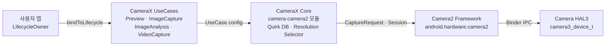

# 제24장: CameraX

## 요약

이 장에 도달할 즈음 여러분은 원시 Camera2 API를 마스터했을 것입니다. 직접 `CameraDevice` 인스턴스를 열고, `CaptureRequest.Builder` 객체를 구성하고, `CameraCaptureSession` 수명 주기를 관리하고, 세 가지 다른 콜백 유형을 조작하며, 모든 예외 케이스에서 모든 리소스를 신중하게 해제하는 법을 배웠습니다. 여러분은 훌륭하게 해냈습니다. 이제 한 걸음 물러나 자문해 봅시다. 만약 그 상용구 코드의 80%를 없앨 수 있다면 어떨까요?

CameraX는 Camera2를 수명 주기 인식(lifecycle-aware)이 가능하고, 선언적이며, 유스케이스 중심의 API로 래핑하는 구글의 Jetpack 라이브러리입니다. CameraX는 Camera2를 대체하는 것이 아니라 내부적으로 Camera2를 사용합니다. 대신 수백 줄의 세션 구성 코드, 기기별 특이사항(quirk) 처리, 수동 수명 주기 관리를 대체합니다. 이 장에서는 CameraX의 아키텍처를 배우고, `UseCase` 모델을 이해하며, `Camera2Interop`을 통해 원시 Camera2 파라미터를 CameraX에 *주입*하는 방법을 살펴봅니다. 또한 언제 CameraX를 사용하고 언제 원시 Camera2로 내려가야 하는지에 대한 결정 표를 확인하게 될 것입니다.

내 기기의 카메라 기능을 검토하고 어떤 레이어를 대상으로 할지 결정하려면, [Google Play](https://play.google.com/store/apps/details?id=com.minininja.cameraparams)에서 **Android Camera Parameters**를 설치하거나 [github.com/zoozooll/AndroidCameraParameters](https://github.com/zoozooll/AndroidCameraParameters)에서 소스 코드를 살펴보세요.

---

## CameraX 아키텍처

CameraX는 `camera-core`, `camera-camera2`, `camera-lifecycle`, `camera-view`, `camera-extensions`의 5가지 Jetpack 아티팩트로 제공됩니다. 아키텍처의 핵심은 `UseCase` 모델입니다. 서피스(Surface)와 세션(Session) 단위로 생각하는 대신, *카메라가 무엇을 하길 원하는지*에 집중합니다.

### UseCase 모델

네 가지 표준 유스케이스가 있으며, 그 중 필요한 것들을 조합하여 수명 주기에 동시에 바인딩할 수 있습니다.

| 유스케이스 | 용도 |
|------------------|----------------------------------------------------------------|
| `Preview`        | `PreviewView` 또는 `Surface`로 프레임을 스트리밍합니다. `SurfaceTexture`를 대상으로 하는 반복 요청(repeating request)을 설정하는 것과 유사합니다. |
| `ImageAnalysis`  | 백그라운드 스레드에서 분석기(analyzer)로 `ImageProxy` 프레임을 스트리밍합니다. `YUV_420_888` 형식으로 `ImageReader`를 직접 만들고 리스너를 반복 요청에 연결하는 번거로운 작업을 대체합니다. |
| `ImageCapture`   | 단일 샷 또는 연사 사진 캡처를 수행합니다. 캡처 요청, `ImageReader` 연결, 회전 및 EXIF 처리를 자동으로 수행합니다. |
| `VideoCapture`   | CameraX 1.1부터 통합되었습니다. 올바른 일시정지/재개 의미 체계와 오디오 라우팅을 갖춘 `MediaRecorder` 또는 `ParcelFileDescriptor` 파이프라인을 래핑합니다. |

네 가지를 모두 바인딩하는 것도 가능합니다. CameraX는 내부적으로 `SCALER_STREAM_CONFIGURATION_MAP`을 참조하여 스트림 조합을 확인하고 사용자를 대신해 `isSessionConfigurationSupported`를 호출합니다. 정확한 조합이 지원되지 않는 경우 더 낮은 해상도로 자동 전환합니다. 이는 가장 큰 장점 중 하나입니다. 테스트 기기 중 2019년형 중급형 삼성 폰이 `4:3 PRIV + 16:9 JPEG_MAX`를 동시에 지원하지 않는다는 사실을 알아내기 위해 3시간을 허비할 필요가 없습니다. CameraX가 알아서 처리해 줍니다.

### ProcessCameraProvider와 수명 주기 인식

바인딩 포인트는 애플리케이션 프로세스가 소유한 싱글톤인 `ProcessCameraProvider`입니다. 핵심 코드는 다음과 같습니다.

```kotlin
val cameraProviderFuture = ProcessCameraProvider.getInstance(context)
cameraProviderFuture.addListener({
    val cameraProvider = cameraProviderFuture.get()
    val camera: Camera = cameraProvider.bindToLifecycle(
        lifecycleOwner,
        cameraSelector,
        preview,
        imageCapture,
        imageAnalysis
    )
}, ContextCompat.getMainExecutor(context))
```

이게 전부입니다. 복잡한 `openCamera` 콜백도, `StateCallback`도, 세션 구성 콜백도, 리소스 해제 코드도 필요 없습니다. `lifecycleOwner`(`Fragment` 또는 `Activity`)가 `ON_STOP`에 도달하면 CameraX는 `CameraDevice`를 닫습니다. `ON_DESTROY`에서는 세션을 해제하고 모든 서피스를 릴리스합니다. 7장에서 고생하며 해결했던 리소스 누수 문제는 수명 주기 계약에 의해 발생 자체가 차단됩니다.

### CameraX는 내부적으로 Camera2를 래핑합니다

내부적으로 CameraX는 Camera2입니다. `camera-camera2` 아티팩트에는 `Camera2Camera`, `Camera2CameraCaptureResult`, `Camera2RequestProcessor`가 포함되어 있으며, 이들은 여러분의 고수준 UseCase 선언을 앞선 23개 장에서 직접 작성했던 `CameraManager.openCamera`, `createCaptureSession`, `setRepeatingRequest` 호출로 정확히 변환합니다. 제조사별 예외 처리는 라이브러리 내부의 기기별 XML 파일인 그 유명한 "CameraX 특이사항 데이터베이스(quirk database)"에 인코딩되어 있습니다.

전체 아키텍처는 다음과 같습니다.



왼쪽에서 오른쪽으로 흐름을 따라가 보세요. 앱은 무엇(유스케이스)을 원하는지 선언하고, CameraX는 어떻게(서피스 크기, 세션 구성, 특이사항) 얻을지 결정한 다음, 여러분이 직접 작성했을 것과 동일한 Camera2 호출을 실행합니다. 여기서 핵심 가치는 중간의 두 상자입니다. 구글이 작성한 수십만 줄의 기기 호환성 코드를 여러분이 직접 작성할 필요가 없다는 점입니다.

---

## Camera2Interop: CameraX에 Camera2 파라미터 주입하기

CameraX는 일반적인 사례의 80%를 훌륭하게 처리합니다. 하지만 여러분은 Camera2 마스터입니다. 여러분은 `CONTROL_AE_MODE_OFF`가 무엇을 의미하는지 알고, `SENSOR_SENSITIVITY`와 `CONTROL_AE_EXPOSURE_COMPENSATION`의 차이도 압니다. 제품 사양에 "CameraX를 사용하더라도 사용자가 ISO를 400으로, 노출을 1/60초로 고정할 수 있게 하라"는 내용이 있다면, 기능을 원시 Camera2로 처음부터 다시 짤 필요가 없습니다. 대신 `Camera2Interop`을 사용하면 됩니다.

### Extender 패턴

모든 `UseCase.Builder`에는 일치하는 `Camera2Interop.Extender`가 있습니다. `build()`를 호출하기 *전*에 이를 호출하여 세션 수준 또는 요청별 수준에서 원시 Camera2 키를 주입할 수 있습니다.

| 메서드 | Camera2 대응 항목 |
|------------------------------------------------|----------------------------------------------|
| `extender.setCaptureRequestOption(key, value)` | `CaptureRequest.Builder.set(key, value)`     |
| `extender.setSessionOption(key, value)`        | 세션 초기화 파라미터 (자주 사용되지 않음) |

Extender는 추가적인 방식입니다. 여러분이 재정의하지 않은 모든 키에 대해 CameraX는 여전히 자체 기본값을 설정합니다. `SENSOR_SENSITIVITY`만 설정하더라도 CameraX는 AF, AWB, 회전 및 메타데이터를 여전히 처리해 줍니다.

### 실전 예제: CameraX에서 수동 ISO 및 노출 설정

다음은 카메라를 수동 AE로 고정하고 ISO 400, 노출 시간 1/60초로 설정한 후 사진을 찍는 완전한 `ImageCapture` 빌더 예제입니다.

```kotlin
val iso = 400
val exposureTimeNanos = 1_000_000_000L / 60 // 1/60 초

val imageCapture = ImageCapture.Builder()
    .setTargetResolution(Size(4032, 3024))
    .setCaptureMode(ImageCapture.CAPTURE_MODE_MAXIMIZE_QUALITY)
    .apply {
        val interop = Camera2Interop.Extender(this)
        interop.setCaptureRequestOption(
            CaptureRequest.CONTROL_AE_MODE,
            CaptureRequest.CONTROL_AE_MODE_OFF
        )
        interop.setCaptureRequestOption(
            CaptureRequest.CONTROL_AE_LOCK,
            false
        )
        interop.setCaptureRequestOption(
            CaptureRequest.SENSOR_SENSITIVITY,
            iso
        )
        interop.setCaptureRequestOption(
            CaptureRequest.SENSOR_EXPOSURE_TIME,
            exposureTimeNanos
        )
        interop.setCaptureRequestOption(
            CaptureRequest.CONTROL_MODE,
            CaptureRequest.CONTROL_MODE_OFF
        )
    }
    .build()

cameraProvider.bindToLifecycle(
    viewLifecycleOwner,
    CameraSelector.DEFAULT_BACK_CAMERA,
    preview,
    imageCapture
)

// 나중에 촬영 트리거:
imageCapture.takePicture(
    ContextCompat.getMainExecutor(context),
    object : ImageCapture.OnImageCapturedCallback() {
        override fun onCaptureSuccess(imageProxy: ImageProxy) {
            // imageProxy에 수동 노출된 프레임이 포함됨
            imageProxy.close()
        }

        override fun onError(exception: ImageCaptureException) {
            Log.e(TAG, "캡처 실패: ${exception.imageCaptureError}", exception)
        }
    }
)
```

**중요 주의사항:** `CONTROL_MODE_OFF`를 설정하면 *모든* 3A 기능이 비활성화됩니다. 노출만 고정하고 AF와 AWB는 계속 실행하고 싶다면 `CONTROL_AE_MODE_OFF`(또는 `CONTROL_AE_LOCK = true`)만 설정하고 `CONTROL_MODE`는 기본값(`CONTROL_MODE_AUTO`)으로 두세요. CameraX는 여러분이 건드리지 않은 모든 키를 기본값으로 유지합니다.

수동 반복 스트림을 위해 `Preview.Builder`와 `ImageAnalysis.Builder`에서도 동일한 작업을 수행할 수 있습니다. Extender는 해당 UseCase의 수명 동안 발행되는 모든 반복 요청 또는 단일 요청에 적용됩니다.

### Camera2 결과 다시 읽어오기

반대 방향으로, CameraX 콜백에서 `TotalCaptureResult`를 추출하는 작업도 `Camera2CameraCaptureResult`를 통해 매우 간단합니다.

```kotlin
imageCapture.takePicture(
    executor,
    object : ImageCapture.OnImageCapturedCallback() {
        override fun onCaptureSuccess(imageProxy: ImageProxy) {
            val camera2Result = imageProxy.imageInfo
                .cameraCaptureResult as? Camera2CameraCaptureResult
            val totalResult: TotalCaptureResult? = camera2Result?.captureResult
            val actualIso = totalResult?.get(CaptureResult.SENSOR_SENSITIVITY)
            Log.d(TAG, "센서의 실제 ISO: $actualIso")
            imageProxy.close()
        }
    }
)
```

이를 통해 여러분이 주입한 파라미터가 실제로 센서에 전달되었는지 확인할 수 있습니다. **Android Camera Parameters**를 사용하여 기기가 보고하는 `SENSOR_INFO_SENSITIVITY_RANGE`를 교차 확인하세요. 주입한 ISO가 해당 범위를 벗어나면 CameraX(또는 HAL)가 자동으로 값을 제한하며, 결과를 다시 읽어보는 것만이 이를 알 수 있는 유일한 방법입니다.

---

## CameraX 대 Camera2 선택하기

가장 어려운 아키텍처 질문은 "CameraX를 어떻게 사용하는가?"가 아니라 "CameraX를 사용해야 하는가?"입니다. 실제 현장 경험을 바탕으로 정리한 결정 프레임워크는 다음과 같습니다.

### 결정 순서도

```mermaid
flowchart TD
    A["시작"] --> B{RAW 캡처, ZSL 재처리,<br/>물리적 멀티 카메라 스트림,<br/>60fps 초과 고속 촬영이 필요한가?}
    B -->|예| D[원시 Camera2 사용]
    B -->|아니요| C{물리적 카메라별 프레임당<br/>CaptureRequest 템플릿 제어,<br/>커스텀 세션 구성(입력 재처리 서피스),<br/>또는 오프라인 세션이 필요한가?}
    C -->|예| D
    C -->|아니요| E{단순 미리보기 + 사진<br/>+ 비디오 + 분석 기능과<br/>폭넓은 기기 호환성이 필요한가?}
    E -->|예| F[CameraX 사용]
    E -->|아니요| G{CameraX 특이사항 DB가<br/>대상 기기들을 커버하는가?<br/>Android Camera Parameters로 확인}
    G -->|예| F
    G -->|아니요| D
```

### 결정 표

| 시나리오 | CameraX | 원시 Camera2 |
|-----------------------------------------------------------------------|:-------:|:-----------:|
| 인스타그램 스타일의 미리보기 + 원터치 사진 + 비디오 |    ✅    |      ⛔      |
| 프레임 커스텀이 필요 없는 QR 코드 / 바코드 / ML Kit 얼굴 감지 |    ✅    |      ⛔      |
| ISO와 셔터가 고정된 수동 노출 (Camera2Interop으로 가능) |    ✅    |      ⚠️       |
| OEM 알고리즘을 재정의하는 커스텀 3A 상태 머신 |    ⛔    |      ✅      |
| `RAW_SENSOR` / `RAW_PRIVATE` / DNG 전문가용 사진 촬영 |    ⛔    |      ✅      |
| 재처리 입력 서피스를 이용한 제로 셔터 랙 (23장) |    ⛔    |      ✅      |
| 논리적 멀티 카메라 물리적 스트림 액세스 (20장) |    ⛔    |      ✅      |
| 제한된 고속 세션을 이용한 120/240fps 고속 촬영 |    ⛔    |      ✅      |
| OEM 익스텐션을 통한 카메라 익스텐션 (야간 / 보케 / HDR) |    ✅    |      ✅      |
| 조기 부팅 EVS 마이그레이션이 포함된 자동차 후방 카메라 |    ⛔    |      ✅ (NDK)  |
| 기기 간 호환성이 가장 중요한 비기능적 요구 사항인 경우 |    ✅    |      ⚠️       |

중간 지대(⚠️)는 판단이 필요한 영역입니다. `Camera2Interop`을 통한 수동 노출 제어는 `HARDWARE_LEVEL_FULL` 기기에서는 안정적으로 작동하지만, `LEGACY` 기기에서는 `LEGACY` HAL이 `CONTROL_MODE_OFF`를 완전히 무시하기 때문에 조용히 실패합니다. 테스트 플릿에서 **Android Camera Parameters**를 실행하여 각 기기의 `INFO_SUPPORTED_HARDWARE_LEVEL`을 확인하세요. 플릿의 20%가 `LEGACY`라면 원시 Camera2와 폴백 경로를 사용하거나, 해당 기기에서 수동 제어가 작동하지 않는 것을 수용해야 합니다.

### 기본 CameraX 미리보기 + 사진 캡처 설정 (전체)

참고용으로, 6-9장에서 작성했던 원시 Camera2 코드 약 300줄을 대체하는 최소한의 전체 설정 코드를 제공합니다.

```kotlin
class CameraXFragment : Fragment() {

    private lateinit var viewBinding: FragmentCameraXBinding
    private lateinit var imageCapture: ImageCapture

    override fun onViewCreated(view: View, savedInstanceState: Bundle?) {
        super.onViewCreated(view, savedInstanceState)
        viewBinding = FragmentCameraXBinding.bind(view)

        val cameraProviderFuture = ProcessCameraProvider.getInstance(requireContext())
        cameraProviderFuture.addListener({
            val cameraProvider = cameraProviderFuture.get()
            bindCameraUseCases(cameraProvider)
        }, ContextCompat.getMainExecutor(requireContext()))
    }

    private fun bindCameraUseCases(cameraProvider: ProcessCameraProvider) {
        val preview = Preview.Builder().build().also {
            it.setSurfaceProvider(viewBinding.previewView.surfaceProvider)
        }

        imageCapture = ImageCapture.Builder()
            .setCaptureMode(ImageCapture.CAPTURE_MODE_MINIMIZE_LATENCY)
            .setTargetRotation(viewBinding.previewView.display.rotation)
            .build()

        val cameraSelector = CameraSelector.Builder()
            .requireLensFacing(CameraSelector.LENS_FACING_BACK)
            .build()

        cameraProvider.unbindAll()
        try {
            cameraProvider.bindToLifecycle(
                viewLifecycleOwner,
                cameraSelector,
                preview,
                imageCapture
            )
        } catch (exc: Exception) {
            Log.e(TAG, "유스케이스 바인딩 실패", exc)
        }
    }

    private fun takePhoto() {
        val photoFile = File(
            outputDirectory,
            "PHOTO_${System.currentTimeMillis()}.jpg"
        )
        val outputOptions = ImageCapture.OutputFileOptions
            .Builder(photoFile)
            .build()

        imageCapture.takePicture(
            outputOptions,
            ContextCompat.getMainExecutor(requireContext()),
            object : ImageCapture.OnImageSavedCallback {
                override fun onImageSaved(output: ImageCapture.OutputFileResults) {
                    val savedUri = Uri.fromFile(photoFile)
                    Toast.makeText(requireContext(),
                        "저장됨: $savedUri", Toast.LENGTH_SHORT).show()
                }
                override fun onError(exc: ImageCaptureException) {
                    Log.e(TAG, "사진 캡처 실패: ${exc.message}", exc)
                }
            }
        )
    }

    companion object {
        private const val TAG = "CameraXFragment"
    }
}
```

이것이 미리보기 + 사진 파이프라인의 전체 코드입니다. `HandlerThread`, `CameraDevice.StateCallback`, `CameraCaptureSession.StateCallback`, `ImageReader.OnImageAvailableListener` 또는 수동 `close()` 호출이 전혀 없음에 주목하세요. CameraX가 이 모든 것을 처리합니다.

---

## 요약

CameraX는 구글의 교차 기기 특이사항 데이터베이스를 바탕으로 수명 주기를 인식하고 유스케이스 중심의 외관을 갖춘 Camera2입니다. 아키텍처는 '앱 → UseCases → CameraX Core → Camera2 → HAL'로 쌓여 있으며, `ProcessCameraProvider.bindToLifecycle()` 호출 하나가 수백 줄의 수동 설정을 대체합니다. CameraX가 UseCase 수준에서 노출하지 않는 나머지 20%의 파라미터는 `Camera2Interop.Extender`를 사용하여 원시 `CaptureRequest` 키를 주입하고 `TotalCaptureResult` 값을 다시 읽어올 수 있습니다. 사용 여부 결정은 명확합니다. RAW, ZSL, 물리적 멀티 카메라 스트림, 고속 비디오 또는 CameraX가 표현할 수 없는 커스텀 세션 토폴로지가 필요한 기능이 아니라면 CameraX를 기본으로 사용하세요.

## 다음 단계

CameraX는 여전히 바인더 경계 위의 Java/Kotlin Dalvik/ART 코드입니다. 만약 그 오버헤드조차 AR 엔진의 16ms 프레임 예산에 너무 과하다면 어떨까요? 25장에서는 JNI 선을 완전히 넘어 NDK의 네이티브 카메라 스택을 사용하여 C++에서 직접 카메라를 열고, 복사 없이 프레임을 Vulkan 텍스처로 바인딩하는 방법을 살펴봅니다.
