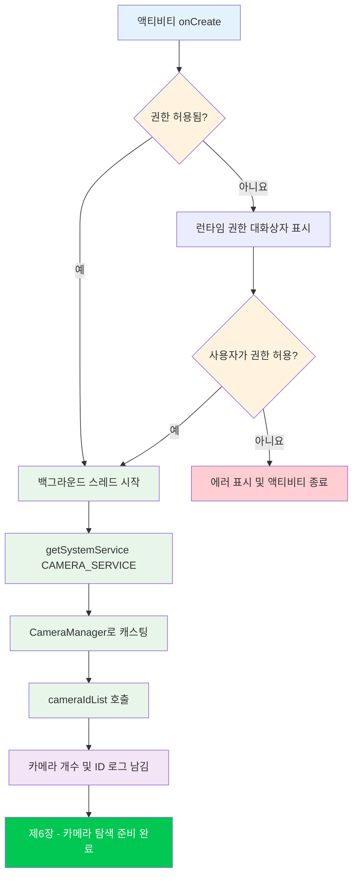

Camera2 튜토리얼 시리즈의 실습 부분에 오신 것을 환영합니다. 이전 장에서는 스마트폰 카메라 하드웨어와 Camera2 API의 이론적 토대에 대해 배웠습니다. 이제 소매를 걷어붙이고 실제 코드를 작성할 시간입니다. 이 장을 마치면 Camera2 API를 성공적으로 초기화하고 카메라 나열, 장치 열기 또는 미리보기 표시 전의 중요한 첫 단계인 `CameraManager` 서비스에 액세스하는 작동하는 안드로이드 프로젝트를 갖게 될 것입니다.

이 시리즈에서 구축할 모든 기능의 완성된 예제를 보고 싶다면, [GitHub](https://github.com/zoozooll/AndroidCameraParameters)와 [Google Play](https://play.google.com/store/apps/details?id=com.minininja.cameraparams)에서 **Android Camera Parameters** 앱을 확인해 보세요. 이 앱은 전체 `CameraCharacteristics` 나열, 수동 캡처 제어, 멀티 카메라 지원 등 고급 Camera2 사용법을 보여줍니다.

## 왜 프로젝트 설정부터 시작하나요?

Camera2 코드를 단 한 줄이라도 쓰기 전에 애플리케이션이 올바르게 구성되어야 합니다. Camera2는 성능에 민감한 로우 레벨 API이며, 설정을 대충 하면 원인 모를 충돌, ANR(Application Not Responding) 또는 프레임이 전달되지 않는 문제가 발생합니다. 올바른 Camera2 프로젝트 설정의 세 가지 기둥은 다음과 같습니다.

1. **권한(Permissions)** — 안드로이드 프레임워크는 설치 시점(Manifest)과 런타임(사용자 동의) 모두에서 카메라 액세스를 제한합니다.
2. **스레딩 아키텍처** — Camera2 콜백은 절대 메인 스레드를 차단해서는 안 됩니다. 전용 백그라운드 스레드가 필요합니다.
3. **뷰 구성(View Configuration)** — 미리보기에 `TextureView`를 사용할 계획이라면(권장 방식), 하드웨어 가속이 활성화되어야 합니다.

각 항목을 체계적으로 다뤄보겠습니다.

## 1단계: 새 안드로이드 스튜디오 프로젝트 생성

안드로이드 스튜디오를 실행하고 새 프로젝트를 만듭니다. 이 튜토리얼 시리즈에서는 다음을 권장합니다.

- **Template**: Empty Activity (가장 간단한 시작점)
- **Language**: Kotlin (현대 안드로이드 개발의 표준. 이 시리즈의 모든 예제는 Kotlin으로 작성되었습니다.)
- **Minimum SDK**: API 21 (Lollipop) — Camera2를 기본적으로 지원하는 최초의 SDK 레벨입니다. OTG를 통한 외부 USB 카메라를 지원해야 한다면 API 23 이상을 대상으로 하세요. 사진 저장(9장)을 위해 범위 지정 저장소(Scoped Storage) 지원이 필요하다면 API 29+가 관련이 있지만, 하위 호환성은 거기서 처리하겠습니다.
- **Build configuration language**: Kotlin DSL 또는 Groovy — 어느 쪽이든 작동합니다. 예제는 빌드 시스템과 무관하게 구성됩니다.

프로젝트가 생성되면 모듈 레벨의 `build.gradle` (또는 `build.gradle.kts`) 파일을 엽니다. 기본 Empty Activity 템플릿에는 필요한 대부분의 종속성이 포함되어 있지만, 최소한 다음 항목이 있는지 확인하세요.

```kotlin
dependencies {
    implementation("androidx.core:core-ktx:1.12.0")
    implementation("androidx.appcompat:appcompat:1.6.1")
    implementation("com.google.android.material:material:1.11.0")
    implementation("androidx.constraintlayout:constraintlayout:2.1.4")
    // Camera2는 안드로이드 프레임워크의 일부이므로 기본 API를 위해
    // 별도의 외부 종속성이 필요하지 않습니다.
    // androidx.camera.camera2는 CameraX와의 상호 운용성을 위한 것입니다.
}
```

:::tip
별도의 외부 Camera2 종속성을 추가할 필요가 **없습니다**. 전체 `android.hardware.camera2` 패키지는 안드로이드 프레임워크의 일부입니다. Jetpack CameraX 라이브러리는 Camera2 위에 구축된 별도의 고수준 추상화 계층입니다. 이 튜토리얼에서는 **네이티브 Camera2 API를 직접** 사용합니다.
:::

## 2단계: AndroidManifest.xml에 권한 선언

모든 카메라 애플리케이션은 `AndroidManifest.xml`에 `CAMERA` 권한을 선언해야 합니다. 이는 구글 플레이 스토어에 앱이 카메라 하드웨어를 사용함을 알리고, 안드로이드 6.0(API 23) 이상에서 런타임 권한 대화상자를 활성화합니다.

`app/src/main/AndroidManifest.xml`을 열고 다음 요소들을 **루트 `<manifest>` 태그의 자식으로** ( `<application>` 안이 아님) 추가합니다.

```xml
<?xml version="1.0" encoding="utf-8"?>
<manifest xmlns:android="http://schemas.android.com/apk/res/android"
    xmlns:tools="http://schemas.android.com/tools">

    <!-- ✅ 카메라 권한 선언 -->
    <uses-permission android:name="android.permission.CAMERA" />

    <!-- 선택적 기능 선언 (구글 플레이 필터링에 사용됨) -->
    <uses-feature
        android:name="android.hardware.camera"
        android:required="true" />
    <uses-feature
        android:name="android.hardware.camera.autofocus"
        android:required="false" />

    <application
        android:allowBackup="true"
        ...>
        <activity
            android:name=".MainActivity"
            android:exported="true"
            android:hardwareAccelerated="true">
            ...
        </activity>
    </application>
</manifest>
```

중요한 부분들을 살펴보겠습니다.

### `<uses-permission android:name="android.permission.CAMERA" />`

핵심 권한입니다. 이것 없이는 카메라 서비스에 대한 모든 호출이 `SecurityException`을 발생시킵니다. API 22 이하에서는 사용자가 설치 시점에 이를 수락하며, API 23 이상에서는 런타임에 별도로 요청해야 합니다(다음에 설명).

### `<uses-feature android:name="android.hardware.camera" android:required="true" />`

이 선언은 구글 플레이가 카메라가 하나 이상 있는 기기에만 앱이 표시되도록 필터링하게 합니다. 카메라 없이도 앱이 작동할 수 있다면(예: 캡처 기능이 선택 사항인 갤러리 앱) `android:required="false"`로 설정하세요. 이를 선언하지 않으면 구글 플레이는 카메라가 **필요하지 않다**고 가정하며, 카메라가 없는 기기에도 앱이 설치될 수 있습니다.

### `<activity>`의 `android:hardwareAccelerated="true"`

이는 `TextureView` 미리보기 렌더링에 **매우 중요**합니다. `TextureView`는 카메라 프레임을 효율적으로 표시하기 위해 GPU 합성 파이프라인을 사용합니다. 액티비티나 애플리케이션 레벨에서 하드웨어 가속이 활성화되지 않으면 `TextureView` 렌더링이 조용히 실패하거나 검은색 화면이 나타납니다. 현대 안드로이드에서 기본값은 전체 애플리케이션에 대해 `true`이지만, `TextureView`를 호스팅하는 모든 액티비티에 명시적으로 선언하는 것이 좋습니다.

## 3단계: 런타임 권한 요청

안드로이드 6.0(Marshmallow, API 23) 이상에서는 매니페스트에 권한을 선언하는 것만으로는 충분하지 않습니다. Activity Compat 라이브러리를 사용하여 런타임에 사용자에게 **명시적으로 권한을 요청**해야 합니다. 표준 패턴은 다음과 같습니다.

1. `ContextCompat.checkSelfPermission`으로 권한이 이미 부여되었는지 확인합니다.
2. 부여되었다면 카메라 초기화를 진행합니다.
3. 부여되지 않았다면 `ActivityCompat.requestPermissions`를 호출하여 시스템 대화상자를 표시합니다.
4. `onRequestPermissionsResult`에서 결과를 처리합니다.

`MainActivity.kt`에서의 전체 권한 흐름은 다음과 같습니다.

```kotlin
package com.example.camera2tutorial

import android.Manifest
import android.content.pm.PackageManager
import android.os.Bundle
import android.widget.Toast
import androidx.appcompat.app.AppCompatActivity
import androidx.core.app.ActivityCompat
import androidx.core.content.ContextCompat

class MainActivity : AppCompatActivity() {

    override fun onCreate(savedInstanceState: Bundle?) {
        super.onCreate(savedInstanceState)
        setContentView(R.layout.activity_main)

        if (allPermissionsGranted()) {
            initializeCamera()
        } else {
            ActivityCompat.requestPermissions(
                this,
                REQUIRED_PERMISSIONS,
                REQUEST_CODE_PERMISSIONS
            )
        }
    }

    private fun allPermissionsGranted() = REQUIRED_PERMISSIONS.all {
        ContextCompat.checkSelfPermission(baseContext, it) == PackageManager.PERMISSION_GRANTED
    }

    override fun onRequestPermissionsResult(
        requestCode: Int,
        permissions: Array<out String>,
        grantResults: IntArray
    ) {
        super.onRequestPermissionsResult(requestCode, permissions, grantResults)
        if (requestCode == REQUEST_CODE_PERMISSIONS) {
            if (allPermissionsGranted()) {
                initializeCamera()
            } else {
                Toast.makeText(
                    this,
                    "앱을 사용하려면 카메라 권한이 필요합니다.",
                    Toast.LENGTH_LONG
                ).show()
                finish()
            }
        }
    }

    private fun initializeCamera() {
        // TODO: 아래 섹션에서 이 메서드를 구현할 것입니다.
        // 여기서 CameraManager 설정이 이루어집니다.
        // 지금은 성공 로그만 남깁니다.
        android.util.Log.d(TAG, "권한 허용됨. 카메라 초기화 준비 완료.")
    }

    companion object {
        private const val TAG = "Camera2Tutorial"
        private const val REQUEST_CODE_PERMISSIONS = 10
        private val REQUIRED_PERMISSIONS = arrayOf(Manifest.permission.CAMERA)
    }
}
```

### 왜 `allPermissionsGranted()`가 배열 패턴을 사용하나요?

지금은 `CAMERA` 권한만 필요하지만, `REQUIRED_PERMISSIONS` 배열을 정의해두면 나중에 다른 권한(레거시 사진 저장을 위한 `WRITE_EXTERNAL_STORAGE`나 비디오를 위한 `RECORD_AUDIO` 등)을 추가하기가 매우 쉽습니다. `all { ... }` 함수는 진행하기 전에 배열의 **모든** 권한이 부여되었는지 확인합니다.

## 4단계: 백그라운드 스레드 (HandlerThread)

초보자용 Camera2 코드에서 가장 흔히 빠뜨리는 디테일이며, 이로 인해 **랜덤하고 재현하기 어려운 버그**가 발생합니다. 왜 Camera2에 백그라운드 스레드가 필요한지 이해하고 올바르게 구현해 봅시다.

### 왜 Camera2는 메인 스레드에서 실행되면 안 되나요?

안드로이드 메인(UI) 스레드는 다음을 책임집니다.
- 60-120 FPS로 UI 그리기
- 사용자 터치 이벤트 처리
- 수명 주기 콜백 디스패치
- 기본적으로 모든 액티비티/프래그먼트 코드 실행

Camera2 API는 몇 가지 중요한 콜백을 동기적으로 전달합니다.
- `CameraDevice.StateCallback` — 카메라가 열리거나, 끊기거나, 에러가 발생할 때
- `CameraCaptureSession.StateCallback` — 캡처 세션이 구성될 때
- `CameraCaptureSession.CaptureCallback` — 매 프레임마다 (초당 60회 이상!)

이러한 콜백이 메인 스레드에서 실행되면 두 가지 치명적인 일이 발생합니다.

1. **버벅임과 프레임 드롭**: 콜백 처리에 10ms만 걸려도 60FPS 프레임 하나를 건너뛰게 되어 사용자는 화면이 끊기는 것을 보게 됩니다.
2. **데드락(Deadlock)과 ANR**: `close()`와 같은 일부 Camera2 메서드는 동기식이며 콜백을 기다립니다. 만약 콜백이 `close()`를 호출한 바로 그 스레드에서 실행되어야 한다면 데드락이 발생합니다.

해결책은 `HandlerThread`를 통해 구현된 **전용 백그라운드 스레드**와 루퍼(Looper)를 사용하는 것입니다.

### HandlerThread 올바르게 구현하기

백그라운드 스레드의 수명 주기는 카메라 작업의 수명 주기와 일치해야 합니다. 액티비티가 시작/재개될 때 스레드를 시작하고, 액티비티가 중지/일시 정지될 때 스레드를 종료합니다.

```kotlin
package com.example.camera2tutorial

import android.Manifest
import android.content.Context
import android.content.pm.PackageManager
import android.hardware.camera2.CameraManager
import android.os.Bundle
import android.os.Handler
import android.os.HandlerThread
import android.util.Log
import android.widget.Toast
import androidx.appcompat.app.AppCompatActivity
import androidx.core.app.ActivityCompat
import androidx.core.content.ContextCompat

class MainActivity : AppCompatActivity() {

    // --- 백그라운드 스레딩 컴포넌트 ---
    private lateinit var backgroundThread: HandlerThread
    private lateinit var backgroundHandler: Handler

    override fun onCreate(savedInstanceState: Bundle?) {
        super.onCreate(savedInstanceState)
        setContentView(R.layout.activity_main)

        if (allPermissionsGranted()) {
            initializeCamera()
        } else {
            ActivityCompat.requestPermissions(
                this,
                REQUIRED_PERMISSIONS,
                REQUEST_CODE_PERMISSIONS
            )
        }
    }

    override fun onResume() {
        super.onResume()
        startBackgroundThread()
        // 앱이 백그라운드에 있는 동안 권한이 부여된 경우 재초기화
        if (allPermissionsGranted() && this::cameraManager.isInitialized) {
            // (cameraManager는 아래에 선언됨)
        }
    }

    override fun onPause() {
        stopBackgroundThread()
        super.onPause()
    }

    private fun startBackgroundThread() {
        backgroundThread = HandlerThread("Camera2Background").apply {
            start()
        }
        backgroundHandler = Handler(backgroundThread.looper)
        Log.d(TAG, "백그라운드 스레드 시작됨: ${backgroundThread.name}")
    }

    private fun stopBackgroundThread() {
        backgroundThread.quitSafely()
        try {
            backgroundThread.join(1000) // 정리를 위해 최대 1초 대기
            Log.d(TAG, "백그라운드 스레드 정상 종료됨")
        } catch (e: InterruptedException) {
            Log.e(TAG, "백그라운드 스레드 조인 중 중단됨", e)
        }
    }

    // --- CameraManager 초기화 ---
    private lateinit var cameraManager: CameraManager

    private fun initializeCamera() {
        cameraManager = getSystemService(Context.CAMERA_SERVICE) as CameraManager

        val cameraIdList = cameraManager.cameraIdList
        Log.d(TAG, "CameraManager 액세스 성공. ${cameraIdList.size}개의 카메라 발견.")
        cameraIdList.forEachIndexed { index, cameraId ->
            Log.d(TAG, "카메라 $index: ID = $cameraId")
        }

        Toast.makeText(
            this,
            "CameraManager 초기화됨! ${cameraIdList.size}개의 카메라 발견.",
            Toast.LENGTH_LONG
        ).show()
    }

    // --- 권한 처리 (이전과 동일) ---
    private fun allPermissionsGranted() = REQUIRED_PERMISSIONS.all {
        ContextCompat.checkSelfPermission(baseContext, it) == PackageManager.PERMISSION_GRANTED
    }

    override fun onRequestPermissionsResult(
        requestCode: Int,
        permissions: Array<out String>,
        grantResults: IntArray
    ) {
        super.onRequestPermissionsResult(requestCode, permissions, grantResults)
        if (requestCode == REQUEST_CODE_PERMISSIONS) {
            if (allPermissionsGranted()) {
                initializeCamera()
            } else {
                Toast.makeText(
                    this,
                    "앱을 사용하려면 카메라 권한이 필요합니다.",
                    Toast.LENGTH_LONG
                ).show()
                finish()
            }
        }
    }

    companion object {
        private const val TAG = "Camera2Tutorial"
        private const val REQUEST_CODE_PERMISSIONS = 10
        private val REQUIRED_PERMISSIONS = arrayOf(Manifest.permission.CAMERA)
    }
}
```

### 주요 스레딩 패턴 설명

1. **`onResume()`에서 `startBackgroundThread()`**: 액티비티가 포그라운드로 올 때마다 새로운 `HandlerThread`를 만들고 시작하며, 스레드의 `Looper`에 바인딩된 `Handler`를 생성합니다. 이 핸들러는 모든 Camera2 콜백 수용 메서드(`openCamera`, `createCaptureSession` 등)에 전달됩니다.

2. **`onPause()`에서 `stopBackgroundThread()`**: 액티비티가 백그라운드로 가기 전에 스레드에 `quitSafely()`를 호출합니다. 이는 루퍼에게 현재 메시지가 끝난 후 새로운 메시지 처리를 중단하라고 지시합니다(보류 중인 메시지를 버리는 `quit()`와 다름). 그 후 `join(1000)`을 호출하여 백그라운드 스레드가 정리를 마치는 동안 최대 1초 동안 메인 스레드를 차단합니다. 이는 리소스 누수를 방지합니다.

3. **왜 `CoroutineDispatcher` 대신 `HandlerThread`인가요?** Camera2는 코틀린 코루틴보다 수년 앞서 나왔으며, 콜백 시스템이 기본적으로 핸들러/루퍼 기반입니다. `Dispatchers.Default.asExecutor()`를 사용하거나 고수준 코드에서 콜백을 `suspendCoroutine`으로 래핑할 수는 있지만, 기본 Camera2 API는 여전히 콜백을 위한 루퍼 스레드가 필요합니다. `HandlerThread`를 직접 사용하는 것이 공식 안드로이드 샘플에서 권장하는 표준 방식입니다.

## 5단계: 전체 초기화 흐름 (통합)

이제 애플리케이션이 시작될 때 일어나야 하는 전체 이벤트 시퀀스를 살펴봅시다. 순서가 중요합니다: 권한 → 스레드 → CameraManager. 순서를 바꾸면 코드가 충돌하거나 일관성 없게 동작할 수 있습니다.



위의 순서도는 각 단계가 존재하는 이유를 보여줍니다.

- **권한 관문(Permission Gate)**: 전체 카메라 하위 시스템이 보호되어 있습니다. 사용자가 동의할 때까지 진행할 수 없습니다.
- **CameraManager 전의 스레드**: `getSystemService()` 자체는 스레드 세이프하지만, 다음 장부터 시작되는 콜백 중심의 Camera2 작업을 수행하기 전에 백그라운드 스레드가 이미 실행 중이기를 원합니다.
- **CameraManager → cameraIdList**: `cameraIdList`를 호출하는 것은 `CameraManager`가 작동하는지 확인하는 가장 저렴한 방법입니다. 이 호출이 예외 없이 성공하면 매니페스트 선언, 런타임 권한 및 서비스 바인딩이 모두 올바른 것입니다.

## 종합하기: 실행 및 확인

이 시점에서 여러분은 다음을 수행하는 완전하고 실행 가능한 Camera2 프로젝트를 갖게 되었습니다.
1. 올바른 SDK 타겟으로 안드로이드 프로젝트를 생성했습니다.
2. 매니페스트에 CAMERA 권한을 선언했습니다.
3. 런타임에 권한을 요청하고 승인 및 거부 경로를 모두 처리했습니다.
4. `onResume`에서 전용 `HandlerThread`를 시작하고 `onPause`에서 깨끗하게 중지합니다.
5. `CAMERA_SERVICE` 시스템 서비스를 가져와 `CameraManager`로 캐스팅했습니다.
6. `cameraIdList`를 호출하고 카메라 개수와 ID를 로그에 기록했습니다.

### 실행했을 때 보여야 할 모습

1. 첫 실행 시 안드로이드가 권한 대화상자를 표시합니다: *"Camera2Tutorial에서 사진을 찍고 동영상을 녹화하도록 허용하시겠습니까?"*
2. **허용**을 누릅니다.
3. 토스트 메시지가 나타납니다: *"CameraManager 초기화됨! X개의 카메라 발견."*
4. Logcat(`Camera2Tutorial`로 필터링)에서 다음과 같은 항목을 볼 수 있어야 합니다.
   ```
   D/Camera2Tutorial: 백그라운드 스레드 시작됨: Camera2Background
   D/Camera2Tutorial: CameraManager 액세스 성공. 4개의 카메라 발견.
   D/Camera2Tutorial: 카메라 0: ID = 0
   D/Camera2Tutorial: 카메라 1: ID = 1
   D/Camera2Tutorial: 카메라 2: ID = 2
   D/Camera2Tutorial: 카메라 3: ID = 3
   ```
5. 홈 버튼을 누르거나 다른 앱으로 이동하면 Logcat에 다음이 표시됩니다.
   ```
   D/Camera2Tutorial: 백그라운드 스레드 정상 종료됨
   ```

이 로그들이 보인다면 **축하합니다**! Camera2 애플리케이션의 토대를 성공적으로 구축하셨습니다. 아직 카메라 미리보기는 없지만(8장에서 다룸), 배관 작업은 올바르게 되었습니다. `SecurityException`이 발생한다면 권한 대화상자를 수락했는지 다시 확인하세요. `cameraIdList`가 빈 배열을 반환한다면 기기에 카메라가 없거나(폰에서는 희박함) 권한이 거부된 것입니다.

## 흔한 설정 에러 해결 방법

### `SecurityException: Lacking privileges to access camera service`

런타임 권한이 부여되지 않았음을 의미합니다. 다음을 확인하세요.
- 매니페스트에 `<uses-permission android:name="android.permission.CAMERA" />`를 추가했는지.
- 올바른 요청 코드로 `ActivityCompat.requestPermissions`를 호출했는지.
- 사용자가 대화상자에서 **허용**을 눌렀는지.
- 실제 기기에서 테스트 중이라면 설정 → 앱 → 해당 앱 → 권한에서 카메라가 활성화되어 있는지.

### `backgroundHandler`에 대한 `NullPointerException`

`startBackgroundThread()`가 실행되기 전에 `backgroundHandler`를 사용하려고 하면 발생합니다. 핸들러를 허용하는 모든 Camera2 작업이 **반드시** `onResume`이 호출되고 스레드가 실행 중인 후에만 실행되도록 하세요. 코드에서 `initializeCamera()`는 `onCreate`에서 호출되지만 `CameraManager`를 동기적으로만 사용합니다. 핸들러가 필요한 콜백은 이후 장에서 추가될 것이며 `onResume`에서 적절히 게이트될 것입니다.

### 나중 장에서 `TextureView`가 검은색 화면을 보여줌

나중에 `TextureView`를 추가할 때 매니페스트의 액티비티에 `android:hardwareAccelerated="true"`가 설정되어 있는지 확인하세요. 또한 `TextureView`가 뷰 계층 구조에 연결되어 있고 레이아웃 XML에서 표시되는지도 확인해야 합니다.

## 요약

이 장에서는 안드로이드 Camera2 애플리케이션의 완전한 스캐폴딩을 구축했습니다. 다음 내용을 배웠습니다.

1. **프로젝트 구조**: Empty Activity 템플릿으로 새 프로젝트를 만들고, API 21+를 타겟팅하며, 코틀린을 사용하고, 별도의 외부 Camera2 종속성이 필요하지 않음을 확인했습니다.
2. **매니페스트 구성**: CAMERA 권한 선언, 구글 플레이 필터링을 위한 `uses-feature` 태그, `TextureView` 렌더링을 위한 액티비티의 `hardwareAccelerated="true"` 설정을 마쳤습니다.
3. **런타임 권한**: `ContextCompat.checkSelfPermission`과 `ActivityCompat.requestPermissions`를 사용하여 허용 및 거부 경로를 모두 처리하는 전체 확인 → 요청 → 결과 주기를 구현했습니다.
4. **백그라운드 스레딩**: Camera2 콜백이 메인 스레드에서 실행되면 안 되는 이유와, `onResume`에서 `startBackgroundThread()`를, `onPause`에서 `quitSafely()` + `join()`으로 `stopBackgroundThread()`를 호출하여 수명 주기가 관리되는 `HandlerThread` + `Handler` 쌍을 구현하는 방법을 배웠습니다.
5. **CameraManager 초기화**: `CAMERA_SERVICE` 시스템 서비스를 가져와서 `CameraManager`로 캐스팅하고, 서비스가 작동하는지 확인하기 위해 `cameraIdList`를 호출하고 발견된 카메라 ID를 로그로 남겼습니다.

이 장의 코드는 앞으로 이어질 모든 작업의 기초입니다. **Android Camera Parameters** 앱([GitHub](https://github.com/zoozooll/AndroidCameraParameters), [Google Play](https://play.google.com/store/apps/details?id=com.minininja.cameraparams)) 역시 이와 동일한 패턴(다양한 작업을 위한 다중 `HandlerThread`, 세심한 권한 확인, 견고한 수명 주기 관리)을 사용합니다.

## 다음 단계

`CameraManager`가 성공적으로 초기화되고 카메라 ID 목록을 얻었으니, 다음 단계는 **각 카메라의 능력을 쿼리하는 것**입니다. **제6장: 카메라 탐색하기**에서는 다음 내용을 배우게 됩니다.

- 카메라 ID 문자열이 무엇을 의미하는지 (그리고 왜 이를 하드코딩해서 가정하면 안 되는지).
- `LENS_FACING`을 사용하여 전면, 후면 및 외부(USB OTG) 카메라를 구분하는 방법.
- 각 카메라의 하드웨어 레벨(`INFO_SUPPORTED_HARDWARE_LEVEL`)을 쿼리하여 LEGACY, LIMITED, FULL 또는 LEVEL_3 중 무엇인지 파악하는 방법.
- 기기의 모든 카메라를 반복하며 `CameraCharacteristics`를 사용하여 속성을 로그로 남기는 방법.

6장을 마치면 기기에서 실제 Camera2 메타데이터를 추출하는 작동하는 카메라 나열 유틸리티를 갖게 될 것입니다. 이는 이미 폰들 간의 카메라 하드웨어를 비교하는 데 사용할 수 있는 도구가 될 것입니다!
