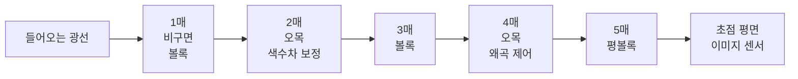
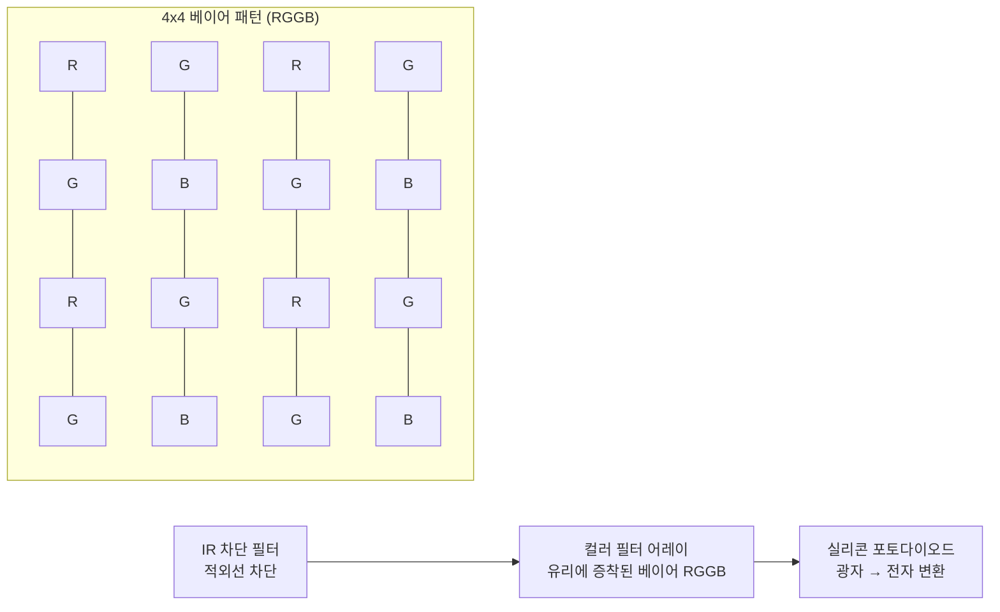
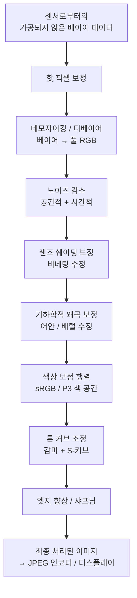
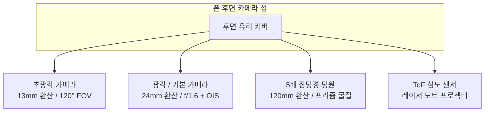
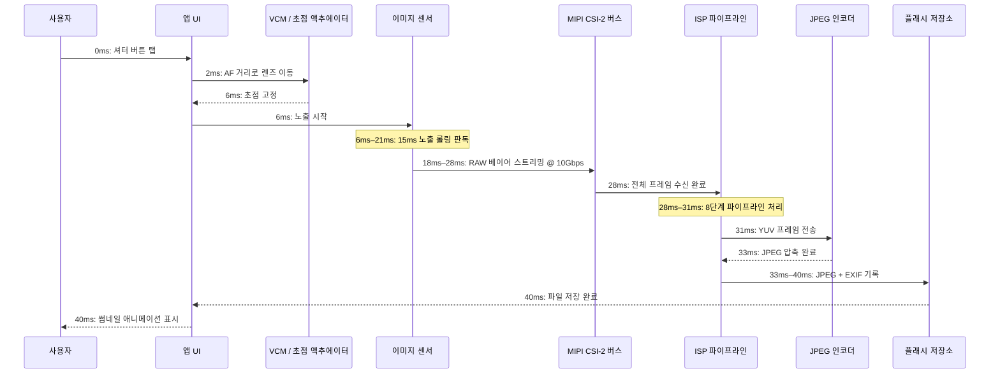

# 제2장: 스마트폰 카메라 탐색하기

Camera2 API 코드를 한 줄이라도 쓰기 전에, 여러분의 코드가 명령을 내리게 될 물리적 하드웨어를 이해해야 합니다. 스마트폰 카메라는 단순히 "센서를 향한 렌즈"가 아닙니다. 광학 장치, 액추에이터, 필터, 반도체 및 고속 데이터 버스를 포함하는 정밀하게 설계되고 밀봉된 조립체입니다. 이 장에서는 빛을 처음 포착하는 유리부터 최종 사진이 저장되는 플래시 메모리 칩까지 모든 구성 요소를 설명합니다.

이 장의 목표는 카메라 파이프라인을 물리적 시스템으로서의 멘탈 모델로 구축하는 것입니다. 나중에 `CONTROL_AE_TARGET_FPS_RANGE`나 `SENSOR_SENSITIVITY`를 사용하여 캡처 요청을 구성할 때, 이러한 파라미터가 어떤 하드웨어 부품에 영향을 미치는지, 그리고 왜 그 값이 중요한지 정확히 이해하게 될 것입니다.

## 카메라 모듈: 밀봉된 광학 조립체

최신 플래그십 폰의 뒷면을 보면 뒷면 유리에서 2~4mm 돌출된 직사각형의 섬을 볼 수 있습니다. 그 섬은 단일 카메라가 아닙니다. 하나의 섬 안에 세 개의 독립적인 원형 모듈이 들어 있습니다. 아래쪽의 가장 큰 것이 기본 광각 카메라, 그 위의 작은 것이 3배 잠망경 망원 카메라, 왼쪽의 중간 크기가 0.5배 초광각 카메라입니다. 이 섬 안의 각 원형 "범프"는 완전하고 독립적인 카메라 모듈입니다.

카메라 모듈은 먼지가 없는 클린룸에서 제조된 밀봉된 장치입니다. 외부 세계에서 안쪽으로 다음과 같은 순서로 쌓여 있습니다.

1. **보호 커버 유리**: 모듈을 밀봉하고 먼지를 막아주는 긁힘 방지 사파이어 또는 고릴라 글래스 창입니다.
2. **렌즈 배럴**: 정밀한 플라스틱 스페이서에 의해 정렬된 4~6개의 개별 유리(또는 플라스틱 비구면) 렌즈 소자들의 원통형 스택입니다.
3. **보이스 코일 모터 (VCM)**: 자동 초점(AF)을 구현하기 위해 광학 축을 따라 전체 렌즈 배럴을 수 밀리미터 단위로 앞뒤로 움직이는 전자기 액추에이터입니다. 일부 고급 VCM은 광학식 손떨림 보정(OIS)을 위해 축에 수직으로 렌즈를 이동시킬 수도 있습니다.
4. **적외선 (IR) 차단 필터**: 센서 바로 앞에 배치된 얇은 코팅 유리 웨이퍼입니다. 실리콘 센서는 감지하지만 인간의 눈은 볼 수 없는 적외선을 차단하여, 기록된 색상이 인간이 지각하는 것과 일치하도록 합니다.
5. **센서 다이**: 기판에 와이어 본딩된 실리콘 CMOS 이미지 센서 칩 자체입니다. 활성 픽셀 어레이가 렌즈를 향해 위쪽을 보고 있습니다.
6. **연성 회로 기판 (FPC)**: 전원, 접지, 제어 신호(I2C) 및 고속 이미지 데이터(MIPI CSI-2)를 모듈에서 폰의 메인보드로 전달하는 얇고 구부러지는 리본 케이블입니다.
7. **보드 투 보드 커넥터**: 폰의 메인 PCB에 있는 소켓과 결합되는 FPC 끝의 작고 고밀도인 플러그입니다.

이 전체 조립체(커버 유리부터 커넥터까지)는 일반적인 후면 카메라의 경우 두께가 5~8mm이고, 잠망경 망원 카메라의 경우 10~14mm(폰 내부에서 가로로 배치됨) 정도입니다. 각 모듈은 공장에서 개별적으로 교정됩니다. 렌즈 정렬, 센서 기울기, 컬러 쉐이딩 및 자동 초점의 무한대 위치 등이 모두 측정되어 모듈 자체의 OTP(One-Time-Programmable) 메모리에 저장됩니다. Camera2 API는 장치 부팅 시 이 교정 데이터를 읽어오므로, 앱 개발자가 개별 제조 편차를 신경 쓸 필요가 없습니다.

## 렌즈: 초점 거리, 조리개 및 흔들림 보정

렌즈는 빛이 처음 만나는 구성 요소입니다. 렌즈의 역할은 들어오는 광선을 굴절시켜 이미지 센서 평면에 정확하고 선명한 상을 맺게 하는 것입니다.

### 초점 거리 및 풀프레임 환산

초점 거리는 화각(장면이 프레임에 얼마나 들어오는지)과 확대 배율(멀리 있는 피사체가 얼마나 크게 보이는지)을 결정합니다. 스마트폰 카메라 사양은 항상 **풀프레임 환산 초점 거리**를 광고합니다. 이는 소비자가 서로 다른 센서 크기를 사과 대 사과로 비교할 수 있도록 하는 관례입니다. 풀프레임 센서는 역사적으로 35mm 필름 SLR 카메라에서 사용되던 36mm × 24mm 크기를 말합니다.

스마트폰의 일반적인 풀프레임 환산 초점 거리:

- **10–18mm (초광각)**: 대각선 화각 100°~130°. 풍경, 건축물, 단체 셀카, 근접 매크로 촬영에 사용됩니다.
- **22–28mm (광각 / 기본)**: 모든 폰의 기본 "일반" 카메라입니다. 약 75° 화각으로 인간의 주변 시야와 유사하지만 더 평평합니다.
- **45–80mm (망원, 2배~3배)**: 좁은 30°~50° 화각. 인물 사진(자연스러운 얼굴 비율, 왜곡 적음) 및 일반적인 줌에 사용됩니다.
- **100–240mm (잠망경 망원, 5배~10배)**: 10°~25° 화각. 프리즘으로 굴절된 잠망경 설계를 통해 폰을 2cm 두께로 만들지 않고도 긴 초점 거리를 구현합니다.

다음은 전형적인 5매 광각 렌즈 조립체를 통과하는 빛의 경로입니다.

### 조리개

조리개는 렌즈 내부에서 빛이 통과하는 구멍의 크기입니다. **f-번호**(또는 f-스톱)로 설명되며, 초점 거리를 조리개 직경으로 나눈 값입니다. **f-번호가 작을수록 구멍이 넓어지며, 이는 더 많은 빛이 센서에 도달함**을 의미합니다.

- f/1.4 ~ f/1.8: 매우 넓은 조리개. 전형적인 플래그십 기본 카메라. 저조도에서 뛰어난 성능을 발휘합니다.
- f/2.0 ~ f/2.4: 중간 조리개. 대부분 폰의 일반적인 초광각 및 망원 카메라.
- f/2.8 ~ f/4.0: 좁은 조리개. 저가형 전면 카메라 및 일부 잠망경 모듈에서 발견됩니다.

스마트폰 카메라의 조리개는 대개 고정되어 있습니다. 2020년경의 일부 삼성 플래그십은 f/1.5와 f/2.4 사이를 기계적으로 전환할 수 있는 **가변 조리개 메커니즘**을 탑재하기도 했습니다. 오늘날에는 VCM 기반 초점과 멀티 프레임 계산 HDR 기술의 발달로 가변 조리개의 필요성이 줄어들어 매우 드물게 사용됩니다.

### 광학식 손떨림 보정 (OIS)

폰을 손에 들고 있으면 1/30초 동안 0.1°~0.5° 정도의 미세한 각도로 손이 떨립니다. 노출 시간이 길어지면 이 떨림으로 인해 이미지 전체가 흐릿해집니다. **광학식 손떨림 보정(OIS)**은 감지된 움직임에 맞춰 렌즈 배럴(렌즈 시프트 OIS) 또는 센서 다이 자체(센서 시프트 OIS)를 물리적으로 이동시켜 이 문제를 해결합니다. 카메라 모듈 내부의 작은 자이로스코프(또는 폰의 메인 IMU 공유)가 초당 1,000~8,000회 각속도를 측정하고, OIS 액추에이터가 그에 맞춰 광학 장치를 움직입니다. OIS는 일반적으로 3~5스톱의 손떨림을 보정할 수 있습니다. 즉, 선명함을 위해 1/60초가 필요했던 노출을 동일한 선명도로 1/8초나 1/4초에서도 촬영할 수 있게 해줍니다.

## 이미지 센서: 빛이 전기가 되는 곳

이미지 센서는 **포토다이오드**라고 불리는 수백만 개의 개별 광검출기가 정밀한 직사각형 격자로 배열된 실리콘 칩입니다. 오늘날 모든 스마트폰 센서는 **CMOS (Complementary Metal-Oxide-Semiconductor)** 유형입니다.

### 픽셀 크기와 메가픽셀

각 개별 포토다이오드와 판독 회로를 **픽셀**이라고 합니다. 각 픽셀의 물리적 크기(마이크로미터, μm 단위)는 총 메가픽셀 수보다 더 중요할 수 있습니다. 픽셀이 클수록 단위 시간당 더 많은 광자를 포착하므로 샷 노이즈가 적고 저조도 성능이 좋아집니다.

2026년 스마트폰의 일반적인 픽셀 크기:

- **0.6μm ~ 0.8μm**: 매우 작은 픽셀. 108MP~200MP 고해상도 센서에 사용됩니다. 이들은 수용 가능한 노이즈 수준을 위해 전적으로 픽셀 비닝(pixel binning)에 의존합니다.
- **1.0μm ~ 1.2μm**: 중간 크기. 기본적으로 4:1 비닝을 통해 12MP~16MP 출력을 내는 48MP~64MP 센서에 사용됩니다.
- **2.0μm ~ 2.4μm**: 대형 "플래그십" 픽셀. 전용 12MP~16MP 센서(구글 픽셀, 아이폰 프로) 또는 "고화질" 모드의 48MP 센서 비닝 출력으로 사용됩니다.

픽셀 비닝은 판독 중에 인접한 2×2(또는 3×3, 4×4) 픽셀의 전하를 하나의 "슈퍼 픽셀"로 결합하는 기술입니다. 0.8μm 픽셀을 가진 48MP 센서가 4:1로 비닝되면, 1.6μm 유효 픽셀을 가진 12MP 센서처럼 동작하여 신호 대 노이즈 비를 획기적으로 개선합니다. Camera2 API는 전체 해상도 원본 모드와 기본 비닝 모드를 별도의 스트림 구성으로 노출합니다.

메가픽셀 수 계산은 간단합니다. 48MP 센서는 약 8,000 × 6,000 포토다이오드 어레이 = 48,000,000개의 개별 광센서를 가집니다.

### 센서 크기 분류

센서 크기는 1950년대 비디콘 텔레비전 튜브에서 유래한 유산인 인치 기반 표기법을 따릅니다. "1/X 인치" 형식이며 X가 작을수록 센서가 더 큽니다.

- 1/3.06" ~ 1/2.55": 소형 센서. 전면 카메라 및 보급형 초광각 카메라(~5MP~13MP)에 일반적입니다.
- 1/1.7" ~ 1/1.3": 대형 모바일 센서. 플래그십 기본 카메라(48MP, 50MP, 108MP).
- 1인치 (Type 1): 폰으로서는 매우 큰 크기. 샤오미 13 울트라, 샤프 아쿠오스 R 시리즈, 소니 엑스페리아 Pro-I 등에서 발견됩니다. 활성 영역이 약 13.2mm × 8.8mm로, 일부 마이크로 포서드 카메라 크기에 육박합니다.

동일한 메가픽셀 수라면 센서가 클수록 개별 픽셀도 항상 더 큽니다. 이것이 "1인치 센서" 폰이 눈에 띄게 더 나은 저조도 사진을 찍는 이유입니다.

### 베이어 컬러 필터 어레이 (CFA)

가공되지 않은 실리콘 포토다이오드는 색맹입니다. 파장이 아닌 총 광자 강도만 측정합니다. 색상을 기록하기 위해 제조사는 각 개별 픽셀 위에 작은 **컬러 필터**를 증착합니다. 거의 보편적인 패턴은 **베이어(Bayer) RGGB 필터 어레이**입니다. 2×2 타일이 반복되는 구조로, 녹색 픽셀 50%, 빨간색 25%, 파란색 25%로 구성됩니다. 인간의 눈은 녹색 빛에 더 민감하므로, 녹색 샘플링을 두 배로 늘리면 인지되는 휘도 해상도와 노이즈 성능이 향상됩니다.

판독 후 센서 데이터는 빨간색, 녹색, 파란색 값이 분리된 모자이크 형태이며 아직 풀컬러 이미지가 아닙니다. 각 픽셀에서 누락된 색상 정보를 채워 넣는 단계를 **데모자이킹(demosaicing)** 또는 디베이어링(debayering)이라고 하며, 이는 ISP에서 수행되는 첫 번째 주요 계산 단계입니다.

### 롤링 셔터 대 글로벌 셔터

거의 모든 스마트폰 이미지 센서는 **롤링 셔터**를 사용합니다. 센서는 모든 픽셀을 한꺼번에 노출하거나 읽지 않습니다. 대신 한 번에 한 줄씩 위에서 아래로 픽셀 어레이를 행 단위로 노출하고 읽습니다. 전형적인 48MP 센서의 롤링 판독은 전체 프레임 캡처에 약 15~25밀리초가 소요됩니다.

롤링 셔터는 매우 빠르게 움직이는 피사체에 대해 특징적인 왜곡을 만듭니다. 회전하는 비행기 프로펠러나 천장 선풍기가 굽어보이거나 물결 모양으로 보이고, 수직으로 팬(pan) 촬영한 건물의 위아래가 서로 반대 방향으로 기울어 보입니다(비디오에서의 "젤로 현상"). 반면 글로벌 셔터 센서는 모든 픽셀을 동시에 노출하고 노출이 끝나면 한꺼번에 읽습니다. 글로벌 셔터는 머신 비전, 액션 캠, 일부 특수 전면 IR 얼굴 인식 센서에 사용되지만, 글로벌 셔터 픽셀 설계는 광감도가 낮고 비용이 높아 일반적인 스마트폰 카메라에는 사용되지 않습니다.

## ISP: 이미지 신호 프로세서

**ISP (이미지 신호 프로세서)**는 센서에서 흘러나오는 가공되지 않은, 모자이크 처리된, 노이즈가 많고 왜곡된 데이터를 시각적으로 즐거운 컬러 이미지로 변환하는 전용 하드웨어 블록입니다. 예전에는 별도의 칩이었으나 오늘날에는 주로 CPU, GPU와 함께 메인 SoC의 통합된 일부입니다.

ISP는 매우 높은 처리량으로 고정된 하드웨어 이미지 처리 단계 파이프라인을 실행합니다. 초당 30프레임으로 구동되는 현대의 48MP 센서는 초당 14억 4천만 픽셀을 ISP로 보냅니다. ISP는 속도를 맞추기 위해 프레임당 33밀리초 이내에 모든 단계를 거쳐 모든 단일 픽셀을 처리해야 합니다.

정형화된 ISP 파이프라인 단계는 순서대로 다음과 같습니다.

1. **핫 픽셀 보정(Hot Pixel Correction)**: 공장에서 교정된 "고착된" 픽셀(항상 밝거나 항상 어두운 픽셀)을 주변 픽셀의 보간된 값으로 대체합니다.
2. **데모자이킹 / 디베이어(Demosaic / Debayer)**: 엣지 인식 보간 알고리즘을 사용하여 주변 픽셀로부터 각 위치의 누락된 두 가지 색상 채널을 추정함으로써 베이어 RGGB 모자이크를 완전한 RGB 이미지로 변환합니다.
3. **노이즈 감소 (시간적 + 공간적)**: 무작위 샷 노이즈와 센서 판독 노이즈를 억제합니다. 공간적 노이즈 감소(NR)는 엣지를 보존하면서 평평한 영역을 흐리게 처리합니다. 시간적 NR은 더 깨끗한 결과를 위해 이전 비디오 프레임(사용 가능한 경우)의 정보를 병합합니다.
4. **렌즈 쉐이딩 보정 (비네팅 보정)**: 빛이 렌즈를 가파른 각도로 통과해야 하므로 이미지의 모서리는 자연스럽게 더 어둡습니다. ISP는 조명을 평평하게 만들기 위해 모서리 쪽으로 갈수록 밝아지는 픽셀당 디지털 게인 램프를 적용합니다. 이 램프를 위한 교정 데이터는 모듈의 OTP에 저장되어 있습니다.
5. **기하학적 왜곡 보정**: 초광각 및 어안 렌즈는 배럴 왜곡(직선이 바깥쪽으로 휘어짐)을 발생시킵니다. ISP는 저장된 다항식 렌즈 모델을 사용하여 픽셀 좌표를 재매핑함으로써 직선이 실제로 직선으로 보이는 직선 투영 이미지를 생성합니다. 이 단계에서 본질적으로 외부 픽셀 링의 5~10%가 크롭됩니다.
6. **색상 보정 행렬 (CCM)**: 가공되지 않은 센서 RGB 분광 응답은 인간 눈의 삼색 응답과 일치하지 않습니다. 3×3 행렬 곱셈을 통해 센서 네이티브 RGB를 표준 sRGB 또는 DCI-P3 색 공간으로 변환합니다. CCM 계수는 광원(태양광, 텅스텐, 형광등)별로 모듈마다 튜닝됩니다.
7. **톤 커브 조정**: 고다이내믹 레인지 센서 신호를 저다이내믹 레인지 출력(일반적으로 8비트 sRGB 감마 인코딩)으로 압축하기 위해 비선형 S자형 톤 매핑 커브를 적용합니다. 이 단계가 이미지를 돋보이게 만듭니다. 중간 톤의 대비를 높이고, 하이라이트를 부드럽게 처리하며, 어두운 부분을 끌어올립니다.
8. **엣지 향상 / 샤프닝**: 노이즈 감소 및 광학 로우패스 필터로 인해 부드러워진 고주파 디테일을 복구하기 위해 미묘한 언샤프 마스크를 적용합니다. 후광(halo) 현상이 생기지 않도록 샤프닝 양은 신중하게 제어됩니다.

ISP의 처리 품질은 폰 제조사 간의 주요 차별화 요소입니다. 구글, 삼성, 애플, 샤오미는 각기 다른 예술적 우선순위에 따라 ISP 파이프라인을 튜닝합니다. 어떤 곳은 자연스러운 색상을 선호하고, 어떤 곳은 채도가 높고 강렬한 출력을, 어떤 곳은 디테일 유지보다는 공격적인 노이즈 감소를 선호합니다. Camera2 API는 개별 ISP 단계의 강도를 조절할 수 있는 일부 제어권(안드로이드 톤맵 및 색상 보정 제어 등)을 주지만, 대부분의 세부 단계 파라미터는 제조사 고유의 API 뒤에 잠겨 있습니다.

## RAW 대 JPEG: 센서에서 저장소까지의 두 가지 경로

위의 ISP 파이프라인은 처리된 이미지를 생성합니다. 하지만 Camera2 API는 ISP를 완전히 우회하여 가공되지 않은 센서 데이터를 직접 읽는 기능도 제공합니다. 이것이 RAW 출력과 JPEG 출력의 핵심적인 차이입니다.

### RAW 포맷

**RAW 파일**(안드로이드에서는 DNG 파일, Digital Negative를 의미)은 ISP 처리가 실행되기 전에 센서가 측정한 것을 정확히 담고 있습니다. 비네팅, 노이즈가 여전히 존재하고 선형적인 상태인 픽셀당 10비트, 12비트 또는 14비트의 베이어 모자이크입니다. RAW 파일에는 정확한 컬러 필터 어레이 패턴, 센서의 색상 프로필, 블랙 레벨, 화이트 레벨 및 렌즈 모델을 지정하는 메타데이터 태그도 포함됩니다.

- **비트 깊이**: RAW10 = 채널당 10비트 = 1,024단계. RAW12 = 4,096단계. RAW14 = 16,384단계. JPEG의 8비트 = 256단계와 비교해 보세요.
- **파일 크기**: 48MP 사진당 20~40MB. 비압축 또는 거의 무손실 압축.
- **유스케이스**: 전문가용 사후 편집. 추가적인 헤드룸 덕분에 편집자가 노출 과다인 하이라이트를 복구(EV 2~3스톱 정도)하거나 밴딩 현상 없이 어두운 부분을 끌어올릴 수 있습니다.

### JPEG 포맷

**JPEG 파일**은 ISP의 조리가 완전히 끝난 출력물입니다. 위의 8단계 ISP 과정이 모두 픽셀 데이터에 이미 적용되어 있으며 되돌릴 수 없습니다. 그 후 이미지는 RGB에서 YCbCr 4:2:0 크로마 서브샘플링 색 공간으로 변환되고, 손실 있는 이산 코사인 변환(DCT) 알고리즘을 통해 대략 10:1에서 20:1의 압축률로 압축됩니다.

- **비트 깊이**: 항상 채널당 8비트 = 색상당 256단계.
- **파일 크기**: JPEG 품질 레벨에 따라 12MP~48MP 사진당 2~5MB.
- **유스케이스**: 즉각적인 공유, 소셜 미디어, 촬영된 그대로 끝나는 모든 워크플로. 모바일 편집기에서 조정하면 남은 단계가 256개뿐이라 화질이 빠르게 저하됩니다.

### 비교표: RAW 대 JPEG

| 기능 | RAW (DNG) | JPEG |
|---------|-----------|------|
| ISP 처리 적용 | 없음 — 모든 단계 건너뜀 | 8단계 모두 적용 및 가역 불가 |
| 색상 깊이 | 10–14 비트 (1,024–16,384 단계) | 8 비트 (256 단계) |
| 화이트 밸런스 | 메타데이터에 태그됨, 사후 변경 자유로움 | 픽셀에 구워짐 — 미세 편집만 가능 |
| 노출 관용도 | ±2~3 스톱 복구 가능 | 밴딩 발생 전 최선일 때 ±1/2 스톱 |
| 파일 크기 (48MP) | 25–40 MB | 3–6 MB |
| 색 공간 | 센서 네이티브 선형 RGB | sRGB 또는 Display P3 감마 인코딩 |
| 샤프닝 / 노이즈 감소 | 없음 — 편집자의 선택 | 적용됨; 취소 불가 |
| 일반적인 워크플로 | 어도비 라이트룸 / 캡처 원 워크플로 | 인스타그램 / 메시지로 직접 공유 |

## 멀티 카메라 폰: 왜 거대한 줌 렌즈 하나를 안 쓸까요?

전통적인 포인트 앤 슛 카메라는 내부 렌즈군을 움직여 광각에서 망원까지 초점 거리를 연속적으로 변경하는 단일 줌 렌즈를 사용합니다. 왜 스마트폰은 그렇게 못 할까요? 물리 때문입니다. f/2.8 고정 조리개로 24mm-240mm(풀프레임 환산)를 커버하는 10배 줌 렌즈는 약 5cm(2인치) 길이의 광학 경로가 필요합니다. 스마트폰은 두꺼워야 0.9cm입니다. 수학적으로 맞지 않습니다.

스마트폰 업계는 줌 렌즈 대신 **여러 개의 고정 초점 거리 카메라**를 탑재하고, 각 카메라를 특정 목적에 최적화하며, 특정 줌 비율에서 한 카메라에서 다음 카메라로 페이드 인/아웃하는 "매끄러운 줌" 계산 시스템을 통해 이 문제를 해결했습니다.

전형적인 2026년 플래그십 후면 카메라 섬의 구성:

1. **초광각 (0.5배 줌, ~13mm 환산, ~120° FOV)**: 짧은 초점 거리, 깊은 피사계 심도. 풍경, 건축물, 단체 사진 및 소프트웨어로 재포지셔닝된 근접 매크로에 이상적입니다.
2. **광각 / 기본 (1배 줌, ~24mm 환산, ~75° FOV)**: 기본값입니다. 가장 큰 센서, 가장 넓은 조리개, 최고의 OIS를 갖추고 있습니다. 일상 사진의 80%에 사용됩니다.
3. **망원 / 잠망경 (3배~10배 광학, ~72mm~~240mm 환산)**: 일반적인 망원 렌즈(3배)는 센서 바로 위에 놓입니다. 잠망경 망원(5배, 10배)은 폰 가장자리 근처의 45° 프리즘을 사용하여 빛을 90° 굴절시켜 렌즈 배럴이 폰 두께가 아닌 본체 내부에서 수평으로 길게 놓이게 합니다.
4. **ToF / 심도 센서**: 근적외선 레이저 도트 프로젝터(또는 아이폰의 라이다 스캐너)가 장면에 3만 개 이상의 IR 도트를 쏘고 돌아오는 시간을 측정하여 픽셀당 깊이 맵을 생성합니다. 정확한 인물 모드 보케, 증강 현실(AR) 가림 처리, 저조도에서의 빠른 자동 초점에 사용됩니다.

카메라 앱에서 핀치 줌 제스처를 하면, HAL(Hardware Abstraction Layer)이 미리 정해진 임계값에서 활성 물리적 카메라를 매끄럽게 전환합니다. 예를 들어 0.5배에서 1.0배로 줌을 하면 초광각에서 광각으로 페이드됩니다. 2.9배까지는 여전히 광각 카메라를 디지털로 크롭하고 있습니다. 3.0배가 되면 HAL이 활성 소스를 잠망경 망원 카메라로 전환합니다. 이러한 줌 비율 사이에서 정교한 이미지 퓨전 알고리즘이 두 카메라를 동시에 사용하여 끊김 없는 전환을 유지합니다.

## 전체 여정: 광자에서 저장된 사진까지, 밀리초 단위로 보기

사용자의 손가락이 가상 셔터 버튼에서 떨어지는 순간부터 스마트폰 내부에서 물리적으로 일어나는 전체 타임라인입니다. 2026년형 플래그십이 낮에 12MP 기본 모드 JPEG를 캡처하는 상황을 가정한 수치입니다.

- **0 ms**: 사용자가 셔터를 누릅니다. Camera2 API 프레임워크가 `TEMPLATE_STILL_CAPTURE`가 포함된 `CaptureRequest`를 받습니다.
- **0–2 ms**: 3A 알고리즘(자동 초점, 자동 노출, 자동 화이트 밸런스)이 최종 값에 수렴합니다.
- **2–6 ms**: 보이스 코일 모터(VCM)에 전원이 공급되어 AF 알고리즘이 계산한 정확한 초점 거리로 렌즈 배럴을 0.2mm 물리적으로 이동시킵니다.
- **6–21 ms (15 ms 노출)**: 글로벌 리셋이 센서 픽셀의 전하를 해제합니다. 15밀리초 동안 포토다이오드가 광자에 의해 생성된 전자를 축적합니다. 이 창 동안과 그 후에 롤링 셔터가 행 단위로 읽어 들입니다.
- **18–28 ms**: 센서가 MIPI CSI-2 고속 직렬 버스를 통해 가공되지 않은 베이어 데이터를 출력합니다. 전형적인 구성은 레인당 2.5Gbps × 4레인 = 총 10Gbps 대역폭으로, 12MP 프레임의 원시 비트 깊이와 블랭킹 구간을 여유 있게 처리합니다.
- **28–31 ms**: ISP의 8단계 파이프라인이 핫픽셀 보정, 데모자이킹, 노이즈 감소, 렌즈 쉐이딩, 기하학적 보정, 컬러 매트릭스, 톤 커브 및 샤프닝을 거쳐 프레임을 처리합니다. 이는 하드웨어에서 전적으로 수행되며 픽셀 레벨에서 CPU 개입은 없습니다.
- **31–33 ms**: 처리된 YUV 이미지가 하드웨어 JPEG 인코더로 전송됩니다. 인코더는 품질 레벨 90~95로 손실 DCT 압축을 적용하고 JFIF 파일 헤더(EXIF, 썸네일, 위치 정보 태그 등)를 작성합니다.
- **33–40 ms**: 완성된 JPEG 블롭이 MediaStore 콘텐츠 제공자를 통해 앱의 파일 디렉터리(예: `/data/data/com.yourpackagename/files/DCIM/Camera/IMG_20260806_151042.jpg`)에 기록됩니다. MediaScanner에 알림이 가고 사진이 시스템 갤러리에 나타납니다.

전체 프로세스는 낮 시간의 스틸 사진 캡처를 위해 처음부터 끝까지 약 40밀리초가 소요됩니다. 저조도 환경에서는 노출 시간 자체가 길어지며(야간 모드 멀티 프레임 캡처의 경우 수 초까지), 타임라인도 그에 비례하여 늘어납니다.

## 요약

이제 스마트폰 카메라 시스템에 대한 완전한 물리적 그림을 갖게 되었습니다. 각 후면 카메라 범프는 여러 소자가 들어있는 렌즈 배럴, VCM 자동 초점 액추에이터, IR 차단 필터, 베이어 RGGB 컬러 필터 어레이가 있는 CMOS 센서, MIPI CSI-2 데이터를 전달하는 플렉스 케이블을 포함하는 밀봉된 모듈임을 알게 되었습니다. 초점 거리 환산, 조리개 및 OIS를 이해했습니다. ISP의 8단계 파이프라인이 어떻게 가공되지 않은 베이어 모자이크를 완성된 JPEG로 변환하는지 알았으며, RAW(센서 네이티브, 10~14비트, 사후 편집 여유분)와 JPEG(ISP 처리됨, 8비트, 즉시 공유용)를 구분할 수 있습니다. 현대의 폰이 왜 줌 렌즈 대신 3개 이상의 고정 카메라를 사용하는지 이해했으며, 단일 사진 캡처의 정확한 밀리초 단위 타임라인을 살펴보았습니다.

## 다음 단계

제3장에서는 물리적 하드웨어에서 그 하드웨어가 생성할 수 있는 결과물로 넘어갑니다. HDR 멀티 프레임 브래키팅, 스테레오 / ToF / ML을 통한 인물 모드 보케, 야간 시야(Night Sight) 멀티 프레임 장노출, 슬로우 모션 고속 비디오 캡처, 초광각 왜곡 보정 및 잠망경 망원 등 현대 스마트폰 사진의 실제 기능을 살펴볼 것입니다. 단일 렌즈/센서 조합으로는 절대 만들어낼 수 없는 이미지를 만들어내는 계산 사진학(광학, 센서, 멀티 프레임 신호 처리 및 온디바이스 머신 러닝의 융합)에 대해 배우게 될 것입니다.
