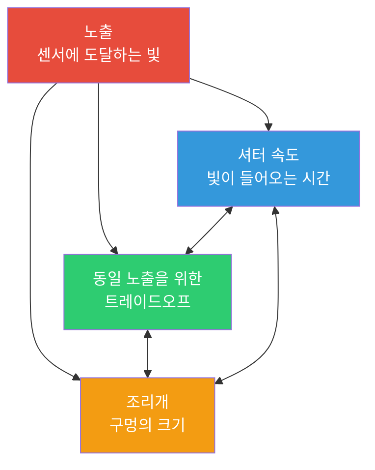

# 제13장: 노출

## 노출 삼각형: 세 개의 조절기, 하나의 목표

스마트폰 카메라로 사진을 찍는다는 것은 빛을 캡처하는 것입니다. 센서에 도달하는 빛의 *양*에 따라 사진이 너무 어둡거나(노출 부족), 너무 밝거나(노출 과다), 혹은 딱 적당하게(적정 노출) 결정됩니다. 세 가지 기본 제어 요소가 이를 관장하며, 이들은 함께 **노출 삼각형**을 형성합니다.



**핵심 개념:** 삼각형의 각 꼭짓점은 빛을 제어하지만, 동시에 *창의적인 트레이드오프*를 발생시킵니다. 세 가지 설정의 서로 다른 조합으로 *동일한* 총 노출량을 얻을 수 있지만, 각 조합은 사진의 *느낌*을 다르게 만듭니다.

다음 장에서 안드로이드 Camera2 API의 구체적인 내용을 다루기 전에, 각 요소에 대한 탄탄한 직관적 기초를 쌓아봅시다.

---

## ISO: 센서 감도 (게인 제어)

필름 시대에 **ISO**는 *필름 자체의 빛에 대한 민감도*를 나타냈습니다. ISO 100 필름은 "느려서" 밝은 빛이 필요했고, ISO 800 필름은 "빨라서" 실내 촬영이 가능했습니다.

**스마트폰 카메라를 포함한 디지털 사진에서 ISO는 센서 게인(Gain) 또는 전자적 증폭입니다.** ISO 값을 두 배로 높이면, 센서의 아날로그 신호를 디지털화하기 전에 적용되는 증폭량을 효과적으로 두 배로 늘리는 것입니다.

### ISO 작동 원리

센서의 픽셀 우물이 광자(빛 입자)를 수집한다고 상상해 보세요. 노출 시간이 끝나면:

1. 각 픽셀은 축적된 광자를 미세한 전기 전하로 변환합니다.
2. **아날로그 게인 증폭기**가 ISO 설정에 해당하는 계수만큼 이 신호를 곱합니다.
3. 증폭된 신호는 아날로그에서 디지털로 변환됩니다(ADC).
4. 디지털 프로세싱을 통해 추가적인 처리(노이즈 감소, 톤 매핑)가 적용됩니다.

**ISO 100 = 베이스 / 최저 게인.** 신호가 가장 적게 증폭되므로:
- 디지털 노이즈(그레인)가 최소화된 *깨끗한* 사진을 얻습니다.
- 다이내믹 레인지(기록 가능한 가장 밝은 톤과 가장 어두운 톤의 차이)가 가장 높습니다.
- 색상이 가장 정확합니다.

**ISO 3200 = 높은 게인.** 신호가 32배 증폭됩니다:
- 셔터 시간을 늘리지 않고도 더 어두운 장면을 찍을 수 있습니다.
- 하지만 *눈에 보이는 노이즈*(색상 반점, 휘도 노이즈)가 발생합니다.
- 다이내믹 레인지와 색 정확도가 크게 떨어집니다.

### 일반적인 스마트폰 ISO 범위

| ISO 범위 | 특성 | 용도 |
|-----------|---------------|----------|
| 50–200 | 베이스 ISO, 가장 깨끗한 이미지 | 밝은 대낮, 스튜디오 조명 |
| 200–800 | 중간 게인, 약간의 노이즈 | 흐린 날, 그늘진 곳 |
| 800–3200 | 눈에 보이는 노이즈, 사용 가능함 | 실내 조명, 황혼 |
| 3200–12800+ | 심한 노이즈 / 강한 노이즈 감소 적용 | 야경, 저조도 이벤트 |

> **스마트폰의 현실:** 플래그십 폰은 높은 ISO 값에서 종종 강력한 계산적 노이즈 감소(제조사 고유의 "야간 모드" 처리)를 적용합니다. 나중에 Camera2에서 자동 파이프라인을 비활성화하면 이러한 OEM 최적화 기능을 *잃게* 됩니다. 이 중요한 주의사항은 14장에서 다시 다루겠습니다.

---

## 셔터 속도 (노출 시간)

**셔터 속도**는 단순히 *센서가 빛에 노출되는 시간*입니다. 전통적인 카메라에서는 기계식 셔터가 물리적으로 열리고 닫힙니다. 스마트폰에서는 거의 항상 **전자식 셔터**를 사용합니다. 센서가 리셋되고 정해진 시간 동안 광자를 수집한 뒤 판독되는 방식입니다.

셔터 속도는 **초** 단위로 측정되며, 일반적으로 분수로 표시됩니다.

| 셔터 속도 | 역할 | 일반적인 용도 |
|--------------|-------------|-------------|
| 1/2000초 – 1/1000초 | 매우 짧은 노출, 모든 움직임을 정지시킴 | 스포츠, 새, 빠르게 움직이는 차량 |
| 1/500초 – 1/250초 | 일반적인 사람의 움직임을 정지시킴 | 걷는 사람, 노는 아이들 |
| 1/125초 – 1/60초 | 흔들림 보정이 포함된 "안전한" 손들고 촬영 속도 | 안정된 손으로 찍는 일반적인 사진 |
| 1/30초 – 1/15초 | 약간의 모션 블러 발생, 삼각대 필요 | 창의적인 움직임 표현, 저조도 |
| 1초 – 30초 | 장노출, 심한 모션 블러 | 폭포, 별 궤적, 매끄러운 수면 |
| 30초 이상 | 초장노출 (특수 용도) | 천체 사진, 라이트 페인팅 |

### 모션 블러 효과

"충분한 빛 확보" 외에 특정 셔터 속도를 의도적으로 선택하는 이유는 **두 가지**입니다.

1. **동작 정지:** 1/1000초로 날아가는 새를 찍으면, 노출 시간 동안 새가 거의 움직이지 않았기 때문에 모든 깃털이 선명하게 보입니다.

2. **모션 블러 생성:** 2초 동안 폭포를 찍으면 흐르는 물이 매끄럽고 실키한 흰색 궤적으로 표현됩니다. 각 물방울이 노출되는 동안 센서의 많은 픽셀을 가로질러 이동했기 때문입니다.

이를 장노출 페인팅처럼 생각하세요. *셔터가 열려 있는 동안 움직이는 모든 것은 선이 됩니다.*

**비디오 촬영 시 중요 사항:** 30fps 비디오를 찍을 때, 각 프레임은 *최대* 약 1/30초 동안 노출됩니다. 영화 제작자들은 **180도 셔터 법칙**을 따릅니다. 프레임 속도의 두 배로 셔터 속도를 설정하는 것입니다(30fps 비디오의 경우 1/60초). 이렇게 하면 너무 뚝뚝 끊기거나 너무 뭉개지지 않는 자연스럽고 "영화 같은" 모션 블러를 얻을 수 있습니다.

---

## 조리개

**조리개**는 빛이 통과하는 렌즈 개구부의 크기입니다. **f-스톱**(f/1.4, f/2.0, f/2.8, f/4.0, f/5.6, f/8.0 등)으로 측정되는데, *숫자가 작을수록 더 넓은 개구부*를 의미하는 반직관적인 척도입니다.

```
  f/1.4     f/2.0     f/2.8     f/4.0     f/5.6     f/8.0
█████████████████████████████████████████████████████████
█████████████████                              █████████
███████████████                                  ███████
█████████████                                    ██████
████████████                                      █████
███████████                                      ██████
```

**단계별로 빛이 절반으로 줄어듦:** f/1.4 → f/2.0 → f/2.8 → f/4.0으로 이동할 때마다 개구부의 면적이 *절반*씩 줄어들어 통과하는 총 빛의 양도 절반이 됩니다. 한 단계씩 어두워지는 것을 1 "스톱"이라고 합니다.

### 조리개 트레이드오프 (창의적 및 실용적)

1. **피사계 심도 (DoF):** 넓은 조리개(f/1.8) = *얕은* 심도. 초점이 맞는 면이 좁고 앞뒤가 흐릿해집니다(보케 효과). 좁은 조리개(f/8) = *깊은* 심도. 전경부터 배경까지 모두 선명해집니다.

2. **빛 수집:** f/1.4는 f/2.8보다 4배 더 많은 빛을 수집합니다. 이것이 저조도 촬영에서 "밝은 렌즈"(최대 조리개 값이 큰 렌즈)가 높게 평가받는 이유입니다.

3. **회절:** 매우 좁은 조리개(f/11 이상)에서는 빛의 파동이 조리개 날 주변에서 굴절되어 이미지가 약간 부드러워집니다. 스마트폰에서는 보통 무시해도 되는 수준입니다.

### 스마트폰의 현실 확인

대부분의 스마트폰은 **고정 조리개 렌즈**를 사용하므로 f-스톱을 변경할 수 없습니다. 보급형 폰은 f/2.4–f/2.8 정도이고, 플래그십은 종종 f/1.4–f/1.8에 도달합니다. [Android Camera Parameters 앱](https://play.google.com/store/apps/details?id=com.minininja.cameraparams)의 `CameraCharacteristics`에서 본인 렌즈의 고정 조리개 값을 확인할 수 있습니다.

일부 프리미엄 폰(예: 삼성 갤럭시 S23 Ultra, 엑스페리아 시리즈)은 두 단계(예: f/1.5와 f/2.4) 사이를 기계적으로 전환하는 *듀얼 조리개* 메커니즘을 제공하기도 합니다. Camera2에서는 `LENS_INFO_AVAILABLE_APERTURES`를 쿼리하여 기기가 다중 조리개를 지원하는지 확인할 수 있습니다.

**실무적 결론:** 대부분의 안드로이드 Camera2 개발에서 조리개는 *고정*되어 있으므로, **ISO와 셔터 속도만으로** 노출을 제어하게 됩니다. 세 개가 아닌 두 개의 조절기만 다루면 되므로 오히려 상황이 단순해집니다!

---

## EV: 노출값 (로그 스케일)

사진가들이 "1스톱 조절한다"라고 말할 때는 **총 빛의 양을 두 배로 늘리거나 절반으로 줄이는 것**을 의미합니다. 스톱 기반의 사고를 정밀하게 하기 위해 업계에서는 **노출값 (EV)**을 표준화했습니다.

**EV 0**은 표준 기준 밝기를 생성하는 노출 조합으로 정의됩니다: **1초 노출, f/1.0 조리개, ISO 100**.

**+1 EV마다 빛이 두 배**가 되고(더 밝아짐), **−1 EV마다 빛이 절반**이 됩니다(더 어두워짐).

| EV 변화 | 의미 |
|-----------|---------|
| +3 EV | 8배 더 많은 빛 (2³) |
| +2 EV | 4배 더 많은 빛 |
| +1 EV | 2배 더 많은 빛 |
| 0 EV | 기준: 1초 @ f/1.0 ISO 100 |
| −1 EV | ½의 빛 |
| −2 EV | ¼의 빛 |
| −3 EV | ⅛의 빛 |

아름다운 점은 **ISO + 셔터 + 조리개의 어떤 조합이든 합산된 EV 값이 같으면 동일한 총 노출량을 만들어낸다**는 것입니다. 이것이 삼각형의 세 꼭짓점을 연결하는 *동일 노출(equivalent exposure)* 원리입니다.

### EV와 ISO/셔터 조합

조리개가 고정된 경우 EV 방정식은 비약적으로 단순해집니다. f/1.8 스마트폰의 경우:

| 장면 | 일반적인 EV | ISO 100 셔터 | ISO 400 셔터 | ISO 1600 셔터 |
|-------|-----------|----------------|-----------------|------------------|
| 밝고 화창한 해변 | 15 | 1/4000초 | 1/1000초 | 1/250초 |
| 안개 낀 / 흐린 날 | 12 | 1/500초 | 1/125초 | 1/30초 |
| 밝은 실내 사무실 | 8 | 1/30초 | 1/8초 | 1/2초 |
| 밤의 거실 | 4 | 2초 | 0.5초 | 1/8초 |
| 별이 빛나는 밤 | −2 | 30초 | 8초 | 2초 |

### 유명한 Sunny 16 법칙

노출계와 정교한 자동 노출 알고리즘이 나오기 전, 사진가들은 노출계 없이 대낮 노출을 맞추기 위해 이 경험 법칙에 의존했습니다.

> **화창한 날에는 조리개를 f/16으로, 셔터 속도를 1/ISO 초로 설정하라.**

| Sunny 16 (f/16) | f/1.8 스마트폰에서의 환산 |
|-----------------|----------------------------------|
| ISO 100, 1/100초, f/16 → EV 15 | ISO 100, 1/4000초, f/1.8 → EV 15 ✓ |
| ISO 200, 1/200초, f/16 → EV 15 | ISO 200, 1/8000초, f/1.8 → EV 15 ✓ |

계산해 보면 맞습니다: f/1.8은 f/16보다 약 **6⅓ 스톱 더 넓습니다**. 한 스톱마다 빛의 면적이 *두 배*가 되므로 2^(6.33) ≈ 80배 더 많은 빛이 들어옵니다. 따라서 이를 상쇄하기 위해 셔터는 80배 더 빨라야 합니다: 1/100초 ÷ 80 ≈ 1/8000초 (ISO 200 기준). 현장에서 쓰기에 충분히 정확한 수치입니다.

---

## 노출 부족 / 적정 / 노출 과다의 모습

동일한 장면(예: 하늘을 배경으로 서 있는 사람)을 찍은 세 장의 사진을 머릿속으로 비교해 봅시다.

**노출 부족 (−2 EV):** 피사체가 너무 어둡습니다. 그림자 부분이 세부 묘사 없이 완전한 검은색으로 *뭉개집니다(crushed)*. 히스토그램에서는 모든 데이터가 왼쪽(어두운 쪽)에 쏠려 있습니다. 하늘은 괜찮아 보일 수 있지만 사람은 실루엣처럼 보입니다. 후보정에서 노출 부족인 RAW 데이터를 "끌어올릴" 수는 있지만, 약한 신호를 증폭하는 것이기 때문에 그림자 부분에 심한 노이즈가 나타납니다.

**적정 노출 (0 EV):** 중간 톤이 적절한 질감을 보여줍니다. 사람의 얼굴에 피부 디테일이 보이고, 셔츠의 주름과 눈의 반짝임이 살아 있습니다. 히스토그램은 양 끝이 잘리지 않고 전체 범위에 데이터가 골고루 퍼져 있습니다. 다이내믹 레인지가 제한적인 폰에서는 밝은 하늘의 일부가 흰색으로 날아갈(clipping) 수 있는데, 이는 피사체의 노출 부족과 사이에서 타협해야 하는 고전적인 트레이드오프입니다.

**노출 과다 (+2 EV):** 하이라이트 부분이 복구 불가능할 정도로 *하얗게 날아갑니다(blown out)*. 하늘은 균일한 흰색 판처럼 보이고, 밝은 셔츠 단추나 정반사되는 부분은 잘려 나갑니다. 사람의 얼굴은 뽀얗게(밝은 피부) 보일 수 있지만 하이라이트 디테일은 영구적으로 소실되었습니다. 노출 부족인 그림자와 달리(노이즈와 함께 일부 복구 가능), *날아간 하이라이트는 영원히 사라집니다*. 해당 픽셀에는 데이터 자체가 존재하지 않기 때문입니다.

**사진가의 주문:** *하이라이트에 맞춰 노출을 맞추고, 그림자를 복구하라.* 나중에 다룰 RAW 캡처에서는 이것이 특히 강력합니다. 14비트 RAW는 치명적인 노이즈 없이 +2 EV 이상 그림자 디테일을 끌어올릴 수 있는 충분한 데이터를 저장하기 때문입니다.

---

## 실전 EV 참조표

몇 가지 주요 EV 값을 외워두면 어디서나 노출을 가늠할 수 있습니다.

| 장면 | 일반적인 EV (ISO 100 기준) | f/1.8, ISO 400 시 대략적인 셔터 |
|-------|------------------------|--------------------------------|
| 직사광선 아래의 눈 덮인 풍경 | 16 | 1/4000초 |
| 화창한 해변, 밝은 낮 | 15 | 1/2000초 |
| 일반적인 화창한 날 | 14 | 1/1000초 |
| 구름 낀 / 흐린 날 | 12 | 1/250초 |
| 매우 흐린 날 / 비 | 11 | 1/125초 |
| 밝은 그늘 (그늘 속 사람, 배경은 햇빛) | 9 | 1/30초 |
| 일몰 / 골든 아워 | 7 | 1/8초 |
| 밝은 실내 사무실 | 8 | 1/15초 |
| 가정용 거실, 램프만 켬 | 4 | 1/2초 |
| 어두운 식당 내부 | 2 | 2초 |
| 밤의 도시 거리 (네온사인) | 1 | 4초 |
| 야경, 멀리 보이는 도시 불빛 | −2 | 30초 |
| 달빛 아래 풍경 (보름달) | −3 | 1분 |
| 별이 총총한 하늘, 달 없음 | −6 | 8분 |

폰의 자동 노출이 실제로 선택하는 값과 이 근사치들을 비교해 볼 수 있습니다. [Android Camera Parameters 앱](https://github.com/zoozooll/AndroidCameraParameters)을 실행하고 Live Preview에서 밝은 해변에서 어두운 방으로 걸어 들어가며 `SENSOR_EXPOSURE_TIME`과 `SENSOR_SENSITIVITY`를 관찰해 보세요. 이 표와 대략적으로 일치하는 실제 값들을 볼 수 있을 것입니다.

---

## 종합하기: 동일 노출

동일한 총 노출(EV 12 = 흐린 날, f/1.8 스마트폰)을 원한다고 가정해 봅시다. 동일한 센서 밝기를 만들어내는 세 가지 유효한 조합은 다음과 같습니다.

| 조합 | ISO | 셔터 속도 | 룩 앤 필 (Look & Feel) |
|-------------|-----|---------------|-------------|
| 깨끗하고 선명함 | 100 | 1/500초 | 노이즈가 가장 적고 움직임이 가장 선명하게 멈춤 |
| 중간 지점 | 400 | 1/125초 | 약간의 노이즈, 적절한 균형 |
| 매끄러운 움직임 | 1600 | 1/30초 | 눈에 보이는 노이즈, 움직이는 피사체에 약간의 블러 |

세 조합 모두 동일한 EV에 도달합니다. 세 장 모두 *똑같이 밝게 보입니다*. 하지만 *질감*(노이즈 그레인)과 *움직임의 묘사*는 완전히 다릅니다. **그것이 바로 노출의 예술입니다.**

### 두 마리 토끼를 다 잡으려면?

여기서 계산 사진학(Computational Photography)이 빛을 발합니다. "야간 모드"인 폰은 2초짜리 사진 *한 장*을 찍는 것이 아니라, 1/60초짜리 프레임 *수십 장*을 캡처하여(각 프레임에서 움직임을 고정) 이를 계산적으로 정렬하고 평균을 냅니다. 그 결과 모션 블러의 페널티 없이 장노출의 빛 수집 효과를 모방할 수 있습니다.

Camera2 레벨에서 수동 노출을 이해하고 나면, 여러분도 이와 같은 기법을 직접 구현할 수 있습니다.

---

## 요약

이 장에서는 안드로이드 코드 한 줄 건드리지 않고 *사진의 기초*를 다루었습니다.

- **노출 삼각형:** 셔터 속도(시간), ISO(센서 게인), 조리개(구멍 크기)가 결합되어 총 빛의 양을 조절합니다. 각 요소는 창의적인 트레이드오프를 가집니다.
- **디지털 사진의 ISO** = 아날로그 센서 게인. 낮은 ISO = 깨끗함, 높은 ISO = 노이즈 발생. 스마트폰은 보통 OEM 노이즈 감소와 함께 ISO 100–6400+를 지원합니다.
- **셔터 속도**는 초 단위의 노출 시간입니다. 빠른 셔터(1/1000초)는 동작을 멈추고, 느린 셔터(1초 이상)는 모션 블러를 만듭니다. 비디오에는 180도 셔터 법칙이 적용됩니다.
- **조리개**는 f-스톱으로 제어되는 렌즈 개구부입니다. 대부분의 스마트폰은 조리개가 고정되어 있어 ISO + 셔터만 사용합니다.
- **EV (노출값)**는 ±1 단계마다 빛이 두 배/절반이 되는 로그 스톱 스케일입니다. EV 0 = 1초 @ f/1.0 ISO 100입니다.
- **Sunny 16 법칙**과 EV 참조표를 이용하면 노출계 없이도 노출을 짐작할 수 있습니다.
- **적정 노출**은 중간 톤의 디테일 균형을 맞추고 그림자 뭉개짐과 하이라이트 날림을 피하는 것입니다. RAW는 복구 여유분을 보존합니다.

## 다음 단계

**제14장: Camera2에서의 수동 노출**에서는 이 모든 개념적 모델을 구체적인 Camera2 API 호출로 변환합니다. 다음 내용을 배우게 됩니다.

- 자동 노출 파이프라인을 비활성화하는 방법 (`CONTROL_MODE = OFF`, `CONTROL_AE_MODE = OFF`)
- ISO 값을 `SENSOR_SENSITIVITY`로 변환하는 방법
- 사람이 읽을 수 있는 초 단위를 `SENSOR_EXPOSURE_TIME`용 나노초로 변환하는 방법
- 고정 타임랩스 노출, 야간 장노출, 3장 노출 브래키팅 시리즈를 위한 작동하는 Kotlin 코드
- 3A를 껐을 때 OEM 노이즈 감소 기능이 비활성화되는 중요한 주의사항

자, 이제 코드를 시작해 봅시다.
