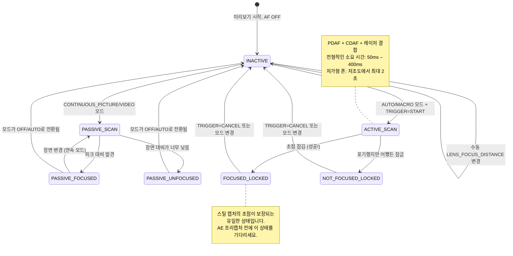

# 제15장: 초점

노출이 밝기를 조절한다면, **초점은 선명함을 조절합니다.** 노출은 완벽하지만 초점이 흐릿한 사진은 실패한 사진입니다. 이 장에서는 스마트폰 초점 시스템의 작동 원리, Camera2를 통한 신뢰할 수 있는 자동 초점(AF) 구동 방법, 그리고 `LENS_FOCUS_DISTANCE`를 사용하여 매끄러운 수동 초점 슬라이더를 구현하는 방법을 배웁니다.

[Android Camera Parameters 앱](https://github.com/zoozooll/AndroidCameraParameters)의 Focus 패널에서 이 모든 것을 직접 확인할 수 있습니다. AF 상태 머신의 변화를 실시간으로 관찰하고 수동 초점 슬라이더를 드래그하여 렌즈가 무한대에서 최소 초점 거리까지 움직이는 모습을 볼 수 있습니다.

---

## 현대 스마트폰의 자동 초점 (AF)

API 세부 사항으로 들어가기 전에, 스마트폰이 사용하는 세 가지 물리적 초점 메커니즘을 이해해 봅시다.

### 1. 대비 검출 AF (CDAF) — 패시브 스캔

소프트웨어 기법입니다. 이미지 프레임을 분석하여 최대 엣지 대비(선명한 엣지 = 가장 높은 공간 주파수)를 찾고, 피크 대비가 발견될 때까지 렌즈를 움직입니다.

- **장점:** 어떤 카메라 하드웨어에서도 작동합니다(특수 픽셀 불필요).
- **단점:** 느립니다. 렌즈가 초점 범위를 앞뒤로 *왔다 갔다(hunt)* 해야 합니다. Camera2 상태 맵의 "AF SCANNING" 같은 레이블이 여기에 해당합니다.

### 2. 위상차 검출 AF (PDAF) — 액티브 스캔

센서의 특수 포토다이오드가 두 개로 나뉘어 있습니다. 왼쪽/오른쪽 절반 사이의 위상차를 통해 렌즈를 *얼마나 멀리, 어느 방향으로* 움직여야 하는지 직접 측정하므로 왔다 갔다 할 필요가 없습니다. 최신 플래그십 폰은 *모든* 픽셀이 위상차 검출을 수행하는 듀얼 픽셀 PDAF를 사용합니다.

- **장점:** 매우 빠릅니다(좋은 조명에서 100ms 미만). 비디오에서 안정적으로 작동합니다.
- **단점:** 저조도(위상 계산을 위한 광자 부족)에서 어려움을 겪으며, 최소 초점 거리 제한이 있습니다.

### 3. 레이저 AF / ToF AF (액티브) — 거리 측정기

전용 하드웨어 모듈이 적외선 레이저 펄스를 쏘고 반사되는 시간을 측정하여 ISP에 피사체 거리를 직접 보고합니다. 중급기에서 프리미엄 폰에 매우 흔하게 탑재됩니다.

- **장점:** 어떤 대상이든, 심지어 완전한 어둠 속에서도(대상에 적외선이 반사된다면) 번개처럼 빠른 잠금이 가능합니다.
- **단점:** 유효 거리가 제한적이며(~50cm–5m 최대), 유리나 적외선을 투과시키는 물체에서는 실패합니다.

실제 폰은 **이 세 가지를 모두 결합**합니다: 빠른 대략적인 잠금을 위한 PDAF, 미세 조정을 위한 CDAF, 그리고 저조도나 근접 장면을 위한 레이저 AF를 사용합니다. Camera2는 이 통합된 파이프라인을 단일 추상 상태 머신으로 노출합니다.

---

## AF 모드: CONTROL_AF_MODE

Camera2는 `CameraMetadata`에 다음과 같은 AF 모드를 정의합니다.

| 모드 (CONTROL_AF_MODE_*) | 동작 | 유스케이스 |
|-------------------------|----------|----------|
| `OFF` | AF를 완전히 끕니다. `LENS_FOCUS_DISTANCE`를 수동으로 설정합니다. | 수동 초점, 초점 스태킹, 천체 사진 (무한대 고정) |
| `AUTO` | 단발성(One-shot) AF. `CONTROL_AF_TRIGGER = START`를 보낼 때까지 아무것도 안 하다가, 한 번 스캔하고 잠급니다. | 전형적인 포인트 앤 슛 스틸 사진 |
| `MACRO` | AUTO와 같지만 근접 피사체 검출에 최적화되어 있습니다. | 접사, 문서 스캔, "음식 모드" |
| `CONTINUOUS_PICTURE` | 지속적으로 초점을 맞추지만, **스틸 캡처를 트리거하면 초점 이동을 방지하기 위해 일시 정지**합니다. | 스틸 사진 기본값 |
| `CONTINUOUS_VIDEO` | 지속적으로 초점을 맞추며 절대 멈추지 않습니다. 눈에 띄게 왔다 갔다 할 수 있지만 비디오 초점을 유지합니다. | 비디오 녹화, 화상 채팅 |
| `EDOF` | 확장된 피사계 심도: 소프트웨어/펌웨어로 시뮬레이션된 깊은 초점. 물리적 렌즈 이동이 없습니다. | 렌즈 액추에이터가 없는 저가형 기기 |

**두 가지 중요한 참고 사항:**

1. **EDOF 기기**(저가형 폰, 셀카 카메라)는 초점 평면이 *고정*되어 있습니다. 이들로부터는 절대 `FOCUSED_LOCKED`를 받을 수 없습니다. 얻을 수 있는 최선은 `PASSIVE_SCAN` → `PASSIVE_FOCUSED` → `INACTIVE`입니다. [Android Camera Parameters 앱](https://play.google.com/store/apps/details?id=com.minininja.cameraparams)은 이러한 카메라에 대해 "Fixed Focus"라고 명시적으로 표시합니다.

2. **CONTINUOUS_*** 모드는 잠금 상태를 유지하는 대신 유휴 상태 후에 `INACTIVE`로 돌아갑니다. 연속 모드에서 `FOCUSED_LOCKED`를 기대하지 마세요. 그것은 오직 `AUTO`/`MACRO` + 명시적 트리거에서만 나타납니다.

---

## AF 상태 머신 (The AF State Machine)

Camera2는 `CaptureResult.CONTROL_AF_STATE`를 통해 AF 상태를 보고합니다. 이 상태들을 이해하는 것은 신뢰할 수 있는 스틸 캡처 시퀀스를 위해 매우 중요합니다.



상태 참조표:

| CONTROL_AF_STATE | 의미 | 다음 행동 |
|------------------|---------|-------------|
| `INACTIVE` (0) | AF 꺼짐, 유휴, 또는 연속 모드가 현재 스캔 중이 아님 | AUTO 모드라면: TRIGGER_START 전송 |
| `PASSIVE_SCAN` (1) | 연속 모드가 수동적으로 스캔 중임 | 대기. 아직 스틸 캡처를 트리거하지 마세요. |
| `PASSIVE_FOCUSED` (2) | 연속 모드가 초점을 찾았으나 잠기지는 않음 (이동 가능) | CONTINUOUS_PICTURE에서는 안전하게 트리거 가능 (잠길 것임) |
| `ACTIVE_SCAN` (3) | 명시적 트리거로 스캔 시작됨 | 그냥 기다리세요... |
| `NOT_FOCUSED_LOCKED` (4) | 초점 찾기 실패했으나 렌즈 잠김 | 사용자에게 경고. 다시 시도하거나 그냥 촬영. |
| `FOCUSED_LOCKED` (5) | **성공.** 초점을 찾았고 하드웨어적으로 잠김. | 즉시 AE 프리캡처 트리거로 진행 |
| `PASSIVE_UNFOCUSED` (6) | 연속 모드가 잠금 실패, 여전히 스캔 중 | 조명 개선 또는 다른 타겟 조준 |

**스틸 사진 촬영의 불문율:** `FOCUSED_LOCKED`를 확인하기 전에는 *절대* 스틸 캡처(특히 플래시와 함께!)를 제출하지 마세요. 이 단계를 건너뛰면 간헐적으로 초점이 나간 사진을 찍는 앱을 출시하게 됩니다.

---

## 초점 거리: 미터가 아닌 디옵터

Camera2 개발자들이 (나노초 단위 셔터 이후로) 두 번째로 당황하는 부분입니다.

**`LENS_FOCUS_DISTANCE`는 미터(m)가 아닌 디옵터(D)를 사용합니다.** 디옵터는 초점 거리의 *수학적 역수*입니다.

```
초점 거리 (미터) = 1.0 / 디옵터
디옵터 = 1.0 / 초점 거리 (미터)
```

| 디옵터 (LENS_FOCUS_DISTANCE) | 물리적 초점 거리 |
|--------------------------------|-------------------------|
| **0.0** | **무한대** (∞) — 별, 먼 산 |
| 0.1 | 10 미터 |
| 0.25 | 4 미터 |
| 0.5 | 2 미터 |
| 1.0 | 1 미터 |
| 2.0 | 0.5 미터 (50 cm) |
| 5.0 | 0.2 미터 (20 cm) |
| 10.0 | 0.1 미터 (10 cm) |
| 20.0 | 0.05 미터 (5 cm) |

왜 디옵터일까요? 렌즈 액추에이터가 물리적 거리가 아닌 *광학적 힘(optical power)*에 따라 선형적으로 움직이기 때문입니다. 0.0D → 20.0D의 초점 스윕은 균일한 렌즈 움직임에 대응하지만, 10m → 5cm의 "미터" 스윕은 매우 비선형적이게 됩니다.

### 최소 초점 거리 확인하기

모든 렌즈에는 가장 가까운 초점 거리가 있습니다(유리에 바짝 붙은 물체에는 물리적으로 초점을 맞출 수 없습니다). 이를 쿼리해 봅시다.

```kotlin
// 이 렌즈의 최대 유효 디옵터 값
val maxDiopters = characteristics.get(
    CameraCharacteristics.LENS_INFO_MINIMUM_FOCUS_DISTANCE
) ?: 0.0f // 0.0f = 고정 초점 EDOF 렌즈 (초점 제어 불가!)

if (maxDiopters == 0.0f) {
    Log.w("Focus", "이 카메라는 고정 초점 렌즈입니다. 수동 AF가 비활성화됩니다.")
} else {
    // 유효한 디옵터 범위는 [0.0f .. maxDiopters]입니다.
    Log.d("Focus", "초점 범위: 0.0D (무한대) → $maxDiopters D (${1/maxDiopters}m 근접)")
}
```

일반적인 값들:
- 보급형 폰 후면 카메라: ~10D (10 cm 최소 초점)
- 플래그십 광각 카메라: ~15–25D (4–7 cm 최소)
- 매크로 카메라: ~30–50D (2–3 cm 최소)
- 전면 셀카 카메라: 종종 0.0D (고정 초점, EDOF)

### 과초점 거리 (개념)

풍경 사진작가들이 좋아하는 개념입니다. 초점을 **과초점 거리(hyperfocal distance)**로 설정하면, 그 거리의 절반부터 무한대까지 모든 것이 "수용 가능한 정도로 선명하게" 보입니다. f/1.8 조리개와 표준 광각 렌즈를 가진 폰에서 과초점 거리는 대략 0.5–1.0 미터입니다.

**스마트폰을 위한 경험 법칙:** `LENS_FOCUS_DISTANCE = 2.0D` (50 cm 초점 거리)로 설정하면 대부분의 광각 폰 렌즈에서 과초점 거리와 비슷해집니다. 풍경이나 스트리트 사진 촬영 시 AF를 기다리고 싶지 않을 때 좋습니다.

```kotlin
// "모든 것이 선명한" 과초점 거리 근사치 프리셋
const val HYPERFOCAL_DIOPTERS_APPROX = 2.0f

fun setHyperfocal(builder: CaptureRequest.Builder, characteristics: CameraCharacteristics) {
    val maxD = characteristics.get(
        CameraCharacteristics.LENS_INFO_MINIMUM_FOCUS_DISTANCE
    ) ?: 0.0f
    val diopters = min(HYPERFOCAL_DIOPTERS_APPROX, maxD.takeIf { it > 0 } ?: 0.0f)
    builder.set(CaptureRequest.CONTROL_AF_MODE, CameraMetadata.CONTROL_AF_MODE_OFF)
    builder.set(CaptureRequest.LENS_FOCUS_DISTANCE, diopters)
}
```

본인 렌즈의 정확한 과초점 거리를 계산하고 싶으신가요? `LENS_INFO_AVAILABLE_FOCAL_LENGTHS`(mm 단위 초점 거리)와 센서의 물리적 픽셀 피치가 추가로 필요합니다. 하지만 95%의 스마트폰 사용 사례에서는 2.0D면 충분히 가깝습니다.

---

## 전체 예제 1: 원샷 AF 트리거 후 캡처

이것이 `AUTO` / `MACRO` 모드에서 스틸 사진을 찍는 가장 기본적인 흐름입니다. 17장의 3A 오케스트레이션에서 재사용할 시퀀스이기도 합니다.

**목표:** 사용자가 "촬영"을 누름 → AF를 구동하여 초점 잠금 → 잠긴 후 스틸 캡처 제출.

```kotlin
class AutoFocusCaptureHelper(
    private val characteristics: CameraCharacteristics,
    private val captureSession: CameraCaptureSession,
    private val previewSurface: Surface,
    private val jpegReaderSurface: Surface
) {
    private var afTriggered = false
    private var capturePlanned = false

    fun triggerAutoFocusAndCapture(onCaptureComplete: () -> Unit) {
        // ---- 1단계: 명시적 AF 트리거를 포함한 반복 요청 빌드 ----
        val triggerRequest = captureSession.device.createCaptureRequest(
            CameraDevice.TEMPLATE_PREVIEW
        ).apply {
            addTarget(previewSurface)

            // 마지막에 LOCKED 상태를 보장하기 위해 AUTO 모드 사용
            set(CaptureRequest.CONTROL_AF_MODE,
                CameraMetadata.CONTROL_AF_MODE_AUTO)

            // 지금 원샷 AF 트리거 발사
            set(CaptureRequest.CONTROL_AF_TRIGGER,
                CameraMetadata.CONTROL_AF_TRIGGER_START)
        }

        afTriggered = true
        capturePlanned = true

        // ---- 2단계: 상태 추적 콜백 구독 ----
        captureSession.setRepeatingRequest(
            triggerRequest.build(),
            object : CameraCaptureSession.CaptureCallback() {
                override fun onCaptureCompleted(
                    session: CameraCaptureSession,
                    request: CaptureRequest,
                    result: TotalCaptureResult
                ) {
                    val afState = result.get(CaptureResult.CONTROL_AF_STATE)
                        ?: return
                    Log.d("AF", "AF 상태: $afState")

                    when (afState) {
                        // --- 성공 경로 ---
                        CaptureResult.CONTROL_AF_STATE_FOCUSED_LOCKED -> {
                            if (capturePlanned) {
                                capturePlanned = false
                                submitStillCapture()
                                onCaptureComplete()
                            }
                        }
                        // --- 실패 경로: 잠금 실패했으나 어쨌든 시도 ---
                        CaptureResult.CONTROL_AF_STATE_NOT_FOCUSED_LOCKED -> {
                            Log.w("AF", "AF 잠금 실패 — 그래도 촬영 (흐릿할 수 있음)")
                            if (capturePlanned) {
                                capturePlanned = false
                                submitStillCapture()
                                onCaptureComplete()
                            }
                        }
                        // --- 스캔 중: 무시 ---
                        CaptureResult.CONTROL_AF_STATE_ACTIVE_SCAN,
                        CaptureResult.CONTROL_AF_STATE_PASSIVE_SCAN -> {
                            // 아직 진행 중, 아무것도 하지 않음
                        }
                    }
                }
            },
            null // 현재 스레드의 핸들러
        )
    }

    private fun submitStillCapture() {
        val stillRequest = captureSession.device.createCaptureRequest(
            CameraDevice.TEMPLATE_STILL_CAPTURE
        ).apply {
            addTarget(previewSurface)
            addTarget(jpegReaderSurface)

            // 이 촬영을 위해 AF 잠금 유지 — 아직 트리거를 해제하지 마세요.
            set(CaptureRequest.CONTROL_AF_MODE,
                CameraMetadata.CONTROL_AF_MODE_AUTO)
            // AF_TRIGGER는 그대로 둡니다 (명시적으로 CANCEL할 때까지 START 상태 유지)

            set(CaptureRequest.JPEG_QUALITY, 95)
        }

        captureSession.capture(
            stillRequest.build(),
            object : CameraCaptureSession.CaptureCallback() {
                override fun onCaptureCompleted(
                    session: CameraCaptureSession,
                    request: CaptureRequest,
                    result: TotalCaptureResult
                ) {
                    // 사진 캡처됨 — 이제 AF 잠금 해제, 연속 모드로 복귀
                    resetFocusToContinuous()
                }
            },
            null
        )
    }

    private fun resetFocusToContinuous() {
        val resumePreview = captureSession.device.createCaptureRequest(
            CameraDevice.TEMPLATE_PREVIEW
        ).apply {
            addTarget(previewSurface)
            set(CaptureRequest.CONTROL_AF_MODE,
                CameraMetadata.CONTROL_AF_MODE_CONTINUOUS_PICTURE)
            set(CaptureRequest.CONTROL_AF_TRIGGER,
                CameraMetadata.CONTROL_AF_TRIGGER_CANCEL)
        }
        afTriggered = false
        captureSession.setRepeatingRequest(resumePreview.build(), null, null)
    }
}
```

**중요한 디테일:** 스틸 캡처가 완료된 *후*에 트리거를 취소합니다. 너무 일찍 취소하면 촬영 중에 렌즈 잠금이 풀려 흐릿한 사진이 찍힐 수 있습니다.

**타임아웃 보호 (표시되지 않음):** 실제 앱에서는 AF 스캔에 2~3초의 타임아웃을 추가합니다. 만약 `ACTIVE_SCAN`이 3초 동안 지속되고 `FOCUSED_LOCKED`에 도달하지 못하면, 취소하고 사용자에게 "대비가 높은 영역을 탭하여 초점을 맞추세요"라는 힌트를 띄웁니다.

---

## 전체 예제 2: 수동 초점 SeekBar 슬라이더

Pro 카메라 앱에서 볼 수 있는 사용자용 수동 초점 기능입니다. SeekBar가 물리적 0.0D → maxD 초점 범위를 매끄럽게 매핑합니다.

### 레이아웃 (res/layout/fragment_manual_focus.xml)

```xml
<LinearLayout
    xmlns:android="http://schemas.android.com/apk/res/android"
    android:layout_width="match_parent"
    android:layout_height="wrap_content"
    android:orientation="vertical"
    android:padding="16dp">

    <TextView
        android:id="@+id/tvFocusLabel"
        android:layout_width="match_parent"
        android:layout_height="wrap_content"
        android:text="초점: ∞ (무한대)"
        android:textSize="14sp"/>

    <SeekBar
        android:id="@+id/seekFocus"
        android:layout_width="match_parent"
        android:layout_height="wrap_content"
        android:max="1000"/>
</LinearLayout>
```

### Kotlin: Fragment / Activity 연동

```kotlin
class ManualFocusController(
    private val seekBar: SeekBar,
    private val labelView: TextView,
    private val characteristics: CameraCharacteristics,
    private val captureSessionProvider: () -> CameraCaptureSession?,
    private val previewSurface: Surface
) {
    // 슬라이더는 소수점 디옵터 정밀도를 위해 1000개의 정수 단계를 사용합니다.
    private val sliderSteps = 1000
    private val maxDiopters = characteristics.get(
        CameraCharacteristics.LENS_INFO_MINIMUM_FOCUS_DISTANCE
    ) ?: 0.0f

    private var currentDiopters = 0.0f

    init {
        if (maxDiopters == 0.0f) {
            seekBar.isEnabled = false
            labelView.text = "고정 초점 (수동 AF 불가)"
        } else {
            bindSeekBar()
            applyFocus(0.0f) // 무한대에서 시작
        }
    }

    private fun bindSeekBar() {
        // 슬라이더 정수 [0..1000] ↔ 디옵터 [0.0 .. maxDiopters] 변환
        seekBar.setOnSeekBarChangeListener(object : SeekBar.OnSeekBarChangeListener {
            private var lastUpdate = 0L

            override fun onProgressChanged(seekBar: SeekBar, progress: Int, fromUser: Boolean) {
                if (!fromUser) return

                // 약 30fps(33ms)로 조절(throttle) — HAL에 요청이 몰리는 것을 방지
                val now = SystemClock.elapsedRealtime()
                if (now - lastUpdate < 33L) return
                lastUpdate = now

                val diopters = progress.toFloat() / sliderSteps.toFloat() * maxDiopters
                applyFocus(diopters)
            }
            override fun onStartTrackingTouch(seekBar: SeekBar) {
                // 사용자가 드래그를 시작하면 즉시 완전 수동 AF 모드로 전환
                switchToManualMode()
            }
            override fun onStopTrackingTouch(seekBar: SeekBar) {
                // 조절 오차를 제거하기 위해 최종 정확한 값을 적용
                val diopters = seekBar.progress.toFloat() / sliderSteps.toFloat() * maxDiopters
                applyFocus(diopters, force = true)
            }
        })
    }

    private fun switchToManualMode() {
        // CONTROL_AF_MODE_OFF는 AF 모터 자동 구동을 비활성화합니다.
        val session = captureSessionProvider() ?: return
        val request = session.device.createCaptureRequest(
            CameraDevice.TEMPLATE_PREVIEW
        ).apply {
            addTarget(previewSurface)
            set(CaptureRequest.CONTROL_AF_MODE, CameraMetadata.CONTROL_AF_MODE_OFF)
            set(CaptureRequest.CONTROL_MODE, CameraMetadata.CONTROL_MODE_USE_SCENE_MODE)
        }
        session.setRepeatingRequest(request.build(), null, null)
    }

    fun applyFocus(diopters: Float, force: Boolean = false) {
        currentDiopters = diopters.coerceIn(0.0f, maxDiopters)

        // 레이블 업데이트: < 0.1D는 "∞", 그 외에는 "X.Y m" 표시
        labelView.text = when {
            currentDiopters < 0.1f -> "초점: ∞ (무한대)"
            else -> {
                val meters = 1.0f / currentDiopters
                String.format("초점: %.1f D  (%.2f m)", currentDiopters, meters)
            }
        }

        // 새로운 초점 거리로 반복 요청 빌드 및 제출
        val session = captureSessionProvider() ?: return
        val request = session.device.createCaptureRequest(
            CameraDevice.TEMPLATE_PREVIEW
        ).apply {
            addTarget(previewSurface)
            set(CaptureRequest.CONTROL_AF_MODE, CameraMetadata.CONTROL_AF_MODE_OFF)
            set(CaptureRequest.LENS_FOCUS_DISTANCE, currentDiopters)
        }

        // 모든 미리보기 프레임이 새로운 초점을 따르도록 setRepeatingRequest 사용
        session.setRepeatingRequest(request.build(), null, null)
    }

    // --- 프리셋 헬퍼 ---
    fun setInfinity() { seekBar.progress = 0; applyFocus(0.0f, true) }
    fun setHyperfocalApprox() {
        val d = min(2.0f, maxDiopters)
        seekBar.progress = (d / maxDiopters * sliderSteps).toInt()
        switchToManualMode()
        applyFocus(d, true)
    }
    fun setNearest() { seekBar.progress = sliderSteps; applyFocus(maxDiopters, true) }
}
```

**핵심 구현 디테일:**

1. **스로틀링(Throttle).** SeekBar는 `onProgressChanged`를 최대 200Hz로 발생시킵니다. 매 이벤트마다 `setRepeatingRequest`를 제출하면 HAL에 부하가 걸려 지연이 발생합니다. 33ms 스로틀링은 업데이트를 약 30fps로 제한하며, 이는 렌즈 모터의 물리적 속도에 비해 충분히 부드럽습니다.

2. **일찍 CONTROL_AF_MODE_OFF로 전환.** 만약 `CONTINUOUS_PICTURE` 상태에서 AF를 끄지 않고 `LENS_FOCUS_DISTANCE`를 설정하면, AF 알고리즘이 여러분과 *싸우게* 됩니다. 한 프레임 뒤에 다시 초점을 원래대로 돌려버릴 것입니다. 전환은 `onStartTrackingTouch`에서 가장 먼저 일어나야 합니다.

3. **`setRepeatingRequest`를 통한 업데이트**, 일회성 `capture()`가 아닙니다. 수동 초점은 사용자가 슬라이더를 다시 움직일 때까지 *모든* 미리보기 프레임에서 유지되어야 합니다.

4. **손을 뗄 때 강제 적용.** 스로틀링은 중간 위치를 건너뛸 수 있습니다. 사용자가 손가락을 뗄 때 정확한 최종 슬라이더 값을 적용하세요.

---

## 초점 영역 (터치하여 초점 맞추기)

최신 카메라 앱은 *뷰파인더를 탭하여* 초점 대상을 선택할 수 있게 합니다. Camera2는 이를 위해 가중치가 있는 사각형 목록(활성 어레이 좌표계 기준)인 `CONTROL_AF_REGIONS`를 사용합니다.

```kotlin
// 뷰파인더 (x,y) 탭을 CameraCharacteristics 센서 좌표 영역으로 변환
fun createTapFocusRegion(viewfinderWidth: Int, viewfinderHeight: Int,
                         tapX: Float, tapY: Float,
                         characteristics: CameraCharacteristics): MeteringRectangle {
    val activeArray = characteristics.get(
        CameraCharacteristics.SENSOR_INFO_ACTIVE_ARRAY_SIZE
    )!!
    // 각 축에서 탭 [0..1] 정규화
    val nx = tapX / viewfinderWidth.toFloat()
    val ny = tapY / viewfinderHeight.toFloat()
    // 센서 활성 어레이에 매핑, 탭 중심으로 200×200 영역 생성
    val cx = (nx * activeArray.width()).toInt()
    val cy = (ny * activeArray.height()).toInt()
    val rSize = 200
    return MeteringRectangle(
        max(0, cx - rSize/2), max(0, cy - rSize/2),
        rSize, rSize,
        MeteringRectangle.METERING_WEIGHT_MAX
    )
}

// 요청 빌더에 영역 부착
fun applyTapFocus(builder: CaptureRequest.Builder, region: MeteringRectangle) {
    builder.set(CaptureRequest.CONTROL_AF_REGIONS, arrayOf(region))
    builder.set(CaptureRequest.CONTROL_AE_REGIONS, arrayOf(region)) // AE 스팟도 함께 연결!
    builder.set(CaptureRequest.CONTROL_AF_TRIGGER,
        CameraMetadata.CONTROL_AF_TRIGGER_CANCEL) // 이전 잠금 취소
    builder.set(CaptureRequest.CONTROL_AF_TRIGGER,
        CameraMetadata.CONTROL_AF_TRIGGER_START)  // 새 영역에서 스캔 트리거
}
```

**전문가 팁:** 항상 `CONTROL_AE_REGIONS`를 `CONTROL_AF_REGIONS`와 쌍으로 구성하세요. 사용자가 얼굴을 탭했다면 그 얼굴에 초점이 맞으면서 *동시에* 노출도 정확하기를 원할 것입니다. 얼굴에 초점은 맞았는데 뒤에 있는 밝은 하늘에 맞춰 노출이 측정되는 것은 원치 않을 것입니다.

---

## 초점 문제 해결 (Troubleshooting)

| 증상 | 근본 원인 | 해결 방법 |
|---------|-----------|-----|
| AF 상태가 ACTIVE_SCAN에서 더 이상 변하지 않음 | 저대비 장면(하얀 벽, 순수 파란 하늘) 또는 하드웨어 오류 | 약 3초 후 타임아웃 처리. 사용자에게 알림. 과초점 프리셋으로 폴백. |
| 수동 초점 슬라이더가 아무 반응 없음 | `CONTROL_AF_MODE = OFF` 설정을 잊음 → AF가 방해 중 | onStartTrackingTouch에서 `switchToManualMode()` 호출 |
| FOCUSED_LOCKED인데도 스틸 캡처가 흐릿함 | 스틸 캡처가 완료되기 *전*에 AF 트리거를 취소함 | *스틸* 요청의 `onCaptureCompleted`에서만 취소 처리 |
| 전면 카메라가 초점 명령을 무시함 | 고정 초점 EDOF 렌즈 (`MINIMUM_FOCUS_DISTANCE == 0`) | 단계적 기능 저하: 해당 카메라의 초점 UI 비활성화 |
| 비디오 AF가 너무 많이 "왔다 갔다" 함 | 비디오 녹화에 `CONTINUOUS_PICTURE` 대신 `CONTINUOUS_VIDEO`를 사용 중인지 확인 | MediaRecorder 시작 시 모드를 CONTINUOUS_VIDEO로 전환 |

---

## 요약

Camera2의 초점은 단순히 값을 설정하고 잊는 것이 아니라 명시적으로 구동해야 하는 상태 머신입니다.

- **AF 하드웨어:** 스마트폰은 빠르고 신뢰할 수 있는 잠금을 위해 대비 검출 AF, 위상차 검출 AF(듀얼 픽셀), 레이저 AF를 결합합니다.
- **모드:** `AUTO`(원샷, 잠김), `CONTINUOUS_PICTURE`(리포커싱, 스틸 시 정지), `CONTINUOUS_VIDEO`(항상 리포커싱), `MACRO`, `OFF`(수동). EDOF 렌즈는 초점 이동이 없습니다.
- **상태:** 가치 있는 스틸 캡처 전에는 (단순히 `PASSIVE_FOCUSED`가 아닌) `FOCUSED_LOCKED`를 기다리세요.
- **디옵터:** `LENS_FOCUS_DISTANCE`는 역수 거리를 사용합니다 (0.0D = ∞, 10D = 10 cm). 범위는 `[0.0 .. LENS_INFO_MINIMUM_FOCUS_DISTANCE]`입니다.
- **원샷 AF 캡처:** `TRIGGER = START` → `FOCUSED_LOCKED` 대기 → 스틸 제출 → 그 후 `CANCEL`.
- **수동 초점 슬라이더:** 1000단계 SeekBar, 30fps로 조절(throttle). 자동 알고리즘과 충돌하지 않도록 먼저 `AF_MODE_OFF`로 전환하세요.
- **터치 초점은 `CONTROL_AF_REGIONS`**를 센서 활성 어레이 좌표로 사용합니다. 프로다운 결과를 위해 `AE_REGIONS`와 결합하세요.

## 다음 단계

밝기 ✓ 선명도 ✓. 이제 **색상**을 고쳐봅시다. **제16장: 화이트 밸런스 및 색상**에서는 다음 내용을 다룹니다.

- 자동 화이트 밸런스(AWB)와 7가지 프리셋 (백열등 → 그늘)
- `COLOR_CORRECTION_GAINS`(4채널 R/G/B/G) 및 `COLOR_CORRECTION_TRANSFORM`(3×3 RGB 행렬)을 이용한 수동 색상 보정
- 색온도 개념(2000K 촛불 → 10000K 그늘)과 화이트 밸런스 매핑 방법
- 따뜻한 톤의 "일몰 느낌" 프리셋 및 전체 수동 AWB off-모드를 위한 작동 코드

색상은 수동 제어 3부작의 마지막 단계입니다.
