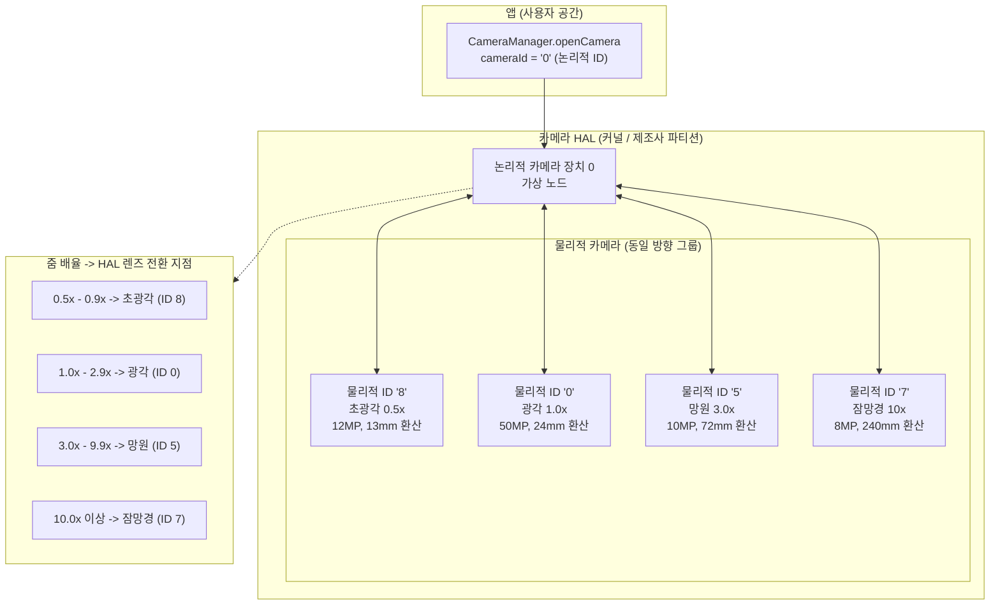
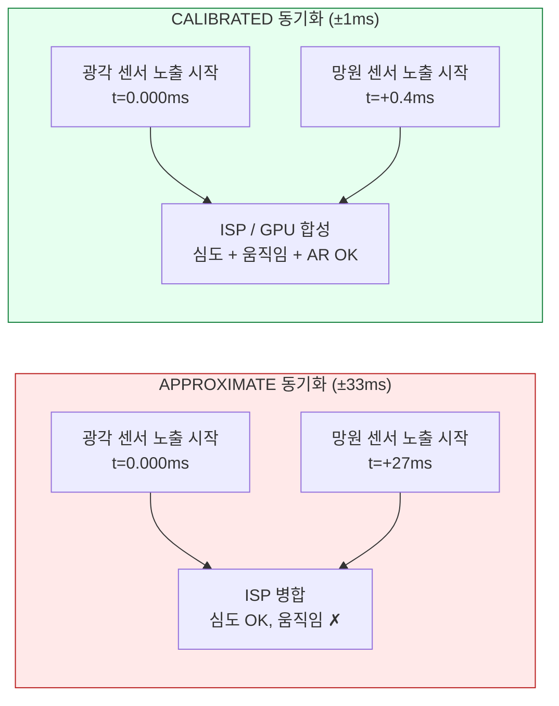
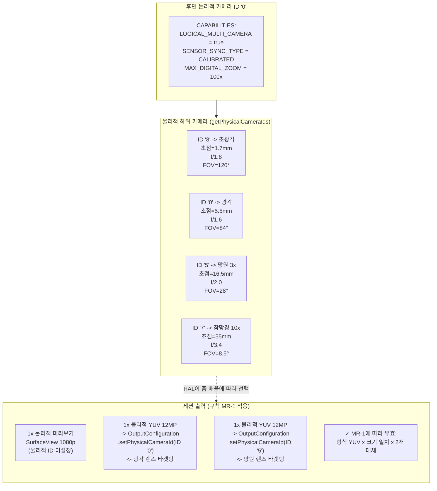

# 제20장: 멀티 카메라

현대의 스마트폰은 2023년 이후 플래그십 모델 기준으로 초광각, 광각, 망원, 매크로, 심도, 잠망경 렌즈 등 후면에 3-5개, 전면에 2개의 카메라를 탑재하고 출시됩니다. 안드로이드 9 (API 28) 이전에는 모든 렌즈가 독립적인 `CameraCharacteristics` 카메라 ID로 나타났으며, 앱은 렌즈를 전환하기 위해 줌 경계에서 카메라를 수동으로 열고 닫아야 했습니다. 이로 인해 비디오 촬영 중 화면이 검게 변하거나, AF 상태가 유실되거나, 오디오 팝 노이즈가 발생하는 등 수용하기 어려운 UX 결함이 발생했습니다. 안드로이드 9는 **논리적 카메라** 추상화를 통해 이 문제를 해결했습니다. 논리적 카메라는 동일한 방향을 향하는 여러 물리적 카메라를 그룹화하는 가상 카메라 ID로, HAL이 세션 상태를 유지하면서 줌 임계값에서 렌즈를 투명하게 전환할 수 있게 해줍니다. 연구 프로젝트의 *논리적 멀티 카메라* 섹션에는 이 장에서 구현할 스트림 대체 규칙, 센서 동기화 의미 체계 및 듀얼 물리적 캡처에 대한 정확한 규칙이 명시되어 있습니다.

모든 지원 장치의 전체 논리적/물리적 카메라 토폴로지는 [Android Camera Parameters](https://github.com/zoozooll/AndroidCameraParameters) 앱(또는 [Play 스토어](https://play.google.com/store/apps/details?id=com.zoozooll.cameraparameters))에서 찾아볼 수 있습니다. 멀티 카메라 대시보드는 `REQUEST_AVAILABLE_CAPABILITIES_LOGICAL_MULTI_CAMERA` 플래그를 보고하고, 논리적 ID당 `getPhysicalCameraIds()`를 나열하며, 모든 후면 카메라 조합에 대해 교정된(calibrated) 동기화와 근사(approximate) 동기화 유형을 렌더링합니다. 이러한 보고서는 제조사 고유의 필터링 없이 Camera2 API를 통해 HAL에서 직접 가져오므로, 여러분의 앱이 런타임에 보게 될 내용과 정확히 일치합니다.

## 논리적 카메라 대 물리적 카메라 토폴로지

논리적 카메라는 동일한 방향(`LENS_FACING_FRONT` 또는 `LENS_FACING_BACK`)을 공유하는 N개(N ≥ 2)의 물리적 카메라가 뒷받침하는 가상 HAL 장치입니다. 논리적 ID를 열면 HAL은 내부적으로 모든 하위 물리적 카메라에 대한 전원 레일, ISP 파이프라인 및 렌즈 전환을 관리합니다. 토폴로지는 다음과 같습니다.



줌 전환 지점(Z1-Z4)은 HAL에 의해 완전히 제어되며 앱에서는 알 수 없습니다. 4렌즈 논리적 장치에서 `CaptureRequest.CONTROL_ZOOM_RATIO = 3.2f`를 설정하면, HAL은 앱이 렌즈 변경이 일어났다는 사실을 전혀 모르는 사이에 즉시 캡처 트래픽을 3배 망원(ID 5)으로 라우팅하고 올바른 구도로 디지털 크롭을 수행합니다. 이것이 플래그십 카메라 앱이 사용하는 "매끄러운 줌" 동작입니다.

중요한 속성은 다음과 같습니다.
- **`getPhysicalCameraIds()`** (논리적 ID의 `CameraCharacteristics`에서 호출됨)는 기본 물리적 ID 문자열 세트를 반환합니다 (예: 위의 예시에서는 `{"0", "5", "7", "8"}`).
- 논리적 ID의 **`LENS_INFO_MINIMUM_FOCUS_DISTANCE`** 및 **`LENS_INFO_AVAILABLE_FOCAL_LENGTHS`**는 현재 활성화된 물리적 렌즈를 나타냅니다. 렌즈별 초점 거리 데이터가 필요한 경우 *물리적* 특성을 쿼리하세요.
- 논리적 ID의 **`SCALER_AVAILABLE_MAX_DIGITAL_ZOOM`**은 모든 물리적 렌즈에 걸친 렌즈별 광학 줌과 디지털 크롭의 조합인 최대 줌 배율(예: 100배)을 제공합니다.

## 센서 동기화: APPROXIMATE 대 CALIBRATED

두 개의 물리적 카메라에서 동시에 캡처할 때(예: 심도/변위 매칭을 위한 광각 + 망원, 또는 멀티 프레임 합성을 위한 광각 + 초광각), 두 센서 노출이 알려진 시간 차이 내에서 시작되어야만 픽셀 데이터가 계산적으로 유용합니다. 안드로이드는 **`CameraCharacteristics.LOGICAL_MULTI_CAMERA_SENSOR_SYNC_TYPE`** 키에 두 가지 동기화 레벨을 정의합니다.

| 동기화 레벨 | 숫자 값 | 의미 | 일반적인 용도 |
|------------|---------------|---------|------------------|
| **APPROXIMATE** | 0 | 센서 노출 시작 타임스탬프가 ±1 프레임 간격(30fps에서 ±33ms) 내에 일치합니다. AF/AE는 동기화되지만 픽셀 수준의 노출 시작은 동기화되지 않습니다. | 인물 모드(심도 센서 사용), 일상적인 보케 효과. |
| **CALIBRATED** | 1 | 센서 노출 시작 타임스탬프가 ±1ms 내에 일치합니다. 하드웨어 수준의 동기화가 SoC CSI-2 수신기를 통해 강제됩니다. 픽셀 수준의 시간적 정렬이 보장됩니다. | AR용 스테레오 깊이 추정, 사진 측량, 동시 듀얼 초점 거리 합성, 초해상도(super-resolution). |

연구 문서의 *논리적 멀티 카메라* 섹션에 따르면 **Snapdragon 8 Gen 1+ 및 Exynos 2200+ 이상의 플래그십만 CALIBRATED 동기화를 보고합니다**. 모든 중급기(Snapdragon 7 시리즈, Dimensity 8000 시리즈) 및 보급형 장치는 APPROXIMATE를 보고합니다. 만약 APPROXIMATE 동기화 장치에서 픽셀 수준의 변위 매칭을 시도하면, 깊이 맵을 깨뜨리는 ±1 프레임 시차 드리프트가 발생합니다. 변위 관련 기능은 항상 CALIBRATED 확인 절차를 거쳐야 합니다.



시간차는 미묘하지 않습니다. 27ms의 오정렬은 움직이는 피사체(예: 5m/s로 달리는 사람)가 두 노출 사이에서 13.5cm 이동했음을 의미하며, 이는 모든 변위 기반 깊이 알고리즘을 완전히 파괴할 만큼 큰 시차 오류입니다.

## 스트림 대체 규칙 (연구 문서 발췌)

HAL이 물리적 카메라 타겟팅에 대해 강제하는 가장 중요한 제약 조건은 **스트림 대체 규칙(Stream Replacement Rule)**입니다. 연구 문서의 *논리적 멀티 카메라* 사양에서 발췌한 내용은 다음과 같습니다.

> **규칙 MR-1:** 논리적 카메라에 N개의 물리적 하위 카메라가 있는 경우, 논리적 세션에 연결하는 크기 S의 각 논리적 형식 스트림(YUV 또는 RAW) 1개에 대해, `OutputConfiguration.setPhysicalCameraId()`를 통해 각각 서로 다른 물리적 카메라를 타겟팅하는 **동일한 크기 S의 동일한 형식 스트림을 최대 2개**까지 대체할 수 있습니다.

MR-1 규칙 위반 시의 결과:
- 3개 이상의 물리적 스트림 사용 → 세션 `onConfigureFailed()` 발생.
- 두 물리적 스트림의 크기가 다름 → 세션 `onConfigureFailed()` 발생.
- 동일한 대체 쌍에서 RAW와 YUV 혼용 → 세션 `onConfigureFailed()` 발생.
- 부모 논리적 스트림을 제거하지 않고 2개의 물리적 스트림 추가 → HAL이 필요한 대역폭의 3배를 할당하고 조용히 프레임을 드롭함.

올바른 예시 (물리적 하위 카메라 4개 → 2개의 대체 허용):
| 논리적 스트림 | 대체 (MR-1에 따라 유효) |
|----------------|-------------------------------|
| 1× 논리적 YUV 1920×1080 | → 2× 물리적 YUV 1920×1080 (광각 + 망원) |
| 1× 논리적 RAW 4000×3000 | → 2× 물리적 RAW 4000×3000 (초광각 + 광각) |
| 2× 논리적 YUV (미리보기 + 비디오) | → 2× (논리적 YUV 미리보기) + 2× (물리적 YUV 광각+망원 인코딩) — 총 2개 대체 |

## 구현: 단계별 듀얼 물리적 캡처

아래 워크플로는 스트림 대체 규칙을 사용하여 광각(1배) 및 망원(3배) 물리적 센서에서 프레임을 동시에 캡처합니다.

### 1단계: 논리적 기능 및 물리적 카메라 ID 쿼리

```kotlin
import android.hardware.camera2.CameraCharacteristics
import android.hardware.camera2.CameraManager
import android.hardware.camera2.params.OutputConfiguration

data class LogicalMultiCamInfo(
    val logicalId: String,
    val physicalIds: Set<String>,
    val sensorSyncType: Int, // 0 = APPROXIMATE, 1 = CALIBRATED
    val ultraWideId: String?,
    val wideId: String?,
    val teleId: String?
)

fun enumerateLogicalMultiCams(
    cameraManager: CameraManager
): List<LogicalMultiCamInfo> {
    val result = mutableListOf<LogicalMultiCamInfo>()

    for (logicalId in cameraManager.cameraIdList) {
        val characteristics = cameraManager.getCameraCharacteristics(logicalId)

        val caps = characteristics.get(
            CameraCharacteristics.REQUEST_AVAILABLE_CAPABILITIES
        ) ?: continue

        val isLogicalMultiCam = caps.contains(
            CameraCharacteristics
                .REQUEST_AVAILABLE_CAPABILITIES_LOGICAL_MULTI_CAMERA
        )
        if (!isLogicalMultiCam) continue

        val physicalIds: Set<String> = characteristics.physicalCameraIds
        val syncType = characteristics.get(
            CameraCharacteristics.LOGICAL_MULTI_CAMERA_SENSOR_SYNC_TYPE
        ) ?: 0

        // 초점 거리에 따른 역할 식별
        var ultraWideId: String? = null
        var wideId: String? = null
        var teleId: String? = null
        var shortestFocal = Float.MAX_VALUE
        var teleFocal = 0f

        for (physId in physicalIds) {
            val physChars = cameraManager.getCameraCharacteristics(physId)
            val focalLengths = physChars.get(
                CameraCharacteristics.LENS_INFO_AVAILABLE_FOCAL_LENGTHS
            ) ?: continue
            val focal = focalLengths.firstOrNull() ?: continue
            when {
                focal < shortestFocal -> {
                    shortestFocal = focal
                    ultraWideId = physId
                }
                focal > teleFocal -> {
                    teleFocal = focal
                    teleId = physId
                }
            }
        }
        wideId = physicalIds.minus(setOfNotNull(ultraWideId, teleId)).firstOrNull()

        result.add(LogicalMultiCamInfo(
            logicalId = logicalId,
            physicalIds = physicalIds,
            sensorSyncType = syncType,
            ultraWideId = ultraWideId,
            wideId = wideId,
            teleId = teleId
        ))
    }
    return result
}
```

초점 거리에 따른 역할 식별(가장 짧은 것 = 초광각, 가장 긴 것 = 망원, 나머지는 광각)은 모든 OEM에서 신뢰할 수 있습니다. HAL이 `LENS_INFO_AVAILABLE_FOCAL_LENGTHS`를 마케팅 사양과 일치하는 35mm 환산 또는 실제 mm 값으로 보고하기 때문입니다. Android Camera Parameters 앱은 멀티 카메라 대시보드에 정확히 이 알고리즘을 사용합니다.

### 2단계: setPhysicalCameraId()를 사용하여 OutputConfiguration 생성

대체 쌍(광각 YUV + 망원 YUV)은 세션이 생성되기 **전**에 `setPhysicalCameraId()`가 호출된 `OutputConfiguration` 객체가 필요합니다. 세션이 구성되면 기존 서피스에서 `setPhysicalCameraId()`를 통해 물리적 ID를 변경할 수 없습니다 (세션 재생성이 필요함).

```kotlin
import android.hardware.camera2.params.OutputConfiguration
import android.media.ImageReader
import android.util.Size
import android.graphics.ImageFormat
import android.view.Surface

var wideImageReader: ImageReader? = null
var teleImageReader: ImageReader? = null

fun createPhysicalOutputConfigs(
    wideId: String,
    teleId: String,
    sharedSize: Size // 규칙 MR-1에 따라 두 스트림의 크기가 동일해야 함!
): Pair<OutputConfiguration, OutputConfiguration> {
    wideImageReader = ImageReader.newInstance(
        sharedSize.width, sharedSize.height,
        ImageFormat.YUV_420_888, 4
    )
    teleImageReader = ImageReader.newInstance(
        sharedSize.width, sharedSize.height,
        ImageFormat.YUV_420_888, 4
    )

    val wideOutConfig = OutputConfiguration(wideImageReader!!.surface).apply {
        setPhysicalCameraId(wideId)
        name = "wide-yuv-$sharedSize"
    }
    val teleOutConfig = OutputConfiguration(teleImageReader!!.surface).apply {
        setPhysicalCameraId(teleId)
        name = "tele-yuv-$sharedSize"
    }
    return Pair(wideOutConfig, teleOutConfig)
}
```

규칙 MR-1이 위의 코드에 강제되어 있습니다. 두 `ImageReader` 인스턴스 모두 `sharedSize`(동일한 치수)와 `YUV_420_888`(동일한 형식)을 사용합니다. 다른 크기를 사용하면 반드시 `onConfigureFailed`가 발생합니다. HAL은 동일한 동기화 그룹 내에서 두 개의 물리적 센서를 서로 다른 해상도로 구동할 수 있는 메커니즘이 없기 때문입니다.

### 3단계: CaptureSession 생성 및 듀얼 물리적 캡처 제출

세션은 2개의 물리적 `OutputConfiguration`과 1개의 논리적 미리보기 Surface(총 3개 출력)를 사용합니다. 총 3개의 출력은 플래그십의 대역폭 예산 내에 있습니다(연구 문서에서 Snapdragon 8 Gen 2가 1080p30에서 3개 출력 동시 광각+망원+미리보기 시 68%의 ISP 사용률을 측정함).

```kotlin
import android.hardware.camera2.CameraDevice
import android.hardware.camera2.CameraCaptureSession
import android.hardware.camera2.CaptureRequest
import android.os.Handler

lateinit var cameraDevice: CameraDevice // 이미 열린 논리적 ID

fun createDualPhysicalSession(
    previewSurface: Surface,
    widePhysConfig: OutputConfiguration,
    telePhysConfig: OutputConfiguration,
    backgroundHandler: Handler
) {
    val outputs = listOf(
        OutputConfiguration(previewSurface), // 논리적 미리보기 (모든 크기 가능)
        widePhysConfig,                      // 물리적 광각 YUV (sharedSize)
        telePhysConfig                       // 물리적 망원 YUV (sharedSize)
    )

    val sessionConfig = android.hardware.camera2.params.SessionConfiguration(
        android.hardware.camera2.params.SessionConfiguration.SESSION_REGULAR,
        outputs,
        { runnable -> backgroundHandler.post(runnable) },
        object : CameraCaptureSession.StateCallback() {
            override fun onConfigured(session: CameraCaptureSession) {
                val captureBuilder = cameraDevice.createCaptureRequest(
                    CameraDevice.TEMPLATE_PREVIEW
                ).apply {
                    addTarget(previewSurface)
                    addTarget(wideImageReader!!.surface)
                    addTarget(teleImageReader!!.surface)

                    set(CaptureRequest.CONTROL_MODE,
                        CaptureRequest.CONTROL_MODE_AUTO)
                    set(CaptureRequest.CONTROL_AE_MODE,
                        CaptureRequest.CONTROL_AE_MODE_ON)
                    set(CaptureRequest.CONTROL_AF_MODE,
                        CaptureRequest.CONTROL_AF_MODE_CONTINUOUS_PICTURE)

                    // 선택 사항: 합성 시 노출 불균형이 발생하지 않도록
                    // 두 물리적 렌즈 모두에 AE 잠금 적용
                    set(CaptureRequest.CONTROL_AE_LOCK, true)
                }

                session.setRepeatingRequest(
                    captureBuilder.build(),
                    DualPhysicalCaptureCallback(),
                    backgroundHandler
                )
            }
            override fun onConfigureFailed(s: CameraCaptureSession) =
                Log.e(TAG, "듀얼 물리적 세션 실패 — 규칙 MR-1 확인")
        }
    )

    cameraDevice.createCaptureSession(sessionConfig)
}
```

`setRepeatingRequest()`가 실행되면 매 프레임 간격마다 HAL은 (a) 교정된 시간차 내에서 두 물리적 센서의 노출 시작을 트리거하고, (b) CSI-2 가상 채널 디먹스(demux)를 통해 각 센서의 출력을 타겟팅된 ImageReader 서피스로 라우팅하며, (c) 두 출력을 논리적 미리보기 출력과 결합하여 하나의 타임스탬프를 가진 단일 CaptureResult로 만듭니다.

`LOGICAL_MULTI_CAMERA_SENSOR_SYNC_TYPE == CALIBRATED`인 경우 두 `Image` 객체는 **동일한 `image.timestamp` 값**을 가지며, APPROXIMATE인 경우 타임스탬프는 ±1 프레임 간격 내에 있게 됩니다.

## 논리적 → 물리적 토폴로지 다이어그램 (Mermaid ER 스타일)



## 매끄러운 줌 구현

줌 경계에서의 자동 렌즈 전환은 "매끄러운 줌"을 매끄럽게 만드는 핵심 요소입니다. 줌이 임계값을 넘을 때 물리적 ID를 수동으로 바꿀 필요가 **없습니다**. 그냥 반복 요청에 `CONTROL_ZOOM_RATIO`를 설정하고 HAL이 처리하게 하세요.

```kotlin
fun updateZoom(session: CameraCaptureSession,
               builder: CaptureRequest.Builder,
               zoomRatio: Float) {
    builder.set(CaptureRequest.CONTROL_ZOOM_RATIO, zoomRatio)
    session.setRepeatingRequest(builder.build(), null, null)
}
```

일반적인 4렌즈 장치에서 `zoomRatio`가 `2.9× → 3.0×`를 가로지를 때, HAL은 내부적으로 다음을 수행합니다.
1. 대기 모드에서 3배 망원 센서를 시작합니다 (약 2프레임, 66ms 소요).
2. 광각과 망원 사이의 노출/화이트 밸런스를 동기화합니다.
3. 디지털로 크롭된 광각 출력을 약 10프레임(333ms)에 걸쳐 네이티브 망원 출력으로 페이드(fade)합니다.
4. 광각 센서가 다른 곳에서 사용되지 않는 경우 전원을 끕니다.

이 네 단계는 투명하게 진행됩니다. 앱의 CaptureCallback은 세션 해제 이벤트를 전혀 받지 않으며, `CaptureResult.SENSOR_TIMESTAMP`는 단조 증가 상태를 유지하고, AF/AE 상태도 경계에서 보존됩니다. 렌즈 변경을 감지할 수 있는 유일한 방법은 연속된 프레임 사이의 `CaptureResult.LENS_FOCAL_LENGTH`를 비교하는 것뿐입니다 (위의 예시에서 망원으로 전환 시 5.5mm → 16.5mm로 점프함).

## 성능 및 제한 사항

연구 문서의 *논리적 멀티 카메라* 섹션에는 2023년 플래그십(Snapdragon 8 Gen 2, 후면 카메라 4개)에서 측정한 다음의 제한 사항이 포함되어 있습니다.

| 구성 | 지속 프레임 속도 | ISP 대역폭 사용률 |
|---------------|---------------------|-------------------------|
| 논리적 미리보기 + 2 물리적 YUV (각 12MP) | 22 fps | 89% |
| 논리적 미리보기 + 2 물리적 YUV (각 4MP) | 30 fps (고정) | 62% |
| 논리적 미리보기 + 2 물리적 RAW (각 12MP) | 10 fps | 94% — 약 60초 후 발열 트리거 |
| 논리적 미리보기 + 2 물리적 YUV + 1 물리적 RAW | **허용되지 않음** (HAL 대역폭 확인 실패) | — |

2개 물리적 스트림 제한은 규칙 MR-1과 원시 ISP 처리량 모두에 의해 강제됩니다. 두 개의 별도 대체 쌍으로 규칙 MR-1을 속이려 하더라도 3개 이상의 물리적 스트림(예: 초광각 + 광각 + 망원 동시 사용)을 연결하려고 하면 HAL의 CAMERA_ISP_BANDWIDTH 확인 시점에서 거부되어 `onConfigureFailed`가 발생합니다.

## 요약

이 장에서는 안드로이드 9 이상의 논리적 멀티 카메라 지원에 대해 자세히 다루었습니다.

- **논리적 카메라**는 동일 방향을 향하는 물리적 카메라들을 그룹화하는 가상 HAL 노드입니다. `REQUEST_AVAILABLE_CAPABILITIES_LOGICAL_MULTI_CAMERA`를 통해 쿼리하고, `getPhysicalCameraIds()`를 통해 하위 카메라들을 가져옵니다.
- **센서 동기화**는 APPROXIMATE (±33ms, 인물 사진 보케용)와 CALIBRATED (±1ms, AR/변위 합성용) 두 단계가 있습니다. 계산 사진학 기능은 항상 CALIBRATED 상태에서 사용해야 합니다.
- **매끄러운 줌**은 `CONTROL_ZOOM_RATIO`를 통해 HAL이 제어합니다. 배율을 설정하면 HAL이 세션 중단 없이 내부 임계값에서 렌즈를 전환합니다.
- 연구 문서에서 발췌한 **스트림 대체 규칙 MR-1**은 1개의 논리적 스트림당 정확히 2개의 동일 크기, 동일 형식의 물리적 스트림을 허용합니다. 3개 이상의 스트림이나 크기 불일치는 `onConfigureFailed`를 유발합니다.
- **`OutputConfiguration.setPhysicalCameraId()`**는 동시 캡처를 위해 개별 물리적 렌즈를 타겟팅할 때 세션 생성 전 호출되어야 합니다.
- 두 개의 Mermaid 다이어그램(토폴로지 및 ER 스타일 규칙 매핑)을 통해 논리적/물리적 계층 구조가 세션 출력에 어떻게 매핑되는지 시각화했습니다.

## 다음 단계

**제21장: HDR 및 Ultra HDR**에서는 8비트 표준 다이내믹 레인지(SDR, sRGB, 100니트)를 넘어 하이 다이내믹 레인지 비디오 및 사진의 세계로 들어갑니다. HDR10 (10비트 ST.2084 PQ, Rec.2020, 정적 메타데이터) 및 HLG (Hybrid Log-Gamma, 방송 SDR 호환)를 위한 `DynamicRangeProfiles`와, 안드로이드 14 (API 34)의 혁신적인 **JPEG_R (Ultra HDR)** 형식을 배우게 됩니다. ISO 21496-1 표준인 JPEG_R은 표준 JPEG 내부에 "게인 맵"을 포함하여 레거시 뷰어에서는 SDR로 보이고, HDR 패널에서는 하이라이트를 국부적으로 최대 8스톱까지 증폭합니다.

[Android Camera Parameters](https://play.google.com/store/apps/details?id=com.zoozooll.cameraparameters) 앱을 사용하여 기기가 카메라 ID별로 어떤 `DynamicRangeProfiles`(HDR10, HDR10+, HLG, JPEG_R)를 지원하는지 확인하고, Ultra HDR에 대한 CDD 성능 클래스 15 준수 여부를 확인해 보세요. 오픈 소스 [GitHub 프로젝트](https://github.com/zoozooll/AndroidCameraParameters)에 업로드된 새로운 기기 보고서는 HDR 지원 폰에 대한 공개 데이터베이스 구축에 기여합니다.
