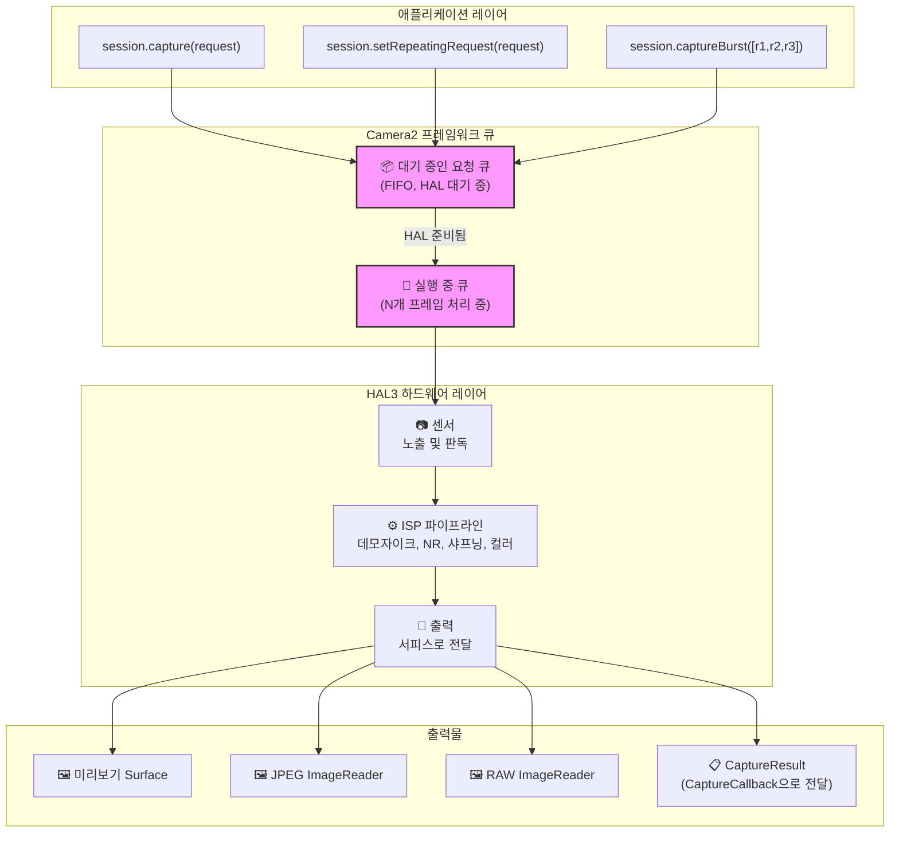
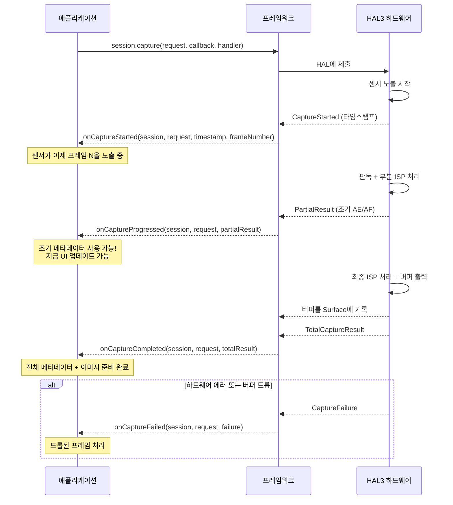
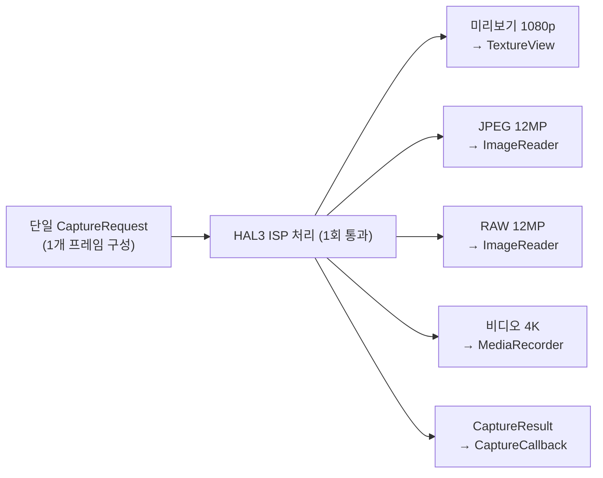
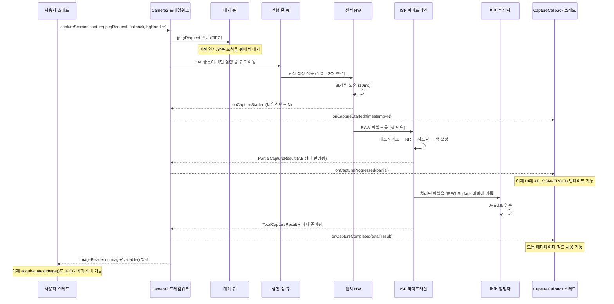

## 10.1 사용에서 이해로

이 시리즈의 이전 장들에서 여러분은 Camera2를 *사용*해 보았습니다: 미리보기를 표시하고, 사진을 찍고, RAW 파일을 다루었습니다. 이제 렌즈를 뒤집어 내부를 살펴볼 시간입니다 — **Camera2는 실제로 어떻게 그 프레임들을 전달할까요?**

파이프라인을 이해하는 것은 단순히 학술적인 일이 아닙니다. 요청이 시스템을 어떻게 통과하는지 알면 다음을 할 수 있습니다.
- 고속 캡처 시 프레임 드롭 진단
- 설정 변경이 나타나기까지 1-2프레임이 걸리는 이유 설명
- 블랙아웃 없는 제로 셔터 랙 연사 촬영 최적화
- 콜백 타이밍에 대한 올바른 멘탈 모델 구축

Android Camera Parameters 앱 ([GitHub](https://github.com/zoozooll/AndroidCameraParameters), [Play Store](https://play.google.com/store/apps/details?id=com.minininja.cameraparams))은 파이프라인 동작을 실시간으로 시각화합니다 — **Frame Timing** 및 **Raw JSON** 탭을 확인하여 이 장의 개념들이 실제 기기에서 어떻게 돌아가는지 확인해 보세요.

## 10.2 핵심 데이터 구조

파이프라인 자체를 보기 전에, 파이프라인을 통과하는 두 가지 객체를 깊이 살펴봅시다: `CaptureRequest` (입력)와 `CaptureResult` (출력).

### CaptureRequest: 불변의 프레임 설계도

`CaptureRequest`는 **단일 프레임에 대한 완전하고 불변인 구성**입니다. 센서, 렌즈 및 ISP가 한 번의 노출을 위해 수행해야 할 *모든 것*을 설명합니다: 센서 노출 시간, ISO, 렌즈 초점 거리, 3A 모드, 출력 타겟, JPEG 품질, 크롭 영역 등입니다.

`CaptureRequest`의 주요 속성:

- **build() 후 불변** — 일단 `.build()`를 호출하면 요청은 고정됩니다. 설정을 변경하려면 새로운 Builder를 만들어야 합니다.
- **빌더 패턴** — `CameraDevice.createCaptureRequest(template)`에서 얻은 `CaptureRequest.Builder`를 통해 생성됩니다.
- **프레임당 독립** — 개별 프레임마다 고유한 요청 객체를 가집니다. 반복 캡처조차 내부적으로는 프레임당 새로운 요청을 (암시적으로) 생성합니다.
- **서피스 타겟팅** — 각 요청은 처리된 이미지 버퍼를 받을 출력 서피스 목록을 명시적으로 나열합니다.

```kotlin
// 빌더 패턴을 사용하여 CaptureRequest 구축
val builder = cameraDevice.createCaptureRequest(CameraDevice.TEMPLATE_STILL_CAPTURE)

// 센서 레벨 파라미터
builder.set(CaptureRequest.SENSOR_EXPOSURE_TIME, 10_000_000L)   // 10ms
builder.set(CaptureRequest.SENSOR_SENSITIVITY, 400)             // ISO 400
builder.set(CaptureRequest.SENSOR_FRAME_DURATION, 33_333_333L)  // 최대 약 30fps

// 렌즈 파라미터
builder.set(CaptureRequest.LENS_FOCUS_DISTANCE, 0.1f)           // 10cm 초점
builder.set(CaptureRequest.LENS_APERTURE, 1.8f)                 // f/1.8

// 3A 제어 모드
builder.set(CaptureRequest.CONTROL_AF_MODE, CaptureRequest.CONTROL_AF_MODE_OFF)
builder.set(CaptureRequest.CONTROL_AE_MODE, CaptureRequest.CONTROL_AE_MODE_OFF)
builder.set(CaptureRequest.CONTROL_AWB_MODE, CaptureRequest.CONTROL_AWB_MODE_OFF)

// 출력 타겟
builder.addTarget(previewSurface)
builder.addTarget(jpegReader.surface)

// 빌드 — 이제 불변입니다!
val request: CaptureRequest = builder.build()

// request.set(...) 호출 시 실패 — 빌드된 객체에는 set()이 없음!
```

:::note
불변성은 파이프라인의 정확성을 위해 매우 중요합니다. HAL이 요청을 비동기적으로 읽기 때문에, 제출 후 요청을 수정할 수 있다면 앱 스레드와 하드웨어 처리 스레드 사이에 경쟁 상태(race condition)가 발생할 수 있습니다.
:::

### CaptureResult: 메타데이터 보고서 (이미지 데이터 아님!)

`CaptureResult`는 처리된 프레임에 대한 **메타데이터 출력**입니다. 결정적으로: **CaptureResult는 이미지 픽셀 데이터를 포함하지 않습니다.** 픽셀은 요청에 추가한 `Surface` 타겟으로 전달되고, `CaptureResult`는 캡처 중에 일어난 *이야기*를 담아 `CaptureCallback`으로 전달됩니다.

`CaptureResult`에서 가장 중요한 필드들은 다음과 같습니다.

| 결과 키 | 타입 | 설명 |
|-----------|------|-------------|
| `SENSOR_EXPOSURE_TIME` | `Long` | 실제로 사용된 노출 시간 (나노초 단위, 요청과 다를 수 있음) |
| `SENSOR_SENSITIVITY` | `Int` | 실제로 적용된 ISO 게인 |
| `SENSOR_TIMESTAMP` | `Long` | 노출 시작 시점의 나노초 타임스탬프 (`SystemClock.elapsedRealtimeNanos()` 기준) |
| `CONTROL_AE_STATE` | `Int` | 자동 노출 상태: INACTIVE, SEARCHING, CONVERGED, LOCKED, FLASH_REQUIRED |
| `CONTROL_AF_STATE` | `Int` | 자동 초점 상태: INACTIVE, PASSIVE_SCAN, ACTIVE_SCAN, FOCUSED_LOCKED, NOT_FOCUSED_LOCKED |
| `CONTROL_AWB_STATE` | `Int` | 자동 화이트 밸런스 상태 |
| `LENS_FOCUS_DISTANCE` | `Float` | 렌즈에 설정된 실제 초점 거리 |
| `SCALER_CROP_REGION` | `Rect` | 디지털 줌에 사용된 실제 크롭 영역 |
| `JPEG_GPS_LOCATION` | `Location` | JPEG에 기록된 GPS 태그 (요청된 경우) |
| `STATISTICS_FACE_DETECT_MODE` | `Int` | 실제로 사용된 얼굴 감지 모드 |

결과 필드는 여러분의 **실제 사실(ground truth)**입니다. `CaptureRequest`는 여러분이 *원했던 것*이고, `CaptureResult`는 하드웨어가 *실제로 한 것*입니다. LEGACY 또는 LIMITED 장치에서는 HAL이 여러분이 요청한 값을 조용히 제한하거나, 반올림하거나, 무시할 수 있는데 — 결과 메타데이터를 통해 이를 감지할 수 있습니다.

```kotlin
val captureCallback = object : CameraCaptureSession.CaptureCallback() {
    override fun onCaptureCompleted(
        session: CameraCaptureSession,
        request: CaptureRequest,
        result: TotalCaptureResult
    ) {
        val timestampNs = result.get(CaptureResult.SENSOR_TIMESTAMP)
        val exposureNs = result.get(CaptureResult.SENSOR_EXPOSURE_TIME)
        val iso = result.get(CaptureResult.SENSOR_SENSITIVITY)
        val aeState = result.get(CaptureResult.CONTROL_AE_STATE)
        val afState = result.get(CaptureResult.CONTROL_AF_STATE)
        val focusDistance = result.get(CaptureResult.LENS_FOCUS_DISTANCE)
        val cropRegion = result.get(CaptureResult.SCALER_CROP_REGION)

        val aeStateStr = when (aeState) {
            CaptureResult.CONTROL_AE_STATE_INACTIVE -> "INACTIVE"
            CaptureResult.CONTROL_AE_STATE_SEARCHING -> "SEARCHING"
            CaptureResult.CONTROL_AE_STATE_CONVERGED -> "CONVERGED"
            CaptureResult.CONTROL_AE_STATE_LOCKED -> "LOCKED"
            CaptureResult.CONTROL_AE_STATE_FLASH_REQUIRED -> "FLASH_REQUIRED"
            else -> "UNKNOWN($aeState)"
        }

        val afStateStr = when (afState) {
            CaptureResult.CONTROL_AF_STATE_INACTIVE -> "INACTIVE"
            CaptureResult.CONTROL_AF_STATE_PASSIVE_SCAN -> "PASSIVE_SCAN"
            CaptureResult.CONTROL_AF_STATE_ACTIVE_SCAN -> "ACTIVE_SCAN"
            CaptureResult.CONTROL_AF_STATE_FOCUSED_LOCKED -> "FOCUSED_LOCKED"
            CaptureResult.CONTROL_AF_STATE_NOT_FOCUSED_LOCKED -> "NOT_FOCUSED_LOCKED"
            else -> "UNKNOWN($afState)"
        }

        Log.d("Pipeline", buildString {
            append("Frame @${timestampNs?.let { it / 1_000_000 } ?: "?"}ms | ")
            append("노출: ${exposureNs?.let { "%.2fms".format(it / 1_000_000.0) } ?: "?"} | ")
            append("ISO: $iso | ")
            append("초점: ${focusDistance?.let { "%.3f".format(it) } ?: "?"} 디옵터 | ")
            append("AE: $aeStateStr | ")
            append("AF: $afStateStr | ")
            append("크롭: ${cropRegion?.width()}x${cropRegion?.height()}")
        })
    }
}
```

:::tip
Android Camera Parameters 앱에서 설정의 **Live Result Logging**을 활성화하고 이 정확한 메타데이터 스트림이 실시간으로 흐르는 모습을 관찰해 보세요. 노출이 안정화되면서 AE_SEARCHING이 AE_CONVERGED로 전환되고, 탭하여 초점을 맞출 때 AF_SCAN이 FOCUSED_LOCKED로 전환되는 것을 볼 수 있습니다.
:::

## 10.3 요청 큐 (The Request Queues)

Camera2는 프레임워크 레벨에서 **2개 큐 파이프라인 모델**을 사용합니다. 이 큐들을 이해하면 여러분이 관찰하는 거의 모든 타이밍 동작을 설명할 수 있습니다.

### 대기 중인 요청 큐 (Pending Request Queue - FIFO)

`session.capture()`, `session.captureBurst()` 또는 `session.setRepeatingRequest()`를 호출할 때, 요청은 즉시 HAL로 전달되지 않습니다. 대신 Camera2 프레임워크가 관리하는 **대기 중인 요청 큐**(Pending Request Queue)에 들어갑니다. 이는 FIFO(First-In, First-Out) 방식입니다.

여기를 "대기실"이라고 생각하세요. 요청들은 HAL이 처리를 위해 새로운 요청을 받을 준비가 될 때까지 여기서 기다립니다.

주요 속성:
- **FIFO 순서** — 제출된 정확한 순서대로 처리됩니다.
- **연사 원자성** — `captureBurst()`의 모든 프레임은 연속적으로 큐에 쌓이며 반복 요청이 중간에 끼어들지 않고 처리됩니다.
- **우선순위 재정의** — 단발성/연사 요청은 큐에서 반복 요청보다 *앞서* 배치됩니다 (반복 요청은 단발성 요청이 완료된 후 자동으로 다시 큐에 들어갑니다).
- **유한함** — 큐는 유한한 깊이(일반적으로 4-8개)를 가지며, 넘치면 에러가 발생합니다.

### 실행 중 큐 (In-Flight Queue)

HAL이 대기 큐에서 요청을 꺼내 센서 판독 / ISP 처리를 시작하면, 해당 요청은 **실행 중 큐**(In-Flight Queue)로 이동합니다. 이 큐에는 현재 하드웨어에 의해 처리 중인 모든 요청이 담겨 있습니다.

실행 중 큐의 깊이(`CameraCharacteristics.REQUEST_PIPELINE_MAX_DEPTH`)는 하드웨어가 동시에 작업할 수 있는 프레임 수를 알려줍니다. 일반적인 FULL 장치에서는 이 값이 3~4이며, 이는 다음을 의미합니다: 프레임 N이 노출되는 동안, 프레임 N-1은 ISP에서 처리 중이고, 프레임 N-2는 메모리에 기록 중이며, 프레임 N-3은 앱으로 반환되는 중입니다. 이것이 각 프레임이 처음부터 끝까지 약 100ms가 걸림에도 불구하고 Camera2가 30fps 이상을 달성할 수 있는 비결입니다.



## 10.4 결과 콜백: CaptureCallback 수명 주기

결과는 `CameraCaptureSession.CaptureCallback`을 통해 돌아옵니다. HAL은 여러 단계에 걸쳐 결과를 반환할 수 있으므로, 전체 프레임이 준비되기 전에 부분적인 메타데이터에 조기에 접근할 수 있습니다.

### 4가지 콜백 메서드

| 메서드 | 호출 시점 | 포함 내용 | 유스케이스 |
|--------|------------|----------|----------|
| `onCaptureStarted` | 센서가 이 프레임에 대한 노출을 *시작*할 때 | 최소 정보: 프레임 번호, 타임스탬프 | 정확한 타이밍 동기화 |
| `onCaptureProgressed` | ISP가 프레임을 부분적으로 처리했을 때 | PartialCaptureResult — 일부 메타데이터 필드 준비됨 | 조기 AE/AF 상태 업데이트 |
| `onCaptureCompleted` | 전체 프레임 완료, 모든 버퍼 전달됨 | TotalCaptureResult — 모든 필드 포함 | 최종 메타데이터 로깅 |
| `onCaptureFailed` | 프레임 드롭 또는 에러 발생 시 | CaptureFailure — 에러 코드, 이유 | 에러 복구 |

### 부분 결과 대 전체 결과 (Partial vs. Total Results)

`PartialCaptureResult`는 ISP가 일부 메타데이터 필드는 계산했지만 전체 파이프라인이 아직 끝나지 않았을 때 반환됩니다. `TotalCaptureResult`는 모든 작업이 끝났을 때 반환됩니다.



```kotlin
val fullPipelineCallback = object : CameraCaptureSession.CaptureCallback() {
    override fun onCaptureStarted(
        session: CameraCaptureSession,
        request: CaptureRequest,
        timestamp: Long,
        frameNumber: Long
    ) {
        super.onCaptureStarted(session, request, timestamp, frameNumber)
        Log.d("Pipeline", "프레임 #$frameNumber 가 ${timestamp / 1_000_000}ms 에 노출 시작됨")
    }

    override fun onCaptureProgressed(
        session: CameraCaptureSession,
        request: CaptureRequest,
        partialResult: CaptureResult
    ) {
        super.onCaptureProgressed(session, request, partialResult)
        val aeState = partialResult.get(CaptureResult.CONTROL_AE_STATE)
        val afState = partialResult.get(CaptureResult.CONTROL_AF_STATE)
        Log.v("Pipeline", "부분 결과: AE=$aeState AF=$afState")
    }

    override fun onCaptureCompleted(
        session: CameraCaptureSession,
        request: CaptureRequest,
        result: TotalCaptureResult
    ) {
        super.onCaptureCompleted(session, request, result)
        val totalFrames = result.frameNumber
        Log.d("Pipeline", "프레임 #$totalFrames 완료됨")
    }

    override fun onCaptureFailed(
        session: CameraCaptureSession,
        request: CaptureRequest,
        failure: CaptureFailure
    ) {
        super.onCaptureFailed(session, request, failure)
        val reason = when (failure.reason) {
            CaptureFailure.REASON_ERROR -> "내부 에러"
            CaptureFailure.REASON_FLUSHED -> "abortCaptures()에 의해 플러시됨"
            else -> "알 수 없음 (${failure.reason})"
        }
        Log.e("Pipeline", "프레임 #${failure.frameNumber} 실패: $reason. 이미지 캡처됨: ${failure.wasImageCaptured()}")
    }
}
```

## 10.5 파이프라인 내부: 상태 비보존, 순차적, 비동기, 다중 출력

Camera2가 노출하는 HAL3 파이프라인 모델은 네 가지 정의적인 특성을 가집니다. 이를 내면화하면 Camera2의 대부분의 "이상한" 동작들을 갑자기 이해할 수 있게 될 것입니다.

### 1. 상태 비보존 (Statelessness)

하드웨어는 **요청 사이의 기억이 없습니다**. 모든 `CaptureRequest`는 자기 완비적(self-contained)이어야 합니다 — 즉, 이전 프레임에서 변경한 것뿐만 아니라 *모든 설정*을 포함해야 합니다.

이는 다음을 의미합니다:
- 프레임 N에서 `SENSOR_EXPOSURE_TIME`을 설정하고 프레임 N+1에서 이를 *누락*하면, 템플릿 기본값으로 돌아갑니다.
- 반복 요청은 "재정의 세트"가 아닙니다 — 프레임워크에 의해 매 프레임마다 전체가 다시 생성되고 다시 제출됩니다.
- HAL 레벨에는 "한 번 설정하고 잊어버리는 것"이 없습니다.

```kotlin
// 🔴 잘못됨: 설정이 유지될 것으로 기대함
session.setRepeatingRequest(requestWithExposure10ms, callback, handler)
// 나중에: AF 트리거만 변경하고 노출 재설정을 잊음
val triggerBuilder = cameraDevice.createCaptureRequest(CameraDevice.TEMPLATE_PREVIEW)
triggerBuilder.set(CaptureRequest.CONTROL_AF_TRIGGER, CaptureRequest.CONTROL_AF_TRIGGER_START)
triggerBuilder.addTarget(previewSurface)
session.capture(triggerBuilder.build(), callback, handler)
// 🐛 이 단발성 프레임의 노출은 TEMPLATE_PREVIEW 기본값으로 돌아가버립니다!

// ✅ 올바름: 모든 요청은 자기 완비적임
val triggerBuilder = cameraDevice.createCaptureRequest(CameraDevice.TEMPLATE_PREVIEW)
triggerBuilder.set(CaptureRequest.SENSOR_EXPOSURE_TIME, 10_000_000L)
triggerBuilder.set(CaptureRequest.CONTROL_AF_TRIGGER, CaptureRequest.CONTROL_AF_TRIGGER_START)
triggerBuilder.addTarget(previewSurface)
session.capture(triggerBuilder.build(), callback, handler)
```

### 2. 순차적 처리 (Sequential Processing)

단일 논리적 카메라 스트림 내에서 요청은 **FIFO 순서로 한 번에 하나씩** 처리됩니다. 요청 재정렬이나 병렬 요청 평가가 없습니다. 만약 프레임 50이 큐에서 프레임 49 뒤에 있다면, 프레임 50은 프레임 49가 노출을 마칠 때까지 기다려야 합니다. 비록 프레임 50이 처리하기에 "더 빠르더라도" 말이죠.

이것이 연사 촬영이 공백 없는 연속된 프레임을 생성하는 이유입니다: 연사의 N개 요청은 반드시 연달아 실행되는 것이 보장됩니다.

### 3. 비동기 결과 (Asynchronous Results)

요청을 제출한 스레드는 **절대로** 결과를 받는 스레드가 아닙니다. 결과는 여러분이 제공한 `Handler` 스레드(또는 `null`을 전달했다면 바인더 스레드)로 전달됩니다.

실무적 결과: **동기화 없이 콜백에서 공유 가변 상태에 접근하지 마세요.** 캡처 버튼 클릭 시점과 콜백 시점 양쪽에서 `latestExposure`를 읽고 쓰는 것은 흔한 버그입니다.

### 4. 요청당 다중 출력 (Multiple Outputs Per Request)

하나의 요청 → 많은 출력. 단일 `CaptureRequest`는 2개, 3개 또는 4개 이상의 `Surface` 타겟을 동시에 대상으로 할 수 있습니다.

- **미리보기 SurfaceTexture** (표시용)
- **JPEG ImageReader** (스틸 캡처용)
- **RAW ImageReader** (DNG용)
- **MediaRecorder Surface** (비디오 인코딩용)
- **Allocation Surface** (RenderScript/ML 처리용)

HAL은 단일 센서 판독물을 여러 ISP 브랜치를 통해 라우팅하여 각 출력 형식을 생성할 책임이 있습니다. 캡처를 중복으로 하지 않습니다. 타겟을 선언하면 하드웨어가 팬아웃(fan-out)합니다.



## 10.6 처음부터 끝까지: 한 프레임 추적하기

모든 것을 하나로 묶어 단일 JPEG 캡처 요청이 전체 파이프라인을 통과하는 과정을 추적해 봅시다.



## 10.7 파이프라인 작동 확인하기

Android Camera Parameters 앱 ([GitHub](https://github.com/zoozooll/AndroidCameraParameters), [Play Store](https://play.google.com/store/apps/details?id=com.minininja.cameraparams))에는 현재 대기 큐 깊이, 실행 중 큐 깊이 및 프레임별 타임스탬프를 오버레이하는 **Pipeline Visualizer** 디버그 뷰가 포함되어 있습니다. 앱을 열고 설정에서 **Developer Mode**를 활성화한 후, 카메라를 선택하고 **Pipeline** 탭으로 이동하여 다음을 확인하세요.

- 얼마나 많은 요청이 대기 중이고 실행 중인지
- 시작(started)부터 완료(completed)까지의 프레임별 지연 시간
- 프레임당 부분 결과 수 (`onCaptureProgressed` 호출 횟수)
- 실패 이유가 포함된 드롭된 프레임들

이 탭은 이 장의 개념들에 대한 직관을 기르는 가장 좋은 방법입니다.

## 10.8 요약

| 개념 | 핵심 내용 |
|---------|-------------|
| **CaptureRequest** | 불변의 프레임별 설계도. 빌더로 생성. 모든 설정을 포함해야 함 (유지 안 됨). |
| **CaptureResult** | 메타데이터 전용 (픽셀 없음). 하드웨어가 *실제로 한 일*에 대한 증거. AE/AF 상태, 노출, 크롭 확인. |
| **대기 큐** | FIFO 대기실. 연사는 연속성 유지. 단발성이 반복 요청보다 앞섬. |
| **실행 중 큐** | 현재 처리 중인 요청들. 깊이 = 파이프라인 최대 깊이. FULL 장치에서 보통 3-4프레임. |
| **CaptureCallback** | 4단계: started → progressed → completed (또는 failed). 부분 결과 대 전체 결과. |
| **상태 비보존** | 하드웨어는 기억이 없음. 매 요청마다 관심 있는 모든 설정을 포함해야 함. |
| **순차성 + 비동기성** | FIFO 순서 보장. 제출한 스레드와 다른 스레드에서 콜백 수신. |
| **다중 출력** | 하나의 요청 → 많은 Surface (미리보기 + JPEG + RAW + 비디오 동시 처리). |

## 다음 단계

[제11장: 캡처 유형](capture-types.md)에서는 이 파이프라인에 요청을 제출하는 세 가지 방법 — 단발성, 연사, 반복 — 과 각각의 사용 시점에 대해 알아봅니다. 또한 일반적인 유스케이스에 맞춰 합리적인 기본값을 미리 구성해 주는 내장 템플릿(`TEMPLATE_PREVIEW`, `TEMPLATE_STILL_CAPTURE` 등)도 살펴봅니다.
