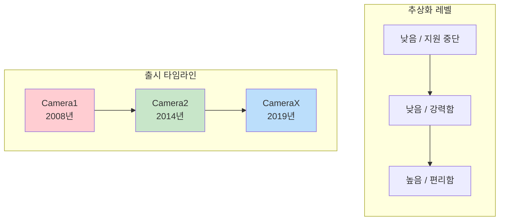
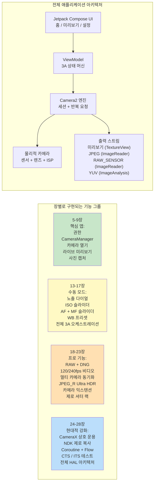

# 제1장: 안드로이드 Camera2를 환영합니다

> **장 개요:** 이 첫 장에서는 한 걸음 물러나 큰 그림을 살펴봅니다. Camera2는 왜 존재할까요? 이전의 Camera API 및 최신 CameraX 라이브러리와 비교하여 어떤 문제를 해결할까요? 누가 Camera2를 배우는 데 시간을 투자해야 할까요? 그리고 가장 중요한 것은, 이 시리즈가 끝날 때쯤 여러분이 실제로 무엇을 만들게 될까요? 아직 깊이 있는 아키텍처나 HAL 레이어, 파이프라인 다이어그램은 다루지 않습니다. 개발자가 시작하기 전에 궁금해하는 질문들에 대한 명확한 답변만 제공합니다.

***

## 1.1 왜 Camera2인가요?

스마트폰을 꺼내보세요.

뒷면을 보세요. 아마 두 개, 세 개, 혹은 그 이상의 카메라 렌즈가 보일 것입니다. 그 작은 직사각형 돌출부에는 2000년대 중반의 전문가용 DSLR보다 더 강력한 광학 및 실리콘 파워가 담겨 있습니다.

이제 기본 카메라 앱을 열어보세요.

셔터를 누릅니다. 즉시 고해상도 사진이 갤러리에 저장됩니다. 실내 조명에서도 선명한 피사체, 매끄러운 배경 흐림, 밝은 그림자 등 사진이 아주 훌륭해 보일 것입니다.

하지만 여러분이 사용하는 카메라 앱은 하드웨어가 할 수 있는 일의 극히 일부분만 활용하고 있을 뿐입니다. 그 친숙한 셔터 버튼 아래에는 믿을 수 없을 정도로 정교한 이미징 파이프라인이 숨겨져 있습니다. RAW 사진을 촬영하거나, 240fps 슬로우 모션 비디오를 녹화하거나, 단 한 번의 야간 촬영을 위해 10개의 프레임을 합성하거나, 렌즈 움직임의 매 미크론을 독립적으로 제어할 수 있는 파이프라인입니다.

대부분의 타사 안드로이드 앱은 이러한 성능에 액세스하지 못합니다. 왜일까요? **이전의 안드로이드 카메라 API(소급하여 Camera1이라고 함)가 매우 제한적이었기 때문입니다.** Camera1은 기본적인 사진 및 비디오 캡처 기능이 있는 단일 카메라 폰 시대를 위해 설계되었습니다. 다음과 같은 작업이 불가능했습니다.

- 노출 시간이나 ISO 수동 제어
- RAW 센서 데이터 캡처
- 높은 프레임 속도로 슬로우 모션 녹화
- 여러 카메라 동시 사용
- 캡처 도중 프레임별 메타데이터 액세스
- 안정적인 연속 촬영(Burst)

안드로이드 5.0 (API 레벨 21)부터 구글은 이러한 장벽을 허물기 위해 **Camera2 (android.hardware.camera2)**를 도입했습니다. Camera2는 점진적인 업데이트가 아니라, 현대적인 카메라 실리콘의 원시 기능을 모든 안드로이드 개발자에게 노출하기 위해 처음부터 다시 설계된 **완전한 재설계**입니다.

한마디로: **Camera2는 스마트폰 카메라가 전문가 수준으로 발전했음에도 이전 API가 이를 따라가지 못했기 때문에 존재합니다.**

***

## 1.2 Camera1 대 Camera2 대 CameraX

10년 이상의 안드로이드 카메라 개발 역사를 통해 **세 세대**의 카메라 API가 탄생했습니다. 코드를 한 줄이라도 쓰기 전에 어떤 API가 어떤 문제를 해결하는지 이해하는 것이 필수적입니다.

### 세 세대, 세 가지 철학

### Camera1 — `android.hardware.Camera`

안드로이드 1.0과 함께 도입되었고 **안드로이드 5.0에서 지원 중단**된 최초의 카메라 API입니다.

- **모델:** 절차적 명령. `startPreview()`, `takePicture()`, `setFlashMode()`와 같은 메서드를 호출합니다.
- **설계 철학:** "카메라는 당신이 명령하는 상태 머신이다."
- **용도:** 아주 오래된 장치(Lollipop 이전)를 대상으로 하는 레거시 앱. 그게 전부입니다.
- **피해야 하는 이유:** 구글은 더 이상 이를 업데이트하지 않습니다. 새로운 하드웨어 기능(멀티 카메라, RAW, HDR)은 Camera1로 백포트되지 않습니다. API 표면이 매우 작습니다. 최신 장치에서 Camera1은 내부적으로 **Camera2 래퍼에 의해 에뮬레이션**되므로, Camera2의 이점 없이 복잡성만 감수하게 됩니다.

### Camera2 — `android.hardware.camera2.*`

안드로이드 5.0에서 도입되어 이후 모든 안드로이드 버전을 통해 지속적으로 확장된 현대적인 로우 레벨 프레임워크입니다.

- **모델:** 요청/응답 파이프라인. 불변의 `CaptureRequest` 객체를 빌드하여 `CameraCaptureSession`에 제출하고, `CaptureResult` 메타데이터 + 이미지 버퍼를 비동기적으로 받습니다.
- **설계 철학:** "카메라는 프로그래밍 가능한 파이프라인이다. 당신은 모든 프레임의 모든 파라미터를 제어한다."
- **용도:** 고급 카메라 앱, 수동 촬영 도구, 컴퓨터 비전 파이프라인, RAW 캡처, 멀티 카메라 연구, 고속 비디오 등 하드웨어에 근접한 제어가 필요한 모든 사례.
- **사용해야 하는 이유:** OEM HAL이 노출하는 모든 기능에 대한 전체 액세스. 직접적인 프레임 제어. 전문가용 기능을 위한 유일한 API 경로. CameraX가 내부적으로 호출하는 것이 바로 Camera2입니다.

### CameraX — `androidx.camera.*`

2019년에 베타로 도입되어 안드로이드 11 즈음에 안정화된 **Jetpack 라이브러리**(플랫폼 API 아님)입니다.

- **모델:** 선언적 유스케이스. `Preview`, `ImageCapture`, `ImageAnalysis` 또는 `VideoCapture` 유스케이스 세트를 `bindToLifecycle()`하면 나머지는 라이브러리가 처리합니다.
- **설계 철학:** "우리가 10,000가지의 예외 케이스를 해결해 놓았습니다. 어떤 출력이 필요한지만 알려주세요."
- **용도:** 카메라가 필요한 대부분의 애플리케이션. QR/바코드 스캐너, 사진 업로드, 문서 스캔, 단순 비디오 녹화 등 편의성과 신뢰성이 원시적인 제어보다 중요한 모든 시나리오.
- **사용해야 하는 이유:** 수명 주기 인식(리소스 누수 없음), 해상도 선택 자동화, OEM 특이사항에 대한 내장된 해결 방법 제공. 동일한 코드가 `if` 문 없이 수천 개의 기기 모델에서 실행됩니다.

### 나란히 비교

| 비교 항목 | Camera1 | Camera2 | CameraX |
|:---|:---|:---|:---|
| **도입** | 안드로이드 1.0 (2008) | 안드로이드 5.0 (2014) | 안드로이드 10 (Jetpack) |
| **상태** | 지원 중단 | 활성, 유지 관리 중 | 권장 (Jetpack) |
| **추상화** | 낮음 (레거시) | 낮음 | 높음 |
| **학습 곡선** | 쉬움 | 매우 가파름 | 매우 완만함 |
| **수동 노출 / ISO / 초점** | 제한적 | 전체 제어 | 상호 운용성을 통해 제한적 |
| **RAW 캡처** | 아니요 | 예 | 상호 운용성 해결 방법을 통해 가능 |
| **멀티 카메라 (물리적 스트림)** | 아니요 | 예 | 아니요 |
| **고속 비디오 (120+ fps)** | 아니요 | 예 | 제한적 |
| **연속 촬영 / 브래키팅** | 아니요 | 전체 제어 | 아니요 |
| **프레임별 메타데이터** | 아니요 | 예, 전체 + 부분 결과 | 상호 운용성 콜백을 통해 노출 |
| **수명 주기 안전성** | 수동, 오류 발생 쉬움 | 수동, 오류 발생 쉬움 | 자동, 수명 주기와 결합 |
| **OEM 특이사항 처리** | 없음 | 없음 | 기본 내장 (1000개 이상의 기기 테스트) |
| **작동하는 앱을 위한 코드량** | 중간 | 매우 많음 (장황함) | 매우 적음 |
| **성능** | 보통 (간접 래퍼) | 최대 가능 | 최대에 가까움 (얇은 오버헤드) |

***

## 1.3 Camera2는 무엇을 할 수 있나요?

Camera2의 위력을 구체적으로 이해하기 위해 플래그십 폰에서 보았던 기능들을 상상해 보세요. Camera2는 **이 모든 기능을 프로그래밍 방식으로 액세스 가능하게** 만듭니다.

### 전문가 수준의 캡처

- **전체 수동 노출:** 셔터 속도를 1/8000초에서 30초까지, ISO를 50에서 102,400까지 설정하세요. 실제 Pro 모드 UI를 구축할 수 있습니다.
- **RAW 사진 촬영:** 센서에서 직접 10비트, 12비트, 14비트 또는 16비트의 **처리되지 않은 Bayer 데이터**를 추출하세요 (데모자이킹, 노이즈 감소, 색상 교정 없음). 번들로 제공되는 `DngCreator`를 사용하여 라이트룸 편집용 Adobe DNG 파일을 작성하세요.
- **노출 브래키팅:** 정밀하게 단계별 EV 값을 적용하여 3, 5, 7 또는 9개의 프레임을 촬영하세요. 이를 HDR 합성 알고리즘에 입력할 수 있습니다.
- **타임랩스 잠금:** **수천 개의 프레임**에 걸쳐 노출, 초점, 화이트 밸런스를 고정하세요. 태양이 움직이거나 구름이 지나가도 깜빡임이 없습니다.

### 계산 사진학(Computational Photography) 하드웨어 액세스

- **고속 비디오:** 120fps, 240fps 또는 960fps 캡처를 위해 `CameraConstrainedHighSpeedCaptureSession`을 구성하세요. 슬로우 모션 편집기를 구축할 수 있습니다.
- **논리적 멀티 카메라:** 논리적 멀티 카메라 ID 아래에 있는 **두 개의** 물리적 카메라에 **동시에** 액세스하세요. 광각 및 망원 렌즈에서 동기화된 YUV 프레임을 가져와 기기에서 깊이 맵을 계산할 수 있습니다.
- **YUV / PRIVATE 재처리 (LEVEL_3 기기):** **ISP에 전체 해상도 순환 버퍼**를 유지한 다음, 셔터를 누를 때 과거의 프레임을 가져와 강력한 노이즈 감소 및 샤프닝을 다시 실행하세요. 이것이 OEM이 **제로 셔터 랙 (ZSL)**을 구현하는 방식입니다.
- **Ultra HDR / JPEG_R (안드로이드 14+):** 8비트 SDR JPEG와 보조 HDR 게인 맵을 저장하는 `ImageFormat.JPEG_R` 파일을 요청하고 작성하세요. 레거시 뷰어에서는 일반 사진으로 보이고, HDR 패널에서는 1,000니트 이상의 하이라이트를 렌더링합니다.
- **카메라 익스텐션 (안드로이드 12+):** 야간, 보케(인물 사진), HDR, 얼굴 보정 모드를 **OEM HAL에 위임**하세요. 순정 카메라 앱이 사용하는 것과 동일한 멀티 프레임 AI 파이프라인을 사용합니다.

### 고급 비디오 및 비전 파이프라인

- **멀티 스트림 동시 출력:** 단일 캡처 요청으로 **미리보기** Surface, **YUV 분석** Surface (30fps로 실행되는 ML 객체 감지용), **JPEG 스틸** Surface를 동시에 구동하세요. 메모리 복사 없이 가능합니다.
- **플래시 타이밍 정밀도:** 프레임별로 예비 플래시 측광, 메인 플래시 발광 및 롤링 셔터 판독을 명시적으로 조정하세요.
- **부분 캡처 결과:** 최종 이미지 버퍼가 준비되기 **수 밀리초 전**에 AE 상태 및 초점 거리 메타데이터를 받으세요. "어디든 누르면 UI가 즉시 업데이트되는" 응답성을 제공합니다.
- **오프라인 세션 (API 30+):** 사용자가 야간 모드 도중에 앱을 백그라운드로 보내면, 진행 중인 멀티 프레임 병합을 격리된 `CameraOfflineSession`으로 넘기세요. HAL이 비동기적으로 처리를 완료하고, 앱은 최종 사진과 함께 다시 시작됩니다.

### 그리고 이것은 시작에 불과합니다

안드로이드의 새 버전이 나올 때마다 Camera2는 확장됩니다. 안드로이드 15 (API 35)에는 `CameraDeviceSetup`이 추가되어 **센서에 전원을 켜지 않고도** 세션 구성을 조사할 수 있게 되었으며, 기능 확인 대기 시간이 10배 단축되었습니다. 이 API는 살아있고 진화하며 항상 최신 카메라 하드웨어보다 한 발 앞서 나갑니다.

***

## 1.4 누가 Camera2를 배워야 할까요?

Camera2를 제대로 배우는 데는 시간이 걸립니다. 300개 이상의 메타데이터 키, 수십 개의 콜백, 여러 세션 유형, 수백 개의 OEM 예외 케이스 등 API 표면이 엄청나게 넓습니다. 다음 중 본인이나 본인의 프로젝트에 해당하는 내용이 있다면 그 시간을 투자할 가치가 충분합니다.

### 고급 카메라 애플리케이션을 구축하고 있는 경우

앱에서 수동 ISO/셔터/초점/WB 다이얼이 있는 **Pro 모드**를 제공하거나, **RAW 사진**을 캡처하여 사용자가 데스크톱에서 편집할 수 있도록 내보내거나, **슬로우 모션 비디오**를 녹화하는 경우입니다. 이러한 기능들은 CameraX로는 불가능하거나 심각하게 제약이 따릅니다.

### 컴퓨터 비전 또는 연구용 애플리케이션을 구축하고 있는 경우

기기 내 ML 파이프라인에 공급할 **복사 없는 최저 지연 시간의 YUV 프레임**이 필요하거나, **프레임 고정 센서 데이터**가 필요한 경우입니다 (정확한 SLAM / 시각 관성 오도메트리를 위해 `SENSOR_TIMESTAMP`의 자이로 타임스탬프가 이미지와 ±1ms 이내로 일치해야 함). 또는 구조광 / 깊이 감지를 위해 **프레임당 정확한 셔터 지속 시간**을 제어해야 하는 경우입니다.

### 카메라 기능 진단 도구를 구축하고 있는 경우

이 시리즈의 동반 앱인 **Android Camera Parameters** ([GitHub](https://github.com/zoozooll/AndroidCameraParameters), [Google Play](https://play.google.com/store/apps/details?id=com.minininja.cameraparams))처럼, 각 장치가 무엇을 지원하는지 시각화하기 위해 모든 `CameraCharacteristics` 키를 철저하게 덤프해야 하는 경우입니다. CameraX는 의도적으로 이러한 세부 사항의 대부분을 숨깁니다.

### CameraX 또는 OEM 카메라 문제를 디버깅하고 있는 경우

CameraX도 가끔 생소한 장치에서 오작동할 수 있습니다. CameraX 미리보기가 늘어져 보이거나, 특정 갤럭시 모델에서 야간 모드 시 녹색 프레임이 반환되거나, 픽셀 9에서 `VideoCapture` 시 충돌이 발생하는 경우, 버그를 재현하고 격리하기 위해 **반드시** Camera2로 내려가야 합니다.

### 모바일 이미징, OEM 카메라 스택 또는 자동차 카메라 파이프라인 분야에서 일하는 경우

공급업체 HAL 코드, `frameworks/av/camera`, Camera NDK 또는 자동차용 EVS→Camera2 마이그레이션을 다루는 경우 Camera2 능숙도는 기본 소양입니다.

### Camera2를 배울 필요가 **없는** 사람은 누구인가요?

요구 사항이 *"사용자가 프로필 사진을 찍거나 QR 코드를 스캔할 수 있게 해야 함"* 이라면 **CameraX를 사용하세요**. 진심입니다. CameraX는 엔지니어링의 걸작입니다. 기기 호환성 작업에 소요될 수개월의 시간을 아껴줄 것입니다. Camera2는 강력한 도구이므로, 그 강력함이 구체적으로 필요할 때 선택하세요.

***

## 1.5 이 책을 통해 무엇을 만들게 될까요?

코드 없는 이론은 추상적이고, 진행 단계 없는 코드는 혼란스럽습니다.

이 책을 진행하는 동안 여러분은 **실제로 작동하는 완전한 기능의 Camera2 애플리케이션을 점진적으로 구축**하게 됩니다. 각 장에서 기능을 하나씩 추가하며, 모든 기능은 실제 폰에서 컴파일되고 실행됩니다. 마지막 장에 이르면 다음과 같은 완전한 앱을 조립하게 될 것입니다.

### 주요 마일스톤

| 장 범위 | 완료 후 할 수 있는 일 |
|:---|:---|
| **1-4장** | 하드웨어를 이해합니다. 렌즈, 센서, ISP가 어떻게 상호 작용하는지 압니다. 어떤 폰의 사양표를 보고도 어떤 Camera2 기능을 지원하는지 알 수 있습니다. Android Camera Parameters 동반 앱을 설치하고 자신의 기기를 탐색해 보았습니다. |
| **5-9장** | **작동하는 카메라 앱**을 갖게 됩니다. 후면 카메라를 열고, 화면에 라이브 미리보기를 표시하고, 셔터 버튼을 누르면 JPEG 사진을 저장합니다. 전체 화면 비율 보정, 올바른 세로 회전, 적절한 수명 주기 정리가 모두 작동합니다. |
| **10-12장** | 코드가 왜 그렇게 작동하는지 이해합니다. 캡처 요청이 대기 큐, 실행 큐, HAL을 거쳐 다시 결과로 나오는 과정을 추적할 수 있습니다. 실제 하드웨어 레벨과 보고된 기능에 따라 기능을 제한하는 방법을 압니다. |
| **13-17장** | 앱에 **완전한 Pro 모드**가 생깁니다. 수동 ISO, 셔터, 초점 거리, WB 색온도 다이얼을 갖춥니다. 라이브 히스토그램 / EV 판독 기능이 포함됩니다. OEM 순정 카메라가 완벽한 결과를 얻는 방식과 동일한 'AF 트리거 → AE 프리캡처 → 캡처' 시퀀스를 구현합니다. |
| **18-23장** | 앱이 이제 **플래그십 급**이 됩니다. RAW+JPEG를 동시에 저장하고, 120fps 슬로우 모션 비디오를 녹화하며, 인물 모드 깊이 측정을 위해 듀얼 물리적 YUV 스트림을 캡처할 수 있습니다. Ultra HDR JPEG_R 파일을 작성하고, 보케 및 야간 모드를 카메라 익스텐션에 위임하며, LEVEL_3 기기에서 제로 셔터 랙 재처리를 구현합니다. |
| **24-28장** | 여러분은 **시니어 안드로이드 카메라 엔지니어**입니다. 앱의 90%에는 상호 운용성을 통해 CameraX를 적용하고, 나머지 10%의 특수 기능에는 Camera2를 사용할 수 있습니다. 제로 복사 기능이 있는 NDK 네이티브 카메라 파이프라인을 작성할 수 있습니다. 깨끗하고 테스트 가능한 코드를 위해 모든 콜백을 Kotlin Coroutines와 Flow로 래핑합니다. CTS ITS를 통과하는 카메라 테스트 작성 방법을 이해합니다. 그리고 '앱 → 프레임워크 → 바인더 → 네이티브 → HAL → 커널 → 하드웨어'로 이어지는 전체 스택을 화이트보드에 그릴 수 있습니다. |
| **29장 (백과사전)** | 29개의 가장 중요한 `CameraCharacteristics` 키에 대한 **데스크탑 참조서**를 갖게 됩니다. 각 키는 근거, Kotlin 쿼리, Android Camera Parameters 포인터, OEM 함정과 함께 설명됩니다. 이 장은 프로덕션 코드를 출시할 때 항상 열어두게 될 것입니다. |

이것은 정말 드문 기술 세트입니다. 여정을 시작해 봅시다.

***

## 1.6 요약

- **Camera2**는 현대적인 멀티 카메라와 강력한 ISP를 갖춘 스마트폰의 모든 기능을 노출하기 위해 안드로이드 5.0에서 도입된 최신 로우 레벨 카메라 프레임워크입니다.
- **Camera1**은 지원이 중단되었습니다. **CameraX**는 대부분의 유스케이스에 편리하지만 Camera2만이 노출하는 강력한 기능을 숨깁니다. 요구 사항에 따라 선택하세요.
- Camera2는 **수동 제어, RAW 사진, 고속 비디오, 논리적 멀티 카메라, YUV 재처리/ZSL, Ultra HDR, OEM 익스텐션**, 그리고 **오프라인 세션** 기능을 제공합니다.
- 전문 사진 도구, 비전/연구 파이프라인, 진단 앱을 빌드하거나 더 깊은 레이어를 디버깅할 때 Camera2에 투자하세요.
- 이 책을 통해 여러분은 **기능이 풍부한 Camera2 애플리케이션을 단계별로 구축**하게 됩니다. 9장의 버튼 하나짜리 카메라에서 시작하여, 23장의 플래그십급 이미징 도구로 발전하고, 28장의 현대적인 안드로이드 패턴으로 강화될 것입니다.

## 1.7 다음 단계

Camera2 코드를 한 줄이라도 쓰기 전에, 우리가 명령을 내릴 하드웨어를 이해해야 합니다. **제2장: 스마트폰 카메라 이해하기**에서는 렌즈, 이미지 센서, ISP 등 폰 카메라 모듈의 각 부품이 실제로 어떤 역할을 하는지, 그리고 가공되지 않은 빛이 어떻게 압축된 JPEG가 되는지 배우게 됩니다. 마지막에는 상자에 적힌 "48MP"라는 라벨이 실제 이미지 품질에 대해 거의 아무것도 알려주지 않는 이유를 알게 될 것입니다.
