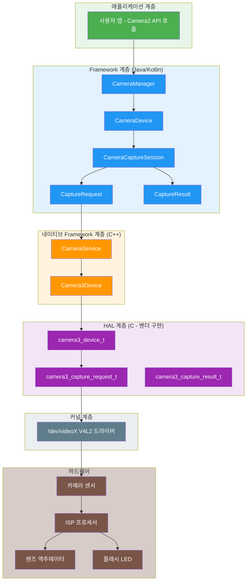
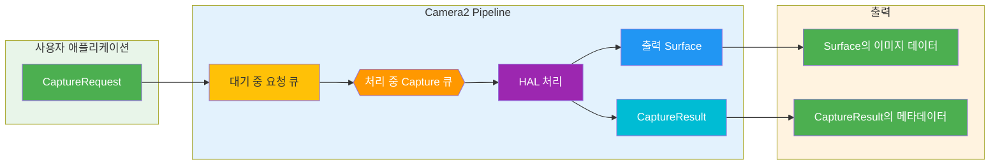
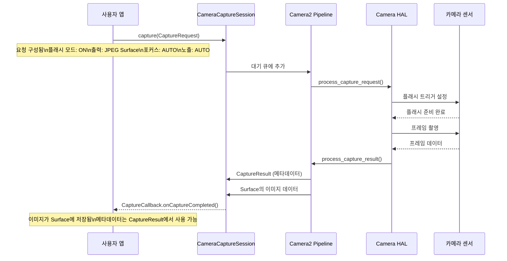
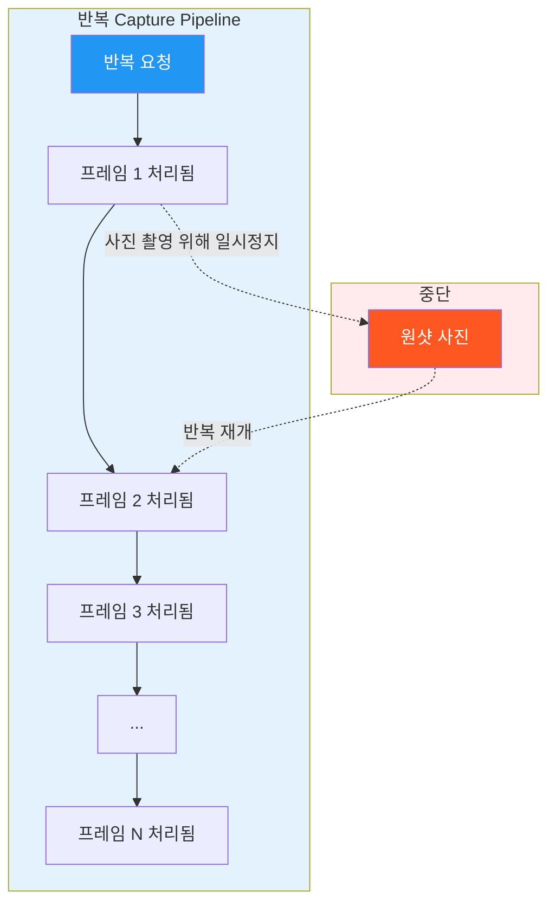
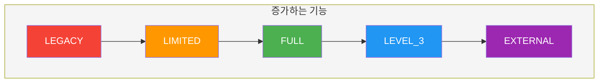
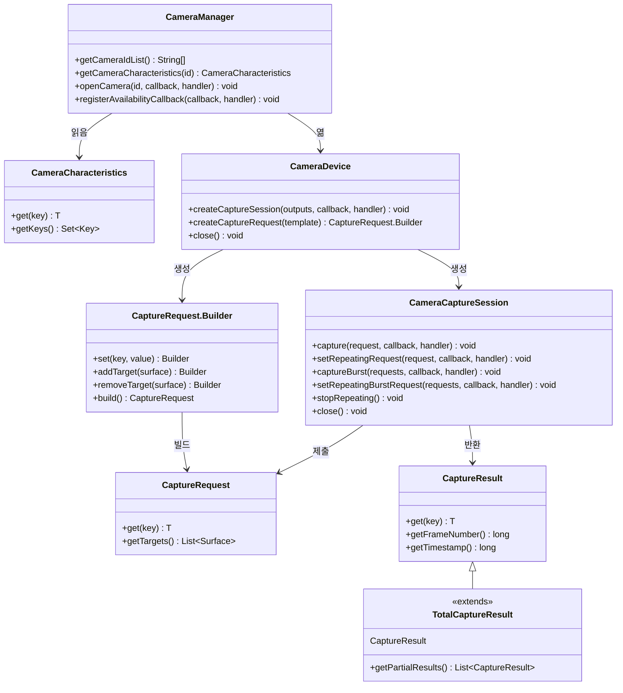
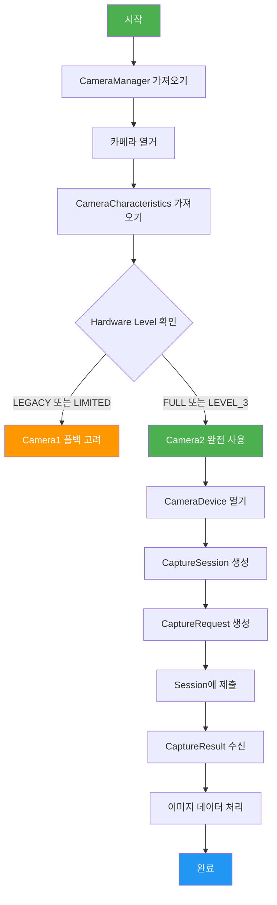
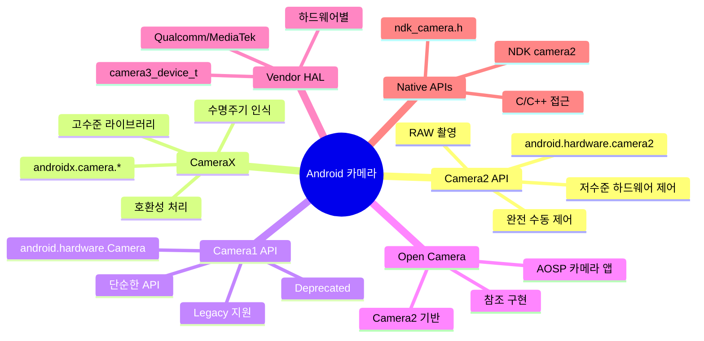

# 1장: Android Camera2 시작하기

> **장 개요:** 이 장에서는 Android Camera2의 세계를 기초부터 탐구합니다. Camera2가 *무엇*인지뿐만 아니라 *왜* 탄생했는지, *어떻게* 작동하는지, Android 카메라 생태계에서 *어디에* 위치하는지 이해하게 될 것입니다. Pipeline 모델, Capture 유형, Hardware Level 분류, 그리고 앱부터 HAL까지의 전체 아키텍처를 다룹니다.

---

## 1.1 왜 Camera2를 배워야 하는가?

오늘날 거의 모든 스마트폰에는 강력한 카메라 시스템이 탑재되어 있습니다. 현대 스마트폰은 다음을 수행할 수 있습니다:

- 컴퓨테이셔널 포토그래피로 전문가 수준의 사진 촬영
- 고프레임레이트로 4K 및 8K 동영상 녹화
- 깊이 감지로 인물 사진 효과 생성
- 야간 모드로 극저조도 환경에서 촬영
- 960 fps 슬로모션 동영상 촬영
- AR 애플리케이션용 3D 깊이 정보 생성
- 여러 카메라를 매끄럽게 결합

하지만 기본 카메라 앱을 열면 단순한 인터페이스만 보입니다: 셔터 버튼, 줌 컨트롤, 몇 가지 촬영 모드.

이 단순한 인터페이스 뒤에는 놀라울 정도로 복잡한 시스템이 숨어 있습니다. 카메라 앱은 하드웨어 구성 요소, 이미지 프로세서, Android Framework와 통신하여 모든 프레임을 생성합니다.

### 누가 Camera2를 배워야 하는가?

Android 개발자로서 기본 카메라 앱 이상의 애플리케이션을 만들고 싶을 수 있습니다:

- 노출, ISO, 포커스를 완전히 제어하는 **수동 사진 촬영 애플리케이션**
- 기술자가 기기의 성능을 검증하기 위한 **카메라 테스트 도구**
- 원시 프레임 접근이 필요한 **컴퓨터 비전 애플리케이션**
- 깊이 센서를 사용하는 **3D 스캔 애플리케이션**
- 코덱 선택과 비트레이트 제어가 가능한 **전문 동영상 녹화기**
- 저희의 [Android Camera Parameters](/)와 같은 **카메라 성능 분석기**

이러한 시나리오 중 어느 하나라도 익숙하다면, Camera2가 마스터해야 할 API입니다.

---

## 1.2 Android Camera2란 무엇인가?

**Android Camera2**는 Google이 **Android 5.0 (API level 21)**에서 도입한 현대식 카메라 Framework입니다. 기존의 `android.hardware.Camera` API (현재 retrospectively **Camera1**이라고 불림)를 대체했습니다.

### Camera2가 해결한 문제

구형 Camera API (Camera1)는 더 단순한 환경을 위해 설계되었습니다: 하나의 카메라, 기본적인 사진 촬영, 단순한 동영상 녹화. 하지만 스마트폰 카메라는 극적으로 진화했습니다:

| 시대 | 일반적인 기기 | 카메라 API |
|------|--------------|------------|
| 2010-2014 | 단일 카메라, 기본 센서 | Camera1 |
| 2015-2018 | 듀얼 카메라, OIS, HDR | Camera2 (제한적 사용) |
| 2019-2022 | 트리플 카메라, 깊이, 망원 | Camera2 (표준) |
| 2023+ | 쿼드 카메라, 페리스코프, LiDAR, UWB | Camera2 (필수) |

현대 기기는 여러 후면 카메라(와이드, 울트라와이드, 망원, 페리스코프), 깊이 센서, 심지어 외부 USB 카메라도 포함할 수 있습니다. 다음과 같은 고급 기능을 지원합니다:

- 수동 노출 및 포커스
- RAW 이미지 촬영
- 고속 동영상 녹화
- HDR 처리
- 광학식 손떨림 보정(OIS)
- 멀티카메라 융합

Camera2는 개발자에게 카메라 하드웨어에 대한 **깊고, 정밀하며, 세밀한 제어**를 제공하기 위해 탄생했습니다.

---

## 1.3 Camera2 vs Camera1 vs CameraX

Camera2를 깊이 파고들기 전에, 세 가지 주요 카메라 API 간의 관계를 명확히 합시다.

### Camera1 (`android.hardware.Camera`)

- **도입:** Android 1.0 (Android 5.0에서 deprecated)
- **모델:** 절차적, 상태 저장형, 단일 카메라 지향
- **장점:** 단순하고, 잘 알려져 있으며, 폭넓은 호환성
- **단점:** 제한된 제어, RAW 지원 안 함, 멀티카메라 안 함, 버스트 모드 안 함

### Camera2 (`android.hardware.camera2`)

- **도입:** Android 5.0 (API 21)
- **모델:** 객체 지향적, 상태 비저장형, 요청/응답 Pipeline
- **장점:** 깊은 하드웨어 제어, RAW 지원, 멀티카메라, 고속 동영상
- **단점:** 복잡하고, 장황하며, 카메라 내부 작동 원리에 대한 이해 필요

### CameraX (`androidx.camera.*`)

- **도입:** Android 10 (프리릴리즈), Android 11+에서 안정화
- **모델:** 선언적, 수명주기 인식, 사용 사례 지향
- **장점:** 사용하기 쉽고, 자동 호환성, 수명주기 관리
- **단점:** 제한된 고급 제어, 모든 하드웨어 기능을 노출하지 않을 수 있음

### 비교 표

| 차원 | Camera1 | Camera2 | CameraX |
|------|---------|---------|---------|
| **레벨** | 저수준 (deprecated) | 저수준 (현행) | 고수준 (Jetpack) |
| **난이도** | 쉬움 | 어려움 | 쉬움 |
| **제어** | 최소 | 최대 | 중간 |
| **RAW 지원** | 없음 | 있음 | 제한적 |
| **멀티카메라** | 없음 | 있음 | 제한적 |
| **버스트 모드** | 없음 | 있음 | 없음 |
| **수동 제어** | 제한적 | 완전 | 제한적 |
| **적합한 용도** | Legacy 앱 | 고급 카메라 앱 | 대부분의 카메라 앱 |
| **상태** | Deprecated | Active | Recommended |

### 이 시리즈가 Camera2에 집중하는 이유

CameraX가 대부분의 애플리케이션에 권장되지만, Camera2를 이해하는 것이 필수적인 이유는 다음과 같습니다:

1. **CameraX는 Camera2 기반입니다** — CameraX는 내부적으로 Camera2를 사용합니다. Camera2를 이해하면 CameraX가 무엇을 하는지 이해하는 데 도움이 됩니다.
2. **일부 기능은 Camera2에서만 사용 가능합니다** — RAW 촬영, 수동 센서 제어, 고급 멀티카메라 시나리오에는 Camera2가 필요합니다.
3. **디버깅에는 Camera2 지식이 필요합니다** — CameraX 앱이 예상대로 작동하지 않을 때, 문제를 진단하기 위해 Camera2의 기본 동작을 이해해야 하는 경우가 많습니다.
4. **Camera2 이해는 기본적입니다** — 앱에 CameraX를 사용하더라도, Camera2를 이해하면 더 나은 Android 카메라 개발자가 됩니다.

---

## 1.4 Camera2 아키텍처: 큰 그림

Camera2는 Android 카메라 스택의 중간에 위치하여, 애플리케이션 코드와 하드웨어 드라이버를 연결합니다. 이 아키텍처를 이해하는 것은 디버깅과 최적화에 매우 중요합니다.

### 계층적 아키텍처



### 아키텍처 계층 설명

| 계층 | 위치 | 언어 | 책임 |
|------|------|------|------|
| **애플리케이션** | 사용자 앱 코드 | Kotlin/Java | CaptureRequest 생성, CaptureResult 처리 |
| **Framework (Java)** | `android.hardware.camera2.*` | Java | 공개 API, 세션 관리, 데이터 변환 |
| **네이티브 Framework** | `frameworks/av/` | C++ | Binder IPC, CameraService, Camera3Device |
| **HAL** | `hardware/libhardware/` + 벤더 | C | 하드웨어 추상화, 벤더별 구현 |
| **커널** | `/dev/videoX` | C | V4L2 드라이버, 하드웨어 통신 |
| **하드웨어** | 물리적 카메라 모듈 | — | 센서, ISP, 렌즈, 플래시 |

### 핵심 설계 원칙: Camera2는 Pipeline이다

Camera2에 대해 이해해야 할 가장 중요한 개념은 카메라 작업을 **Pipeline**으로 모델링한다는 점입니다. 모든 동작 — 미리보기, 사진 촬영, 동영상 녹화 — 은 Pipeline을 흐르고 **Capture Result**를 생성하는 **Capture Request**로 표현됩니다.

---

## 1.5 Camera2 Pipeline 모델

Pipeline은 Camera2 설계의 핵심입니다. Camera1의 상태 저장형, 순차 처리 모델을 상태 비저장형, 요청/응답 모델로 대체합니다.

### Pipeline 작동 방식



### Pipeline 구성 요소 설명

| 구성 요소 | 설명 |
|----------|------|
| **CaptureRequest** | *한 프레임*의 촬영을 설명하는 설정 객체. 노출 시간, 포커스 모드, 플래시, 출력 Surface 등 모든 매개변수를 포함합니다. |
| **대기 중 요청 큐** | 새로운 CaptureRequest가 처리되기를 기다리는 FIFO 큐 |
| **처리 중 Capture 큐** | 현재 HAL에서 처리 중인 요청. 기기에 따라 보통 1-4개로 제한됨 |
| **HAL 처리** | 하드웨어 추상화 계층이 요청을 처리합니다: 센서, ISP, 렌즈 등을 제어합니다. |
| **출력 Surface** | 이미지는 구성된 Surface(미리보기 Surface, ImageReader Surface 등)에 기록됩니다. |
| **CaptureResult** | 촬영에 관한 메타데이터: 실제 노출 시간, AF 상태, 타임스탬프 등. 이미지 데이터는 포함하지 않음 |

### 주요 Pipeline 속성

1. **요청은 상태 비저장형입니다** — 각 CaptureRequest는 필요한 모든 정보를 포함합니다. Pipeline은 이전 요청에 대한 기억이 없습니다.
2. **처리는 순차적입니다** — 요청은 HAL에 의해 FIFO 순서로 처리됩니다.
3. **결과는 비동기적입니다** — CaptureResult는 동기적으로 반환되지 않고 콜백을 통해 도착합니다.
4. **요청당 여러 출력** — 하나의 CaptureRequest는 여러 Surface에 쓸 수 있습니다(예: 미리보기 + 사진 동시에).
5. **Pipeline은 구성 가능합니다** — 템플릿(미리보기, 정지 촬영, 녹화)을 선택하거나 완전 수동 모드를 사용할 수 있습니다.

### 구체적인 예: 플래시로 사진 촬영하기

Pipeline을 이해하기 위해, 플래시로 사진을 촬영할 때 무슨 일이 일어나는지 추적해 봅시다:



---

## 1.6 Capture 유형: 원샷, 버스트, 반복

Camera2는 각각 다른 사용 사례를 수행하는 세 가지 기본 Capture 유형을 정의합니다. 이를 이해하는 것은 카메라 애플리케이션을 올바르게 설계하는 데 중요합니다.

### 유형 1: 원샷 Capture

**원샷** 촬영은 정확히 한 번 실행됩니다. 사진 촬영이나 일회성 설정 변경 적용과 같은 단일 동작에 적합합니다.


**사용 사례:**
- 단일 사진 촬영
- 임시 플래시 적용
- 분석용 프레임 촬영
- 자동 포커스 한 번 트리거

**API 호출:**
```kotlin
cameraCaptureSession.capture(captureRequest, callback, handler)
```

### 유형 2: 버스트 Capture

**버스트** 촬영은 중단 없이 연속적으로 여러 번 실행됩니다. 시작되면 버스트가 완료될 때까지 다른 요청을 삽입할 수 없습니다.


**주요 특징:**
- 버스트의 모든 프레임은 동일하거나 점진적으로 다른 설정을 가집니다
- 버스트 중에는 다른 요청을 처리할 수 없습니다
- 버스트 큐는 대기 중 요청 큐와 분리되어 있습니다
- 반복 요청보다 높은 우선순위

**사용 사례:**
- 연속 사진 촬영(버스트 모드)
- 브라케팅(다른 노출로 동일한 장면 촬영)
- 모션 분석(빠르게 움직이는 피사체 촬영)
- 합성을 위한 순차적 다중 프레임 촬영

**API 호출:**
```kotlin
cameraCaptureSession.captureBurst(burstRequests, callback, handler)
```

### 유형 3: 반복 Capture

**반복** 촬영은 연속적으로 실행되어 라이브 미리보기와 동영상 녹화의 기초를 형성합니다. 반복 요청이 활성화되면 다른 촬영 사이에서 Pipeline을 점유합니다.



**주요 특징:**
- 한 번에 하나의 반복 요청만 활성화할 수 있습니다(이전 요청을 대체).
- 원샷 및 버스트 요청에 의해 중단된 다음 자동으로 재개됩니다
- 미리보기와 동영상 녹화의 기초를 형성합니다
- 효율성을 위해 모든 프레임에 대해 개별 CaptureResult를 생성하지 않습니다(부분 결과 사용).

**사용 사례:**
- 라이브 카메라 미리보기
- 동영상 녹화
- 연속 포커스 모니터링
- 실시간 프레임 분석

**API 호출:**
```kotlin
cameraCaptureSession.setRepeatingRequest(captureRequest, callback, handler)
// 동영상의 경우:
cameraCaptureSession.setRepeatingBurstRequest(burstRequests, callback, handler)
```

### Capture 유형 비교

| 기능 | 원샷 | 버스트 | 반복 |
|------|------|--------|------|
| **실행** | 한 번 | 여러 번 (연속) | 연속 |
| **우선순위** | 높음 | 가장 높음 | 가장 낮음 |
| **중단** | 중단 불가 | 중단 불가 | 중단 가능 |
| **큐** | 대기 큐 | 별도 버스트 큐 | Pipeline 점유 |
| **일반적 용도** | 사진, 단일 프레임 | 버스트 모드, 브라케팅 | 미리보기, 동영상 |
| **결과 콜백** | 호출당 하나의 결과 | 프레임당 하나의 결과 | 주기적으로 결과 |

### Capture 템플릿 시스템

Camera2는 일반적인 촬영 시나리오에 대해 미리 정의된 템플릿을 제공합니다:

| 템플릿 | 설명 | 사용 사례 |
|--------|------|----------|
| `TEMPLATE_PREVIEW` | 라이브 미리보기에 최적화 | 카메라 미리보기 |
| `TEMPLATE_STILL_CAPTURE` | 사진 촬영에 최적화 | 사진 촬영 |
| `TEMPLATE_RECORD` | 동영상 녹화에 최적화 | 동영상 촬영 |
| `TEMPLATE_VIDEO_SNAPSHOT` | 동영상 녹화 중 사진 촬영 | 녹화 중 스냅샷 |
| `TEMPLATE_ZERO_SHUTTER_LAG` | 고품질, 최소 지연 | 버스트 사진 촬영 |
| `TEMPLATE_MANUAL` | 모든 자동 제어 비활성화 | 완전 수동 제어 |

템플릿은 일반적인 매개변수를 미리 구성하는 바로가기입니다. 그 다음 템플릿에서 개별 설정을 수정할 수 있습니다.

---

## 1.7 지원되는 Hardware Level

모든 Android 기기가 전체 Camera2 기능 세트를 지원하는 것은 아닙니다. 이를 해결하기 위해 Google은 **지원되는 Hardware Level** — 개발자에게 기기 카메라 구현에서 무엇을 기대할 수 있는지 알려주는 분류 시스템 — 을 정의했습니다.

### Hardware Level 분류



### 레벨 설명

| 레벨 | 설명 | Camera2 지원 |
|------|------|-------------|
| **LEGACY** | Camera1과 호환됨. Camera2 호출은 내부적으로 Camera1으로 변환됨. | 기본 Camera1 기능만 |
| **LIMITED** | 일부 Camera2 기능 지원. 전체 Camera2 Pipeline 보장 안 됨. | 부분 Camera2 기능 |
| **FULL** | 완전한 Camera2 기능 세트. 전체 Pipeline, 수동 제어, 멀티카메라. | 모든 Camera2 기능 |
| **LEVEL_3** | FULL의 모든 기능 + YUV 리프로세싱 및 추가 출력 스트림. | FULL + 고급 기능 |
| **EXTERNAL** | 외부 카메라(USB 등)를 위한 LIMITED와 유사. | 외부 카메라 지원 |

### Hardware Level 확인 방법

`CameraCharacteristics`를 사용하여 hardware level을 쿼리할 수 있습니다:

```kotlin
val cameraManager = getSystemService(Context.CAMERA_SERVICE) as CameraManager
val cameraId = cameraManager.cameraIdList[0]
val characteristics = cameraManager.getCameraCharacteristics(cameraId)

val hardwareLevel = characteristics.get(CameraCharacteristics.INFO_SUPPORTED_HARDWARE_LEVEL)
val levelName = when (hardwareLevel) {
    CameraCharacteristics.INFO_SUPPORTED_HARDWARE_LEVEL_LEGACY -> "LEGACY"
    CameraCharacteristics.INFO_SUPPORTED_HARDWARE_LEVEL_LIMITED -> "LIMITED"
    CameraCharacteristics.INFO_SUPPORTED_HARDWARE_LEVEL_FULL -> "FULL"
    CameraCharacteristics.INFO_SUPPORTED_HARDWARE_LEVEL_3 -> "LEVEL_3"
    CameraCharacteristics.INFO_SUPPORTED_HARDWARE_LEVEL_EXTERNAL -> "EXTERNAL"
    else -> "UNKNOWN"
}
Log.d("Camera", "Hardware Level: $levelName")
```

### 실제적 의미

| 레벨 | 앱에 의미하는 것 |
|------|-----------------|
| **LEGACY** | Camera2는 작동할 수 있지만 제한이 있음. Camera1을 폴백으로 고려. |
| **LIMITED** | 기본 Camera2 기능 작동. 일부 고급 기능이 없을 수 있음. |
| **FULL** | 완전한 Camera2 지원. 모든 Camera2 기능을 사용하기 안전함. |
| **LEVEL_3** | YUV 리프로세싱 및 고급 다중 스트림 기능 사용 가능. |
| **EXTERNAL** | USB 카메라 및 기타 외부 입력 지원 가능. |

### 런타임 기능 쿼리

hardware level 외에도, 런타임에서 특정 기능을 항상 확인하십시오:

```kotlin
val capabilities = characteristics.get(CameraCharacteristics.REQUEST_AVAILABLE_CAPABILITIES)
capabilities?.forEach { capability ->
    when (capability) {
        CameraMetadata.REQUEST_AVAILABLE_CAPABILITIES_BACKWARD_COMPATIBLE ->
            Log.d("Camera", "Supports backward compatible mode")
        CameraMetadata.REQUEST_AVAILABLE_CAPABILITIES_MANUAL_SENSOR ->
            Log.d("Camera", "Supports manual sensor control")
        CameraMetadata.REQUEST_AVAILABLE_CAPABILITIES_MANUAL_POST_PROCESSING ->
            Log.d("Camera", "Supports manual post-processing")
        CameraMetadata.REQUEST_AVAILABLE_CAPABILITIES_RAW ->
            Log.d("Camera", "Supports RAW capture")
        CameraMetadata.REQUEST_AVAILABLE_CAPABILITIES_PRIVATE_REPROCESSING ->
            Log.d("Camera", "Supports private reprocessing")
        CameraMetadata.REQUEST_AVAILABLE_CAPABILITIES_DEEP_OUTPUT ->
            Log.d("Camera", "Supports deep output")
    }
}
```

---

## 1.8 Camera2 핵심 클래스 개요

Camera2의 API는 소수의 핵심 클래스를 중심으로 구성됩니다. 각 클래스를 깊이 파고들기 전에 먼저 만나봅시다.

### 핵심 클래스 관계 다이어그램



### 클래스 책임

| 클래스 | 패키지 | 책임 |
|--------|--------|------|
| `CameraManager` | `android.hardware.camera2` | 최상위 시스템 서비스. 카메라를 열거하고 CameraDevice에 대한 접근을 제공. |
| `CameraCharacteristics` | `android.hardware.camera2` | 읽기 전용 카메라 성능 메타데이터. |
| `CameraDevice` | `android.hardware.camera2` | 연결된 카메라를 나타냄. 세션과 CaptureRequest 빌더를 생성. |
| `CameraCaptureSession` | `android.hardware.camera2` | Pipeline 인스턴스. CaptureRequest를 제출하고 반복 촬영을 관리. |
| `CaptureRequest` | `android.hardware.camera2` | 불변 촬영 구성. 한 프레임의 모든 매개변수. |
| `CaptureRequest.Builder` | `android.hardware.camera2` | CaptureRequest 객체를 생성하는 빌더. |
| `CaptureResult` | `android.hardware.camera2` | 완료된 촬영의 메타데이터 출력. |
| `TotalCaptureResult` | `android.hardware.camera2` | 모든 부분 결과를 포함한 완전한 촬영 결과. |

### Camera2 작업 흐름



---

## 1.9 Camera2 vs Camera1: 상세 비교

이전에 Camera1으로 작업한 적이 있다면 그 차이점을 높이 평가할 것입니다. 경험이 없다면 이 섹션은 Camera2가 근본적인 재설계인 이유를 이해하는 데 도움이 됩니다.

### 아키텍처 비교

| 측면 | Camera1 | Camera2 |
|------|---------|---------|
| **프로그래밍 모델** | 절차적 (명령형) | 객체 지향적 (선언적) |
| **상태 관리** | 상태 저장형 (카메라가 상태 유지) | 상태 비저장형 (각 요청이 자기 완결적) |
| **촬영 모델** | 명령 (takePicture(), startPreview()) | Pipeline (CaptureRequest → CaptureResult) |
| **스레딩** | 대부분 단일 스레드 | 다중 스레드 사용을 위해 설계됨 |
| **오류 처리** | 예외, 복구 어려움 | 오류 코드 + 예외, 더 세밀함 |
| **메타데이터** | 촬영 후 읽기 전용 | 촬영 중 실시간으로 사용 가능 |
| **다중 출력** | 지원 안 함 | 하나의 요청 → 여러 Surface |
| **제로카피** | 지원 안 함 | ImageReader를 통해 지원 |

### API 나란히 비교

#### 카메라 열기

```kotlin
// Camera1 (구 API)
val camera = Camera.open()
camera.setPreviewDisplay(surfaceHolder)
camera.startPreview()

// Camera2 (새 API)
val cameraManager = getSystemService(Context.CAMERA_SERVICE) as CameraManager
cameraManager.openCamera(cameraId, object : CameraDevice.StateCallback() {
    override fun onOpened(camera: CameraDevice) {
        mCameraDevice = camera
        // 세션 및 요청 생성...
    }
    override fun onDisconnected(camera: CameraDevice) { camera.close() }
    override fun onError(camera: CameraDevice, error: Int) { camera.close() }
}, handler)
```

#### 사진 촬영

```kotlin
// Camera1 (구 API)
camera.takePicture(null, null, object : Camera.PictureCallback() {
    override fun onPictureTaken(data: ByteArray, camera: Camera) {
        // 이미지 데이터 처리
    }
})

// Camera2 (새 API)
val requestBuilder = mCameraDevice.createCaptureRequest(CameraDevice.TEMPLATE_STILL_CAPTURE)
requestBuilder.addTarget(imageReader.surface)
val captureRequest = requestBuilder.build()
mCameraCaptureSession.capture(captureRequest, object : CameraCaptureSession.CaptureCallback() {
    override fun onCaptureCompleted(session: CameraCaptureSession, 
                                    request: CaptureRequest, 
                                    result: TotalCaptureResult) {
        // result의 메타데이터
        val exposureTime = result.get(CaptureResult.SENSOR_EXPOSURE_TIME)
    }
}, handler)
// 이미지 데이터는 ImageReader.OnImageAvailableListener를 통해 도착
```

#### 실제 주요 차이점

| 작업 | Camera1 | Camera2 |
|------|---------|---------|
| **미리보기 + 사진** | 사진을 찍으려면 미리보기를 중지해야 한 후 재시작 | 미리보기를 중지하지 않고 사진 촬영 가능 |
| **여러 사진** | 한 번에 한 장의 사진만 | 임의 개수의 버스트 모드 |
| **수동 노출** | 사용 불가 | 노출 시간과 게인의 완전 제어 |
| **수동 포커스** | 사전 정의된 모드만 | 렌즈 위치의 완전 제어 |
| **RAW 촬영** | 사용 불가 | FULL+ 기기에서 지원 |
| **실시간 메타데이터** | 사용 불가 | 부분 CaptureResult를 통해 사용 가능 |

### Camera1에서 마이그레이션 팁

Camera1에서 Camera2로 마이그레이션하는 경우, 다음 팁을 기억하십시오:

1. **명령이 아닌 CaptureRequest 관점에서 생각하십시오**. 모든 동작 — 포커스, 플래시, 사진 — 은 CaptureRequest입니다.
2. **미리보기와 촬영을 분리하십시오**. Camera1에서는 촬영을 위해 미리보기를 중지해야 했습니다. Camera2에서는 반복 요청이 계속되는 동안 별도의 요청을 제출합니다.
3. **콜백에 Handler를 사용하십시오**. Camera2 콜백은 Handler의 스레드에서 실행됩니다. ANR을 피하기 위해 항상 제공하십시오.
4. **먼저 hardware level을 확인하십시오**. 기기가 LEGACY인 경우, Camera1 사용을 고려하십시오.
5. **일반적인 작업에 CaptureRequest 템플릿을 사용하십시오**. 처음부터 빌드하기보다 템플릿에서 수정하십시오.
6. **메인 스레드를 차단하지 마십시오**. 모든 Camera2 작업은 백그라운드 스레드에서 실행되어야 합니다.

---

## 1.10 Android 생태계에서의 Camera2

Camera2는 고립되어 존재하지 않습니다. 카메라 관련 API와 라이브러리의 더 큰 생태계의 일부입니다.

### 카메라 API 생태계



### 언제 어떤 API를 사용해야 하는가

| 요구 사항 | 권장 API | 이유 |
|----------|---------|------|
| 단순 사진 앱 | CameraX | 가장 쉽고 가장 호환성이 좋음 |
| 동영상 녹화 | CameraX | 기본 동영상 지원 |
| 수동 사진 촬영 | Camera2 | 모든 매개변수의 완전 제어 |
| 컴퓨터 비전 | Camera2 | 직접 프레임 접근, 최소 지연 |
| 멀티카메라 융합 | Camera2 | 완전한 멀티카메라 지원이 있는 유일한 API |
| RAW 촬영 | Camera2 | RAW 지원이 있는 유일한 API |
| 외부 카메라 | Camera2 | 외부 카메라 지원 (EXTERNAL 레벨) |
| Legacy 기기 지원 | Camera1 | 구형 기기와의 호환성 |

---

## 1.11 Android Camera Parameters로 학습하기

문서를 읽는 것은 유용하지만, 실제 휴대폰의 실제 데이터를 볼 수 있을 때 카메라 성능을 더 쉽게 이해할 수 있습니다. 이 시리즈 전반에서 [Android Camera Parameters](/)를 사용하여 사용자 자신의 기기에서 실제 카메라 정보를 탐구할 것입니다.

이 앱을 사용하여 다음을 발견할 수 있습니다:

- 사용 가능한 카메라 (ID, 방향, hardware level)
- 지원되는 해상도와 프레임레이트
- 센서 정보 (활성 배열 크기, 초점 거리)
- 수동 제어 지원 (ISO 범위, 노출 시간 범위)
- RAW 성능과 포맷
- Hardware level과 지원되는 기능
- 완전한 CameraCharacteristics 덤프

추상적인 예제로부터 배우는 대신, 사용자 자신의 기기를 직접 조사하여 이 장의 개념이 실제 하드웨어에 어떻게 적용되는지 볼 수 있습니다.

---

## 1.12 핵심 요약

1장을 완료한 것을 축하합니다! 기억해야 할 사항은 다음과 같습니다:

### 핵심 개념

1. **Camera2는 Pipeline입니다** — 모든 카메라 작업은 Pipeline을 흐르고 CaptureResult를 생성하는 CaptureRequest입니다.
2. **Capture 유형** — 원샷(단일), 버스트(연속 여러 번), 반복(연속)
3. **Hardware Level** — LEGACY → LIMITED → FULL → LEVEL_3 → EXTERNAL
4. **아키텍처 계층** — 앱 → Framework → 네이티브 Framework → HAL → 커널 → 하드웨어

### 실제 원칙

1. **항상 hardware level을 확인하십시오** — 모든 기기가 전체 Camera2 기능을 지원하는 것은 아닙니다
2. **런타임에서 기능을 확인하십시오** — 기능이 사용 가능하다고 가정하지 마십시오
3. **일반적인 작업에 템플릿을 사용하십시오** — `TEMPLATE_PREVIEW`, `TEMPLATE_STILL_CAPTURE` 등
4. **백그라운드 스레드에서 실행하십시오** — Camera2 작업은 메인 스레드를 차단해서는 안 됩니다
5. **미리보기와 촬영을 분리하십시오** — 미리보기에는 반복 요청, 사진에는 원샷을 사용하십시오

### 다음 단계

다음 장인 **스마트폰 카메라 이해하기**에서는 잠시 Android를 떠나 카메라 하드웨어 자체를 탐구할 것입니다. 다음을 배우게 될 것입니다:

- 카메라 센서 기술 (CMOS vs CCD)
- 렌즈 설계와 초점 거리
- ISP (Image Signal Processor) 처리 Pipeline
- 유사한 메가픽셀 수를 가진 두 폰이 완전히 다른 사진을produces하는 이유
- 빛에서 최종 사진까지의 완전한 이미지 Pipeline

하드웨어를 이해하면 Camera2 개념이 훨씬 더 직관적이 될 것입니다.

---

## 1.13 요약

Android Camera2는 개발자에게 카메라 하드웨어에 대한 전례 없는 제어권을 제공하는 강력한 저수준 카메라 Framework입니다. Pipeline 기반 아키텍처, 세 가지 Capture 유형, Hardware Level 분류는 고급 카메라 애플리케이션 구축을 위한 튼튼한 기초를 제공합니다.

이 장에서 다룬 내용:
- ✅ Camera2 아키텍처와 생태계 위치
- ✅ 요청/결과 흐름을 갖춘 Pipeline 모델
- ✅ Capture 유형: 원샷, 버스트, 반복
- ✅ Hardware Level 분류와 런타임 확인
- ✅ 핵심 클래스 개요와 관계
- ✅ Camera1 vs Camera2 상세 비교

이제 2장에서 카메라 하드웨어 자체로 dive into 봅시다! 🚀