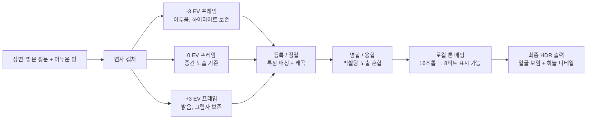
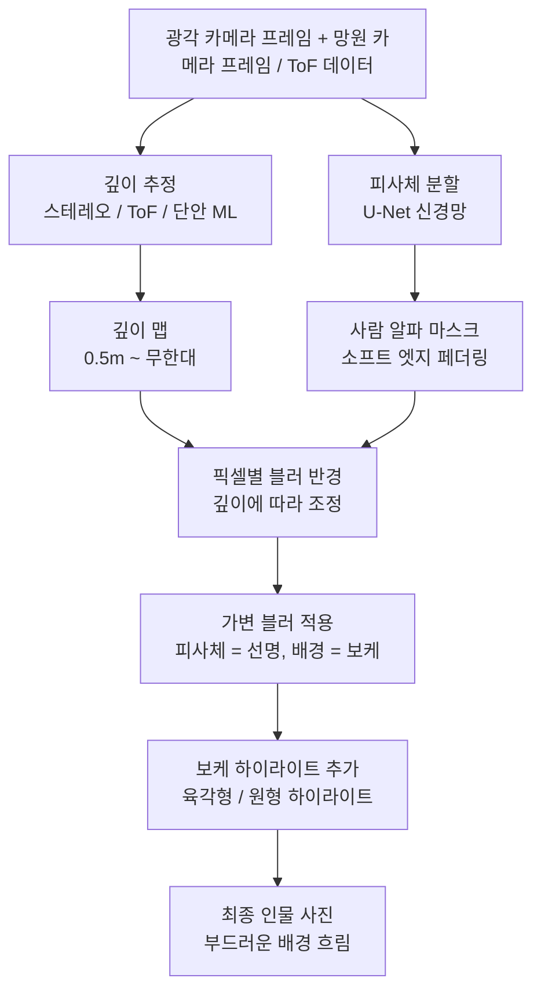
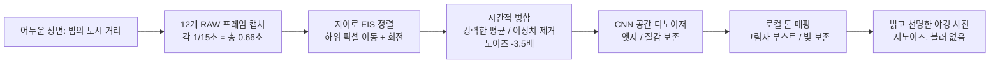
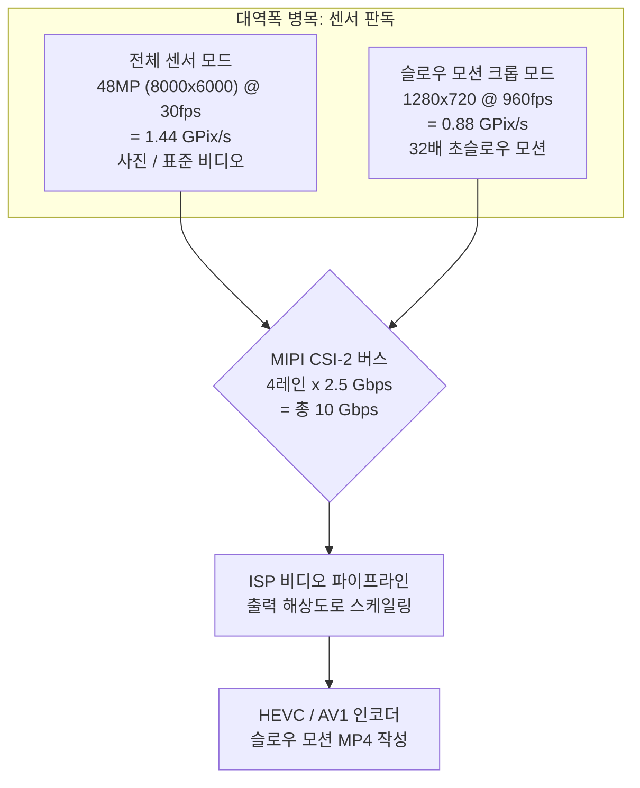
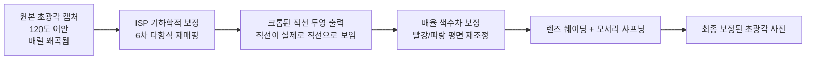
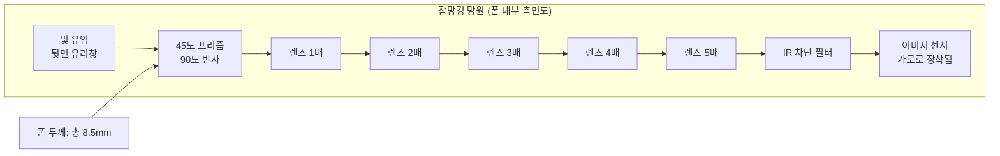
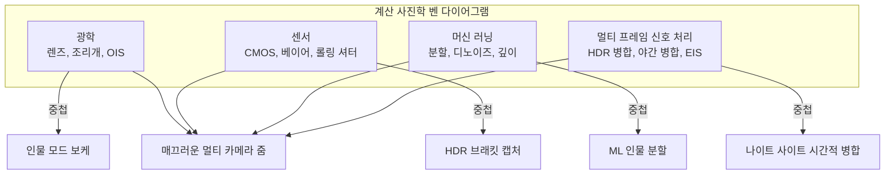

# 제3장: 현대 스마트폰 사진의 세계

제2장에서는 렌즈, 센서, ISP 파이프라인 및 멀티 카메라 모듈과 같은 하드웨어 기초를 다루었습니다. 이번 장에서는 자연스러운 다음 질문에 답합니다. **현대 카메라 앱은 어떻게 그 하드웨어를 사용하여 인스타그램에서 보는 것과 같은 멋진 사진을 만들어낼까요?**

2010년의 스마트폰은 단일 노출을 촬영하고 기본 ISP를 거쳐 JPEG를 작성했습니다. 2026년의 스마트폰은 단 한 번의 스틸 사진을 위해 일상적으로 5~15개의 별도 프레임을 캡처하고, 자이로스코프 데이터를 사용하여 하위 픽셀 정밀도로 정렬하며, 멀티 프레임 신호 처리를 사용하여 융합하고, 의미론적 분할(semantic segmentation) 또는 깊이 추정을 위해 신경망을 실행하며, 마지막으로 이를 단일 공유 가능 이미지로 톤 매핑합니다. 이 모든 과정이 단 한 번의 셔터 버튼 클릭 내에 이루어집니다.

이 장에서는 현대 스마트폰 사진 기능에 대한 기능별 투어를 진행합니다. 각 기능이 하드웨어와 소프트웨어 수준에서 어떻게 작동하는지 Camera2 API 코드 없이 설명합니다. 목표는 나중에 이러한 기능을 제어하는 코드를 작성할 때 내부에서 어떤 일이 일어나는지 알 수 있도록 현대 카메라 시스템의 어휘를 구축하는 것입니다.

## HDR: 고다이내믹 레인지 멀티 프레임 퓨전

**다이내믹 레인지**는 이미징 시스템이 클리핑(clipping) 없이 동시에 기록할 수 있는 장면의 가장 밝은 부분과 가장 어두운 부분의 비율입니다. 인간의 눈은 도약 안구 운동(saccadic adaptation) 덕분에 한 번에 약 20스톱의 다이내믹 레인지(1,000,000:1 대비비)를 인식할 수 있습니다. 단일 스마트폰 센서 노출은 베이스 ISO에서 약 10~12스톱을 캡처할 수 있습니다. 이 두 숫자 사이의 간극이 바로 HDR이 존재하는 이유입니다.

피사체 뒤에 밝은 창문이 있는 실내에서 사진을 찍는다고 상상해 보세요. 사람의 얼굴에 노출을 맞추면(예: 1/30초, ISO 400), 창문은 순수한 흰색으로 날아가 버립니다(클리핑). 하늘도, 구름도, 디테일도 없습니다. 창문에 노출을 맞추면(1/2000초, ISO 50), 사람의 얼굴은 실루엣처럼 검은 덩어리가 됩니다. 어느 단일 노출도 제대로 작동하지 않습니다.

### 스마트폰 HDR 작동 원리

현대 폰의 모든 HDR 시스템은 **멀티 프레임 브래키팅(multi-frame bracketing)**과 그에 따른 계산 퓨전을 사용합니다. 알고리즘은 다음과 같이 작동합니다.

1. **브래킷 캡처**: 카메라는 서로 다른 노출값(EV)으로 3~10개의 연속된 프레임을 빠르게 캡처합니다. 전형적인 세트는 -3 EV(하이라이트 보존을 위해 매우 짧음), -1 EV, +1 EV, +3 EV(그림자 캡처를 위해 매우 김) 프레임들입니다. 촬영 중에 센서와 VCM은 완벽하게 고정된 상태를 유지하며 전자 셔터 타이밍만 변경됩니다.
2. **기준 프레임 선택**: 알고리즘은 가장 선명한 중간 노출 프레임을 기하학적 기준으로 선택합니다.
3. **이미지 등록 / 정렬**: 기준이 아닌 각 프레임은 기준 프레임에 맞춰 계산적으로 정렬됩니다. 알고리즘은 FAST 또는 SIFT와 같은 알고리즘을 사용하여 특징점(모서리, 엣지)을 찾고, 각 프레임의 특징을 기준 프레임에 매핑하는 아핀(affine) 또는 호모그래피(homography) 변환을 계산하여 픽셀을 왜곡(warp)시킵니다. 촬영 중 미세한 흔들림으로 인해 너무 흐릿해진 프레임은 완전히 버려집니다.
4. **퓨전**: 최종 이미지의 각 픽셀 위치에 대해 알고리즘은 정렬된 프레임들의 정보를 결합합니다. 노출 부족 픽셀은 깨끗하고 잘리지 않은 하이라이트 데이터를 제공합니다. 노출 과다 픽셀은 노이즈가 적은 그림자 데이터를 제공합니다. 중간 톤 픽셀은 모든 프레임에서 평균화되어 샷 노이즈를 줄입니다.
5. **톤 매핑**: 이제 14~18스톱의 사용 가능한 다이내믹 레인지를 포함할 수 있는 융합된 선형 이미지는 정교한 로컬 톤 매핑 연산자를 통해 표준 sRGB 디스플레이에서 보기 좋은 8비트 또는 10비트 출력 이미지로 압축됩니다.

실제 사례: 갤럭시 S26 울트라는 기본 "장면 최적화 HDR" 모드에서 내부적으로 약 0.2초의 캡처 시간 동안 7개의 브래킷 프레임을 발사합니다. 내장된 손떨림 감지 기능이 흐릿한 2개의 프레임을 버립니다. 나머지 5개 프레임이 정렬, 융합 및 톤 매핑됩니다. 출력은 안드로이드 14+ 기기에서 **JPEG_R Ultra HDR 파일**로 작성됩니다. 이는 표준 JPEG 주 이미지(8비트 SDR)에 HDR 지원 뷰어(안드로이드 14 갤러리, 크롬 120+, 어도비 라이트룸)가 HDR10 또는 돌비 비전 디스플레이에서 전체 10비트 휘도 범위를 재구성하는 데 사용할 수 있는 게인 맵이 포함된 형태입니다.

### HDR이 작동할 때와 아닐 때

HDR은 하이라이트와 깊은 그림자가 공존하는 정적인 장면에 탁월합니다: 풍경, 역광 인물, 창문이 있는 방, 바다 위의 일몰 등입니다. 장면 내의 물체가 브래킷 연사 중에 움직일 때(날아가는 새, 흔들리는 깃발, 눈을 깜빡이는 사람, 뛰는 아이 등)는 "고스팅(ghosting)" 아티팩트를 생성하며 실패합니다. 현대의 AI 기반 HDR 알고리즘은 움직이는 물체를 감지하고 분할하여 해당 픽셀에는 기준 프레임만 혼합함으로써 고전적인 HDR "고스트"를 방지합니다.

## 인물 모드: 깊이 추정을 통한 보케

인물 모드는 피사체의 얼굴은 완벽하게 선명하고 배경은 부드럽게 흐려지는 **보케(bokeh)** 효과를 만들어냅니다. 전통적인 카메라는 대형 센서, 넓은 조리개 및 긴 초점 거리를 통해 이를 광학적으로 달성합니다. 스마트폰은 f/1.6의 1/1.3인치 센서가 자연적으로 얕은 피사계 심도를 만들어내지 못하기 때문에 이를 계산적으로 달성합니다.

### 스마트폰 깊이 추정의 세 가지 방법

현대 인물 시스템은 세 가지 독립적인 기술을 사용하며, 많은 폰이 세 가지를 모두 조합하여 사용합니다.

**방법 1: 듀얼 카메라의 스테레오 시차.** 이것은 가장 오래되고 기하학적으로 건전한 방법입니다. 폰은 동일한 피사체를 향해 광각 카메라와 망원 카메라를 동시에 발사합니다. 두 카메라가 물리적으로 10~15mm 떨어져 있기 때문에("베이스라인"), 피사체를 약간 다른 수평 위치에서 보게 됩니다. 전경의 물체는 멀리 있는 배경 물체보다 두 시점 사이에서 위치가 더 많이 바뀝니다. 이 변화를 **시차(disparity)**라고 합니다. 알고리즘은 정류(rectified)된 두 이미지에 대해 블록 매칭 또는 SGM(semi-global matching) 알고리즘을 실행하여 모든 픽셀의 시차 값을 계산합니다. 시차는 깊이에 반비례하므로, 시차 맵은 픽셀당 깊이 맵으로 직접 변환됩니다.

**방법 2: ToF / LiDAR 능동 깊이 감지.** ToF(Time-of-Flight) 또는 LiDAR 깊이 센서는 장면에 3만 개 이상의 근적외선 레이저 도트 구조 패턴을 투사한 다음, 반사된 빛의 왕복 시간(직접 ToF) 또는 위상차(간접 ToF)를 측정하여 각 픽셀의 실제 미터 단위 깊이를 계산합니다. ToF는 완전한 어둠 속에서도, 그리고 스테레오 매칭이 실패하는 질감이 없는 표면(평범한 벽, 하늘)에서도 정확하고 조밀한 깊이 맵을 생성합니다. 현대 인물 시스템은 일반적으로 ToF를 실제 깊이 단서로 사용하고 스테레오 시차를 정밀화 신호로 사용합니다.

**방법 3: 단안 ML 깊이 추정.** 단일 카메라 폰(또는 스테레오 파트너가 없는 전면 셀카 카메라)의 경우 신경망이 단일 RGB 이미지에서 깊이를 추정합니다. 수백만 개의 실제 깊이 레이블이 있는 이미지로 훈련된 모델은 인간이 깊이를 판단할 때 사용하는 통계적 단서(상대적 크기, 가림, 선원근법, 질감 구배, 초점 흐림, 공기 원근법 등)를 학습합니다. 구글의 PortraitNet과 메타의 DeepLabV3+가 대표적인 아키텍처입니다. 단안 깊이는 스테레오나 ToF보다 정밀도는 낮지만 그럴싸한 인물 보케를 만들기에는 충분합니다.

### 인물 렌더링 파이프라인

깊이 맵을 얻은 후 나머지 단계는 깊이 추정 방법에 관계없이 동일합니다.

1. **피사체 분할**: 별도의 시맨틱 분할 신경망(주로 U-Net 변체)이 메인 RGB 카메라 이미지에서 실행되어 어떤 픽셀이 "사람"이고 어떤 픽셀이 "배경"인지 식별하는 소프트 알파 마스크를 생성합니다. 마스크는 초기 인물 모드의 "종이 인형" 같은 느낌을 피하기 위해 엣지 부분, 특히 머리카락, 안경 및 미세한 전경 디테일 주변에서 부드럽게(feathered) 처리됩니다.
2. **깊이 정밀화**: 방법 1/2/3의 원시 깊이 맵에 분할 마스크를 곱합니다. 배경 픽셀은 깊이 값을 유지하고, 피사체 픽셀은 단일 초점 평면 깊이로 고정됩니다.
3. **픽셀별 가변 블러**: 각 배경 픽셀은 초점 평면으로부터의 거리에 비례하여 반경이 커지는 가우시안 블러(또는 프리미엄 "광학 시뮬레이션" 모드의 경우 물리적으로 렌더링된 렌즈 커널 컨볼루션)가 적용됩니다. 5미터 거리의 배경 물체는 강하게 흐려지고, 1.5미터 거리의 배경 물체는 약하게 흐려집니다. 피사체 픽셀은 원본 그대로 복사됩니다.
4. **인공 광학 눈부심**: 프리미엄 터치: 흐린 배경의 밝은 하이라이트(가로등, 반사, 태양)는 단순한 가우시안 덩어리가 아닌 특징적인 렌즈 모양의 보케 육각형 또는 원형으로 렌더링됩니다. 이것이 실제 렌즈 조리개에서 나온 블러라는 착시를 완성합니다.

## 야간 모드: 멀티 프레임 시간적 병합

2018년 이전의 스마트폰 저조도 사진은 플래시 없이는 사실상 사용 불가능했습니다. 어둡게 조명된 바나 밤의 도시 거리는 노이즈가 많고 입자가 거칠며 흐릿한 결과물을 냈습니다. 그러다 구글이 픽셀 3에서 **나이트 사이트(Night Sight)**를 출시하면서 모든 것이 바뀌었습니다. 핵심 통찰은 직관에 반하는 것이었습니다: 한 번의 긴 1초 노출(손떨림으로 인해 절망적으로 흐려질 것)을 찍는 대신, 15개의 매우 짧은 1/15초 노출(OIS가 작동하므로 각각은 선명함)을 찍은 다음 이를 알고리즘으로 정렬하고 평균을 내는 것입니다. 총 통합 노출 시간은 여전히 1초이지만, 프레임당 노출이 충분히 짧아서 손떨림 블러가 축적되지 않습니다.

### 야간 모드 알고리즘 단계별 보기

1. **연사 캡처**: 카메라는 8~15개의 RAW 프레임을 캡처합니다. 각 프레임은 중간 정도의 노출 시간(1/15초~1/8초가 전형적)과 중간 정도의 ISO(800~3200)를 사용합니다. 개별 프레임은 노이즈가 있지만 흐릿하지는 않습니다. 연사는 실제 시간으로 0.5~2초 정도 소요됩니다.
2. **자이로 보조 EIS 정렬**: 폰의 메인 IMU 자이로스코프는 연사 내내 8,000Hz로 각속도를 기록합니다. 각 프레임에 대해 기준 프레임으로부터의 누적 회전 및 이동량이 계산됩니다. 각 RAW 프레임은 사용자의 손이 연사 중에 몇 픽셀 정도 흔들렸더라도 기준 프레임에 완벽하게 일치하도록 NPU에서 하위 픽셀 정밀도로 디지털 이동, 회전 및 미세 조정(전자식 손떨림 보정, EIS)됩니다.
3. **시간적 픽셀 병합**: 정렬된 12개 프레임의 각 픽셀 위치에 대해 알고리즘은 12개의 후보 픽셀 값을 모읍니다. 그런 다음 단순히 평균을 내는 것이 아니라 강력한 통계적 병합을 수행합니다: 이상치 값(핫 픽셀, 코스믹 레이 충격 또는 해당 지점을 지나가는 자동차 헤드라이트로 인한 값)을 식별하여 폐기합니다. 남은 일관된 값들을 평균하여, 유지된 프레임 수의 제곱근에 해당하는 계수만큼 가우시안 샷 노이즈를 줄입니다. 12프레임 병합은 노이즈를 3.5배 줄입니다.
4. **공간적 디노이징**: (RAW 야간 이미지로 특화 훈련된) CNN 기반 디노이저가 실제 엣지와 질감을 보존하면서 남은 고주파 노이즈를 제거합니다.
5. **로컬 톤 매핑**: 병합된 RAW 이미지는 매우 높은 다이내믹 레인지를 가집니다. (바이래터럴 필터링 또는 학습된 CNN 톤맵 기반의) 공간 가변적 톤 매핑 연산자가 도시의 불빛을 날리지 않으면서 그림자를 끌어올리고, 어두운 영역의 색 채도를 높여(그렇지 않으면 채도가 낮아 보임) 최종적으로 어둡고 탁하지 않은 밝고 깨끗한 8비트 이미지를 만들어냅니다.

삼성의 "나이토그래피", 애플의 "야간 모드", 샤오미의 "야간 모드 2.0", 오포의 "울트라 다크 모드" 모두 실질적으로 동일한 알고리즘 아키텍처를 사용합니다. 정확한 프레임 수, 강력한 병합 통계량의 선택, 디노이저 아키텍처 및 톤맵 느낌에서 차이가 있지만, 자이로 정렬 멀티 프레임 시간적 평균이라는 핵심은 업계 전체에서 보편적입니다.

## 슬로우 모션: 크롭된 고프레임 레이트 캡처

슬로우 모션 비디오는 표준 30fps 재생 속도보다 빠르게 비디오 프레임을 캡처한 다음 정상적인 30fps 속도로 재생함으로써 시간을 늘립니다. 일반적인 배수들:

- **120fps 캡처 → 30fps 재생 = 4배 슬로우 모션.** 실제 1초의 이벤트가 4초의 비디오가 됩니다.
- **240fps → 30fps = 8배 슬로우 모션.**
- **960fps → 30fps = 32배 초슬로우 모션.** 물방울이 튀는 것, 풍선이 터지는 것, 벌새의 날개짓이 눈에 보이게 됩니다.

### 960fps가 센서 크롭을 필요로 하는 이유

고프레임 레이트 캡처의 병목 지점은 **센서 판독 대역폭**입니다. 이미지 센서는 고정된 최대 데이터 속도(전형적으로 레인당 2.5Gbps, 4레인 = 총 10Gbps)로 실행되는 유한한 수의 MIPI CSI-2 레인을 가지고 있습니다. 센서가 초당 출력할 수 있는 픽셀 수에는 한계가 있습니다.

- 960fps에서 전체 48MP(8000×6000) 프레임 판독을 하려면 초당 48,000,000 × 960 = 460억 8천만 픽셀이 필요합니다. 이는 2026년 어떤 스마트폰 센서의 실제 판독 대역폭보다 30배나 높습니다.
- 따라서 960fps를 달성하기 위해 센서는 픽셀 어레이의 작은 중앙 부분만 읽어야 합니다. 960fps 모드는 일반적으로 1280×720(720p HD) 또는 때때로 1920×1080(1080p FHD) 크롭입니다. 총 픽셀 대역폭은 관리 가능한 수준이 됩니다: 1280×720×960fps = 8억 8400만 픽셀/초로, 픽셀당 10비트 인코딩으로도 10Gbps 내에 여유 있게 들어옵니다.

실제 수치: 960fps 캡처 × 실제 시간 0.3초 = 288개 개별 프레임. 30fps로 재생 시 = 9.6초의 매끄러운 슬로우 모션 비디오. 일부 소니 엑스페리아 및 삼성 갤럭시 플래그십 폰은 중앙 크롭 영역에 대해서만 제한된 아날로그-디지털 변환기(ADC) 뱅크를 통해 센서를 읽음으로써 1080p 해상도에서 960fps의 짧은 연사를 지원합니다.

슬로우 모션 모드는 또한 240fps 또는 960fps에서도 높은 다이내믹 레인지를 유지하기 위해 센서의 인접한 행들을 서로 다른 시간 동안 노출하는 스태거드(staggered) HDR 기술을 자주 사용합니다.

## 초광각: 왜곡 보정 및 주변부 화질

현대 플래그십의 초광각 카메라는 10~18mm 풀프레임 환산 초점 거리와 100°~130° 대각선 화각을 제공합니다. 이는 표준 광각 카메라로는 불가능한 구도상의 가능성을 열어줍니다: 압도적인 풍경, 차도로 나가지 않고도 건물 전체가 다 들어오는 거대한 건축물 샷, 정말로 모든 사람이 다 들어오는 단체 셀카, 그리고 렌즈 근처에 둔 물체가 배경에 비해 엄청나게 크게 보이는 재미있는 "근접 접근 왜곡" 효과 등이 그것입니다.

하지만 초광각 초점 거리는 사진을 사용하기 위해 ISP가 보정해야 하는 세 가지 특징적인 광학적 결함을 동반합니다.

1. **기하학적(배럴) 왜곡**: 직선이 어안 렌즈의 가장자리처럼 바깥쪽으로 휩니다. 직사각형 문틀 사진이 베개 모양이나 통 모양으로 보일 것입니다. ISP의 기하학적 왜곡 보정 단계(제2장 참조)는 해당 모듈에 대해 교정된 4차 또는 6차 다항식 렌즈 모델을 사용하여 픽셀별 좌표 재매핑을 적용합니다. 재매핑 과정에서 외부 픽셀들을 캔버스 밖으로 밀어내기 때문에 보정 시 필연적으로 센서 어레이의 외부 5~10%가 크롭됩니다.
2. **배율 색수차 (LCA)**: 렌즈가 빛의 파장에 따라 굴절률이 약간씩 다르기 때문에, 동일한 축 외 지점의 빨강, 초록, 파랑 상이 약간 다른 픽셀 좌표에 맺힙니다. 그 결과 모서리 근처의 고대비 물체에 눈에 띄는 색 번짐(보라색/녹색 테두리)이 나타납니다. ISP는 초록색 대비 빨강과 파랑 색평면에 약간 다른 확대 계수를 적용하여 LCA를 보정합니다.
3. **비네팅 / 모서리 소프트니스**: 모서리 픽셀은 (렌즈의 cos⁴θ 자연 감쇄와 렌즈 배럴의 기계적 비네팅으로 인해) 중앙 픽셀보다 훨씬 적은 빛을 받으며, 극단적인 각도에서는 렌즈의 광학 MTF(변조 전달 함수)가 낮아져 모서리가 흐릿해 보입니다. 렌즈 쉐이딩 보정 단계는 조명을 평평하게 하기 위해 방사형 대칭 게인 부스트를 적용하고, 중앙보다 모서리에 엣지 인식 샤프닝 필터를 더 공격적으로 적용합니다.

## 망원: 표준 대 잠망경

망원 카메라는 광각 카메라가 해결할 수 없는 먼 피사체를 포착합니다. 현대의 폰은 두 가지 뚜렷한 망원 설계를 탑재합니다.

**표준 망원 (2배~3배 광학):** 이것은 전통적인 카메라 모듈입니다: 렌즈 배럴이 폰의 뒷면 커버와 수직으로, 이미지 센서 바로 위에 놓입니다. 광각 카메라와 똑같지만 초점 거리가 더 긴 렌즈를 사용합니다. 3배 망원은 약 72mm 풀프레임 환산 초점 거리를 가집니다. 물리적 두께는 폰의 두께(7~9mm)에 의해 제한되므로 렌즈가 그보다 길어질 수 없습니다. 이것이 전통적인 망원 모듈의 실질적인 3배 한계입니다.

**잠망경 망원 (5배~10배 광학):** 폰을 더 두껍게 만들지 않고도 더 긴 초점 거리를 얻기 위해 엔지니어들은 프리즘을 사용하여 광학 경로를 90도 꺾었습니다. 빛은 폰의 가장자리나 뒷면 유리에 있는 창을 통해 들어와 45도 직각 프리즘에 부딪히고, 옆으로 90도 굴절된 후 폰의 메인보드와 평행하게 가로로 놓인 10~14mm 길이의 다매 렌즈 배럴을 통과하여 최종적으로 PCB에 옆으로 장착된 이미지 센서에 도달합니다. 프리즘 자체는 2축 OIS 짐벌에 장착되고 센서는 때때로 별도의 센서 시프트 OIS에 장착되어 총 4축 또는 5축 흔들림 보정을 제공합니다. 이는 멀리 있는 건물 간판의 텍스트를 10배 줌으로 손에 들고 찍어도 선명하게 나오기에 충분한 수준입니다.

물리적 카메라 간의 줌 경계(예: 광각 카메라로 디지털 크롭 중인 2.9배 대 3배 잠망경 망원을 사용하는 3.1배)에서 HAL은 멀티 카메라 퓨전 트릭을 수행합니다: 전환 지점 주변의 약 ±0.2배 범위 동안 두 카메라를 동시에 캡처하고 줌 비율에 가중치를 둔 크로스 페이드를 수행하여 사용자가 활성 물리적 카메라가 바뀔 때 시각적인 "점프"를 느끼지 못하게 합니다.

## 매크로: 초근접 사진 촬영

매크로 사진은 작은 피사체의 극단적인 클로즈업을 포착합니다: 꽃잎의 질감, 곤충의 겹눈, 직물 조각의 섬유, 쿠키 위의 개별 설탕 결정 등입니다.

현대 폰에는 두 가지 매크로 전략이 존재합니다.

**전용 매크로 카메라:** 저가형 및 중급형 폰은 종종 고정 초점의 짧은 초점 거리 렌즈를 가진 작고 저해상도(2MP~5MP)인 전용 매크로 모듈을 탑재합니다. 이 모듈은 특정 최소 초점 거리(전형적으로 2~4cm)에 튜닝되어 저해상도임에도 불구하고 놀랍도록 선명한 매크로 이미지를 만들어냅니다. 주요 단점은 센서가 아주 작아서 밝은 낮이 아니면 화질이 급격히 떨어진다는 점입니다.

**매크로로 재활용된 초광각:** 플래그십 폰(구글 픽셀, 삼성 S 시리즈 울트라, 아이폰 프로)은 전용 매크로 카메라를 탑재하지 않습니다. 대신 초광각 카메라를 재사용합니다. 초광각의 짧은 초점 거리(13mm 환산)는 매우 짧은 최소 초점 거리(피사체로부터 종종 1~2cm)를 제공합니다. 사용자가 "매크로" 모드를 탭하거나 카메라 앱이 ToF 센서 또는 위상차 검출 AF 거리계를 통해 가까운 피사체를 감지하면, 앱은 초광각으로 전환하고 VCM을 최소 초점 위치로 구동하며, 추가적인 기하학적 왜곡 보정(피사체가 이제 다항식 재매핑이 무한대 교정과 크게 달라지는 필드 곡률 극한에 있기 때문)을 적용하고 초광각 센서의 중앙을 크롭하여 최종 매크로 프레임을 생성합니다. 대형 12MP~50MP 초광각 센서는 5MP 전용 모듈보다 비약적으로 더 나은 매크로 화질을 제공합니다.

## 계산 사진학: 통합된 철학

위의 기능들 — HDR, 인물 모드, 야간 모드, 슬로우 모션, 초광각 보정, 잠망경 줌 퓨전, 매크로 — 은 하나의 통합된 아이디어를 공유합니다. **계산 사진학(Computational photography)**은 카메라 센서, ISP, 자이로스코프/IMU, NPU(신경망 처리 장치) 및 멀티 프레임 신호 처리 알고리즘이 협력하여 광학 장치 단독으로는 아무리 비싼 유리라도 절대 만들어낼 수 없는 이미지를 만들어낼 수 있다는 철학입니다.

클래식 DSLR 모델은: 빛 → 렌즈 → 센서 → 저장소입니다. 스마트폰 모델은: 빛 → 다중 렌즈 → 다중 센서 → 자이로/IMU → 멀티 프레임 연사 캡처 → NPU 신경망 추론 → 픽셀별 의사결정 퓨전 → 정교한 톤 매핑 → 저장소입니다. 둘 다 같은 곳에서 시작하고 끝나지만, 스마트폰은 중간에 수십 개의 추가적인 계산 단계를 삽입하며, 각각은 광학만으로는 불가능한 방식으로 최종 결과물을 개선합니다.

갤럭시 S26 울트라에서 0.5배에서 10배까지 매끄럽게 줌을 하는 것은 계산적입니다: HAL이 5개의 줌 전환 지점에 걸쳐 서로 다른 초점 거리를 가진 세 가지 다른 카메라를 혼합합니다. 피사체 뒤의 창문이 더 이상 하얗게 날아가지 않는 역광 인물을 구해내는 것은 계산적입니다: 7프레임 HDR 퓨전. DSLR에서 삼각대와 30초 노출이 필요할 은하수 밤 사진을 손에 들고 찍는 것은 계산적입니다: 12프레임 자이로 정렬 시간적 병합. 이 장에서 설명한 모든 기능이 계산 사진학입니다.

이것이 이어지는 Camera2 API 장들에서 기억해야 할 가장 중요한 아이디어입니다. Camera2 API는 단순히 "사진을 찍는" 도구가 아닙니다. 정밀한 멀티 프레임 연사를 발사하고, 프레임당 자이로 메타데이터를 읽고, 어느 줌 비율에서 어떤 물리적 카메라를 발사할지 선택하며, 온디바이스 신경망을 통해 프레임을 스트리밍할 수 있게 해주는 로우 레벨 제어 인터페이스입니다 — 즉, 여러분만의 계산 사진학 기능을 구현하기 위한 빌딩 블록입니다.

## 요약

이 장에서는 현대 스마트폰 사진 기능 뒤에 숨겨진 실제 알고리즘을 배웠습니다. HDR은 단일 노출로 볼 수 없는 다이내믹 레인지를 포착하기 위해 3~10프레임 노출 브래키팅, 프레임당 특징 기반 정렬 및 톤 매핑을 사용합니다. 인물 모드는 스테레오 카메라 시차, ToF 레이저 거리 측정 또는 단안 ML 깊이 추정을 통해 픽셀별 깊이 맵을 계산한 다음, U-Net 피사체 분할을 실행하고 깊이에 따라 조정된 가변 픽셀별 가우시안 블러를 적용합니다. 야간 모드는 8~15개의 짧은 노출을 캡처하고, 자이로 보조 EIS를 사용하여 정렬하며, 노이즈를 3.5배 줄이기 위해 강력한 시간적 픽셀 병합을 적용하고 결과를 로컬 톤 매핑합니다. 960fps 슬로우 모션 비디오는 MIPI 판독 대역폭이 물리적 병목이므로 센서를 크롭해야 합니다. 초광각 사진은 보기 좋게 만들기 위해 ISP에서 기하학적 왜곡 보정, 색수차 보정 및 주변부 쉐이딩 보정을 거칩니다. 잠망경 망원 카메라는 45도 프리즘을 사용하여 빛의 경로를 90도 꺾어 8.5mm 두께의 폰 안에 10배 광학 렌즈를 집어넣습니다. 여러분은 계산 사진학의 정의를 배웠습니다: 광학, 센서, 머신 러닝 및 멀티 프레임 신호 처리를 융합하여 단일 렌즈/센서 시스템의 한계를 넘어서는 이미지를 창조하는 것입니다.

## 다음 단계

제4장은 실습 위주의 장입니다. 소스 코드나 구글 플레이에서 **Android Camera Parameters** 동반 앱을 설치하고, 여러분의 폰에서 실행하여 하드웨어가 정확히 무엇을 할 수 있는지 검사해 볼 것입니다. 카메라 ID와 방향을 읽고, 각 카메라의 하드웨어 레벨(LEGACY / LIMITED / FULL / LEVEL_3)을 확인하며, 지원되는 출력 형식(JPEG, YUV_420_888, PRIVATE, RAW_SENSOR, JPEG_R Ultra HDR)을 나열하고, 최대 슬로우 모션 FPS 범위를 찾으며, 여러분 폰의 물리적 카메라 간 줌 비율과 전환 지점을 탐색하고, 기본 센서가 RAW 캡처를 지원하는지 확인하게 될 것입니다 — 여러분의 특정 기기에 대한 답을 적어 내려가세요. 그 답들이 여러분의 Camera2 API 앱이 그 폰에서 무엇을 할 수 있고 무엇을 할 수 없는지를 결정하기 때문입니다.
