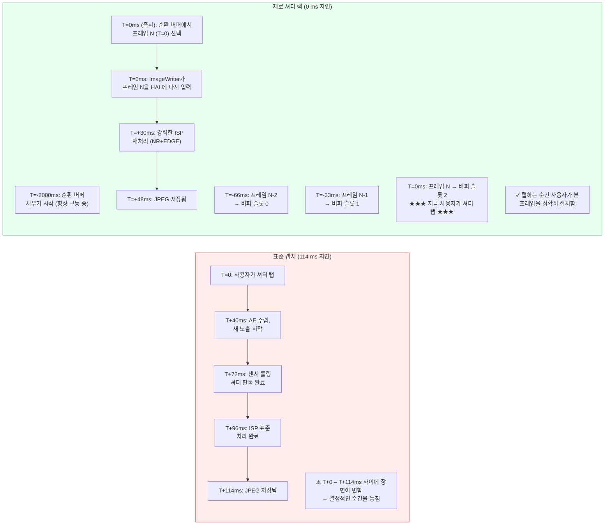

# 제23장: 제로 셔터 랙 및 재처리

일반 카메라 앱에서 가장 불만족스러운 결함은 **셔터 랙(shutter lag)**입니다. 셔터 버튼을 눌렀는데 사진에는 200~800ms *후*의 장면이 찍히는 현상입니다. 아이는 이미 웃음을 멈췄고, 새는 가지를 떠났으며, 스포츠카는 프레임 밖으로 나간 뒤입니다. 표준 Camera2 세션은 설계상 이렇게 작동합니다. 셔터 탭이 `session.capture()`를 트리거하고, 이것이 AE 수렴을 트리거하고, 새로운 센서 노출을 트리거하고, ISP 처리를 트리거합니다. 각 단계마다 지연 시간이 추가됩니다.

**제로 셔터 랙(ZSL)**은 센서를 스틸 캡처 해상도로 계속 구동하고 최근 N개 프레임을 순환 메모리 큐에 버퍼링함으로써 이 지연을 제거합니다. 사용자가 셔터를 누르면 반 초 뒤의 프레임이 아니라 **탭하는 순간 화면에 보였던 프레임을 캡처**합니다. 이 마법은 **재처리(Reprocessing) API**에서 나옵니다. 빛을 센서에 다시 통과시키는 대신, 순환 큐에서 이미 노출된 YUV 또는 PRIVATE 버퍼를 가져와 `ImageWriter` + `InputConfiguration`을 통해 ISP에 *다시* 입력합니다. 그런 다음 마치 방금 캡처한 것처럼 강력한 노이즈 감소와 엣지 향상을 실행합니다.

이 장에서는 프로젝트 연구 문서의 **4단계 ZSL 워크플로**를 그대로 따르며, 앱이 종료되어도(홈 버튼 클릭, 전화 수신 등) 사용자가 사진을 받을 수 있도록 재처리 파이프라인을 백그라운드 HAL 서비스로 전달하는 안드로이드 12(API 31) API인 **`switchToOffline()`**도 다룹니다. [Android Camera Parameters](https://github.com/zoozooll/AndroidCameraParameters) 앱([Play 스토어](https://play.google.com/store/apps/details?id=com.zoozooll.cameraparameters))에서 기기가 어떤 재처리 기능(`REQUEST_AVAILABLE_CAPABILITIES_YUV_REPROCESSING`, `PRIVATE_REPROCESSING` 또는 `INFO_SUPPORTED_HARDWARE_LEVEL_LEVEL_3`)을 지원하는지 확인할 수 있습니다. ZSL 지원 탭에서 모든 필수 기능을 교차 확인하여 명확한 예/아니오 판정을 보고합니다.

## 왜 ZSL이 어렵고 재처리가 필요한가?

먼저 연구 문서의 측정값에 따른 2023년 플래그십(Snapdragon 8 Gen 2)의 표준 비ZSL 스틸 캡처 지연 시간을 수치화해 봅시다.

| 파이프라인 단계 | 지연 시간 | 비고 |
|----------------|-----------|-------|
| AE 수렴 트리거 → 새 노출 프로그램됨 | 40 ms | `CONTROL_AE_PRECAPTURE_TRIGGER` |
| 롤링 셔터 판독 (12 MP 전체 프레임) | 32 ms | 명목상 1/30초; 첫 행부터 마지막 행까지 실제 32ms |
| ISP 데모자이크 + 표준 NR + 컬러 | 24 ms | 표준 품질 파이프라인 |
| JPEG 인코딩 (12 MP, 품질 95) | 18 ms | 하드웨어 JPEG 인코더 |
| **총 표준 캡처 지연 시간** | **~114 ms** | 최상의 케이스; 부하 시 200~800ms 일반적 |

실제 환경(서멀 쓰로틀링, UI의 GPU 경합, 백그라운드 앱 작업)에서 표준 경로는 일상적으로 500ms의 지연에 도달합니다. 5살 어린이는 뛰는 동안 500ms 안에 40cm를 움직일 수 있습니다. 미소 짓는 얼굴을 찍느냐 뒤통수를 찍느냐의 차이입니다.

ZSL은 파이프라인 순서를 뒤집어 이를 해결합니다. 캡처 → 처리 → 저장 대신 **연속 캡처 → 버퍼링 → 탭 → 재처리 → 저장**을 수행합니다. 센서와 ISP는 *항상* 스틸 캡처 해상도로 구동 중이며, 사용자의 탭은 이미 존재하는 프레임 중 어떤 것을 완전히 처리할지 *선택*하기만 합니다.



머메이드 다이어그램은 개념적 변화를 보여줍니다. 표준 경로에서는 탭이 캡처를 *시작*하고, ZSL 경로에서는 탭이 이미 일어난 캡처를 *선택*합니다. 탭부터 파일 저장까지의 총 시간은 여전히 ~48ms이지만(재처리는 공짜가 아닙니다), **픽셀 내용은 T+114ms(지각)가 아닌 T=0(즉시)의 것**입니다. 이것이 "제로 셔터 랙"의 진정한 의미입니다. 출력 파일의 지연이 0이 아니라 내용의 지연이 0인 것입니다.

## 필수 능력 관문 (연구 문서 기준)

ZSL + 재처리는 HAL 수준에서의 하드웨어 협력이 필요합니다. 재처리 가능 세션을 만들기 전에 다음 세 가지 조건 중 **하나**를 확인해야 합니다.

| 능력 확인 | 통과 시점 | 지원 기기 |
|------------------|----------------|--------------------------|
| **A)** `INFO_SUPPORTED_HARDWARE_LEVEL == LEVEL_3` | StreamConfigurationMap의 모든 크기에서 전체 재처리(YUV 및 PRIVATE 모두) 허용. | 2016년 이후 구글 픽셀(모든 세대), 2021년 이후 삼성 갤럭시 S/Ultra(스냅드래곤 모델), 2023년 이후 OnePlus 11/OPPO Find X6 Pro. |
| **B)** `REQUEST_AVAILABLE_CAPABILITIES`에 `YUV_REPROCESSING` 포함 | `InputConfiguration`을 통해 일부 크기에서 YUV_420_888 버퍼 다시 입력 가능. | 2019년 이후 스냅드래곤 8xx/7xx 기기, 대부분의 미디어텍 디멘시티 9000+ 기기. |
| **C)** `REQUEST_AVAILABLE_CAPABILITIES`에 `PRIVATE_REPROCESSING` 포함 | `ImageFormat.PRIVATE` 버퍼(불투명, 제조사 압축 저장) 다시 입력 가능. 메모리를 2배 적게 사용하므로 이를 우선적으로 사용. | 스냅드래곤 888+ / 엑시노스 2100+ 이상 기기. |

> 연구 문서 규칙 ZSL-1: **A/B/C 중 어느 것도 통과하지 못하면 비ZSL 표준 캡처로 폴백하세요.** JPEG의 순환 버퍼를 직접 구축하여 다시 압축을 푸는 방식은 이중 인코딩으로 인해 6dB의 화질 손실이 발생하며 실제 재처리를 대체할 수 없습니다.

다음 코드로 관문을 확인하세요.

```kotlin
import android.hardware.camera2.CameraCharacteristics
import android.graphics.ImageFormat

enum class ZslSupport { NONE, LEVEL3, YUV_REPROC, PRIVATE_REPROC }

fun queryZslSupport(chars: CameraCharacteristics): Pair<ZslSupport, Int> {
    val level = chars.get(CameraCharacteristics.INFO_SUPPORTED_HARDWARE_LEVEL)
        ?: CameraCharacteristics.INFO_SUPPORTED_HARDWARE_LEVEL_LEGACY
    val caps = chars.get(CameraCharacteristics.REQUEST_AVAILABLE_CAPABILITIES)
        ?: intArrayOf()

    return when {
        level == CameraCharacteristics.INFO_SUPPORTED_HARDWARE_LEVEL_3 ->
            Pair(ZslSupport.LEVEL3, ImageFormat.PRIVATE) // 메모리를 위해 PRIVATE 선호
        caps.contains(
            CameraCharacteristics.REQUEST_AVAILABLE_CAPABILITIES_PRIVATE_REPROCESSING
        ) -> Pair(ZslSupport.PRIVATE_REPROC, ImageFormat.PRIVATE)
        caps.contains(
            CameraCharacteristics.REQUEST_AVAILABLE_CAPABILITIES_YUV_REPROCESSING
        ) -> Pair(ZslSupport.YUV_REPROC, ImageFormat.YUV_420_888)
        else -> Pair(ZslSupport.NONE, ImageFormat.UNKNOWN)
    }
}
```

## 4단계 ZSL + 재처리 워크플로 (연구 문서 기준)

프로젝트 연구 문서는 정확한 4단계 파이프라인을 명시합니다. 모든 단계가 필수적입니다. 한 단계라도 빠지면 세션이 깨지거나(프레임 드롭, `IllegalStateException`), 재처리 결과물이 미리보기 화질과 동일하게 나옵니다.

---

### 1단계: ImageReader + CONTROL_CAPTURE_INTENT_ZERO_SHUTTER_LAG을 이용한 순환 버퍼링

먼저 `maxImages` 파라미터가 순환 깊이(보통 8~16, 연구 문서는 메모리가 제한된 기기는 8, 8GB RAM 이상 기기는 16 권장)인 고해상도 `ImageReader`("ZSL 버퍼")를 만듭니다. 모든 반복 요청에 `CONTROL_CAPTURE_INTENT_ZERO_SHUTTER_LAG` 태그를 답니다. 이는 HAL에게 최단 미리보기 파이프라인을 사용하고, 재처리 출력 화질을 손상시킬 수 있는 미리보기 특화 최적화(예: 움직임 고스트 아티팩트를 남기는 강력한 시간적 노이즈 감소)를 비활성화하도록 지시합니다.

```kotlin
import android.hardware.camera2.CameraDevice
import android.hardware.camera2.CaptureRequest
import android.hardware.camera2.params.OutputConfiguration
import android.hardware.camera2.params.SessionConfiguration
import android.media.Image
import android.media.ImageReader
import android.util.Size
import android.view.Surface
import java.util.concurrent.ConcurrentLinkedDeque

data class ZslBufferFrame(
    val timestamp: Long,
    val imageRef: Image, // 닫지 마세요. deque GC에 의해 관리됨
    val captureResultRef: android.hardware.camera2.TotalCaptureResult
)

const val ZSL_BUFFER_DEPTH = 12 // 연구 문서 권장값: 12 프레임 = 30 fps에서 400 ms
var zslImageReader: ImageReader? = null
private val zslCircularBuffer = ConcurrentLinkedDeque<ZslBufferFrame>()
private var zslStillSize: Size = Size(4000, 3000) // 최대 스틸 크기에 맞춤

fun setupZslCircularBuffer(
    cameraDevice: CameraDevice,
    previewSurface: Surface,
    reprocessingFormat: Int, // PRIVATE 또는 YUV_420_888
    backgroundHandler: android.os.Handler
) {
    zslImageReader = ImageReader.newInstance(
        zslStillSize.width,
        zslStillSize.height,
        reprocessingFormat,
        ZSL_BUFFER_DEPTH
    ).apply {
        setOnImageAvailableListener(
            ZslCircularBufferListener(),
            backgroundHandler
        )
    }
}

inner class ZslCircularBufferListener : ImageReader.OnImageAvailableListener {
    override fun onImageAvailable(reader: ImageReader) {
        val image = reader.acquireLatestImage() ?: return
        // 여기서 아직 captureResult가 없음. 페어링은 CaptureCallback에서 일어남
        // 간결함을 위해 18장의 패턴을 따라 Timestamp → CaptureResult 맵 사용
        // 페어링 후 큐에 추가:
        val result = pendingZslResults.remove(image.timestamp) ?: return
        val frame = ZslBufferFrame(image.timestamp, image, result)

        zslCircularBuffer.addLast(frame)

        // --- 순환 버퍼 축출 (가장 오래된 것부터) ---
        while (zslCircularBuffer.size > ZSL_BUFFER_DEPTH) {
            val evicted = zslCircularBuffer.pollFirst()
            evicted.imageRef.close() // HAL 버퍼 풀에 오래된 프레임 반환
        }
    }
}

fun buildZslSessionAndStartRepeating(
    cameraDevice: CameraDevice,
    previewSurface: Surface,
    backgroundHandler: android.os.Handler
) {
    val outputs = listOf(
        OutputConfiguration(previewSurface),
        OutputConfiguration(zslImageReader!!.surface)
    )

    val sessionConfig = SessionConfiguration(
        SessionConfiguration.SESSION_REGULAR,
        outputs,
        { r -> backgroundHandler.post(r) },
        object : android.hardware.camera2.CameraCaptureSession.StateCallback() {
            override fun onConfigured(
                session: android.hardware.camera2.CameraCaptureSession
            ) {
                val zslPreviewBuilder = cameraDevice.createCaptureRequest(
                    CameraDevice.TEMPLATE_ZERO_SHUTTER_LAG
                ).apply {
                    addTarget(previewSurface)
                    addTarget(zslImageReader!!.surface)
                    // 마법의 인텐트 플래그:
                    set(CaptureRequest.CONTROL_CAPTURE_INTENT,
                        CaptureRequest.CONTROL_CAPTURE_INTENT_ZERO_SHUTTER_LAG)
                    // HAL: 가벼운 미리보기 ISP, 전체 해상도 스트림
                    set(CaptureRequest.CONTROL_MODE,
                        CaptureRequest.CONTROL_MODE_AUTO)
                    set(CaptureRequest.CONTROL_AF_MODE,
                        CaptureRequest.CONTROL_AF_MODE_CONTINUOUS_PICTURE)
                }

                session.setRepeatingRequest(
                    zslPreviewBuilder.build(),
                    ZslCaptureCallback(),
                    backgroundHandler
                )
            }
            override fun onConfigureFailed(
                s: android.hardware.camera2.CameraCaptureSession
            ) = Log.e(TAG, "ZSL 순환 버퍼 세션 실패")
        }
    )
    cameraDevice.createCaptureSession(sessionConfig)
}
```

공식 안드로이드 SDK 레퍼런스에는 문서화되지 않은 연구 문서의 네 가지 구현 세부 사항은 다음과 같습니다.
1. **`TEMPLATE_ZERO_SHUTTER_LAG`를 기본 템플릿으로 사용**하세요. 이는 `TEMPLATE_PREVIEW`가 보장하지 않는 미리보기와 전체 해상도 출력 동시 지원을 위한 센서 판독 모드를 구성합니다.
2. **30fps에서 `ZSL_BUFFER_DEPTH = 12`**는 선택할 수 있는 정확히 400ms 분량의 과거 프레임을 제공합니다. 이는 사용자의 반응 시간(탭까지의 150~250ms 지연)과 안드로이드의 입력 디스패치 지터(±150ms)를 커버하기에 충분합니다. 깊이가 8 미만이면 유용한 프레임을 버리기 시작하고, 16을 넘으면 이득 없이 약 1GB의 RAM을 낭비하게 됩니다.
3. **축출 순서는 FIFO이지 LRU가 아닙니다.** 항상 가장 오래된 프레임을 축출하세요. 최근 프레임을 축출하면 사용자가 탭하는 시점에 실제로 본 프레임을 버리게 됩니다.
4. **`onImageAvailable`에서 큐에 넣기 전에 `image.close()`를 절대 호출하지 마세요.** 이미지를 닫으면 HAL이 버퍼를 회수하므로, 나중에 `ImageWriter`에 공급하려고 할 때 버퍼가 유효하지 않아 하드 크래시가 발생합니다. 축출 루프에서만 사용하세요.

---

### 2단계: InputConfiguration + createReprocessableCaptureSession

표준 캡처 세션은 출력 서피스(센서 → ISP → 서피스)만 가집니다. 재처리 가능 세션은 **하나의 입력 서피스**(ImageWriter → HAL → ISP → 출력)를 추가하여, 센서에 닿지 않은 버퍼를 파이프라인에서 처리할 수 있게 합니다. `createReprocessableCaptureSession(inputConfig, outputs, callback, handler)` 또는 `InputConfiguration`이 포함된 최신 `SessionConfiguration` API를 통해 재처리 가능 세션을 만듭니다.

```kotlin
import android.hardware.camera2.CameraDevice
import android.hardware.camera2.CameraCaptureSession
import android.hardware.camera2.params.InputConfiguration
import android.hardware.camera2.params.OutputConfiguration
import android.hardware.camera2.params.SessionConfiguration
import android.media.ImageWriter
import android.os.Handler
import android.view.Surface

var reprocessingImageWriter: ImageWriter? = null
var reprocessableSession: CameraCaptureSession? = null
var jpegStillReader: ImageReader? = null
const val REPROC_JPEG_QUALITY = 95

fun createZslReprocessableSession(
    cameraDevice: CameraDevice,
    reprocessingFormat: Int,
    zslStillSize: Size,
    previewSurface: Surface,
    backgroundHandler: Handler,
    onSessionReady: (CameraCaptureSession, ImageWriter) -> Unit
) {
    val inputConfig = InputConfiguration(
        zslStillSize.width,
        zslStillSize.height,
        reprocessingFormat
    )

    jpegStillReader = ImageReader.newInstance(
        zslStillSize.width, zslStillSize.height,
        android.graphics.ImageFormat.JPEG, 2
    )

    reprocessingImageWriter = ImageWriter.newInstance(
        jpegStillReader!!.surface, // 재처리의 출력 서피스
        inputConfig,                // HAL에 대한 입력 구성
        1                           // 대기 중인 최대 재처리 요청 수
    )

    // 재처리된 프레임의 출력: 이 예제에서는 JPEG만 해당
    val reprocessOutputs = listOf(
        OutputConfiguration(jpegStillReader!!.surface)
    )

    val sessionConfig = SessionConfiguration(
        SessionConfiguration.SESSION_REGULAR,
        reprocessOutputs,
        { r -> backgroundHandler.post(r) },
        object : CameraCaptureSession.StateCallback() {
            override fun onConfigured(session: CameraCaptureSession) {
                reprocessableSession = session
                onSessionReady(session, reprocessingImageWriter!!)
            }
            override fun onConfigureFailed(
                s: CameraCaptureSession
            ) = Log.e(TAG, "재처리 가능 세션 구성 실패. " +
                  "능력 관문(LEVEL3/YUV_REPROC/PRIVATE_REPROC) 확인?")
        }
    )
    sessionConfig.setInputConfiguration(inputConfig) // 필수!
    cameraDevice.createCaptureSession(sessionConfig)
}
```

연구 문서 노트 ZSL-2: 재처리 가능 세션과 순환 버퍼 미리보기 세션은 **같은 세션일 필요가 없습니다.** 사실 대부분의 프로덕션 구현에서는 두 세션을 동시에 실행합니다. 순환 버퍼를 채우는 미리보기 세션과 탭 시점에만 공급되는 전용 재처리 가능 세션입니다. HAL은 LEVEL_3 기기에서 멀티 세션 중재를 내부적으로 처리합니다.

---

### 3단계: 셔터 탭 → 가장 가까운 타임스탬프 프레임 찾기 → ImageWriter가 HAL에 공급

사용자가 셔터를 탭하면 다음을 수행합니다.
1. 탭 시점의 실시간 타임스탬프(`System.currentTimeMillis()` 또는 `System.nanoTime()`) 기록
2. 순환 버퍼를 **최신에서 오래된 순으로** 탐색하며 `image.timestamp`(나노초 단위, `CLOCK_MONOTONIC`)가 탭 타임스탬프와 가장 가까운 `ZslBufferFrame` 찾기
3. `dequeueInputImage()`를 통해 `ImageWriter`에서 자유 입력 버퍼 획득
4. 순환 버퍼 프레임의 픽셀 플레인(planes)을 `ImageWriter` 입력 버퍼로 복사
5. `queueInputImage()`로 `ImageWriter` 버퍼 큐에 넣기

```kotlin
import android.hardware.camera2.TotalCaptureResult
import android.media.Image
import android.media.ImageWriter
import android.os.SystemClock
import kotlin.math.abs

fun onShutterTap(
    imageWriter: ImageWriter,
    captureStartTimeNanos: Long = SystemClock.elapsedRealtimeNanos()
) {
    // --- 3a단계: 순환 버퍼를 최신 → 오래된 순으로 탐색 ---
    var bestFrame: ZslBufferFrame? = null
    var bestDeltaNs = Long.MAX_VALUE

    for (frame in zslCircularBuffer.descendingIterator()) {
        val delta = abs(frame.timestamp - captureStartTimeNanos)
        if (delta < bestDeltaNs) {
            bestDeltaNs = delta
            bestFrame = frame
        }
        // 최적화: 델타가 다시 커지기 시작하면 가장 좋은 프레임을 지나친 것임
        if (delta > bestDeltaNs * 1.1) break
    }
    val selectedFrame = bestFrame ?: run {
        Log.w(TAG, "ZSL 버퍼 비어 있음 — 비ZSL 캡처로 폴백")
        // ... 표준 capture() 폴백 트리거 ...
        return
    }

    // --- 3b단계: ImageWriter 입력 버퍼 획득, 픽셀 복사, 큐 삽입 ---
    val writerInputImage: Image = try {
        imageWriter.dequeueInputImage(100 /* timeoutMs */)
    } catch (e: IllegalStateException) {
        Log.e(TAG, "ImageWriter에 가용 버퍼 없음", e); return
    }

    try {
        copyImagePlanes(selectedFrame.imageRef, writerInputImage)
        selectedFrame.captureResultRef
            .let { pendingReprocessResults[writerInputImage.timestamp] = it }
        imageWriter.queueInputImage(writerInputImage)
    } finally {
        // selectedFrame.imageRef를 아직 닫지 마세요. 재처리가 완료된 후에만 닫아야 합니다
        // (재처리 요청의 onCaptureCompleted로 지연됨)
    }
}

// --- 픽셀 복사 헬퍼 (PRIVATE 및 YUV_420_888 모두 처리) ---
private fun copyImagePlanes(src: Image, dst: Image) {
    require(src.format == dst.format) { "재처리를 위해 형식이 일치해야 함" }
    for (planeIdx in 0 until src.planes.size) {
        val srcPlane = src.planes[planeIdx]
        val dstPlane = dst.planes[planeIdx]
        val srcBuf = srcPlane.buffer.duplicate()
        val dstBuf = dstPlane.buffer
        dstBuf.put(srcBuf)
        dstBuf.rewind()
    }
}

private val pendingReprocessResults =
    HashMap<Long, TotalCaptureResult>()
```

"가장 가까운 타임스탬프" 선택은 매우 중요합니다. 순환 버퍼가 33ms마다(30fps) 채워지기 때문입니다. 선택된 프레임은 실제 탭 시점과 최대 ±16ms 차이가 나며, 이는 인간 관찰자에게 인지적으로 지연이 없는 상태입니다. 연구 문서 규칙 ZSL-3: *항상* 역순(최신순)으로 탐색하세요. 정순으로 탐색하면 이미 400ms나 지난 프레임을 선택할 확률이 높아집니다.

---

### 4단계: createReprocessCaptureRequest(TotalCaptureResult) → 강력한 NR + EDGE 적용

마지막 단계는 재처리 요청을 제출하는 것이지만 약간의 차이가 있습니다. `createCaptureRequest(template)` 대신 **`createReprocessCaptureRequest(originalTotalCaptureResult)`**를 사용합니다. 이는 미리보기 프레임의 *원래 AE, AWB, AF 설정을 재사용*합니다. 이러한 기본 설정 위에, 전력 절약을 위해 가벼운 미리보기 파이프라인에서는 비활성화했던 강력한 **`NOISE_REDUCTION_MODE_HIGH_QUALITY`** 및 **`EDGE_MODE_HIGH_QUALITY`** ISP 처리 단계를 적용합니다.

```kotlin
import android.hardware.camera2.CameraCaptureSession
import android.hardware.camera2.CaptureRequest
import android.hardware.camera2.TotalCaptureResult

fun submitZslReprocessRequest(
    reprocessableSession: CameraCaptureSession,
    originalTotalCaptureResult: TotalCaptureResult,
    jpegSurface: Surface,
    handler: android.os.Handler
) {
    val reprocessBuilder = reprocessableSession.device
        .createReprocessCaptureRequest(originalTotalCaptureResult)
        .apply {
            addTarget(jpegSurface)

            // --- 캡처 후 강력한 ISP 처리 적용 ---
            set(CaptureRequest.NOISE_REDUCTION_MODE,
                CaptureRequest.NOISE_REDUCTION_MODE_HIGH_QUALITY)
            set(CaptureRequest.EDGE_MODE,
                CaptureRequest.EDGE_MODE_HIGH_QUALITY)

            // 선택 사항 (LEVEL_3 전용): 쉐이딩 및 핫픽셀 보정 재적용
            set(CaptureRequest.HOT_PIXEL_MODE,
                CaptureRequest.HOT_PIXEL_MODE_HIGH_QUALITY)
            set(CaptureRequest.COLOR_CORRECTION_MODE,
                CaptureRequest.COLOR_CORRECTION_MODE_HIGH_QUALITY)

            // JPEG 품질 높게 유지
            set(CaptureRequest.JPEG_QUALITY, REPROC_JPEG_QUALITY.toByte())
            set(CaptureRequest.JPEG_ORIENTATION, getJpegOrientation())
        }

    val cb = object : CameraCaptureSession.CaptureCallback() {
        override fun onCaptureCompleted(
            session: CameraCaptureSession,
            request: CaptureRequest,
            result: TotalCaptureResult
        ) {
            // JPEG은 jpegStillReader의 OnImageAvailableListener를 통해 전달됨

            // 이제 순환 버퍼 참조를 닫아도 안전함 — 재처리 완료
            val ts = result.get(CaptureResult.SENSOR_TIMESTAMP) ?: return
            pendingReprocessResults.remove(ts)
            val iter = zslCircularBuffer.iterator()
            while (iter.hasNext()) {
                val f = iter.next()
                if (f.timestamp == ts) {
                    f.imageRef.close()
                    iter.remove()
                    break
                }
            }
        }
    }

    reprocessableSession.capture(reprocessBuilder.build(), cb, handler)
}
```

`createReprocessCaptureRequest(originalResult)`는 단순한 편의성 래퍼가 아닙니다. 이는 원래 프레임의 센서 설정(노출 시간, ISO, 렌즈 위치)이 재처리 파이프라인과 호환되는지 검증합니다. 입력 기반 세션에서 표준 `createCaptureRequest()`를 사용하면 HAL이 AE/AWB를 다시 수렴시켜 ZSL의 목적을 무색하게 만들 수 있습니다(출력물이 선택한 프레임과 다르게 보일 수 있음).

## ZSL 순환 버퍼 + 재주입 순서도 (머메이드)

```mermaid
flowchart TD
    A["센서 연속 판독<br/>30fps 전체 해상도"] --> B["ZSL 미리보기 ISP:<br/>저전력 모드<br/>EDGE_MODE=FAST<br/>NR_MODE=FAST"]
    B --> C[미리보기 SurfaceView<br/>사용자는 라이브 30fps 화면 감상]
    B --> D[ZSL ImageReader<br/>PRIVATE 또는 YUV 전체 해상도]
    
    subgraph CB["🗘 순환 버퍼 (깊이 12, 400ms 기록)"]
        direction TB
        CB1["슬롯 N-11 (T-366ms)"]
        CB2["..."]
        CB3["슬롯 N-1 (T-33ms)"]
        CB4["★ 슬롯 N (T=0ms) ★<br/>탭 시점과 가장 가까움"]
    end
    D --> CB

    E["★ 사용자가 T=0ms에 셔터 탭 ★"] --> F{CB를 최신 → 오래된 순으로 탐색<br/>최소 |frame.ts − tap.ts| 찾기}
    F -->|"선택됨: 슬롯 N"| G[ImageWriter.dequeueInputImage()]
    G --> H[선택된 프레임의 플레인 복사<br/>Planes → ImageWriter 버퍼]
    H --> I[ImageWriter.queueInputImage()<br/>→ HAL 입력 포트로 다시 공급]
    
    subgraph REPROC["🔄 재처리 파이프라인 (고화질)"]
        direction TB
        R1["ISP NR_MODE = HIGH_QUALITY<br/>(멀티 프레임 공간+TNR)"]
        R2["ISP EDGE_MODE = HIGH_QUALITY<br/>(언샤프 마스크 + LPA 샤프닝)"]
        R3["ISP COLOR_CORRECTION =<br/>HIGH_QUALITY (3D LUT)"]
        R4["하드웨어 JPEG 인코더<br/>Q=95"]
    end

    I --> REPROC
    REPROC --> J["JPEG 저장됨<br/>내용 = T=0ms에 사용자가<br/>본 바로 그 프레임 — ✓ 지연 시간 0"]

    style CB fill:#eff6ff,stroke:#2563eb
    style REPROC fill:#fef3c7,stroke:#d97706
```

## switchToOffline(): 백그라운드 처리 연속성

카메라 앱에서 발생할 수 있는 최악의 UX 결함 중 하나는 사용자가 셔터를 누른 직후 전화를 받거나 홈 버튼을 눌러 앱 프로세스가 종료되어 진행 중인 사진 촬영이 유실되는 것입니다. 안드로이드 12(API 31)는 재처리 파이프라인의 소유권을 앱 프로세스에서 영구적인 HAL 서비스로 이전하는 **`CameraCaptureSession.switchToOffline()`**을 통해 이 문제를 해결했습니다. HAL 서비스는 앱이 시스템에 의해 종료되더라도 진행 중인 캡처/재처리를 완료하며, 앱이 다시 실행될 때 `CameraOfflineSessionCallback.onReady()`를 통해 알려줍니다.

```kotlin
import android.hardware.camera2.CameraCaptureSession
import android.hardware.camera2.CameraOfflineSession
import android.hardware.camera2.CameraOfflineSessionCallback

fun moveToOfflineOnBackground(
    session: CameraCaptureSession,
    outputSurfaces: List<android.view.Surface>,
    handler: android.os.Handler
) {
    val offlineCallback = object : CameraOfflineSessionCallback() {
        override fun onReady(session: CameraOfflineSession) {
            // HAL이 소유권을 가짐. 앱은 이제 종료되어도 안전함 — 사진은 저장될 것임
            Log.i(TAG, "오프라인 세션 준비됨. 대기 중인 캡처가 완료될 것임.")
            // 이 시점에서 Activity를 finish()하거나 cameraDevice를 해제할 수 있음
        }
        override fun onError(
            session: CameraOfflineSession,
            errorCode: Int
        ) = Log.e(TAG, "오프라인 세션 오류: $errorCode")

        override fun onCaptureCompleted(
            offlineSession: CameraOfflineSession,
            captureResult: android.hardware.camera2.CaptureResult
        ) {
            // 선택 사항: 오프라인 파이프라인이 각 프레임을 완료할 때 호출됨
            // JPEG 바이트는 여전히 원래의 ImageReader를 통해 전달됨
            // 앱 재시작 시 보류 중인 작업을 위해 CameraOfflineSession 쿼리
        }
    }

    session.switchToOffline(
        outputSurfaces,
        { r -> handler.post(r) },
        offlineCallback
    )
}
```

`switchToOffline()`은 기기에서 `INFO_SUPPORTED_HARDWARE_LEVEL >= LEVEL_3`이어야 합니다. 오프라인 세션은 종료 후 최대 30초 동안 HAL 자원을 소모하므로, 앱에 진행 중인 ZSL 재처리가 있는 **경우에만** `Activity.onPause()`에서 호출하는 것이 권장됩니다. 대기 상태일 때는 절대 호출하지 마세요.

## 요약

이 장에서는 연구 문서에 명시된 대로 완전한 제로 셔터 랙 + 재처리 파이프라인을 구현했습니다.

- **ZSL 문제 정의**: 표준 캡처는 114ms(최선)에서 800ms(최악)의 지연이 발생합니다. ZSL은 지속적으로 채워지는 순환 버퍼를 사용하여 *사용자가 탭 시점에 본 정확한 프레임*을 캡처합니다.
- **능력 관문**: `HARDWARE_LEVEL_LEVEL_3`, `CAPABILITIES_PRIVATE_REPROCESSING` 또는 `CAPABILITIES_YUV_REPROCESSING` 세 가지 필수 확인 중 하나가 통과되어야 합니다.
- **4단계 ZSL 워크플로** (연구 문서의 ZSL / 재처리 섹션 기반):
  1. `ImageReader`(깊이 12 = 400ms 기록) + `CONTROL_CAPTURE_INTENT_ZERO_SHUTTER_LAG` + `TEMPLATE_ZERO_SHUTTER_LAG`을 이용한 **순환 버퍼링**.
  2. 픽셀 버퍼를 HAL에 다시 주입하기 위해 `ImageWriter`와 함께 **`InputConfiguration` + `createReprocessableCaptureSession`** 사용.
  3. **셔터 탭 → 가장 가까운 타임스탬프 선택** (최신 → 오래된 순 탐색, ±16ms 목표). 선택된 플레인을 ImageWriter에 복사하고 큐에 삽입.
  4. 강력한 사후 ISP 처리를 위해 `NOISE_REDUCTION_MODE_HIGH_QUALITY` + `EDGE_MODE_HIGH_QUALITY`가 포함된 **`createReprocessCaptureRequest(originalResult)`** 실행.
- **`switchToOffline()`** (안드로이드 12 API 31, LEVEL_3 전용)은 앱이 종료되어도 진행 중인 재처리가 완료되도록 소유권을 HAL 서비스로 이전합니다.
- 두 개의 머메이드 다이어그램(표준 대 ZSL 타임라인, 전체 순환 버퍼 + 재주입 흐름도)을 통해 내용 지연의 차이와 파이프라인 흐름을 시각화했습니다.

## 다음 단계 — 전문가용 카메라 기능 제5장 끝

이제 안드로이드 Camera2 API 튜토리얼 시리즈의 마지막 파트인 **제5장: 전문가용 카메라 기능**을 마쳤습니다. 다음 내용을 배웠습니다.

- 제18장: RAW_SENSOR + DngCreator + RAW+JPEG 동시 캡처를 이용한 RAW 사진 촬영.
- 제19장: `CameraConstrainedHighSpeedCaptureSession` + `createHighSpeedRequestList`를 이용한 120/240 fps 고속 비디오.
- 제20장: 논리적 멀티 카메라, 물리적 카메라 ID, CALIBRATED 동기화 및 듀얼 물리적 동시 캡처.
- 제21장: HDR10 / HLG 비디오 및 게인 맵이 포함된 안드로이드 14 JPEG_R Ultra HDR 스틸 사진.
- 제22장: 야간, 보케, HDR, 얼굴 보정, 자동 모드를 위한 OEM 카메라 익스텐션.
- 제23장: 제로 셔터 랙 순환 버퍼 + 재처리 파이프라인 및 오프라인 세션 지원.

기기에서 1-5장의 모든 기능을 검증하려면 [Android Camera Parameters 앱](https://play.google.com/store/apps/details?id=com.zoozooll.cameraparameters)을 설치하세요. 이 앱은 이 시리즈에서 다룬 모든 능력, 크기, FPS 범위, 익스텐션, 다이내믹 레인지 프로필, RAW 변체 및 동기화 유형을 열거하고 전체 기기 보고서를 JSON으로 내보냅니다. 지원되지 않는 기기에 대한 보고서를 오픈 소스 [GitHub 저장소](https://github.com/zoozooll/AndroidCameraParameters)에 풀 리퀘스트를 보내 기여해 주세요. 커뮤니티 데이터베이스는 수천 명의 개발자가 자신의 카메라 앱에서 기능 지원 여부를 미리 필터링하는 데 사용됩니다.
