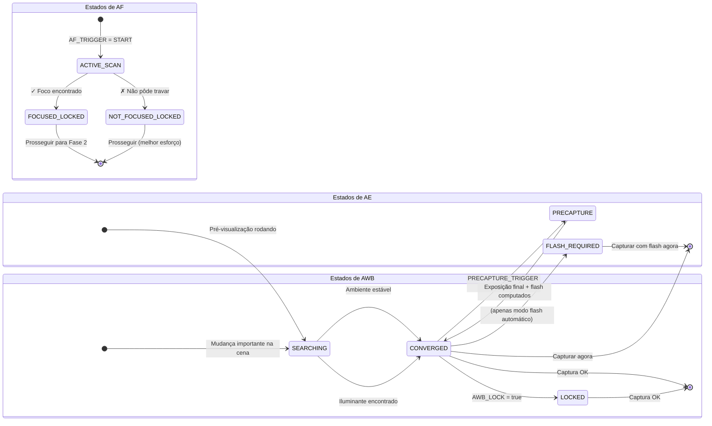

# Capítulo 17: O Pipeline 3A

Estudamos o **AE** (Exposição Automática, Capítulos 13–14), o **AF** (Foco Automático, Capítulo 15) e o **AWB** (Balanço de Branco Automático, Capítulo 16) como sistemas independentes. Os aplicativos de fotografia reais devem coordenar todos os três antes de cada pressionamento do obturador — e a *ordem e o tempo* importam profundamente.

Uma implementação ingênua que dispara `capture()` imediatamente quando o usuário toca no botão do obturador produz resultados inconsistentes: às vezes foca, às vezes não; às vezes o flash dispara, às vezes não; às vezes o AWB no meio da varredura produz uma foto com tons verdes. Um pipeline 3A confiável elimina tudo isso.

A implementação do pipeline 3A neste capítulo é idêntica ao fluxo usado internamente no [aplicativo Android Camera Parameters](https://github.com/zoozooll/AndroidCameraParameters) e à sequência descrita nos documentos de pesquisa de arquitetura da Android Camera e artigos da CSDN sobre desenvolvimento profissional de Camera2.

---

## A Sequência Completa de Orquestração 3A (Visão Geral)

Antes de mergulhar em cada subsistema, vamos visualizar o fluxo de estado completo. Esta é uma sequência de produção real — não uma simplificação.

```mermaid
sequenceDiagram
    actor User
    participant App as CaptureController
    participant HAL as Camera2 HAL
    participant AE as Mecanismo AE
    participant AF as Mecanismo AF
    participant AWB as Mecanismo AWB

    User->>App: Toca no botão "Capturar"
    App->>HAL: Definir AF_MODE = AUTO (ou MACRO)
    App->>HAL: CONTROL_AF_TRIGGER = START
    Note over HAL,AF: Varredura de foco inicia

    loop Cada quadro de pré-visualização
        HAL-->>App: CaptureResult
        App->>App: Verificar AF_STATE
    end

    AF-->>HAL: Trava de AF alcançada
    HAL-->>App: AF_STATE = FOCUSED_LOCKED ✓
    Note over App,AE: Foco estável → prosseguir para pré-captura AE

    App->>HAL: CONTROL_AE_PRECAPTURE_TRIGGER = START
    Note over HAL,AE: Medição de pré-captura<br/>(se o modo de flash exigir, dispara<br/>um pré-flash para medição)

    loop Cada quadro de pré-visualização
        HAL-->>App: CaptureResult
        App->>App: Verificar AE_STATE &amp; FLASH_STATE
    end

    AE-->>HAL: AE convergiu; exposição final decidida
    HAL-->>App: AE_STATE = CONVERGED (+ FLASH_STATE = READY se necessário) ✓
    AWB-->>HAL: AWB_STATE = CONVERGED (geralmente já concluído)
    Note over App: Todos os 3A convergiram! SEGURO PARA CAPTURAR

    App->>HAL: Solicitação Still Capture (TEMPLATE_STILL_CAPTURE)
    HAL->>HAL: Disparar flash principal se necessário
    HAL->>HAL: Expor o sensor, ler o quadro
    HAL-->>App: Quadro JPEG / RAW entregue via ImageReader

    App->>HAL: CONTROL_AF_TRIGGER = CANCEL
    App->>HAL: CONTROL_AE_PRECAPTURE_TRIGGER = IDLE
    App->>HAL: Restaurar AF_MODE = CONTINUOUS_PICTURE
    Note over App,HAL: Limpeza: a pré-visualização retoma o automático normal
```

**Cada etapa é bloqueante.** Você não avança para a etapa N+1 até que o HAL confirme o estado exigido na etapa N. Nunca pule etapas — é assim que você entrega um aplicativo com foco suave intermitente, exposições de flash ruins ou fotos com tons azulados.

---

## Mergulho Profundo no AE (Exposição Automática)

O AE é o mais complexo dos três "A"s porque engloba não apenas o obturador+ISO, mas também a **medição do flash** e o **gatilho de pré-captura**.

### Modos de AE: CONTROL_AE_MODE

| Modo | Comportamento | Suporte a Flash |
|------|----------|--------------|
| `OFF` | Totalmente manual (coberto no Cap. 14) | Nenhum |
| `ON` | Exposição automática, **flash desativado** (sempre desligado) | Não |
| `ON_AUTO_FLASH` | Exposição automática, **decisão de flash automático** — o HAL dispara o flash apenas em pouca luz | Automático (padrão mais comum) |
| `ON_ALWAYS_FLASH` | Exposição automática, **o flash sempre dispara** (flash de preenchimento para retratos em contraluz) | Sempre |
| `ON_AUTO_FLASH_REDEYE` | Exposição automática + flash + redução de olhos vermelhos (dispara uma sequência de pré-flash para fechar as pupilas) | Automático + olhos vermelhos |
| `ON_EXTERNAL_FLASH` | Flash acessório de câmera externa | Apenas externo (raro) |

**O padrão para um aplicativo de câmera normal** é `ON_AUTO_FLASH`. Os usuários esperam que o telefone "saiba" quando disparar o flash.

### Estados de AE e Gatilho de Pré-captura

Assim como o AF, o AE relata seu estado via `CaptureResult.CONTROL_AE_STATE`:

| Estado | Significado |
|-------|---------|
| `INACTIVE` (0) | AE desativado ou ainda não iniciado |
| `SEARCHING` (1) | Procurando ativamente pela exposição correta |
| `CONVERGED` (2) | A exposição está estável. Em modos de flash, isso significa que a exposição *ambiente* convergiu, mas uma varredura de pré-flash ainda não aconteceu. |
| `LOCKED` (3) | Exposição travada explicitamente via `CONTROL_AE_LOCK = true` |
| `FLASH_REQUIRED` (4) | Convergiu no ambiente, e o HAL decidiu que o **flash é necessário** para a foto correta |
| `PRECAPTURE` (5) | **Estado-chave.** A varredura de pré-captura está rodando — o HAL está medindo (disparando pulsos de pré-flash, se o flash for necessário) para calcular a exposição final da captura + a potência do flash. |

### Por que o Gatilho de Pré-captura é Importante

O mecanismo AE que roda nos quadros de pré-visualização é *aproximado*. O pipeline de pré-visualização usa buffers menores, processamento de menor profundidade de bits e não leva em conta a enorme contribuição de luz de um flash principal disparando no momento da captura.

`CONTROL_AE_PRECAPTURE_TRIGGER = START` diz ao HAL:

> "Estou prestes a tirar uma foto estática real. Pare de aproximar. Execute o pipeline de medição de precisão total. Se eu estiver em um modo de flash automático, dispare um ou mais pré-flashes de baixa potência, meça o reflexo e calcule o obturador/ISO/potência do flash final exato para a captura."

**Pular a pré-captura = fotos com flash ficam aleatoriamente superexpostas ou subexpostas.** O HAL simplesmente não teve a chance de medir o flash em tempo real.

### Regiões de AE (Medição Pontual)

Assim como `CONTROL_AF_REGIONS` para o foco, `CONTROL_AE_REGIONS` especifica *onde na cena* medir. Um "tocar para focar" em retrato deve aplicar simultaneamente a mesma região ao AE — o rosto recebe prioridade de foco E prioridade de exposição, e não é medido com base no fundo de céu brilhante.

```kotlin
// Use o MESMO array MeteringRectangle para as regiões de AF e AE
val focusWeightedRegions = arrayOf(userTapRegion)
builder.set(CaptureRequest.CONTROL_AF_REGIONS, focusWeightedRegions)
builder.set(CaptureRequest.CONTROL_AE_REGIONS, focusWeightedRegions)
```

**Peso:** Cada `MeteringRectangle` possui um `weight` (0–1000). Regiões com peso maior influenciam mais a medição. Um modo de "medição pontual" usa um retângulo de peso alto (1000). A medição "Matricial / Avaliativa" usa muitos retângulos de peso baixo espalhados pelo quadro.

---

## AWB: O Parceiro Silencioso do Trio

O AWB geralmente converge cedo e permanece convergido na maioria das cenas — é por isso que muitas vezes é tratado como um detalhe secundário. Mas sua contribuição para a precisão das cores é crítica, e ele *ainda* pode estar procurando quando você estiver pronto para capturar.

### Resumo dos Estados de AWB

| Estado do AWB | Decisão de Captura |
|-----------|------------------|
| `INACTIVE` (AWB_MODE = OFF) | OK para prosseguir (ganhos manuais) |
| `SEARCHING` | **Aguarde.** As cores ainda podem mudar. Geralmente < 500ms após mudança importante na cena. |
| `CONVERGED` | ✅ Perfeito — prossiga |
| `LOCKED` | ✅ Também perfeito — travado explicitamente via `CONTROL_AWB_LOCK = true` |

### Acoplando a Trava de AWB com as Travas de AE/AF

Para fotografia crítica de estúdio/produto, trave todos os três *antes* da captura:

```kotlin
// Na solicitação de captura estática (não antes — queremos os valores convergidos finais travados)
builder.set(CaptureRequest.CONTROL_AWB_LOCK, true)
builder.set(CaptureRequest.CONTROL_AE_LOCK, true)
// O AF permanece travado porque o acionamos anteriormente e não o cancelamos
```

Isso garante que a captura principal reutilize *exatamente* o mesmo perfil de cor/wb que o quadro de medição de pré-captura final utilizou.

---

## Controlador de Captura 3A de Produção Completo (Kotlin)

Agora vamos montar tudo em uma classe reutilizável. Esta implementação corresponde ao fluxo de orquestração nos documentos de pesquisa da arquitetura Android Camera na seção sobre Pipeline de Controle 3A e aos padrões recomendados pela série CSDN Android Camera.

```kotlin
class ThreeACaptureController(
    private val characteristics: CameraCharacteristics,
    private val captureSession: CameraCaptureSession,
    private val previewSurface: Surface,
    private val jpegReaderSurface: Surface,
    private val mainHandler: Handler
) {
    // ----------- API Pública -----------
    interface CaptureListener {
        fun onCaptureStarted() {}
        fun onCaptureSuccess(jpegBytes: ByteArray)
        fun onCaptureError(reason: String)
    }

    /**
     * Orquestrar a sequência completa de captura 3A:
     *   Gatilho AF → AF Travado → Pré-captura AE → AE Convergido → Captura Estática → Limpeza
     */
    fun captureStillPhoto(
        aeMode: Int = CameraMetadata.CONTROL_AE_MODE_ON_AUTO_FLASH,
        listener: CaptureListener
    ) {
        this.listener = listener
        listener.onCaptureStarted()
        beginPhase1_AfTrigger(aeMode)
    }

    // ----------- Estado interno -----------
    private var listener: CaptureListener? = null
    private var timeoutRunnable: Runnable? = null
    private var phase: Int = 0
    private lateinit var currentAeMode: Int

    private val SESSION_TIMEOUT_MS = 3500L  // Telefones econômicos precisam de até ~3s

    // ---- FASE 1: Disparar AF, aguardar FOCUSED_LOCKED ----
    private fun beginPhase1_AfTrigger(aeMode: Int) {
        currentAeMode = aeMode
        phase = 1

        val request = captureSession.device.createCaptureRequest(
            CameraDevice.TEMPLATE_PREVIEW
        ).apply {
            addTarget(previewSurface)

            set(CaptureRequest.CONTROL_AF_MODE,
                CameraMetadata.CONTROL_AF_MODE_AUTO)
            set(CaptureRequest.CONTROL_AE_MODE, aeMode)
            set(CaptureRequest.CONTROL_AWB_MODE,
                CameraMetadata.CONTROL_AWB_MODE_AUTO)

            // Iniciar varredura de AF de disparo único
            set(CaptureRequest.CONTROL_AF_TRIGGER,
                CameraMetadata.CONTROL_AF_TRIGGER_START)
        }

        startTimeout("Varredura AF")
        captureSession.setRepeatingRequest(request.build(), captureCallback, mainHandler)
    }

    // ---- FASE 2: AF travado. Iniciar gatilho de pré-captura AE ----
    private fun beginPhase2_AePrecapture() {
        phase = 2
        val request = captureSession.device.createCaptureRequest(
            CameraDevice.TEMPLATE_PREVIEW
        ).apply {
            addTarget(previewSurface)

            // Manter AF travado — NÃO cancele o gatilho AF ainda!
            set(CaptureRequest.CONTROL_AF_MODE,
                CameraMetadata.CONTROL_AF_MODE_AUTO)
            // AF_TRIGGER permanece no estado START da Fase 1

            set(CaptureRequest.CONTROL_AE_MODE, currentAeMode)

            // ---- A LINHA CRÍTICA: Executar Pré-captura ----
            set(CaptureRequest.CONTROL_AE_PRECAPTURE_TRIGGER,
                CameraMetadata.CONTROL_AE_PRECAPTURE_TRIGGER_START)

            set(CaptureRequest.CONTROL_AWB_MODE,
                CameraMetadata.CONTROL_AWB_MODE_AUTO)
        }

        restartTimeout("Pré-captura AE")
        captureSession.setRepeatingRequest(request.build(), captureCallback, mainHandler)
    }

    // ---- FASE 3: AE convergido + AWB convergido. Disparar captura estática real. ----
    private fun beginPhase3_StillCapture() {
        phase = 3
        cancelTimeout()

        val request = captureSession.device.createCaptureRequest(
            CameraDevice.TEMPLATE_STILL_CAPTURE
        ).apply {
            addTarget(previewSurface)
            addTarget(jpegReaderSurface)

            // Manter AF travado até DEPOIS da conclusão da captura
            set(CaptureRequest.CONTROL_AF_MODE,
                CameraMetadata.CONTROL_AF_MODE_AUTO)

            set(CaptureRequest.CONTROL_AE_MODE, currentAeMode)

            // Travar tanto o AE quanto o AWB para a captura estática para evitar desvio no último quadro
            set(CaptureRequest.CONTROL_AE_LOCK, true)
            set(CaptureRequest.CONTROL_AWB_LOCK, true)

            set(CaptureRequest.CONTROL_AWB_MODE,
                CameraMetadata.CONTROL_AWB_MODE_AUTO)

            set(CaptureRequest.JPEG_QUALITY, 95)
            // Orientação JPEG: use a rotação do Display para orientação final correta
            val jpegOrient = computeJpegOrientation()
            set(CaptureRequest.JPEG_ORIENTATION, jpegOrient)
        }

        captureSession.capture(request.build(), object : CameraCaptureSession.CaptureCallback() {
            override fun onCaptureCompleted(
                session: CameraCaptureSession,
                request: CaptureRequest,
                result: TotalCaptureResult
            ) {
                super.onCaptureCompleted(session, request, result)
                // O OnImageAvailableListener do ImageReader lidará com o salvamento dos bytes para o listener
                // Agora limpe: resete de volta para o modo de pré-visualização normal
                resetToContinuousPreview()
            }
        }, mainHandler)
    }

    // ---- Limpeza: Retomar pré-visualização contínua normal ----
    private fun resetToContinuousPreview() {
        phase = 0
        val request = captureSession.device.createCaptureRequest(
            CameraDevice.TEMPLATE_PREVIEW
        ).apply {
            addTarget(previewSurface)
            set(CaptureRequest.CONTROL_AF_MODE,
                CameraMetadata.CONTROL_AF_MODE_CONTINUOUS_PICTURE)
            set(CaptureRequest.CONTROL_AE_MODE, currentAeMode)
            set(CaptureRequest.CONTROL_AWB_MODE,
                CameraMetadata.CONTROL_AWB_MODE_AUTO)

            // Liberar todas as travas e cancelar todos os gatilhos
            set(CaptureRequest.CONTROL_AF_TRIGGER,
                CameraMetadata.CONTROL_AF_TRIGGER_CANCEL)
            set(CaptureRequest.CONTROL_AE_PRECAPTURE_TRIGGER,
                CameraMetadata.CONTROL_AE_PRECAPTURE_TRIGGER_IDLE)
            set(CaptureRequest.CONTROL_AE_LOCK, false)
            set(CaptureRequest.CONTROL_AWB_LOCK, false)
        }
        captureSession.setRepeatingRequest(request.build(), null, mainHandler)
    }

    // ----------- Callback Mestre: Conduz todas as 3 fases via inspeção de estado -----------
    private val captureCallback = object : CameraCaptureSession.CaptureCallback() {
        override fun onCaptureCompleted(
            session: CameraCaptureSession,
            request: CaptureRequest,
            result: TotalCaptureResult
        ) {
            val afState = result.get(CaptureResult.CONTROL_AF_STATE)
            val aeState = result.get(CaptureResult.CONTROL_AE_STATE)
            val awbState = result.get(CaptureResult.CONTROL_AWB_STATE)

            when (phase) {
                1 -> {
                    // ---- FASE 1: Aguardar trava de AF ----
                    when (afState) {
                        CaptureResult.CONTROL_AF_STATE_FOCUSED_LOCKED -> {
                            Log.d("3A", "✓ AF FOCUSED_LOCKED — movendo para pré-captura AE")
                            beginPhase2_AePrecapture()
                        }
                        CaptureResult.CONTROL_AF_STATE_NOT_FOCUSED_LOCKED -> {
                            Log.w("3A", "⚠ AF NOT_FOCUSED_LOCKED — prosseguindo de qualquer maneira (pode ficar suave)")
                            beginPhase2_AePrecapture()
                        }
                        // ACTIVE_SCAN / PASSIVE_SCAN → continuar esperando
                    }
                }
                2 -> {
                    // ---- FASE 2: Aguardar convergência do AE após pré-captura ----
                    // Aceitar estados que signifiquem "AE concluiu a pré-captura e está pronto para capturar"
                    val aeReady = (aeState == CaptureResult.CONTROL_AE_STATE_CONVERGED
                                || aeState == CaptureResult.CONTROL_AE_STATE_LOCKED
                                || aeState == CaptureResult.CONTROL_AE_STATE_FLASH_REQUIRED)
                    val awbReady = (awbState == CaptureResult.CONTROL_AWB_STATE_CONVERGED
                                 || awbState == CaptureResult.CONTROL_AWB_STATE_LOCKED
                                 || awbState == CaptureResult.CONTROL_AWB_STATE_INACTIVE)

                    if (aeReady && awbReady) {
                        Log.d("3A", "✓ AE=$aeState, AWB=$awbState — disparando captura")
                        beginPhase3_StillCapture()
                    }
                }
            }
        }
    }

    // ----------- Proteção contra timeout: Nunca trava se o HAL nunca convergir -----------
    private fun startTimeout(phaseName: String) {
        cancelTimeout()
        timeoutRunnable = Runnable {
            Log.w("3A", "⏱ Timeout aguardando $phaseName — prosseguindo com melhor esforço")
            when (phase) {
                1 -> beginPhase2_AePrecapture()  // Prosseguir com o melhor foco possível
                2 -> beginPhase3_StillCapture()  // Prosseguir com a melhor exposição possível
            }
        }
        mainHandler.postDelayed(timeoutRunnable!!, SESSION_TIMEOUT_MS)
    }
    private fun restartTimeout(phaseName: String) = startTimeout(phaseName)
    private fun cancelTimeout() {
        timeoutRunnable?.let { mainHandler.removeCallbacks(it) }
        timeoutRunnable = null
    }

    // ----------- Utilitário: Orientação JPEG correta baseada na rotação do display -----------
    private fun computeJpegOrientation(): Int {
        val sensorOrient = characteristics.get(
            CameraCharacteristics.SENSOR_ORIENTATION
        ) ?: 0
        // Combinar com o Display.rotation (0, 90, 180, 270) da sua Activity
        // Impl típica: retornar (sensorOrient + displayRotationDegrees) % 360
        return sensorOrient  // Simplificado; ligue à rotação do seu display
    }
}
```

### Como Usar o Controlador

```kotlin
// Dentro do listener de clique do botão de captura do seu CameraFragment
val controller = ThreeACaptureController(
    characteristics = yourCameraCharacteristics,
    captureSession = yourActiveSession,
    previewSurface = previewView.surface,
    jpegReaderSurface = jpegImageReader.surface,
    mainHandler = yourCameraHandler
)

controller.captureStillPhoto(
    aeMode = CameraMetadata.CONTROL_AE_MODE_ON_AUTO_FLASH
) {
    override fun onCaptureSuccess(jpegBytes: ByteArray) {
        lifecycleScope.launch(Dispatchers.IO) {
            val file = File(requireContext().filesDir, "photo_${System.currentTimeMillis()}.jpg")
            file.writeBytes(jpegBytes)
            withContext(Dispatchers.Main) {
                Toast.makeText(requireContext(), "Salvo: ${file.name}", Toast.LENGTH_SHORT).show()
            }
        }
    }
    override fun onCaptureError(reason: String) {
        Toast.makeText(requireContext(), "Captura falhou: $reason", Toast.LENGTH_LONG).show()
    }
}
```

### Emparelhamento com o ImageReader

Não esqueça o `OnImageAvailableListener` no seu `ImageReader` JPEG para realmente entregar os `jpegBytes` para o listener. O controlador acima presume que você já configurou isso:

```kotlin
// Configure isso ao criar o ImageReader (consulte o Capítulo de Captura)
jpegImageReader.setOnImageAvailableListener({ reader ->
    val image = reader.acquireLatestImage() ?: return@setOnImageAvailableListener
    image.use {
        val buffer = it.planes[0].buffer
        val bytes = ByteArray(buffer.remaining())
        buffer.get(bytes)
        // Entregar os bytes para sua UI / salvador de arquivos
        lastCaptureListener?.onCaptureSuccess(bytes)
    }
}, mainHandler)
```

---

## Nuances do Tratamento Específico de Flash

Para os modos `ON_AUTO_FLASH` / `ON_ALWAYS_FLASH` / `ON_AUTO_FLASH_REDEYE`, o gatilho de pré-captura executa pulsos de pré-flash. Duas considerações importantes:

1. **Visibilidade do pulso de pré-flash:** Os pré-flashes são *flashes reais* — o usuário os vê como um pulso de flash de baixo brilho antes do flash principal. A maioria das interfaces de câmera modernas oculta isso com uma "animação de botão do obturador" ou escurecendo a pré-visualização.

2. **`FLASH_STATE` deve estar READY:** Além de `AE_STATE = CONVERGED`, verifique `CaptureResult.FLASH_STATE = FLASH_STATE_READY` (ou `FIRED`) para modos de flash antes da captura. É possível que o AE convirja, mas o capacitor de carregamento do flash ainda esteja subindo.

```kotlin
// Verificação aeReady aprimorada dentro do callback da Fase 2 para modos de flash:
val aeState = result.get(CaptureResult.CONTROL_AE_STATE)
val flashState = result.get(CaptureResult.FLASH_STATE)

val flashModeWantsFlash = (currentAeMode == CameraMetadata.CONTROL_AE_MODE_ON_ALWAYS_FLASH ||
                          (currentAeMode == CameraMetadata.CONTROL_AE_MODE_ON_AUTO_FLASH &&
                           aeState == CaptureResult.CONTROL_AE_STATE_FLASH_REQUIRED))

val aeReady = when {
    flashModeWantsFlash -> {
        // O HAL deve ter tanto o AE convergido QUANTO o flash pronto para disparar
        (aeState == CaptureResult.CONTROL_AE_STATE_CONVERGED
         || aeState == CaptureResult.CONTROL_AE_STATE_FLASH_REQUIRED) &&
        (flashState == CaptureResult.FLASH_STATE_READY
         || flashState == CaptureResult.FLASH_STATE_FIRED)
    }
    else -> {
        // Modo sem flash: a convergência simples do AE é suficiente
        (aeState == CaptureResult.CONTROL_AE_STATE_CONVERGED
         || aeState == CaptureResult.CONTROL_AE_STATE_LOCKED)
    }
}
```

---

## A Máquina de Transição de Estado 3A (Diagrama de Resumo)

Para referência rápida ao depurar, aqui está o gráfico de estados combinado de AE, AF e AWB, mostrando as transições esperadas durante uma captura bem-sucedida.



O controlador global só avança para a captura estática quando o estado final "captura OK" é alcançado simultaneamente em todos os três sub-estados.

---

## Solução de Problemas do Pipeline 3A

| Sintoma | Causa Raiz | Correção |
|---------|-----------|-----|
| Fotos com flash sub/superexpostas aleatoriamente | Pulou `AE_PRECAPTURE_TRIGGER = START` | Sempre execute a pré-captura antes da captura estática em qualquer modo de flash |
| Cada 5ª ou 10ª foto está ligeiramente suave | Prosseguiu para a captura antes de `FOCUSED_LOCKED` | Bloqueie no estado de AF (nosso controlador faz isso) |
| A câmera trava por segundos e depois falha | Sem timeout; HAL travado em SEARCHING para sempre | Adicione o timeout de 3500ms + fallback de melhor esforço como mostrado |
| O flash dispara, mas a foto ainda está escura | Prosseguiu antes de `FLASH_STATE = READY` | Capacitor carregando; adicione verificação de FLASH_STATE na condição AE pronto |
| Retrato de pessoa em contraluz está subexposto | O AE mediu o céu, não o rosto | Acople `CONTROL_AE_REGIONS` ao mesmo retângulo de toque que `CONTROL_AF_REGIONS` |
| Mudança de tonalidade de cor em 2° entre quadros em burst | Esqueceu `AWB_LOCK = true` antes do burst de captura | Trave o AWB no primeiro quadro convergido; mantenha travado durante o burst |
| A sequência de captura é visivelmente lenta em telefone econômico | `TEMPLATE_STILL_CAPTURE` inicia o pipeline a frio | Aqueça com um `TEMPLATE_PREVIEW` fictício com configurações AE/AF idênticas primeiro |

---

## Resumo

Este capítulo uniu a exposição, o foco e o balanço de branco em um único e confiável **pipeline de captura 3A** — a sequência exata que um aplicativo de câmera profissional usa para cada pressionamento do obturador:

1. **Fase 1 (AF):** Definir `AF_MODE = AUTO` + `AF_TRIGGER = START`. Aguardar até que `AF_STATE = FOCUSED_LOCKED` (ou `NOT_FOCUSED_LOCKED` como fallback).
2. **Fase 2 (AE Pré-captura):** Definir `AE_PRECAPTURE_TRIGGER = START`. Aguardar por `AE_STATE = CONVERGED` / `FLASH_REQUIRED` E `FLASH_STATE = READY` (se modos de flash). Também exigir `AWB_STATE = CONVERGED`.
3. **Fase 3 (Captura Estática):** Enviar `TEMPLATE_STILL_CAPTURE` com `AE_LOCK = true`, `AWB_LOCK = true`.
4. **Fase 4 (Limpeza):** Cancelar todos os gatilhos, liberar todas as travas, restaurar `AF_MODE = CONTINUOUS_PICTURE`.

Conceitos de suporte críticos:
- **Modos de AE:** `ON_AUTO_FLASH` é o padrão sensato para aplicativos de consumo.
- **Regiões de AE** = medição pontual; sempre emparelhe com regiões de AF no tocar para focar.
- **O AWB converge rápido**, mas sempre bloqueie em `CONVERGED` ou `LOCKED` para trabalhos críticos de cor.
- **Timeouts são inegociáveis.** Telefones econômicos e pouca luz podem fazer as varreduras de AF/AE durarem para sempre; sempre prossiga com um fallback de melhor esforço após ~3,5s.

## O Que Vem a Seguir

Parabéns por concluir o módulo de Fotografia Manual 3A. Agora você entende — em um nível profissional — como controlar:

- **Exposição (Caps. 13–14):** O triângulo de exposição, ISO + obturador, conversões de nanossegundos, sobreposição manual, longa exposição, trava de timelapse, bracketing.
- **Foco (Cap. 15):** Modos de AF, máquina de estados de AF, disparo único e gatilho de captura, dioptrias de foco manual, predefinições hiperfocais, regiões de tocar para focar.
- **Cor (Cap. 16):** Temperatura de cor, predefinições de AWB, COLOR_CORRECTION_GAINS manuais, transformações CCM 3×3, implementação de slider Kelvin.
- **Orquestração (Cap. 17):** O pipeline 3A completo com pré-captura, convergência AE segura para flash, timeouts por fase, limpeza de trava/liberação.

Agora você pode construir um aplicativo de câmera modo pro completo que rivaliza com as capacidades do próprio [aplicativo Android Camera Parameters](https://github.com/zoozooll/AndroidCameraParameters)!

Nos próximos capítulos, mudamos de marcha do **controle** de captura para a **qualidade** de captura — cobrindo captura RAW, salvamento em DNG, processamento de múltiplos quadros, HDR e técnicas de fotografia computacional que se baseiam no pipeline 3A que você agora domina.
