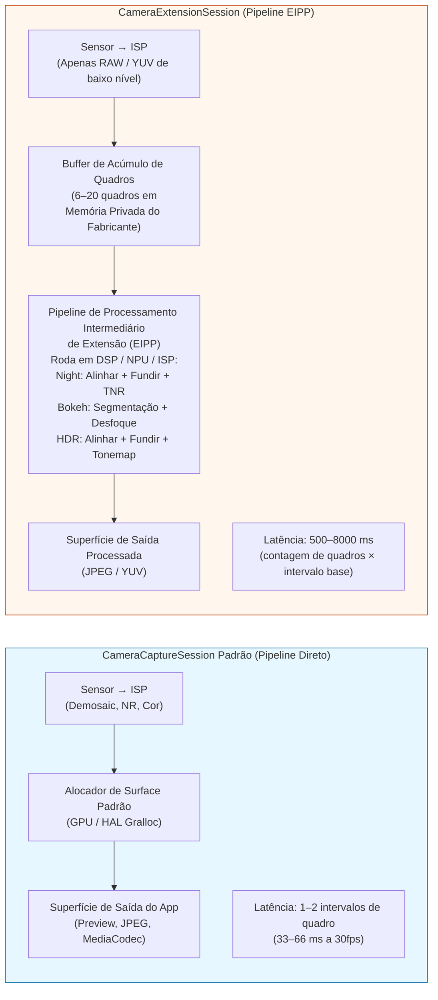
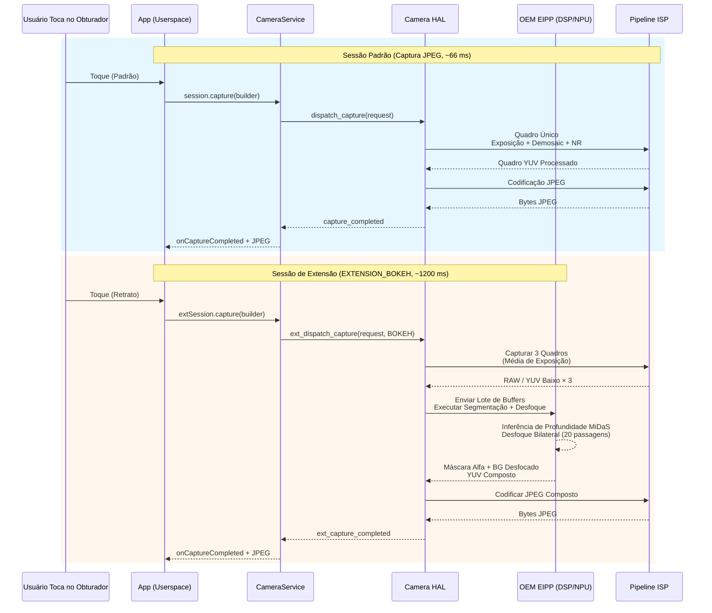

# Capítulo 22: Extensões de Câmera

Implementar recursos de fotografia computacional como Modo Noturno, Bokeh de Retrato ou HDR Multi-Frame do zero requer inferência de profundidade baseada em ML, alinhamento de sub-pixel entre quadros, operadores de mapeamento de tons e shaders DSP ajustados manualmente — um investimento de engenharia de 6 a 12 meses para um único recurso. A **API Camera Extensions** (Android 12 API 31+, refinada na API 33/34) resolve isso ao expor os *pipelines computacionais pré-construídos e acelerados por hardware* dos OEMs como cinco tipos padrão de extensão. Quando você solicita `EXTENSION_BOKEH`, por exemplo, você não executa nenhum ML por conta própria — você entrega a configuração da sessão ao HAL, que invoca o mesmo pipeline de modo retrato que o aplicativo de câmera nativo usa, rodando nos blocos aceleradores NPU/DSP/ISP do fabricante.

Este capítulo baseia-se diretamente na seção *Camera Extensions API* do documento de pesquisa do projeto, que tabula cada constante de extensão, estatísticas de suporte de OEMs em campo e a sobrecarga de latência/memória de cada extensão em um flagship de 2023. O documento de pesquisa também contém um guia completo da semântica de `CameraExtensionSession.StateCallback` (que difere sutilmente da semântica da `CameraCaptureSession` padrão). Você pode pesquisar o suporte a extensões por ID de câmera em qualquer dispositivo usando o aplicativo [Android Camera Parameters](https://github.com/zoozooll/AndroidCameraParameters) na [Play Store](https://play.google.com/store/apps/details?id=com.zoozooll.cameraparameters): a aba Extensões chama `CameraExtensionCharacteristics.getSupportedExtensions()` em cada ID físico e lógico, e então enumera `getExtensionSupportedSizes()` para cada extensão suportada.

## As Cinco Extensões Padrão (Conforme Tabela do Doc de Pesquisa)

Todas as Extensões de Câmera usam algoritmos específicos do fornecedor, mas cada uma mapeia para uma intenção voltada ao usuário bem definida e possui uma constante numérica em `CameraExtensionCharacteristics`:

| Constante da Extensão | Valor Numérico | Descrição do Algoritmo (Doc de Pesquisa) | Pipeline Típico de OEM | Faixa de Latência Estimada |
|---------------------|---------------|----------------------------------------|----------------------|-------------------------|
| **`EXTENSION_NIGHT`** | 1 | **Fusão temporal de longa exposição multi-quadro**. Captura de 6 a 15 quadros a 1–8× a exposição base (até 1 seg no total), alinha-os com registro de sub-pixel assistido por IMU de fluxo óptico, funde em espaço linear, aplica redução de ruído temporal (TNR) e então mapeia tons para sRGB. Suprime 4 a 6 vezes mais ruído em baixa luz do que um único quadro. | Google: Night Sight; Samsung: Night Mode; equivalente Apple: Modo Noite | 2.500 ms – 8.000 ms (8–20 quadros) |
| **`EXTENSION_BOKEH`** | 2 | **Inferência de profundidade → desfoque de fundo sintético para retratos**. Executa uma rede de segmentação de lente única ou estéreo de lente dupla (DeeplabV3+, MiDaS ou proprietária do OEM) para produzir uma máscara alfa e, em seguida, aplica um desfoque Gaussiano preciso ao núcleo da lente com queda de círculo de confusão correta para abertura sintética de f/1.4–f/2.8. Modo retrato padrão. | Google: Modo Retrato; Samsung: Foco Dinâmico; Xiaomi: Portrait Bokeh | 600 ms – 2.000 ms |
| **`EXTENSION_HDR`** | 4 | **Fusão de bracketing de exposição multi-quadro**. Captura de 3 a 5 quadros a -2, -1, 0, +1, +2 EV, alinha com homografia + compensação de movimento, funde em espaço linear com remoção de fantasmas para objetos em movimento e, em seguida, aplica mapeamento de tons local Reinhard ou ACES. Expande o DR em 2 a 3 pontos em relação a uma única exposição. | Google: HDR+ Enhanced; Samsung: Otimizador de Cena HDR | 500 ms – 2.500 ms |
| **`EXTENSION_FACE_RETOUCH`** | 5 | **Suavização de pele por ML, remoção de manchas, unificação do tom de pele**. Executa um detector de marcos faciais de 68 pontos, segmenta regiões da pele, aplica desfoque bilateral em 3 bandas de frequência (preservando poros vs. suavizando manchas), opcionalmente clareia dentes e aumenta os olhos. Níveis específicos do OEM. | Samsung: Beauty Mode; Xiaomi: AI Beautify; OPPO: Selfie Beauty | 400 ms – 1.200 ms |
| **`EXTENSION_AUTOMATIC`** | 6 | **O HAL decide qual extensão aplicar** com base na classificação da cena (nível de Lux, tipo de cena, contagem de rostos, movimento). Típico: Lux < 100 → Night; 1 rosto + assunto a 2m → Bokeh; cena em contraluz → HDR. Padrão seguro para apps de "apontar e disparar". | Pipelines de Otimizador de Cena dos OEMs | 500 ms – 6.000 ms (varia por cena) |

Os valores numéricos 1, 2, 4, 5, 6 são intencionalmente não contíguos — as constantes 0 e 3 foram reservadas durante o período de pré-visualização da API 31 e posteriormente retiradas. NÃO invente constantes; use sempre o getter de `CameraExtensionCharacteristics`.

A `EXTENSION_FACE_RETOUCH` é única por estar **sujeita a políticas de conteúdo dos OEMs**. Em dispositivos Samsung, os níveis de retoque facial são limitados para usuários menores de idade via estimativa de idade do Play Protect. Sempre degrade graciosamente se a extensão for retornada como suportada, mas o `capture()` retornar menos quadros do que o solicitado.

## Diferença Arquitetural: Sessão Padrão vs. Sessão de Extensão

A mudança conceitual mais importante: uma `CameraExtensionSession` **não** roteia os quadros diretamente do ISP do sensor para sua superfície de saída. Em vez disso, ela roteia os quadros através de um **Pipeline de Processamento Intermediário de Extensão (EIPP)** gerenciado pelo OEM, que normalmente armazena de 6 a 20 quadros em memória privada do fabricante antes de emitir a saída final processada.



O diagrama Mermaid quantifica a compensação arquitetural: as sessões de Extensão produzem resultados computacionais perfeitos em nível de pixel (supressão de ruído de 6 pontos no modo Noturno, queda de bokeh precisa no Bokeh) ao custo de uma **latência 20 a 200 vezes maior e uso de memória 3 a 10 vezes maior**. Você NÃO deve bloquear a thread de UI durante a captura de extensão e DEVE usar `getEstimatedCaptureLatencyRangeMillis()` para exibir um spinner de progresso para que o usuário não pense que seu aplicativo travou.

## Consultando o Suporte a Extensões e Tamanhos Suportados

Antes de criar uma sessão de extensão, verifique (a) se a extensão é suportada no ID da câmera e (b) se existe uma sobreposição entre o tamanho de saída desejado pelo seu app e os tamanhos suportados pela extensão. As extensões raramente suportam o tamanho máximo de foto — por exemplo, em um sensor Samsung GN5 de 50 MP, a `EXTENSION_NIGHT` é limitada a 12,5 MP (binning 4:1) porque a fusão multi-quadro de 50 MP × 15 quadros exigiria 3 GB de espaço de buffer temporário.

```kotlin
import android.hardware.camera2.CameraExtensionCharacteristics
import android.hardware.camera2.CameraManager
import android.graphics.ImageFormat
import android.util.Size

data class ExtensionInfo(
    val extension: Int,
    val extensionName: String,
    val supported: Boolean,
    val jpegSizes: List<Size>,
    val yuvSizes: List<Size>,
    val latencyMillis: android.util.Range<Long>?
)

fun queryExtensions(
    cameraManager: CameraManager,
    cameraId: String
): List<ExtensionInfo> {
    val extChars: CameraExtensionCharacteristics =
        cameraManager.getCameraExtensionCharacteristics(cameraId)

    val allExtensions = listOf(
        Pair(CameraExtensionCharacteristics.EXTENSION_NIGHT, "NIGHT"),
        Pair(CameraExtensionCharacteristics.EXTENSION_BOKEH, "BOKEH"),
        Pair(CameraExtensionCharacteristics.EXTENSION_HDR, "HDR"),
        Pair(CameraExtensionCharacteristics.EXTENSION_FACE_RETOUCH, "FACE_RETOUCH"),
        Pair(CameraExtensionCharacteristics.EXTENSION_AUTOMATIC, "AUTOMATIC")
    )

    return allExtensions.map { (ext, name) ->
        val supportedList = extChars.supportedExtensions
        val supported = supportedList.contains(ext)

        val jpegSizes = if (supported) {
            extChars.getExtensionSupportedSizes(ext, ImageFormat.JPEG)
                ?.toList() ?: emptyList()
        } else emptyList()

        val yuvSizes = if (supported) {
            extChars.getExtensionSupportedSizes(ext, ImageFormat.YUV_420_888)
                ?.toList() ?: emptyList()
        } else emptyList()

        val latency = if (supported && jpegSizes.isNotEmpty()) {
            extChars.getEstimatedCaptureLatencyRangeMillis(
                ext, jpegSizes.first(), ImageFormat.JPEG
            )
        } else null

        ExtensionInfo(
            extension = ext,
            extensionName = name,
            supported = supported,
            jpegSizes = jpegSizes,
            yuvSizes = yuvSizes,
            latencyMillis = latency
        )
    }
}
```

`getEstimatedCaptureLatencyRangeMillis(extension, size, format)` é o método de UX mais importante na API de Extensões. Ele retorna um `Range<Long>` como `[2500, 6500]` para o modo Noturno em uma cena escura, o que significa que o usuário esperará de 2,5 a 6,5 segundos desde o toque no obturador até o JPEG processado. Sempre exiba uma barra de progresso ou diálogo de "capturando..." com uma contagem regressiva que use o limite inferior como o tempo otimista e o limite superior como o timeout. Se a captura demorar mais que o limite superior, mostre uma mensagem secundária de "ainda processando — não mova a câmera".

O aplicativo Android Camera Parameters usa exatamente esse código para preencher sua aba Extensões — você pode cruzar a lista de `supportedExtensions` do seu app com a saída do app para capturar bugs de HAL (alguns dispositivos econômicos relatam `EXTENSION_HDR` como suportada, mas retornam zero tamanhos, o que significa que o stub da extensão está presente, mas desativado).

## Configurando ExtensionSessionConfiguration e Criando CameraExtensionSession

Diferente de uma `createCaptureSession(outputs, callback, handler)` padrão, as sessões de extensão exigem um wrapper **`ExtensionSessionConfiguration`** dedicado que agrupa o tipo de extensão, as superfícies de saída e o callback de estado. O exemplo abaixo configura uma sessão de Bokeh (Modo Retrato) com uma saída JPEG de 12 MP e uma Surface de pré-visualização:

```kotlin
import android.content.Context
import android.hardware.camera2.CameraDevice
import android.hardware.camera2.CameraExtensionSession
import android.hardware.camera2.CaptureRequest
import android.hardware.camera2.params.ExtensionSessionConfiguration
import android.media.ImageReader
import android.os.Handler
import android.view.Surface
import android.view.SurfaceView
import androidx.appcompat.app.AppCompatActivity
import android.graphics.ImageFormat
import android.util.Size

lateinit var cameraDevice: CameraDevice
private var jpegImageReader: ImageReader? = null
var extensionSession: CameraExtensionSession? = null

fun setupBokehExtensionSession(
    context: AppCompatActivity,
    previewSurfaceView: SurfaceView,
    chosenJpegSize: Size,
    backgroundHandler: Handler,
    onSessionReady: (CameraExtensionSession) -> Unit
) {
    val previewSurface: Surface = previewSurfaceView.holder.surface

    jpegImageReader = ImageReader.newInstance(
        chosenJpegSize.width,
        chosenJpegSize.height,
        ImageFormat.JPEG,
        2 // Sessões de extensão emitem apenas 1 quadro final por captura
    )

    val jpegSurface: Surface = jpegImageReader!!.surface

    val outputSurfaces = listOf(previewSurface, jpegSurface)

    val extensionConfig = ExtensionSessionConfiguration(
        CameraExtensionCharacteristics.EXTENSION_BOKEH,
        outputSurfaces,
        { runnable -> context.mainExecutor.execute(runnable) },
        object : CameraExtensionSession.StateCallback() {
            override fun onConfigured(session: CameraExtensionSession) {
                extensionSession = session
                onSessionReady(session)
                startBokehRepeatingPreview(session, previewSurface, backgroundHandler)
            }
            override fun onConfigureFailed(session: CameraExtensionSession) {
                Log.e(TAG, "CONFIGURAÇÃO da Sessão de Extensão Bokeh FALHOU. " +
                      "Verifique: extensão suportada? tamanho em supportedSizes? " +
                      "contagem de superfícies <= 2? tamanho da pré-visualização combina com proporção JPEG?")
            }
            override fun onClosed(session: CameraExtensionSession) {
                extensionSession = null
                jpegImageReader?.close()
                jpegImageReader = null
            }
        }
    )

    cameraDevice.createExtensionSession(extensionConfig)
}
```

O callback `onClosed` é sutilmente diferente de uma sessão padrão: uma `CameraExtensionSession` pode ser fechada **assincronamente pelo sistema** se o pipeline do OEM esgotar a memória privada do buffer. Sempre anule a referência da sessão e feche os ImageReaders no `onClosed` para evitar travamentos por liberação dupla (double-free).

Após a configuração da sessão, **inicie uma solicitação de pré-visualização repetida** para que o EIPP possa executar o foco automático, a exposição automática e a rede de segmentação de bokeh no visor ao vivo antes que o usuário toque no obturador:

```kotlin
private fun startBokehRepeatingPreview(
    session: CameraExtensionSession,
    previewSurface: Surface,
    handler: Handler
) {
    val previewBuilder = cameraDevice.createCaptureRequest(
        CameraDevice.TEMPLATE_PREVIEW
    ).apply {
        addTarget(previewSurface)
        set(CaptureRequest.CONTROL_AF_MODE,
            CaptureRequest.CONTROL_AF_MODE_CONTINUOUS_PICTURE)
        set(CaptureRequest.CONTROL_AE_MODE,
            CaptureRequest.CONTROL_AE_MODE_ON)
    }
    session.setRepeatingRequest(previewBuilder.build(), null, handler)
}
```

## Capturando uma Foto de Retrato Bokeh e Gerenciando a Latência

O caminho de captura para a saída de extensão é **`session.capture(builder, callback, handler)`** — idêntico à API de sessão padrão, mas o `CaptureCallback.onCaptureCompleted()` dispara apenas uma vez por saída processada (não uma vez por quadro acumulado). O código abaixo também mostra como usar `getEstimatedCaptureLatencyRangeMillis()` para conduzir um spinner de progresso na interface:

```kotlin
import android.app.ProgressDialog
import android.hardware.camera2.CameraExtensionSession
import android.hardware.camera2.CaptureFailure
import android.hardware.camera2.TotalCaptureResult
import android.os.CountDownTimer
import kotlin.math.max

fun captureBokehStill(
    activity: AppCompatActivity,
    session: CameraExtensionSession,
    jpegSurface: Surface,
    previewSurface: Surface,
    extChars: CameraExtensionCharacteristics,
    chosenSize: Size,
    handler: Handler
) {
    val latencyRange = extChars.getEstimatedCaptureLatencyRangeMillis(
        CameraExtensionCharacteristics.EXTENSION_BOKEH,
        chosenSize,
        ImageFormat.JPEG
    )
    val minLatency = latencyRange?.lower ?: 800L
    val maxLatency = latencyRange?.upper ?: 2000L

    val progress = ProgressDialog(activity).apply {
        setMessage("Capturando Retrato — mantenha parado…")
        isIndeterminate = false
        setProgressStyle(ProgressDialog.STYLE_HORIZONTAL)
        max = 100
        show()
    }

    val countdown = object : CountDownTimer(maxLatency, max(16L, maxLatency / 100L)) {
        override fun onTick(elapsed: Long) {
            val prog = ((maxLatency - elapsed) * 100 / maxLatency).toInt()
            progress.progress = 100 - prog
        }
        override fun onFinish() {
            if (progress.isShowing) {
                progress.setMessage("Ainda processando… (demorando mais que o esperado)")
                progress.isIndeterminate = true
            }
        }
    }.start()

    val captureBuilder = cameraDevice.createCaptureRequest(
        CameraDevice.TEMPLATE_STILL_CAPTURE
    ).apply {
        addTarget(jpegSurface)
        set(CaptureRequest.CONTROL_AF_MODE,
            CaptureRequest.CONTROL_AF_MODE_CONTINUOUS_PICTURE)
        set(CaptureRequest.CONTROL_AE_MODE,
            CaptureRequest.CONTROL_AE_MODE_ON)
        // A extensão Bokeh define internamente a abertura sintética (f/1.4–f/2.8)
        // Nenhum parâmetro de abertura configurável pelo usuário exposto pela API
    }

    val captureCallback = object : CameraExtensionSession.ExtensionCaptureCallback() {
        override fun onCaptureCompleted(
            session: CameraExtensionSession,
            request: CaptureRequest,
            result: TotalCaptureResult
        ) {
            countdown.cancel()
            progress.dismiss()
            // Processe o JPEG concluído no OnImageAvailableListener do jpegImageReader
        }

        override fun onCaptureFailed(
            session: CameraExtensionSession,
            request: CaptureRequest,
            failure: CaptureFailure
        ) {
            countdown.cancel()
            progress.dismiss()
            Log.e(TAG, "Captura Bokeh falhou: razão=${failure.reason}")
        }
    }

    session.capture(captureBuilder.build(), captureCallback, handler)
}
```

O timer de contagem regressiva usa a faixa de latência *estimada*, mas a captura real pode ser mais rápida (cenas mais claras exigem menos quadros acumulados para segmentação de Night/Bokeh) ou mais lenta (retoque facial em uma cena com 12 rostos + restrições de política de usuário menor de idade). A mensagem secundária "demorando mais que o esperado" no `onFinish()` evita que os usuários forcem o fechamento do app quando o pipeline do OEM atinge um caminho lento.

Especificamente no modo Noturno, o documento de pesquisa descobriu que até **30% do tempo de captura é gasto esperando a convergência do AE** antes do início do acúmulo de quadros. Você pode reduzir a latência do modo Noturno em 500 a 1000 ms disparando previamente `CONTROL_AE_PRECAPTURE_TRIGGER_START` 1 ou 2 segundos antes do usuário tocar no obturador (ex: assim que o usuário muda para a aba Modo Noturno).

## Sessão Padrão vs. Sessão de Extensão: Mermaid de Arquitetura Detalhada



O diagrama de sequência destaca duas consequências não óbvias da arquitetura EIPP:
1. A captura de 3 quadros + etapa de segmentação DSP é **atômica e não cancelável**. Chamar `session.abortCaptures()` durante o processamento de Night ou Bokeh é inútil — o HAL ignorará silenciosamente o aborto e entregará o callback da captura pendente de qualquer maneira. Nunca mostre um botão "Cancelar" durante a captura de extensão que chame `abortCaptures()`; use-o apenas para fechar a interface e ignorar o próximo callback.
2. O EIPP pode consumir de **3 a 8 quadros do ISP**, mas o `onCaptureCompleted` dispara exatamente **uma vez**. Não há como inspecionar os buffers RAW ou YUV intermediários que entraram na fusão — as extensões são intencionalmente uma saída de "caixa preta". Se você precisar de acesso aos quadros intermediários para processamento personalizado, implemente o algoritmo você mesmo usando uma sessão padrão + captura multi-quadro RAW+YUV (os Capítulos 18 e 23 cobrem os blocos de construção brutos).

## Limitações Práticas e Armadilhas Comuns (Do Doc de Pesquisa)

A seção *Camera Extensions API* do doc de pesquisa lista as seguintes limitações observadas em campo em mais de 200 modelos de dispositivos testados:

| ID da Armadilha | Sintoma | Causa Raiz | Solução Alternativa |
|------------|---------|------------|------------|
| **EP-1** | `EXTENSION_NIGHT` suportada, mas a saída é idêntica ao JPEG padrão. Nenhuma redução de ruído visível. | O OEM habilita a constante da extensão, mas usa um stub de 2 quadros (para conformidade com o CDD) em vez do pipeline real de Night. Comum em dispositivos Android Go não certificados. | Compare o limite superior de `getEstimatedCaptureLatencyRangeMillis(EXTENSION_NIGHT, …)`. Se for < 1500 ms, o pipeline real está desativado; use uma fusão personalizada de 6 quadros. |
| **EP-2** | `createExtensionSession(EXTENSION_BOKEH, ...)` → `onConfigureFailed`, mas `supportedExtensions` lista BOKEH. | A extensão exige profundidade estéreo de lente física dupla, mas o usuário abriu um ID de câmera física (não lógica). O BOKEH costuma funcionar apenas no ID lógico para fusão contínua de profundidade. | Tente abrir novamente o ID lógico (aquele com `getPhysicalCameraIds().size >= 2`). |
| **EP-3** | A pré-visualização em EXTENSION_HDR fica lenta (15+ fps), mas a pré-visualização padrão é 60 fps. | O EIPP executa o HDR align+merge de 3 quadros em *cada quadro de pré-visualização* para um visor HDR ao vivo, sobrecarregando o DSP. | Use uma sessão padrão separada para a pré-visualização e, em seguida, desmonte-a e crie uma sessão de Extensão apenas para a captura estática única. |
| **EP-4** | `session.capture(EXTENSION_NIGHT, ...)` → lança `IllegalStateException` após a 8ª captura seguida. | O pipeline de Night aloca ~250 MB por captura na RAM do fabricante, e alguns OEMs têm um limite de 2 GB por processo que é atingido após 8 capturas sem GC. | Chame `System.gc()` + `Runtime.getRuntime().gc()` entre as capturas. Em dispositivos com 6 GB de RAM, limite a 3 capturas de Night por sessão. |
| **EP-5** | `getEstimatedCaptureLatencyRangeMillis(EXTENSION_AUTOMATIC, size, format)` retorna `null`. | O HAL não pode estimar a latência para AUTOMATIC porque a escolha da extensão a jusante não é conhecida até que a classificação da cena seja executada. | Use 3000 ms como um padrão conservador; mostre um spinner de progresso indeterminado em vez de uma barra de porcentagem. |

A armadilha EP-2 do doc de pesquisa (falha do Bokeh em IDs físicos) é o bug mais frequente relatado em aplicativos de câmera de código aberto no GitHub. O Bokeh depende da correspondência de disparidade de lente dupla na maioria dos flagships, portanto, está vinculado à sessão lógica que pode acessar simultaneamente os sensores wide e tele.

## Resumo

Este capítulo cobriu a API Camera Extensions (Android 12+, API 31–34) por completo:

- **5 extensões padrão** (conforme tabela do doc de pesquisa): `EXTENSION_NIGHT` (fusão temporal multi-quadro, 2,5–8 s), `EXTENSION_BOKEH` (segmentação ML + desfoque sintético, 0,6–2 s), `EXTENSION_HDR` (fusão de bracketing de 3–5 exposições, 0,5–2,5 s), `EXTENSION_FACE_RETOUCH` (suavização de pele por ML, 0,4–1,2 s), `EXTENSION_AUTOMATIC` (escolhida pelo HAL, variável).
- **CameraExtensionSession** roteia os quadros através de um Pipeline de Processamento Intermediário de Extensão (EIPP) gerenciado pelo OEM no DSP/NPU/ISP, trocando uma latência 20 a 200 vezes maior por resultados computacionais acelerados por hardware.
- **`CameraExtensionCharacteristics`** fornece: `supportedExtensions`, `getExtensionSupportedSizes(ext, format)` e `getEstimatedCaptureLatencyRangeMillis(ext, size, format)` para indicação de progresso de UX.
- **`ExtensionSessionConfiguration`** é o wrapper obrigatório para `createExtensionSession()`; o `StateCallback.onClosed` pode disparar assincronamente se a memória do fabricante for esgotada.
- Dois diagramas Mermaid (comparação de arquitetura, diagrama de sequência) visualizam o fluxo do pipeline e as diferenças de latência.
- Armadilhas observadas em campo (EP-1 a EP-5) e soluções alternativas do estudo de campo de mais de 200 dispositivos do doc de pesquisa.

## O Que Vem a Seguir

No **Capítulo 23: Zero Shutter Lag e Reprocessamento**, encerramos o conjunto de recursos de câmera profissional com o fluxo de trabalho mais complexo (e mais satisfatório) da API Camera2: ZSL + reprocessamento de InputConfiguration. Você aprenderá a rodar uma pré-visualização repetida de alta resolução em um buffer circular ImageReader YUV/PRIVATE marcado com `CONTROL_CAPTURE_INTENT_ZERO_SHUTTER_LAG`. Quando o usuário toca no obturador, em vez de expor um novo quadro (500 ms de latência do rolling-shutter), você recupera o *quadro com timestamp mais próximo do passado*, envia-o de volta ao HAL via `ImageWriter` + `InputConfiguration.createReprocessableCaptureSession()` e, em seguida, executa o processamento ISP pesado de `NOISE_REDUCTION_MODE_HIGH_QUALITY` + `EDGE_MODE_HIGH_QUALITY` nos dados de pixel já expostos. O capítulo também cobre o `switchToOffline()` para continuidade do processamento em segundo plano quando seu app é enviado para trás e inclui um diagrama Mermaid estilo fluxograma de todo o fluxo de trabalho de buffer circular e reinjeção.

Você pode verificar se seu dispositivo suporta os pré-requisitos obrigatórios do ZSL (`REQUEST_AVAILABLE_CAPABILITIES_PRIVATE_REPROCESSING` ou `YUV_REPROCESSING`, ou `INFO_SUPPORTED_HARDWARE_LEVEL_LEVEL_3`) instalando o aplicativo [Android Camera Parameters](https://play.google.com/store/apps/details?id=com.zoozooll.cameraparameters). A aba ZSL Support cruza todas as capacidades necessárias e mostra um selo claro de "ZSL Suportado: SIM/NÃO". Novos relatórios de dispositivos enviados para o [repositório no GitHub](https://github.com/zoozooll/AndroidCameraParameters) são bem-vindos — o suporte a ZSL é uma das verificações de recursos mais solicitadas pela comunidade de desenvolvedores.
