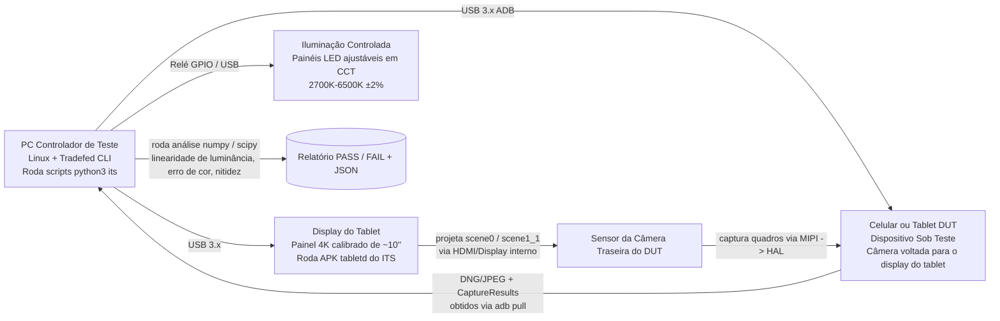

# Capítulo 27: Testes de Câmera

## Resumo

Você construiu um aplicativo de câmera. Ele funciona no seu Pixel. Ele funciona no seu Galaxy. Ele funciona no dispositivo Android Go de US$ 99 com um HAL `LEGACY` cujo fabricante implementou incorretamente o `CONTROL_AF_TRIGGER_START` e retorna cada `SENSOR_EXPOSURE_TIME` em *microssegundos* em vez de nanossegundos?

Testar software de câmera é um problema de duas partes: **validação do OEM no nível do HAL** (os testes que o Google *obriga* cada fabricante a passar antes que um dispositivo possa ser enviado com a Google Play) e **testes no nível do aplicativo no CI** (os testes que você executa contra seu próprio código sem exigir hardware de câmera físico). Este capítulo cobre ambos. Primeiro, você aprenderá o que o Camera ITS (Image Test Suite, parte do CTS) realmente valida em bancadas de teste físicas: enumeração de combinação de fluxos, linearidade de luminância de cena física e fusão de timestamp de sensor/giroscópio. Depois, você aprenderá a escrever seus próprios testes de instrumentação usando mocks do Mockito para `CameraManager`/`CameraDevice`/`CaptureSession`, para que toda a sua pilha de câmera rode em servidores de CI Linux x86 sem interface gráfica e sem nenhum hardware de câmera, além de um padrão de teste parametrizado que afirma que seu código degrada graciosamente em hardware `LEGACY` em vez de travar.

Use o **Android Camera Parameters** ([Google Play](https://play.google.com/store/apps/details?id=com.minininja.cameraparams), [GitHub](https://github.com/zoozooll/AndroidCameraParameters)) como a ferramenta de referência para inspecionar as capacidades exatas que seus testes devem validar — ele expõe cada chave de `CameraCharacteristics` que o ITS também valida em bancadas reais.

---

## Parte Um: Como os OEMs Validam as Câmeras — Camera ITS e CTS

Antes que um dispositivo possa ser enviado com o Google Mobile Services (GMS), ele deve passar no Android Compatibility Test Suite (CTS). O Camera CTS tem duas metades: testes CTS programáticos que rodam via `Tradefed` e o Camera ITS (Image Test Suite), que requer um laboratório de teste físico com bancadas automatizadas.

### Categorias de Teste

```mermaid
graph TB
    subgraph CTS[Android CTS — Seção de Câmera]
        direction TB
        CTS_API[Testes de API<br/>— Chaves CameraCharacteristics<br/>— isSessionConfigurationSupported<br/>— Todos os casos de uso enumeram corretamente]
        CTS_FLOW[Testes de Fluxo<br/>— abrir -> fechar<br/>— abrir -> sessão -> captura -> fechar<br/>— Estresse de abertura/fechamento rápido]
        CTS_V[CTS Verifier<br/>Testes manuais no dispositivo<br/>— Suavidade da pré-visualização<br/>— Qualidade de captura<br/>— Troca de multicâmera]
    end
    subgraph ITS[Camera ITS — Image Test Suite]
        direction TB
        ITS_COMBI[test_feature_combination<br/>Permutações de fluxo x FPS x HDR<br/>Milhares de chamadas para<br/>isSessionConfigurationSupported]
        ITS_SCENE[Testes de Cena Física<br/>scene0 (cinza uniforme)<br/>scene1_1 (verificador de cor)<br/>Display de tablet automatizado → DUT]
        ITS_FUSION[Teste sensor_fusion<br/>Timestamps do giroscópio devem alinhar com<br/>SENSOR_TIMESTAMP no CaptureResult<br/>Tolerância de ±1ms]
        ITS_3A[Testes de Convergência 3A<br/>AE/AF/AWB devem convergir em<br/>N quadros sob iluminação padrão]
        ITS_HDR[Testes de HDR / Ultra HDR<br/>Validade do gainmap JPEG_R<br/>Medição de alcance dinâmico]
    end
    CTS --> SHIP[(Enviado se TODOS passarem)]
    ITS --> SHIP

    style ITS_COMBI fill:#d9e6f2
    style ITS_SCENE fill:#d9f2e6
    style ITS_FUSION fill:#f2d9e6
    style CTS_API fill:#fff3cd
    style CTS_V fill:#fff3cd
```

Tudo no diagrama é obrigatório. Se mesmo *um* desses testes falhar em um único ID de câmera, o dispositivo não é enviado. É por isso que entender o ITS ajuda seu aplicativo: ele garante uma linha de base abaixo da qual nenhum HAL pode cair e documenta exatamente quais comportamentos você pode confiar.

### Arquitetura da Bancada de Teste Camera ITS

Um laboratório real de Camera ITS se parece com isto:



O detalhe fundamental é o *circuito fechado*. O controlador de teste sabe *exatamente* quais valores de pixel ele comandou que o display do tablet mostrasse (ex: um cinza uniforme com 50% de intensidade com uma temperatura de cor de 6500K precisamente conhecida) e então verifica numericamente se a saída da câmera do DUT — tanto a luminância do pixel no JPEG/DNG *quanto* o `SENSOR_EXPOSURE_TIME` × `SENSOR_SENSITIVITY` relatados no `CaptureResult` — corresponde à entrada física dentro das tolerâncias permitidas.

#### `test_feature_combination`: O Desafio da Enumeração

O maior teste ITS individual por tempo de execução é o `test_feature_combination`. Ele enumera todos os tamanhos de fluxo legais de `SCALER_STREAM_CONFIGURATION_MAP`, cada formato (`PRIV`, `YUV`, `JPEG`, `RAW_SENSOR`, `JPEG_R`, `DEPTH`), cada faixa de FPS de `CONTROL_AE_AVAILABLE_TARGET_FPS_RANGES`, cada combinação de *contagem* de superfície de saída (configurações de sessão de 1, 2 e 3 saídas) e cada flag de modo HDR — então chama `isSessionConfigurationSupported` na SessionConfiguration resultante, captura um quadro por configuração suportada e afirma que o quadro não está corrompido. O número total de combinações é frequentemente de 30.000 a 100.000 por ID de câmera.

Para você, como desenvolvedor de aplicativos, a conclusão é simples: **se `isSessionConfigurationSupported` retornar `true` em um dispositivo que passou no CTS, essa combinação de fluxos realmente funciona, em ambas as direções.** Se retornar `false`, não tente. Confie nessa chamada antes de recorrer a tamanhos menores. Esta é a mesma consulta que o CameraX usa internamente em seu seletor de resolução.

#### Testes de Cena Física: Linearidade da Exposição

Os testes scene0 e scene1_1 validam se a matemática de exposição *relatada* pela câmera corresponde à sua saída de pixel *medida*. A bancada de teste projeta um campo cinza uniforme (scene0) de luminância `L` conhecida no DUT. Ela então comanda uma varredura de N pares `(SENSOR_EXPOSURE_TIME, SENSOR_SENSITIVITY)` diferentes de toda a faixa disponível, captura um quadro DNG por par e computa o valor médio aritmético do pixel `Y` em todo o active-array do sensor.

A afirmação é estritamente linear:

```
Y_i / (EXPOSURE_TIME_i × SENSITIVITY_i) = constante ± tolerância
```

em *todos* os pares capturados. Se o produto dobrar, a luminância do pixel deve dobrar. Se cair pela metade, a luminância deve cair pela metade. Qualquer desvio acima de ~1% nos tons médios reprova o teste.

Por que isso importa para você: é a garantia de que seu controle deslizante de exposição manual (Capítulo 14) produz resultados matematicamente previsíveis em um dispositivo compatível com o CTS. Se seu aplicativo calcula o "próximo par ISO/exposição" para um passo de +1 EV, a imagem de saída será realmente um stop mais brilhante. Em dispositivos não compatíveis com o CTS (telefones de mercado paralelo importados, ROMs personalizadas sem CTS), essa garantia não se sustenta e sua interface de exposição manual parecerá quebrada.

#### `sensor_fusion`: O Teste de Fusão de Timestamps

O EIS (Estabilização Eletrônica de Imagem) e o rastreamento de AR dependem inteiramente deste teste. Enquanto o DUT está gravando um vídeo, o controlador de teste rotaciona fisicamente o telefone em um gimbal motorizado com velocidade angular conhecida. Simultaneamente, ele consulta o sensor de giroscópio do DUT via `SensorManager` a 400Hz+ e o `CaptureResult.SENSOR_TIMESTAMP` da câmera a 30/60fps.

A condição de aprovação: cada timestamp do giroscópio e cada `SENSOR_TIMESTAMP` de quadro devem estar na mesma base de tempo `CLOCK_MONOTONIC`, com amostras do giroscópio interpoladas no tempo da amostra da câmera correspondendo à velocidade angular comandada do gimbal dentro de ±0,1 rad/s e ±1ms.

Se este teste falhar, a fonte de timestamp do HAL está errada — normalmente ele misturou `CLOCK_REALTIME` (horário de parede, que salta durante a sincronização NTP) com `CLOCK_MONOTONIC` (estável, monotônico). O Google rejeita o dispositivo. Para você, isso significa que você pode alimentar o `CaptureResult.SENSOR_TIMESTAMP` diretamente na chamada de atualização de imagem da câmera do ARCore sem aplicar nenhum offset de timestamp personalizado, em qualquer dispositivo certificado pelo GMS.

### CTS Verifier: Testes Manuais de Usuário

Nem tudo pode ser automatizado. O CTS Verifier é um APK no dispositivo que um testador humano de QA usa para testes subjetivos:

- **Suavidade da pré-visualização:** 30 segundos movendo o dispositivo; o testador pontua a suavidade percebida de 1 a 5. (Telemetria objetiva também é capturada via dumpsys do Choreographer.)
- **Qualidade de captura:** 5 fotos de cenas padrão sob iluminação padrão; o testador compara com um dispositivo de referência padrão.
- **Transição de zoom de multicâmera:** Ao dar zoom continuamente de 0,5× a 10×, não deve haver saltos visíveis, falhas ou quadros pretos entre as trocas de câmeras físicas.
- **Qualidade HDR/JPEG_R:** Capturas SDR e HDR lado a lado são comparadas com imagens de referência conhecidas.

Estes são subjetivos, mas o nível de exigência é público. Se o seu aplicativo visa metas de UX semelhantes (transições de zoom suaves, capturas HDR), você pode replicar os mesmos procedimentos de teste em seu laboratório interno de QA com a mesma bancada de tablet scene0/scene1_1.

---

## Parte Dois: Testando seu Próprio Aplicativo — Instrumentação e Mocking

Os testes do OEM validam o HAL. Você precisa validar o *seu* código. O erro canônico que as equipes cometem é exigir um telefone real com uma câmera funcional em seu servidor de CI. Não faça isso. Com o `mock()` + `ArgumentCaptor` do Mockito, cada classe do Camera2 — `CameraManager`, `CameraDevice`, `CameraCaptureSession`, `CaptureResult` — é uma interface ou uma classe não final que aceita mocks de forma limpa. Você pode rodar todo o seu pipeline de câmera no CI em um emulador Linux x86 sem interface gráfica e sem nenhum hardware de câmera.

### Exemplo 1: Capturar um "Quadro" e Verificar se o CaptureResult Contém o EXPOSURE_TIME Esperado (AndroidTest com Mockito)

```kotlin
// app/src/androidTest/java/com/example/camera/CameraCaptureTest.kt
@RunWith(AndroidJUnit4::class)
@SmallTest
class CameraCaptureTest {

    @Test
    fun captureRequest_containsManualExposureTime_andResultEchoesIt() = runTest {
        // ---- Organizar (Arrange) ----
        val mockCameraManager = mock<CameraManager>()
        val mockCameraDevice = mock<CameraDevice>()
        val mockSession = mock<CameraCaptureSession>()
        val mockSurface = mock<Surface>()
        val testHandler = Handler(Looper.getMainLooper())

        val expectedExposureNs = 16_666_666L // 1/60 s
        val expectedIso = 400

        // Capturar o StateCallback passado para o openCamera
        val deviceCallbackCaptor =
            argumentCaptor<CameraDevice.StateCallback>()
        whenever(mockCameraManager.openCamera(
            anyString(), deviceCallbackCaptor.capture(), any()
        )).thenAnswer { /* no-op; disparamos o callback manualmente */ }

        // Capturar o callback de estado da sessão
        val sessionCallbackCaptor =
            argumentCaptor<CameraCaptureSession.StateCallback>()
        whenever(mockCameraDevice.createCaptureSession(
            anyList<Surface>(),
            sessionCallbackCaptor.capture(),
            any()
        )).thenAnswer { /* no-op */ }

        // Capturar o CaptureCallback passado para o capture()
        val captureCallbackCaptor =
            argumentCaptor<CameraCaptureSession.CaptureCallback>()
        whenever(mockSession.capture(
            any(), captureCallbackCaptor.capture(), any()
        )).thenReturn(1)

        // Construir a câmera sob teste usando seu wrapper
        val cameraWrapper = YourCameraWrapper(mockCameraManager, testHandler)

        // ---- Agir (Act): disparar a cadeia abrir → configurar → capturar ----
        cameraWrapper.open("0")
        // (Dentro de YourCameraWrapper.open() chamou
        //  mockCameraManager.openCamera, que capturou o callback.)
        // Simular o HAL retornando sucesso:
        deviceCallbackCaptor.lastValue.onOpened(mockCameraDevice)

        cameraWrapper.createSession(listOf(mockSurface))
        sessionCallbackCaptor.lastValue.onConfigured(mockSession)

        val requestBuilder: CaptureRequest.Builder =
            mockCameraDevice.createCaptureRequest(CameraDevice.TEMPLATE_STILL_CAPTURE)
        // (Seu wrapper aplica as configurações manuais aqui)
        requestBuilder.set(CaptureRequest.CONTROL_MODE,
                           CaptureRequest.CONTROL_MODE_OFF)
        requestBuilder.set(CaptureRequest.SENSOR_EXPOSURE_TIME,
                           expectedExposureNs)
        requestBuilder.set(CaptureRequest.SENSOR_SENSITIVITY,
                           expectedIso)

        val resultDeferred = async { cameraWrapper.capture(requestBuilder.build()) }

        // ---- Afirmar 1 (Assert 1): o CaptureRequest enviado ao HAL tinha as chaves certas ----
        val sentRequest: CaptureRequest = captureArg(mockSession, 0) {
            capture(any(), any(), any())
        }
        assertThat(sentRequest[CaptureRequest.SENSOR_EXPOSURE_TIME])
            .isEqualTo(expectedExposureNs)
        assertThat(sentRequest[CaptureRequest.SENSOR_SENSITIVITY])
            .isEqualTo(expectedIso)

        // ---- Agir 2 (Act 2): Simular o HAL retornando um CaptureResult ----
        val mockResult = mock<TotalCaptureResult>().apply {
            whenever(get(CaptureResult.SENSOR_EXPOSURE_TIME))
                .thenReturn(expectedExposureNs)
            whenever(get(CaptureResult.SENSOR_SENSITIVITY))
                .thenReturn(expectedIso)
            whenever(frameNumber).thenReturn(1L)
        }
        captureCallbackCaptor.lastValue
            .onCaptureCompleted(mockSession, sentRequest, mockResult)

        // ---- Afirmar 2 (Assert 2): o resultado da captura retornado pelo wrapper ecoa a exposição ----
        val actual = resultDeferred.await()
        assertThat(actual.exposureTimeNanos).isEqualTo(expectedExposureNs)
        assertThat(actual.iso).isEqualTo(expectedIso)
    }
}
```

O padrão é sempre o mesmo:
1. Use o `argumentCaptor` para capturar o callback que iria para o HAL.
2. Chame seu wrapper.
3. Dispare o método de sucesso do callback *como se o HAL tivesse respondido*.
4. Faça as afirmações tanto nas entradas (o que seu wrapper enviou para o HAL) quanto nas saídas (o que seu wrapper devolveu ao chamador).

Isso roda em um emulador sem câmera. Sem hardware. Sem instabilidade por iluminação. 10.000 execuções produzem os mesmos 10.000 sucessos.

### Exemplo 2: Teste Parametrizado — Dispositivos LEGACY Devem Degradar Graciosamente, Nunca Travar

Cada aplicativo de câmera em produção deve rodar em HALs `LEGACY`. O bug individual mais comum é chamar `CaptureRequest.CONTROL_MODE_OFF` em um dispositivo `LEGACY`: o HAL o ignora, mas seu wrapper interpreta o `CaptureResult.CONTROL_AE_STATE == SEARCHING` resultante como uma falha transitória e tenta reiniciar o AE em um loop infinito, eventualmente causando um ANR.

Parametrize seus testes por `INFO_SUPPORTED_HARDWARE_LEVEL`:

```kotlin
@RunWith(Parameterized::class)
class HardwareLevelGracefulDegradationTest(
    private val hardwareLevel: Int,
    private val hardwareLevelName: String
) {
    companion object {
        @JvmStatic
        @Parameterized.Parameters(name = "{1}")
        fun data() = listOf(
            arrayOf(CameraCharacteristics.INFO_SUPPORTED_HARDWARE_LEVEL_LEGACY,
                    "LEGACY"),
            arrayOf(CameraCharacteristics.INFO_SUPPORTED_HARDWARE_LEVEL_LIMITED,
                    "LIMITED"),
            arrayOf(CameraCharacteristics.INFO_SUPPORTED_HARDWARE_LEVEL_FULL,
                    "FULL"),
            arrayOf(CameraCharacteristics.INFO_SUPPORTED_HARDWARE_LEVEL_3,
                    "LEVEL_3"),
        )
    }

    @Test
    fun requestManualExposure_onAnyHardwareLevel_doesNotCrash_orHang() = runTest {
        val mockCameraManager = mock<CameraManager>()
        val mockChars = mock<CameraCharacteristics>()
        whenever(mockChars.get<Int>(
            CameraCharacteristics.INFO_SUPPORTED_HARDWARE_LEVEL
        )).thenReturn(hardwareLevel)
        whenever(mockCameraManager.getCameraCharacteristics("0"))
            .thenReturn(mockChars)

        val wrapper = YourCameraWrapper(mockCameraManager, testHandler)
        wrapper.open("0")
        // ... (boilerplate de configuração de sessão como antes, omitido)

        val job = launch {
            wrapper.setManualExposure(iso = 400, exposureNs = 8_000_000L)
        }

        // Sem travamento — deve ser concluído dentro do timeout mesmo no LEGACY
        withTimeoutOrNull(2_000) { job.join() }
            ?: fail("setManualExposure travou no hardware $hardwareLevelName")

        // Nenhuma exceção vazou para não capturada
        assertThat(job.isCancelled).isFalse()
    }
}
```

Execute isso contra cada novo build. Leva 400ms. Captura exatamente a classe de travamentos de HAL `LEGACY` que, de outra forma, só apareceriam nos relatórios de falha do Play Console meses depois.

### AndroidTest em Hardware Real: Captura de Sanidade para Garantir que o EXPOSURE_TIME Está Correto

Para execuções noturnas contra uma pequena fazenda de telefones reais, escreva um AndroidTest curto que abre a câmera *real*, captura um quadro RAW e afirma que o `CaptureResult.SENSOR_EXPOSURE_TIME` estava dentro de 5% do valor solicitado. Isso protege contra regressões do HAL em builds específicos do sistema operacional:

```kotlin
@RunWith(AndroidJUnit4::class)
@RequiresDevice
@LargeTest
class RealHardwareCaptureSanityTest {

    @Test
    fun realCapture_exposureTimeIsWithin5PercentOfRequested() = runTest {
        val context = InstrumentationRegistry.getInstrumentation().context
        val camManager = context.getSystemService(Context.CAMERA_SERVICE)
            as CameraManager
        val chars = camManager.getCameraCharacteristics("0")
        assumeTrue(
            "Requer FULL ou LEVEL_3 para exposição manual",
            chars[CameraCharacteristics.INFO_SUPPORTED_HARDWARE_LEVEL] in
            setOf(
                CameraCharacteristics.INFO_SUPPORTED_HARDWARE_LEVEL_FULL,
                CameraCharacteristics.INFO_SUPPORTED_HARDWARE_LEVEL_3,
            )
        )

        // ... abrir câmera, criar sessão ImageReader (PRIVATE ou YUV), capturar
        // um único quadro manual com uma exposição conhecida usando os wrappers de
        // coroutines do Capítulo 26 ...

        val requestedNs = 10_000_000L // 1/100s
        val result: TotalCaptureResult =
            cameraWrapper.captureManualExposure(requestedNs, iso = 200)

        val actualNs = result[CaptureResult.SENSOR_EXPOSURE_TIME]!!
        val tolerancePct = abs(actualNs - requestedNs) * 100.0 / requestedNs
        assertThat(tolerancePct)
            .withFailMessage(
                "Solicitado %d ns, obtido %d ns (%$.1f%% de diferença >5%%)",
                requestedNs, actualNs, tolerancePct
            )
            .isLessThan(5.0)
    }
}
```

Este teste é instável por natureza — ele depende de hardware real. Mas ele captura exatamente a classe de atualizações OTA de fabricantes que silenciosamente quebram a exposição manual em dispositivos topo de linha. Execute-o todas as noites em sua fazenda de 5 a 10 dispositivos; o sinal vale o ruído.

---

## Resumo

O teste de câmera se divide em validação do OEM e validação do aplicativo. Os OEMs devem passar no CTS e no Camera ITS, uma suíte de testes em bancada física que impõe o suporte à combinação de fluxos (via milhares de chamadas `isSessionConfigurationSupported`), linearidade de luminância em todo o plano de exposição × sensibilidade e alinhamento de timestamp de sensor/giroscópio para EIS e AR. Os aplicativos testam via instrumentação: o Mockito simula cada classe do Camera2, o `ArgumentCaptor` captura callbacks do HAL, você os dispara manualmente e faz as afirmações tanto na solicitação quanto no resultado sem tocar no hardware real — permitindo execuções de CI em emuladores sem interface gráfica. Parametrize seus testes de wrapper contra cada `INFO_SUPPORTED_HARDWARE_LEVEL` (especialmente `LEGACY`) para garantir a degradação graciosa e execute uma pequena suíte de capturas de sanidade `@RequiresDevice @LargeTest` contra uma fazenda de dispositivos reais para capturar regressões de OTA.

## O Que Vem a Seguir

Você dominou a API pública do Camera2, do Kotlin até o NDK nativo, envolveu-a em coroutines e validou-a contra testes. Mas o que realmente acontece *sob o capô* quando você chama `CameraManager.openCamera`? O que é o HAL3? Onde vive realmente o limite do IPC do Binder? E como o `CameraDeviceSetup` (Android 15, API 35) altera a arquitetura ao desacoplar as consultas de capacidade da alimentação do sensor? O Capítulo 28 é o grande final da arquitetura: a pilha completa, do código do aplicativo ao motor de bobina de voz VCM no barril da lente.
