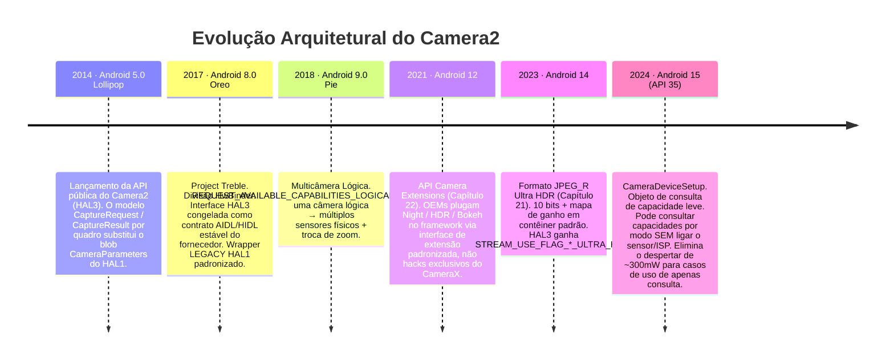

# Capítulo 28: Arquitetura do Camera2

## Resumo

Este é o capítulo que você mereceu. Nos Capítulos 1 a 27, você usou `CameraManager`, `CameraCharacteristics`, `CaptureRequest`, `CaptureResult`, `CameraCaptureSession`, `ImageReader`, CameraX, a stack nativa do NDK, wrappers de coroutines e mocks de teste. Você conhece cada superfície da API pública. Agora, retiramos cada abstração em sequência, desde a linha de código Kotlin que você escreve até os elétrons individuais cruzando o barramento MIPI CSI-2 entre o sensor e o SoC, o motor de bobina de voz movendo o grupo de lentes por 10 micrômetros e o controlador do flash LED pulsando um estrobo de xenônio ou LED em sincronia de microssegundos com o obturador eletrônico do sensor.

Ao final deste capítulo, você será capaz de olhar para qualquer `CaptureRequest` e mapear, camada por camada, para onde cada parte dela vai, quem a traduz, quem a valida e quem finalmente a executa no silício. Você também entenderá a abstração `CameraDeviceSetup` do Android 15 (API 35) como um exemplo de uma tendência arquitetural de uma década: desacoplar progressivamente as *consultas de capacidade* dos *estados de energia do hardware*, para que os aplicativos possam sondar uma câmera sem queimar os ~300mW necessários para ligar o sensor e o ISP.

Para inspecionar as capacidades exatas de qualquer dispositivo real e cruzá-las com as camadas de arquitetura descritas aqui, instale o **Android Camera Parameters** ([Google Play](https://play.google.com/store/apps/details?id=com.minininja.cameraparams), [GitHub](https://github.com/zoozooll/AndroidCameraParameters)). Ele lê cada chave de `CameraCharacteristics` que as camadas abaixo expõem para a API pública.

---

## O Diagrama da Pilha Completa de Camadas

Este é o diagrama mais importante de todo o livro. Cada camada daqui para baixo é código real com um caminho real no Android Open Source Project (AOSP), um proprietário real e um limite real de Binder ou chamada de função. Percorreremos cada camada de cima para baixo, depois mostraremos a evolução da stack ao longo da última década e, em seguida, mapearemos sua jornada de aprendizado através das camadas.

```mermaid
graph TB
    subgraph APP["Camada do App (seu código)"]
        direction TB
        A1["Kotlin / Java / C++ NDK<br/>cameraManager.openCamera(id, cb, handler)<br/>session.capture(request, cb, handler)<br/>captureResult.get(SENSOR_EXPOSURE_TIME)"]
    end
    subgraph FRAME["Camada de Framework Java/Kotlin — android.hardware.camera2.*"]
        direction TB
        F1["CameraManager · CameraCharacteristics<br/>CaptureRequest.Builder · CaptureResult<br/>CameraDevice · CameraCaptureSession"]
        F2["CameraBinderWrapper (AOSP frameworks/base)<br/>Traduz objetos Java → pacote Binder AIDL"]
    end
    subgraph BIND["Camada IPC — Binder / HwBinder"]
        direction TB
        B1["AIDL ICameraService (AOSP)<br/>Framework ↔ CameraService"]
        B2["HIDL / AIDL HAL Binder (Treble)<br/>CameraService ↔ HAL do Fornecedor"]
    end
    subgraph NS["Camada Mediaserver Nativa (system/bin/cameraserver)"]
        direction TB
        N1["CameraService (frameworks/av/services/camera/)"]
        N2["Camera3Device<br/>frameworks/av/services/camera/libcameraservice/device3/<br/>— Valida solicitação vs saídas da sessão<br/>— Constrói camera3_capture_request_t<br/>— Analisa camera3_capture_result_t"]
        N3["CameraProviderManager (frameworks/av)<br/>Enumera implementações de HAL do fornecedor"]
    end
    subgraph HAL["Camada HAL do Fornecedor (código OEM / SoC)"]
        direction TB
        H1["Interface HAL3: camera3_device_t<br/>— process_capture_request()<br/>— process_capture_result()<br/>— flush()"]
        H2["Wrapper HAL1 (Legado)<br/>camera2compat::Camera2Compat<br/>Traduz solicitação HAL3→HAL1 CameraParameters<br/>para < INFO_SUPPORTED_HARDWARE_LEVEL_LIMITED"]
        H3["Implementação do Fornecedor<br/>Qualcomm QCamera2 · MediaTek CamHAL · Samsung Exynos Camera HAL"]
    end
    subgraph K["Camada de Kernel (Linux)"]
        direction TB
        K1["/dev/videoX — Driver de Captura de Vídeo V4L2<br/>VIDIOC_S_FMT · VIDIOC_REQBUFS · VIDIOC_QBUF / DQBUF"]
        K2["Driver ISP (Qualcomm CAMSS / Driver ISP MediaTek)<br/>Nó V4L2 m2m de processamento memória a memória"]
        K3["Driver de Subdispositivo do Sensor<br/>Gravações I2C para modo / exposição / ganho / VCM"]
        K4["Driver do Receptor MIPI CSI-2 (SoC)<br/>Configuração de vias, transições LP/HS, verificação ECC/CRC"]
    end
    subgraph HW["Camada de Hardware Físico"]
        direction TB
        HW1["Conjunto da Lente<br/>Motor de Bobina de Voz VCM (I2C)<br/>Move o grupo de lentes para foco / OIS"]
        HW2["Matriz de Pixels do Sensor da Câmera<br/>Sensor CMOS (Sony IMX / Samsung ISOCELL / OmniVision)<br/>Exposição → Leitura → A/D"]
        HW3["Barramento Físico MIPI CSI-2<br/>2/4/8 pares diferenciais a 1,5 – 2,5 Gbps/via"]
        HW4["ISP Processador de Sinal de Imagem (no SoC)<br/>Demosaic · Redução de Ruído · Nitidez · Fusão HDR · Detecção Facial em hardware"]
        HW5["Controlador de Flash LED (I2C)<br/>Estrobo de xenônio ou dreno de corrente LED<br/>Sincronizado ao pino EXRST do sensor"]
    end

    APP -->|chamada de função| FRAME
    FRAME -->|pacote AIDL| BIND
    BIND -->|HwBinder| NS
    NS -->|HAL3 AIDL/HIDL| HAL
    HAL -->|chamadas ioctl()| K
    K -->|gravações I2C + sinais de via MIPI + filas de comando ISP| HW

    style APP fill:#e6d9f2
    style FRAME fill:#d9e6f2
    style BIND fill:#fff3cd,stroke:#ffc107,stroke-width:2px
    style NS fill:#d9f2e6
    style HAL fill:#f2d9e6
    style K fill:#e6d9e6
    style HW fill:#f2e6d9,stroke:#d4a373,stroke-width:2px
```

Agora, vamos de cima para baixo.

---

## Camada 1 — Camada do App (Seu Código)

Este é o código que você escreveu. `cameraManager.openCamera(id, stateCallback, cameraHandler)`. Você conhece esta camada de cor. Dois fatos que você talvez não tenha internalizado:
- Cada chamada `CaptureRequest.Builder.set(key, value)` que você faz anexa uma *entrada de metadados etiquetada* a uma estrutura parcelable que espelha exatamente a struct C `camera_metadata_t` em `system/media/camera/include/system/camera_metadata.h`. Não há tradução mágica entre o seu `CaptureRequest` Kotlin e a solicitação do HAL — eles são o mesmo formato de metadados binários, apenas envolvidos com diferentes vinculações de linguagem.
- Cada chamada `CaptureResult.get(key)` que você faz lê os bytes exatos que o HAL gravou no buffer de resposta. Se um HAL relatar incorretamente o tempo de exposição em uma build OTA específica, seu app lerá exatamente esse valor errado. Não há uma camada de validação em nível de framework acima do HAL corrigindo erros do fornecedor. É por isso que o teste de sanidade em hardware real do Capítulo 27 existe.

---

## Camada 2 — Camada de Framework Java/Kotlin (`android.hardware.camera2.*`)

A camada de Framework (AOSP `frameworks/base/core/java/android/hardware/camera2/`) faz apenas duas coisas:
1. Expõe a superfície da API pública (`CameraManager`, `CameraDevice`, etc.) que você chama.
2. Traduz entre os objetos Java `CaptureRequest` / `CaptureResult` e suas representações Binder-parcelable na rede.

Ela não aplica políticas acima do HAL. Ela não reescreve metadados. Ela não "conserta" solicitações. É uma camada de tradução fina mais um cache para o blob imutável `CameraCharacteristics` buscado uma vez por ID de câmera no boot do dispositivo.

O limite do Binder está no AIDL `CameraManager` → `ICameraService`, que é a próxima camada.

---

## Camada 3 — Camada IPC: Binder / HwBinder (Treble)

Este é o contrato arquitetural crítico que o Project Treble (Android 8.0, 2017) consolidou. Dois domínios de Binder estão envolvidos:

| Domínio do Binder | Conecta                                              | Protocolo        | Quem Impõe a Estabilidade da ABI |
|-------------------|-------------------------------------------------------|-----------------|---------------------------------|
| `/dev/binder`     | Framework ↔ cameraserver (lado do system_server)      | AIDL            | Plataforma (mesma partição de build) |
| `/dev/hwbinder`   | cameraserver ↔ HAL de câmera do fornecedor            | HIDL / AIDL HAL | Treble (interface estável do fornecedor)|

Antes do Treble, o HAL era uma `.so` carregada via dlopen diretamente no processo do `cameraserver`. Cada OTA do fabricante precisava reconstruir a câmera *e* o framework juntos. A divisão HwBinder do Treble significa que o HAL do fornecedor é seu próprio processo, sua própria partição, sua própria linha do tempo de atualização de segurança de 3 anos, e o contrato entre ele e o `cameraserver` é versionado e congelado para a vida útil do dispositivo. Para você, como desenvolvedor de aplicativos, este é o maior motivo individual para o comportamento da API Camera2 ser previsível entre OTAs: a interface do HAL literalmente não pode mudar sem quebrar o teste de conformidade do Treble.

O wrapper LEGACY HAL1 vive abaixo deste limite, dentro do processo do HAL do fornecedor, portanto é invisível para você na camada do app, exceto via `INFO_SUPPORTED_HARDWARE_LEVEL_LEGACY`.

---

## Camada 4 — Camada Mediaserver Nativa: `CameraService` / `Camera3Device`

`/system/bin/cameraserver` é um daemon nativo iniciado no boot pelo `init.rc`. Ele roda sempre, possui todas as câmeras abertas no dispositivo e é o único árbitro de qual app obtém acesso à câmera (o app em primeiro plano no topo vence; todo o resto é desconectado).

Suas duas classes mais importantes:

1. **`CameraService`** (`frameworks/av/services/camera/libcameraservice/CameraService.cpp`):
   - Expõe o AIDL `ICameraService` para o framework.
   - Impõe verificações de permissão `android.permission.CAMERA` para cada chamada de binder (a chamada de um app sem permissão CAMERA é rejeitada *no cameraserver* antes mesmo de chegar ao HAL).
   - Lida com a arbitragem de abertura concorrente (dois apps solicitam a mesma câmera → a atividade do topo a obtém; o app de fundo recebe `onDisconnected`).
   - Gerencia o `CameraProviderManager` para enumerar os módulos de HAL do fornecedor.

2. **`Camera3Device`** (`frameworks/av/services/camera/libcameraservice/device3/Camera3Device.cpp`):
   - O coração do pipeline.
   - Valida se cada superfície de saída em uma solicitação de captura faz parte do conjunto de saídas configurado na sessão. (É aqui que o framework lança `IllegalArgumentException: Surface not in configured outputs`.)
   - Empacota seu `CaptureRequest` serializado em uma struct HAL3 `camera3_capture_request_t`.
   - Envia solicitações uma por uma para o HAL via `process_capture_request(request)`.
   - Recebe `camera3_capture_result_t` de volta do HAL, serializa metadados + cercas (fences) e os encaminha *de volta* pela cadeia Binder para o seu `CaptureCallback.onCaptureCompleted`.
   - Lida com o `flush()` para você, os caminhos de erro, os callbacks de erro e de obturador `notify()`, e cercas de liberação de buffer de saída para interoperabilidade EGL/Vulkan.

O `Camera3Device` tem ~15.000 linhas de C++ e é a parte mais pesadamente testada de toda a pilha (os testes CTS do Capítulo 27 visam o comportamento do `Camera3Device` diretamente do lado do framework). Se você ler um relatório de bug dizendo "esta chave de solicitação funciona no Camera2 NDK mas não no Java Camera2", a discrepância é quase sempre uma validação ou caminho de conversão ausente dentro do `Camera3Device`.

---

## Camada 5 — Camada HAL do Fornecedor: HAL3 (`camera3_device_t`)

É aqui que a diferenciação dos OEMs realmente vive. Cada fornecedor de SoC envia sua própria implementação de HAL3:

| Fornecedor   | Codinome do HAL                           | Interface AOSP                              |
|--------------|-------------------------------------------|----------------------------------------------|
| Qualcomm     | QCamera2 / QCamera3 (base mm-camera)      | `camera3_device_t` + extensões `vendor.qti.hardware.camera*` |
| MediaTek     | CamHAL (mtkcam)                           | Mesma `camera3_device_t` + extensões MediaTek |
| Samsung      | HAL de Câmera Exynos                      | Mesma `camera3_device_t` + extensões Samsung |
| Google Tensor| HAL de Câmera do Google (Pixels)          | Mesma `camera3_device_t` + lógica personalizada do Google para Night Sight / RAW Computacional |

O contrato HAL3 (definido em `hardware/libhardware/include/hardware/camera3.h`) consiste em exatamente quatro operações principais em um dispositivo aberto:

```cpp
// Contrato simplificado do HAL3 — esta é a interface inteira
typedef struct camera3_device {
    hw_device_t common;

    int (*configure_streams)(
        const struct camera3_device *,
        camera3_stream_configuration_t *stream_list
    );

    int (*process_capture_request)(
        const struct camera3_device *,
        camera3_capture_request_t *request
    );

    void (*get_metadata_vendor_tag_ops)(...);

    int (*flush)(const struct camera3_device *);

    void (*dump)(...);
} camera3_device_t;
```

O HAL recebe solicitações, produz resultados e buffers de saída. É isso. O modelo de solicitação/resposta é a assinatura do HAL3 — o HAL1 era um único blob de string `CameraParameters` (`"preview-size=1920x1080;picture-size=..."`) que toda a indústria detestava pela falta de controle por quadro. O modelo de solicitação/resposta do HAL3 é o que *permite* cada recurso avançado que você usou neste livro: exposição manual por quadro, captura RAW, fluxos físicos de multicâmera, reprocessamento, superfícies de entrada ZSL. Tudo impossível sob o HAL1.

### O Wrapper LEGACY HAL1

`INFO_SUPPORTED_HARDWARE_LEVEL_LEGACY` significa que o fornecedor *ainda* enviou apenas um `.so` HAL1 e o dispositivo usa o shim `camera2compat::Camera2Compat` do AOSP para traduzir chamadas de solicitação/resposta HAL3 de volta para o antigo blob `CameraParameters` + pontos de entrada HAL1 `startPreview()`/`takePicture()`. Esta camada de tradução é o motivo pelo qual o Capítulo 24 avisou que `CONTROL_MODE_OFF` silenciosamente não faz nada em dispositivos `LEGACY` — o HAL1 não possui um conceito de `CONTROL_MODE` por quadro para o qual traduzir. O shim descarta essa entrada de metadados.

---

## Camada 6 — Camada de Kernel: V4L2 + MIPI CSI-2 + Drivers de Sensor

O processo HAL3 chama o kernel Linux exclusivamente via chamadas de sistema `ioctl()` em nós de dispositivo. Quatro categorias de driver de kernel interagem para processar um único quadro:

1. **Driver do Receptor MIPI CSI-2** (`/dev/v4l-subdevX`): Configura a contagem de vias PHY e a taxa de dados, lida com transições de Baixa Potência para Alta Velocidade nos pares diferenciais, valida ECC/CRC de pacotes e faz o DMA das linhas de pixels recebidas para o buffer circular de entrada do ISP. Você nunca toca neste driver do espaço do usuário. Um CRC MIPI CSI-2 ruim manifesta-se para você como um buffer de saída corrompido com um status correspondente `camera3_stream_buffer_t.status == BUFFER_ERROR`.

2. **Driver de Subdispositivo do Sensor** (`/dev/v4l-subdevY`, controlado por I2C):
   - Grava nos registradores do sensor via I2C (um barramento de banda lateral lento de ~100KHz, por isso mudanças de exposição e trocas de modo têm latência de ~2-3 quadros mesmo para dispositivos `HARDWARE_LEVEL_3`).
   - Define o tempo de exposição (início/parada do obturador eletrônico por quadro), ganho analógico, ganho digital, resolução, modo de binning.
   - Controla o foco do VCM via um DAC I2C que fornece corrente para a bobina de voz (veja a camada HW).
   - Controla a sincronização do estrobo do flash via um pino de saída EXRST do lado do sensor que o controlador do flash escuta.

3. **Nó de Captura de Vídeo V4L2** (`/dev/video0` etc.): O HAL chama `VIDIOC_REQBUFS` para alocar buffers apoiados por gralloc (os mesmos handles `AHardwareBuffer` que você importou para o Vulkan no Capítulo 25), depois `VIDIOC_QBUF` (enfileirar um buffer) em um loop. Conforme os quadros chegam do receptor CSI-2 + ISP, o HAL chama `VIDIOC_DQBUF` (desenfileirar um buffer) e o envia para o `Camera3Device` como um `camera3_stream_buffer_t`.

4. **Driver de Memória a Memória do ISP** (nó `/dev/videoN m2m`): Separadamente do caminho de captura, o HAL enfileira buffers de entrada de reprocessamento (para ZSL, Capítulo 23) na fila m2m do ISP para executar demosaic, remoção de ruído, fusão HDR ou detecção facial em quadros RAW capturados anteriormente. O resultado emerge como um buffer de saída processado JPEG/YUV/PRIVATE.

---

## Camada 7 — Camada de Hardware Físico

Finalmente, elétrons. Cada camada acima é código sendo executado no SoC. A camada de hardware é onde os fótons são convertidos em elétrons e processados:

```mermaid
graph LR
    LENS["Grupo de Lentes<br/>Elementos de vidro<br/>~10–20mm dist. focal"] --> VCM["Motor VCM (I2C)<br/>DAC I2C → corrente na bobina →<br/>deslocamento da lente ±50 µm<br/>Foco + estabilização OIS"]
    VCM --> SENSOR[Matriz de Pixels do Sensor CMOS<br/>Sony IMX / Samsung ISOCELL<br/>~12MP – 200MP<br/>obt. eletrônico: leitura linha por linha<br/>Obt. global (raro) em sensores industriais]
    SENSOR -->|Bayer de 10/12/14 bits conv. A/D| CSI[PHY MIPI CSI-2<br/>2/4/8 pares<br/>até 20 Gbps agregado]
    CSI -->|Interconector interno do SoC| ISP[ISP — no die do SoC<br/>Demosaic · CCM · NR · Estat. 3A · Fusão HDR<br/>frequentemente 1 TOPS+ de DNN p/ rostos/segmentação]
    ISP -->|Buffers gralloc → DRAM| CPU[CPU / GPU<br/>O processo do seu app os lê]
    FLASH["Flash LED / Xenônio<br/>Controlador de flash I2C<br/>Estrobo sinc. ao EXRST do sensor"] --> SENSOR
```

Cada subsistema físico:
- **Lente e VCM**: Um movimento de 10µm da lente é um passo de AF. O OIS (Estabilização Óptica de Imagem) adiciona feedback de giroscópio de malha fechada ao VCM, movendo a lente de 500 a 5000 vezes por segundo para cancelar o tremor das mãos. O driver de kernel grava valores de DAC I²C; seu app o controla via chaves de metadados `LENS_FOCUS_DISTANCE` e `LENS_OPTICAL_STABILIZATION_MODE`.
- **Matriz de pixels do sensor**: Os fotodiodos acumulam carga proporcional à contagem de fótons incidentes. A leitura é feita por obturador eletrônico (linha por linha, de cima para baixo), por isso o seu slider de AE no Capítulo 14 tinha uma latência de 2-3 quadros — a exposição para o quadro N é programada durante a leitura do quadro N-1.
- **Barramento MIPI CSI-2**: Pares diferenciais de até 2,5 Gbps/via × 8 vias = 20 Gbps brutos. Mais do que suficiente para 60 fps 4K Bayer de 12 bits. Erros de pacote disparam a retransmissão de CRC no hardware, mas um quadro corrompido chega até você como `BUFFER_ERROR`.
- **ISP**: O herói subestimado. Seu hardware de demosaic + redução de ruído + nitidez roda a mais de 1 Gigapixel/seg e poupa sua CPU de fazer isso. Em SoCs modernos Tensor / Snapdragon, ele também executa aceleradores de DNN para segmentação de cena, detecção facial e fusão HDR no próprio sensor antes mesmo de a CPU ver o quadro.
- **Controlador de flash**: O pulso do flash deve disparar *exatamente durante* a janela de exposição do obturador eletrônico do quadro que ele deve iluminar. O bit `FLASH_STATE_FIRED` no `CaptureResult` confirma o alinhamento; o desalinhamento produz quadros parcialmente expostos.

---

## Evolução Arquitetural: Camera2 através das Versões do Android

O Camera2 não foi construído em um dia. Cada 2 ou 3 versões do Android adicionaram uma nova primitiva arquitetural que desbloqueou recursos reais para os desenvolvedores:



A tendência em cada lançamento é clara: **desacoplamento**.
- O Android 8 desacoplou o HAL do framework (Treble).
- O Android 9 desacoplou o ID de câmera lógica dos sensores físicos.
- O Android 12 desacoplou as extensões de OEM do código do app.
- O Android 14 desacoplou a codificação HDR do pipeline RAW.
- **O `CameraDeviceSetup` do Android 15 desacopla as consultas de capacidade dos estados de energia do hardware.**

### Destaque: `CameraDeviceSetup` do Android 15 — Desacoplamento Arquitetural em Ação

O `CameraDeviceSetup` (Android 15, API 35) é o exemplo mais puro dessa tendência. Antes da API 35, se um app quisesse saber "esta combinação de fluxo 4K@60 com análise YUV_420_888 ao mesmo tempo funciona?", a única maneira de chamar `isSessionConfigurationSupported` era através de uma instância de `CameraCharacteristics` buscada via `CameraManager.getCameraCharacteristics(id)`. Internamente, isso forçava o HAL a alimentar o sensor (≈250–350mW) e o ISP por vários milissegundos apenas para ler uma tabela de capacidades que é efetivamente estática para a vida útil do dispositivo. Em um app com restrição de bateria, isso era inviável para qualquer UX de "verificação de recursos pré-voo".

O `CameraDeviceSetup` resolve isso fornecendo uma representação leve, que não consome energia:

```kotlin
// Requer API 35+
val setup: CameraDeviceSetup = cameraManager.getCameraDeviceSetup(cameraId)
val supported: Boolean = setup.isSessionConfigurationSupported(sessionConfig)
// getCameraDeviceSetup() NÃO liga o sensor nem o ISP
// O resultado pode ser armazenado em cache para todo o tempo de atividade do dispositivo
```

Arquiteturalmente, a tabela de capacidades agora vive em um blob pré-buscado, assinado e independente de partição na partição do fornecedor, e o `getCameraDeviceSetup` o lê via uma chamada HwBinder separada que pula inteiramente a sequência de ligar o `Camera3Device`. Esta é a direção da próxima década: *cada* API que puder ser respondida estaticamente terá eventualmente uma contraparte leve e sem consumo de energia. Espere que o `CameraDeviceSetup` ganhe mais e mais consultas de capacidade no Android 16+.

---

## A Jornada do Leitor Mapeada para as Camadas da Arquitetura

Finalmente, mapeie sua própria jornada através deste livro nas camadas. Cada capítulo corresponde a uma camada específica ou limite de interface:

```mermaid
flowchart TB
    subgraph Journey["Sua Jornada Através Deste Livro (Capítulos → Camadas)"]
        direction LR
        C1["Caps. 1–4<br/>Fundamentos<br/>Conceitos da camada HW"] ~~~ H_L1["↔ Camada HW"]
        C2["Caps. 5–9<br/>Primeiro app Camera2<br/>CameraManager · Sessão · ImageReader"] ~~~ H_L2["↔ App + Framework"]
        C3["Caps. 10–12<br/>Pipeline · Tipos de Captura<br/>Mergulho nas Characteristics"] ~~~ H_L3["↔ Metadados de pacote + contrato HAL3"]
        C4["Caps. 13–17<br/>Manual 3A · Exposição · Foco · WB"] ~~~ H_L4["↔ Chaves de metadados → HAL3 → driver de sensor I²C"]
        C5["Caps. 18–23<br/>RAW · HDR · Multi-Cam · ZSL · Extensões"] ~~~ H_L5["↔ Modelo de solicitação HAL3 · reprocessamento ISP m2m"]
        C6["Cap. 24 CameraX<br/>Fachada UseCase + Interop"] ~~~ H_L6["↔ Abstração do lado do app sobre o Framework"]
        C7["Cap. 25 Nativo NDK<br/>ACamera + AHB → Vulkan"] ~~~ H_L7["↔ Shim do NDK diretamente acima do Camera3Device"]
        C8["Cap. 26 Coroutines/Flow<br/>Envolvimento assíncrono de callbacks"] ~~~ H_L8["↔ Assíncrono na camada de app em torno dos limites do Binder"]
        C9["Cap. 27 Testes ITS/CTS<br/>Mock vs. Hardware real"] ~~~ H_L9["↔ Validação de cada camada via suíte de testes"]
        C10["Cap. 28 ESTE CAPÍTULO<br/>Arquitetura completa"] ~~~ H_L10["↔ TODAS as camadas, ponta a ponta"]
    end
    H_L1 --> HW
    H_L2 --> FRAME
    H_L3 --> HAL
    H_L4 --> K
    H_L5 --> HAL
    H_L6 --> APP
    H_L7 --> NS
    H_L8 --> APP
    H_L9 --> BIND
    H_L10 --> HW
```



Ao ler este capítulo por último, você combinou a arquitetura com a prática. Você não aprendeu o HAL3 de forma abstrata no primeiro dia e lutou para mapeá-lo para o código real. Você aprendeu *fazendo*: abrir → configurar → capturar → resultado, por 27 capítulos, e então puxou a cortina para ver quem realmente estava respondendo a cada uma dessas chamadas.

---

## Resumo

O Camera2 é uma pilha de sete camadas: App → Framework (Java/Kotlin `android.hardware.camera2.*`) → IPC Binder/HwBinder → `CameraService` Nativo + `Camera3Device` → HAL3 do Fornecedor (`camera3_device_t`, com um wrapper LEGACY HAL1) → Drivers de Kernel V4L2 (MIPI CSI-2, sensor, captura, ISP m2m) → Hardware Físico (lente/VCM, sensor, barramento MIPI, ISP, controlador de flash). O Project Treble travou o contrato do HAL via HwBinder, garantindo estabilidade a longo prazo. A tendência arquitetural de uma década é o desacoplamento progressivo, culminando no `CameraDeviceSetup` do Android 15, que pode consultar capacidades sem ligar o sensor. Você mapeou agora cada recurso — do ISO manual no Capítulo 14 ao ZSL no Capítulo 23 e ao zero-copy Vulkan nativo no Capítulo 25 — para a camada exata que o executa.

## O Que Vem a Seguir: Parte VII — Enciclopédia de Metadados de Câmera

Isso encerra a Parte VI: Desenvolvimento Moderno de Câmera Android. A fronteira restante é uma referência detalhada e enciclopédica para cada chave de metadados `CameraCharacteristics`, `CaptureRequest` e `CaptureResult` que você tem usado ao longo de todos os 28 capítulos. A Parte VII é a Enciclopédia de Metadados: SENSOR, LENS, CONTROL, SCALER, REQUEST — cada tag definida, explicada, consultada, cruzada com dispositivos reais e validada através do aplicativo Android Camera Parameters. Abra-a quando precisar saber exatamente o que significa `SCALER_CROPPING_TYPE`, quais dispositivos suportam `REQUEST_AVAILABLE_CAPABILITIES_OFFLINE_PROCESSING` ou como uma chave específica realmente se comporta em um HAL `LEGACY` real.
