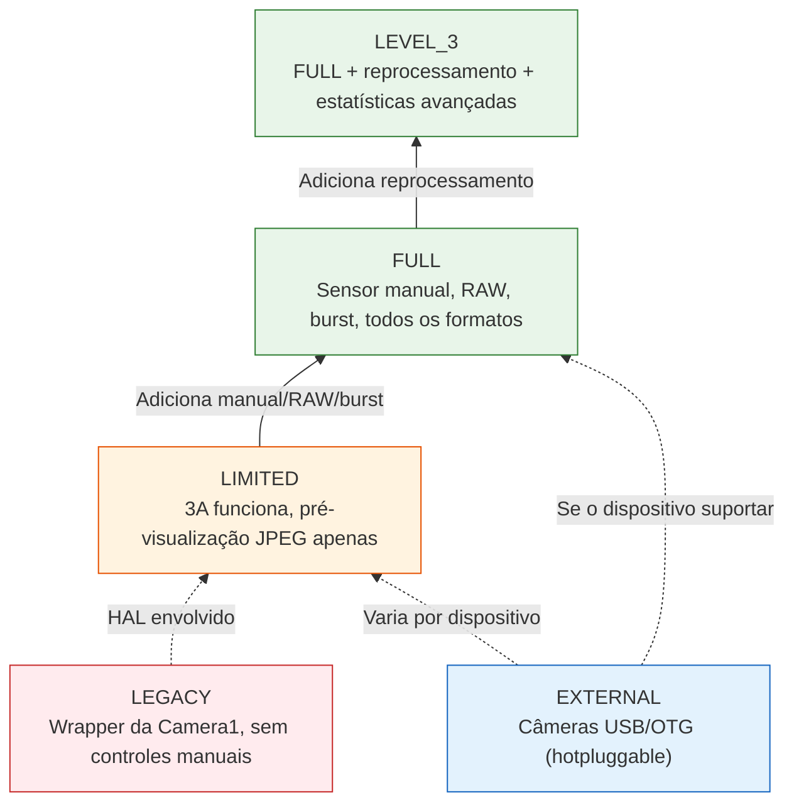
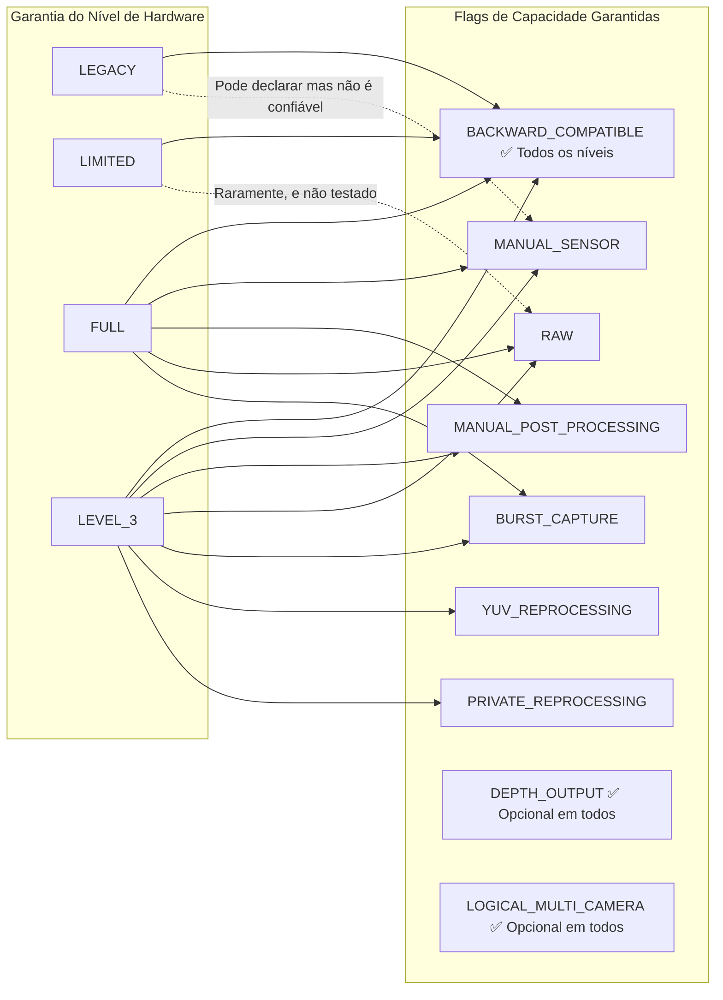
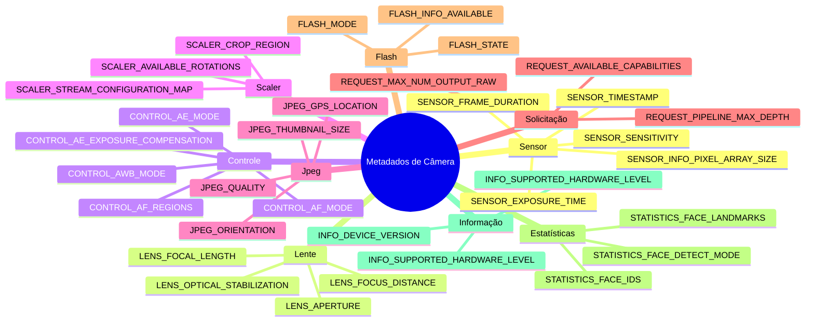

## 12.1 A Folha de Especificações no Seu Bolso

Antes de poder chamar o `openCamera()`, antes de poder construir uma `CaptureRequest`, antes de poder configurar uma sessão — existe o `CameraCharacteristics`. Ele é a janela imutável, que não exige o acionamento da energia, para *tudo* o que uma câmera pode fazer. Pense nele como a folha de especificações da câmera, exposta como um objeto estruturado e consultável.

O `CameraCharacteristics` é a sua ferramenta mais importante para escrever aplicativos que funcionem nos mais de 10.000 modelos de dispositivos Android. Você não pode assumir que o ISO manual funciona. Não pode assumir que o RAW está disponível. Não pode nem assumir que a câmera suporta a pré-visualização em 1080p — a menos que você pergunte ao `CameraCharacteristics`.

No [Capítulo 6](discovering-cameras.md), abordamos o básico: direção da lente, tamanho do sensor, distância focal. Neste mergulho profundo, vamos muito mais longe:
- Os cinco **níveis de hardware** (LEGACY → LIMITED → FULL → LEVEL_3 → EXTERNAL) e o que cada um garante.
- As mais de dez **flags de capacidade** (`MANUAL_SENSOR`, `RAW`, `DEPTH_OUTPUT`, etc.) e quais níveis de hardware as fornecem.
- Como as chaves de metadados são **organizadas hierarquicamente** por subsistema (`android.sensor.*`, `android.lens.*`, `android.control.*`, ...).
- Como escrever uma **consulta de capacidade completa em tempo de execução** com fallbacks graciosos.

O aplicativo Android Camera Parameters ([GitHub](https://github.com/zoozooll/AndroidCameraParameters), [Play Store](https://play.google.com/store/apps/details?id=com.minininja.cameraparams)) é essencialmente um navegador de `CameraCharacteristics` turbinado. Abra-o em qualquer câmera e você verá exatamente as chaves que discutimos neste capítulo, organizadas por categoria, com rótulos legíveis por humanos e renderização de valores ao vivo.

## 12.2 O Que o CameraCharacteristics Realmente É

Formalmente, o `CameraCharacteristics` é:

- **Imutável** — Uma vez obtido via `CameraManager.getCameraCharacteristics(id)`, o objeto nunca muda (com uma exceção documentada: `SENSOR_ORIENTATION` em dobráveis na API 32+).
- **Sem consumo de energia** — Consultá-lo **não** liga o sensor ou o ISP. Você pode chamá-lo no `onCreate()` de sua primeira Activity sem impacto na bateria.
- **Por câmera** — Cada ID de câmera lógica possui seu próprio objeto `CameraCharacteristics`.
- **Tipado e baseado em chaves** — Os dados são acessados via `<Key<T>> get(Key<T> key)`, onde cada chave possui um tipo documentado (Int, Long, Float, Rect, Array, etc.).

Você obtém um com uma única chamada:

```kotlin
val cameraManager = getSystemService(CAMERA_SERVICE) as CameraManager
val cameraIdList = cameraManager.cameraIdList  // ex: ["0", "1", "2", "3"]

for (id in cameraIdList) {
    val characteristics: CameraCharacteristics = cameraManager.getCameraCharacteristics(id)
    // Pode consultar à vontade — sem consumo de energia do sensor!
}
```

No Android 15 (API 35), você pode usar o `CameraManager.getCameraDeviceSetup(id)` para consultas leves de configuração de sessão sem abrir a câmera (consulte o [Capítulo 28](camera2-architecture.md) para detalhes do `CameraDeviceSetup`).

## 12.3 Nível de Hardware: INFO_SUPPORTED_HARDWARE_LEVEL

A chave individual mais importante do `CameraCharacteristics` é a **`INFO_SUPPORTED_HARDWARE_LEVEL`**. Ela define todo o nível do HAL da câmera e informa (genericamente) quais recursos têm funcionamento garantido. Existem cinco níveis de hardware:

### Os Cinco Níveis de Hardware

| Nível | Constante | Dispositivos Típicos | O Que Significa na Prática |
|-------|----------|----------------|---------------------------|
| **LEGACY** | `INFO_SUPPORTED_HARDWARE_LEVEL_LEGACY` | Dispositivos econômicos pré-2015, chipsets muito antigos | A API Camera2 é um wrapper em torno da antiga API `android.hardware.Camera`. Sem controles por quadro, sem configurações manuais, RAW impossível, burst não confiável. Trate esses dispositivos como "era Camera1 com sintaxe Camera2". |
| **LIMITED** | `INFO_SUPPORTED_HARDWARE_LEVEL_LIMITED` | Celulares econômicos (Android Go, SoCs de entrada como MediaTek Helio, Snapdragon 4xx) | HAL Camera2 nativo, mas apenas um subconjunto de recursos. 3A (AF/AE/AWB) funcionam. Pré-visualização + JPEG funcionam. Mas **nenhum** controle manual do sensor, **sem** RAW, **sem** burst garantido, **sem** reprocessamento YUV. Este é o nível de câmera "funcional de base" do Android. |
| **FULL** | `INFO_SUPPORTED_HARDWARE_LEVEL_FULL` | Celulares intermediários e flagship (Snapdragon 6xx/7xx/8xx, Exynos mid+, Dimensity 7xxx+) | O nível de "câmera pro". Garante MANUAL_SENSOR, MANUAL_POST_PROCESSING, BURST_CAPTURE, configurações por quadro, 30fps em resolução total, RAW, todos os formatos de saída, profundidade de pipeline previsível. O que você deseja para qualquer app de câmera sério. |
| **LEVEL_3** | `INFO_SUPPORTED_HARDWARE_LEVEL_3` | Flagships de ponta com ISP avançado (Snapdragon 8 Gen 1+, Pixel 6+, Exynos 2xxx+) | FULL + extras: reprocessamento YUV (suporte a fluxo de entrada, reprocessamento offline), reprocessamento privado, estatísticas avançadas, JPEG de hardware + RAW em resolução máxima simultaneamente. Necessário para ZSL com saída RAW. |
| **EXTERNAL** | `INFO_SUPPORTED_HARDWARE_LEVEL_EXTERNAL` | Câmeras USB, webcams conectadas via OTG | HAL de câmera externa. Comporta-se como LIMITED ou FULL dependendo do dispositivo USB. Ressalva importante: a câmera pode ser conectada/desconectada a qualquer momento, então escute pelo `ACTION_CAMERA_DEVICE_STATE_CHANGED`. |



:::important
O nível de hardware é uma **garantia**, não uma flag de "melhor esforço". Se um dispositivo relata FULL, o CTS (Compatibility Test Suite) do Google verificou que cada recurso de nível FULL funciona. Se um dispositivo relata LIMITED, você não pode confiar em nenhum recurso de nível FULL — mesmo que ele funcione em um dispositivo LIMITED específico, ele falhará em outro.
:::

### Verificando o Nível de Hardware em Tempo de Execução

```kotlin
val hardwareLevel = characteristics.get(CameraCharacteristics.INFO_SUPPORTED_HARDWARE_LEVEL)

when (hardwareLevel) {
    CameraCharacteristics.INFO_SUPPORTED_HARDWARE_LEVEL_LEGACY -> {
        Log.w("CamCaps", "Hardware LEGACY — manual/RAW desativados. Revertendo para JPEG básico.")
        disableManualControls()
        disableRawCapture()
    }
    CameraCharacteristics.INFO_SUPPORTED_HARDWARE_LEVEL_LIMITED -> {
        Log.i("CamCaps", "Hardware LIMITED — apenas foto básica + pré-visualização.")
        disableManualControls()
        disableRawCapture()
        disableBurstCapture()
    }
    CameraCharacteristics.INFO_SUPPORTED_HARDWARE_LEVEL_FULL -> {
        Log.i("CamCaps", "Hardware FULL — ativando controles manuais, RAW e burst.")
        enableManualControls()
        enableRawCapture()
        enableBurstCapture()
    }
    CameraCharacteristics.INFO_SUPPORTED_HARDWARE_LEVEL_3 -> {
        Log.i("CamCaps", "Hardware LEVEL_3 — FULL + reprocessamento + ZSL + estatísticas avançadas.")
        enableManualControls()
        enableRawCapture()
        enableBurstCapture()
        enableReprocessing()
        enableZeroShutterLag()
    }
    CameraCharacteristics.INFO_SUPPORTED_HARDWARE_LEVEL_EXTERNAL -> {
        Log.i("CamCaps", "Câmera EXTERNAL — pode ser LIMITED ou FULL; registrando listener de desconexão.")
        registerHotplugListener()
        // Sonda dinamicamente as capacidades em vez de assumir
    }
    else -> {
        Log.w("CamCaps", "Nível de hardware desconhecido $hardwareLevel — assumindo LIMITED por segurança.")
        safeDefaultFeatures()
    }
}
```

## 12.4 Capacidades: REQUEST_AVAILABLE_CAPABILITIES

O nível de hardware é um nível *genérico*. Para detecção de recursos refinados, o Camera2 expõe o `REQUEST_AVAILABLE_CAPABILITIES` — um `IntArray` de flags de capacidade. Cada flag descreve uma coisa específica que a câmera pode fazer.

A relação formal entre o nível de hardware e as capacidades:



### As Flags de Capacidade, Explicadas

| Constante da Flag | Significado | Garantia por Nível de Hardware | Implicação Prática |
|--------------|---------|--------------------------|----------------------|
| `BACKWARD_COMPATIBLE` | A câmera implementa a API Camera2 básica | **Todos os 5 níveis** (LEGACY–EXTERNAL) | Se esta flag faltar, o dispositivo de câmera é efetivamente não funcional para o seu app. |
| `MANUAL_SENSOR` | O app pode controlar manualmente `SENSOR_EXPOSURE_TIME`, `SENSOR_SENSITIVITY`, `SENSOR_FRAME_DURATION`, `LENS_FOCUS_DISTANCE`, `LENS_APERTURE` | Garantido em **FULL** e **LEVEL_3** | Interfaces de modo Pro e câmera manual exigem isso. Sem ela, todos os seletores manuais de ISO/exposição devem ser ocultados. |
| `MANUAL_POST_PROCESSING` | O app pode controlar manualmente os estágios do ISP: redução de ruído, aprimoramento de bordas, curva de tons, ganhos de correção de cor, matriz de correção de cor | Garantido em **FULL** e **LEVEL_3** | Necessário para visuais de "estilo de filme" personalizados, balanço de branco manual via ganhos, controle de nitidez/desfoque. |
| `RAW` | O sensor emite dados RAW Bayer via formatos `ImageFormat.RAW_SENSOR`, `RAW10` ou `RAW12` | Garantido em **FULL** e **LEVEL_3** | Captura de DNG, pipeline de edição RAW-para-JPEG e fotografia computacional começam aqui. |
| `PRIVATE_REPROCESSING` | A câmera suporta `InputSurface` + reprocessamento offline de imagens no formato privado do HAL para JPEG/YUV | Garantido em **LEVEL_3**. Raro em FULL. | Habilita o Zero-Shutter-Lag (ZSL): armazena quadros passados em buffer circular, reprocessa um recente em uma foto estática de alta qualidade. |
| `YUV_REPROCESSING` | A câmera suporta `InputSurface` + reprocessamento de imagens YUV_420_888 fornecidas pelo app de volta através do ISP | Garantido em **LEVEL_3** | Habilita pipelines como "aplicar LUT cinematográfico ao vídeo gravado" ou "refocar profundidade de retrato na pós-produção". |
| `DEPTH_OUTPUT` | A câmera pode emitir mapas de profundidade (formatos `DEPTH16` / `DEPTH_POINT_CLOUD`) | **Opcional em QUALQUER** nível. Verifique o array explicitamente. | Bokeh de modo retrato, medição em AR, escaneamento 3D. Frequentemente pareado com `LOGICAL_MULTI_CAMERA` (câmeras físicas duplas para profundidade estéreo). |
| `LOGICAL_MULTI_CAMERA` | Esta câmera lógica é apoiada por 2+ sensores físicos (ex: ultra-wide + wide + telefoto) | **Opcional em QUALQUER** nível. Geralmente apenas flagships. | Habilita o zoom óptico contínuo (consulte o [Capítulo 20](multi-camera.md)). Você pode consultar `LOGICAL_MULTI_CAMERA_PHYSICAL_IDS` para obter os IDs das câmeras físicas. |
| `BURST_CAPTURE` | `captureBurst()` com > 1 quadro funciona em resolução total sem queda de quadros | Garantido em **FULL** e **LEVEL_3** | Sem isso, a captura em burst pode travar, descartar quadros ou falhar silenciosamente. O bracketing de exposição / foco exige isso. |
| `CONSTRAINED_HIGH_SPEED_VIDEO` | Suporta `createHighSpeedRequestList()` + vídeo de alta velocidade (120fps, 240fps) | **Opcional em FULL/LEVEL_3**. Raro em LIMITED. | Gravação em câmera lenta (consulte o [Capítulo 19](high-speed-video.md)). |
| `MOTION_TRACKING` | A câmera pode rastrear objetos / rostos em alta taxa de quadros com baixa latência | Opcional (raro). Encontrado em Pixels e alguns flagships. | Rastreamento de movimento em AR, autofoco esportivo. |
| `LOGICAL_MULTI_CAMERA_SYNC` | Múltiplas câmeras físicas em um dispositivo lógico podem capturar quadros sincronizados | Opcional. Necessário para captura multi-sensor simultânea real. | Fotografia computacional que usa múltiplas lentes ao mesmo tempo (ex: zoom de fusão). |

### Consultando Todas as Capacidades em Tempo de Execução

```kotlin
val capabilities = characteristics.get(
    CameraCharacteristics.REQUEST_AVAILABLE_CAPABILITIES
) ?: intArrayOf()

fun hasCapability(cap: Int): Boolean = capabilities.contains(cap)

val supportsManualSensor = hasCapability(
    CameraCharacteristics.REQUEST_AVAILABLE_CAPABILITIES_MANUAL_SENSOR
)
val supportsRaw = hasCapability(
    CameraCharacteristics.REQUEST_AVAILABLE_CAPABILITIES_RAW
)
val supportsBurst = hasCapability(
    CameraCharacteristics.REQUEST_AVAILABLE_CAPABILITIES_BURST_CAPTURE
)
val supportsDepth = hasCapability(
    CameraCharacteristics.REQUEST_AVAILABLE_CAPABILITIES_DEPTH_OUTPUT
)
val supportsLogicalMultiCam = hasCapability(
    CameraCharacteristics.REQUEST_AVAILABLE_CAPABILITIES_LOGICAL_MULTI_CAMERA
)
val supportsHighSpeed = hasCapability(
    CameraCharacteristics.REQUEST_AVAILABLE_CAPABILITIES_CONSTRAINED_HIGH_SPEED_VIDEO
)
val supportsYuvReprocessing = hasCapability(
    CameraCharacteristics.REQUEST_AVAILABLE_CAPABILITIES_YUV_REPROCESSING
)
val supportsPrivateReprocessing = hasCapability(
    CameraCharacteristics.REQUEST_AVAILABLE_CAPABILITIES_PRIVATE_REPROCESSING
)

// Construir relatório legível
val capabilityReport = buildString {
    appendLine("=== Relatório de Capacidades da Câmera ===")
    appendLine("BACKWARD_COMPATIBLE:     ${hasCapability(
        CameraCharacteristics.REQUEST_AVAILABLE_CAPABILITIES_BACKWARD_COMPATIBLE
    )}")
    appendLine("MANUAL_SENSOR:           $supportsManualSensor")
    appendLine("MANUAL_POST_PROCESSING:  ${hasCapability(
        CameraCharacteristics.REQUEST_AVAILABLE_CAPABILITIES_MANUAL_POST_PROCESSING
    )}")
    appendLine("RAW:                     $supportsRaw")
    appendLine("BURST_CAPTURE:           $supportsBurst")
    appendLine("YUV_REPROCESSING:        $supportsYuvReprocessing")
    appendLine("PRIVATE_REPROCESSING:    $supportsPrivateReprocessing")
    appendLine("DEPTH_OUTPUT:            $supportsDepth")
    appendLine("LOGICAL_MULTI_CAMERA:    $supportsLogicalMultiCam")
    appendLine("CONSTRAINED_HIGH_SPEED:  $supportsHighSpeed")
}

Log.i("CamCaps", capabilityReport)

// Agora condicione seus recursos de UI
manualIsoSlider.isEnabled = supportsManualSensor
manualExposureSlider.isEnabled = supportsManualSensor
rawCaptureToggle.isEnabled = supportsRaw
burstCaptureButton.isEnabled = supportsBurst
depthPortraitMode.isEnabled = supportsDepth
zoomSwitcher.isEnabled = supportsLogicalMultiCam
slowMoButton.isEnabled = supportsHighSpeed
zslMode.isEnabled = supportsPrivateReprocessing  // LEVEL_3
```

:::tip
O aplicativo Android Camera Parameters renderiza exatamente esta consulta como caixas de seleção coloridas no cartão **Capabilities** da visualização de resumo da câmera. Verde = suportado, cinza = não suportado. Você pode comparar várias câmeras lado a lado para ver como as capacidades da ultra-wide diferem das da câmera principal.
:::

## 12.5 Organização dos Metadados: O Namespace android.*

Cada chave em `CameraCharacteristics`, `CaptureRequest` e `CaptureResult` segue uma convenção de nomenclatura hierárquica: `android.<subsistema>.<parâmetro>`. Os componentes separados por pontos agrupam as configurações relacionadas pelo subsistema de hardware/software que elas controlam.

### As Classes de Subsistemas

| Prefixo do Subsistema | Classe de Metadados Kotlin | O Que Cobre |
|-----------------|----------------------|---------------|
| `android.sensor.*` | `CameraCharacteristics.SensorInfo*`, `CaptureRequest.SENSOR_*`, `CaptureResult.SENSOR_*` | Leitura do sensor: tempo de exposição, sensibilidade ISO, duração do quadro, timestamp, matriz de pixels, matriz ativa, direção do obturador eletrônico, modos de padrão de teste |
| `android.lens.*` | `LensInfo*`, `Lens.*` | Óptica: distância de foco, abertura, distância focal, estabilização óptica (OIS), densidade do filtro (ND), faixa de foco, aberturas disponíveis |
| `android.control.*` | `Control*` | Algoritmos 3A: modos / estado / alvo / regiões de exposição automática (AE), modos / estado / gatilho / regiões de foco automático (AF), modos / estado / regiões de balanço de branco automático (AWB), anti-banding, modos de cena, modos de efeito, estabilização de vídeo (EIS) |
| `android.scaler.*` | `Scaler.*` | Configuração do pipeline de saída: região de corte (zoom digital), rotação, mapa de configuração de fluxo (formatos de saída, tamanhos, durações), durações mínimas de quadro disponíveis |
| `android.jpeg.*` | `Jpeg*` | Codificação JPEG: qualidade, orientação, coordenadas GPS, tamanho da miniatura, qualidade da miniatura |
| `android.request.*` | `Request*` | Capacidades de todo o pipeline: array de capacidades disponíveis, profundidade máxima do pipeline, número máximo de saídas raw/proc, chaves de objetos de metadados, lista de modelos disponíveis |
| `android.flash.*` | `FlashInfo*`, `Flash*` | Unidade de flash: disponibilidade, estado de carga, temperatura de cor, brilho máximo, modo (desligado / único / lanterna) |
| `android.statistics.*` | `Statistics*` | Saída de estatísticas do ISP: detecção facial, IDs faciais, marcos faciais, pontuações faciais, histograma, mapa de nitidez, mapa de sombreamento da lente, mapa de pixels quentes |
| `android.info.*` | `Info*` | Informações estáticas da câmera: nível de hardware suportado, versão do dispositivo, nível de hardware suportado, modos de detecção facial disponíveis, modos de redução de ruído disponíveis |
| `android.black.*` | `BlackLevel*` | Trava de nível de preto, padrão de nível de preto (correção de ruído de padrão fixo) |
| `android.colorCorrection.*` | `ColorCorrection*` | Pipeline de cores: matriz de transformação, ganhos de correção de cor (canais R, G, B), modo de correção de aberração |
| `android.tonemap.*` | `Tonemap*` | Mapeamento de tons: curva de mapeamento de tons (gama personalizada), modo de mapeamento de tons, contraste, saturação |
| `android.edge.*` | `Edge*` | Aprimoramento de bordas / nitidez: modo, intensidade |
| `android.noiseReduction.*` | `NoiseReduction*` | Redução de ruído: modo, intensidade, intensidade de NR temporal |
| `android.shading.*` | `Shading*` | Sombreamento da lente / correção de vinheta: modo, intensidade |
| `android.hotPixel.*` | `HotPixel*` | Correção de pixel quente: modo, mapa de pixels quentes |
| `android.distortionCorrection.*` | `DistortionCorrection*` | Correção de distorção geométrica da lente: modo |
| `android.depth.*` | `Depth*` | Saída de profundidade: profundidade é exclusiva, amostras máximas de profundidade, formato de profundidade |
| `android.logicalMultiCamera.*` | `LogicalMultiCamera*` | Multicâmera lógica: IDs das câmeras físicas, sincronização física do sensor |



### Uma Nota sobre a Disponibilidade das Chaves

Nem toda chave existe em todos os dispositivos. Se você chamar `get(CHAVE)` para uma chave que o dispositivo não suporta, você receberá `null` — daí os padrões `?: 0` ou `?.let` que você vê ao longo deste livro.

O padrão seguro é: **verifique se a chave existe antes de lê-la**, ou use a segurança contra nulos do Kotlin para fornecer um padrão.

```kotlin
// Acesso seguro com padrões de fallback
val exposureTimeNs: Long = characteristics.get(
    CameraCharacteristics.SENSOR_INFO_EXPOSURE_TIME_RANGE
)?.upper ?: 1_000_000L  // padrão de 1ms máx se a chave faltar

// Processamento opcional se a chave existir
characteristics.get(CameraCharacteristics.LENS_INFO_AVAILABLE_APERTURES)?.let { apertures ->
    Log.d("CamCaps", "Dispositivo suporta ${apertures.size} aberturas: ${apertures.contentToString()}")
    buildApertureSelector(apertures)
} ?: run {
    Log.d("CamCaps", "Nenhuma abertura variável neste dispositivo")
    hideApertureControl()
}
```

## 12.6 Uma Consulta de Capacidade em Tempo de Execução Completa (Nível de Produção)

Juntando tudo, aqui está uma consulta de capacidade pronta para produção que você pode inserir em qualquer app Camera2. Ela combina o nível de hardware, flags de capacidade e verificações de chaves individuais:

```kotlin
data class CameraCapabilityProfile(
    val cameraId: String,
    val lensFacing: Int,
    val hardwareLevel: Int,
    val hardwareLevelName: String,
    val supportsManualSensor: Boolean,
    val supportsManualPostProcessing: Boolean,
    val supportsRaw: Boolean,
    val supportsBurst: Boolean,
    val supportsDepth: Boolean,
    val supportsLogicalMultiCam: Boolean,
    val supportsHighSpeedVideo: Boolean,
    val supportsYuvReprocessing: Boolean,
    val supportsPrivateReprocessing: Boolean,
    val maxBurstRaw: Int,
    val maxBurstProcessed: Int,
    val pipelineMaxDepth: Int,
    val availableFocalLengths: FloatArray?,
    val availableApertures: FloatArray?,
    val minFocusDistanceDiopters: Float?,
    val maxDigitalZoom: Float?
)

fun buildCapabilityProfile(
    cameraManager: CameraManager,
    cameraId: String
): CameraCapabilityProfile {
    val c = cameraManager.getCameraCharacteristics(cameraId)

    val hwLevel = c.get(CameraCharacteristics.INFO_SUPPORTED_HARDWARE_LEVEL)
        ?: CameraCharacteristics.INFO_SUPPORTED_HARDWARE_LEVEL_LEGACY

    val hwLevelName = when (hwLevel) {
        CameraCharacteristics.INFO_SUPPORTED_HARDWARE_LEVEL_LEGACY -> "LEGACY"
        CameraCharacteristics.INFO_SUPPORTED_HARDWARE_LEVEL_LIMITED -> "LIMITED"
        CameraCharacteristics.INFO_SUPPORTED_HARDWARE_LEVEL_FULL -> "FULL"
        CameraCharacteristics.INFO_SUPPORTED_HARDWARE_LEVEL_3 -> "LEVEL_3"
        CameraCharacteristics.INFO_SUPPORTED_HARDWARE_LEVEL_EXTERNAL -> "EXTERNAL"
        else -> "UNKNOWN($hwLevel)"
    }

    val caps = c.get(CameraCharacteristics.REQUEST_AVAILABLE_CAPABILITIES) ?: intArrayOf()
    fun has(cap: Int) = caps.contains(cap)

    // O nível de hardware fornece garantias de capacidade, mas verifique as flags por segurança
    val atLeastFull = hwLevel == CameraCharacteristics.INFO_SUPPORTED_HARDWARE_LEVEL_FULL ||
                      hwLevel == CameraCharacteristics.INFO_SUPPORTED_HARDWARE_LEVEL_3

    return CameraCapabilityProfile(
        cameraId = cameraId,
        lensFacing = c.get(CameraCharacteristics.LENS_FACING)
            ?: CameraCharacteristics.LENS_FACING_BACK,
        hardwareLevel = hwLevel,
        hardwareLevelName = hwLevelName,

        // Usar verificação de flag + fallback de garantia de nível de hardware por segurança
        supportsManualSensor = has(
            CameraCharacteristics.REQUEST_AVAILABLE_CAPABILITIES_MANUAL_SENSOR
        ) || atLeastFull,
        supportsManualPostProcessing = has(
            CameraCharacteristics.REQUEST_AVAILABLE_CAPABILITIES_MANUAL_POST_PROCESSING
        ) || atLeastFull,
        supportsRaw = has(
            CameraCharacteristics.REQUEST_AVAILABLE_CAPABILITIES_RAW
        ) || atLeastFull,
        supportsBurst = has(
            CameraCharacteristics.REQUEST_AVAILABLE_CAPABILITIES_BURST_CAPTURE
        ) || atLeastFull,
        supportsDepth = has(
            CameraCharacteristics.REQUEST_AVAILABLE_CAPABILITIES_DEPTH_OUTPUT
        ),
        supportsLogicalMultiCam = has(
            CameraCharacteristics.REQUEST_AVAILABLE_CAPABILITIES_LOGICAL_MULTI_CAMERA
        ),
        supportsHighSpeedVideo = has(
            CameraCharacteristics.REQUEST_AVAILABLE_CAPABILITIES_CONSTRAINED_HIGH_SPEED_VIDEO
        ),
        supportsYuvReprocessing = has(
            CameraCharacteristics.REQUEST_AVAILABLE_CAPABILITIES_YUV_REPROCESSING
        ),
        supportsPrivateReprocessing = has(
            CameraCharacteristics.REQUEST_AVAILABLE_CAPABILITIES_PRIVATE_REPROCESSING
        ),

        maxBurstRaw = c.get(CameraCharacteristics.REQUEST_MAX_NUM_OUTPUT_RAW) ?: 1,
        maxBurstProcessed = c.get(CameraCharacteristics.REQUEST_MAX_NUM_OUTPUT_PROC) ?: 1,
        pipelineMaxDepth = c.get(CameraCharacteristics.REQUEST_PIPELINE_MAX_DEPTH) ?: 1,

        availableFocalLengths = c.get(CameraCharacteristics.LENS_INFO_AVAILABLE_FOCAL_LENGTHS),
        availableApertures = c.get(CameraCharacteristics.LENS_INFO_AVAILABLE_APERTURES),
        minFocusDistanceDiopters = c.get(CameraCharacteristics.LENS_INFO_MINIMUM_FOCUS_DISTANCE),
        maxDigitalZoom = c.get(CameraCharacteristics.SCALER_AVAILABLE_MAX_DIGITAL_ZOOM)
    )
}

// Uso:
val profile = buildCapabilityProfile(cameraManager, "0")
Log.d("CamCaps", "Perfil da Câmera 0: ${profile.hardwareLevelName}, " +
    "Manual=${profile.supportsManualSensor}, RAW=${profile.supportsRaw}, " +
    "Burst=${profile.supportsBurst}, Profundidade=${profile.supportsDepth}, " +
    "Zoom=${profile.maxDigitalZoom}x")
```

## 12.7 Visualizando no Aplicativo Android Camera Parameters

O aplicativo Android Camera Parameters ([GitHub](https://github.com/zoozooll/AndroidCameraParameters), [Play Store](https://play.google.com/store/apps/details?id=com.minininja.cameraparams)) é o companheiro ideal para este capítulo. Ele transforma os pares chave/valor brutos do `CameraCharacteristics` em uma interface navegável:

- **Cartão de resumo** — Nível de hardware (com emblema colorido: vermelho=LEGACY, laranja=LIMITED, verde=FULL, azul esverdeado=LEVEL_3, azul=EXTERNAL), direção da lente, resolução do sensor, distâncias focais.
- **Cartão de capacidades** — Lista de verificação de cada flag `REQUEST_AVAILABLE_CAPABILITIES`, verde se presente.
- **Abas de categoria** — Organizadas exatamente pelos subsistemas `android.*`: Sensor, Lens, Control, Scaler, Jpeg, Flash, Statistics, Info, Request.
- **Aba JSON Bruto** — O objeto `CameraCharacteristics` serializado completo para copiar/colar em relatórios de bugs.
- **Modo Comparar** — Deslize entre as câmeras (0, 1, 2, 3) para ver como os níveis de hardware e as capacidades diferem entre as lentes.

## 12.8 Resumo

| Conceito | Conclusão Principal |
|---------|-------------|
| **Nível de Hardware** | 5 níveis: LEGACY (wrapper) → LIMITED (base) → FULL (pro + manual/RAW) → LEVEL_3 (FULL + reprocessamento) → EXTERNAL (USB). FULL é o mínimo para qualquer trabalho de câmera sério. Garantias verificadas pelo CTS. |
| **Flags de Capacidade**| Detecção de recursos refinados via `REQUEST_AVAILABLE_CAPABILITIES`. Flags principais: `MANUAL_SENSOR`, `MANUAL_POST_PROCESSING`, `RAW`, `BURST_CAPTURE`, `DEPTH_OUTPUT`, `LOGICAL_MULTI_CAMERA`, `PRIVATE_REPROCESSING`, `YUV_REPROCESSING`, `CONSTRAINED_HIGH_SPEED_VIDEO`. |
| **Mapeamento Nível → Capacidade** | FULL garante MANUAL_SENSOR, MANUAL_POST_PROCESSING, RAW, BURST. LEVEL_3 adiciona REPROCESSAMENTO YUV/PRIVADO. DEPTH e LOGICAL_MULTI_CAMERA são opcionais em todos os níveis. |
| **Namespace de Metadados** | Chaves organizadas como `android.<subsistema>.<parâmetro>`. Principais subsistemas: sensor, lens, control, scaler, jpeg, request, flash, statistics, info. Cada subsistema tem informações estáticas (CameraCharacteristics), entradas de solicitação (CaptureRequest) e saídas de resultado (CaptureResult). |
| **Consultas Seguras** | Forneça sempre padrões de segurança contra nulos para o `get()` — muitas chaves são opcionais. Use o nível de hardware como filtro genérico, as flags de capacidade como filtro fino e a presença da chave individual para ajuste por dispositivo. |

## O Que Vem a Seguir

Agora que você entende o que uma câmera pode fazer (características) e como controlá-la (o pipeline + tipos de captura), você tem a base completa para a Parte IV.

No **Capítulo 13: ISO e Exposição de Câmera Manual**, você aprenderá a usar a capacidade `MANUAL_SENSOR` para controlar manualmente o `SENSOR_EXPOSURE_TIME` e a `SENSOR_SENSITIVITY` — implementando um seletor de exposição em modo pro com pré-visualização ao vivo, compensação de exposição e as trocas do triângulo de exposição.
