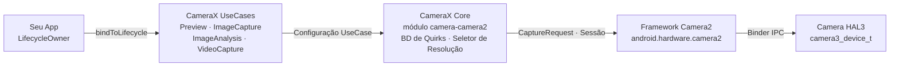

# Capítulo 24: CameraX

## Resumo

Ao chegar a este capítulo, você já dominou a API Camera2 bruta: abrindo instâncias de `CameraDevice` manualmente, construindo objetos `CaptureRequest.Builder`, gerenciando ciclos de vida de `CameraCaptureSession`, lidando com três tipos diferentes de callbacks e liberando cuidadosamente cada recurso em cada caso extremo. Você ganhou suas cicatrizes. Agora damos um passo atrás e perguntamos: e se 80% desse código clichê (boilerplate) pudesse desaparecer?

O CameraX é a biblioteca Jetpack do Google que envolve o Camera2 em uma API declarativa, baseada em casos de uso e ciente do ciclo de vida. Ele não substitui o Camera2 — ele é o Camera2 sob o capô. O que ele substitui são centenas de linhas de código de configuração de sessão, tratamento de peculiaridades específicas de dispositivos e contabilidade manual de ciclo de vida. Neste capítulo, você aprenderá a arquitetura do CameraX, entenderá o modelo `UseCase`, verá como injetar parâmetros Camera2 brutos *dentro* do CameraX via `Camera2Interop` e sairá com uma tabela de decisão para saber exatamente quando recorrer ao CameraX e quando você deve descer para o Camera2 bruto.

Para acompanhar e inspecionar cada capacidade de câmera em seu próprio dispositivo antes de decidir qual camada visar, instale o **Android Camera Parameters** da [Google Play](https://play.google.com/store/apps/details?id=com.minininja.cameraparams) ou navegue pelo código-fonte em [github.com/zoozooll/AndroidCameraParameters](https://github.com/zoozooll/AndroidCameraParameters).

---

## Arquitetura do CameraX

O CameraX é distribuído como cinco artefatos Jetpack: `camera-core`, `camera-camera2`, `camera-lifecycle`, `camera-view` e `camera-extensions`. A espinha dorsal arquitetural é o modelo `UseCase` — em vez de pensar em superfícies (surfaces) e sessões, você pensa no *que deseja que a câmera faça*.

### O Modelo UseCase

Existem quatro casos de uso canônicos, e você vincula qualquer subconjunto deles simultaneamente a um ciclo de vida:

| UseCase          | Propósito                                                        |
|------------------|----------------------------------------------------------------|
| `Preview`        | Transmite quadros para um `PreviewView` ou `Surface`. Análogo à configuração de uma solicitação repetida visando um `SurfaceTexture`. |
| `ImageAnalysis`  | Transmite quadros `ImageProxy` para seu analisador em uma thread de segundo plano. Substitui a criação manual de um `ImageReader` com `YUV_420_888` e a ligação de seu listener a uma solicitação repetida. |
| `ImageCapture`   | Captura de foto de disparo único ou sequencial. Gerencia a solicitação de captura, a ligação do `ImageReader`, a rotação e o EXIF para você. |
| `VideoCapture`   | Mesclado ao CameraX a partir da versão 1.1; envolve um pipeline `MediaRecorder` ou `ParcelFileDescriptor` com semântica correta de pausa/retomada e roteamento de áudio. |

Vincular todos os quatro é perfeitamente legal — o CameraX resolve internamente a combinação de fluxos contra o `SCALER_STREAM_CONFIGURATION_MAP` e chama `isSessionConfigurationSupported` em seu nome, voltando para resoluções mais baixas se sua combinação exata não for suportada. Esta é uma das maiores vitórias individuais: você nunca mais passará três horas descobrindo que o Samsung intermediário de 2019 em sua matriz de teste não suporta `4:3 PRIV + 16:9 JPEG_MAX` simultaneamente. O CameraX simplesmente funciona.

### ProcessCameraProvider e Consciência do Ciclo de Vida

O ponto de vinculação é o `ProcessCameraProvider`, um singleton de propriedade do processo da sua aplicação. A linha principal é:

```kotlin
val cameraProviderFuture = ProcessCameraProvider.getInstance(context)
cameraProviderFuture.addListener({
    val cameraProvider = cameraProviderFuture.get()
    val camera: Camera = cameraProvider.bindToLifecycle(
        lifecycleOwner,
        cameraSelector,
        preview,
        imageCapture,
        imageAnalysis
    )
}, ContextCompat.getMainExecutor(context))
```

É só isso. Sem o inferno de callbacks do `openCamera`, sem `StateCallback`, sem callback de configuração de sessão, sem desmontagem. Quando o `lifecycleOwner` (seu `Fragment` ou `Activity`) atinge `ON_STOP`, o CameraX fecha o `CameraDevice`. No `ON_DESTROY`, ele desmonta a sessão e libera cada superfície. Vazamentos de recursos do tipo que você caçou no Capítulo 7 simplesmente não podem acontecer — o contrato do ciclo de vida o impede.

### O CameraX Envolve Internamente o Camera2

Internamente, o CameraX é Camera2. O artefato `camera-camera2` contém `Camera2Camera`, `Camera2CameraCaptureResult` e `Camera2RequestProcessor`, todos os quais traduzem suas declarações de UseCase de alto nível nas chamadas exatas de `CameraManager.openCamera`, `createCaptureSession` e `setRepeatingRequest` que você escreveu manualmente nos 23 capítulos anteriores. As soluções alternativas específicas de fornecedores são codificadas em arquivos XML por dispositivo dentro da biblioteca — o famoso "banco de dados de peculiaridades (quirks) do CameraX".

A arquitetura completa se parece com isso:



Siga as setas da esquerda para a direita: seu app declara o *que* deseja (casos de uso), o CameraX resolve *como* obtê-lo (tamanhos de superfície, configuração de sessão, peculiaridades) e, em seguida, emite as chamadas idênticas do Camera2 que você teria escrito. O valor agregado são as duas caixas do meio — centenas de milhares de linhas de código de compatibilidade de dispositivos criadas pelo Google que você não precisa escrever.

---

## Camera2Interop: Injetando Parâmetros Camera2 no CameraX

O CameraX é brilhante para os 80% dos casos. Mas você, caro leitor, é um mestre em Camera2. Você sabe o que `CONTROL_AE_MODE_OFF` significa. Você conhece a diferença entre `SENSOR_SENSITIVITY` e `CONTROL_AE_EXPOSURE_COMPENSATION`. Quando a especificação do produto diz "permita ao usuário travar o ISO em 400 e a exposição em 1/60s mesmo usando CameraX", você não reescreve todo o recurso em Camera2 bruto. Você recorre ao `Camera2Interop`.

### O Padrão Extender

Cada `UseCase.Builder` tem um `Camera2Interop.Extender` correspondente. Chame-o *antes* do `build()` para injetar chaves Camera2 brutas no nível da sessão ou no nível de cada solicitação:

| Método                                         | Equivalente Camera2                          |
|------------------------------------------------|----------------------------------------------|
| `extender.setCaptureRequestOption(key, value)` | `CaptureRequest.Builder.set(key, value)`     |
| `extender.setSessionOption(key, value)`        | Parâmetros de inicialização de sessão (menos usados) |

O extender é aditivo: o CameraX ainda define seus próprios padrões para cada chave que você não substitui. Se você definir apenas `SENSOR_SENSITIVITY`, o CameraX ainda gerencia AF, AWB, rotação e metadados.

### Exemplo do Mundo Real: ISO e Exposição Manual no CameraX

Aqui está um construtor `ImageCapture` completo que trava a câmera no AE manual com um ISO fixo de 400 e um tempo de exposição de 1/60 de segundo, e então tira uma foto:

```kotlin
val iso = 400
val exposureTimeNanos = 1_000_000_000L / 60 // 1/60 s

val imageCapture = ImageCapture.Builder()
    .setTargetResolution(Size(4032, 3024))
    .setCaptureMode(ImageCapture.CAPTURE_MODE_MAXIMIZE_QUALITY)
    .apply {
        val interop = Camera2Interop.Extender(this)
        interop.setCaptureRequestOption(
            CaptureRequest.CONTROL_AE_MODE,
            CaptureRequest.CONTROL_AE_MODE_OFF
        )
        interop.setCaptureRequestOption(
            CaptureRequest.CONTROL_AE_LOCK,
            false
        )
        interop.setCaptureRequestOption(
            CaptureRequest.SENSOR_SENSITIVITY,
            iso
        )
        interop.setCaptureRequestOption(
            CaptureRequest.SENSOR_EXPOSURE_TIME,
            exposureTimeNanos
        )
        interop.setCaptureRequestOption(
            CaptureRequest.CONTROL_MODE,
            CaptureRequest.CONTROL_MODE_OFF
        )
    }
    .build()

cameraProvider.bindToLifecycle(
    viewLifecycleOwner,
    CameraSelector.DEFAULT_BACK_CAMERA,
    preview,
    imageCapture
)

// Mais tarde, dispare a foto:
imageCapture.takePicture(
    ContextCompat.getMainExecutor(context),
    object : ImageCapture.OnImageCapturedCallback() {
        override fun onCaptureSuccess(imageProxy: ImageProxy) {
            // imageProxy contém o quadro exposto manualmente
            imageProxy.close()
        }

        override fun onError(exception: ImageCaptureException) {
            Log.e(TAG, "Falha na captura: ${exception.imageCaptureError}", exception)
        }
    }
)
```

**Ressalva crítica:** definir `CONTROL_MODE_OFF` desativa *todo* o 3A. Se você deseja apenas travar a exposição, mas ainda executar AF e AWB, defina apenas `CONTROL_AE_MODE_OFF` (ou `CONTROL_AE_LOCK = true`) e deixe `CONTROL_MODE` no padrão (`CONTROL_MODE_AUTO`). O CameraX usa o padrão para cada chave que você não toca.

E sim — você pode fazer a mesma coisa com `Preview.Builder` e `ImageAnalysis.Builder` para fluxos manuais repetidos. O extender se aplica a cada solicitação repetida ou única emitida durante a vida útil daquele UseCase.

### Lendo Resultados do Camera2 de Volta

Ir na outra direção — extrair um `TotalCaptureResult` de um callback do CameraX — é igualmente simples via `Camera2CameraCaptureResult`:

```kotlin
imageCapture.takePicture(
    executor,
    object : ImageCapture.OnImageCapturedCallback() {
        override fun onCaptureSuccess(imageProxy: ImageProxy) {
            val camera2Result = imageProxy.imageInfo
                .cameraCaptureResult as? Camera2CameraCaptureResult
            val totalResult: TotalCaptureResult? = camera2Result?.captureResult
            val actualIso = totalResult?.get(CaptureResult.SENSOR_SENSITIVITY)
            Log.d(TAG, "ISO real no sensor: $actualIso")
            imageProxy.close()
        }
    }
)
```

Isso permite verificar se os parâmetros injetados realmente chegaram ao sensor. Use o **Android Camera Parameters** para conferir qual `SENSOR_INFO_SENSITIVITY_RANGE` seu dispositivo declara — se o seu ISO injetado cair fora dessa faixa, o CameraX o limita silenciosamente (ou o HAL faz), e ler o resultado de volta é a única maneira de saber.

---

## Escolhendo CameraX vs Camera2

A questão arquitetural mais difícil não é "como eu uso o CameraX?", mas "devo usar o CameraX de todo?". Aqui está a estrutura de decisão destilada do trabalho de produção real.

### Fluxograma de Decisão

```mermaid
flowchart TD
    A["Início"] --> B{Precisa de captura RAW,<br/>reprocessamento ZSL,<br/>fluxos físicos multicâmera,<br/>alta velocidade &gt;60fps?}
    B -->|Sim| D[Use Camera2 bruto]
    B -->|Não| C{Precisa de templates de CaptureRequest<br/>por quadro por câmera física,<br/>configuração de sessão personalizada<br/>(superfícies de entrada de reprocessamento),<br/>ou sessões offline?}
    C -->|Sim| D
    C -->|Não| E{Preview + Foto simples<br/>+ Vídeo + Análise,<br/>ampla compatibilidade de dispositivos?}
    E -->|Sim| F[Use CameraX]
    E -->|Não| G{BD de Quirks do CameraX cobre<br/>seu conjunto de dispositivos?<br/>Verifique via Android Camera Parameters}
    G -->|Sim| F
    G -->|Não| D
```

### Tabela de Decisão

| Cenário                                                              | CameraX | Camera2 Bruto |
|-----------------------------------------------------------------------|:-------:|:-----------:|
| Preview estilo Instagram + foto com um toque + vídeo                  |    ✅    |      ⛔      |
| QR code / código de barras / detecção facial ML Kit sem customização |    ✅    |      ⛔      |
| Exposição manual com ISO fixo + obturador (Camera2Interop cobre)      |    ✅    |      ⚠️       |
| Máquina de estados 3A personalizada substituindo algoritmos OEM       |    ⛔    |      ✅      |
| Fotografia profissional `RAW_SENSOR` / `RAW_PRIVATE` / DNG            |    ⛔    |      ✅      |
| Zero Shutter Lag (Capítulo 23) com superfícies de entrada de reprocessamento |    ⛔    |      ✅      |
| Acesso a fluxo físico de multicâmera lógica (Capítulo 20)            |    ⛔    |      ✅      |
| Alta velocidade 120/240fps com constrained-high-speed-sessions        |    ⛔    |      ✅      |
| Extensões de Câmera (Noturno / Bokeh / HDR) via extensões OEM         |    ✅    |      ✅      |
| Câmera de ré automotiva com migração EVS de boot antecipado           |    ⛔    |      ✅ (NDK)  |
| Compatibilidade entre dispositivos é o requisito #1 não funcional     |    ✅    |      ⚠️       |

O meio-termo (⚠️) é onde o julgamento importa. O controle de exposição manual via `Camera2Interop` funciona de forma confiável em dispositivos `HARDWARE_LEVEL_FULL`, mas falha silenciosamente em dispositivos `LEGACY` porque os HALs `LEGACY` ignoram completamente o `CONTROL_MODE_OFF`. Execute o **Android Camera Parameters** em sua frota de teste, verifique o `INFO_SUPPORTED_HARDWARE_LEVEL` para cada dispositivo e, se 20% de sua frota for `LEGACY`, desça para o Camera2 bruto com um caminho de fallback ou aceite que os controles manuais não funcionarão nesses dispositivos.

### Configuração Básica de Preview + ImageCapture no CameraX (Completa)

Para referência, aqui está a configuração minimalista e completa que substitui as ~300 linhas do código Camera2 bruto que você escreveu nos Capítulos 6–9.

```kotlin
class CameraXFragment : Fragment() {

    private lateinit var viewBinding: FragmentCameraXBinding
    private lateinit var imageCapture: ImageCapture

    override fun onViewCreated(view: View, savedInstanceState: Bundle?) {
        super.onViewCreated(view, savedInstanceState)
        viewBinding = FragmentCameraXBinding.bind(view)

        val cameraProviderFuture = ProcessCameraProvider.getInstance(requireContext())
        cameraProviderFuture.addListener({
            val cameraProvider = cameraProviderFuture.get()
            bindCameraUseCases(cameraProvider)
        }, ContextCompat.getMainExecutor(requireContext()))
    }

    private fun bindCameraUseCases(cameraProvider: ProcessCameraProvider) {
        val preview = Preview.Builder().build().also {
            it.setSurfaceProvider(viewBinding.previewView.surfaceProvider)
        }

        imageCapture = ImageCapture.Builder()
            .setCaptureMode(ImageCapture.CAPTURE_MODE_MINIMIZE_LATENCY)
            .setTargetRotation(viewBinding.previewView.display.rotation)
            .build()

        val cameraSelector = CameraSelector.Builder()
            .requireLensFacing(CameraSelector.LENS_FACING_BACK)
            .build()

        cameraProvider.unbindAll()
        try {
            cameraProvider.bindToLifecycle(
                viewLifecycleOwner,
                cameraSelector,
                preview,
                imageCapture
            )
        } catch (exc: Exception) {
            Log.e(TAG, "Falha na vinculação de UseCase", exc)
        }
    }

    private fun takePhoto() {
        val photoFile = File(
            outputDirectory,
            "PHOTO_${System.currentTimeMillis()}.jpg"
        )
        val outputOptions = ImageCapture.OutputFileOptions
            .Builder(photoFile)
            .build()

        imageCapture.takePicture(
            outputOptions,
            ContextCompat.getMainExecutor(requireContext()),
            object : ImageCapture.OnImageSavedCallback {
                override fun onImageSaved(output: ImageCapture.OutputFileResults) {
                    val savedUri = Uri.fromFile(photoFile)
                    Toast.makeText(requireContext(),
                        "Salvo: $savedUri", Toast.LENGTH_SHORT).show()
                }
                override fun onError(exc: ImageCaptureException) {
                    Log.e(TAG, "Falha na captura de foto: ${exc.message}", exc)
                }
            }
        )
    }

    companion object {
        private const val TAG = "CameraXFragment"
    }
}
```

Essa é toda a pipeline de visualização + foto. Observe a ausência total de `HandlerThread`, `CameraDevice.StateCallback`, `CameraCaptureSession.StateCallback`, `ImageReader.OnImageAvailableListener` ou chamadas manuais para `close()`. O CameraX gerencia cada um deles.

---

## Resumo

O CameraX é o Camera2 com uma fachada declarativa, baseada em casos de uso e ciente do ciclo de vida, apoiada pelo banco de dados de peculiaridades entre dispositivos do Google. A arquitetura empilha seu app → UseCases → CameraX Core → Camera2 → HAL, e a chamada `ProcessCameraProvider.bindToLifecycle()` substitui centenas de linhas de configuração manual. Para os 20% dos parâmetros que o CameraX não expõe no nível de UseCase, o `Camera2Interop.Extender` injeta chaves de `CaptureRequest` brutas e lê os valores de `TotalCaptureResult` brutos de volta. A decisão de quando usá-lo é simples: o CameraX é o padrão, a menos que seu recurso exija explicitamente RAW, ZSL, fluxos multicâmera físicos, vídeo de alta velocidade ou uma topologia de sessão personalizada que o resolvedor do CameraX não possa expressar.

## O Que Vem a Seguir

O CameraX ainda é código Dalvik/ART Java/Kotlin sentado acima do limite do Binder. E se mesmo essa sobrecarga for excessiva para o orçamento de quadros de 16ms do seu mecanismo de AR? No Capítulo 25, cruzamos a linha do JNI inteiramente e abrimos a câmera diretamente do C++ usando a stack de câmera nativa do NDK, vinculando quadros como texturas Vulkan com zero cópias.
