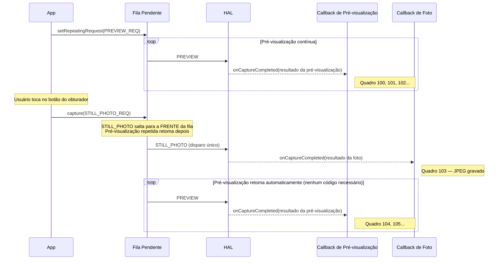
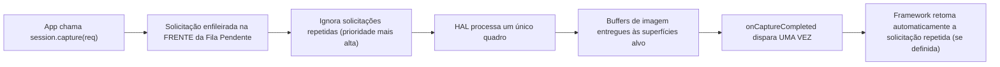
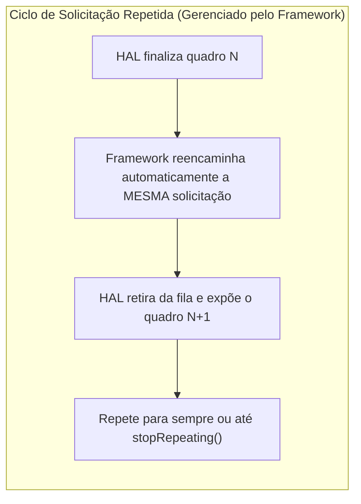
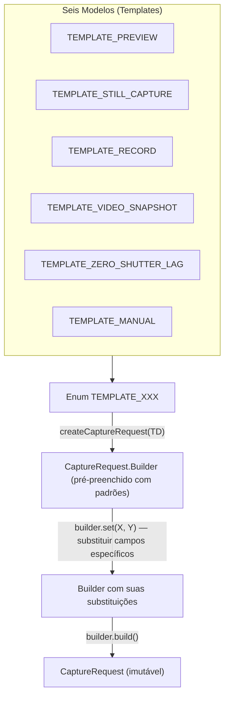

---
sidebar_position: 11
title: "Capítulo 11: Tipos de Captura"
description: Aprenda os três tipos de captura do Camera2 — disparo único (capture), sequencial (captureBurst) e repetida (setRepeatingRequest) — além de modelos integrados (TEMPLATE_PREVIEW, TEMPLATE_STILL_CAPTURE, TEMPLATE_RECORD e mais).
keywords: [tipos de captura Camera2, disparo único capture, captura burst, solicitação repetida, captureBurst, setRepeatingRequest, TEMPLATE_PREVIEW, TEMPLATE_STILL_CAPTURE, modelos de câmera]
---

## 11.1 Três Maneiras de Alimentar o Pipeline

No [Capítulo 10](the-camera2-pipeline.md), você viu como as solicitações viajam pelo pipeline do Camera2: da Fila Pendente para a Fila Em Voo, para o HAL, para o seu callback e superfícies de saída. Mas *como você envia* essas solicitações importa enormemente. O Camera2 oferece três mecanismos de envio, cada um com comportamento fundamentalmente diferente:

1. **Disparo único** (`capture()`) — executa uma única solicitação uma vez
2. **Sequencial / Burst** (`captureBurst()`) — executa uma lista de solicitações de forma contígua, uma após a outra
3. **Repetida** (`setRepeatingRequest()`) — executa a mesma solicitação continuamente para sempre (ou até ser interrompida)

Além desses três modos de envio, o framework fornece seis **modelos (templates) de captura** que pré-configuram um `CaptureRequest.Builder` com padrões sensatos para casos de uso comuns (pré-visualização, captura de foto, gravação de vídeo, zero-shutter-lag, controle manual, etc.).

Ao final deste capítulo, você saberá exatamente quando usar cada tipo e modelo de captura — incluindo por que a pré-visualização sempre usa solicitações repetidas, por que a captura sequencial é a única maneira de fazer bracketing de exposição e por que as fotos estáticas usam disparo único mesmo quando uma pré-visualização está rodando.

O aplicativo Android Camera Parameters ([GitHub](https://github.com/zoozooll/AndroidCameraParameters), [Play Store](https://play.google.com/store/apps/details?id=com.minininja.cameraparams)) demonstra todos os três tipos de captura em sua aba **Capture Demo**. Alterne entre os modos "Preview (Repetida)", "Foto Única (Disparo Único)" e "Burst (3 Quadros)" para ver as diferenças de comportamento de callback e tempo ao vivo no seu dispositivo.

## 11.2 Disparo Único: capture()

O modo de envio mais simples é a **captura de disparo único** via `CameraCaptureSession.capture()`. Ele faz exatamente o que promete: envia uma única `CaptureRequest` ao pipeline, executa-a exatamente uma vez e termina.

```kotlin
// Disparo único: capturar um único quadro estático para o ImageReader JPEG
fun captureStillPhoto() {
    val builder = cameraDevice.createCaptureRequest(CameraDevice.TEMPLATE_STILL_CAPTURE)
    builder.addTarget(jpegReader.surface)
    builder.set(CaptureRequest.JPEG_QUALITY, 100)
    builder.set(CaptureRequest.CONTROL_AF_MODE, CaptureRequest.CONTROL_AF_MODE_CONTINUOUS_PICTURE)
    builder.set(CaptureRequest.CONTROL_AE_MODE, CaptureRequest.CONTROL_AE_MODE_ON)

    val request = builder.build()

    captureSession.capture(request, object : CameraCaptureSession.CaptureCallback() {
        override fun onCaptureCompleted(
            session: CameraCaptureSession,
            request: CaptureRequest,
            result: TotalCaptureResult
        ) {
            super.onCaptureCompleted(session, request, result)
            Log.d("Capture", "Foto de disparo único concluída. Quadro #${result.frameNumber}")
        }
    }, backgroundHandler)
}
```

### Quando Usar Disparo Único

| Caso de Uso | Por que Disparo Único? |
|----------|--------------|
| Única fotografia estática | Executar exatamente uma vez por clique no obturador |
| Gatilho único de AF/AE | Disparar `CONTROL_AF_TRIGGER_START` para um evento de toque para focar |
| Instantâneo durante vídeo | Capturar um quadro de alta resolução enquanto uma solicitação de vídeo repetida está ativa |
| Capturar um único quadro RAW | Captura dupla RAW + JPEG para uma foto |

### Como o Disparo Único Interage com a Pré-visualização Repetida

Um padrão de design crítico no Camera2 é: **a pré-visualização roda como uma solicitação repetida e as fotos estáticas são injetadas como solicitações de disparo único**. O disparo único salta para a frente da solicitação repetida na Fila Pendente (como discutimos no modelo de fila do Capítulo 10), portanto, ele é executado imediatamente. Após a conclusão do disparo único, o framework retoma automaticamente a solicitação de pré-visualização repetida — você não precisa reenviá-la.



:::tip
Esse comportamento de retomada automática está incorporado ao framework do Camera2. Você nunca precisa "reiniciar a pré-visualização" manualmente após uma captura de disparo único — o framework reencaminha a solicitação repetida para você.
:::

### Fluxo de Execução de Disparo Único



## 11.3 Sequencial / Burst: captureBurst()

Onde o `capture()` envia uma solicitação, o `captureBurst()` envia uma **`List<CaptureRequest>`** e garante que todos os N quadros na lista sejam executados **de forma contígua e em ordem, sem quadros intercalados de outras fontes (incluindo a solicitação repetida)**.

Essa garantia atômica e sem lacunas é o que torna a captura burst essencial para:

- **Bracketing de exposição** — Capturar de 3 a 5 quadros a ±1EV, ±2EV e, em seguida, mesclá-los em HDR.
- **Bracketing de foco** — Varre as distâncias de foco e, em seguida, empilha para efeitos de profundidade de campo.
- **Captura de ação / movimento** — Tira de 10 a 30 quadros de um assunto em movimento rápido e, em seguida, escolhe o mais nítido.
- **Vídeo em câmera lenta (alta velocidade)** — `createHighSpeedRequestList()` + burst de captura de alta velocidade restrita.
- **Amostragem de convergência 3A** — Dispara o gatilho de AF/AE e, em seguida, faz o burst até convergir.

```kotlin
// Burst: bracketing de exposição de 3 quadros (-2EV, 0EV, +2EV)
fun captureExposureBracket() {
    val baseIso = 100
    val baseExposure = 10_000_000L  // 10ms = linha de base "0EV"

    val burstList: MutableList<CaptureRequest> = mutableListOf()

    // Quadro 0: -2EV (exposição 4x mais curta = mais escura)
    burstList += cameraDevice.createCaptureRequest(CameraDevice.TEMPLATE_STILL_CAPTURE).apply {
        addTarget(jpegReader.surface)
        set(CaptureRequest.SENSOR_SENSITIVITY, baseIso)
        set(CaptureRequest.SENSOR_EXPOSURE_TIME, baseExposure / 4)
        set(CaptureRequest.CONTROL_AE_MODE, CaptureRequest.CONTROL_AE_MODE_OFF)
    }.build()

    // Quadro 1: 0EV (exposição correta)
    burstList += cameraDevice.createCaptureRequest(CameraDevice.TEMPLATE_STILL_CAPTURE).apply {
        addTarget(jpegReader.surface)
        set(CaptureRequest.SENSOR_SENSITIVITY, baseIso)
        set(CaptureRequest.SENSOR_EXPOSURE_TIME, baseExposure)
        set(CaptureRequest.CONTROL_AE_MODE, CaptureRequest.CONTROL_AE_MODE_OFF)
    }.build()

    // Quadro 2: +2EV (exposição 4x mais longa = mais brilhante)
    burstList += cameraDevice.createCaptureRequest(CameraDevice.TEMPLATE_STILL_CAPTURE).apply {
        addTarget(jpegReader.surface)
        set(CaptureRequest.SENSOR_SENSITIVITY, baseIso)
        set(CaptureRequest.SENSOR_EXPOSURE_TIME, baseExposure * 4)
        set(CaptureRequest.CONTROL_AE_MODE, CaptureRequest.CONTROL_AE_MODE_OFF)
    }.build()

    captureSession.captureBurst(burstList, object : CameraCaptureSession.CaptureCallback() {
        private var completedCount = 0

        override fun onCaptureCompleted(
            session: CameraCaptureSession,
            request: CaptureRequest,
            result: TotalCaptureResult
        ) {
            super.onCaptureCompleted(session, request, result)
            completedCount++
            Log.d("Burst", "Quadro burst $completedCount/${burstList.size} concluído. Quadro #${result.frameNumber}")

            if (completedCount == burstList.size) {
                Log.d("Burst", "Todos os ${burstList.size} quadros do bracketing foram capturados!")
                // TODO: Mesclar HDR, empilhar foco ou deixar o usuário escolher o melhor quadro
            }
        }
    }, backgroundHandler)
}
```

### A Garantia Contígua em Ação

A propriedade principal do burst é que **toda a lista é enfileirada atomicamente** — mesmo que um `setRepeatingRequest()` esteja ativo, todos os N quadros do burst serão executados em sequência antes que a solicitação repetida seja retomada. A solicitação repetida não é intercalada entre os quadros do burst.

```mermaid
flowchart TB
    subgraph QueueBefore ["Antes do Envio do Burst"]
        direction LR
        R1["PREVIEW (repetida)"] --> R2["PREVIEW (repetida)"] --> R3["PREVIEW (repetida)"]
    end

    subgraph Arrow ["app chama captureBurst([B1,B2,B3])"]
        style Arrow fill:#fff3e0
    end

    subgraph QueueAfter ["Após o Envio do Burst (enfileiramento atômico)"]
        direction LR
        B1["QUADRO BURST 1"] --> B2["QUADRO BURST 2"] --> B3["QUADRO BURST 3"] --> R4["Retoma PREVIEW (repetida)"] --> R5["PREVIEW"]
    end

    QueueBefore --> Arrow --> QueueAfter

    Note over B1,B3: Nenhum quadro de pré-visualização se intromete entre eles!
```

### Limites de Tamanho do Burst

O tamanho máximo do burst que você pode enviar em uma única chamada `captureBurst()` é determinado por:
- `CameraCharacteristics.REQUEST_MAX_NUM_OUTPUT_RAW` — para saídas RAW
- `CameraCharacteristics.REQUEST_MAX_NUM_OUTPUT_PROC` — para saídas processadas (YUV/JPEG)
- Largura de banda prática do hardware (bursts em 4K serão mais curtos que bursts em 1080p)

Para dispositivos FULL típicos, bursts de JPEG processado de 10 a 50 quadros funcionam bem. Bursts em RAW podem ser limitados a 5-10 quadros, dependendo do sensor e da memória.

### Burst de Alta Velocidade para Câmera Lenta

Para vídeo em câmera lenta, o Camera2 fornece `CameraDevice.createHighSpeedRequestList()`, que converte uma `CaptureRequest` normal em uma lista de solicitações burst adequadas para vídeo de captura restrita e alta velocidade (ex: 120fps ou 240fps). Isso é emparelhado com `CameraCaptureSession.captureBurst()` e requer a capacidade `CONSTRAINED_HIGH_SPEED_VIDEO`:

```kotlin
// Burst: Câmera lenta de alta velocidade (120fps)
fun captureHighSpeedSlowMo() {
    val capabilities = characteristics.get(CameraCharacteristics.REQUEST_AVAILABLE_CAPABILITIES)
    val supportsHighSpeed = capabilities?.contains(
        CameraCharacteristics.REQUEST_AVAILABLE_CAPABILITIES_CONSTRAINED_HIGH_SPEED_VIDEO
    ) ?: false

    if (!supportsHighSpeed) {
        Log.w("HighSpeed", "O dispositivo não suporta vídeo de alta velocidade restrita")
        return
    }

    // Criar uma única solicitação base (visando a superfície do MediaRecorder)
    val baseBuilder = cameraDevice.createCaptureRequest(CameraDevice.TEMPLATE_RECORD)
    baseBuilder.addTarget(mediaRecorderSurface)
    val baseRequest = baseBuilder.build()

    // Expandir para lista burst de alta velocidade — o framework otimiza para 120fps
    val highSpeedBurst = cameraDevice.createHighSpeedRequestList(listOf(baseRequest))

    // Enviar a lista burst otimizada via captureBurst
    captureSession.captureBurst(highSpeedBurst, highSpeedCallback, backgroundHandler)
}
```

## 11.4 Repetida: setRepeatingRequest()

A base de trabalho do Camera2 é a **solicitação repetida**, enviada via `CameraCaptureSession.setRepeatingRequest()`. Em vez de ser executada uma vez, o framework reencaminha *a mesma solicitação* após cada quadro, para sempre — produzindo um fluxo contínuo de quadros na taxa de quadros nativa do hardware.

```kotlin
// Repetida: Iniciar pré-visualização da câmera (fluxo contínuo de 30fps)
fun startPreview() {
    val builder = cameraDevice.createCaptureRequest(CameraDevice.TEMPLATE_PREVIEW)
    builder.addTarget(previewSurface)
    builder.set(CaptureRequest.CONTROL_AF_MODE, CaptureRequest.CONTROL_AF_MODE_CONTINUOUS_PICTURE)
    builder.set(CaptureRequest.CONTROL_AE_MODE, CaptureRequest.CONTROL_AE_MODE_ON)
    builder.set(CaptureRequest.CONTROL_AWB_MODE, CaptureRequest.CONTROL_AWB_MODE_AUTO)

    val repeatingRequest = builder.build()

    captureSession.setRepeatingRequest(
        repeatingRequest,
        object : CameraCaptureSession.CaptureCallback() {
            private var frameCount = 0
            private var lastFpsLogMs = 0L

            override fun onCaptureCompleted(
                session: CameraCaptureSession,
                request: CaptureRequest,
                result: TotalCaptureResult
            ) {
                super.onCaptureCompleted(session, request, result)
                frameCount++
                val now = System.currentTimeMillis()
                if (now - lastFpsLogMs > 1000) {
                    Log.d("Preview", "FPS da Pré-visualização: $frameCount")
                    frameCount = 0
                    lastFpsLogMs = now
                }
            }
        },
        backgroundHandler
    )
}
```

### Por que a Pré-visualização *Deve* Usar Solicitações Repetidas

Se você tentasse implementar uma pré-visualização de 30fps usando o `capture()` chamado 30 vezes por segundo a partir de um timer, você:
1. Desperdiçaria CPU reenviando solicitações idênticas a cada 33ms.
2. Acumularia atraso se seu timer estivesse atrasado.
3. Teria lacunas entre os quadros se os callbacks de disparo único bloqueassem.
4. Lutaria com o gerenciamento de fila do framework.

A solicitação repetida é gerenciada inteiramente dentro do framework/HAL. Após a conclusão de cada quadro, o HAL agenda automaticamente a próxima exposição — sem envolvimento da thread do app. Isso produz uma pré-visualização suave e sem lacunas com zero sobrecarga de CPU do app.



### Parando Solicitações Repetidas

Para parar o fluxo repetido, chame `stopRepeating()`. Isso remove a solicitação repetida da fila, mas não descarta os quadros que já estão "em voo". Chame `abortCaptures()` para descartar tudo à força (e disparar `onCaptureFailed` com `REASON_FLUSHED` para os quadros em voo).

```kotlin
// Pausar temporariamente a pré-visualização
fun pausePreview() {
    captureSession.stopRepeating()
    Log.d("Preview", "Repetição parada. Quadros em voo ainda serão concluídos.")
}

// Parada de emergência — descarte tudo agora mesmo
fun emergencyStopAllCaptures() {
    captureSession.stopRepeating()
    captureSession.abortCaptures()
    // Todos os quadros em voo falharão com REASON_FLUSHED
}
```

### Solicitações Repetidas Também São para Gravação de Vídeo

Além da pré-visualização, as solicitações repetidas são usadas para **gravação de vídeo** (visando uma `Surface` de `MediaRecorder` ou `MediaCodec`) e **análise contínua de imagem** (visando um `ImageReader` YUV de baixa resolução para detecção de rostos, inferência de ML, etc.).

O padrão é sempre o mesmo: configure uma vez, deixe fluir, atualize os parâmetros da solicitação quando desejar alterar as configurações (ex: alterar o zoom digital no meio do fluxo atualizando a região de corte em uma nova solicitação repetida).

```kotlin
// Repetida: Atualizar o nível de zoom ao vivo durante a pré-visualização/vídeo
fun updateDigitalZoom(cropRegion: Rect) {
    val builder = cameraDevice.createCaptureRequest(CameraDevice.TEMPLATE_PREVIEW)
    builder.addTarget(previewSurface)
    builder.addTarget(mediaRecorderSurface)
    builder.set(CaptureRequest.SCALER_CROP_REGION, cropRegion)
    builder.set(CaptureRequest.CONTROL_AF_MODE, CaptureRequest.CONTROL_AF_MODE_CONTINUOUS_PICTURE)

    // Substituir a solicitação repetida antiga por uma nova (mesmos alvos, novo corte)
    captureSession.setRepeatingRequest(builder.build(), currentCallback, backgroundHandler)
    Log.d("Zoom", "Solicitação repetida atualizada com corte ${cropRegion.width()}x${cropRegion.height()}")
}
```

## 11.5 Modelos de Captura (Templates)

Cada `CaptureRequest.Builder` começa a partir de um **modelo (template)**: você chama `cameraDevice.createCaptureRequest(TEMPLATE_XXX)` e o framework preenche o construtor com padrões otimizados de hardware para esse caso de uso. Você então substitui apenas as configurações específicas que precisa.

Os modelos existem porque o pipeline de câmera de um telefone possui dezenas de controles (intensidade da redução de ruído, aprimoramento de bordas, curva de tom, modo anti-banding, faixa de taxa de quadros, ...). Os modelos definem linhas de base sensatas para que você não precise configurar cada uma delas do zero.



### Os Seis Modelos, O Que Eles Pré-configuram e Quando Usá-los

| Modelo | Caso de Uso | Principais Configurações Pré-configuradas |
|----------|----------|---------------------------|
| `TEMPLATE_PREVIEW` | Viewfinder / pré-visualização ao vivo | Prioridade para baixa latência, 3A (AF/AE/AWB) em automático contínuo, NR/nitidez modestos, alta taxa de quadros (30fps). Sacrifica qualidade mínima por suavidade. |
| `TEMPLATE_STILL_CAPTURE` | Foto de disparo único | Prioridade para qualidade máxima, AF em modo de foto, NR/nitidez totais, codificação JPEG de alta qualidade, pode baixar a taxa de quadros para melhorar a qualidade daquele quadro único. |
| `TEMPLATE_RECORD` | Gravação de vídeo | Taxa de quadros estável (corresponde à saída do MediaRecorder), AF contínuo, timestamps de sincronização de áudio-vídeo, anti-banding ativado, NR médio — ajustado para movimento + compressão. |
| `TEMPLATE_VIDEO_SNAPSHOT` | Foto de alta resolução *durante* gravação de vídeo | Como o STILL_CAPTURE, mas preserva as configurações do quadro de vídeo — captura uma foto de alta resolução sem parar o fluxo de gravação de vídeo. |
| `TEMPLATE_ZERO_SHUTTER_LAG` | Captura ZSL (Capítulo 14) | Constrói um buffer circular de quadros recentes. Quando o obturador é pressionado, um quadro *passado* é retornado para atraso zero. Requer capacidade de burst e reprocessamento privado. |
| `TEMPLATE_MANUAL` | Controles manuais / pro | Todos os modos 3A definidos como OFF por padrão para que você possa definir manualmente a exposição do sensor, ISO, foco da lente e ganhos de correção de cor sem interferência. Base para uma UI de câmera pro. |

```kotlin
// Exemplos de modelos — veja o que acontece ao começar com cada um

// TEMPLATE_PREVIEW — suave, baixa latência
val previewBuilder = cameraDevice.createCaptureRequest(CameraDevice.TEMPLATE_PREVIEW)
val previewRequest = previewBuilder.build()
Log.d("Template", "PREVIEW AF_MODE = ${previewRequest.get(CaptureRequest.CONTROL_AF_MODE)}")
// ^ Normalmente CONTROL_AF_MODE_CONTINUOUS_PICTURE (sempre refocando)

// TEMPLATE_STILL_CAPTURE — qualidade máxima por quadro
val stillBuilder = cameraDevice.createCaptureRequest(CameraDevice.TEMPLATE_STILL_CAPTURE)
val stillRequest = stillBuilder.build()
Log.d("Template", "STILL_CAPTURE JPEG_QUALITY = ${stillRequest.get(CaptureRequest.JPEG_QUALITY)}")
// ^ Normalmente 100 (codificação de qualidade máxima)

// TEMPLATE_MANUAL — todos os controles automáticos desativados
val manualBuilder = cameraDevice.createCaptureRequest(CameraDevice.TEMPLATE_MANUAL)
val manualRequest = manualBuilder.build()
Log.d("Template", "MANUAL AE_MODE = ${manualRequest.get(CaptureRequest.CONTROL_AE_MODE)}")
Log.d("Template", "MANUAL AF_MODE = ${manualRequest.get(CaptureRequest.CONTROL_AF_MODE)}")
Log.d("Template", "MANUAL AWB_MODE = ${manualRequest.get(CaptureRequest.CONTROL_AWB_MODE)}")
// ^ Normalmente AE_MODE_OFF, AF_MODE_OFF, AWB_MODE_OFF — manual desde o início
```

:::tip
Sempre comece com um modelo e substitua campos específicos. Começar com `TEMPLATE_PREVIEW` e então substituir de 2 a 3 configurações (ex: região de corte para zoom, viés de AE para compensação de exposição) é massivamente menos propenso a erros do que criar uma solicitação a partir de um modelo vazio (o que nem é possível — cada `createCaptureRequest` requer um modelo).
:::

## 11.6 Comparando os Três Tipos de Captura

| Dimensão | Disparo Único `capture()` | Burst `captureBurst()` | Repetida `setRepeatingRequest()` |
|-----------|---------------------|----------------------|---------------------------------|
| **Execução** | Uma única solicitação roda uma vez | Uma lista de N solicitações roda de forma contígua | A mesma solicitação roda a cada quadro (reencaminhada automaticamente) |
| **Prioridade** | Mais alta — salta para a FRENTE da Fila Pendente | Alta — todos os N quadros inseridos atomicamente na FRENTE | Mais baixa — disparo único/burst interrompem a repetição, que retoma depois |
| **Interrupção** | Interrompe a repetição; a repetição retoma depois | Interrompe a repetição; todo o burst termina antes que a repetição retome | Interrompida por qualquer disparo único ou burst; retoma automaticamente depois |
| **Comportamento da Fila** | Uma única solicitação enfileirada | N solicitações enfileiradas de forma contígua (sem lacunas) | Uma solicitação conceitual reencaminhada a cada ciclo |
| **Usos Típicos** | Foto única, gatilho único de AF, foto com flash | Bracketing de exposição, empilhamento de foco, sequência de ação, câmera lenta, HDR | Pré-visualização, gravação de vídeo, análise de ML contínua, detecção facial ao vivo |
| **Callback de Resultado** | `onCaptureCompleted` dispara exatamente uma vez | `onCaptureCompleted` dispara N vezes (uma vez por quadro do burst) | `onCaptureCompleted` dispara continuamente para cada quadro (30-60x/seg) |

```mermaid
quadrantChart
    title Padrões de Uso dos Tipos de Captura
    x-axis ["Baixa Contagem de Quadros", "Alta Contagem de Quadros"]
    y-axis ["Configuração Única", "Configuração Variável por Quadro"]
    quadrant-1 ["Burst: Bracketing de Exposição / Foco"]
    quadrant-2 ["Burst: Câmera Lenta de Alta Velocidade"]
    quadrant-3 ["Disparo Único: Foto Estática"]
    quadrant-4 ["Repetida: Pré-visualização + Vídeo"]
    "Captura única JPEG": [0.15, 0.2]
    "Gatilho de toque para focar": [0.1, 0.15]
    "Bracket HDR de 3 quadros": [0.4, 0.75]
    "Empilhamento de foco de 7 quadros": [0.45, 0.8]
    "Câmera lenta 120fps 2seg": [0.85, 0.25]
    "Pré-visualização 30fps": [0.9, 0.1]
    "Gravação de vídeo 4K": [0.88, 0.18]
```

## 11.7 Vendo os Tipos de Captura no App Android Camera Parameters

Abra o aplicativo Android Camera Parameters ([GitHub](https://github.com/zoozooll/AndroidCameraParameters), [Play Store](https://play.google.com/store/apps/details?id=com.minininja.cameraparams)) e navegue até a aba **Capture Demo**. O aplicativo expõe os três tipos de captura lado a lado:

- Toque em **Start Preview** para chamar `setRepeatingRequest(TEMPLATE_PREVIEW)` e ver um log do `CaptureCallback` ao vivo (quadros 1, 2, 3, ... rolando a cada ~33ms).
- Toque em **Take Photo** para injetar uma solicitação única de `capture(TEMPLATE_STILL_CAPTURE)` enquanto a pré-visualização está rodando. Você verá a contagem do callback pausar brevemente para o quadro de alta qualidade e retomar perfeitamente assim que a repetição for reiniciada automaticamente.
- Toque em **Burst 5 Frames** para chamar `captureBurst(List<CaptureRequest(5)>)`. Observe que exatamente 5 quadros são concluídos um após o outro antes que a rolagem da pré-visualização continue — provando a garantia contígua.

Você também pode inspecionar `REQUEST_MAX_NUM_OUTPUT_RAW` e `REQUEST_MAX_NUM_OUTPUT_PROC` na aba **Raw JSON** para ver os limites de tamanho de burst do seu dispositivo.

## 11.8 Resumo

| Conceito | Conclusão Principal |
|---------|-------------|
| **Disparo único `capture()`** | Solicitação única, roda uma vez, prioridade mais alta. Para fotos estáticas, gatilhos de AF. Retoma a repetição automaticamente depois. |
| **Burst `captureBurst()`** | Lista de solicitações roda de forma contígua, sem intercalação. Para bracketing, movimento, câmera lenta. Toda a lista salta na fila atomicamente. |
| **Repetida `setRepeatingRequest()`** | Uma solicitação flui continuamente. O framework reencaminha automaticamente. Para pré-visualização, vídeo, análise. Prioridade mais baixa. |
| **Modelos (Templates)** | Seis linhas de base preenchem o Builder com padrões. Comece com PREVIEW/STILL_CAPTURE/RECORD/ZSL/MANUAL e substitua apenas o que for necessário. |
| **Regras de interrupção** | O disparo único e o burst *sempre* têm precedência sobre a repetição. A repetição retoma automaticamente depois. Quadros de burst nunca são divididos. |

## O Que Vem a Seguir

No [Capítulo 12: Mergulho Profundo no CameraCharacteristics](cameracharacteristics-deep-dive.md), exploraremos o objeto de metadados estáticos que descreve *o que sua câmera pode fazer* antes mesmo de você abri-la. Analisaremos os níveis de hardware (LEGACY → LIMITED → FULL → LEVEL_3 → EXTERNAL), o sistema de flags de capacidade (MANUAL_SENSOR, RAW, DEPTH_OUTPUT, etc.) e como consultar tudo isso em tempo de execução para escrever aplicativos que funcionem em mais de 10.000 modelos de dispositivos Android.
