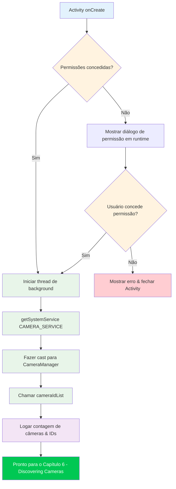

Bem-vindo à parte prática da série de tutoriais Camera2. Nos capítulos anteriores, você aprendeu sobre o hardware da câmera do smartphone e os fundamentos teóricos da API Camera2. Agora é hora de arregaçar as mangas e escrever código real. Ao final deste capítulo, você terá um projeto Android funcional que inicializa com sucesso a API Camera2 e acessa o serviço CameraManager — o primeiro passo crítico antes de poder enumerar câmeras, abrir dispositivos ou mostrar previews.

Se você quer ver um exemplo de produção de tudo que construiremos nesta série, confira o app **Android Camera Parameters** no [GitHub](https://github.com/zoozooll/AndroidCameraParameters) e no [Google Play](https://play.google.com/store/apps/details?id=com.minininja.cameraparams). Ele demonstra uso avançado de Camera2 incluindo enumeração completa de CameraCharacteristics, controles de captura manual e suporte a múltiplas câmeras.

## Por que começar com a configuração do projeto?

Antes que você possa escrever uma única linha de código Camera2, seu aplicativo deve estar corretamente configurado. Camera2 é uma API de baixo nível sensível à performance, e cortar caminhos na configuração levará a crashes misteriosos, ANRs (Application Not Responding) ou frames que nunca chegam. Os três pilares de uma configuração correta de projeto Camera2 são:

1. **Permissões** — O framework Android restringe o acesso à câmera tanto no momento da instalação (manifest) quanto em runtime (consentimento do usuário).
2. **Arquitetura de Threading** — Callbacks do Camera2 nunca devem bloquear a thread principal; precisamos de uma thread dedicada em background.
3. **Configuração de View** — Se você planeja usar TextureView para preview (a abordagem recomendada), a aceleração de hardware deve estar ativada.

Vamos lidar com cada um sistematicamente.

## Passo 1: Criando um novo projeto Android Studio

Inicie o Android Studio e crie um novo projeto. Para esta série de tutoriais, recomendamos:

- **Template**: Empty Activity (o ponto de partida mais simples)
- **Linguagem**: Kotlin (o padrão moderno para desenvolvimento Android; todos os exemplos desta série são em Kotlin)
- **SDK mínimo**: API 21 (Lollipop) — este é o primeiro nível de SDK que suporta Camera2 nativamente. Se você precisa suportar câmeras USB externas via OTG, direcione para API 23 ou superior. Se você precisa de suporte a Scoped Storage para salvar fotos (Capítulo 9), API 29+ é relevante, mas lidaremos com a compatibilidade retroativa lá.
- **Linguagem de configuração de build**: Kotlin DSL ou Groovy — ambos funcionam; nossos exemplos serão agnósticos ao sistema de build.

Após o projeto ser gerado, abra seu arquivo `build.gradle` no nível do módulo (ou `build.gradle.kts`). O template Empty Activity padrão inclui a maioria das dependências que você precisa, mas verifique se você tem no mínimo:

```kotlin
dependencies {
    implementation("androidx.core:core-ktx:1.12.0")
    implementation("androidx.appcompat:appcompat:1.6.1")
    implementation("com.google.android.material:material:1.11.0")
    implementation("androidx.constraintlayout:constraintlayout:2.1.4")
    // Camera2 faz parte do framework Android, então NÃO é necessária nenhuma dependência extra
    // para a API básica. androidx.camera.camera2 é apenas para interop com CameraX.
}
```

:::tip
Você **não** precisa adicionar nenhuma dependência externa de Camera2. Todo o pacote `android.hardware.camera2` faz parte do framework Android. A biblioteca Jetpack CameraX é uma abstração de nível superior separada construída sobre o Camera2; estamos **usando a API Camera2 nativa diretamente** neste tutorial.
:::

## Passo 2: Declarando permissões no AndroidManifest.xml

Todo aplicativo de câmera deve declarar a permissão `CAMERA` no `AndroidManifest.xml`. Isso diz ao Google Play Store que seu app usa o hardware de câmera, e ativa o diálogo de permissão em runtime no Android 6.0 (API 23) e superior.

Abra `app/src/main/AndroidManifest.xml` e adicione os elementos a seguir **como filhos da tag raiz `<manifest>`** (não dentro de `<application>`):

```xml
<?xml version="1.0" encoding="utf-8"?>
<manifest xmlns:android="http://schemas.android.com/apk/res/android"
    xmlns:tools="http://schemas.android.com/tools">

    <!-- ✅ Declaração de permissão de câmera -->
    <uses-permission android:name="android.permission.CAMERA" />

    <!-- Declarações de feature opcionais (usadas pela filtragem do Google Play) -->
    <uses-feature
        android:name="android.hardware.camera"
        android:required="true" />
    <uses-feature
        android:name="android.hardware.camera.autofocus"
        android:required="false" />

    <application
        android:allowBackup="true"
        ...>
        <activity
            android:name=".MainActivity"
            android:exported="true"
            android:hardwareAccelerated="true">
            ...
        </activity>
    </application>
</manifest>
```

Vamos detalhar as partes importantes:

### `<uses-permission android:name="android.permission.CAMERA" />`

Esta é a permissão principal. Sem ela, qualquer chamada ao serviço de câmera lançará uma `SecurityException`. No API 22 e inferior, os usuários a concedem no momento da instalação; no API 23+, você também deve solicitá-la em runtime (visto a seguir).

### `<uses-feature android:name="android.hardware.camera" android:required="true" />`

Esta declaração diz ao Google Play para filtrar seu app para dispositivos que têm pelo menos uma câmera. Defina `android:required="false"` se seu app pode funcionar sem câmera (por exemplo, um app de galeria com captura opcional). Se você não declarar isso de forma alguma, o Google Play assume que a câmera **não** é necessária, o que pode instalar seu app em dispositivos sem câmera.

### `android:hardwareAccelerated="true"` na `<activity>`

Isso é **crítico** para a renderização do preview TextureView. TextureView usa o pipeline de composição da GPU para exibir frames da câmera de forma eficiente. Sem aceleração de hardware ativada no nível de Activity ou Application, TextureView falhará silenciosamente em renderizar ou exibirá uma tela preta. O padrão no Android moderno é `true` para todo o aplicativo, mas é uma boa prática declará-lo explicitamente em qualquer Activity que hospede um TextureView.

## Passo 3: Solicitação de permissão em runtime

No Android 6.0 (Marshmallow, API 23) e posterior, declarar a permissão no manifest é apenas metade da história. Você também deve **explicitamente pedir permissão ao usuário** em runtime, usando a biblioteca Activity Compat. O padrão padrão é:

1. Verifique se a permissão já foi concedida com `ContextCompat.checkSelfPermission`.
2. Se concedida, prossiga para a inicialização da câmera.
3. Se não concedida, chame `ActivityCompat.requestPermissions` para mostrar o diálogo do sistema.
4. Lidere o resultado em `onRequestPermissionsResult`.

Aqui está o fluxo completo de permissão em `MainActivity.kt`:

```kotlin
package com.example.camera2tutorial

import android.Manifest
import android.content.pm.PackageManager
import android.os.Bundle
import android.widget.Toast
import androidx.appcompat.app.AppCompatActivity
import androidx.core.app.ActivityCompat
import androidx.core.content.ContextCompat

class MainActivity : AppCompatActivity() {

    override fun onCreate(savedInstanceState: Bundle?) {
        super.onCreate(savedInstanceState)
        setContentView(R.layout.activity_main)

        if (allPermissionsGranted()) {
            initializeCamera()
        } else {
            ActivityCompat.requestPermissions(
                this,
                REQUIRED_PERMISSIONS,
                REQUEST_CODE_PERMISSIONS
            )
        }
    }

    private fun allPermissionsGranted() = REQUIRED_PERMISSIONS.all {
        ContextCompat.checkSelfPermission(baseContext, it) == PackageManager.PERMISSION_GRANTED
    }

    override fun onRequestPermissionsResult(
        requestCode: Int,
        permissions: Array<out String>,
        grantResults: IntArray
    ) {
        super.onRequestPermissionsResult(requestCode, permissions, grantResults)
        if (requestCode == REQUEST_CODE_PERMISSIONS) {
            if (allPermissionsGranted()) {
                initializeCamera()
            } else {
                Toast.makeText(
                    this,
                    "A permissão de câmera é necessária para usar este app.",
                    Toast.LENGTH_LONG
                ).show()
                finish()
            }
        }
    }

    private fun initializeCamera() {
        // TODO: Implementaremos este método nas seções abaixo.
        // É aqui que a configuração do CameraManager acontecerá.
        // Por enquanto, apenas loga o sucesso.
        android.util.Log.d(TAG, "Permissões concedidas. Pronto para inicializar a câmera.")
    }

    companion object {
        private const val TAG = "Camera2Tutorial"
        private const val REQUEST_CODE_PERMISSIONS = 10
        private val REQUIRED_PERMISSIONS = arrayOf(Manifest.permission.CAMERA)
    }
}
```

### Por que `allPermissionsGranted()` usa um padrão de array

Mesmo que só precisemos de `CAMERA` agora, definir um array `REQUIRED_PERMISSIONS` torna trivial adicionar permissões adicionais depois (como `WRITE_EXTERNAL_STORAGE` para salvamento de fotos legado, ou `RECORD_AUDIO` para vídeo). A função `all { ... }` verifica que **todas** as permissões no array estão concedidas antes de prosseguir.

## Passo 4: A thread de background (HandlerThread)

Este é o detalhe mais comumente perdido em código Camera2 de iniciantes, e causa **bugs aleatórios e difíceis de reproduzir**. Vamos entender por que o Camera2 precisa de uma thread de background, depois implementá-lo corretamente.

### Por que o Camera2 NÃO DEVE rodar na thread principal

A thread principal (UI) do Android é responsável por:
- Desenhar a UI a 60-120 FPS
- Lidar com eventos de toque do usuário
- Despachar callbacks de lifecycle
- Executar todo o código de Activity/Fragment por padrão

A API Camera2 entrega vários callbacks críticos de forma síncrona:
- `CameraDevice.StateCallback` — quando uma câmera abre, desconecta ou tem erro
- `CameraCaptureSession.StateCallback` — quando uma sessão de captura é configurada
- `CameraCaptureSession.CaptureCallback` — para cada frame (até 60+ vezes por segundo!)

Se esses callbacks rodarem na thread principal, duas coisas catastróficas acontecem:

1. **Jank e frames descartados**: Se processar um callback levar mesmo 10ms, um frame de 60FPS é pulado, e o usuário vê stutter.
2. **Deadlocks e ANRs**: Alguns métodos Camera2 (como `close()`) são síncronos e esperam por callbacks. Se o callback tiver que rodar na mesma thread que chamou `close()`, você tem um deadlock.

A solução é uma **thread dedicada de background** com seu próprio Looper, implementada via `HandlerThread`.

### Implementando HandlerThread corretamente

O ciclo de vida da thread de background deve corresponder ao ciclo de vida das operações de câmera. Iniciamos a thread quando a Activity inicia/retoma, e saímos da thread quando a Activity para/pausa.

```kotlin
package com.example.camera2tutorial

import android.Manifest
import android.content.Context
import android.content.pm.PackageManager
import android.hardware.camera2.CameraManager
import android.os.Bundle
import android.os.Handler
import android.os.HandlerThread
import android.util.Log
import android.widget.Toast
import androidx.appcompat.app.AppCompatActivity
import androidx.core.app.ActivityCompat
import androidx.core.content.ContextCompat

class MainActivity : AppCompatActivity() {

    // --- Componentes de threading em background ---
    private lateinit var backgroundThread: HandlerThread
    private lateinit var backgroundHandler: Handler

    override fun onCreate(savedInstanceState: Bundle?) {
        super.onCreate(savedInstanceState)
        setContentView(R.layout.activity_main)

        if (allPermissionsGranted()) {
            initializeCamera()
        } else {
            ActivityCompat.requestPermissions(
                this,
                REQUIRED_PERMISSIONS,
                REQUEST_CODE_PERMISSIONS
            )
        }
    }

    override fun onResume() {
        super.onResume()
        startBackgroundThread()
        // Re-inicializa se as permissões foram concedidas enquanto o app estava em background
        if (allPermissionsGranted() && this::cameraManager.isInitialized) {
            // (cameraManager está declarado abaixo)
        }
    }

    override fun onPause() {
        stopBackgroundThread()
        super.onPause()
    }

    private fun startBackgroundThread() {
        backgroundThread = HandlerThread("Camera2Background").apply {
            start()
        }
        backgroundHandler = Handler(backgroundThread.looper)
        Log.d(TAG, "Thread de background iniciada: ${backgroundThread.name}")
    }

    private fun stopBackgroundThread() {
        backgroundThread.quitSafely()
        try {
            backgroundThread.join(1000) // Espera até 1 segundo para limpeza
            Log.d(TAG, "Thread de background parou de forma limpa")
        } catch (e: InterruptedException) {
            Log.e(TAG, "Interrompido enquanto aguardava a thread de background", e)
        }
    }

    // --- Inicialização do CameraManager ---
    private lateinit var cameraManager: CameraManager

    private fun initializeCamera() {
        cameraManager = getSystemService(Context.CAMERA_SERVICE) as CameraManager

        val cameraIdList = cameraManager.cameraIdList
        Log.d(TAG, "CameraManager acessado com sucesso. Encontrou ${cameraIdList.size} câmera(s).")
        cameraIdList.forEachIndexed { index, cameraId ->
            Log.d(TAG, "Câmera $index: ID = $cameraId")
        }

        Toast.makeText(
            this,
            "CameraManager inicializado! Encontrou ${cameraIdList.size} câmera(s).",
            Toast.LENGTH_LONG
        ).show()
    }

    // --- Manipulação de permissões (mesmo de antes) ---
    private fun allPermissionsGranted() = REQUIRED_PERMISSIONS.all {
        ContextCompat.checkSelfPermission(baseContext, it) == PackageManager.PERMISSION_GRANTED
    }

    override fun onRequestPermissionsResult(
        requestCode: Int,
        permissions: Array<out String>,
        grantResults: IntArray
    ) {
        super.onRequestPermissionsResult(requestCode, permissions, grantResults)
        if (requestCode == REQUEST_CODE_PERMISSIONS) {
            if (allPermissionsGranted()) {
                initializeCamera()
            } else {
                Toast.makeText(
                    this,
                    "A permissão de câmera é necessária para usar este app.",
                    Toast.LENGTH_LONG
                ).show()
                finish()
            }
        }
    }

    companion object {
        private const val TAG = "Camera2Tutorial"
        private const val REQUEST_CODE_PERMISSIONS = 10
        private val REQUIRED_PERMISSIONS = arrayOf(Manifest.permission.CAMERA)
    }
}
```

### Padrões chave de threading explicados

1. **`startBackgroundThread()` em `onResume()`**: Toda vez que a Activity vem para o foreground, criamos um novo `HandlerThread`, o iniciamos, e criamos um `Handler` vinculado ao `Looper` da thread. Este Handler será passado para todos os métodos Camera2 que aceitam callbacks (`openCamera`, `createCaptureSession`, etc.).

2. **`stopBackgroundThread()` em `onPause()`**: Antes de a Activity ir para o background, chamamos `quitSafely()` na thread. Isso diz ao Looper para parar de processar novas mensagens após a atual terminar (ao contrário de `quit()`, que descarta mensagens pendentes). Chamamos então `join(1000)` para bloquear a thread principal por no máximo um segundo enquanto a thread de background termina sua limpeza. Isso previne vazamentos de recursos.

3. **Por que `HandlerThread` em vez de `CoroutineDispatcher`?** Camera2 antecede Kotlin Coroutines em vários anos, e seu sistema de callbacks é fundamentalmente baseado em Handler/Looper. Embora você possa usar `Dispatchers.Default.asExecutor()` ou envolver callbacks em `suspendCoroutine` para código de nível superior, a API Camera2 subjacente ainda precisa de uma thread Looper para callbacks. Usar `HandlerThread` diretamente é a abordagem canônica documentada nas amostras oficiais do Android.

## Passo 5: O fluxo completo de inicialização (combinado)

Vamos agora olhar a sequência completa de eventos que deve acontecer quando seu aplicativo inicia. A ordem é crítica: permissões → thread → CameraManager. Se você inverter qualquer passo, o código vai crashar ou se comportar de forma inconsistente.



O fluxograma acima ilustra por que cada passo existe:

- **Portão de permissão**: Todo o subsistema de câmera é protegido; não podemos prosseguir até que o usuário conceda consentimento.
- **Thread antes do CameraManager**: Embora `getSystemService()` em si seja thread-safe, queremos que a thread de background já esteja rodando antes de realizarmos qualquer operação Camera2 dirigida por callbacks (que começa no próximo capítulo).
- **CameraManager → cameraIdList**: Chamar `cameraIdList` é a maneira mais barata de verificar que o CameraManager está funcionando. Se esta chamada tiver sucesso sem lançar exceção, sua declaração de manifest, permissão em runtime e binding de serviço estão todos corretos.

## Juntando tudo: execute e verifique

Neste ponto, você tem um projeto Camera2 completo e executável que:
1. Cria um projeto Android com os alvos de SDK corretos.
2. Declara a permissão CAMERA no manifest.
3. Solicita a permissão em runtime, tratando tanto o caminho de aceite quanto o de rejeição.
4. Inicia um HandlerThread dedicado em `onResume` e o para de forma limpa em `onPause`.
5. Recupera o serviço de sistema `CAMERA_SERVICE` e faz cast para `CameraManager`.
6. Chama `cameraIdList` e loga o número de câmeras e seus IDs.

### O que você deve ver ao executar

1. No primeiro lançamento, o Android mostra o diálogo de permissão: *"Permitir que o Camera2Tutorial tire fotos e grave vídeo?"*
2. Toque em **Permitir**.
3. Um Toast aparece: *"CameraManager inicializado! Encontrou X câmera(s)."*
4. No Logcat (filtre por `Camera2Tutorial`), você deve ver entradas como:
   ```
   D/Camera2Tutorial: Thread de background iniciada: Camera2Background
   D/Camera2Tutorial: CameraManager acessado com sucesso. Encontrou 4 câmera(s).
   D/Camera2Tutorial: Câmera 0: ID = 0
   D/Camera2Tutorial: Câmera 1: ID = 1
   D/Camera2Tutorial: Câmera 2: ID = 2
   D/Camera2Tutorial: Câmera 3: ID = 3
   ```
5. Quando você pressiona o botão Home ou navega para outro lugar, o Logcat mostra:
   ```
   D/Camera2Tutorial: Thread de background parou de forma limpa
   ```

Se você vir esses logs, **parabéns**! Você configurou com sucesso a fundação de um aplicativo Camera2. Ainda não há preview de câmera — isso vem no Capítulo 8 — mas o encanamento está correto. Se você obtiver uma `SecurityException`, verifique novamente se você aceitou o diálogo de permissão. Se `cameraIdList` retornar um array vazio, o dispositivo pode não ter câmeras (improvável em um telefone) ou a permissão foi negada.

## Solução de problemas de erros comuns de configuração

### `SecurityException: Lacking privileges to access camera service`

Isso significa que a permissão em runtime não foi concedida. Verifique que:
- Você adicionou `<uses-permission android:name="android.permission.CAMERA" />` ao manifest.
- Você chamou `ActivityCompat.requestPermissions` com o código de requisição correto.
- O usuário tocou em **Permitir** no diálogo.
- Se você está testando em um dispositivo físico, vá em Configurações → Apps → Seu App → Permissões e garanta que Camera está ativado.

### `NullPointerException` em `backgroundHandler`

Isso acontece se você tentar usar `backgroundHandler` antes de `startBackgroundThread()` rodar. Certifique-se de que todas as operações Camera2 que aceitam um Handler só executem **após** `onResume` ter sido chamado e a thread estar rodando. Em nosso código, `initializeCamera()` é chamada de `onCreate`, mas só usa CameraManager de forma síncrona; callbacks que precisam de `backgroundHandler` serão adicionados em capítulos posteriores e devidamente gated em `onResume`.

### `TextureView` mostra uma tela preta em capítulos posteriores

Se você pular para frente e adicionar um TextureView agora, certifique-se de que `android:hardwareAccelerated="true"` está definido na sua Activity no manifest. Certifique-se também de que o TextureView está anexado à hierarquia de views e visível no seu XML de layout.

## Resumo

Neste capítulo, você construiu o scaffold completo de um aplicativo Android Camera2. Você aprendeu:

1. **Estrutura do projeto**: Como criar um novo projeto Android Studio com o template Empty Activity, direcionando para API 21+, usando Kotlin, e verificando que nenhuma dependência externa de Camera2 é necessária.
2. **Configuração de Manifest**: A declaração de permissão `CAMERA`, tags `uses-feature` para filtragem do Google Play, e `hardwareAccelerated="true"` na Activity para renderização do TextureView.
3. **Permissões em runtime**: O ciclo completo verificar → solicitar → resultado usando `ContextCompat.checkSelfPermission` e `ActivityCompat.requestPermissions`, com tratamento tanto do caminho de aceite quanto do de negação.
4. **Threading em background**: Por que callbacks do Camera2 não devem rodar na thread principal, e como implementar um par `HandlerThread` + `Handler` corretamente gerenciado por lifecycle com `startBackgroundThread()` em `onResume` e `stopBackgroundThread()` com `quitSafely()` + `join()` em `onPause`.
5. **Inicialização do CameraManager**: Recuperar o serviço de sistema `CAMERA_SERVICE`, fazer cast para `CameraManager`, chamar `cameraIdList` para verificar que o serviço funciona, e logar os IDs de câmera descobertos.

O código neste capítulo é a base para tudo o que segue. O app Android Camera Parameters ([GitHub](https://github.com/zoozooll/AndroidCameraParameters), [Google Play](https://play.google.com/store/apps/details?id=com.minininja.cameraparams)) usa exatamente esses padrões — múltiplos `HandlerThread`s para diferentes workloads, verificação cuidadosa de permissões, e gerenciamento robusto de lifecycle.

## O que vem a seguir

Agora que `CameraManager` foi inicializado com sucesso e temos uma lista de IDs de câmera, o próximo passo é **consultar as capacidades de cada câmera**. No **Capítulo 6: Discovering Cameras**, você vai:

- Aprender o que as strings de ID de câmera representam (e por que você nunca deve hardcode suposições sobre elas).
- Distinguir câmeras frontais, traseiras e externas (USB OTG) usando `LENS_FACING`.
- Consultar o nível de hardware de cada câmera (`INFO_SUPPORTED_HARDWARE_LEVEL`) para determinar se é LEGACY, LIMITED, FULL ou LEVEL_3.
- Iterar sobre cada câmera no dispositivo e logar suas propriedades usando `CameraCharacteristics`.

Ao final do Capítulo 6, você terá um utilitário de enumeração de câmera funcional que extrai metadados reais do Camera2 do dispositivo — algo que você já pode usar para comparar hardware de câmera entre telefones!
