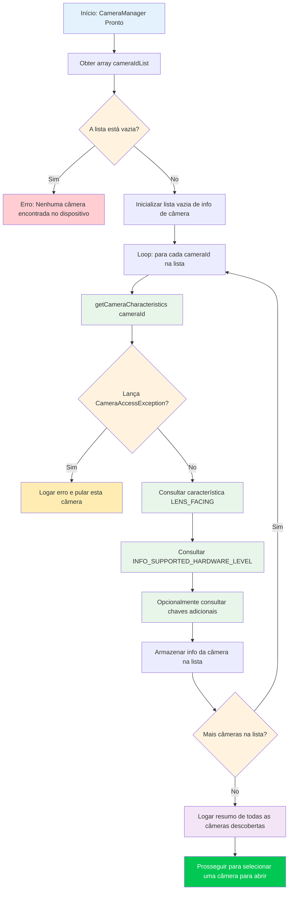

No Capítulo 5, você inicializou com sucesso o `CameraManager` e recuperou a lista de IDs de câmera — mas uma string como `"0"` ou `"2"` não diz nada sobre o que essa câmera realmente **é**. É a câmera traseira ultra-wide? A câmera de selfie? Uma webcam USB externa conectada via OTG? Este capítulo ensina como responder a essas perguntas usando `CameraCharacteristics`, o contêiner de metadados que descreve cada capacidade de um dispositivo de câmera.

Para uma implementação de referência de nível de produção de enumeração de câmera e inspeção de características, veja o aplicativo **Android Camera Parameters** ([GitHub](https://github.com/zoozooll/AndroidCameraParameters), [Google Play](https://play.google.com/store/apps/details?id=com.minininja.cameraparams)). Ele percorre cada chave em `CameraCharacteristics` para cada câmera no dispositivo e apresenta os resultados em uma interface pesquisável e filtrável — exatamente a ferramenta que você desejará ao depurar problemas de Camera2 específicos de hardware.

## Entendendo os IDs de Câmera

Antes de mergulhar nas características, precisamos abordar uma fonte fundamental de confusão para novos desenvolvedores do Camera2: **o que as strings numéricas de ID de câmera realmente significam?**

Quando você chama `cameraManager.cameraIdList`, você recebe de volta um `Array<String>` — por exemplo: `["0", "1", "2", "3", "4"]`. É **tentador** codificar suposições como:
- `"0"` = câmera traseira principal (wide)
- `"1"` = câmera frontal
- `"2"` = teleobjetiva

**Nunca faça isso.** O mapeamento de ID → câmera física é:
1. **Específico do dispositivo**: Um Pixel 8 pode usar o ID `"1"` para a câmera frontal, enquanto um Samsung Galaxy S24 usa o ID `"3"`.
2. **Específico da versão**: Uma atualização OTA do fabricante pode mudar a lista de IDs após o envio de um dispositivo.
3. **Específico da reconstrução**: Alguns dispositivos de multicâmera lógica (abordados em um capítulo posterior da Parte III) expõem ou ocultam dinamicamente as câmeras físicas subjacentes com base nos modos.

A **única** abordagem correta é **consultar as características de cada ID** e selecionar uma câmera com base nas propriedades que você deseja (direção da lente, nível de hardware, faixa de distância focal, etc.). É isso que os aplicativos Camera2 bem escritos fazem, e é o padrão que implementaremos aqui.

## Fluxo de Enumeração de Câmera

O algoritmo geral para descobrir câmeras é simples na superfície, mas possui casos extremos importantes em relação ao tratamento de erros. Vamos primeiro ver o processo como um fluxograma e, em seguida, implementá-lo em código.



Observações importantes do fluxograma:
1. **Sempre trate listas de ID vazias**: Raro em telefones, mas comum em Android TV, dispositivos sem tela ou emuladores sem uma câmera virtual.
2. **Sempre envolva `getCameraCharacteristics` em try/catch**: Uma câmera pode ser desconectada no meio da enumeração (especialmente uma câmera USB externa) ou uma política de dispositivo restritiva pode limitar certas câmeras.
3. **Itere completamente e depois escolha**: Colete todos os candidatos primeiro e depois selecione o melhor com base em seus critérios. Não abra a primeira câmera "boa" que encontrar — você pode perder uma melhor.

## Introduzindo o CameraCharacteristics

`CameraCharacteristics` é um mapa de chave-valor imutável e somente leitura que descreve as capacidades de nível de hardware de uma câmera. Ele contém centenas de chaves cobrindo tudo, desde a distância focal da lente até o tamanho da matriz de pixels do sensor e formatos de saída suportados.

Você recupera um objeto de características com:
```kotlin
val characteristics: CameraCharacteristics =
    cameraManager.getCameraCharacteristics(cameraId)
```

E você consulta chaves individuais com o método genérico `get`:
```kotlin
val lensFacing: Int? = characteristics.get(CameraCharacteristics.LENS_FACING)
```

O tipo de retorno é anulável (`Int?` neste caso) porque algumas chaves são opcionais e podem não estar presentes em todos os dispositivos. Na prática, as chaves que consultamos neste capítulo (`LENS_FACING` e `INFO_SUPPORTED_HARDWARE_LEVEL`) são garantidas de estarem presentes para cada câmera válida, mas ainda é uma boa prática lidar com nulos defensivamente.

:::note
Este capítulo cobre intencionalmente apenas `LENS_FACING` e `INFO_SUPPORTED_HARDWARE_LEVEL`. Os internos mais profundos de `CameraCharacteristics` (características do sensor, configurações de saída, capacidades disponíveis) são o assunto da Parte III, Capítulo 10: A Enciclopédia CameraCharacteristics. Estamos focados nas informações mínimas necessárias para escolher uma câmera para abrir.
:::

## Chave 1: LENS_FACING — Frontal, Traseira ou Externa

A primeira coisa que quase todo aplicativo de câmera precisa saber é para qual direção a lente aponta. O Camera2 define três constantes:

| Constante | Valor | Significado | Caso de Uso Típico |
|---|---|---|---|
| `LENS_FACING_BACK` | `0` | A câmera está na parte de trás do dispositivo, voltada para longe do usuário | Captura de fotos, vídeo de paisagem, AR |
| `LENS_FACING_FRONT` | `1` | A câmera está na parte frontal do dispositivo, voltada para o usuário | Selfies, videochamadas |
| `LENS_FACING_EXTERNAL` | `2` | A câmera é externa ao dispositivo (ex: webcam USB OTG) | Acessórios externos, câmeras especializadas |

Aqui está como você converte o inteiro bruto em uma string legível por humanos:

```kotlin
fun lensFacingToString(facing: Int?): String = when (facing) {
    CameraCharacteristics.LENS_FACING_BACK -> "Traseira (LENS_FACING_BACK)"
    CameraCharacteristics.LENS_FACING_FRONT -> "Frontal (LENS_FACING_FRONT)"
    CameraCharacteristics.LENS_FACING_EXTERNAL -> "Externa / USB OTG (LENS_FACING_EXTERNAL)"
    null -> "Desconhecida (null)"
    else -> "Desconhecida (valor=$facing)"
}
```

### Caso Especial: Câmeras Externas (USB OTG)

A `LENS_FACING_EXTERNAL` foi adicionada na API 23 (Marshmallow). Antes de abrir uma câmera externa, considere:

1. **Declaração de Recurso de Host USB**: Se seu aplicativo visa especificamente câmeras externas, adicione `<uses-feature android:name="android.hardware.usb.host" />` ao seu manifesto. Defina `required="false"` se o aplicativo também funcionar com câmeras integradas.
2. **Permissão para Dispositivos Externos**: Em muitos dispositivos, acessar uma câmera USB requer apenas a permissão `CAMERA`. No entanto, alguns chipsets de webcam USB exigem confirmação de permissão de host USB adicional via `UsbManager.requestPermission()`. Trate o broadcast `UsbManager.ACTION_USB_DEVICE_ATTACHED` se desejar detectar automaticamente quando uma câmera é conectada.
3. **Nível de Hardware**: Câmeras externas quase sempre relatam `INFO_SUPPORTED_HARDWARE_LEVEL_EXTERNAL` (veja abaixo), o que significa que seu conjunto de recursos é limitado pelo driver USB Video Class (UVC). Não espere controles manuais ou saída RAW de uma webcam genérica.

Em um telefone com uma webcam USB conectada, a `cameraIdList` pode retornar algo como `["0", "1", "100"]`, onde `"100"` é o ID da câmera externa atribuído dinamicamente. Os IDs de câmera externa são tipicamente números mais altos e **não** são estáveis entre reinicializações ou reconexões.

## Chave 2: INFO_SUPPORTED_HARDWARE_LEVEL — O Que Esta Câmera Pode Fazer?

O nível de hardware é a classificação de capacidade mais importante no Camera2. Ele informa se o hardware da câmera e o HAL (Hardware Abstraction Layer) implementam o pipeline completo do Camera2 ou se estão usando um wrapper de compatibilidade legado em torno da antiga API Camera. Existem cinco valores:

| Nível | Valor | Significado | Dispositivos do Mundo Real |
|---|---|---|---|
| `LEGACY` | `2` | Modo HAL legado. A câmera roda sobre a antiga API Camera via um "shim". Funcionalidade muito limitada, sem controles manuais, sem RAW. | Telefones econômicos, dispositivos anteriores a 2015, muitos emuladores |
| `LIMITED` | `0` | Suporte limitado ao HAL3. Captura básica, 3A básico (Exposição, Foco e Balanço de Branco Automáticos), mas faltam recursos avançados. | Telefones intermediários, algumas câmeras frontais em dispositivos flagship |
| `FULL` | `1` | Suporte total ao HAL3. Controles manuais do sensor, configurações por quadro, saída RAW, reprocessamento. | Câmeras traseiras/principais de telefones flagship, câmeras principais da série Pixel |
| `LEVEL_3` | `3` | Suporte estendido ao HAL3. Adiciona reprocessamento YUV, entrada multi-quadro, configurações de resolução de alta velocidade. | Flagships mais recentes, câmeras principais do Pixel 6+ |
| `EXTERNAL` | `4` | Câmera externa (USB/OTG). Recursos limitados, dispositivo de classe UVC. | Webcams USB, placas de captura HDMI |

Uma boa maneira de pensar nesta hierarquia é como uma escada de capacidades:

```
LEGACY → LIMITED → FULL → LEVEL_3
          ↑
       EXTERNAL (ramo paralelo para câmeras USB)
```

Cada degrau baseia-se no anterior: `FULL` inclui tudo de `LIMITED`, `LEVEL_3` inclui tudo de `FULL`. Ao escrever código de detecção de recursos, verifique do nível mais alto para baixo — se uma câmera for `LEVEL_3`, você sabe automaticamente que ela também suporta recursos `FULL`.

Aqui está a função auxiliar para converter o nível em uma descrição:

```kotlin
fun hardwareLevelToString(level: Int?): String = when (level) {
    CameraMetadata.INFO_SUPPORTED_HARDWARE_LEVEL_LEGACY ->
        "LEGACY (shim da API Camera antiga — controles manuais limitados)"
    CameraMetadata.INFO_SUPPORTED_HARDWARE_LEVEL_LIMITED ->
        "LIMITED (HAL3 básico — foto/vídeo padrão)"
    CameraMetadata.INFO_SUPPORTED_HARDWARE_LEVEL_FULL ->
        "FULL (HAL3 completo — controles manuais + RAW)"
    CameraMetadata.INFO_SUPPORTED_HARDWARE_LEVEL_3 ->
        "LEVEL_3 (HAL3 estendido — reprocessamento + multi-quadro)"
    CameraMetadata.INFO_SUPPORTED_HARDWARE_LEVEL_EXTERNAL ->
        "EXTERNAL (câmera USB/OTG — classe UVC)"
    null -> "Desconhecido (null)"
    else -> "Desconhecido (valor=$level)"
}
```

:::tip
Se você deseja escrever código que rode apenas em hardware capaz, use `>= LIMITED` para captura básica, `>= FULL` para controles manuais e `>= LEVEL_3` para pipelines de reprocessamento. Nunca assuma que uma câmera é FULL ou melhor — sempre verifique. O aplicativo Android Camera Parameters na [Google Play](https://play.google.com/store/apps/details?id=com.minininja.cameraparams) mostra o nível de hardware como um emblema proeminente para cada câmera, para que você possa ver rapidamente o que cada dispositivo suporta.
:::

## Código Kotlin Completo: Utilitário de Descoberta de Câmera

Agora vamos combinar tudo em uma implementação funcional. Estenderemos o `MainActivity.kt` do Capítulo 5 com um método `discoverAndLogCameras()` que percorre todas as câmeras, consulta o `LENS_FACING` e o `INFO_SUPPORTED_HARDWARE_LEVEL` de cada uma e loga os resultados no Logcat.

```kotlin
package com.example.camera2tutorial

import android.Manifest
import android.content.Context
import android.content.pm.PackageManager
import android.hardware.camera2.CameraAccessException
import android.hardware.camera2.CameraCharacteristics
import android.hardware.camera2.CameraManager
import android.hardware.camera2.CameraMetadata
import android.os.Bundle
import android.os.Handler
import android.os.HandlerThread
import android.util.Log
import android.widget.Toast
import androidx.appcompat.app.AppCompatActivity
import androidx.core.app.ActivityCompat
import androidx.core.content.ContextCompat

class MainActivity : AppCompatActivity() {

    private lateinit var backgroundThread: HandlerThread
    private lateinit var backgroundHandler: Handler
    private lateinit var cameraManager: CameraManager

    override fun onCreate(savedInstanceState: Bundle?) {
        super.onCreate(savedInstanceState)
        setContentView(R.layout.activity_main)

        if (allPermissionsGranted()) {
            initializeCameraManager()
        } else {
            ActivityCompat.requestPermissions(
                this,
                REQUIRED_PERMISSIONS,
                REQUEST_CODE_PERMISSIONS
            )
        }
    }

    override fun onResume() {
        super.onResume()
        startBackgroundThread()
    }

    override fun onPause() {
        stopBackgroundThread()
        super.onPause()
    }

    private fun startBackgroundThread() {
        backgroundThread = HandlerThread("Camera2Background").apply { start() }
        backgroundHandler = Handler(backgroundThread.looper)
    }

    private fun stopBackgroundThread() {
        backgroundThread.quitSafely()
        try {
            backgroundThread.join(1000)
        } catch (e: InterruptedException) {
            Log.e(TAG, "Interrompido ao aguardar a finalização da thread de fundo", e)
        }
    }

    private fun initializeCameraManager() {
        cameraManager = getSystemService(Context.CAMERA_SERVICE) as CameraManager
        discoverAndLogCameras()
    }

    // -------------------------------------------------------------------------
    // 📸 ADIÇÕES DO CAPÍTULO 6: Descoberta de Câmeras e Consulta de Características
    // -------------------------------------------------------------------------
    data class CameraInfo(
        val id: String,
        val lensFacing: Int?,
        val hardwareLevel: Int?
    ) {
        fun description(): String = buildString {
            append("ID da Câmera: $id | ")
            append("Direção: ${lensFacingToString(lensFacing)} | ")
            append("Nível de HW: ${hardwareLevelToString(hardwareLevel)}")
        }
    }

    private fun discoverAndLogCameras() {
        val cameraIdList: Array<String> = try {
            cameraManager.cameraIdList
        } catch (e: CameraAccessException) {
            Log.e(TAG, "Falha ao obter lista de IDs de câmera", e)
            Toast.makeText(this, "Serviço de câmera indisponível", Toast.LENGTH_LONG).show()
            return
        }

        if (cameraIdList.isEmpty()) {
            Log.w(TAG, "Nenhuma câmera encontrada neste dispositivo")
            Toast.makeText(this, "Nenhuma câmera disponível", Toast.LENGTH_LONG).show()
            return
        }

        val discoveredCameras = mutableListOf<CameraInfo>()
        Log.i(TAG, "═══════════════════════════════════════════")
        Log.i(TAG, "Iniciando descoberta de câmeras (${cameraIdList.size} câmera(s))")
        Log.i(TAG, "═══════════════════════════════════════════")

        for ((index, cameraId) in cameraIdList.withIndex()) {
            try {
                val characteristics = cameraManager.getCameraCharacteristics(cameraId)

                val lensFacing = characteristics.get(CameraCharacteristics.LENS_FACING)
                val hardwareLevel =
                    characteristics.get(CameraCharacteristics.INFO_SUPPORTED_HARDWARE_LEVEL)

                val info = CameraInfo(cameraId, lensFacing, hardwareLevel)
                discoveredCameras.add(info)

                Log.i(TAG, "── Câmera $index ──")
                Log.i(TAG, info.description())

            } catch (e: CameraAccessException) {
                Log.e(TAG, "Falha ao acessar características da câmera $cameraId", e)
            } catch (e: IllegalArgumentException) {
                Log.e(TAG, "ID de câmera inválido: $cameraId", e)
            }
        }

        Log.i(TAG, "═══════════════════════════════════════════")
        Log.i(TAG, "Descoberta concluída. ${discoveredCameras.size} câmera(s) enumerada(s) com sucesso.")

        // Agrupar e resumir por direção
        val byFacing = discoveredCameras.groupBy { it.lensFacing }
        Log.i(TAG, "  Traseiras:       ${byFacing[CameraCharacteristics.LENS_FACING_BACK]?.size ?: 0}")
        Log.i(TAG, "  Frontais:        ${byFacing[CameraCharacteristics.LENS_FACING_FRONT]?.size ?: 0}")
        Log.i(TAG, "  Externas/OTG:    ${byFacing[CameraCharacteristics.LENS_FACING_EXTERNAL]?.size ?: 0}")

        // Agrupar e resumir por nível de hardware
        val byLevel = discoveredCameras.groupBy { it.hardwareLevel }
        Log.i(TAG, "  Câmeras LEGACY:   ${byLevel[CameraMetadata.INFO_SUPPORTED_HARDWARE_LEVEL_LEGACY]?.size ?: 0}")
        Log.i(TAG, "  Câmeras LIMITED:  ${byLevel[CameraMetadata.INFO_SUPPORTED_HARDWARE_LEVEL_LIMITED]?.size ?: 0}")
        Log.i(TAG, "  Câmeras FULL:     ${byLevel[CameraMetadata.INFO_SUPPORTED_HARDWARE_LEVEL_FULL]?.size ?: 0}")
        Log.i(TAG, "  Câmeras LEVEL_3:  ${byLevel[CameraMetadata.INFO_SUPPORTED_HARDWARE_LEVEL_3]?.size ?: 0}")
        Log.i(TAG, "  Câmeras EXTERNAL: ${byLevel[CameraMetadata.INFO_SUPPORTED_HARDWARE_LEVEL_EXTERNAL]?.size ?: 0}")
        Log.i(TAG, "═══════════════════════════════════════════")

        val summary = buildString {
            append("Descobertas ${discoveredCameras.size} câmera(s)!\n")
            append("Traseiras: ${byFacing[CameraCharacteristics.LENS_FACING_BACK]?.size ?: 0} • ")
            append("Frontais: ${byFacing[CameraCharacteristics.LENS_FACING_FRONT]?.size ?: 0} • ")
            append("Externas: ${byFacing[CameraCharacteristics.LENS_FACING_EXTERNAL]?.size ?: 0}")
        }

        Toast.makeText(this, summary, Toast.LENGTH_LONG).show()

        // Armazenar para capítulos posteriores (selecionar câmera para abrir)
        this.discoveredCameras = discoveredCameras
    }

    private var discoveredCameras: List<CameraInfo> = emptyList()

    // Auxiliar: obter o ID da câmera traseira "padrão" (a primeira que encontrarmos)
    fun getDefaultBackCameraId(): String? =
        discoveredCameras.firstOrNull {
            it.lensFacing == CameraCharacteristics.LENS_FACING_BACK
        }?.id

    // Auxiliar: obter o ID da câmera frontal "padrão"
    fun getDefaultFrontCameraId(): String? =
        discoveredCameras.firstOrNull {
            it.lensFacing == CameraCharacteristics.LENS_FACING_FRONT
        }?.id

    companion object {
        private const val TAG = "Camera2Tutorial"
        private const val REQUEST_CODE_PERMISSIONS = 10
        private val REQUIRED_PERMISSIONS = arrayOf(Manifest.permission.CAMERA)

        fun lensFacingToString(facing: Int?): String = when (facing) {
            CameraCharacteristics.LENS_FACING_BACK -> "Traseira"
            CameraCharacteristics.LENS_FACING_FRONT -> "Frontal"
            CameraCharacteristics.LENS_FACING_EXTERNAL -> "Externa/USB"
            null -> "Desconhecida(null)"
            else -> "Desconhecida($facing)"
        }

        fun hardwareLevelToString(level: Int?): String = when (level) {
            CameraMetadata.INFO_SUPPORTED_HARDWARE_LEVEL_LEGACY -> "LEGACY"
            CameraMetadata.INFO_SUPPORTED_HARDWARE_LEVEL_LIMITED -> "LIMITED"
            CameraMetadata.INFO_SUPPORTED_HARDWARE_LEVEL_FULL -> "FULL"
            CameraMetadata.INFO_SUPPORTED_HARDWARE_LEVEL_3 -> "LEVEL_3"
            CameraMetadata.INFO_SUPPORTED_HARDWARE_LEVEL_EXTERNAL -> "EXTERNAL"
            null -> "Desconhecido(null)"
            else -> "Desconhecido($level)"
        }
    }

    private fun allPermissionsGranted() = REQUIRED_PERMISSIONS.all {
        ContextCompat.checkSelfPermission(baseContext, it) == PackageManager.PERMISSION_GRANTED
    }

    override fun onRequestPermissionsResult(
        requestCode: Int,
        permissions: Array<out String>,
        grantResults: IntArray
    ) {
        super.onRequestPermissionsResult(requestCode, permissions, grantResults)
        if (requestCode == REQUEST_CODE_PERMISSIONS) {
            if (allPermissionsGranted()) {
                initializeCameraManager()
            } else {
                Toast.makeText(
                    this,
                    "A permissão de câmera é necessária para usar este aplicativo.",
                    Toast.LENGTH_LONG
                ).show()
                finish()
            }
        }
    }
}
```

### Padrões Chave no Código

1. **`data class CameraInfo`**: Em vez de passar tuplas brutas, encapsulamos as propriedades de interesse em uma classe de dados tipada. Isso torna o código legível e trivialmente extensível (basta adicionar um novo campo como `focalLengths` depois sem mudar os locais de chamada).

2. **Try/catch de `CameraAccessException` dentro do loop**: Se uma câmera falhar (por exemplo, uma câmera externa for desconectada no meio da enumeração), o loop continua e as câmeras restantes ainda são descobertas. A falha de uma câmera não deve comprometer toda a enumeração.

3. **Resumos duplos `groupBy`**: Agrupar câmeras tanto por direção quanto por nível de hardware e contar cada grupo fornece uma visão imediata da topologia de câmeras do dispositivo. Este padrão foi inspirado na tela de visão geral do aplicativo Android Camera Parameters ([GitHub](https://github.com/zoozooll/AndroidCameraParameters)).

4. **`getDefaultBackCameraId()` e `getDefaultFrontCameraId()`**: Estas funções auxiliares demonstram a maneira correta de selecionar uma câmera — consultando as características, não codificando rigidamente o ID `"0"` ou `"1"`. Usaremos estes auxiliares no Capítulo 7 quando realmente abrirmos uma câmera.

## Saída Esperada no Logcat

Quando você rodar isto em um dispositivo real (ex: um flagship moderno com 4+ câmeras), a saída do Logcat filtrada por `Camera2Tutorial` deve parecer com isto:

```
I/Camera2Tutorial: ═══════════════════════════════════════════
I/Camera2Tutorial: Iniciando descoberta de câmeras (5 câmera(s))
I/Camera2Tutorial: ═══════════════════════════════════════════
I/Camera2Tutorial: ── Câmera 0 ──
I/Camera2Tutorial: ID da Câmera: 0 | Direção: Traseira | Nível de HW: LEVEL_3
I/Camera2Tutorial: ── Câmera 1 ──
I/Camera2Tutorial: ID da Câmera: 1 | Direção: Frontal | Nível de HW: FULL
I/Camera2Tutorial: ── Câmera 2 ──
I/Camera2Tutorial: ID da Câmera: 2 | Direção: Traseira | Nível de HW: LIMITED
I/Camera2Tutorial: ── Câmera 3 ──
I/Camera2Tutorial: ID da Câmera: 3 | Direção: Traseira | Nível de HW: LIMITED
I/Camera2Tutorial: ── Câmera 4 ──
I/Camera2Tutorial: ID da Câmera: 4 | Direção: Traseira | Nível de HW: LIMITED
I/Camera2Tutorial: ═══════════════════════════════════════════
I/Camera2Tutorial: Descoberta concluída. 5 câmera(s) enumerada(s) com sucesso.
I/Camera2Tutorial:   Traseiras:       4
I/Camera2Tutorial:   Frontais:        1
I/Camera2Tutorial:   Externas/OTG:    0
I/Camera2Tutorial:   Câmeras LEGACY:   0
I/Camera2Tutorial:   Câmeras LIMITED:  3
I/Camera2Tutorial:   Câmeras FULL:     1
I/Camera2Tutorial:   Câmeras LEVEL_3:  1
I/Camera2Tutorial:   Câmeras EXTERNAL: 0
I/Camera2Tutorial: ═══════════════════════════════════════════
```

Neste exemplo de saída, temos:
- **Câmera 0** (LEVEL_3, Traseira): A câmera traseira principal grande angular, a que produz imagens de maior qualidade.
- **Câmera 1** (FULL, Frontal): A câmera frontal de selfie, de nível FULL, então controles manuais estão disponíveis.
- **Câmeras 2, 3, 4** (LIMITED, Traseira): Ultra-wide, teleobjetiva e possivelmente um sensor de profundidade ou macro — todas de nível LIMITED, o que significa que suportam captura básica, mas não controle manual total (isso é extremamente comum em câmeras traseiras auxiliares, mesmo em flagships).

## Solução de Problemas de Descoberta de Câmera

### `cameraIdList` retorna um array vazio em um emulador

A maioria dos emuladores Android vem com uma câmera traseira e frontal simulada, mas elas devem estar habilitadas nas configurações do AVD (Android Virtual Device). Abra o AVD Manager, edite seu dispositivo virtual, vá em **Advanced Settings** e defina **Back camera** e **Front camera** como `Emulated` (usa a webcam do computador) ou `VirtualScene` (renderiza uma cena 3D falsa). Em seguida, faça um "cold boot" do emulador.

### Todas as câmeras relatam LEGACY em um telefone que deveria ter suporte FULL

Isso acontece em dois cenários:
1. **Você está em uma ROM personalizada ou dispositivo com root com um HAL de câmera antigo**: O fabricante não implementou o HAL3, então o shim de compatibilidade é usado mesmo que o hardware do sensor seja capaz.
2. **Você está usando um perfil de trabalho ou dispositivo gerenciado**: Algumas políticas de MDM (Mobile Device Management) restringem as capacidades da câmera, e o serviço de câmera pode relatar um nível degradado para aplicativos no perfil de trabalho.

Instale o aplicativo Android Camera Parameters da [Google Play](https://play.google.com/store/apps/details?id=com.minininja.cameraparams) para cruzar as informações. Se o aplicativo da Play Store também mostrar LEGACY, é uma limitação do dispositivo, não um bug no seu código.

### A câmera USB externa não aparece na lista

Primeiro, verifique se o seu adaptador USB OTG funciona: conecte um mouse USB e veja se ele move o cursor. Se o hardware funcionar, verifique:
- O dispositivo está rodando a API 23+ (o suporte a câmera externa foi adicionado no Marshmallow).
- A webcam é compatível com USB Video Class (UVC). A maioria das webcams de consumo é, mas câmeras industriais especializadas podem precisar de um driver personalizado.
- Alguns dispositivos bloqueiam o modo host USB quando a bateria está abaixo de um certo nível. Carregue o dispositivo e tente novamente.

## Resumo

Neste capítulo, você transformou um array sem sentido de strings de ID de câmera em informações úteis sobre o hardware da câmera em um dispositivo. Você aprendeu:

1. **Semântica de ID de Câmera**: Por que você nunca deve codificar suposições sobre qual ID mapeia para qual câmera, e como os IDs podem variar entre dispositivos, OTAs e reinicializações.
2. **Fundamentos de CameraCharacteristics**: Como recuperar um objeto de características via `cameraManager.getCameraCharacteristics(cameraId)` e consultar chaves individuais usando o método genérico `get`.
3. **LENS_FACING**: As três possíveis direções de lente (`LENS_FACING_BACK`, `LENS_FACING_FRONT`, `LENS_FACING_EXTERNAL`), com mergulhos profundos nos requisitos de câmera externa USB OTG (recurso de host USB, IDs dinâmicos, limitações de UVC).
4. **INFO_SUPPORTED_HARDWARE_LEVEL**: A escada de capacidades de cinco níveis (LEGACY → LIMITED → FULL → LEVEL_3, mais EXTERNAL para câmeras USB), o que cada nível garante em termos de suporte a recursos e como escrever código de restrição de recursos com base no nível mínimo exigido.
5. **Descoberta de Câmera Robusta**: A implementação completa de `discoverAndLogCameras()` com try/catch por câmera, uma classe de dados `CameraInfo`, strings de descrição legíveis por humanos, resumos de agrupamento por direção e nível de hardware, e funções auxiliares para selecionar a câmera traseira/frontal padrão.

Agora você tem metadados reais do Camera2 fluindo pelo seu aplicativo. Este é um marco importante — o código de enumeração que você escreveu aqui é reutilizável em cada projeto Camera2 que você construir.

## O Que Vem a Seguir

Com uma câmera selecionada (via `getDefaultBackCameraId()`), é hora de realmente ligá-la e falar com o hardware. No **Capítulo 7: Abrindo uma Câmera**, você irá:

- Aprender o que o `CameraDevice` representa (uma conexão aberta e ativa com uma câmera física).
- Implementar o `CameraDevice.StateCallback` com manipuladores para `onOpened`, `onDisconnected` e `onError`.
- Entender as regras de ciclo de vida para saber quando abrir, reabrir e fechar a câmera em sincronia com `onPause` e `onResume`.
- Tratar cada código de erro comum do `CameraAccessException`: `CAMERA_IN_USE`, `MAX_CAMERAS_IN_USE`, `CAMERA_DISABLED` e `CAMERA_ERROR`.
- Usar um `Semaphore` para prevenir operações de abertura simultâneas, com timeout no `tryAcquire` para segurança contra deadlocks.

Ao final do Capítulo 7, seu código terá um objeto `CameraDevice` ativo e aberto — o pré-requisito para criar uma sessão de captura e, finalmente, mostrar a pré-visualização da câmera.
