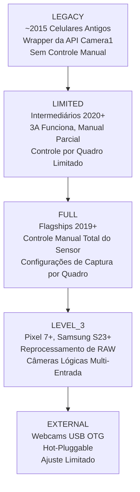
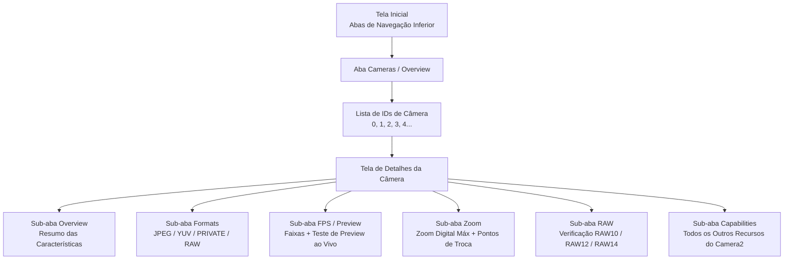

# Capítulo 4: Explore a Câmera do Seu Próprio Celular

É aqui que seu aplicativo se torna importante. Os Capítulos 2 e 3 forneceram a você uma compreensão teórica do hardware da câmera e dos recursos modernos da fotografia computacional. Este capítulo é prático e específico para o dispositivo. Você instalará o aplicativo complementar **Android Camera Parameters** no seu próprio celular, irá iniciá-lo e inspecionará sistematicamente o que exatamente seu hardware pode e não pode fazer — anotando as respostas à medida que avança.

As informações que você descobrir neste capítulo não são curiosidades acadêmicas. A API Camera2 expõe recursos por dispositivo e por câmera. Um recurso que funciona perfeitamente no seu Pixel 10 pessoal pode falhar silenciosamente (ou degradar para uma operação nula, ou pior, travar) em um Samsung série A intermediário de 2023 porque o HAL daquele dispositivo simplesmente não implementa o recurso necessário. Antes de escrever uma única linha de código da API Camera2 na Parte II desta série, você deve saber do que seu próprio dispositivo de teste é capaz.

Ao final deste capítulo, você terá anotado, para seu celular específico: uma lista completa de IDs de Câmera com suas direções e níveis de hardware; quais formatos de saída cada câmera suporta; a resolução máxima de JPEG; a maior faixa de FPS em câmera lenta; o zoom digital máximo e os limites de troca de câmera física; e se sua câmera principal suporta saída RAW.

## Instalando o Aplicativo Android Camera Parameters

Duas opções de instalação estão disponíveis. Escolha a que preferir.

### Opção A — Compilar a Partir do Código-Fonte

Se você é um desenvolvedor Android e já tem o Android Studio instalado, esta opção oferece a capacidade de navegar pelo código-fonte do aplicativo complementar (veja a última seção deste capítulo) e até mesmo modificá-lo para inspecionar características adicionais do Camera2 que lhe interessem.

1. Clone o repositório do GitHub:
   `https://github.com/zoozooll/AndroidCameraParameters`
2. Abra o projeto no Android Studio Iguana (2023.2.1) ou mais recente. A sincronização do Gradle será concluída automaticamente; o projeto visa o Android SDK 34 (Android 14) com um `minSdkVersion` de 21 (Android 5.0 Lollipop), portanto ele rodará em essencialmente qualquer celular que você provavelmente possua.
3. Ative a Depuração USB no seu celular. Vá em **Configurações → Sobre o Telefone → Número da Versão** e toque na entrada Número da Versão 7 vezes. Um toast aparecerá dizendo "Você agora é um desenvolvedor". Volte para a tela principal de Configurações, entre em **Opções do Desenvolvedor** e ative a **Depuração USB**.
4. Conecte seu celular ao computador via um cabo USB-C. No celular, aceite o aviso "Permitir depuração USB a partir deste computador?" e marque "Sempre permitir deste computador" para evitar o diálogo no futuro.
5. Selecione a Configuração de Execução **app** no menu suspenso no topo do Android Studio (a Configuração de Execução padrão geralmente se chama `app`). Certifique-se de que seu celular conectado apareça como o dispositivo de destino no menu suspenso de dispositivos.
6. Clique no botão verde **Run** (o ícone triangular de play) ou pressione **Shift + F10**. O Android Studio compilará o aplicativo, instalará o APK no seu celular via ADB e o iniciará automaticamente.

### Opção B — Instalar a Partir do Google Play

Se você simplesmente deseja rodar o aplicativo sem compilá-lo, ou se deseja testar seu comportamento em vários dispositivos de usuários finais sem configurar cada um para o ADB, use a build da Play Store.

Abra a Google Play Store no seu celular Android e navegue para:

`https://play.google.com/store/apps/details?id=com.minininja.cameraparams`

Toque em **Instalar**. O aplicativo é gratuito e não contém anúncios, compras no app ou rastreadores. Ele exige apenas a permissão `CAMERA` (para consultar as características da câmera e abrir uma superfície de pré-visualização) e a permissão opcional `RECORD_AUDIO` (nunca usada na build atual, mas reservada para uma futura atividade de teste de gravação de vídeo). A permissão `ACCESS_FINE_LOCATION` é opcional e só é solicitada se você quiser marcar as capturas de amostra com metadados GPS na aba de pré-visualização.

Inicie o aplicativo após a conclusão da instalação. No primeiro lançamento, conceda a permissão de **Câmera** quando o diálogo de permissão do sistema aparecer. O aplicativo não funcionará sem esta permissão, pois o modelo de segurança do Android exige uma concessão de permissão em tempo de execução até mesmo para *consultar* as características da câmera — você não pode sequer enumerar os IDs de Câmera sem que a permissão `CAMERA` seja concedida.

## IDs de Câmera

Observe a tela inicial do aplicativo. A primeira (e padrão) aba na parte inferior é rotulada como **Cameras** (às vezes chamada de **Overview**, dependendo da variante da build que você está rodando). O cabeçalho no topo desta aba diz **All Camera IDs**.

Cada câmera individual em um dispositivo Android — cada câmera traseira, a câmera frontal, qualquer dispositivo de fusão de multicâmera lógica e qualquer webcam USB OTG externa — recebe um identificador de string único chamado **ID de Câmera**. Os IDs de câmera são quase sempre inteiros decimais simples: `"0"`, `"1"`, `"2"`, `"3"`, e às vezes `"4"`, `"5"` em dispositivos com muitas câmeras. Em dispositivos raros (algumas webcams externas e as câmeras falsas do emulador), você pode ver IDs de Câmera como `"camera@0"` ou `"0@external"`, mas inteiros simples são, de longe, o formato mais comum.

Cada linha na lista Todos os IDs de Câmera mostra três informações, da esquerda para a direita:

1. O próprio número do ID da Câmera, exibido como um grande chip em negrito.
2. A direção **LENS_FACING**: uma entre `BACK` (câmera traseira, voltada para longe da tela), `FRONT` (câmera de selfie, voltada para o usuário) ou `EXTERNAL` (webcam USB / câmera OTG).
3. O **Nível de Hardware** daquela câmera: um chip colorido mostrando `LEGACY`, `LIMITED`, `FULL`, `LEVEL_3` ou `EXTERNAL`. Isso mapeia diretamente para a característica `INFO_SUPPORTED_HARDWARE_LEVEL` da API Camera2 descrita no Capítulo 1 desta série.

Como um exemplo concreto, um Galaxy S26 Ultra normalmente relata **5 IDs de Câmera**:

- **ID 0**: BACK (traseira wide / câmera principal de 24mm), Nível de Hardware = **FULL**
- **ID 1**: FRONT (câmera de selfie), Nível de Hardware = **LIMITED**
- **ID 2**: BACK (traseira ultra-wide de 0.5×), Nível de Hardware = **FULL**
- **ID 3**: BACK (traseira telefoto periscópica de 5×), Nível de Hardware = **FULL**
- **ID 4**: BACK (ID de multicâmera lógica representando a combinação fundida dos IDs 0 + 2 + 3, gerenciada pelo HAL para zoom contínuo), Nível de Hardware = **FULL**

Um celular intermediário (ex: um Samsung A54 5G) pode relatar apenas 3 IDs de Câmera: traseira wide, traseira ultra-wide e frontal. Um celular econômico da era de 2016 pode relatar apenas 2: traseira e frontal.

**Tarefa para o seu dispositivo:** Anote a lista completa de IDs de Câmera que seu celular relata. Para cada ID, observe sua LENS_FACING (Traseira / Frontal / Externa) e a cor/rótulo do chip de Nível de Hardware. Conte o número total de câmeras. Se você vir um ID de Câmera cujo propósito não é óbvio (ex: um ID traseiro adicional que não corresponde a nenhuma saliência de lente óbvia na parte de trás do celular), mantenha-o em mente — esses costumam ser sensores de profundidade ToF, câmeras macro ou o dispositivo de fusão de multicâmera lógica.

## Níveis de Hardware

O Capítulo 1 desta série introduziu os cinco Níveis de Hardware do Camera2, ordenados do menos capaz ao mais capaz: **LEGACY → LIMITED → FULL → LEVEL_3 → EXTERNAL**. Esta seção refresca essa hierarquia e, em seguida, solicita que você inspecione o nível de cada câmera usando o aplicativo.

Cada nível adiciona novas capacidades e garantias de desempenho mais rigorosas:

- **LEGACY**: A API Camera2 é implementada como um shim fino sobre a API `android.hardware.Camera` (Camera1) descontinuada. Quase nada funciona de forma confiável — sem exposição manual, sem controle por quadro, sem suporte a RAW. Você pode ignorar com segurança os dispositivos LEGACY em 2026; essencialmente nenhum celular em uso ativo ainda relata isso.
- **LIMITED**: O Nível de Hardware mais comum para celulares intermediários e para câmeras frontais em todos os níveis de celulares. Os algoritmos 3A (Exposição Automática, Foco Automático, Balanço de Branco Automático) rodam corretamente, a saída básica de YUV e JPEG funciona, mas a maioria dos controles manuais do sensor não está disponível (sem velocidade de obturador manual abaixo do piso do AE, sem controle manual de ganho, sem atualizações de configurações de captura por quadro com latência menor que 3 a 5 quadros).
- **FULL**: O nível padrão ouro para flagships. Todos os recursos da API Camera2 têm garantia de funcionamento: controle manual total do tempo de exposição do sensor e ganho analógico por quadro individual, taxa de quadros com garantia de ser respeitada, captura sequencial a 30+ fps com configurações diferentes por quadro, reprocessamento YUV, saída RAW DNG básica. Se a câmera traseira principal do seu celular relata FULL, você pode implementar todos os recursos desta série de tutoriais.
- **LEVEL_3**: O nível mais alto, introduzido com as famílias Pixel 7 e Samsung S23 em 2022/2023. Adiciona fluxos de entrada de reprocessamento RAW garantidos (você pode alimentar um DNG capturado anteriormente de volta no ISP e rodar novamente o pipeline com diferentes mapeamentos de tons ou matrizes de cores), fluxos de saída YUV de multi-resolução e suporte garantido à fusão de multicâmera lógica.
- **EXTERNAL**: Para webcams USB OTG e dongles de captura HDMI conectados via USB-C. A superfície da API é idêntica, mas não existem dados de calibração de fábrica (sem mapas de sombreamento de lente armazenados em OTP, sem matrizes de correção de cor por módulo), portanto a qualidade das câmeras EXTERNAL é variável.

**Como inspecionar no aplicativo:** Toque no chip **Hardware Level** ao lado de qualquer ID de Câmera na lista. Um diálogo de folha inferior aparecerá mostrando a descrição completa de `INFO_SUPPORTED_HARDWARE_LEVEL` para aquela câmera, juntamente com uma lista com marcadores de quais recursos principais são garantidos (ou não garantidos) naquele nível.

**Tarefa para o seu dispositivo:** Para sua câmera traseira principal (geralmente o ID 0), confirme qual Nível de Hardware ela relata. Para sua câmera frontal, confirme o nível dela. Em seguida, faça a si mesmo esta pergunta e pense na resposta antes de prosseguir com a leitura: **Por que as câmeras frontais relatam quase universalmente LIMITED em vez de FULL?**

A resposta é que as câmeras frontais costumam ser sensores mais simples e de menor custo. O algoritmo 3A roda de forma confiável nelas (afinal, selfies precisam de exposição e balanço de branco automáticos para produzir resultados aceitáveis), mas o controle manual do sensor é menos prioritário para selfies. Ninguém paga um prêmio por velocidade de obturador manual de 1/1000s em sua câmera de selfie de 13MP. Os fornecedores de HAL, portanto, otimizam sua implementação de nível LIMITED para o caso de uso de selfie e nunca implementam os testes e validações adicionais necessários para passar nos testes Camera2 CTS (Compatibility Test Suite) de nível FULL.

## Câmeras Disponíveis: Direções de Lente

O Android define três valores possíveis para a característica de câmera `LENS_FACING`. O aplicativo fornece uma barra de alternância de filtros no topo da aba Cameras para alternar entre eles: **All · Back · Front · External**.

- **BACK**: A câmera na parte traseira do celular, apontando para longe da tela. Qualquer ultra-wide, wide, telefoto, periscópica, macro ou sensor ToF traseiro relata `LENS_FACING_BACK`. Esta é a câmera que seu aplicativo usará 90% do tempo.
- **FRONT**: A câmera de selfie, apontando para o usuário quando a tela está voltada para ele. Observe que a imagem de pré-visualização da câmera frontal é geralmente espelhada horizontalmente (invertida da esquerda para a direita) pelo aplicativo de câmera padrão para corresponder ao que o usuário vê em um espelho, mas os dados de pixel reais gravados nos arquivos JPEG não são espelhados, a menos que seu aplicativo o faça explicitamente.
- **EXTERNAL**: Uma webcam USB OTG, endoscópio USB, placa de captura HDMI USB ou outro dispositivo de entrada de vídeo hot-pluggable conectado via USB-C. Um dos recursos mais subestimados da API Camera2 é que as câmeras EXTERNAL são expostas através do *exatamente mesmo caminho de código* que as câmeras internas. Um aplicativo Camera2 bem escrito enumerará e usará uma webcam USB automaticamente sem qualquer código específico para USB, desde que a porta USB-C do celular suporte o modo gadget USB Video Class (UVC) em modo host.

**Tarefa para o seu dispositivo:** Use os filtros para alternar entre Traseira (Back), Frontal (Front) e Externa (External). Conte quantas câmeras se encaixam em cada categoria. Seu celular lista alguma câmera EXTERNAL no momento? Quase certamente não — a menos que você tenha uma webcam USB conectada. Se você possui uma webcam USB ou um endoscópio USB, conecte-o ao celular agora via um adaptador USB-C OTG e toque no botão **Refresh** no menu superior direito do aplicativo. Você deverá ver um novo ID de Câmera aparecer com LENS_FACING = EXTERNAL. Abra a aba Preview para essa câmera externa — se tudo funcionar, você verá uma pré-visualização ao vivo da webcam, usando o exato mesmo caminho de código da API Camera2 que abriu a câmera traseira interna 30 segundos antes.

## Formatos de Saída Suportados

Cada câmera Camera2 anuncia uma lista de **formatos de saída** suportados e, para cada formato, uma lista de pares de resolução/tamanho suportados. A API Camera2 rejeitará qualquer solicitação de captura que tente visar uma combinação de formato/tamanho que a câmera não anuncie.

O aplicativo expõe essas informações na tela de detalhes da câmera. Para alcançá-la, toque em qualquer linha de ID de Câmera na aba Cameras. Você será levado a uma tela de detalhes com várias abas deslizáveis: **Overview · Formats · FPS · Zoom · RAW · Capabilities**. Deslize (ou toque na barra de abas) para a aba **Formats**.

Existem dezenas de possíveis constantes `ImageFormat` no SDK do Android, mas estes **5 formatos** respondem por 99% do uso real de aplicativos Camera2. O aplicativo os lista no topo da aba Formats com descrições em linguagem clara:

1. **JPEG**: Fotos processadas normais que você envia por e-mail, posta em redes sociais ou compartilha por mensagens. Cor YCbCr 4:2:0 de 8 bits, processada pelo ISP (todos os 8 estágios do Capítulo 2 aplicados), compactada com perdas DCT. Tamanho de arquivo pequeno. Este é o padrão e a saída de captura estática mais comum.
2. **YUV_420_888**: O formato universal não compactado para processamento no dispositivo. Plano Y (luminância) de 8 bits mais planos Cb e Cr (croma) de 8 bits, subamostrados em 2:1 horizontalmente. Usado para detecção facial, digitalização de códigos QR, digitalização de códigos de barras, inferência de aprendizado de máquina (TensorFlow Lite, PyTorch Mobile), processamento de imagem personalizado antes de recodificar para JPEG e como entrada para o codificador de vídeo MediaCodec para gravação de vídeo.
3. **PRIVATE**: O formato opaco de cópia zero usado exclusivamente para pré-visualização de alta velocidade na tela. O layout de pixel real é específico do fabricante e oculto do aplicativo (daí o nome "private"). Superfícies PRIVATE (tipicamente uma `SurfaceView`, `TextureView` ou `ImageReader` com flags de uso `PRIV`) ignoram todas as cópias acessíveis pela CPU e vão diretamente da saída do ISP para o compositor da tela. Este é o único formato que garante 60 fps ou 120 fps de pré-visualização em resolução total em flagships modernos.
4. **RAW_SENSOR**: Dados de mosaico Bayer não processados vindos diretamente do sensor, antes de qualquer estágio do ISP rodar. A profundidade de bits varia por sensor: RAW10 (10 bits por amostra), RAW12 (12 bits) ou RAW14 (14 bits). Gravado em arquivos DNG (Digital Negative) para pós-produção em desktop no Adobe Lightroom, Capture One ou Darktable. Apenas câmeras no Nível de Hardware FULL ou superior suportam saída RAW; câmeras LIMITED e LEGACY nunca suportam.
5. **JPEG_R**: Formato Ultra HDR, introduzido no Android 14. Uma imagem primária JPEG de 8 bits padrão (retrocompatível com todos os visualizadores) mais um mapa de ganho de 10 bits incorporado que visualizadores cientes de HDR (Galeria do Sistema Android 14, Chrome 120+, Adobe Lightroom 7+, Fotos do Apple iOS 18) podem usar para reconstruir a faixa completa de luminância HDR de 10 bits em uma tela HDR10 ou Dolby Vision. Apenas celulares flagship de 2023+ suportam a saída JPEG_R.

**Tarefa para o seu dispositivo:** Toque na sua câmera traseira principal (ID 0) no aplicativo e deslize para a aba **Formats**. O aplicativo exibe todos os formatos de saída suportados por essa câmera e, sob cada formato, uma lista de cada resolução suportada ordenada da maior (topo) para a menor (fundo). Anote:

- Qual dos 5 formatos listados acima (JPEG, YUV_420_888, PRIVATE, RAW_SENSOR, JPEG_R) está presente na sua câmera principal?
- Qual é a **resolução máxima de JPEG**? Ela será quase sempre próxima (mas não necessariamente exatamente igual) às dimensões de pixel do active array do sensor. Um sensor de 48MP pode listar 8000×6000 (48MP total), 4000×3000 (12MP binned), 1920×1080 (2MP) e 1280×720 (1MP) como tamanhos JPEG.
- O formato RAW_SENSOR está presente? Se sim, observe que seu celular suporta a captura RAW DNG; usaremos esta capacidade no Capítulo 18.
- O formato JPEG_R (Ultra HDR) está presente? Isso informa se o ISP do seu dispositivo é capaz de produzir fotos estáticas HDR com mapa de ganho.

Repita o exercício para sua câmera frontal e (se presentes) suas câmeras traseiras ultra-wide e telefoto.

## Faixas de FPS (Quadros Por Segundo)

Deslize para a aba **FPS / Preview** na tela de detalhes da câmera. A API Camera2 não relata "o FPS máximo" de uma câmera como um único número. Em vez disso, cada câmera relata uma lista de **faixas de FPS**, cada uma escrita como `[fps_mínimo, fps_máximo]`. O HAL da câmera garante que, se seu aplicativo configurar uma sessão com essa faixa de FPS, o algoritmo de exposição automática do sensor escolherá um tempo de exposição que mantenha a taxa de quadros real entre esses dois limites.

Entradas típicas que você verá em um celular moderno:

- `[15, 30]`: Pré-visualização adaptativa normal. O algoritmo AE está livre para baixar a taxa de quadros para 15 fps em cenas muito escuras quando os tempos de exposição ficam longos. Este é o padrão para quase todos os casos de uso de pré-visualização de câmera estática.
- `[30, 30]`: 30 fps fixos. O AE nunca excederá um tempo de exposição maior que 1/30 de segundo; se a cena estiver muito escura, o ganho analógico é aumentado em vez disso. Usado para gravação de vídeo padrão de 30 fps.
- `[60, 60]`: 60 fps fixos. Pré-visualização suave para casos de uso de câmera em jogos ou gravação de vídeo a 60 fps. Requer que o sensor tenha uma leitura de rolagem rápida o suficiente para sustentar 60 quadros completos por segundo.
- `[120, 120]`: 120 fps fixos para captura de vídeo em câmera lenta de 4×. Geralmente disponível apenas em resolução reduzida (1080p ou menor).
- `[240, 240]`: 240 fps fixos para vídeo em câmera lenta de 8×. Quase sempre disponível apenas em resolução de 720p.
- `[960, 960]`: 960 fps fixos para câmera ultra lenta de 32×. Extremamente raro; apenas alguns flagships Sony Xperia e Samsung Galaxy topo de linha suportam isso, e apenas por uma rajada pré-gravada muito curta (0,2 a 0,3 segundos) em 720p.

O aplicativo exibe cada faixa de FPS suportada em uma lista rolável. Abaixo da lista há um cartão de teste de pré-visualização: toque em **Start 60fps Preview Test** e o aplicativo abrirá um fluxo de pré-visualização de 60 fps fixos e exibirá um contador de FPS rodando no canto para que você possa verificar se os 60 fps são realmente alcançáveis no seu dispositivo.

**Tarefa para o seu dispositivo:** Para sua câmera traseira principal, anote a lista completa de faixas de FPS suportadas. Responda estas perguntas:

- A faixa `[60, 60]` está presente? Seu celular suporta pré-visualização suave de 60 fps.
- A faixa `[120, 120]` está presente? Seu celular suporta câmera lenta de 4×.
- A faixa `[240, 240]` está presente? Seu celular suporta câmera lenta de 8×.
- A faixa `[960, 960]` está presente? Se sim, seu celular é um flagship de alto nível — aproveite a ultra câmera lenta!

Agora compare a lista para sua câmera frontal. A lista de FPS da câmera frontal é quase sempre mais curta: raramente possui as entradas de 240 fps ou 960 fps, e às vezes carece até da de 60 fps.

## Faixas de Zoom e Pontos de Troca de Câmera

Deslize para a aba **Zoom** na tela de detalhes da câmera. Esta aba expõe as capacidades de zoom da câmera.

O primeiro número que você verá é rotulado como **SCALER_AVAILABLE_MAX_DIGITAL_ZOOM**. Este é um valor de ponto flutuante como `10.0`, `20.0` ou `100.0`, representando a proporção máxima de zoom *digital* que o HAL suporta para esta câmera. Um valor de 10.0 significa que você pode cortar o 1/10 central dos pixels do sensor (linearmente — 1/10 da largura e 1/10 da altura = 1% da contagem total de pixels) e ainda obter um fluxo de saída válido. Note que o zoom digital além de ~2× produz uma saída visivelmente suave e pixelizada; o marketing "100× Space Zoom" nos flagships da Samsung é 10× óptico (periscópica) × 10× digital, e a 100× a imagem é essencialmente apenas 1% dos pixels do sensor ampliado com nitidez de IA.

Para **dispositivos de multicâmera lógica** (ex: Galaxy S26 Ultra ID de Câmera 4 que funde a wide, ultra-wide e telefoto periscópica), a aba Zoom também exibe um diagrama das **proporções de zoom óptico** e os pontos de troca de câmera gerenciados pelo HAL. Aqui está um exemplo representativo de um Galaxy S26 Ultra:

- **0.5×** : Câmera ativa = Ultra-Wide (ID 2). Abaixo de 0.7×, a saída é 100% do sensor ultra-wide.
- **0.7× → 0.9×** : Zona de fusão. O HAL captura tanto a ultra-wide quanto a wide simultaneamente, alinha-as e faz o cross-fade na saída. O usuário não percebe o salto.
- **1.0× (padrão)** : Câmera ativa = Wide / Principal (ID 0). Esta é a câmera usada para 80% das fotos do dia a dia.
- **1.1× → 2.9×** : Corte digital do sensor wide. A qualidade degrada gradualmente conforme o zoom aumenta.
- **2.9× → 3.1×** : Zona de fusão. O HAL faz o cross-fade da wide cortada digitalmente para o sensor telefoto periscópico nativo de 3×.
- **3.0×** : Câmera ativa = Telefoto de 3× (se presente) ou início do corte da periscópica.
- **5.0× → 9.9×** : Corte digital do sensor periscópico de 5× (ID 3).
- **10.0×** : Saída periscópica nativa de 10× (se a periscópica suportar).
- **10.1× → 30.0×** : Corte digital da saída periscópica de 10×. A 30× você está olhando para 1/900 da área original do sensor ampliada — marketing impressionante, mas não muito útil fotograficamente para a maioria dos propósitos.

O aplicativo possui um teste interativo para isso. Volte para a aba **Preview** da tela de detalhes da câmera. Você verá uma pré-visualização ao vivo da câmera e um seletor de proporção de zoom na parte inferior da tela.

**Tarefa para o seu dispositivo:** Realize um gesto de pinça para zoom lento e constante na superfície de Preview, ou arraste o seletor de zoom suavemente de sua posição mínima (esquerda) para a máxima (direita). Observe o rótulo numérico da proporção de zoom. À medida que você passa por limites específicos (0.5×, 1.0×, 3.0×, 5.0×, 10.0×), você notará que a imagem da pré-visualização dá um rápido "pulo" no campo de visão, nitidez e às vezes no tom da cor — esses pulos são o HAL trocando a câmera física ativa por trás do dispositivo de multicâmera lógica. Anote os pontos de troca de zoom que você observar. Esses limites específicos são as proporções nas quais você, como desenvolvedor da API Camera2, desejará trocar suas solicitações de captura entre os IDs de câmera física individuais se desejar a qualidade máxima de imagem em vez do corte digital gerenciado pelo HAL.

## Suporte a RAW

Volte para a aba **Formats**. No canto superior direito da barra de abas há uma alternância de filtros: **All / Processed / RAW**. Toque em **RAW** para filtrar a lista de formatos apenas para formatos RAW.

Se o RAW_SENSOR for suportado para esta câmera, o aplicativo listará todas as variantes de RAW disponíveis. As profundidades de bits de RAW mais comuns no Android em 2026:

- **RAW10**: 10 bits por amostra. Mais comum em celulares intermediários e nas câmeras ultra-wide / telefoto de flagships. 1.024 níveis distintos por canal Bayer.
- **RAW12**: 12 bits por amostra. O padrão para as câmeras wide principais em flagships. 4.096 níveis por canal. Excelente margem de edição.
- **RAW14**: 14 bits por amostra. Muito raro; apenas em celulares de nível profissional como o Sony Xperia Pro-I ou o sensor de 1 polegada do Xiaomi 13 Ultra. 16.384 níveis por canal. Iguala a latitude de edição de muitas DSLRs APS-C.
- **RAW_SENSOR**: O token genérico que mapeia para a profundidade de bits RAW padrão do dispositivo. Você pode sempre solicitar o formato `RAW_SENSOR` e o HAL substituirá pela variante de profundidade de bits apropriada para você.

Os arquivos DNG produzidos a partir de fluxos `RAW_SENSOR` também incorporam os dados de calibração de fábrica por módulo: o padrão da matriz de filtros de cor, a matriz de cor que mapeia o RGB nativo do sensor para o XYZ do iluminante D65, o ponto de cor neutra, o nível de preto por canal e o nível de branco por canal. Todos esses metadados são exigidos pelos editores RAW de desktop para interpretar os dados do mosaico Bayer, que de outra forma seriam interpretáveis.

**Tarefa para o seu dispositivo:** O RAW_SENSOR está presente na sua câmera traseira principal? Se sim, quais variantes de profundidade de bits são listadas? Anote a resposta. No Capítulo 18 desta série, você aprenderá como abrir um fluxo de saída RAW, capturar um arquivo DNG e gravá-lo com os devidos EXIF e metadados no armazenamento do seu aplicativo. Se o RAW não for suportado (comum em câmeras frontais e em dispositivos LIMITED intermediários), a captura RAW no seu próprio aplicativo Camera2 simplesmente não será possível naquela câmera, e você deve projetar seu aplicativo para ocultar graciosamente a opção de UI "Fotografar em RAW" quando o recurso estiver ausente.

## Código-Fonte

O aplicativo complementar **Android Camera Parameters** é 100% de código aberto. O repositório no GitHub vive em:

`https://github.com/zoozooll/AndroidCameraParameters`

Se você seguiu a Opção A e compilou o aplicativo a partir do código-fonte, você já tem o código na sua máquina. Se instalou a partir da Google Play, você pode clonar o repositório a qualquer momento para ver como o aplicativo consulta cada um dos valores que você acabou de inspecionar. Navegue pelo código e você encontrará:

- Como o aplicativo usa o `CameraManager.getCameraIdList()` para enumerar todos os IDs de Câmera.
- Como ele lê o `CameraCharacteristics.LENS_FACING` e o `INFO_SUPPORTED_HARDWARE_LEVEL` para preencher os chips na aba principal Cameras.
- Como ele consulta o `SCALER_STREAM_CONFIGURATION_MAP` para enumerar cada formato e resolução suportados, e como ele filtra a lista resultante para as abas Formats e RAW.
- Como ele lê o `CONTROL_AE_AVAILABLE_TARGET_FPS_RANGES` para construir a lista de faixas de FPS.
- Como ele consulta o `SCALER_AVAILABLE_MAX_DIGITAL_ZOOM` e o `SCALER_AVAILABLE_ZOOM_RATIOS` para construir o diagrama de pontos de troca de zoom e o seletor de zoom interativo da pré-visualização.

Cada valor que o aplicativo exibe é lido do mesmo mapa de `CameraCharacteristics` que seu próprio código da API Camera2 consultará a partir do Capítulo 5 em diante. O aplicativo complementar é, na verdade, uma implementação de referência visual para os primeiros capítulos da Parte II desta série de tutoriais.

## Resumo

Neste capítulo prático, você instalou o aplicativo complementar Android Camera Parameters no seu próprio celular Android (seja compilando a partir do código-fonte no GitHub `https://github.com/zoozooll/AndroidCameraParameters` ou instalando pela Google Play em `https://play.google.com/store/apps/details?id=com.minininja.cameraparams`). Você enumerou cada ID de Câmera no seu dispositivo e registrou a LENS_FACING de cada um (Traseira / Frontal / Externa) e seu Nível de Hardware (LEGACY → LIMITED → FULL → LEVEL_3 → EXTERNAL), e aprendeu por que as câmeras frontais quase universalmente relatam LIMITED em vez de FULL. Você usou o filtro de direção para ver a divisão entre câmeras Traseiras vs. Frontais vs. Externas e (se você tivesse uma webcam USB à mão) verificou que a API Camera2 enumera câmeras USB OTG através do exatamente mesmo caminho de código que as câmeras internas. Você inspecionou os formatos de saída suportados de cada câmera (JPEG, YUV_420_888, PRIVATE, RAW_SENSOR, JPEG_R Ultra HDR) e anotou a resolução máxima de JPEG e se o RAW e o Ultra HDR são suportados. Você enumerou as faixas de FPS para cada câmera e aprendeu quais velocidades de câmera lenta seu celular pode capturar. Você explorou o seletor de zoom e identificou os pontos de troca gerenciados pelo HAL onde a câmera física ativa muda durante uma pinça para zoom. Por fim, você confirmou se sua câmera principal suporta a saída RAW_SENSOR e em quais profundidades de bits, e foi convidado a navegar pelo código-fonte aberto do aplicativo complementar para ver exatamente como cada um desses valores é lido a partir da API Camera2.

## O Que Vem a Seguir

A Parte I desta série está agora completa. Você tem as bases de hardware (Capítulo 2), o vocabulário de recursos da fotografia computacional (Capítulo 3) e um mapa de recursos específico do dispositivo para seu próprio celular (Capítulo 4). A Parte II começa no Capítulo 5 com seu primeiro código da API Camera2: abrindo um `CameraManager`, enumerando `CameraCharacteristics` programaticamente, abrindo um `CameraDevice`, criando uma `CaptureSession` e disparando sua primeira solicitação de pré-visualização repetida para um `TextureView` — uma pré-visualização ao vivo da câmera na tela, escrita do zero em 100 linhas de Kotlin.
