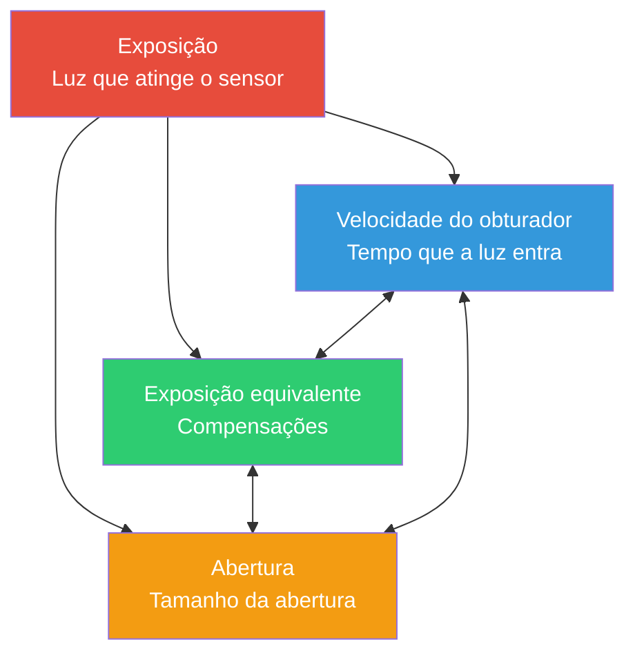

# Capítulo 13: Exposição

## O Triângulo de Exposição: Três Botões, Um Objetivo

Quando você tira uma foto com a câmera de um smartphone, você está capturando luz. A *quantidade* de luz que atinge o sensor determina se sua foto está muito escura (subexposta), muito clara (superexposta) ou correta (exposta corretamente). Três controles fundamentais regem isso — juntos, eles formam o **Triângulo de Exposição**.



**A ideia central:** Cada ponta do triângulo controla a luz, mas cada uma também introduz uma *compensação criativa*. Você pode obter a *mesma* exposição total com diferentes combinações das três configurações — mas cada combinação produz um *visual* diferente para sua fotografia.

Antes de mergulharmos nas especificidades da API Android Camera2 no próximo capítulo, vamos construir uma base intuitiva sólida para cada elemento.

---

## ISO: Sensibilidade do Sensor (Controle de Ganho)

Nos tempos do filme, o **ISO** descrevia a *sensibilidade da película à luz* — um filme ISO 100 era "lento" e precisava de luz brilhante, enquanto um filme ISO 800 era "rápido" e podia fotografar em interiores.

**Na fotografia digital (incluindo câmeras de smartphones), o ISO é o ganho do sensor / amplificação eletrônica.** Quando você dobra o valor do ISO, está efetivamente dobrando a amplificação aplicada ao sinal analógico do sensor antes de ele ser digitalizado.

### Como o ISO Funciona

Imagine os poços de pixels do sensor coletando fótons (partículas de luz). Após o término do período de exposição:

1. Cada pixel converte os fótons acumulados em uma pequena carga elétrica.
2. Um **amplificador de ganho analógico** multiplica esse sinal por um fator correspondente à sua configuração de ISO.
3. O sinal amplificado é convertido de analógico para digital (ADC).
4. O processamento digital aplica então um processamento adicional (redução de ruído, mapeamento de tons).

**ISO 100 = ganho base / mais baixo.** O sinal é amplificado minimamente, portanto:
- As fotos são *limpas* com ruído digital (grão) mínimo.
- O alcance dinâmico (diferença entre os tons mais claros e mais escuros graváveis) é maior.
- As cores são mais precisas.

**ISO 3200 = ganho alto.** O sinal é amplificado 32 vezes:
- Você pode fotografar em cenas mais escuras sem aumentar o tempo do obturador.
- Mas você obtém *ruído visível* (manchas coloridas, grãos de luminância).
- O alcance dinâmico e a precisão das cores degradam significativamente.

### Faixa Típica de ISO em Smartphones

| Faixa de ISO | Característica | Caso de Uso |
|-----------|---------------|----------|
| 50–200 | ISO base, imagem mais limpa | Luz do dia brilhante, iluminação de estúdio |
| 200–800 | Ganho moderado, ruído menor | Dia nublado, áreas sombreadas |
| 800–3200 | Ruído visível, ainda utilizável | Iluminação interna, entardecer |
| 3200–12800+ | Ruído intenso / redução de ruído pesada aplicada | Cenas noturnas, eventos com pouca luz |

> **Nota sobre a Realidade dos Smartphones:** Telefones topo de linha geralmente aplicam uma redução de ruído computacional pesada em valores altos de ISO (processamento de "modo noturno" específico do fabricante). Quando você desativa posteriormente o pipeline automático no Camera2, você *perde* muitas dessas otimizações dos OEMs — uma ressalva crítica à qual retornaremos no Capítulo 14.

---

## Velocidade do Obturador (Tempo de Exposição)

A **velocidade do obturador** é simplesmente *quanto tempo o sensor fica exposto à luz*. Nas câmeras tradicionais, um obturador mecânico abre e fecha fisicamente. Nos smartphones, é quase sempre um **obturador eletrônico** — o sensor é resetado, autorizado a coletar fótons por uma duração precisa e, em seguida, lido.

A velocidade do obturador é medida em **segundos**, normalmente expressa como frações:

| Velocidade do obturador | O que ela faz | Uso típico |
|--------------|-------------|-------------|
| 1/2000s – 1/1000s | Exposição muito curta, congela todo o movimento | Esportes, pássaros, veículos em movimento rápido |
| 1/500s – 1/250s | Congela o movimento humano típico | Pessoas caminhando, crianças brincando |
| 1/125s – 1/60s | Velocidade "segura" para as mãos com estabilização | Fotografia geral com mãos estáveis |
| 1/30s – 1/15s | Ligeiro borrão de movimento visível, precisa de tripé | Movimento criativo, pouca luz |
| 1s – 30s | Longa exposição, borrão de movimento intenso | Cachoeiras, trilhas de estrelas, água suave |
| 30s+ | Exposição ultra-longa (especializada) | Astrofotografia, pintura com luz |

### O Efeito de Borrão de Movimento (Motion Blur)

Existem **dois** motivos para escolher deliberadamente uma velocidade de obturador específica além de "luz suficiente":

1. **Congelar a ação:** Um pássaro em pleno voo a 1/1000s mostra cada pena nitidamente porque o pássaro se moveu quase zero de distância durante a exposição.

2. **Criar borrão de movimento:** Uma cachoeira em 2 segundos renderiza a água em movimento como trilhas brancas suaves e sedosas — porque cada gota de água percorreu muitos pixels no sensor enquanto ele estava exposto.

Pense nisso como uma pintura de longa exposição: *qualquer coisa que se mova enquanto o obturador está aberto torna-se um rastro.*

**Importante para vídeo:** Ao gravar vídeo a 30fps, cada quadro é exposto por no *máximo* ~1/30s. Cineastas seguem a **regra do obturador de 180°**: defina a velocidade do obturador para o dobro da taxa de quadros → 1/60s para vídeo a 30fps. Isso proporciona um borrão de movimento natural, "estilo filme", sem ser muito instável ou muito borrado.

---

## Abertura

A **abertura** é o tamanho do orifício na lente pelo qual a luz passa. É medida em **f-stops** (f/1.4, f/2.0, f/2.8, f/4.0, f/5.6, f/8.0, etc.) — uma *escala contraintuitiva onde números menores = abertura maior*.

```
  f/1.4     f/2.0     f/2.8     f/4.0     f/5.6     f/8.0
█████████████████████████████████████████████████████████
█████████████████                              █████████
███████████████                                  ███████
█████████████                                    ██████
████████████                                      █████
███████████                                      ██████
```

**Reduzindo a luz pela metade a cada stop:** Mover-se de f/1.4 → f/2.0 → f/2.8 → f/4.0 reduz a *área* da abertura pela metade a cada vez, portanto, metade da luz total passa. Isso é um "stop" mais escuro por passo.

### Compensações de Abertura (Criativas e Práticas)

1. **Profundidade de Campo (DoF):** Abertura ampla (f/1.8) = DoF *rasa* — apenas um plano estreito está em foco; tudo à frente/atrás fica borrado (bokeh). Abertura estreita (f/8) = DoF *profunda* — tudo, do primeiro plano ao fundo, está nítido.

2. **Captação de luz:** f/1.4 capta 4 vezes mais luz do que f/2.8. É por isso que as "lentes rápidas" (abertura máxima ampla) são valorizadas para fotografia com pouca luz.

3. **Difração:** Em aberturas muito estreitas (f/11+), as ondas de luz se curvam ao redor das lâminas da abertura, suavizando levemente a imagem. Isso geralmente é irrelevante em smartphones.

### Verificação da Realidade dos Smartphones

A maioria dos smartphones possui **lentes de abertura fixa** — você não pode alterar o f-stop. Telefones econômicos podem ter f/2.4–f/2.8; os topo de linha geralmente chegam a f/1.4–f/1.8. O [aplicativo Android Camera Parameters](https://play.google.com/store/apps/details?id=com.minininja.cameraparams) permite verificar a abertura fixa da sua lente em `CameraCharacteristics`.

Alguns telefones premium (ex: Samsung Galaxy S23 Ultra, série Xperia) oferecem um mecanismo de *abertura dupla* que alterna mecanicamente entre dois stops (ex: f/1.5 e f/2.4). No Camera2, consulte `LENS_INFO_AVAILABLE_APERTURES` para ver se o seu dispositivo suporta múltiplas aberturas.

**A conclusão prática:** Para a maior parte do desenvolvimento Android Camera2, a abertura é *fixa*, então você controla a exposição apenas via **ISO + velocidade do obturador**. Dois botões em vez de três — o que simplifica as coisas!

---

## EV: Valor de Exposição (A Escala Logarítmica)

Quando os fotógrafos dizem "ajuste em um stop", eles querem dizer **dobrar ou reduzir pela metade a luz total**. Para tornar o pensamento baseado em stops preciso, a indústria padronizou o **Valor de Exposição (EV)**.

O **EV 0** é definido como a combinação de exposição que produz um brilho de referência padrão: **1 segundo de exposição, abertura f/1.0, ISO 100**.

Cada **+1 EV dobra a luz** (mais claro). Cada **−1 EV reduz a luz pela metade** (mais escuro):

| Mudança de EV | Significado |
|-----------|---------|
| +3 EV | 8× mais luz (2³) |
| +2 EV | 4× mais luz |
| +1 EV | 2× mais luz |
| 0 EV | Referência: 1s @ f/1.0 ISO 100 |
| −1 EV | ½ da luz |
| −2 EV | ¼ da luz |
| −3 EV | ⅛ da luz |

A beleza disso: **qualquer combinação de ISO + obturador + abertura que resulte no mesmo valor de EV produz a mesma exposição total**. Este é o princípio da *exposição equivalente* que conecta as três pontas do triângulo.

### EV e Combinações de ISO/Obturador

Com abertura fixa, a equação do EV simplifica-se dramaticamente. Para um smartphone em f/1.8:

| Cena | EV Típico | Obturador ISO 100 | Obturador ISO 400 | Obturador ISO 1600 |
|-------|-----------|----------------|-----------------|------------------|
| Praia ensolarada brilhante | 15 | 1/4000s | 1/1000s | 1/250s |
| Dia nublado / com névoa | 12 | 1/500s | 1/125s | 1/30s |
| Escritório interno iluminado | 8 | 1/30s | 1/8s | 1/2s |
| Sala de estar à noite | 4 | 2s | 0.5s | 1/8s |
| Cena noturna estrelada | −2 | 30s | 8s | 2s |

### A Famosa Regra Sunny 16

Antes da medição matricial e de algoritmos sofisticados de exposição automática, os fotógrafos contavam com uma regra prática para acertar a exposição à luz do dia sem um medidor:

> **Em um dia ensolarado, ajuste a abertura para f/16 e a velocidade do obturador para 1/ISO segundos.**

| Sunny 16 (f/16) | Equivalente em f/1.8 (Smartphone) |
|-----------------|----------------------------------|
| ISO 100, 1/100s, f/16 → EV 15 | ISO 100, 1/4000s, f/1.8 → EV 15 ✓ |
| ISO 200, 1/200s, f/16 → EV 15 | ISO 200, 1/8000s, f/1.8 → EV 15 ✓ |

A matemática bate: f/1.8 é cerca de **6⅓ stops mais ampla** do que f/16. Cada stop quadruplica? Não — cada stop *dobra* a área de luz. 2^(6,33) ≈ 80× mais luz. Portanto, o obturador deve ser 80 vezes mais rápido para compensar: 1/100s ÷ 80 ≈ 1/8000s (em ISO 200). Perto o suficiente para o trabalho de campo.

---

## O Visual de Subexposta / Correta / Superexposta

Vamos comparar mentalmente três fotos da mesma cena (ex: uma pessoa ao ar livre com o céu ao fundo):

**Subexposta (−2 EV):** O assunto está muito escuro. As sombras são *esmagadas* para o preto puro, sem detalhes. Em um histograma, todos os dados se acumulam no lado esquerdo (escuro). O céu pode parecer bom, mas a pessoa aparece como uma silhueta. Você *pode* tentar "puxar" os dados brutos subexpostos no pós-processamento, mas as sombras revelarão um ruído intenso porque você está amplificando um sinal fraco.

**Exposição Correta (0 EV):** Os tons médios mostram a textura adequada. O rosto da pessoa tem detalhes de pele visíveis, rugas na camisa, reflexos nos olhos. O histograma tem dados espalhados por toda a faixa, sem cortes bruscos em nenhuma das extremidades. Em telefones com alcance dinâmico limitado, isso pode significar que *alguns* realces do céu brilhante sejam cortados para branco (sem detalhes azuis) — essa é uma compensação clássica em relação à subexposição do assunto.

**Superexposta (+2 EV):** Os realces estão *estourados* para o branco puro, sem possibilidade de recuperação. O céu é um campo plano branco uniforme; botões brilhantes da camisa e reflexos especulares são cortados. O rosto da pessoa pode parecer lisonjeiro (pele brilhante), mas você perdeu permanentemente todos os detalhes dos realces. Ao contrário das sombras subexpostas (que você muitas vezes pode recuperar parcialmente com ruído), *realces estourados desaparecem para sempre* — simplesmente não há dados nesses pixels.

**O Mantra do Fotógrafo:** *Exponha para os realces, recupere as sombras.* Na captura RAW (que cobriremos mais adiante), isso é especialmente poderoso porque o RAW de 14 bits armazena detalhes de sombra suficientes para puxar +2 EV ou mais sem ruído catastrófico.

---

## Tabela de Referência de EV do Mundo Real

Memorizar alguns valores de EV de referência permite estimar a exposição em qualquer lugar:

| Cena | EV Típico (em ISO 100) | Obturador aprox. @ f/1.8, ISO 400 |
|-------|------------------------|--------------------------------|
| Paisagem com neve sob sol direto | 16 | 1/4000s |
| Praia ensolarada, dia brilhante | 15 | 1/2000s |
| Dia ensolarado típico | 14 | 1/1000s |
| Dia nublado / encoberto | 12 | 1/250s |
| Muito nublado / chuva | 11 | 1/125s |
| Sombra aberta (pessoa na sombra, fundo ensolarado) | 9 | 1/30s |
| Pôr do sol / hora dourada | 7 | 1/8s |
| Escritório interno iluminado | 8 | 1/15s |
| Sala de estar doméstica, apenas luminárias | 4 | 1/2s |
| Interior de restaurante escuro | 2 | 2s |
| Rua da cidade à noite (letreiros de neon) | 1 | 4s |
| Paisagem noturna, luzes distantes da cidade | −2 | 30s |
| Paisagem ao luar (lua cheia) | −3 | 1 minuto |
| Céu estrelado, sem lua | −6 | 8 minutos |

Você pode verificar essas aproximações comparando com o que a exposição automática do seu telefone realmente escolhe. Inicie o [aplicativo Android Camera Parameters](https://github.com/zoozooll/AndroidCameraParameters), entre no Live Preview e observe `SENSOR_EXPOSURE_TIME` e `SENSOR_SENSITIVITY` enquanto caminha do sol brilhante para uma sala escura — você verá valores reais que mapeiam aproximadamente para esta tabela.

---

## Juntando Tudo: Exposições Equivalentes

Digamos que você queira a *mesma exposição total* (EV 12 = dia nublado, smartphone f/1.8). Aqui estão três combinações válidas que produzem brilho idêntico no sensor:

| Combinação | ISO | Velocidade do obturador | Visual e Sensação |
|-------------|-----|---------------|-------------|
| Limpa e Nítida | 100 | 1/500s | Ruído mais limpo, congelamento de movimento mais nítido |
| Meio-termo | 400 | 1/125s | Ruído menor, bom equilíbrio |
| Movimento Suave | 1600 | 1/30s | Ruído visível; leve borrão em assuntos em movimento |

Todas as três chegam ao mesmo EV. Todas as três *parecem igualmente brilhantes*. Mas a *textura* (grão de ruído) e a *representação do movimento* são completamente diferentes. **Essa é a arte da exposição.**

### E se você precisar de ambos?

É aqui que a fotografia computacional brilha. Um telefone no "modo noturno" não tira *uma* foto de 2 segundos — ele captura *dezenas* de quadros de 1/60s (congelando o movimento em cada um) e, em seguida, os alinha e faz a média computacionalmente. O resultado aproxima a captação de luz de uma longa exposição sem a penalidade do borrão de movimento.

Depois de entender a exposição manual no nível do Camera2, você mesmo poderá implementar técnicas como esta.

---

## Resumo

Neste capítulo, cobrimos os *fundamentos da fotografia* sem tocar em uma linha de código Android:

- **Triângulo de Exposição:** Velocidade do obturador (tempo), ISO (ganho do sensor) e Abertura (tamanho da abertura) combinam-se para controlar a luz total. Cada um tem uma compensação criativa.
- **ISO** na fotografia digital = ganho analógico do sensor. ISO baixo = limpo, ISO alto = ruidoso. Os smartphones normalmente suportam ISO 100–6400+ com redução de ruído dos fabricantes.
- **Velocidade do Obturador** é o tempo de exposição em segundos. Obturadores rápidos (1/1000s) congelam a ação; obturadores lentos (1s+) criam borrão de movimento. A regra do obturador de 180° se aplica ao vídeo.
- **Abertura** é a abertura da lente controlada por f-stop. A maioria dos smartphones possui abertura fixa, por isso contamos apenas com ISO + obturador.
- **EV (Exposure Value)** é a escala logarítmica de stops onde cada passo ±1 dobra/reduz pela metade a luz. EV 0 = 1s @ f/1.0 ISO 100.
- **Regra Sunny 16** e a tabela de referência de EV permitem que você estime as exposições sem medição.
- **A exposição correta** equilibra os detalhes dos tons médios, evitando sombras esmagadas e realces estourados. O RAW preserva a margem de recuperação.

## O Que Vem a Seguir

No **Capítulo 14: Exposição Manual no Camera2**, traduziremos todo este modelo conceitual em chamadas de API Camera2 concretas. Você aprenderá:

- Como desativar o pipeline de exposição automática (`CONTROL_MODE = OFF`, `CONTROL_AE_MODE = OFF`)
- Como traduzir valores de ISO para `SENSOR_SENSITIVITY`
- Como converter segundos legíveis por humanos ↔ nanossegundos para `SENSOR_EXPOSURE_TIME`
- Código Kotlin funcional e completo para exposição de timelapse fixa, exposição noturna longa e uma série de bracketing de exposição de 3 fotos.
- A ressalva crítica sobre a redução de ruído dos OEMs ser desativada quando você desliga o 3A.

Prepare-se — o código começa a seguir.
