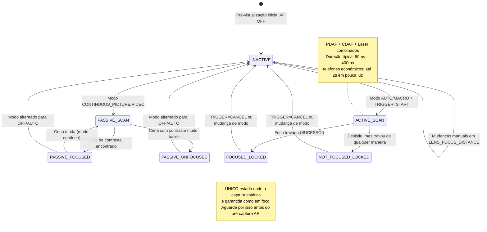

# Capítulo 15: Foco

A exposição controla o brilho. **O foco controla o que é nítido.** Uma foto perfeitamente exposta com foco suave é uma foto fracassada. Neste capítulo, você aprenderá como funcionam os sistemas de foco de smartphones, como conduzir o Foco Automático (AF) de forma confiável via Camera2 e como implementar um controle deslizante de foco manual suave usando `LENS_FOCUS_DISTANCE`.

O [aplicativo Android Camera Parameters](https://github.com/zoozooll/AndroidCameraParameters) demonstra tudo isso em seu painel de Foco — você pode assistir à transição da máquina de estados de AF ao vivo e arrastar o controle deslizante de foco manual para ver a lente se mover do infinito até a distância mínima de foco.

---

## Foco Automático (AF) em Smartphones Modernos

Antes de mergulhar nas especificidades da API, vamos entender os três mecanismos físicos de foco que os smartphones utilizam.

### 1. AF por Detecção de Contraste (CDAF) — Varredura Passiva

A técnica de software: analise o quadro da imagem, procure o contraste máximo nas bordas (bordas nítidas = frequência espacial mais alta) e mova a lente até encontrar o pico de contraste.

- **Vantagem:** Funciona em qualquer hardware de câmera (não precisa de pixels especiais)
- **Desvantagem:** Lento. A lente deve *caçar* (hunt) para frente e para trás em toda a faixa de foco. Rótulos de texto de cena como "AF SCANNING" no mapa de estados da Camera2 correspondem a isso.

### 2. AF por Detecção de Fase (PDAF) — Varredura Ativa

Fotodiodos especiais no sensor são divididos em duas metades. A diferença de fase entre as metades esquerda/direita mede diretamente *quão longe e em qual direção* a lente deve se mover — sem necessidade de "caça". Os telefones topo de linha de hoje usam o Dual-Pixel PDAF, onde *cada* pixel faz a detecção de fase.

- **Vantagem:** Extremamente rápido (trava em < 100ms em boa luz); funciona de forma confiável em vídeo
- **Desvantagem:** Dificuldade em pouca luz (não há fótons suficientes para computar a fase de forma confiável) e possui limites de distância mínima de foco.

### 3. Laser AF / ToF AF (Ativo) — Telêmetro

Um módulo de hardware dedicado dispara um pulso de laser infravermelho, cronometra a reflexão e informa diretamente a distância do assunto ao ISP. Muito comum em telefones de gama média a premium.

- **Vantagem:** Travamento ultrarrápido em qualquer alvo, mesmo na escuridão total (se o alvo refletir IR)
- **Desvantagem:** Alcance efetivo limitado (máximo de ~50cm–5m), falha em objetos de vidro ou transparentes ao IR.

Os telefones reais combinam **todos os três**: PDAF para travamento aproximado rápido, CDAF para ajuste fino e Laser AF para cenas com pouca luz ou close-ups. O Camera2 expõe esse pipeline unificado como uma única máquina de estados abstrata.

---

## Modos de AF: CONTROL_AF_MODE

O Camera2 define estes modos de AF em `CameraMetadata`:

| Modo (CONTROL_AF_MODE_*) | Comportamento | Caso de Uso |
|-------------------------|----------|----------|
| `OFF` | Sem AF. Você define `LENS_FOCUS_DISTANCE` manualmente. | Foco manual, empilhamento de foco, astrofotografia (trava no infinito) |
| `AUTO` | AF de disparo único. Não faz nada até você enviar `CONTROL_AF_TRIGGER = START`, então varre uma vez e trava. | Fotografia estática clássica de "apontar e disparar" |
| `MACRO` | Igual ao AUTO, mas tendencioso para detecção de assuntos próximos. | Close-ups, digitalização de documentos, "modo comida" |
| `CONTINUOUS_PICTURE` | Re-foca constantemente, mas **pausa a re-focagem quando você dispara uma captura estática** para evitar mudança de foco durante a foto. | Padrão para fotografia estática |
| `CONTINUOUS_VIDEO` | Re-foca constantemente — nunca pausa. Pode caçar visivelmente, mas mantém o vídeo em foco. | Gravação de vídeo, videochamadas |
| `EDOF` | Profundidade de Campo Estendida: foco profundo simulado por software/firmware. Sem movimento físico da lente. | Dispositivos econômicos sem atuadores de movimento de lente |

**Duas notas críticas:**

1. Dispositivos `EDOF` (telefones baratos, câmeras de selfie) têm um plano focal *fixo*. Você nunca receberá `FOCUSED_LOCKED` deles — o máximo que você consegue é `PASSIVE_SCAN` → `PASSIVE_FOCUSED` → `INACTIVE`. O [aplicativo Android Camera Parameters](https://play.google.com/store/apps/details?id=com.minininja.cameraparams) mostra explicitamente "Foco Fixo" para essas câmeras.

2. Modos `CONTINUOUS_*` retornam para `INACTIVE` após inatividade, em vez de permanecerem travados. Não espere `FOCUSED_LOCKED` no modo contínuo — isso é apenas para `AUTO`/`MACRO` + gatilho explícito.

---

## A Máquina de Estados de AF

O Camera2 relata o status do AF via `CaptureResult.CONTROL_AF_STATE`. Entender esses estados é *crucial* para sequências de captura estática confiáveis.



Tabela de referência de estados:

| CONTROL_AF_STATE | Significado | Próxima Ação |
|------------------|---------|-------------|
| `INACTIVE` (0) | AF desligado, ocioso ou modo contínuo sem varredura no momento | Se no modo AUTO: envie TRIGGER_START |
| `PASSIVE_SCAN` (1) | Modo contínuo está varrendo passivamente | Aguarde; não dispare a captura estática ainda |
| `PASSIVE_FOCUSED` (2) | Contínuo encontrou foco, mas NÃO travado (pode flutuar) | Seguro disparar estática em CONTINUOUS_PICTURE (ele travará) |
| `ACTIVE_SCAN` (3) | Gatilho explícito iniciou uma varredura | Apenas aguarde... |
| `NOT_FOCUSED_LOCKED` (4) | Falha ao encontrar foco, mas a lente está travada de qualquer maneira | Aviso ao usuário; opcionalmente tente novamente ou capture assim mesmo |
| `FOCUSED_LOCKED` (5) | **SUCESSO.** Foco encontrado e travado por hardware. | Prossiga imediatamente para o gatilho de pré-captura AE |
| `PASSIVE_UNFOCUSED` (6) | Contínuo não conseguiu travar, ainda varrendo | Melhore a iluminação ou use um alvo diferente |

**Regra inegociável para fotografia estática:** *Nunca* envie uma captura estática (especialmente com flash!) até ver `FOCUSED_LOCKED`. Pule esta etapa e você entregará um aplicativo que produz intermitentemente fotos suaves.

---

## Distância de Foco: Dioptrias, Não Metros

Aqui está a segunda "pegadinha" que confunde os desenvolvedores da Camera2 (após a surpresa do obturador em nanossegundos):

**`LENS_FOCUS_DISTANCE` usa dioptrias (D), não metros.** As dioptrias são o *recíproco matemático* da distância de foco:

```
Distância de Foco (metros) = 1.0 / Dioptrias
Dioptrias = 1.0 / Distância de Foco (metros)
```

| Dioptrias (LENS_FOCUS_DISTANCE) | Distância de Foco Física |
|--------------------------------|-------------------------|
| **0.0** | **Infinito** (∞) — estrelas, montanhas distantes |
| 0.1 | 10 metros |
| 0.25 | 4 metros |
| 0.5 | 2 metros |
| 1.0 | 1 metro |
| 2.0 | 0.5 metro (50 cm) |
| 5.0 | 0.2 metro (20 cm) |
| 10.0 | 0.1 metro (10 cm) |
| 20.0 | 0.05 metro (5 cm) |

Por que dioptrias? Porque o atuador da lente se move linearmente com a *potência óptica*, não com a distância física. Uma varredura de foco de 0.0D → 20.0D corresponde a um movimento uniforme da lente, enquanto uma varredura de "metros" de 10m → 5cm seria altamente não linear.

### Consultar a Distância Mínima de Foco

Cada lente tem uma distância de foco mais próxima (você não pode focar fisicamente um objeto pressionado contra o vidro). Consulte-a:

```kotlin
// Valor máximo de dioptria útil para esta lente
val maxDiopters = characteristics.get(
    CameraCharacteristics.LENS_INFO_MINIMUM_FOCUS_DISTANCE
) ?: 0.0f // 0.0f = lente EDOF de foco fixo (sem controle de foco!)

if (maxDiopters == 0.0f) {
    Log.w("Focus", "Esta é uma lente de foco fixo. AF manual desativado.")
} else {
    // A faixa de dioptria válida é [0.0f .. maxDiopters]
    Log.d("Focus", "Faixa de foco: 0.0D (inf) → $maxDiopters D (${1/maxDiopters}m perto)")
}
```

Valores típicos:
- Câmera traseira de telefone econômico: ~10D (foco mínimo de 10 cm)
- Câmera wide topo de linha: ~15–25D (4–7 cm mínimo)
- Câmera macro: ~30–50D (2–3 cm mínimo)
- Câmera selfie frontal: Frequentemente 0.0D (foco fixo, EDOF)

### Distância Hiperfocal (Conceito)

Fotógrafos de paisagem adoram isso: ajuste o foco para a **distância hiperfocal** e tudo, desde a metade dessa distância até o infinito, ficará "aceitavelmente nítido". Em um telefone com abertura f/1.8 e uma lente wide padrão, a hiperfocal é de aproximadamente 0,5–1,0 metro.

**Regra geral para smartphones:** Ajustar `LENS_FOCUS_DISTANCE = 2.0D` (distância de foco de 50 cm) aproxima a hiperfocal na maioria das lentes wide de telefone. Bom para fotografia de paisagem e de rua onde você não quer esperar pelo AF.

```kotlin
// Pré-configuração de hiperfocal "tudo nítido"
const val HYPERFOCAL_DIOPTERS_APPROX = 2.0f

fun setHyperfocal(builder: CaptureRequest.Builder, characteristics: CameraCharacteristics) {
    val maxD = characteristics.get(
        CameraCharacteristics.LENS_INFO_MINIMUM_FOCUS_DISTANCE
    ) ?: 0.0f
    val diopters = min(HYPERFOCAL_DIOPTERS_APPROX, maxD.takeIf { it > 0 } ?: 0.0f)
    builder.set(CaptureRequest.CONTROL_AF_MODE, CameraMetadata.CONTROL_AF_MODE_OFF)
    builder.set(CaptureRequest.LENS_FOCUS_DISTANCE, diopters)
}
```

Quer calcular a hiperfocal precisa para sua lente exata? Você também precisará de `LENS_INFO_AVAILABLE_FOCAL_LENGTHS` (distância focal em mm) e o tamanho físico do pixel do sensor. Para 95% dos casos de uso de smartphones, 2.0D é próximo o suficiente.

---

## Exemplo Completo 1: Gatilho de AF de Disparo Único e Captura

Este é o fluxo básico de fotografia estática para o modo `AUTO` / `MACRO`. É também a sequência exata que a orquestração 3A no Capítulo 17 reutilizará.

**Objetivo:** Usuário toca em "Capturar" → conduz o AF até o foco travado → uma vez travado, envia a captura estática.

```kotlin
class AutoFocusCaptureHelper(
    private val characteristics: CameraCharacteristics,
    private val captureSession: CameraCaptureSession,
    private val previewSurface: Surface,
    private val jpegReaderSurface: Surface
) {
    private var afTriggered = false
    private var capturePlanned = false

    fun triggerAutoFocusAndCapture(onCaptureComplete: () -> Unit) {
        // ---- PASSO 1: Construir solicitação repetida com gatilho de AF explícito ----
        val triggerRequest = captureSession.device.createCaptureRequest(
            CameraDevice.TEMPLATE_PREVIEW
        ).apply {
            addTarget(previewSurface)

            // Use o modo AUTO para garantir o estado LOCKED ao final
            set(CaptureRequest.CONTROL_AF_MODE,
                CameraMetadata.CONTROL_AF_MODE_AUTO)

            // Dispare o gatilho de AF de disparo único AGORA
            set(CaptureRequest.CONTROL_AF_TRIGGER,
                CameraMetadata.CONTROL_AF_TRIGGER_START)
        }

        afTriggered = true
        capturePlanned = true

        // ---- PASSO 2: Inscrever nosso callback de rastreamento de estado ----
        captureSession.setRepeatingRequest(
            triggerRequest.build(),
            object : CameraCaptureSession.CaptureCallback() {
                override fun onCaptureCompleted(
                    session: CameraCaptureSession,
                    request: CaptureRequest,
                    result: TotalCaptureResult
                ) {
                    val afState = result.get(CaptureResult.CONTROL_AF_STATE)
                        ?: return
                    Log.d("AF", "Estado AF: $afState")

                    when (afState) {
                        // --- CAMINHO DE SUCESSO ---
                        CaptureResult.CONTROL_AF_STATE_FOCUSED_LOCKED -> {
                            if (capturePlanned) {
                                capturePlanned = false
                                submitStillCapture()
                                onCaptureComplete()
                            }
                        }
                        // --- CAMINHO DE FALHA: não pôde travar, mas tentaremos de qualquer maneira ---
                        CaptureResult.CONTROL_AF_STATE_NOT_FOCUSED_LOCKED -> {
                            Log.w("AF", "AF não pôde travar — capturando de qualquer maneira (borrado?)")
                            if (capturePlanned) {
                                capturePlanned = false
                                submitStillCapture()
                                onCaptureComplete()
                            }
                        }
                        // --- AINDA VARRENDO: ignore ---
                        CaptureResult.CONTROL_AF_STATE_ACTIVE_SCAN,
                        CaptureResult.CONTROL_AF_STATE_PASSIVE_SCAN -> {
                            // Ainda trabalhando, não faça nada ainda
                        }
                    }
                }
            },
            null // Handler no thread atual
        )
    }

    private fun submitStillCapture() {
        val stillRequest = captureSession.device.createCaptureRequest(
            CameraDevice.TEMPLATE_STILL_CAPTURE
        ).apply {
            addTarget(previewSurface)
            addTarget(jpegReaderSurface)

            // Mantenha o AF travado para esta foto — NÃO solte o gatilho ainda
            set(CaptureRequest.CONTROL_AF_MODE,
                CameraMetadata.CONTROL_AF_MODE_AUTO)
            // Deixe AF_TRIGGER como está (START permanece até cancelarmos explicitamente)

            set(CaptureRequest.JPEG_QUALITY, 95)
        }

        captureSession.capture(
            stillRequest.build(),
            object : CameraCaptureSession.CaptureCallback() {
                override fun onCaptureCompleted(
                    session: CameraCaptureSession,
                    request: CaptureRequest,
                    result: TotalCaptureResult
                ) {
                    // Foto capturada — agora solte a trava de AF, volte ao contínuo
                    resetFocusToContinuous()
                }
            },
            null
        )
    }

    private fun resetFocusToContinuous() {
        val resumePreview = captureSession.device.createCaptureRequest(
            CameraDevice.TEMPLATE_PREVIEW
        ).apply {
            addTarget(previewSurface)
            set(CaptureRequest.CONTROL_AF_MODE,
                CameraMetadata.CONTROL_AF_MODE_CONTINUOUS_PICTURE)
            set(CaptureRequest.CONTROL_AF_TRIGGER,
                CameraMetadata.CONTROL_AF_TRIGGER_CANCEL)
        }
        afTriggered = false
        captureSession.setRepeatingRequest(resumePreview.build(), null, null)
    }
}
```

**Detalhe crítico:** Você cancela o gatilho *depois* que a captura estática é concluída — não antes. Cancele muito cedo e a lente destrava durante a foto, produzindo uma foto suave.

**Proteção contra timeout (não mostrada):** Aplicativos reais adicionam um timeout de 2 a 3 segundos na varredura de AF. Se o `ACTIVE_SCAN` rodar por 3 segundos e nunca atingir `FOCUSED_LOCKED`, cancele e exiba uma dica de usuário "Toque para focar em uma área de alto contraste".

---

## Exemplo Completo 2: Controle Deslizante SeekBar de Foco Manual

Este é o recurso de Foco Manual voltado para o usuário que você viu em aplicativos de câmera profissionais. Um SeekBar mapeia a faixa de foco física de 0.0D → maxD suavemente.

### Layout (res/layout/fragment_manual_focus.xml)

```xml
<LinearLayout
    xmlns:android="http://schemas.android.com/apk/res/android"
    android:layout_width="match_parent"
    android:layout_height="wrap_content"
    android:orientation="vertical"
    android:padding="16dp">

    <TextView
        android:id="@+id/tvFocusLabel"
        android:layout_width="match_parent"
        android:layout_height="wrap_content"
        android:text="Foco: ∞ (infinito)"
        android:textSize="14sp"/>

    <SeekBar
        android:id="@+id/seekFocus"
        android:layout_width="match_parent"
        android:layout_height="wrap_content"
        android:max="1000"/>
</LinearLayout>
```

### Kotlin: Ligação de Fragment / Activity

```kotlin
class ManualFocusController(
    private val seekBar: SeekBar,
    private val labelView: TextView,
    private val characteristics: CameraCharacteristics,
    private val captureSessionProvider: () -> CameraCaptureSession?,
    private val previewSurface: Surface
) {
    // O controle deslizante usa 1000 passos inteiros para precisão sub-dioptria
    private val sliderSteps = 1000
    private val maxDiopters = characteristics.get(
        CameraCharacteristics.LENS_INFO_MINIMUM_FOCUS_DISTANCE
    ) ?: 0.0f

    private var currentDiopters = 0.0f

    init {
        if (maxDiopters == 0.0f) {
            seekBar.isEnabled = false
            labelView.text = "Foco Fixo (Sem AF manual)"
        } else {
            bindSeekBar()
            applyFocus(0.0f) // Começa no infinito
        }
    }

    private fun bindSeekBar() {
        // Converter int do slider [0..1000] ↔ dioptrias [0.0 .. maxDiopters]
        seekBar.setOnSeekBarChangeListener(object : SeekBar.OnSeekBarChangeListener {
            private var lastUpdate = 0L

            override fun onProgressChanged(seekBar: SeekBar, progress: Int, fromUser: Boolean) {
                if (!fromUser) return

                // Limitar a ~30fps (33ms) — evita sobrecarregar o HAL com solicitações
                val now = SystemClock.elapsedRealtime()
                if (now - lastUpdate < 33L) return
                lastUpdate = now

                val diopters = progress.toFloat() / sliderSteps.toFloat() * maxDiopters
                applyFocus(diopters)
            }
            override fun onStartTrackingTouch(seekBar: SeekBar) {
                // Alternar para o modo AF manual total imediatamente quando o usuário começa a arrastar
                switchToManualMode()
            }
            override fun onStopTrackingTouch(seekBar: SeekBar) {
                // Aplicar valor exato final para remover erro de limitação (throttle)
                val diopters = seekBar.progress.toFloat() / sliderSteps.toFloat() * maxDiopters
                applyFocus(diopters, force = true)
            }
        })
    }

    private fun switchToManualMode() {
        // CONTROL_AF_MODE_OFF desativa a condução automática do motor de AF
        val session = captureSessionProvider() ?: return
        val request = session.device.createCaptureRequest(
            CameraDevice.TEMPLATE_PREVIEW
        ).apply {
            addTarget(previewSurface)
            set(CaptureRequest.CONTROL_AF_MODE, CameraMetadata.CONTROL_AF_MODE_OFF)
            set(CaptureRequest.CONTROL_MODE, CameraMetadata.CONTROL_MODE_USE_SCENE_MODE)
        }
        session.setRepeatingRequest(request.build(), null, null)
    }

    fun applyFocus(diopters: Float, force: Boolean = false) {
        currentDiopters = diopters.coerceIn(0.0f, maxDiopters)

        // Atualizar rótulo: mostrar "∞" para < 0.1D, "X.Y m" caso contrário
        labelView.text = when {
            currentDiopters < 0.1f -> "Foco: ∞ (infinito)"
            else -> {
                val meters = 1.0f / currentDiopters
                String.format("Foco: %.1f D  (%.2f m)", currentDiopters, meters)
            }
        }

        // Construir e enviar uma solicitação repetida com a nova distância de foco
        val session = captureSessionProvider() ?: return
        val request = session.device.createCaptureRequest(
            CameraDevice.TEMPLATE_PREVIEW
        ).apply {
            addTarget(previewSurface)
            set(CaptureRequest.CONTROL_AF_MODE, CameraMetadata.CONTROL_AF_MODE_OFF)
            set(CaptureRequest.LENS_FOCUS_DISTANCE, currentDiopters)
        }

        // Use setRepeatingRequest para que cada quadro de pré-visualização respeite o novo foco
        session.setRepeatingRequest(request.build(), null, null)
    }

    // --- Auxiliares de predefinição ---
    fun setInfinity() { seekBar.progress = 0; applyFocus(0.0f, true) }
    fun setHyperfocalApprox() {
        val d = min(2.0f, maxDiopters)
        seekBar.progress = (d / maxDiopters * sliderSteps).toInt()
        switchToManualMode()
        applyFocus(d, true)
    }
    fun setNearest() { seekBar.progress = sliderSteps; applyFocus(maxDiopters, true) }
}
```

**Detalhes principais da implementação:**

1. **Limitação (Throttle).** Os SeekBars disparam `onProgressChanged` até 200Hz. Enviar um `setRepeatingRequest` em cada evento inunda o HAL de trabalho, causando atraso. Um limite de 33ms restringe as atualizações a ~30fps — bastante suave para a velocidade física do motor da lente.

2. **Mudar para CONTROL_AF_MODE_OFF cedo.** Se você estiver em `CONTINUOUS_PICTURE` e definir `LENS_FOCUS_DISTANCE` sem desativar o AF, o algoritmo de AF irá *lutar contra você* — voltando o foco para o que ele acha correto um quadro depois. A mudança deve acontecer primeiro, em `onStartTrackingTouch`.

3. **Atualizar via `setRepeatingRequest`**, não em uma única `capture()`. O foco manual precisa permanecer em *cada* quadro de pré-visualização até que o usuário mova o controle deslizante novamente.

4. **Aplicar à força ao soltar.** O limitador ignora posições intermediárias; quando o usuário levanta o dedo, aplique o valor final exato do controle deslizante.

---

## Regiões de Foco (Tocar para Focar)

Aplicativos de câmera modernos permitem *tocar no visor* para escolher um alvo de foco. O Camera2 implementa isso via `CONTROL_AF_REGIONS` — uma lista de retângulos (no espaço de coordenadas do active-array) com pesos.

```kotlin
// Converter um toque no Visor (x,y) em uma região de coordenadas do Sensor
fun createTapFocusRegion(viewfinderWidth: Int, viewfinderHeight: Int,
                         tapX: Float, tapY: Float,
                         characteristics: CameraCharacteristics): MeteringRectangle {
    val activeArray = characteristics.get(
        CameraCharacteristics.SENSOR_INFO_ACTIVE_ARRAY_SIZE
    )!!
    // Normalizar o toque [0..1] em cada eixo
    val nx = tapX / viewfinderWidth.toFloat()
    val ny = tapY / viewfinderHeight.toFloat()
    // Mapear para o array ativo do sensor, criar uma região de 200×200 centrada no toque
    val cx = (nx * activeArray.width()).toInt()
    val cy = (ny * activeArray.height()).toInt()
    val rSize = 200
    return MeteringRectangle(
        max(0, cx - rSize/2), max(0, cy - rSize/2),
        rSize, rSize,
        MeteringRectangle.METERING_WEIGHT_MAX
    )
}

// Anexar região a um construtor de solicitação
fun applyTapFocus(builder: CaptureRequest.Builder, region: MeteringRectangle) {
    builder.set(CaptureRequest.CONTROL_AF_REGIONS, arrayOf(region))
    builder.set(CaptureRequest.CONTROL_AE_REGIONS, arrayOf(region)) // Acoplar ponto de AE também!
    builder.set(CaptureRequest.CONTROL_AF_TRIGGER,
        CameraMetadata.CONTROL_AF_TRIGGER_CANCEL) // Cancelar qualquer trava anterior
    builder.set(CaptureRequest.CONTROL_AF_TRIGGER,
        CameraMetadata.CONTROL_AF_TRIGGER_START)  // Disparar varredura na nova região
}
```

**Dica profissional:** Sempre acople `CONTROL_AE_REGIONS` para corresponder a `CONTROL_AF_REGIONS`. O usuário tocou em um rosto porque quer que esse rosto esteja *tanto* em foco *quanto* exposto corretamente — não focado no rosto, mas medido com base no céu brilhante atrás dele.

---

## Solução de Problemas de Foco

| Sintoma | Causa Raiz | Correção |
|---------|-----------|-----|
| O estado de AF nunca passa de ACTIVE_SCAN | Cena de baixo contraste (parede branca, céu azul puro) ou falha de hardware | Timeout após ~3s; avisar o usuário; reverter para predefinição hiperfocal |
| O controle deslizante de foco manual não faz nada | Esqueceu de definir `CONTROL_AF_MODE = OFF` → o AF está lutando contra você | Chame `switchToManualMode()` no onStartTrackingTouch |
| A captura estática sai borrada apesar de FOCUSED_LOCKED | Gatilho de AF cancelado *antes* da conclusão da captura estática | Cancele apenas em `onCaptureCompleted` da solicitação *estática* |
| A câmera frontal ignora comandos de foco | Lente EDOF de foco fixo (`MINIMUM_FOCUS_DISTANCE == 0`) | Degradação graciosa: desativar a UI de foco para essa câmera |
| O AF de vídeo "caça" muito | Usando `CONTINUOUS_PICTURE` em vez de `CONTINUOUS_VIDEO` para gravação de vídeo | Mude o modo para CONTINUOUS_VIDEO quando o MediaRecorder iniciar |

---

## Resumo

O foco no Camera2 é uma máquina de estados que você deve conduzir explicitamente, não uma configuração de "definir e esquecer":

- **Hardware de AF:** Os smartphones combinam AF por Detecção de Contraste, AF por Detecção de Fase (Dual-Pixel) e Laser AF para travamentos rápidos e confiáveis.
- **Modos:** `AUTO` (disparo único, trava), `CONTINUOUS_PICTURE` (refoca, pausa para fotos), `CONTINUOUS_VIDEO` (sempre refocando), `MACRO`, `OFF` (manual). Lentes EDOF não têm movimento de foco.
- **Estados:** Aguarde por `FOCUSED_LOCKED` (não apenas `PASSIVE_FOCUSED`) antes de capturas estáticas de alto valor.
- **Dioptrias:** `LENS_FOCUS_DISTANCE` usa a distância recíproca (0.0D = ∞, 10D = 10 cm). A faixa é `[0.0 .. LENS_INFO_MINIMUM_FOCUS_DISTANCE]`.
- **Captura AF de disparo único:** `TRIGGER = START` → aguarde `FOCUSED_LOCKED` → envie a captura estática → depois `CANCEL`.
- **Controle deslizante de foco manual:** SeekBar com 1000 passos, limitado a 30fps; mude o modo para `AF_MODE_OFF` primeiro para que o algoritmo automático não lute contra sua configuração manual.
- **Tocar para Focar usa `CONTROL_AF_REGIONS`** em coordenadas do active-array do sensor. Acople com `AE_REGIONS` para resultados profissionais.

## O Que Vem a Seguir

Brilho ✓ Nitidez ✓. Agora vamos ajustar a **cor**. No **Capítulo 16: Balanço de Branco e Cor**, cobrimos:

- Balanço de Branco Automático (AWB) e as 7 predefinições (Incandescente → Sombra)
- Correção de cor manual com `COLOR_CORRECTION_GAINS` (4 canais R/G/B/G) e `COLOR_CORRECTION_TRANSFORM` (matriz RGB 3×3)
- Conceito de temperatura de cor (vela 2000K → sombra 10000K) e como ela mapeia para o balanço de branco
- Código funcional para uma predefinição de "aparência de pôr do sol" em tons quentes e modo AWB manual total desligado

A cor é a última perna da trilogia de controles manuais.
