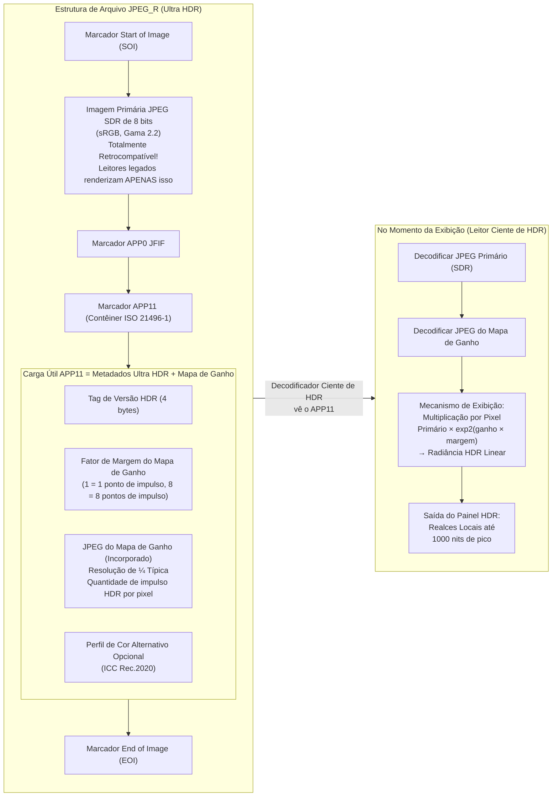

# Capítulo 21: HDR e Ultra HDR

A fotografia de Alcance Dinâmico Padrão (SDR) — sRGB de 8 bits por canal codificado com uma curva gama 2.2 e masterizado para monitores de 100 nits — foi projetada para os CRTs dos anos 90. Os sensores de smartphones modernos capturam **10 a 14 pontos (stops) de alcance dinâmico** (contraste de cena de 1024:1 a 16384:1), mas um JPEG SDR de 8 bits só consegue renderizar ~6 pontos antes de estourar os realces ou esmagar as sombras em ruído. Os formatos de **Alto Alcance Dinâmico (HDR)** resolvem isso armazenando a radiância da cena em 10 ou mais bits por canal, usando funções de transferência perceptualmente uniformes ou referenciadas à cena, e visando luminosidades de pico de exibição de 1.000 a 10.000 nits em vez de 100.

Este capítulo cobre três padrões HDR funcionais no Android Camera2:
- **HDR10** (10 bits, ST.2084 PQ, Rec.2020, metadados estáticos) para vídeo.
- **HLG (Hybrid Log-Gamma)** (10 bits, retrocompatível com SDR, ARIB STD-B67) para transmissão e vídeo.
- **JPEG_R / Ultra HDR** (Android 14 API 34+, ISO 21496-1) — o revolucionário formato de foto estática que incorpora um "mapa de ganho" secundário dentro de um JPEG SDR de 8 bits padrão para que leitores legados vejam uma foto normal, enquanto monitores HDR aumentam localmente os realces em até 8 pontos.

Todos os três estão documentados nas seções *Ultra HDR / JPEG_R* e *Dynamic Range* do documento de pesquisa do projeto, que também especifica o mandato da Classe de Desempenho 15 do CDD (Compatibility Definition Document) do Android, determinando que todos os dispositivos flagship de 2024+ devem expor o JPEG_R como um formato de saída no tamanho máximo de captura de foto. Você pode verificar o suporte a HDR10, HLG e JPEG_R por ID de câmera no aplicativo [Android Camera Parameters](https://github.com/zoozooll/AndroidCameraParameters) na [Play Store](https://play.google.com/store/apps/details?id=com.zoozooll.cameraparameters), que enumera cada chave de `DynamicRangeProfiles` e relata se o `ImageFormat.JPEG_R` aparece em `getOutputSizes()`.

## Fundamentos do Alcance Dinâmico: Por Que 8 Bits Não São Suficientes

Antes de mergulhar em formatos específicos, vamos definir o que significa "alcance dinâmico" para exibição versus captura:

| Métrica | SDR (sRGB/BT.709) | HDR10 (BT.2100) | Visão Humana |
|--------|-------------------|------------------|--------------|
| **Profundidade de bits** | 8 bits / canal (256 níveis) | 10 bits / canal (1024 níveis) | ~4,8 bits perceptuais, mas logarítmicos |
| **Luminância de pico** | 100 nits (cd/m²) | 1.000+ nits de pico (dependente do conteúdo) | ~20.000 nits (sol+céu) a ~0,001 nits (sala escura) |
| **Função de transferência** | Gama 2.2 ou sRGB por partes | ST.2084 Perceptual Quantizer (PQ) | Resposta logarítmica (lei de Weber-Fechner) |
| **Gama de cores (Gamut)** | sRGB / BT.709 (~35% do visível) | Rec.2020 (~75% do visível) | Espectro visível completo |
| **Taxa de contraste (utilizável)** | ~6 pontos (64:1) | ~10 pontos (1024:1) no mínimo | ~14 pontos (16384:1) em uma única cena |

A curva gama usada pelo SDR foi projetada para corresponder à não linearidade do canhão de elétrons dos CRTs dos anos 90, não ao sistema visual humano. A curva PQ (Perceptual Quantizer) usada pelo HDR10 foi padronizada em 2014 pela Dolby e pela BBC sob a norma ST.2084, e é matematicamente ajustada ao modelo Barten de sensibilidade ao contraste humano — de modo que cada um dos 1.024 valores de código em PQ de 10 bits representa uma diferença apenas perceptível (JND) no brilho em toda a faixa de 0 a 10.000 nits.

```mermaid
flowchart TD
    subgraph SDRpath["Caminho de Captura SDR 8-bit → Pipeline de Exibição"]
        S1["Sensor Linear<br/>RAW de 14 bits"] --> S2["Curva Gama 2.2<br/>(Destrói detalhes das sombras)"]
        S2 --> S3["Quantização de 8 bits<br/>(Apenas 22 códigos para<br/>0–10% de luminância)"]
        S3 --> S4["Corte do Gamut sRGB<br/>(25% das cores perdidas)"]
        S4 --> S5["Pico de 100 nits<br/>(Céu/Sol cortados para branco)"]
    end

    subgraph HDRpath["Caminho de Captura HDR10 10-bit → Pipeline de Exibição"]
        H1["Sensor Linear<br/>RAW de 14 bits"] --> H2["Curva PQ ST.2084<br/>(Ajusta-se ao modelo JND)"]
        H2 --> H3["Quantização de 10 bits<br/>(140 códigos para<br/>0–10% de luminância)"]
        H3 --> H4["Gamut Rec.2020<br/>(75% das cores visíveis)"]
        H4 --> H5["Pico de 1000+ nits<br/>(Detalhes do céu preservados)"]
    end

    style SDRpath fill:#ffeded,stroke:#b91c1c
    style HDRpath fill:#e8fff0,stroke:#15803d
```



O diagrama Mermaid acima quantifica as duas diferenças mais importantes: o SDR usa apenas ~22 códigos de 8 bits para os 10% inferiores de luminância (causando listras nas sombras quando aumentadas), enquanto o PQ aloca 140 códigos de 10 bits para a mesma faixa. A uniformidade perceptual da curva PQ é a razão pela qual o HDR de 10 bits parece mais suave do que o SDR de 8 bits, mesmo quando subamostrado para 100 nits em um monitor SDR.

## Vídeo HDR10: PQ de 10 bits + Rec.2020 + Metadados Estáticos

O HDR10 é o formato de vídeo HDR de linha de base — todo smartphone de 2021+ com tela OLED suporta a reprodução de HDR10, e todo SoC Snapdragon 865+ / Exynos 2100+ suporta a gravação de HDR10 via Camera2. O formato especifica:

- Codificação **HEVC Main10 Profile** (H.265) com amostras de 10 bits.
- Função de transferência **ST.2084 PQ** no lugar da gama.
- Primárias de cor **Rec.2020 (BT.2100)** (ampla gama de cores).
- **Metadados estáticos** (SMPTE ST 2086 / CTA-861.3) na mensagem HEVC SEI:
  - `max_content_light_level` (MaxCLL): luminância de pico de qualquer pixel individual, em nits.
  - `max_frame_average_light_level` (MaxFALL): luminância média do quadro mais brilhante.
  - `display_primaries` e `white_point`: volume de cor do monitor de masterização.
  - `max_luminance` / `min_luminance`: pico de luminância e nível de preto do monitor de masterização.

Metadados estáticos significam que exatamente um conjunto de valores se aplica a toda a duração do vídeo. A variante de metadados dinâmicos (HDR10+, alternativa da Samsung ao Dolby Vision) não é exposta através do Camera2 padrão — ela requer extensões do fabricante — mas os metadados estáticos HDR10 são universalmente suportados via `DynamicRangeProfiles`.

### Consultando o Suporte a HDR10 e HLG via DynamicRangeProfiles

O Android 13 (API 33) introduziu `CameraCharacteristics.REQUEST_AVAILABLE_DYNAMIC_RANGE_PROFILES` como uma alternativa estruturada para verificar manualmente o suporte ao formato de 10 bits no `StreamConfigurationMap`. Cada superfície de saída tem um perfil escolhido no momento da criação da sessão:

```kotlin
import android.hardware.camera2.CameraCharacteristics
import android.hardware.camera2.params.DynamicRangeProfiles
import android.util.Size

data class HdrVideoProfile(
    val profile: Long, // DynamicRangeProfiles.HDR10, HLG10, etc.
    val supportedSizes: List<Size>,
    val standardSizesFallbacks: List<Size>
)

fun enumerateHdrProfiles(
    characteristics: CameraCharacteristics
): List<HdrVideoProfile> {
    val profiles: DynamicRangeProfiles? =
        characteristics.get(
            CameraCharacteristics.REQUEST_AVAILABLE_DYNAMIC_RANGE_PROFILES
        ) ?: return emptyList()

    val configMap = characteristics.get(
        CameraCharacteristics.SCALER_STREAM_CONFIGURATION_MAP
    ) ?: return emptyList()

    return listOf(
        DynamicRangeProfiles.HDR10,
        DynamicRangeProfiles.HLG,
        DynamicRangeProfiles.HDR10_PLUS, // Frequentemente nulo em dispositivos não-Samsung
        DynamicRangeProfiles.DOLBY_VISION_10B_HDR_OEM // Requer licença Dolby
    ).mapNotNull { profile ->
        if (!profiles.isProfileSupported(profile)) return@mapNotNull null

        val hdrSizes = profiles.getProfileSupportedSizes(profile)
            ?.toList() ?: emptyList()
        val sdrFallbackSizes = configMap.getOutputSizes(
            android.graphics.ImageFormat.PRIVATE
        )?.toList() ?: emptyList()

        HdrVideoProfile(profile, hdrSizes, sdrFallbackSizes)
    }
}
```

O método `DynamicRangeProfiles.getProfileSupportedSizes(profile)` retorna a *interseção* dos tamanhos compatíveis com 10 bits e o suporte ao pipeline HDR do ISP. Se o `Size(3840, 2160)` (4K UHD) não aparecer em `getProfileSupportedSizes(HDR10)`, então, mesmo que o 4K SDR seja suportado, o HAL não tem rendimento de ISP suficiente para codificação 4K HDR10 (geralmente um limite de 600 Mpixel/seg na série Snapdragon 8). O aplicativo Android Camera Parameters renderiza essa tabela de interseção na aba HDR para que você possa verificar antes de escrever o código da sessão.

### Definindo HDR10 na OutputConfiguration para Gravação

O perfil de alcance dinâmico deve ser definido **antes que a sessão seja criada** via `OutputConfiguration.setDynamicRangeProfile()`. Alterar o perfil no meio da sessão requer desmontar e recriar a sessão.

```kotlin
import android.hardware.camera2.params.DynamicRangeProfiles
import android.hardware.camera2.params.OutputConfiguration
import android.media.MediaCodec
import android.media.MediaCodecInfo
import android.view.Surface

fun createHdr10VideoOutput(
    encoderSurface: Surface,
    previewSurface: Surface
): Pair<OutputConfiguration, OutputConfiguration> {
    val encodeOutConfig = OutputConfiguration(encoderSurface).apply {
        setDynamicRangeProfile(DynamicRangeProfiles.HDR10)
    }
    val previewOutConfig = OutputConfiguration(previewSurface).apply {
        setDynamicRangeProfile(DynamicRangeProfiles.HDR10)
    }
    return Pair(encodeOutConfig, previewOutConfig)
}

fun configureHdr10MediaCodec(width: Int, height: Int): MediaCodec {
    val codec = MediaCodec.createEncoderByType("video/hevc")
    val format = android.media.MediaFormat.createVideoFormat(
        "video/hevc", width, height
    ).apply {
        setInteger(MediaFormat.KEY_COLOR_FORMAT,
            MediaCodecInfo.CodecCapabilities.COLOR_FormatSurface)
        setInteger(MediaFormat.KEY_BIT_RATE, 80_000_000) // 80 Mbps para 4K HDR10
        setInteger(MediaFormat.KEY_FRAME_RATE, 30)
        setInteger(MediaFormat.KEY_I_FRAME_INTERVAL, 1)
        setInteger(MediaFormat.KEY_PROFILE,
            MediaCodecInfo.CodecProfileLevel.HEVCProfileMain10)
        setInteger(MediaFormat.KEY_COLOR_STANDARD,
            MediaFormat.COLOR_STANDARD_BT2020)
        setInteger(MediaFormat.KEY_COLOR_TRANSFER,
            MediaFormat.COLOR_TRANSFER_ST2084) // ST.2084 PQ
        setInteger(MediaFormat.KEY_COLOR_RANGE,
            MediaFormat.COLOR_RANGE_LIMITED)
        setFeatureEnabled(MediaCodecInfo.CodecCapabilities.FEATURE_HdrEditing, true)
    }
    codec.configure(format, null, null, MediaCodec.CONFIGURE_FLAG_ENCODE)
    return codec
}
```

As três chaves `COLOR_*` (`BT2020`, `ST2084`, `LIMITED`) combinadas com o `HEVCProfileMain10` criam um fluxo HDR10 exato em bits. Se você omitir o `KEY_COLOR_TRANSFER` ou defini-lo com o valor errado (ex: `COLOR_TRANSFER_GAMMA_2_2`), o YouTube e outros reprodutores interpretarão o fluxo de 10 bits como SDR e o reproduzirão de forma lavada ou supersaturada.

## HLG (Hybrid Log-Gamma): HDR de Transmissão Retrocompatível com SDR

O HLG (padronizado como ARIB STD-B67 pela BBC e NHK em 2015) foi projetado para televisão ao vivo, onde não se pode saber antecipadamente se o espectador possui uma tela HDR ou SDR. A inovação do HLG é uma **função de transferência híbrida por partes**:
- Os 50% inferiores da faixa de código são uma curva gama padrão (corresponde exatamente ao SDR).
- Os 50% superiores são uma curva logarítmica (armazena detalhes de realce HDR).

Isso significa que um vídeo HLG reproduzido em uma tela SDR parece idêntico a um vídeo gama 2.2 SDR corretamente ajustado, enquanto uma tela HDR "desbloqueia" a metade superior logarítmica e renderiza realces de até 1.000 nits sem qualquer sinalização de metadados. Não é necessário nenhum mapeamento de tons SDR→HDR explícito.

Para uso em vídeo, o HLG difere do HDR10 em três aspectos relevantes para o Camera2:
1. **Nenhum metadado estático é necessário** — o HLG é referenciado à cena, então a tela deriva o brilho de pico do próprio sinal. Isso simplifica a configuração do MediaCodec (sem inserção de SEI para MaxCLL/MaxFALL).
2. **Constante de transferência de cor diferente** — use `MediaFormat.COLOR_TRANSFER_HLG` em vez de `ST2084`.
3. **Verificação de `DynamicRangeProfiles.HLG`** em vez de `HDR10`.

Todo o restante do uso da API (OutputConfiguration.setDynamicRangeProfile, criação de sessão, CaptureRequest) é idêntico ao HDR10. O documento de pesquisa observa que o HLG é o formato preferido para vídeos gerados pelo usuário compartilhados em plataformas sociais, pois é renderizado corretamente em telas SDR e HDR sem artefatos de mapeamento de tons.

## JPEG_R (Ultra HDR): SDR ISO 21496-1 + Mapa de Ganho Incorporado

O maior avanço na fotografia HDR móvel desde a captura HDR multi-quadro é o **JPEG_R**, introduzido no Android 14 (API 34) e codificado como o padrão internacional **ISO 21496-1**. O formato é retrocompatível por construção:

> Um arquivo JPEG_R é um JPEG SDR de 8 bits padrão com um **JPEG secundário e menor (o "mapa de ganho")** incorporado no segmento marcador `APP11` usando o formato de contêiner ISO 21496-1. Decodificadores JPEG legados ignoram marcadores APP não reconhecidos e renderizam apenas o primário de 8 bits. Decodificadores cientes de HDR leem tanto o primário quanto o mapa de ganho, e reconstroem a radiância linear original da cena HDR multiplicando os valores dos pixels primários por exp2(pixel_mapa_ganho × fator_margem) em uma base por pixel.

Este "impulso por pixel" é o que torna o Ultra HDR *localmente* HDR (ao contrário dos metadados estáticos HDR10, que aplicam um valor de pico globalmente). Um mapa de ganho ISO 21496-1 com resolução de ¼ (típico) pode codificar até **8 pontos de margem de realce local** — o suficiente para recuperar detalhes de nuvens em um pôr do sol enquanto mantém os tons médios em uma luminância SDR natural.

A Classe de Desempenho 15 do CDD do Android exige:
- Todos os dispositivos que anunciam CDD PC-15 (flagships de 2024+ conforme a tabela de especificações do CDD) **DEVEM** suportar a saída `ImageFormat.JPEG_R` no tamanho máximo de captura estática.
- O tamanho máximo de captura estática para JPEG_R deve ser ≥ o tamanho máximo de YUV para aquele ID de câmera.

A seção *Ultra HDR / JPEG_R* do documento de pesquisa contém um detalhamento completo em nível de byte do layout do marcador APP11, mas para a API Camera2 você só precisa tratar o `ImageFormat.JPEG_R` como um único buffer de saída opaco — o HAL monta o primário + mapa de ganho internamente.



O detalhe crítico no diagrama Mermaid: o JPEG PRIMÁRIO é uma foto SDR de 8 bits totalmente válida, de modo que até uma biblioteca JPEG dos anos 2010 pode renderizar uma imagem com aparência correta. Os dados HDR são *aditivos*, não substituem o arquivo primário — é por isso que os arquivos JPEG_R funcionam perfeitamente com todas as plataformas de compartilhamento de fotos existentes (Instagram, Google Fotos, Mensagens) que ainda não possuem decodificadores Ultra HDR.

### Consultando o Suporte a JPEG_R e Capturando Fotos Ultra HDR

Capturar fotos Ultra HDR é funcionalmente idêntico à captura de JPEG padrão, com duas diferenças:
1. Consulte o `ImageFormat.JPEG_R` em `StreamConfigurationMap.getOutputSizes()` em vez de `ImageFormat.JPEG`.
2. Se você estiver usando `DynamicRangeProfiles` (recomendado), defina o perfil da saída JPEG_R como `DynamicRangeProfiles.JPEG_R`.

```kotlin
import android.graphics.ImageFormat
import android.hardware.camera2.CameraCharacteristics
import android.hardware.camera2.CameraDevice
import android.hardware.camera2.CaptureRequest
import android.hardware.camera2.params.DynamicRangeProfiles
import android.hardware.camera2.params.OutputConfiguration
import android.media.ImageReader
import android.util.Size

var jpegRImageReader: ImageReader? = null

fun queryJpegRSupport(
    characteristics: CameraCharacteristics
): Pair<Boolean, Size?> {
    val caps = characteristics.get(
        CameraCharacteristics.REQUEST_AVAILABLE_CAPABILITIES
    ) ?: intArrayOf()
    val supportsDynamicRange = caps.contains(
        CameraCharacteristics.REQUEST_AVAILABLE_CAPABILITIES_DYNAMIC_RANGE_TEN_BIT
    )
    val drProfiles = characteristics.get(
        CameraCharacteristics.REQUEST_AVAILABLE_DYNAMIC_RANGE_PROFILES
    )
    val supportsJpegRProfile =
        drProfiles?.isProfileSupported(DynamicRangeProfiles.JPEG_R) == true

    val configMap = characteristics.get(
        CameraCharacteristics.SCALER_STREAM_CONFIGURATION_MAP
    ) ?: return Pair(false, null)

    val jpegRSizes = configMap.getOutputSizes(ImageFormat.JPEG_R)
        ?: emptyArray()
    val maxJpegR = jpegRSizes.maxByOrNull { it.width * it.height }

    return Pair(
        supportsDynamicRange && supportsJpegRProfile && jpegRSizes.isNotEmpty(),
        maxJpegR
    )
}

fun setupJpegRCapture(
    cameraDevice: CameraDevice,
    maxJpegRSize: Size,
    previewSurface: Surface
) {
    jpegRImageReader = ImageReader.newInstance(
        maxJpegRSize.width, maxJpegRSize.height,
        ImageFormat.JPEG_R, 2
    )

    val jpegROutput = OutputConfiguration(
        jpegRImageReader!!.surface
    ).apply {
        setDynamicRangeProfile(DynamicRangeProfiles.JPEG_R)
    }
    val previewOutput = OutputConfiguration(previewSurface)

    val outputs = listOf(previewOutput, jpegROutput)
    val sessionConfig = android.hardware.camera2.params.SessionConfiguration(
        android.hardware.camera2.params.SessionConfiguration.SESSION_REGULAR,
        outputs,
        { r -> backgroundHandler.post(r) },
        object : android.hardware.camera2.CameraCaptureSession.StateCallback() {
            override fun onConfigured(
                session: android.hardware.camera2.CameraCaptureSession
            ) {
                val stillBuilder = cameraDevice.createCaptureRequest(
                    CameraDevice.TEMPLATE_STILL_CAPTURE
                ).apply {
                    addTarget(previewSurface)
                    addTarget(jpegRImageReader!!.surface)
                    set(CaptureRequest.CONTROL_MODE,
                        CaptureRequest.CONTROL_MODE_USE_SCENE_MODE)
                    set(CaptureRequest.CONTROL_SCENE_MODE,
                        CaptureRequest.CONTROL_SCENE_MODE_HDR)
                    // Dispara a fusão HDR multi-quadro do HAL antes da codificação JPEG_R
                }

                session.capture(stillBuilder.build(),
                    JpegRCaptureCallback(), backgroundHandler)
            }
            override fun onConfigureFailed(
                s: android.hardware.camera2.CameraCaptureSession
            ) = Log.e(TAG, "Sessão JPEG_R falhou")
        }
    )
    cameraDevice.createCaptureSession(sessionConfig)
}
```

Definir o `CONTROL_SCENE_MODE_HDR` junto com o `TEMPLATE_STILL_CAPTURE` aciona o pipeline de bracketing e fusão HDR multi-quadro do HAL — normalmente 3 quadros a -2 / 0 / +2 EV, alinhados e mesclados antes de serem divididos no primário SDR + mapa de ganho de 8 pontos para a codificação ISO 21496-1. Omitir o modo de cena ainda produz um arquivo JPEG_R válido, mas a margem do mapa de ganho será limitada ao DR nativo do sensor (~10 pontos) em vez do DR de fusão computacional (~14–16 pontos).

### Recebendo e Salvando a Imagem JPEG_R

O `OnImageAvailableListener` para JPEG_R é idêntico em bytes a um listener JPEG — o HAL já concatenou o primário + o mapa de ganho APP11 em um único buffer:

```kotlin
import java.io.File
import java.io.FileOutputStream

inner class JpegRCaptureCallback : ImageReader.OnImageAvailableListener {
    override fun onImageAvailable(reader: ImageReader) {
        reader.acquireLatestImage()?.use { image ->
            val buffer = image.planes[0].buffer
            val jpegRBytes = ByteArray(buffer.remaining())
            buffer.get(jpegRBytes)

            val outFile = File(getExternalFilesDir(null),
                "ULTRA_HDR_${System.currentTimeMillis()}.jpg")
            FileOutputStream(outFile).use { it.write(jpegRBytes) }
        }
    }
}
```

Salvar como `.jpg` (não uma extensão personalizada) é crítico para a compatibilidade — leitores de fotos legados olham para a extensão do arquivo antes de inspecionar o conteúdo do arquivo, e uma extensão `.jpg` garante que eles tentarão decodificar o primário SDR padrão antes mesmo de verem o marcador APP11.

## Resumo da Comparação de Formatos HDR

| Critério | HDR10 (Vídeo) | HLG (Vídeo) | JPEG_R / Ultra HDR (Foto) |
|-----------|---------------|-------------|-----------------------------|
| **Profundidade de bits** | HEVC Main10 de 10 bits | HEVC Main10 de 10 bits | Primário de 8 bits + mapa de ganho de 8 bits → líquido ~12 bits equivalente |
| **Nits de pico (conteúdo)** | 1.000–10.000 (metadados estáticos) | 1.000 nits típico (ref. à cena) | ~2.000 nits (8 pontos × 8 bits de margem por ISO 21496-1) |
| **Retrocompatível** | Não — reprodução SDR parece lavada sem mapeamento de tons | **Sim** — telas SDR renderizam a metade gama perfeitamente | **Sim** — leitores legados renderizam apenas o primário SDR de 8 bits |
| **Tipo de alcance dinâmico** | Global (metadados estáticos por vídeo) | Global (ref. à cena, sem metadados) | **Local (mapa de ganho por pixel)** — pode impulsionar nuvens sem lavar a pele |
| **Pontos de entrada da API Camera2** | `DynamicRangeProfiles.HDR10` + `MediaFormat.COLOR_TRANSFER_ST2084` | `DynamicRangeProfiles.HLG` + `MediaFormat.COLOR_TRANSFER_HLG` | `ImageFormat.JPEG_R` + `DynamicRangeProfiles.JPEG_R` |
| **Versão do Android** | API 33+ (DynamicRangeProfiles) | API 33+ | API 34+ (Android 14), mandato CDD PC-15 |
| **Caso de uso** | Vídeo HDR cinematográfico para YouTube/Netflix | Transmissão ao vivo, vídeo social UGC | Fotografia HDR retrocompatível com todas as plataformas de fotos da Terra |

## Resumo

Este capítulo cobriu as três tecnologias HDR funcionais disponíveis no Android Camera2:

- **Fundamentos do Alcance Dinâmico**: A gama de 8 bits e o pico de 100 nits do SDR não podem representar os 14 pontos capturados pelos sensores modernos. PQ (HDR10) e HLG usam curvas de 10 bits otimizadas perceptualmente para se ajustarem ao DR total do sensor.
- **Vídeo HDR10** usa `DynamicRangeProfiles.HDR10` na OutputConfiguration, codificação HEVC Main10 com `COLOR_TRANSFER_ST2084` (PQ), primárias `COLOR_STANDARD_BT2020` e metadados estáticos SMPTE ST 2086.
- **Vídeo HLG** usa `DynamicRangeProfiles.HLG`, `COLOR_TRANSFER_HLG` e nenhum metadado estático. É retrocompatível com SDR por design, tornando-o ideal para transmissões e vídeos gerados por usuários.
- **JPEG_R / Ultra HDR** (API 34+, ISO 21496-1, mandato CDD PC-15) incorpora um mapa de ganho por pixel no marcador APP11 de um JPEG SDR de 8 bits padrão. Decodificadores legados renderizam a imagem primária; decodificadores HDR aplicam o mapa de ganho para obter até 8 pontos de margem de realce local.
- Os dois diagramas Mermaid (pipelines SDR vs. HDR, estrutura de arquivo JPEG_R) visualizam os caminhos de codificação e renderização.

## O Que Vem a Seguir

No **Capítulo 22: Extensões de Câmera**, saímos da `CameraCaptureSession` padrão para o mundo da fotografia computacional acelerada por OEM via `CameraExtensionSession`. Você aprenderá a consultar `CameraExtensionCharacteristics.getSupportedExtensions()` para Night (fusão de longa exposição multi-quadro), Bokeh (desfoque de fundo inferido por profundidade / modo retrato), HDR (fusão multi-exposição), Face Retouch (suavização de pele por ML) e Automatic (extensão escolhida pelo HAL). O capítulo inclui um exemplo completo de captura de retrato usando EXTENSION_BOKEH, explica o `getEstimatedCaptureLatencyRangeMillis()` para spinners de progresso na UI e usa um diagrama Mermaid para contrastar o pipeline de sessão padrão com o pipeline de Sessão de Extensão que delega o trabalho de ML e fusão para o DSP do fabricante.

Verifique quais Extensões de Câmera seu dispositivo suporta por ID de câmera no aplicativo [Android Camera Parameters](https://play.google.com/store/apps/details?id=com.zoozooll.cameraparameters) — a aba Extensões enumera cada constante de `Extension` e seus tamanhos de captura suportados. Novos relatórios de dispositivos enviados para o [projeto do GitHub](https://github.com/zoozooll/AndroidCameraParameters) ajudam a construir um banco de dados público de suporte a extensões OEM.
