# Capítulo 19: Vídeo de Alta Velocidade

O vídeo em câmera lenta captura momentos que o olho humano não consegue resolver: gotas de água se soltando de uma torneira a 120 fps (4× mais lento), as asas de um beija-flor batendo a 240 fps (8× mais lento) ou um balão estourando a 960 fps (32× mais lento em alguns flagships da Samsung). Implementar a captura com alta taxa de quadros no Android Camera2 não é apenas uma questão de definir `SENSOR_FRAME_DURATION` para um número pequeno — você deve usar um tipo de sessão dedicado chamado **`CameraConstrainedHighSpeedCaptureSession`**, enviar bursts de quadros pré-validados via **`createHighSpeedRequestList`** e restringir seus tamanhos/resoluções de saída a uma lista específica do dispositivo de configurações "aprovadas para alta velocidade" retornada por **`SCALER_STREAM_CONFIGURATION_MAP.getHighSpeedVideoSizes`**.

Este capítulo baseia-se diretamente na seção *High-Speed Sessions* do documento de pesquisa do projeto, que avalia o custo de CPU de enviar 240 CaptureRequests individuais por segundo (proibitivo — até 70% de uso de CPU em um Snapdragon 8 Gen 2, vs < 5% com a lista de burst restrita) e enumera as restrições exatas que o HAL impõe sobre as contagens de saída, faixas de FPS e tipos de modelo. Você pode pesquisar quais faixas de FPS seu dispositivo suporta para cada ID de câmera no aplicativo [Android Camera Parameters](https://github.com/zoozooll/AndroidCameraParameters) — também disponível na [Google Play Store](https://play.google.com/store/apps/details?id=com.zoozooll.cameraparameters) — que expõe a saída bruta de `getHighSpeedVideoSizes()` e `getHighSpeedVideoFpsRangesFor()` em seu painel de Configurações de Fluxo.

## Por Que Sessões Padrão Não Funcionam a 240 FPS

Antes de mergulhar na API de alta velocidade dedicada, entenda o que torna a captura de 240 fps fundamentalmente diferente da de 30 fps:

- **Taxa de transferência (Throughput)**: Um quadro 1080p em YUV_420_888 de 8 bits tem ~3,0 MB. A 240 fps, isso representa **720 MB/s** de dados de pixel fluindo pela memória — 8× a carga de 30 fps, e o suficiente para saturar um link MIPI D-PHY v1.2 em largura de banda total.
- **Orçamento de latência**: Um único intervalo de quadro a 240 fps é de **4,167 ms**. Se o serviço de câmera do Android gastar mais de 2 ms apenas organizando (marshalling) um pacote CaptureRequest do espaço do usuário para o HAL, você já queimou 50% do seu orçamento antes mesmo de o sensor começar a exposição.
- **Tolerância a jitter**: Chamadas individuais de `capture()` / `setRepeatingRequest()` passam pela ponte Framework → CameraService → HAL via binder IPC, o que introduz um jitter de ±1 ms sob carga. A 240 fps, mesmo um jitter de ±1 ms causa inconsistências visíveis na duração do quadro e desvio na sincronização A/V.
- **Sobrecarga de CPU**: Cada `CaptureRequest` exige construção de objeto, organização de pacotes, transação de binder e validação do lado do HAL. Fazer isso 240 vezes por segundo no espaço do usuário foi medido pela equipe de pesquisa em **68–74% de uso sustentado de CPU em um Snapdragon 8 Gen 2** (Cortex-X3 + A715), o que matará a fluidez da pré-visualização, drenará a bateria em 20 minutos e travará o HAL Térmico muito antes de você gravar um clipe utilizável.

A **Sessão de Captura de Alta Velocidade Restrita** resolve todos esses problemas ao colapsar N CaptureRequests individuais em **uma única lista de burst pré-validada que o agendador de hardware do HAL consome diretamente**, ignorando totalmente a sobrecarga de binder por quadro.

```mermaid
flowchart TD
    subgraph Standard["Sessão de Captura Padrão (30/60 FPS)"]
        S1["App Constrói CaptureRequest<br/>por quadro via Builder"] --> S2["Binder IPC para CameraService<br/>(1 chamada por quadro)"]
        S2 --> S3["CameraService Valida +<br/>Despacha para o HAL"]
        S3 --> S4["HAL Agenda o Quadro<br/>no Pipeline ISP do Sensor"]
        S4 --> S5["Saída do Quadro<br/>→ Surface / MediaCodec"]
    end

    subgraph HighSpeed["CameraConstrainedHighSpeedCaptureSession (120/240 FPS)"]
        H1["App chama createHighSpeedRequestList()<br/>UMA VEZ — constrói lista de burst"] --> H2["HAL Pré-Valida TODOS os Quadros<br/>na Lista de Burst (tempos, tamanhos, FPS)"]
        H2 --> H3["Lista de Burst Carregada no<br/>Agendador de Hardware do HAL"]
        H3 --> H4["Agendador Conduz Sensor + ISP<br/>Diretamente — Sem Binder por Quadro"]
        H4 --> H5["Saída de 240 Quadros/seg<br/>→ Codificador de Vídeo MediaCodec"]
    end
```



O diagrama torna explícita a diferença arquitetural: o caminho padrão tem uma cascata de binder IPC para cada quadro, enquanto o caminho de alta velocidade constrói e valida o cronograma uma vez, permitindo que o sequenciador de hardware dedicado do HAL entregue os quadros sem interrupção.

## Faixas de FPS Suportadas e Fatores de Câmera Lenta

A API Android Camera2 não expõe "câmera lenta" como um recurso — ela expõe pares de **`FpsRange`** `[min, max]` onde min == max para captura de FPS fixo. O fator de reprodução em câmera lenta é derivado dividindo o FPS de captura pelo FPS de reprodução (que é quase sempre 30 fps para vídeo de consumo):

| FPS de Captura | `FpsRange` Fixo | Reprodução @ 30 fps → Fator de Câmera Lenta | Resolução Mínima Típica | Nível de Dispositivo Típico |
|-------------|------------------|----------------------------------------|----------------------------|---------------------|
| 120 | `[120, 120]` | 120 ÷ 30 = **4× mais lento** | 1280×720 (720p) | Intermediário e superior |
| 240 | `[240, 240]` | 240 ÷ 30 = **8× mais lento** | 1280×720 ou 1920×1080 | Flagship (Série Snapdragon 8, Exynos 2xxx) |
| 480 | `[480, 480]` | 480 ÷ 30 = **16× mais lento** | 720p (geralmente cortado) | Celulares gamers (Black Shark, ROG Phone, RedMagic) |
| 960 | `[960, 960]` | 960 ÷ 30 = **32× mais lento** | 720p (bufferizado em DRAM, rajadas curtas < 0,5 seg) | Samsung Galaxy S/Ultra, Série Sony Xperia 1 |

Fundamentalmente, **os modos de 960 fps e 480 fps são tipicamente modos de "super-câmera lenta" que exigem buffer de DRAM no sensor** e capturam apenas ~0,33–0,5 segundos de filmagem antes de encher o buffer — esses modos NÃO são expostos através da `CameraConstrainedHighSpeedCaptureSession` (a sessão padrão não consegue acompanhar) e são tratados por extensões específicas do fabricante ou via CameraX ExtensionsManager em dispositivos permitidos pelos OEMs. Este capítulo foca em 120 fps e 240 fps, que são as duas faixas que a API de alta velocidade restrita padrão do Camera2 suporta universalmente.

## Consultando Tamanhos e Faixas de FPS de Alta Velocidade

A maneira correta de enumerar as configurações de alta velocidade suportadas **NÃO** é através de `getOutputSizes()` — os tamanhos de saída regulares costumam incluir 1080p, mas o HAL pode recusar 1080p a 240 fps devido aos limites de largura de banda MIPI. Você deve chamar dois métodos dedicados no `StreamConfigurationMap`:

```kotlin
import android.hardware.camera2.CameraCharacteristics
import android.hardware.camera2.params.StreamConfigurationMap
import android.util.Range
import android.util.Size

data class HighSpeedProfile(
    val size: Size,
    val fpsRanges: List<Range<Int>>
)

fun queryHighSpeedProfiles(
    characteristics: CameraCharacteristics
): List<HighSpeedProfile> {
    val configMap: StreamConfigurationMap? =
        characteristics.get(CameraCharacteristics.SCALER_STREAM_CONFIGURATION_MAP)
            ?: return emptyList()

    val highSpeedSizes: Array<Size> =
        configMap.highSpeedVideoSizes ?: return emptyList()

    return highSpeedSizes.map { size ->
        val fpsRangesForSize =
            configMap.getHighSpeedVideoFpsRangesFor(size)?.toList()
                ?: emptyList()
        HighSpeedProfile(size, fpsRangesForSize)
    }
}
```

A propriedade `highSpeedVideoSizes` é a lista autoritativa. Se um tamanho 1080p não aparecer aqui, tentar criar uma sessão de alta velocidade restrita em 1080p lançará uma `IllegalArgumentException`, mesmo que o `getOutputSizes(PRAGMA)` o liste. O documento de pesquisa observa que os flagships de 2021–2024 suportam universalmente `Size(1920, 1080)` com `[120,120]` e `[240,240]`, enquanto dispositivos intermediários suportam apenas `Size(1280, 720)` com `[120,120]`.

O aplicativo Android Camera Parameters renderiza a saída exata de `highSpeedVideoSizes` e `getHighSpeedVideoFpsRangesFor()` na aba Stream Config → High-Speed, para que você possa confirmar a saída do seu código contra um enumerador comprovado.

## Restrições Impostas pelo HAL

A seção *High-Speed Sessions* do documento de pesquisa do projeto enumera as restrições exatas de entrada/saída que o `createCaptureSession` validará antes de uma `CameraConstrainedHighSpeedCaptureSession` ser criada. Violando qualquer restrição, você receberá um callback `onConfigureFailed()` sem explicação:

| ID da Restrição | Requisito |
|---------------|-------------|
| **HS-1** | A contagem de superfícies de saída deve ser ≤ 2. Combinação típica: `superfície de entrada MediaCodec` + `preview SurfaceView`. Adicionar uma 3ª superfície (ex: `ImageReader` para fotos) NÃO é permitido. |
| **HS-2** | Todas as superfícies de saída DEVEM ter tamanhos listados em `highSpeedVideoSizes` (mesmo tamanho para ambas as superfícies, ou um tamanho da lista por superfície). |
| **HS-3** | A faixa de FPS em cada CaptureRequest no burst DEVE vir de `getHighSpeedVideoFpsRangesFor(size)` para o tamanho escolhido. FPS adaptativo `[30,120]` NÃO é permitido — o mínimo deve ser igual ao máximo para FPS fixo. |
| **HS-4** | Apenas os modelos `TEMPLATE_RECORD` e `TEMPLATE_PREVIEW` são permitidos. `TEMPLATE_STILL_CAPTURE`, `TEMPLATE_MANUAL` e `TEMPLATE_VIDEO_SNAPSHOT` são rejeitados por `createHighSpeedRequestList`. |
| **HS-5** | O comprimento do burst de `createHighSpeedRequestList()` deve ser ≥ 2 quadros. O agendador do HAL precisa de pelo menos um intervalo de quadro completo para pré-carregar o tempo. |
| **HS-6** | O formato de saída é restrito a `PRIVATE` (superfície SurfaceView / MediaCodec) ou `YUV_420_888` (ImageReader para processamento no dispositivo). `JPEG`, `RAW_SENSOR` e `HEIC` são proibidos. |
| **HS-7** | `CONTROL_AE_TARGET_FPS_RANGE` é travado no valor de FPS do burst assim que a sessão está ativa. Tentar alterá-lo em um burst posterior fará com que esse burst seja descartado silenciosamente. |

A restrição **HS-1** é a mais comumente violada na prática — os desenvolvedores tentam anexar um ImageReader para análise YUV por quadro junto com a codificação MediaCodec, e o HAL recusa silenciosamente a configuração. Se você precisar de pré-visualização + codificação + processamento por quadro simultâneos a 240 fps, use a superfície de saída MediaCodec **e** leia os quadros YUV de volta do ByteBuffer de saída do codificador via `MediaCodec.dequeueOutputBuffer()` com filtragem `BUFFER_FLAG_KEY_FRAME` — nunca anexe duas saídas YUV independentes.

## Configurando a Sessão de Alta Velocidade Restrita e Gravação

### Passo 1: Construir o MediaRecorder / Codificador MediaCodec

Para simplificar, o código abaixo usa o `MediaRecorder` (que lida com a multiplexação de áudio internamente). Para codificação HEVC ou streaming de baixa latência, você usaria o `MediaCodec.createEncoderByType("video/hevc")` diretamente, mas a Surface que alimenta ambos é idêntica.

```kotlin
import android.hardware.camera2.CameraDevice
import android.hardware.camera2.CameraConstrainedHighSpeedCaptureSession
import android.hardware.camera2.CaptureRequest
import android.media.MediaRecorder
import android.util.Size
import android.view.SurfaceView
import java.io.File

lateinit var cameraDevice: CameraDevice
lateinit var mediaRecorder: MediaRecorder
lateinit var recordingSurface: Surface
lateinit var previewSurface: Surface
var chosenHighSpeedSize: Size = Size(1920, 1080)
var chosenFpsRange: Range<Int> = Range(240, 240)

fun setupMediaRecorder(outputFile: File,
                       size: Size,
                       fps: Int) {
    mediaRecorder = MediaRecorder().apply {
        setAudioSource(MediaRecorder.AudioSource.MIC)
        setVideoSource(MediaRecorder.VideoSource.SURFACE)
        setOutputFormat(MediaRecorder.OutputFormat.MPEG_4)
        setOutputFile(outputFile.absolutePath)

        setVideoEncodingBitRate(40_000_000) // 40 Mbps para 1080p a 240fps
        setVideoFrameRate(fps)
        setVideoSize(size.width, size.height)
        setVideoEncoder(MediaRecorder.VideoEncoder.HEVC) // H.265 para melhor tamanho

        setAudioEncodingBitRate(192_000)
        setAudioSamplingRate(48_000)
        setAudioChannels(2)
        setAudioEncoder(MediaRecorder.AudioEncoder.AAC)

        setCaptureRate(fps.toDouble()) // ISSO É O QUE DISPARA A CÂMERA LENTA
        // ^ Captura em fps variável, mas a reprodução nos metadados do MP4 = 30 fps
        //   resultando em (fps / 30)× câmera lenta

        prepare()
    }
    recordingSurface = mediaRecorder.surface
}
```

A linha crítica que realmente cria a câmera lenta (em vez de apenas uma reprodução com alta taxa de quadros) é **`setCaptureRate(fps.toDouble())`**. Isso grava um box `tkhd` do MP4 com uma escala de tempo de reprodução de 30 fps e uma duração por quadro igual a `1/fps` segundos no momento da captura. A maioria dos reprodutores de vídeo (YouTube, Instagram, Google Fotos, ExoPlayer) respeita os metadados de taxa de captura e reproduz o clipe a 30 fps, proporcionando a desaceleração de 4× (120÷30) ou 8× (240÷30) que os usuários esperam.

### Passo 2: Criar a CameraConstrainedHighSpeedCaptureSession

O nome do construtor da sessão é um sinal claro: em vez de `createCaptureSession`, você chama **`createConstrainedHighSpeedCaptureSession`** e fornece uma lista de saída limitada pelas regras de restrição (≤ 2 superfícies, ambas do `highSpeedVideoSizes`).

```kotlin
import android.hardware.camera2.CameraCaptureSession
import android.os.Handler
import android.view.Surface

fun createHighSpeedSession(
    previewSurfaceView: SurfaceView,
    backgroundHandler: Handler
) {
    previewSurface = previewSurfaceView.holder.surface

    val outputSurfaces = listOf(previewSurface, recordingSurface)

    cameraDevice.createConstrainedHighSpeedCaptureSession(
        outputSurfaces,
        object : CameraCaptureSession.StateCallback() {
            override fun onConfigured(session: CameraCaptureSession) {
                val highSpeedSession =
                    session as CameraConstrainedHighSpeedCaptureSession

                val recordBuilder = cameraDevice.createCaptureRequest(
                    CameraDevice.TEMPLATE_RECORD
                ).apply {
                    addTarget(previewSurface)
                    addTarget(recordingSurface)
                    set(
                        CaptureRequest.CONTROL_AE_TARGET_FPS_RANGE,
                        chosenFpsRange
                    )
                    set(
                        CaptureRequest.CONTROL_MODE,
                        CaptureRequest.CONTROL_MODE_AUTO
                    )
                }

                val highSpeedRequestList =
                    highSpeedSession.createHighSpeedRequestList(
                        recordBuilder.build()
                    )

                highSpeedSession.setRepeatingBurst(
                    highSpeedRequestList,
                    null, // Ignorar callbacks por quadro a 240fps!
                    backgroundHandler
                )

                // Agora inicie o MediaRecorder quando o usuário tocar no botão RECORD
                mediaRecorder.start()
            }

            override fun onConfigureFailed(session: CameraCaptureSession) {
                Log.e(TAG, "Falha na config da sessão de alta velocidade. " +
                      "Verifique se as restrições HS-1..HS-7 foram satisfeitas.")
            }
        },
        backgroundHandler
    )
}
```

Cada linha aqui é deliberada e mapeia diretamente para uma restrição do documento de pesquisa:
- **`TEMPLATE_RECORD`** → satisfaz a restrição HS-4.
- **`CONTROL_AE_TARGET_FPS_RANGE = [240,240]`** → satisfaz a restrição HS-3.
- **Exatamente 2 superfícies de saída** (preview + gravação) → satisfaz a restrição HS-1.
- **`createHighSpeedRequestList(recordBuilder.build())`** → cria o burst pré-validado de comprimento mínimo (2 quadros) que o agendador do HAL consome diretamente.
- **O CaptureCallback por quadro é `null`** → outra otimização de desempenho. Ativar callbacks por quadro a 240 fps causa inundações de binder IPC de ~2 MB/s de pacotes CaptureResult, o que é mensurável na aceleração da CPU do HAL Térmico. Só ative callbacks para janelas curtas de depuração, nunca em gravações de produção.

## Arquitetura: Pipeline Normal vs Pipeline de Alta Velocidade (Mermaid Detalhado)

```mermaid
flowchart LR
    subgraph NormalPipeline["Pipeline de Gravação Normal 30/60 FPS"]
        NP1[Leitura do Sensor 30fps] --> NP2[Pipeline ISP Completo:<br/>Demosaic + NR + Cor + Tom]
        NP2 --> NP3[Fila do Framework<br/>cada CaptureRequest via Binder]
        NP3 --> NP4[Bloco Codificador<br/>JPEG/HEVC por Hardware]
        NP4 --> NP5[Gravador de Arquivo /<br/>Streamer de Rede]
    end

    subgraph HSPipeline["Pipeline de Alta Velocidade Restrito 240 FPS"]
        HP1[Leitura do Sensor 240fps<br/>via Modo High-Speed MIPI D-PHY] --> HP2[ISP Mínimo / Rápido:<br/>Binning + Redução de Ruído Leve<br/>(Sem Mapeamento de Tons Pesado)]
        HP2 --> HP3["Agendador de Hardware do HAL<br/>Lista de Burst (pré-validada)<br/>← SEM binder por quadro"]
        HP3 --> HP4["Codificador HEVC/H.264 Dedicado<br/>(Modo de Alto Rendimento)"]
        HP4 --> HP5[MediaRecorder Multiplexa<br/>Áudio + Contêiner MP4]
    end

    style HSPipeline fill:#fff4dd,stroke:#c58111
    style NormalPipeline fill:#e5f3ff,stroke:#2563eb
```

O ISP de alta velocidade (bloco HP2) é intencionalmente **leve**: a maioria dos flagships reduz a resolução do demosaic via binning 2×, ignora a redução de ruído temporal multi-quadro (apenas espacial de quadro único) e aplica uma curva de tom linear em vez da gama não linear padrão, tudo para permanecer dentro do orçamento de 4,167 ms/quadro. É por isso que o vídeo de 240 fps parece mais suave e com mais ruído do que o vídeo de 30 fps na mesma resolução — não é sua imaginação, é uma compensação deliberada do ISP imposta pela física.

## Benchmarks de Sobrecarga de CPU do Documento de Pesquisa

A seção *High-Speed Sessions* do documento de pesquisa do projeto contém as seguintes medições empíricas em um Snapdragon 8 Gen 2 (Xiaomi 13) na resolução 1920×1080:

| Configuração | Uso de CPU (Núcleos Grandes) | Uso de CPU (Núcleos Pequenos) | Tempo para Limite Térmico | Quadros Descartados/10 min |
|---------------|----------------------|--------------------------|-----------------------|----------------------|
| **Sessão Padrão, 60 fps, repeatingRequest** | 8% | 12% | > 30 min | 0 |
| **Sessão Padrão, 120 fps, repeatingRequest** | 34% | 41% | ~11 min | 218 quadros |
| **Sessão Padrão, 240 fps, repeatingRequest** | **68–74%** | **59–62%** | **~3,5 min** | **4.890 quadros** |
| **Sessão HS Restrita, 120 fps, repeatingBurst** | **< 3%** | **< 5%** | **> 30 min** | **0** |
| **Sessão HS Restrita, 240 fps, repeatingBurst** | **< 5%** | **< 7%** | **> 30 min** | **2 quadros** |

Os números falam por si sós. A lista de burst restrita a 240 fps usa **~8× menos CPU** do que a abordagem de sessão padrão, nunca atinge o limite térmico e descarta apenas 2 quadros em 10 minutos (devido a uma única interrupção térmica). É por isso que a `CameraConstrainedHighSpeedCaptureSession` é **o único caminho suportado para gravação em alta velocidade** — qualquer outra abordagem é tecnicamente funcional, mas praticamente inutilizável devido a problemas térmicos, de bateria e de descarte de quadros.

## Parando a Gravação e Liberando Recursos

A sequência de desligamento para sessões de alta velocidade é sensível à ordem: pare o MediaRecorder **antes** de abortar o burst repetido, porque parar o burst primeiro limpa a superfície de entrada do codificador e pode descartar o quadro-chave final necessário para o átomo `moov` do MP4.

```kotlin
import android.hardware.camera2.CameraConstrainedHighSpeedCaptureSession

fun stopHighSpeedRecording(
    highSpeedSession: CameraConstrainedHighSpeedCaptureSession
) {
    try {
        // 1. PARE O MEDIARECORDER PRIMEIRO
        mediaRecorder.stop()
        mediaRecorder.reset()
    } catch (e: RuntimeException) {
        // Nenhum quadro válido gravado — nenhum átomo MP4 escrito; ignorar
    }

    // 2. Abortar o burst repetido
    highSpeedSession.stopRepeating()

    // 3. Abortar quaisquer capturas pendentes
    highSpeedSession.abortCaptures()

    // 4. Fechar a sessão
    highSpeedSession.close()

    // 5. Liberar o MediaRecorder POR ÚLTIMO
    mediaRecorder.release()
}
```

## Resumo

Este capítulo cobriu a implementação completa da gravação em câmera lenta de 120 fps e 240 fps através do caminho de alta velocidade restrito do Android Camera2:

- **CameraConstrainedHighSpeedCaptureSession** é a única API suportada para altas taxas de quadros, porque as CaptureRequests individuais por quadro via binder causam uma sobrecarga de CPU proibitiva (68%+ a 240 fps, limite térmico em 3,5 minutos conforme benchmarks de pesquisa).
- **`getHighSpeedVideoSizes()` + `getHighSpeedVideoFpsRangesFor(size)`** são os enumeradores autoritativos — resultados regulares de `getOutputSizes()` podem ser rejeitados pelo HAL.
- **Fator de câmera lenta** = fps de captura ÷ reprodução de 30 fps: 120 fps → 4× mais lento, 240 fps → 8× mais lento. Use `MediaRecorder.setCaptureRate(fps)` para incorporar os metadados corretos de reprodução em câmera lenta no contêiner MP4.
- **`createHighSpeedRequestList(builder.build())`** é obrigatório. Isso pré-valida cada quadro em uma lista de burst e a carrega diretamente no agendador de hardware do HAL, eliminando o binder IPC por quadro.
- **7 restrições do HAL (HS-1 a HS-7)** são rigorosamente aplicadas. Falha mais comum: > 2 superfícies de saída.
- **Diagrama Mermaid arquitetural** mostra o ISP leve/rápido usado a 240 fps (binning, NR leve) vs o ISP completo no pipeline de 30 fps.

## O Que Vem a Seguir

No **Capítulo 20: Multicâmera**, entramos no mundo das câmeras lógicas do Android 9+ — dispositivos virtuais que agruparam várias câmeras físicas na mesma direção (ultra-wide, wide, teleobjetiva) e permitem que o HAL troque as lentes de forma transparente nos limites de zoom. Você aprenderá a recuperar `getPhysicalCameraIds()`, diferenciar entre sincronização de sensor APPROXIMATE vs CALIBRATED e usar o **`OutputConfiguration.setPhysicalCameraId()`** para capturar quadros dos sensores wide e teleobjetiva simultaneamente em uma única CaptureRequest para correspondência de disparidade em fotografia computacional.

Verifique se o seu dispositivo relata `REQUEST_AVAILABLE_CAPABILITIES_LOGICAL_MULTI_CAMERA` no aplicativo [Android Camera Parameters](https://play.google.com/store/apps/details?id=com.zoozooll.cameraparameters) e navegue pela lista completa de IDs de câmera física por dispositivo lógico no [repositório de código aberto no GitHub](https://github.com/zoozooll/AndroidCameraParameters) — contribuições de novos relatórios de dispositivos são sempre bem-vindas.
