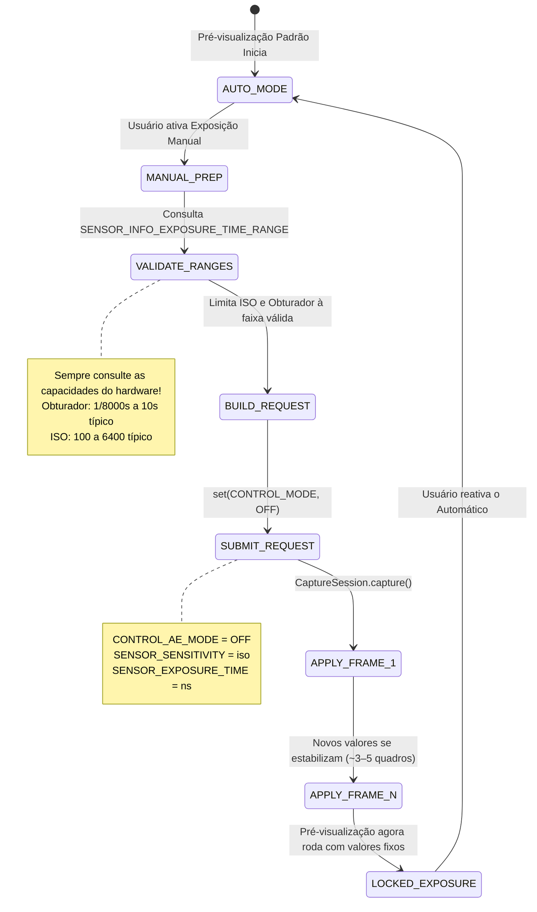

# Capítulo 14: Exposição Manual no Camera2

Com a teoria fotográfica do Capítulo 13 em mãos, é hora de traduzir conceitos em código. Neste capítulo, você aprenderá como **assumir completamente** o sistema de exposição automática (AE) da câmera e definir o ISO e a velocidade do obturador manualmente com a API Camera2.

O [aplicativo Android Camera Parameters](https://github.com/zoozooll/AndroidCameraParameters) demonstra cada técnica deste capítulo — você pode acompanhar ao vivo mudando para o modo Manual no aplicativo e ajustando os seletores de ISO e Obturador para ver resultados em tempo real.

---

## A Grande Mudança: De AUTO → MANUAL

Por padrão, cada `CaptureRequest` que você envia roda sob o pipeline automático 3A integrado da câmera (Exposição Automática, Foco Automático, Balanço de Branco Automático). Para se tornar manual, você deve **desativar explicitamente** esse pipeline.

Existem dois níveis de sobreposição:

| Nível | Configuração | O Que Acontece |
|-------|---------|-------------|
| 1. Desativar apenas o AE | `CONTROL_AE_MODE = OFF` | ISO + obturador tornam-se manuais; AF e AWB ainda rodam automaticamente |
| 2. Desativar todo o 3A | `CONTROL_MODE = OFF` | **Todos** os algoritmos 3A param; cada parâmetro 3A deve ser definido manualmente |

Para uma exposição manual confiável, defina **ambos**. Desativar apenas o `CONTROL_AE_MODE` em alguns dispositivos ainda permite que o pós-processamento do fabricante "ajude" nos bastidores. Definir `CONTROL_MODE = OFF` é o caminho mais limpo e previsível.



**Latência de transição:** Quando você envia uma solicitação de captura manual, os novos valores de ISO/obturador não aparecem no *próximo* quadro. Os sensores CMOS possuem latência de pipeline — o quadro *atual* já está sendo exposto com as configurações antigas. Espere de **3 a 5 quadros de transição** antes que os valores se estabilizem. O [aplicativo Android Camera Parameters](https://play.google.com/store/apps/details?id=com.minininja.cameraparams) espera explicitamente que a `CaptureResult` confirme que os valores solicitados correspondem aos valores aplicados antes de relatar como "travado".

---

## Controles Manuais na API Camera2

### SENSOR_SENSITIVITY (ISO)

O Camera2 expressa o ISO como `CaptureRequest.SENSOR_SENSITIVITY` — um inteiro que mapeia diretamente para a escala aritmética de ISO. Na maioria dos dispositivos, este é um mapeamento 1:1:

| ISO do Fotógrafo | Valor de SENSOR_SENSITIVITY |
|-------------------|--------------------------|
| 100 | 100 |
| 400 | 400 |
| 3200 | 3200 |
| 6400 | 6400 |

**Sempre consulte a faixa válida.** Não defina valores fixos:

```kotlin
val sensorSensitivityRange = characteristics.get(
    CameraCharacteristics.SENSOR_INFO_SENSITIVITY_RANGE
)
val minIso = sensorSensitivityRange?.lower ?: 100
val maxIso = sensorSensitivityRange?.upper ?: 6400
```

Alguns celulares ultra-premium relatam uma faixa como 50–12800, enquanto dispositivos econômicos podem limitá-lo a 100–3200. Valores fora da faixa são restritos pelo HAL — o que anula seu propósito de controle manual.

### SENSOR_EXPOSURE_TIME (Obturador em Nanossegundos)

Aqui está a primeira "pegadinha" que confunde todo novo desenvolvedor Camera2: **a velocidade do obturador é armazenada em nanossegundos (ns), não em segundos.** Humanos pensam em 1/60s; o HAL pensa em 16666666 ns.

A conversão entre eles é uma aritmética simples:

```kotlin
// Segundos → Nanossegundos (multiplicar por 1.000.000.000)
fun secondsToNs(seconds: Double): Long = (seconds * 1_000_000_000.0).toLong()

// Nanossegundos → Segundos para exibição ao usuário
fun nsToSeconds(ns: Long): Double = ns.toDouble() / 1_000_000_000.0

// Formatador de string amigável (ex: "1/60s" ou "2.5s")
fun formatShutter(ns: Long): String {
    val seconds = nsToSeconds(ns)
    return when {
        seconds >= 1.0 -> String.format("%.1fs", seconds)
        else -> {
            val fraction = (1.0 / seconds).toInt()
            "1/${fraction}s"
        }
    }
}
```

**Conversões comuns para referência:**

| Obturador Humano | Nanossegundos (ns) |
|--------------|-------------------|
| 1/8000s | 125.000 |
| 1/1000s | 1.000.000 |
| 1/500s | 2.000.000 |
| 1/120s (regra 180° de 24fps) | 8.333.333 |
| 1/60s | 16.666.666 |
| 1/30s | 33.333.333 |
| 1/15s | 66.666.666 |
| 1s | 1.000.000.000 |
| 2s | 2.000.000.000 |
| 10s | 10.000.000.000 |
| 30s | 30.000.000.000 |

**Novamente, consulte a faixa de hardware:**

```kotlin
val exposureTimeRange = characteristics.get(
    CameraCharacteristics.SENSOR_INFO_EXPOSURE_TIME_RANGE
)
val minShutterNs = exposureTimeRange?.lower ?: 1_000_000L   // mínimo de 1/1000s
val maxShutterNs = exposureTimeRange?.upper ?: 10_000_000_000L  // teto de 10s
```

Em dispositivos que suportam exposição ultra-longa (ex: alguns modelos Sony Xperia e Google Pixel), `SENSOR_INFO_EXPOSURE_TIME_RANGE.upper` pode exceder 30.000.000.000 ns (30s). Respeite este limite — as solicitações além do máximo são silenciosamente limitadas.

---

## ⚠️ Crítico: Degradação de Qualidade no Modo Manual

**Este é o aviso mais importante do capítulo.** Não o pule.

Quando você define `CONTROL_MODE = OFF` (sobreposição manual total), você não está apenas desativando os *algoritmos* AE/AF/AWB — em quase todos os dispositivos Android, você também está **desativando o pós-processamento computacional proprietário do fabricante** que normalmente roda dentro do pipeline 3A.

Especificamente, pesquisas e análises do HAL3 revelam que desativar o 3A normalmente desliga:

| Etapa de Processamento | Modo AUTO | Modo MANUAL (CONTROL_MODE = OFF) |
|-----------------|-----------|-----------------------------------|
| Redução de ruído multi-quadro | ✓ Ativo — saída com ruído reduzido | ✗ DESLIGADO — ruído bruto do sensor visível |
| Mapeamento de tons adaptativo / fusão HDR | ✓ Ativo — realces + sombras recuperados | ✗ DESLIGADO — apenas curva de quadro único |
| Aprimoramento de contraste local (MiraVision, etc.) | ✓ Varia por cena | ✗ Curva genérica plana |
| Medição facial / detecção de cena | ✓ Pesa a exposição para os rostos | ✗ Ignorado |
| Sombreamento de lente / correção de vinheta | ✓ Calibrado por lente | ✗ Frequentemente reduzido ou desligado |

**Resultado:** Uma foto em modo manual a ISO 3200 e 1/15s parecerá *visivelmente pior* (mais ruidosa, contraste mais plano) do que a mesma cena capturada no modo AUTO com o ISO e obturador *idênticos* que o HAL escolheu.

**O que você pode fazer?** Duas opções realistas:

1. **Pós-processar você mesmo.** Como você desativou o processamento do fabricante, você pode aplicar sua própria redução de ruído (ex: filtro bilateral OpenCV, redutor de ruído MediaPipe ou CNN treinada personalizada) em seu pipeline de processamento. A captura RAW (veja capítulos posteriores) + revelação RAW personalizada oferece o máximo controle artístico.

2. **Usar sobreposições de AE manual em vez de CONTROL_MODE = OFF.** Se você só precisa *travar* valores específicos mantendo o processamento do fabricante ativado, tente definir `CONTROL_AE_MODE = ON`, mas fixar `SENSOR_SENSITIVITY` e `SENSOR_EXPOSURE_TIME` solicitação por solicitação. O suporte para este modo misto depende do dispositivo — teste exaustivamente.

O [aplicativo Android Camera Parameters](https://github.com/zoozooll/AndroidCameraParameters) possui uma chave no painel Manual que alterna entre as duas abordagens e permite comparar visualmente a diferença de qualidade.

---

## Exemplo Completo 1: Exposição Travada para Timelapse

Um caso de uso clássico para exposição manual é a **fotografia de timelapse**. No modo AUTO, a câmera ajusta sutilmente a exposição quadro a quadro conforme as nuvens se movem ou a luz muda. O vídeo resultante pisca (flicker) horrivelmente. Travar o ISO + obturador elimina isso.

**Objetivo:** ISO 100, 1/60s (16.666.666 ns) — travado para cada quadro.

```kotlin
class TimelapseManualExposure(
    private val characteristics: CameraCharacteristics,
    private val captureSession: CameraCaptureSession,
    private val imageReaderSurface: Surface,
    private val previewSurface: Surface
) {
    companion object {
        private const val TARGET_ISO = 100
        private const val TARGET_SHUTTER_NS = 16_666_666L // 1/60s
    }

    fun captureTimelapseFrame(frameCallback: ImageReader.OnImageAvailableListener) {
        try {
            // ---- PASSO 1: Validar se os valores solicitados estão na faixa do hardware ----
            val isoRange = characteristics.get(
                CameraCharacteristics.SENSOR_INFO_SENSITIVITY_RANGE
            )
            val shutterRange = characteristics.get(
                CameraCharacteristics.SENSOR_INFO_EXPOSURE_TIME_RANGE
            )

            val clampedIso = isoRange?.let {
                TARGET_ISO.coerceIn(it.lower, it.upper)
            } ?: TARGET_ISO

            val clampedShutter = shutterRange?.let {
                TARGET_SHUTTER_NS.coerceIn(it.lower, it.upper)
            } ?: TARGET_SHUTTER_NS

            // ---- PASSO 2: Construir CaptureRequest com exposição manual ----
            val requestBuilder = captureSession.device.createCaptureRequest(
                CameraDevice.TEMPLATE_STILL_CAPTURE
            ).apply {
                addTarget(previewSurface)
                addTarget(imageReaderSurface)

                // --- AS LINHAS CHAVE: Desativar 3A e fixar valores ---
                set(CaptureRequest.CONTROL_MODE, CameraMetadata.CONTROL_MODE_OFF)
                set(CaptureRequest.CONTROL_AE_MODE, CameraMetadata.CONTROL_AE_MODE_OFF)
                set(CaptureRequest.SENSOR_SENSITIVITY, clampedIso)
                set(CaptureRequest.SENSOR_EXPOSURE_TIME, clampedShutter)

                // Opcional: Fixar o AWB em Daylight para cor consistente também
                set(CaptureRequest.CONTROL_AWB_MODE, CameraMetadata.CONTROL_AWB_MODE_DAYLIGHT)

                // Qualidade JPEG de captura estática
                set(CaptureRequest.JPEG_QUALITY, 95)
            }

            // ---- PASSO 3: Enviar a captura estática ----
            captureSession.capture(
                requestBuilder.build(),
                object : CameraCaptureSession.CaptureCallback() {
                    override fun onCaptureCompleted(
                        session: CameraCaptureSession,
                        request: CaptureRequest,
                        result: TotalCaptureResult
                    ) {
                        // Verificar se o HAL realmente aplicou nossos valores (ele pode limitar!)
                        val appliedIso = result.get(CaptureResult.SENSOR_SENSITIVITY)
                        val appliedShutter = result.get(CaptureResult.SENSOR_EXPOSURE_TIME)
                        Log.d("Timelapse", "Aplicado: ISO=$appliedIso, Obturador=${formatShutter(appliedShutter!!)}")
                    }
                },
                null // Executar no Handler da thread atual
            )

        } catch (e: CameraAccessException) {
            Log.e("Timelapse", "Captura manual falhou", e)
        }
    }
}
```

**Pontos chave:**

- Sempre use `coerceIn()` contra as faixas de hardware. Se o ISO mínimo de um celular econômico for 120, sua solicitação de 100 torna-se silenciosamente 120. O `onCaptureCompleted()` confirma o que foi *realmente* aplicado.
- Para um timelapse, envie esta solicitação a cada N segundos (ex: a cada 5s para uma aceleração de 300× com saída de 30fps).
- Fixar o `CONTROL_AWB_MODE_DAYLIGHT` é opcional, mas recomendado para timelapses — caso contrário, o AWB ainda pode flutuar sutilmente o balanço de branco entre os quadros, mesmo com a exposição travada.

---

## Exemplo Completo 2: Exposição Longa para Fotografia Noturna

**Objetivo:** ISO 3200, 2 segundos (2.000.000.000 ns) — trilhas de água suaves, céu noturno brilhante.

**Requisito crítico de hardware:** O dispositivo deve suportar `SENSOR_INFO_EXPOSURE_TIME_RANGE.upper >= 2.000.000.000 ns`. Muitos celulares intermediários param em ~1/8s a 1s.

```kotlin
class NightLongExposure(
    private val characteristics: CameraCharacteristics,
    private val captureSession: CameraCaptureSession,
    private val previewSurface: Surface,
    private val jpegReaderSurface: Surface,
    private val rawReaderSurface: Surface? // Captura RAW opcional
) {
    fun shootLongExposure(onPhotoSaved: (path: String) -> Unit) {
        val shutterNs = 2_000_000_000L  // 2 segundos
        val targetIso = 3200

        // --- Validar se o hardware pode fazer isso ---
        val shutterRange = characteristics.get(
            CameraCharacteristics.SENSOR_INFO_EXPOSURE_TIME_RANGE
        )
        if (shutterRange == null || shutterRange.upper < shutterNs) {
            throw UnsupportedOperationException(
                "O dispositivo não suporta exposição de 2s. Máx = " +
                "${shutterRange?.upper?.let { nsToSeconds(it) } ?: "desconhecido"}s"
            )
        }

        val requestBuilder = captureSession.device.createCaptureRequest(
            CameraDevice.TEMPLATE_STILL_CAPTURE
        ).apply {
            addTarget(previewSurface)
            addTarget(jpegReaderSurface)
            // Se você configurou uma OutputConfiguration compatível com RAW anteriormente:
            rawReaderSurface?.let { addTarget(it) }

            // Sobreposição de exposição manual
            set(CaptureRequest.CONTROL_MODE, CameraMetadata.CONTROL_MODE_OFF)
            set(CaptureRequest.CONTROL_AE_MODE, CameraMetadata.CONTROL_AE_MODE_OFF)
            set(CaptureRequest.SENSOR_SENSITIVITY, targetIso)
            set(CaptureRequest.SENSOR_EXPOSURE_TIME, shutterNs)

            // --- Crítico para exposições longas ---
            // Desativar estabilização de vídeo óptica/digital (elas conflitam em >1s)
            set(CaptureRequest.LENS_OPTICAL_STABILIZATION_MODE,
                CameraMetadata.LENS_OPTICAL_STABILIZATION_MODE_OFF)
            // Sem flash para fotos de longa exposição
            set(CaptureRequest.CONTROL_AE_MODE, CameraMetadata.CONTROL_AE_MODE_OFF)
        }

        captureSession.capture(
            requestBuilder.build(),
            object : CameraCaptureSession.CaptureCallback() {
                override fun onCaptureStarted(
                    session: CameraCaptureSession,
                    request: CaptureRequest,
                    timestamp: Long
                ) {
                    super.onCaptureStarted(session, request, timestamp)
                    // Notificar a UI: "Exposição iniciada — fique muito parado por 2 segundos"
                    Log.d("LongExposure", "Exposição iniciada @ $timestamp")
                }

                override fun onCaptureCompleted(
                    session: CameraCaptureSession,
                    request: CaptureRequest,
                    result: TotalCaptureResult
                ) {
                    // ImageReader.OnImageAvailableListener dispara separadamente para salvar o JPEG
                    Log.d("LongExposure", "Captura de longa exposição concluída")
                }
            },
            null
        )
    }
}
```

**Dicas para longa exposição:**

1. **Desligue o OIS.** A estabilização óptica de imagem na maioria das lentes tenta compensar o tremor da câmera *durante* a exposição. Para exposições > 0,5s, os atuadores do OIS podem saturar e causar um desvio visível. Desative-o e use um tripé.

2. **Espere um congelamento.** A câmera não emitirá quadros de pré-visualização enquanto uma exposição de 2 segundos estiver rodando. Sua UI deve mostrar um indicador explícito de "EXPONDO…".

3. **RAW é melhor.** ISO alto (3200) + exposição longa produz ruído térmico (o sensor esquenta). Salve um quadro RAW e use um revelador RAW de desktop com média de quadros — ou implemente sua própria longa exposição multi-quadro fazendo a média de 8 quadros de 0,25s em vez de 1 quadro de 2s (reduz drasticamente o ruído térmico).

---

## Exemplo Completo 3: Bracketing de Exposição de 3 Fotos

**Objetivo:** Mesmo ISO, 3 exposições diferentes em −1 EV, 0 EV, +1 EV. O usuário as funde posteriormente em uma foto HDR.

Pelo Capítulo 13, sabemos que cada passo de EV dobra/reduz pela metade a luz. Com um ISO fixo, cada passo de EV = multiplicar/dividir a velocidade do obturador por 2.

```kotlin
class ExposureBracketing(
    private val characteristics: CameraCharacteristics,
    private val captureSession: CameraCaptureSession,
    private val previewSurface: Surface,
    private val jpegReaderSurface: Surface
) {
    data class BracketFrame(
        val label: String,
        val evShift: Double,  // -1.0, 0.0, +1.0
        val shutterNs: Long,
        val iso: Int
    )

    fun captureBracketSeries(baseIso: Int, baseShutterNs: Long) {
        val isoRange = characteristics.get(
            CameraCharacteristics.SENSOR_INFO_SENSITIVITY_RANGE
        )
        val shutterRange = characteristics.get(
            CameraCharacteristics.SENSOR_INFO_EXPOSURE_TIME_RANGE
        )

        // Construir plano de bracketing: multiplicar obturador por 2^(passoEV)
        val frames = listOf(-1.0, 0.0, +1.0).map { ev ->
            val multiplier = Math.pow(2.0, ev)
            val rawShutter = (baseShutterNs.toDouble() * multiplier).toLong()
            val clampedShutter = shutterRange?.let {
                rawShutter.coerceIn(it.lower, it.upper)
            } ?: rawShutter
            val clampedIso = isoRange?.let {
                baseIso.coerceIn(it.lower, it.upper)
            } ?: baseIso
            BracketFrame("EV${if (ev > 0) "+" else ""}${ev.toInt()}", ev, clampedShutter, clampedIso)
        }

        Log.d("Bracket", "Plano: ${frames.map { "${it.label} ISO${it.iso} ${formatShutter(it.shutterNs)}" }}")

        // Enviar cada quadro como um burst usando captureBurst() para atomicidade
        val requestList = frames.map { frame ->
            captureSession.device.createCaptureRequest(
                CameraDevice.TEMPLATE_STILL_CAPTURE
            ).apply {
                addTarget(previewSurface)
                addTarget(jpegReaderSurface)

                set(CaptureRequest.CONTROL_MODE, CameraMetadata.CONTROL_MODE_OFF)
                set(CaptureRequest.CONTROL_AE_MODE, CameraMetadata.CONTROL_AE_MODE_OFF)
                set(CaptureRequest.SENSOR_SENSITIVITY, frame.iso)
                set(CaptureRequest.SENSOR_EXPOSURE_TIME, frame.shutterNs)

                // Etiquetar cada solicitação para podermos ordenar os quadros no callback
                setTag(frame.label)
            }.build()
        }

        captureSession.captureBurst(
            requestList,
            object : CameraCaptureSession.CaptureCallback() {
                override fun onCaptureCompleted(
                    session: CameraCaptureSession,
                    request: CaptureRequest,
                    result: TotalCaptureResult
                ) {
                    val tag = request.tag as? String ?: "?"
                    Log.d("Bracket", "$tag concluído — pronto para fusão HDR")
                }
            },
            null
        )
    }
}
```

**Por que `captureBurst()` em vez de três chamadas `capture()` separadas?** O `captureBurst()` envia toda a lista atomicamente. O HAL garante que nenhum outro quadro de pré-visualização seja intercalado e o estado de foco/balanço de branco não flutuará entre os quadros.

**Quer 5 ou 7 fotos de bracketing?** Apenas mude a `listOf(-2.0, -1.0, 0.0, +1.0, +2.0)` — a matemática escala. Muitos aplicativos HDR profissionais tiram 9 fotos para cenas de alcance dinâmico extremo.

**Etapa de fusão:** Uma vez que você tenha os três quadros JPEG (ou RAW), você pode fundi-los usando:
- O pipeline HDR integrado do Android via `CameraExtensionSession` (veja o capítulo HDR).
- Uma biblioteca de terceiros como o `createMergeDebevec()` / `createMergeRobertson()` do OpenCV para fusão de exposição real.
- A biblioteca HDR Photo Sphere do Google.

---

## Solução de Problemas Comuns

| Problema | Causa Provável | Correção |
|---------|-------------|-----|
| Valores manuais parecem ignorados, ainda parece automático | `CONTROL_MODE` não definido como OFF, ou valores limitados | Defina tanto CONTROL_MODE quanto CONTROL_AE_MODE como OFF; verifique os valores aplicados em `onCaptureCompleted()` |
| Solicitação de exposição longa de 2s dá erro imediatamente | O dispositivo não pode fazer exposição de 2s | Verifique `SENSOR_INFO_EXPOSURE_TIME_RANGE.upper`; reduza o tempo de exposição ou use aumento de ISO em vez disso |
| A pré-visualização engasga ou atrasa ao mudar o manual | Muitas chamadas `setRepeatingRequest()` | Use um listener de slider limitado (a cada 30–50 ms); atualize apenas a solicitação repetida, não as capturas estáticas |
| Foto de longa exposição está toda preta em ISO 100 2s | A cena realmente precisa de mais luz em ISO 100 | Aumente o ISO ou estenda o obturador; 2s ISO 100 = linha de base EV 0, não "brilho noturno" |
| Fotos manuais com mais ruído que o Automático no mesmo ISO | NR do fabricante desativado por CONTROL_MODE = OFF | Comportamento esperado! Veja a seção "Degradação de Qualidade no Modo Manual". Pós-processe ou use manual parcial via AE_LOCK |

---

## Resumo

Você agora tem as ferramentas para arrancar o controle total da exposição do HAL do Camera2:

- **Desativar o pipeline 3A** com `CONTROL_MODE = OFF` + `CONTROL_AE_MODE = OFF` para controle totalmente manual.
- **Mapear ISO → `SENSOR_SENSITIVITY`** (mapeamento 1:1 na maioria dos hardwares; sempre consulte a faixa).
- **Mapear segundos ↔ nanossegundos** para `SENSOR_EXPOSURE_TIME` com conversão simples de 10⁹.
- **Trava de timelapse:** ISO 100 fixo + 1/60s repetido para cada quadro = zero flicker.
- **Exposição longa noturna:** ISO 3200 + 2s com OIS desativado = cena noturna brilhante e suave (em hardware compatível).
- **Bracketing de exposição:** Mesmo ISO, obturador ×0,5 / ×1 / ×2 via `captureBurst()` = entrada HDR pronta para fusão.
- **⚠️ Compensação de qualidade manual:** Desativar o 3A desativa a redução de ruído e o mapeamento de tons do fabricante — fotos manuais frequentemente parecem *piores* no mesmo ISO que o Automático. Planeje o pós-processamento.

## O Que Vem a Seguir

A exposição controla o *brilho*. **O foco controla a nitidez.** No **Capítulo 15: Foco**, cobrimos:

- Estados e modos de Foco Automático (AF) — como a varredura passiva funciona, a diferença entre foto contínua vs. vídeo.
- Foco manual com `LENS_FOCUS_DISTANCE` em dioptrias (0.0 = infinito, 10D = 0.1m).
- Código Kotlin para uma sequência de disparo único de gatilho e captura AF, e um seletor SeekBar de foco manual.
- A máquina de estados AF — quando o `CONTROL_AF_STATE_FOCUSED_LOCKED` realmente dispara e como esperar por ele.

O desfoque para aqui.
